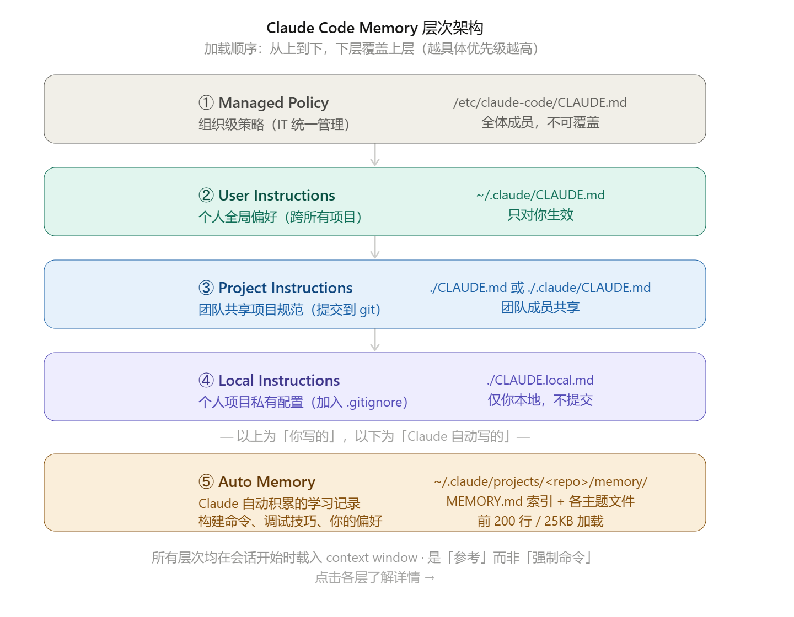

<!--
 * @Author: JohnJeep
 * @Date: 2026-05-31 10:13:59
 * @LastEditors: JohnJeep
 * @LastEditTime: 2026-06-27 21:55:26
 * @Description: Claude Code Using
 * Copyright (c) 2026 by John Jeep, All Rights Reserved. 
-->

## 1. .Claude

`CLAUDE.md` 是你在项目根目录添加的一个 Markdown 文件，Claude Code 在每次会话开始时都会自动读取它。 它的作用就像给
Claude 的"永久说明书"。

**放在哪里？**

- `.claude/CLAUDE.md` 或项目根目录的 `CLAUDE.md` — 项目级配置（建议提交到 git，团队共享）；
- `~/.claude/CLAUDE.md` — 用户级配置（适用于你所有项目的个人偏好）；**项目根目录的 `CLAUDE.md` 会在每次 session
  开始时加载。也就是说，它会永久消耗 token。**

写什么内容？

```markdown
# 项目规范

## 技术栈
- 使用 TypeScript，不用 JavaScript
- 测试框架：Vitest
- 代码风格：遵循 Prettier 配置

## 常用命令
- 启动：npm run dev
- 测试：npm run test
- 构建：npm run build

## 注意事项
- 所有 API 调用必须加错误处理
- 禁止直接修改 node_modules
```
- 全局的`~/.claude/CLAUDE.md` 最好控制在 200 行以内。超过这个范围后，Claude
  对指令的遵守程度会明显下降。如果上下文越来越大，可以用 `.claude/rules/` 目录做模块化规则管理。
- 写入你的语言偏好、技术栈、代码风格规则，以及任何你已经重复解释超过两次的东西。

---

各个文件加载的时机。

| 文件                     | 加载时机               |
| ------------------------ | ---------------------- |
| `~/.claude/CLAUDE.md`    | 每次会话启动时（全局） |
| `<项目根>/CLAUDE.md`     | 进入该项目时           |
| `<任意子目录>/CLAUDE.md` | 在该子目录工作时       |
| `.claude/settings.json`  | 每次会话启动时         |

---

让 Claude 明确知道几件事情

- 你的工作。
- 你的沟通风格。
- 你的主要工具。
- 你正在进行的项目。
- 你的硬性约束。


仓库中配置好的 `.claude` 目录结构如下：

```
.claude/

.claude/
├── CLAUDE.md
├── rules/
│   ├── langgraph.md
│   ├── retrieval.md
│   ├── tests.md
│   └── python-types.md
├── agents/
│   ├── retrieval-reviewer.md
│   ├── prompt-auditor.md
│   └── eval-runner.md
├── skills/
│   ├── new-rag-eval/
│   │   └── SKILL.md
│   └── claude-pr-checklist/
│       └── SKILL.md
├── settings.json
└── .mcp.json
```


**准则**

> 不要文件多，要每个文件都很短、很准、很有边界。

1. Memory：短而强制，建议控制在 500 tokens 以下，200 行以内，语气用命令式；
2. 告诉 Memory 要做什么，而不是塞知识库，放真正高频、关键、会影响决策的规则；
3. 复杂的任务，先执行 Plan Mode；
4. 每个 rules 文件只负责某个路径下的行为；
5. 每个 subagent 大概三十行；
6. hooks 只做一个 pre-tool gate 和一个 post-tool formatter
7. MCP server 也不是装几十个，而是只保留几个真正有用的；


### 1.1. path-scoped rules

处理文件级、目录级的规则。

这种模式通常用 YAML frontmatter。你定义一组 glob paths，只有当 Claude 触碰匹配文件时，规则才会被加载，平时，它不消耗
token

**只在需要时才会被触发加载。**


### 1.2. plan mode

先思考，再动手。

先根据执行的上下文，生成一个明确的计划文档，让你先审阅、修改、确认，然后才进行实施。


## 2. Proxy

对国内用户而言，要使用代理，才能访问 Anthropic 公司的 Claude Code。

### 2.1. WSL2 Proxy


wls2 下 使用 vscode 插件 [claude code for vscode]的 UI 模式，只需打开代理软件 clash-verge，设置
[系统代理]、[虚拟网卡模式] 即可。

wsl2 的 terminal 中使用 claude，设置系统代理，bash 或者 zsh 中添加 proxy 配置：
```bash
# clash-verge 的混合 port 是 7897
export WIN_IP=$(cat /etc/resolv.conf | grep nameserver | awk '{print $2}')
export HTTP_PROXY="http://${WIN_IP}:7897"
export HTTPS_PROXY="http://${WIN_IP}:7897"

# 验证是否能访问claude API
#curl -v https://api.anthropic.com/v1/models
```

注：开启 [虚拟网卡模式] 后，不需要另外再 vscode settings 中添加 proxy。


### 2.2. ubuntu Container Proxy

Clash Verge 在 Windows 上通常监听 `127.0.0.1:7897`（HTTP/SOCKS5 混合端口，具体看你 Clash Verge 的端口设置）。容器要访问这个代理，需要用宿主机的地址而不是 `127.0.0.1`（容器里的 `127.0.0.1` 指向容器自己）。

**第一步：确认 Clash Verge 端口和监听地址**

- 打开 Clash Verge → 设置，看 "混合端口" 或 "HTTP 端口"（默认常见是 7890）
- 确保 Clash Verge 允许局域网连接（Allow LAN / 允许局域网连接 开关打开），否则容器连不进来

**第二步：容器内配置代理**

Hyper-V 后端下，从容器访问 Windows 宿主机，通常用 `host.docker.internal` 这个特殊域名（Docker Desktop 自动配置好的）：

临时测试（在容器内执行）：

```bash
export http_proxy=http://host.docker.internal:7897
export https_proxy=http://host.docker.internal:7897
```

测试：

```bash
curl -I https://www.google.com
```

**第三步：固化到 `.zshrc`（如果想长期生效）**

```bash
echo 'export http_proxy=http://host.docker.internal:7897' >> ~/.zshrc
echo 'export https_proxy=http://host.docker.internal:7897' >> ~/.zshrc
echo 'export no_proxy=localhost,127.0.0.1' >> ~/.zshrc
source ~/.zshrc
```

**第四步：apt 也走代理（可选）**

```bash
sudo tee /etc/apt/apt.conf.d/proxy.conf << 'EOF'
Acquire::http::Proxy "http://host.docker.internal:7899";
Acquire::https::Proxy "http://host.docker.internal:7899";
EOF
```

**注意：**

1. **Clash Verge 必须开启"允许局域网连接"**，否则容器（对 Clash 来说相当于局域网内的另一台机器）连不上
2. 如果 `host.docker.internal` 解析不通，可以试试用宿主机的实际局域网 IP 替代
3. 如果你的 Clash Verge 设置了"仅本地回环监听"，需要改成监听 `0.0.0.0` 才能被容器访问

先检查一下 Clash Verge 里"允许局域网连接"是否开启，这是最常见的卡点。

---

**如果 `host.docker.internal` 不可用**（某些网络模式下可能没有），备选方案是查看 `eth0` 的网关地址，Docker bridge 网络下网关通常就是宿主机在该虚拟网络里的地址：

```bash
ip route | grep default
```

输出类似：

```
default via 172.17.0.1 dev eth0
```

这个 `172.17.0.1` 通常就是宿主机侧的网关地址。然后在 .bashrc 或者 .zshrc 中添加对应的代理配置

```bash
# clash-verge 的混合 port 是 7897
export HOST_IP=$(ip route | grep default | awk '{print $3}')
export HTTP_PROXY="http://${HOST_IP}:7897"
export HTTPS_PROXY="http://${HOST_IP}:7897"

# 验证是否能访问claude API
#curl -v https://api.anthropic.com/v1/models
```


## 3. Commands

常用 CLI:

```
/init: 初始化 session，扫描当前项目并自动生成 CLAUDE.md 文件，快速建立项目记忆；
/clear: 清空对话历史，切换任务时避免旧上下文干扰；
/model opus4.7: 切换 model；
/compact: 压缩当前对话上下文，释放 token 空间，适合长会话或复杂任务；
/context: 查看上下文；
/memory: 打开交互界面，可以查看和编辑当前的 CLAUDE.md 内容；
/resume: 恢复以前的 conversion；
/plan: 创建 plan；
/review: 触发代码审查工作流
/help: 显示所有可用命令，包括自定义命令，支持自动补全
/exit: 正确退出当前会话（而非直接关闭终端）
/config: 打开配置菜单，调整模型选择、工具权限等设置
/doctor: 对 Claude Code 安装进行健康检查，排查配置或连接问题
/usage: 查看当前 token 消耗，监控费用，适合长时间或高强度会话

/teleport: Resume a Claude Code session from claude.ai
/loop: 让 claude 按照设定的时间间隔自动运行
/schedule:

/branch: fork 当前 session；
/btw: agent 中随时提问，不会打断当前运行的任务；
/batch: 并行大规模的变更；
/add-dir: 增加一个新的工作目录；
/voice: 用语音输入；
/usage-report: 生成月度分析报告，看自己的时间花在哪里；
/remote-control: 手机上远程控制 电脑；
```


快捷键

```bash
/ : 唤醒命令
@: 添加文件
#: 输入 # 开头的内容，会创建一个 仅限当前会话 的临时指令，加载到当前对话上下文中，但不会写入 CLAUDE.md 文件，也不会持久化到下次会话。
! cmd: session 中直接执行命令行指令
```


命令行 CLI 启动标志

```bash
claude  -w: w 是 worktree 的简写，使用 git worktree；
claude -p:  默认的运行方式；
claude --bare ：提升 SDK 启动速度；
claude  --agent：给 claude code指定自定义系统提示和工具 ；
```


## 4. Skills

**Skills 就是可复用的工作流，解决重复性的工作**。每个 Skill 是一个 `SKILL.md` ，里面有带 YAML frontmatter 的 markdown
文件放在 `.claude/skills/` 目录下。
创建后你可以用斜杠命令（如 `/review-pr`）调用，Claude 也会根据任务上下文自动触发相关 Skill。

**它的架构依赖 progressive disclosure**：metadata 在 session 启动时加载； 真正的 instructions 只有触发 skill
时才加载； 捆绑资源只有被引用时才加载。

Skills 处理的是 thinking layer，它们告诉 Agent 应该如何理解一个系统，或者应该遵循什么架构模式。

**创建一个 Skill：**

文件路径：`.claude/skills/review-pr/SKILL.md`

```markdown
---
name: review-pr
description: 审查 Pull Request，检查代码质量、安全漏洞和风格规范
---

请对以下 PR 进行全面审查：
1. 检查代码逻辑错误
2. 检查潜在安全风险
3. 确认符合项目编码规范
4. 检查是否有遗漏的测试用例

审查对象：$ARGUMENTS
```


### 4.1. document-skills

用一条命令处理 PDF、XLSX、DOCX 和 PPTX 的生成。

安装方式

```bash
/plugin install document-skills@anthropic-agent-skills
```

如果你没装这个 bundle，却直接让模型“创建一个 PDF”，大概率得到的只是一个顶部写着 PDF 的 markdown 文本。

因为语言模型本质上生成的是文本，不是二进制文件格式。装上这个 bundle 后，Agent 才能真正产出一个 `.pdf` 或 `.xlsx`
文件，让工程以外的人也能打开、阅读和使用。


## 5. MCP

MCP 的全称是 Model Context Protocol，用来把 agent 接到外部工具上。

`mcp-builder` skill 解决的正是本地逻辑和外部状态之间的断层。

Skills 处理的是 thinking layer。它们告诉 Agent 应该如何理解一个系统，或者应该遵循什么架构模式。

MCP servers 处理的是 doing layer。它们负责实时数据、持久状态、OAuth 流程和外部 API 调用。

当你需要连接一个新的内部 billing API 时，`mcp-builder` 可以根据一句自然语言描述，生成所需的 MCP server。


### 5.1. GitHub MCP Server

- **功能描述**：允许 Claude 搜索仓库、阅读代码、开启 Issue 并创建 PR。
- **核心价值**：你不再需要手动复制粘贴代码，直接指令：“分析 src/ 目录并修复 [#42](javascript:;) 号问题”，Claude
  会自动完成搜索、阅读、提议并提交 PR。
- **安装方式**：Anthropic 官方插件市场直接启用。


###  5.2. Brave Search MCP

- **功能描述**：将 Claude 连接至**实时互联网**。
- **核心价值**：打破 AI 训练数据的截止日期。无论是调研本周的 AI 动态、查股价还是验证事实，它都能提供最新的合成信息。
- **适用场景**：实时科研、事实核查与新闻汇总。


## 6. Hooks

Hooks 的作用，是让 agent 在更少人工盯着的情况下安全运行。

用 hooks 在 Agent 生命周期中确定性地执行
cowork dispatch: 手机上远程操作电脑


## 7. Plugins

Plugin 是将 MCP 服务器、斜杠命令、Skills 打包在一起的版本化集合，可以通过市场进行分发。 简单说，Plugin
就是多个功能的"合集安装包"。

Claude 插件的基石是 **MCP**——这是 Anthropic 在 2025 年 12 月发布的开放标准。它规范了 AI
模型与外部数据及工具的连接方式，终结了以往每个服务都需要定制化集成的繁琐历史。 

**Plugin 包含什么：**

- MCP Servers：将 Claude 连接至外部服务（如 GitHub、数据库）。
- Skills (技能)：Claude 在特定场景下自动激活的功能。
- Commands (命令)：如 `/code-review` 这样的自定义快捷指令。
- Hooks (钩子)：由事件触发的自动化操作（如强制执行代码规范）。

**安装社区 Plugin（示例）：**

```bash
# 在 Claude Code 中运行
/install-plugin context7   # 安装实时文档插件
```

`context7` 是一个流行的插件，它通过 MCP 服务器将最新的版本化 API 文档（如 React、Next.js、Prisma）实时注入到你的
Claude Code 会话中，解决训练数据过时的问题。

### 7.1. Feature-Dev

- **功能描述**：通过 7 阶段工作流，将需求直接转化为生产环境代码。
- **核心价值**：大多数 AI 只会“写代码”，而 Feature-Dev 模拟的是**高级工程师的思维模型**。它包含需求拆解、架构探索、设
  计方案、实现、测试、评审及文档生成全流程。
- **适用场景**：构建完整的功能模块，而非零散的代码片段。
- **安装指令**：`/plugin install feature-dev@claude-plugins-official`


### 7.2. Frontend-Design

- **功能描述**：在动笔写 CSS 之前，赋予 Claude 专业设计师的直觉。
- **核心价值**：它能帮 Claude 摆脱那种廉价的“AI 审美”。插件会让 AI
  考虑品牌语调、视觉约束、不对称布局以及滚动触发动画。
- **用户反馈**：“很多人问我设计师是谁，其实只有装了插件的 Claude。”
- **安装指令**：`npx skills add anthropic/frontend-design`


## 8. Agents

Agents 用于多任务并行处理。

Claude Code 内置的 subagents:
- explore agent 负责只读代码库搜索；
- general-purpose agent 处理需要干净上下文的多步骤任务；
- code-reviewer 和 code-architect 则负责更专门的角色 p；


## 9. Memory Hierarchy



根据官方文档，Claude Code 的 memory 机制共有 **5 层**，分为两大类：你手写的（CLAUDE.md 系列）和 Claude 自动写的（Auto
Memory）。

------

### 9.1. 第一类：CLAUDE.md 系列（你写的指令）

每次 Claude Code 会话开始时都有一个全新的上下文窗口，有两套机制负责跨会话传递知识：CLAUDE.md
文件（你写的持久化指令）和 Auto Memory（Claude 根据你的习惯自动记录的笔记）。

#### 9.1.1. ① Managed Policy — 组织级

Managed Policy 是由 IT / DevOps 统一管理的组织级指令，用于公司编码标准、安全策略、合规要求等。文件路径在 Linux/WSL
下是
`/etc/claude-code/CLAUDE.md`。它对组织内所有用户生效，**不能被个人覆盖**。

这一层主要是企业场景用，个人开发者通常不需要关心。

#### 9.1.2. ② User Instructions — 用户级

用户级指令文件路径是 `~/.claude/CLAUDE.md`，存放你在**所有项目**中都适用的个人偏好，比如代码风格偏好、个人工具快捷方式
等。只对你自己生效。

适合写类似这样的内容：

```markdown
- 我偏好用 fish shell，不用 bash
- 代码注释用中文
- 提交信息遵循 Conventional Commits
```

#### 9.1.3. ③ Project Instructions — 项目级

项目级配置文件放在 `./CLAUDE.md` 或 `./.claude/CLAUDE.md`，存放团队共享的项目指令，通过版本控制与团队共享。适合写：项
目架构说明、编码规范、常用命令、命名约定等。

这是最常用的一层，运行 `/init` 可以让 Claude 自动分析你的代码库并生成初始版本。

#### 9.1.4. ④ Local Instructions — 本地私有配置

本地配置文件 `./CLAUDE.local.md` 是个人专属的项目级私有配置，应加入 `.gitignore`，不会提交到版本控制。适合放沙箱
URL、本地测试数据、你个人的临时调试笔记等。

```markdown
# 我的本地配置（不要提交）
- 本地 API 地址：http://localhost:8080
- 测试账号：test@example.com
```

------

### 9.2. 第二类：Auto Memory（Claude 自动写的）

#### 9.2.1. ⑤ Auto Memory — 自动学习记忆

Auto Memory 让 Claude 在不需要你手写任何内容的情况下，跨会话积累知识。Claude
在工作过程中自动保存笔记：构建命令、调试技巧、架构说明、代码风格偏好、工作流习惯等。

Auto Memory 是 Claude 自己维护的一个 Markdown 文件目录。会话开始时，它加载一个索引文件
`MEMORY.md`，该索引指向各个主题的具体记忆文件，Claude
读取相关文件，并在学到新东西时写入新的记录。文件存储在 `~/.claude/projects/<项目名>/memory/` 下，是纯文本
Markdown，你可以直接查看、编辑、删除。

每次会话开始时，`MEMORY.md` 只加载前 200 行或 25KB（取较小值），超出部分不会进入上下文。`/compact` 压缩对话时不影响
memory 文件，压缩后 MEMORY.md 和 CLAUDE.md
都会从磁盘重新读取并重新注入上下文。

用 `/memory` 命令可以查看和管理当前会话的所有记忆。

------

### 9.3. 加载顺序与优先级规则

CLAUDE.md 文件根据目录树向上遍历来加载。如果你在 `foo/bar/` 目录下运行 Claude Code，它会依次加载
`foo/bar/CLAUDE.md`、`foo/CLAUDE.md` 以及同目录的
`CLAUDE.local.md`。所有文件会被**拼接合并**到上下文中，而不是互相覆盖。从文件系统根目录到当前工作目录，顺序是由上到下
，越靠近工作目录的文件越晚被读取（即优先级越高）。

一个关键注意点：这些文件加载到上下文窗口后，Claude 将其视为**参考上下文，而非强制执行的配置**。如果想不管 Claude
怎么想都强制执行某个操作限制，需要使用 PreToolUse Hook 而不是写在 CLAUDE.md
里。

------

### 9.4. 一句话总结每层的用途

| 层次           | 谁写        | 写什么         | 适合场景       |
| -------------- | ----------- | -------------- | -------------- |
| Managed Policy | IT 管理员   | 公司合规要求   | 企业统一管控   |
| User           | 你          | 全局个人偏好   | 跨项目通用习惯 |
| Project        | 团队        | 项目架构与规范 | 团队协作共享   |
| Local          | 你          | 私有临时配置   | 本地调试数据   |
| Auto Memory    | Claude 自动 | 学习到的知识   | 无需手动维护   |

实际日常使用，作为个人开发者你只需要关心三个文件：`~/.claude/CLAUDE.md`（全局偏好）、`./CLAUDE.md`（项目规范）、`./CLA
UDE.local.md`（本地私有）——Auto Memory
开箱即用，不需要你操心。

**项目根目录的 `CLAUDE.md` 会在每次 session 开始时加载，会永久消耗 token。**


## 10. Claude Code develop

Claude Code 的客户端是用 **TypeScript** 开发的，运行在 **Node.js / Bun** 运行时上。具体技术栈如下：

- **语言**：[TypeScript](https://www.typescriptlang.org/docs/)
- **运行时**：[Bun](https://bun.com/)（推荐）或 [Node.js](https://nodejs.org/en)
- **终端 UI**：[React](https://react.dev/) + [Ink](https://github.com/vadimdemedes/ink)（一个用 React 构建命令行界面的库）+ [chalk](https://github.com/chalk/chalk) (终端彩色输出)
- **CLI 框架**：[Commander.js](https://github.com/tj/commander.js)

Claude Code 的终端界面相当复杂（流式输出、多面板、交互操作），而 [Ink](https://github.com/vadimdemedes/ink) 允许用 React 组件写 TUI（Terminal UI）。TypeScript 天然支持 JSX/TSX，这个技术栈几乎没有其他语言能直接替代。

Anthropic 官方的 `@anthropic-ai/sdk` 本身是 TypeScript 写的，Claude Code 调用自家 API 时可以直接获得完整的类型提示和 IntelliSense，开发效率更高。
