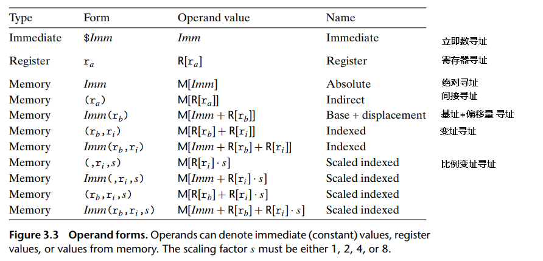
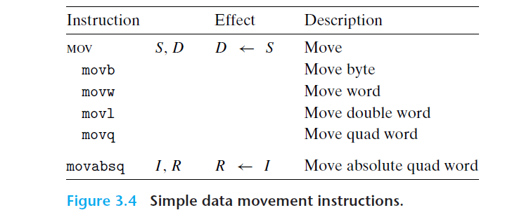
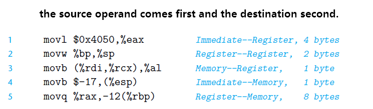
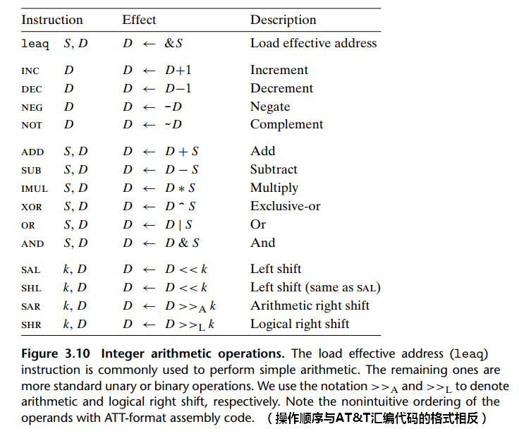

<!--
 * @Author: JohnJeep
 * @Date: 2020-05-18 21:33:28
 * @LastEditTime: 2020-09-27 08:50:12
 * @LastEditors: Please set LastEditors
 * @Description: 常用的通用寄存器
-->
<!-- TOC -->

- [1. instruction(指令)](#1-instruction指令)
- [2. Register(寄存器)](#2-register寄存器)
- [3. Machine-Level Representation](#3-machine-level-representation)
  - [3.1. Operand Specifiers(操作数指示符)](#31-operand-specifiers操作数指示符)
  - [3.2. Data Movement Instructions(数据移动指令)](#32-data-movement-instructions数据移动指令)
  - [3.3. Pushing and Popping Stack Data](#33-pushing-and-popping-stack-data)
  - [3.4. Arithmetic and Logical Operations(算术与逻辑运算)](#34-arithmetic-and-logical-operations算术与逻辑运算)
    - [3.4.1. lea(load effective address)：加载有效地址](#341-leaload-effective-address加载有效地址)
    - [3.4.2. unary && binary](#342-unary--binary)
    - [3.4.3. shifts](#343-shifts)
  - [3.5. Control Instruction(控制指令)](#35-control-instruction控制指令)
  - [3.6. Jump Instruction(跳转指令)](#36-jump-instruction跳转指令)

<!-- /TOC -->

# 1. instruction(指令)
- `DCD`：指令可分配一个或多个字的内存，在四个字节的边界上对齐，并定义内存的运行时初值
- DCDU`：与之相同，不过内存对齐是任意的
- 分段：在实模式下通过偏移一个段寄存器的4位再加上16位偏移量，形成一个20位的物理地址


# 2. Register(寄存器) 
Inter 8086架构有16个处理器，可供程序员使用的有14个16位的寄存器；有16位宽数据总线和地址总线，20位宽的外部地址总线。

> Intel架构的处理器，指令集命令规则演变：最初的8086中有8个 `16 bite` 的寄存器，习惯命名为 `%ax---%bp`，然后扩展到IA32架构时，命名标号变为 `%eax---%ebp`，最后扩展到X86-64架构后，原来的8个寄存器由 `32 bite`变为 `64 bite`，标号也变为 `%rax---%rbp`，还新增了 8 个新的寄存器，标号按照新的命名规则制定的 `%r8---%r15`。


- 8个通用寄存器：
  - 4个数据寄存器
    - `EAX(Extended Accumulator X)`	 累加寄存器
    - `EBP(Extended Base Register X)`	 基址寄存器
    - `ECX(Extended Counting X	 )`  计数寄存器
    - `EDX(Extended Data Register)`  数据寄存器

  - 2个变址寄存器
    - `EDI(Extended Destination Indexing)`  目的变址寄存器
    - `ESI(Extended Source Indexing)     `  源变址寄存器

  - 2个指针寄存器
    - `ESP(Extended Stack Pointer)`	栈指针寄存器：用来指明运行时栈的结束位置。
    - `EBP(Extended Base pointer )`  基址指针寄存器

- 4个16位段寄存器 
  > 段的起始地址称为段寄存器 
  - `CS(Code Segment) ` 代码段寄存器 
  - `DS(Data Segment) ` 数据段寄存器 
  - `SS(Stack Segment)` 堆栈段寄存器 
  - `ES(Extra Segment)` 附加段寄存器 

- `EIP(Extended Instructions Pointer)`	指令指针寄存器 
- `EFR(Extended Flag Register)       `   标志寄存器


# 3. Machine-Level Representation
- 缩写
  - CISC(Complex Instruction Set Computer): 复杂指令集计算机
  - RISC(Reduced Instruction  Set Computer) ：精简指令集计算机
  - ARM：Acorn Risc Machine
  - OA(Offset Address)： 偏移地址
  - EA(Effective Address)：有效地址

- 反汇编器(disassembler): 根据机器代码产生一种类似于汇编代码的程序。
- GCC和 `Objdump` 工具产生的汇编代码默认使用的是 `AT&T公司` 拟定的格式。
- 在GCC中使用一些参数可以产生Intel公司拟定的汇编代码格式：` gcc test.c -S  -masm=intel`


- 参考
  - [Assembly language primer](http://www.unige.ch/medecine/nouspikel/ti99/assembly.htm#JUMPs) 

## 3.1. Operand Specifiers(操作数指示符)
大多数指令有一个或多个 Operand Specifiers，其中源数据(source values) 放置可执行的操作，目的位置(destination) 放置计算的结果。

- Source values 支持的操作数(operand)格式
  - constants(常数，也叫立即数)
  - read from registers or memory(从寄存器或内存中读出的数)
- Destination of Result 目的位置计算的结果支持的操作数格式
  - Register(寄存器)
  - Memory(内存)  


各种不同的操作数可分为下面三种类型 
- Immediate(立即数)：表示常数值
  - 在AT&T公司格式的汇编代码中，立即数的书写是 `$` 后面跟一个用标准C表示法表示的整数。例如：`$-577` 或 `$0x1F ` 

- Register(寄存器)：表示某个寄存器中的内容
  - 用符号 $r_a$ 表示任意寄存器 a，用引用 $R[r_a]$ 表示它的值，这是将寄存器集合看成一个数组 R，用寄存器标识符作为index(索引)。
  - 可以把16个寄存器的低8位，16位，32位或64位中的一个来作为操作数。

- memory reference(内存引用)：根据计算出来的地址去访问某个内存的位置。
  - 可以将内存看成是一个很大的字节数组 (we view the memory as a large array of bytes)。 
  - 用符号 $M_b[Addr]$ 表示：对存储在内存中从地址 Addr开始的 b 个字节值的reference(引用)。

  - 汇编语言中常用的内存引用格式为 $Imm(r_{b}, r_{i}, s)$，因此有效地址的计算公式为：$Imm + R[r_b] + R[r_i]*s$
    - Imm: immediate offset (立即数偏移)
    - $r_b$: base register(64-bit基址寄存器)
    - $r_i$: index register(64-bit变址寄存器)
    - s: scale factor(比例因子，s必须是1、2、4或8)
  


## 3.2. Data Movement Instructions(数据移动指令)
指令集的表示方式： `[标号:] 操作码 [操作数] [;注释]`，其中带有 `[]` 的部分为可选项。

<font color=red>注意：</font>
GNU汇编器默认采用 AT&T 样式的语法，其中的源和目的操作数与 Intel 公司标准中拟定的格式顺序是相反的。


- mov
  - Intel架构下的格式：`mov dest, src`；AT&T公司规定的格式：`mov source destination`
  - 功能：将source位置中的数据copy到destination位置中。注意：执行这个操作需要两条指令，第一条指令将源值(source value)加载到寄存器中，第二条指令将该寄存器值写入目的位置(destination)。
  - source operand(源操作数)支持以下几种类型
    - Immediate(立即数)
    - Register(寄存器)
    - Memory(内存) 
  - destination operand(目的操作数)支持以下几种类型
    - Register(寄存器)
    - Memory address (内存地址)

  <font color=red>注意：</font> source与destination两个不能同时为 memory location(内存位置)。


  - 几种简单的mov指令
    - movb: move byte(移动字节)
    - movw: move word(移动字)
    - movl: move double word(32 bit 数据被看成是long word，因此用后缀“l” 表示双字)
    - movq: move quad word(移动四字)
     
    > 常规的 `movq` 指令只能以表示为32位补码数字的立即数作为源操作数，然后把这个值符号扩展得到64位的值，放到目的(destination)位置。`movabsq` 指令能够以任意6位立即数值作为源操作数(source operand)，并且只能以寄存器(register)作为目的(destination)。

  - 上面几个指令实现的例子
    

  <font color=red>注意：</font>
  大多数情况中，mov指令只会更新 destination operand 指定的寄存器字节和内存位置；但是当mov指令的destination 为寄存器时，它会把该寄存器的高位 4字节设置为0，原因是：任意的生成32 bit 值的指令都会将该register的高位设置为0。


- 两类数据移动指令：将较小的 source 拷贝到 destination中。MOVZ中的指令把destination中剩余的字节补充为 0，MOVS类中的指令通过符号扩充来填充，把source operand 的最高位进行拷贝。


  <font color=red>注意：</font>
  `cltq` 指令：它没有操作数，总是以 `%eax` 为source；`%rax` 为destination，作为符号扩展的结果。


## 3.3. Pushing and Popping Stack Data
stack的栈顶元素的地址是栈中元素地址最小的，因此栈具有向下增长的特性。

- pushq: push quad word(每次压栈按4字为单位进行压栈)
- pop ：从stack中弹出数据 
- 压栈和出栈指令
  
  ```
  执行一条 pushq %rbp 等价于执行下面两条指令
  subq $8, %rsp                    // Decrement stack pointer
  movq %rbp, (%rsp)                // Store %rbp on stack

  执行一条 popq %rax 等价于执行下面两条指令
  movq (%rsp), %rax                // Read %rax from stack
  addq $8, %rsp                    // Increment stack pointer
  ```


## 3.4. Arithmetic and Logical Operations(算术与逻辑运算)
下面表中有四组操作(operations)：加载有效地址(load effective address)、一元操作(unary)、二元操作(binary)、移位(shifts)。其中一元操作只有一个操作数，二元操作有两个操作数(operand)



### 3.4.1. lea(load effective address)：加载有效地址
- lea是mov指令的一个变形，从内存（memory）读数据到寄存器（register）。该指令并不是从指定的位置读入数据，而是将有效地址写入到目的操作数。
- lea指令通常用来执行简单的算术操作，能执行加法和有限形式的乘法。
- 指令：`leaq src dst`
   - `leaq 7(%rax, %rax, 4) %rdx`：将 %rax 寄存器指向的地址中的值存储到 %rdx寄存器中，其中寄存器 %rdx 的值为x，寄存器 %rax 的值设置为：`(x + 4*x) + 7`


### 3.4.2. unary && binary
- 只有一个操作数，既是source又是destination，这个操作数可以是register，也可以是memory location(内存位置)。
- 有两个操作数，第一个为source，第二个为destination 
  - 第一个操作数可以是： immediate value(立即数)、register、memory location；
  - 第二个操作数可以是：register、memory location
    > 当第二个操作数为 memory location时，processor(处理器)必须从memory里读数据，执行操作，将结果写回入到memory(内存)中。
- 示例：`subq %rax,%rdx`：表示从 %rdx 寄存器中减去 %rax

- 示例：
```
Address     Value   Register      Value
-------------------------------------------
0x100       0xFF    %rax          0x100
0x108       0xAB    %rcx          0x1
0x110       0x13    %rdx          0x3
0x118       0x11

incq(%rsp)           // 使栈顶指针的 8-byte 元素值加一

incq 16(%rcx)        // 将源操作数 %rcx 的地址加上十进制的立即数 16，取出源操作数地址内的值并加一，其结果为目的操作数(0x14)并替换调原来的源操作数，。
addq %rcx, (%rax)    // 源操作数%rcx的值，加上目的操作数 %rax寄存器的地址0x100中的内容0xFF，并将新的结果(0xFF + 1)存到目的操作数中

imulq $16,(%rax,%rdx,8)   // 结果为：0x110
subq %rdx,%rax            // 结果为：0xFD
```


### 3.4.3. shifts
- 移位操作中，第一位是移位量，第二位是要移位的数。
- shift amount(移位量)：可以是immediate value(立即数)，或者是单字节的register %cl。
- destination operand (目的操作数)可以是 register或者memory location。
- 左移
  - SAL：算术左移
  - SHL：逻辑左移 
- 右移
  - SAR：算术右移
  - SHR：逻辑右移 

> 一个字节的移位量使得移位量的编码范围可以达到 $2^8-1=255$ 。x86-64中，移位操作对 w 位长的数据值进行操作，移位量是由 `%cl` 寄存器的低 `m` 位决定的，这里 $2^m = w$，高位会被忽珞。所以，当寄存器 `%cl` 的十六进制值为0xFF时，指令 salb 会移7位，salw会移15位，sall会移31位，而会移63位。


## 3.5. Control Instruction(控制指令)
- single-bit condition code registers(单个位的条件码寄存器)
  - CF(carry flag 进位标志): Set on high-order bit carry or borrow; cleared otherwise
  - PF(parity flag 奇偶校验标志): Set if low-order eight bits of result contain an even number of "1" bits; cleared otherwise
  - ZF(zero flags 零标志): Set if result is zero; cleared otherwise
  - SF(sign flag 符号标志): Set equal to high-order bit of result (0 if positive 1 if negative)
  - OF(overflow flag 溢出标志): Set if result is too large a positive number or too small a negative number (excluding sign bit) to fit in destination operand; cleared otherwise


## 3.6. Jump Instruction(跳转指令)

- `je`: 等于
- `jgt`: 大于则跳（Jump if Greater Than）
- `jg`:  大于（jump greater）
- `jge(或jgte)`: 大于等于（jump greater than or equal）
- `jl`:  小于（jump less）
- `jle`: 小于等于（jump less equal）
- `jne`: 不等于（jump not equal）


- add
  - 格式：`add dest src`
  - 功能：`dest ← dest + src`
- sub
  - 格式：`sub dest src`
  - 功能：`dest ← dest - src`
- xchg
  - 格式：`xchg dest src`
  - 功能：将src中的内容与dest内容经行交换。
- test
  - 格式：`test dest src`
  - 功能：`dest ^ src` dest和src进行逻辑与运算
- and
  - 格式：`and dest src`
  - 功能：`dest ← dest ^ src` dest和src进行逻辑与运算
- dec
  - 格式：`add dest`
  - 功能：`dest ← dest - 1`
- call

