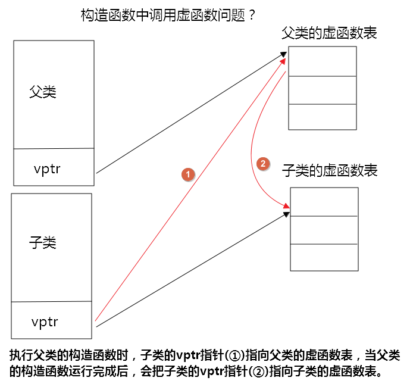
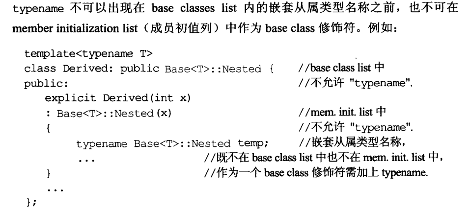

<!--
 * @Author: JohnJeep
 * @Date: 2020-05-27 10:12:26
 * @LastEditTime: 2020-09-09 08:55:43
 * @LastEditors: Please set LastEditors
 * @Description: C++基础学习笔记
--> 

<!-- TOC -->

- [1. C++基础](#1-c基础)
  - [1.1. 学习参考网站](#11-学习参考网站)
  - [1.2. 基本概念](#12-基本概念)
  - [1.3. class类](#13-class类)
  - [1.4. 引用(reference)](#14-引用reference)
    - [1.4.1. 普通引用](#141-普通引用)
    - [1.4.2. 左值引用(lvalue reference)](#142-左值引用lvalue-reference)
    - [1.4.3. 右值引用(rvalue reference)](#143-右值引用rvalue-reference)
    - [1.4.4. 常量引用](#144-常量引用)
  - [1.5. 函数](#15-函数)
    - [1.5.1. 内联函数(inline)](#151-内联函数inline)
    - [1.5.2. 函数参数](#152-函数参数)
    - [1.5.3. 模板函数（建立一个通用函数）](#153-模板函数建立一个通用函数)
  - [1.6. 命名空间（namespace）](#16-命名空间namespace)
  - [1.7. 头文件](#17-头文件)
  - [1.8. 构造函数](#18-构造函数)
    - [1.8.1. 拷贝构造(copy construction)](#181-拷贝构造copy-construction)
  - [1.9. 析构函数(destructor)](#19-析构函数destructor)
  - [1.10. 类对象与类指针的区别](#110-类对象与类指针的区别)
  - [1.11. new和delete](#111-new和delete)
  - [1.12. 重载(overloading)](#112-重载overloading)
  - [1.13. 重写(overwrite)](#113-重写overwrite)
  - [1.14. 初始值列 initialize list](#114-初始值列-initialize-list)
  - [1.15. const](#115-const)
  - [1.16. static](#116-static)
  - [1.17. this](#117-this)
  - [1.18. 参数传递与返回值传递](#118-参数传递与返回值传递)
  - [1.19. friend(友元)](#119-friend友元)
  - [1.20. 操作运算符重载(operator overloading)](#120-操作运算符重载operator-overloading)
  - [1.21. C++典型问题](#121-c典型问题)
    - [1.21.1. `.h`与 `.hpp` 文件区别](#1211-h与-hpp-文件区别)
    - [1.21.2. ++i与i++效率问题](#1212-i与i效率问题)
    - [1.21.3. 传值、传引用、传指针三者的区别](#1213-传值传引用传指针三者的区别)
  - [1.22. 封装](#122-封装)
  - [1.23. 面向对象编程(OOP)](#123-面向对象编程oop)
  - [1.24. 复合(composition)](#124-复合composition)
  - [1.25. 委托(delegation)](#125-委托delegation)
  - [1.26. 继承(Inheritance)](#126-继承inheritance)
    - [1.26.1. 类型兼容原则](#1261-类型兼容原则)
    - [1.26.2. 继承中的构造与析构调用原则](#1262-继承中的构造与析构调用原则)
    - [1.26.3. 继承中同名成员变量处理方法](#1263-继承中同名成员变量处理方法)
    - [1.26.4. 继承与虚函数(virtual function)的结合](#1264-继承与虚函数virtual-function的结合)
  - [1.27. 多态(polymorphism)](#127-多态polymorphism)
  - [1.28. 纯虚函数和抽象类](#128-纯虚函数和抽象类)
  - [1.29. 耦合与解耦的概念](#129-耦合与解耦的概念)
  - [1.30. 智能指针](#130-智能指针)
    - [1.30.1. auto_ptr](#1301-auto_ptr)
    - [1.30.2. unique_ptr](#1302-unique_ptr)
    - [1.30.3. shared_ptr](#1303-shared_ptr)
    - [1.30.4. weak_ptr](#1304-weak_ptr)
  - [1.31. typename](#131-typename)

<!-- /TOC -->

# 1. C++基础
编程----写出大家风范。

## 1.1. 学习参考网站
- [cppreference](https://en.cppreference.com/w/)
- [learncpp](https://www.learncpp.com/)
- [cpluscplus](https://www.cplusplus.com/)
- [TutorialsPoint](https://www.tutorialspoint.com/index.htm)
- [C++ shell](http://cpp.sh/) 在线的C++编译器，在线编辑代码。


## 1.2. 基本概念
- C语言中，表达式的返回值是一个数值。C++中，表达式的返回值是变量的本身，可以作为左值，作为左值需要开辟一个内存空间。
- `endl` 与 `\n` 区别：
  - endl：换行和清除缓冲区到输出屏幕上
  - \n：仅仅只是换行
- float：有效数字是6~7位
- double：有效数字是15位
- char：8个bit，占一个字节空间
- 取模场景：
  - 取一个数的个位数
  - 多少天是一个月的第几天 
- `<<`左移运算符：右侧空位补0
- `>>` 右移运算符：左侧空位补符号位，符号位正数部0，符号位为负数补1
- switch语句后的表达式只能为整型或字符类型
- break语句：执行循环体后，调出循环。可用于switch结构或者循环结构
- continue：只能用于循环结构，调出循环
- 计算数组大小：对基本类型（不包括String类型）：`sizeof(array_var) / sizeof(array_type)`
  >   sizeof(nums) / sizeof(int) 
- 指针：
  - `int *ptr`  整型指针，结果是一个值
  - `int *ptr  int*`：指向整型的指针，结果是一个地址
  - 所有的指针都要初始化
  - `void* `指针存放一个内存地址，地址的内容是什么类型不能确定 

## 1.3. class类
- class without pointer members：类中的成员不带有指针。
- class with pointer members：class类中的成员带有指针。


## 1.4. 引用(reference)
### 1.4.1. 普通引用
- 给对象起了一个别名，使用 `&` 符号表示
- 单独定义引用时，必须要 `初始化`。
- 引用作为函数的参数声明时，`不` 需要进行初始化。
- 传引用的效率比指针高，传递的直接是对象，而不是把对象复制。
- 函数内部的引用参数值可能会改变，一般需要加 `const` 解决。
- 不要返回局部变量的引用，全局变量和静态变量可以作为返回值的引用。 
- C++编译器在编译时使用一个常量指针作为引用的内部实现。因此，引用占用的内存空间大小与指针占用空间大小相同。
  > type& name <==> type* const name
- 从使用者的角度，引用类似是一个别名，没有自己的内存空间，这是因为C++为了实用性，隐藏了相关细节。实质上引用有自己的内存空间。
- 指针的引用 
  - 格式 `const int* &a`
  - 指针的引用做函数参数
  - 函数二级指针作为输出变量

### 1.4.2. 左值引用(lvalue reference)
- `引用` 作为 `左值`时，返回的是变量的本身，是变量而不是值（value）。变量只能是全局变量或静态变量，不能是局部变量，否则会出现 `Segmentation fault`。
- 函数的返回值作为一个 `左值`时，应该返回的是一个引用`(reference)`。
- 左值表达式表示的是一个对象的身份。
- 变量表达式是一个左值，作用的时间比较长，右值的作用时间比较短暂。 


### 1.4.3. 右值引用(rvalue reference) 
- 何为右值引用？
  - 必须绑定到右值的引用，采用 `&&` 来获得右值引用，而不是 `&` 
  - 右值表达式表示的是对象的值。
- 右值引用只能绑定到一个将要被销毁的对象，该对象没有其它的用户。
- `move()函数`
  - 显式的将左值转化为对应的右值引用类型。
  - 使用 `move()` 函数时告诉编译器，处理左值时像右值一样去处理它；对左值进行赋值或销毁外，不再使用它。


### 1.4.4. 常量引用
- 让变量的引用拥有只读的属性。
  ```
  int x = 10;
  const int &y = x;   // 不能通过y去修改x的值 
  ```
- 初始化
  - 用变量初始化常引用。`int x = 10; const int &y = x;`
  - 用自变量初始化常引用。`const int &a = 100;` 
- 使用常量引用进行初始化时，C++编译器会为常量值分配空间，并将引用名作为当前分配空间的别名。


## 1.5. 函数
- C++对函数的检查更严格
- C++支持bool类型：C++中的 `bool`，只占 1 个字节；java中使用 `boolean`；采用 `boolalpha`显示True或False；


### 1.5.1. 内联函数(inline)
- 函数定义时，加 `inline` 关键字，例如 `inline void func(){}`
- 内联函数的关键字 `inline` 与函数体的实现在一起，不需额外的声明。 
- 实现机制
  - C++编译器直接将函数体插入函数调用的地方。
- 什么时候可以用 `inline`？
  - 函数体不能过大。
  - 函数声明必须在调用之前声明。
  - 不能对函数进行取值地址操作。 
  - 不能存在任何形式的循环语句（for、while）。
  - 内联函数省去了普通函数调用时的压栈、跳转、返回操作。


### 1.5.2. 函数参数
- 默认参数
  - 函数的参数有一个默认的值。
  - 函数带有参数列表，参数列表的右边必须有默认的值，左边可以不给默认参数赋值。
- 占位参数
 - 只有函数类型声明，没有函数变量声明。`int func(int a, int b, int)`


### 1.5.3. 模板函数（建立一个通用函数）
  - 函数定义时不指定具体的数据类型
  - 函数调用时，根据实际参数反推数据类型，即类型的参数化
  

## 1.6. 命名空间（namespace）
- C中的命名空间
  - 只有一个全局的作用域，所有的全局标识符共用一个作用域。同名的标识符之间会发生冲突。
- C++的命名空间
  - 将全局的作用域分成不同的部分，不同命名空间的标识符可以同名而不会发生冲突。
  - 全局作用域也叫默认命名空间
  - 命名空间之间可以相互嵌套

- 语法
```
// 使用标准库中封装的内容。标准库中定义的所有名字都在命名空间 std 中
using namespace std
{
  .....
}
```
- `::` 作用域运算符
  ```
  std::out 从标准库中输出读取的内容，即编译器从操作符左侧名字的作用域中去寻找右侧的名字。
  ```
- 一般有三种方式去实现命名空间
  - 全部打开标准库中的内容。`using namespace std;`
  - 只打开标准库的部分内容。
    ```
    using std::cout;

    int main()
    {
      cout << ...;
      std::cin << ...;
      
      return 0;
    }
    ```
  - 在使用的时候根据需要打开
    ```
    int main()
    {
      std::cout << ...;
      std::cin  << ...;
     
      return 0;
    }


## 1.7. 头文件
- 头文件采用防御式声明 
    ```
    #ifndef __TEST_H
    #define __TEST_H
      ...
      
    #endif
    ```


## 1.8. 构造函数
- 为什么要用构造函数？
  - 被用来初始化类的对象。  
  - 类对象被创建时，编译器为对象(object)分配内存空间，并自动调用构造函数，完成成员的初始化 

- 构造函数特征 
  - 构造函数的 `函数名称` 与 `类的名称` 一样。
  - **函数没有返回值**
  - 函数参数值
    - 创建的对象有默认值时，应传入创建对象的默认值。
    - 创建的对象没有默认值时，编译器传入的默认值为 `0`

- 构造函数注意点
  - 构造函数是一个 `成员函数`，函数内有一个 `this` 指针
  - 构造函数的访问属性可以放在 `private` 中。在单例模式（singleton）中就采用这种用法。
  - `构造函数` 与 `析构函数` 在类中声明了 ，必须要通过类的方法去实现，即声明了必须要用，否则编译时会报错。
  - 多线程编程中，构造函数不能保证线程的安全。

- 类中默认的构造函数
  - 默认无参数构造：当类中没有定义构造函数时，C++编译器会默认提供一个无参数构造函数，构造函数的函数体为空。
  - 默认拷贝构造：当类中没有定义拷贝构造函数时，C++编译器会默认提供一个拷贝构造函数（浅拷贝），简单的进行成员变量的值拷贝操作。

- 构造函数分类
  - 无参构造：一般为栈内存空间，自动释放内存空间。调用时不用 `加括号`。
  - 带参数构造(重载了构造函数)
    - 一般为堆内存空间，需要使用delete释放内存空间；使用 `new` 关键字创建空间
    - 一般需要初始化构造的参数
    - 有默认值参数的构造函数，需要在类的声明中指定默认参数值，一般只能指定一次，在构造函数实现时不需要再给出默认值，否则会报错。
  - 拷贝构造
    ```
    // 声明一个类
    class String()
    {
      private:
        ...
      public:
        ...
    }
    // 实例化一个对象
    String st_one;

    // 拷贝构造
    String st_two = st_one;   // 方法一：等号(=)是拷贝一个对象不是赋值运算

    String st_three(st_one)   // 方法二：初始化拷贝构造

    函数的返回值是一个复杂的类型，会返回一个新的匿名对象。
    匿名对象什么时候留下？什么时候被析构？
      1、用匿名对象初始化一个同类型的对象，则匿名对象转化为有名字的对象。
      2、用匿名对象赋值给另外一个对象，则匿名对象被析构。
    ```

- 构造函数在继承中的用法
  > 构造函数与父类的其它成员(成员变量和成员方法)不同，它不能被子类继承。因此，在创建子类对象时，为了初始化从父类中继承来的成员变量，编译器需要调用其父类的构造函数。如果子类的构造函数没有显示地调用父类的构造函数，则默认调用父类的无参构造函数。 
  - 子类与父类均没有声明构造函数时，C++编译器会默认生成构造函数去调用。 
  - 子类继承父类的方法，默认会调用父类的无参数构造函数，再调用子类的无参或有参构造函数。
  - 当父类为有参构造函数时
    - 父类的有参构造函数有默认的值时，子类中不需要显式地调用父类的构造，C++编译器会默认的调用父类的有参构造函数。
    - 父类的有参构造函数没有默认的值时，子类中需要显式地调用父类的构造
      ```
      class Parent
      {
       private:
       public:
         Parent(int a, int b){};
      }
 
      class Child:public Parent
      {
      private:
      public:
        Child(int m, int n):Parent(a, b)     // 显示的调用父类的构造函数
      }
      ```
    - 父类中既有无参默认构造又有带参默认构造函数时，子类继承父类时，需要子类显示的指定到底该调用哪一个构造函数。


### 1.8.1. 拷贝构造(copy construction)
- 参考
  - [c++拷贝构造函数详解](https://www.cnblogs.com/alantu2018/p/8459250.html)


- 拷贝构造函数是由普通构造函数和赋值操作符共同实现的。
- 拷贝构造函数必须以 `引用(reference)`的形式传递(参数为引用值)。
- 拷贝构造函数使程序更有效率，因为它不用再构造一个对象的时候改变构造函数的参数列表
- 当某对象是按值传递时（无论是类的对象作为函数参数，还是作为函数返回值），编译器都会先建立一个此对象的临时拷贝，而在建立该临时拷贝时就会调用类的拷贝构造函数。


- 浅拷贝
  - 当类的对象发生复制过程的时候，类的对象自己有资源（堆，或者是其它系统资源），但复制过程中并未复制资源，只是改变了指针的指向，这种称为浅拷贝。
  - 只是将类的成员值进行拷贝，类指针没有进行拷贝，两个指针同时指向一块内存空间。
  ```
  没有做任何的说明，C++编译默认使用的是浅拷贝。
  
  People obj_2 = obj_1;   将obj_1对象的内容拷贝到obj_2对象中，不是拷贝的指针。
  ```
  - 浅拷贝完成后，在释放资源的时候会产生资源归属不清的情况，导致一个指针指向已经被删除的内存空间，使程序运行出错。即销毁对象时，两个对象的析构函数将对同一个内存空间释放两次。
  

- 深拷贝
  - 当类的对象发生复制过程的时候，类的对象自己有资源（堆，或者是其它系统资源），但拷贝过程中复制了资源，这种将一个对象的资源完整的拷贝到另一个对象的过程，称为深拷贝。
  - 不仅拷贝了类的 `成员变量值`，还拷贝了类的指针，两个指针指向两块不同的内存空间。

- 什么时候用深拷贝和浅拷贝？
  - 类中没有自定义拷贝构造函数时，编译器会默认调用浅拷贝，完成成员的复制。
  - 当类的成员中没有指针时，浅拷贝是可行的。
  - 当类的成员中有指针时，如果采用简单的浅拷贝，则两类中的两个指针将指向同一个地址，当对象快结束时，会调用两次析构函数，而导致指针悬挂现象，因此必须要用深拷贝。
  

- 拷贝赋值（copy assignment operator） 
  ```
  将对象s1拷贝赋值给对象s2，分3步：
  
  // 在拷贝之前需要进行自我赋值检测。即自己把值赋给自己，保证在执行第二步操作时，指针有指向的位置。
  if (this == str)
  {
    return *this
  }

  1、将s2自己清空
  2、分配 s2大小的内存空间存放s1
  3、执行拷贝动作
  ``` 


## 1.9. 析构函数(destructor)
  - 表示：在类名称之前加 `~`。例如：`string::~string()` 
  - 作用：类的对象离开作用域后释放对象使用的资源，在类死亡之前的前一刻调用，用于清除类中的资源（比如：释放内存）。
  - `一个类只能有一个析构函数，多个类有多个析构函数`，如果没有显式的定义，系统会自动生成一个默认的析构函数。
  - 析构函数不能 `重载`。每有一次构造函数的调用就会有一次析构函数的调用。


## 1.10. 类对象与类指针的区别
```
class Stu
{
private:

public:
}
```
- 类对象
  - 格式：`Stu s1;`
  - 定义之后就已经为 `s1` 这个对象在栈上分配了内存
- 类指针
  - 格式：`Stu *s2 = new Stu;`
  - 定义 `*s2` 的时候没有分配内存，只有执行 `new` 后才会在堆上分配内存，是个永久的变量，需要用 `delete` 关键字手动去释放它。


## 1.11. new和delete
- windows 下内存显示总是 `16` 的倍数，不是 16 的倍数，则填充为最靠近 16 的倍数的大小。 
- `new` 动态分配内存 
  - 先分配空间，再调用构造函数 
  - new创建一维动态数据
    ```
    // 普通类型
    根据哪种数据类型来分配内存？根据数据类型来确定分配多少内存？找到这样的内存，并返回其地址。
    格式：typeName* pointer_name = new typeName 
    例如：int *p = new int;

    p指向的内存没有名称，如何称呼它呢？我们说p指向一个数据对象， 这里的“对象”不是“面向对象编程”中的对象， 而是一种东“东西”，它指的是为数据项分配的内存块。 
    数据对象：可以是复杂的结构类型，也可以是基本类型。

    // 一维数组
    typeName* pointer_name = new typeName[num_elements];
    例如：int *p = new int[10];
    注意：将数组的元素类型和元素数目告诉new即可。 必须在类型名后加上方括号， 其中包含元素数目。new运算符返回第一个元素的地址。

    ```  
  - 创建二维数组
    ```
    格式：typeName (*ptr)[col_num] = new typeName[row_num][col_num];
    例子：int (*ptr)[2] = new int[4][2];
    ```
  - 创建对象
    ```
    class Airplane
    {
      ...
    }

    Airplane *ap = new Airplane;
    ```

- `delete` 释放内存，与new配对使用 
  - 先调用析构函数，再释放空间  
  - 注意
    - 不要使用delete释放同一个内存块两次。
    - 不是用new分配的动态内存空间，不能用delete释放
    - 对空指针使用delete是安全的。

- 注意：
  - 采用 `array new` 的方式创建一块内存空间，则一定要采用 ` array delete` 方式去释放内存，否则在涉及指针的时候可能会导致内存泄漏。泄漏的并不是整个分配的内存空间，而是分配的空间中数组没有被释放的部分。
  - 不配对地使用new和delete，将发生内存泄漏（memory leak），被分配的内存再也无法使用了，如果内存泄漏严重，则程序将由于不断寻找更多内存而终止。


## 1.12. 重载(overloading)
- 必须在一个类中进行。C++中构造函数也可以重载。
- 函数名称相同，函数参数不同 `（参数个数，参数类型）`。
- 函数的 `返回值` 不是函数重载判断的标准。
- 底层实现：编译器在编译时，根据函数的 `参数列表` 进行重命名。
- 子类无法重载父类的函数。
- 如果子类与父类的函数名称相同，则发生函数名称覆盖，不会发生函数重载。若想在子类和父类中分别调用具有相同名称的函数，则需要使用 `域分符号::`
  - 当子类中没有与父类相同参数的函数，只有名称相同的函数时，而子类去调用父类中重载的函数，则C++编译器会将子类中有相同函数名称的函数去覆盖掉父类中相同名称的函数，从而将当前子类调用父类的函数当做子类中一个新的重载函数，但是编译器发现子类中并没有该函数的重载，因此会报错。


## 1.13. 重写(overwrite)
- 子类对父类同名函数的重新定义。
- 必须发生在子类与父类之间，并且父类与子类的函数具有完全相同的原型。
- 使用 `virtual` 关键字声明后，能够产生多态，没有使用 `virtual` 关键字，只能叫重定义，不叫虚函数重写。

- 重载与重写的区别
  - 作用域不同：重载是在同一区域，子类无法重载父类，父类同名函数的将被覆盖，重写是在父类与子类之间。
  - 重载是在编译期间根据参数列表决定，重写是在 `运行期间` 根据具体对象类型来决定调用的函数。


## 1.14. 初始值列 initialize list
  - `初始值列表` 是在对象创建成功之前完成的，而函数体内赋值是你的对象成员都已经创建好后再对成员进行赋值。
  - 语法
    ```
    //  将变量设置为 re=r, im=i
    : re(r), im(i)
    ```
  - 在带参数的构造函数里面第一行进行初始化。
  - 这种初始化并不是必须的，但是在以下几种情况时是必须进行初始化的
    - 成员是 `const` 类型。
    - 成员是`引用类型`。
    - 有一个成员是类型的对象（不是默认的构造函数）  
  - 初始化列表的顺序并不限定初始化的执行顺序，成员的初始化顺序是与类中定义的顺序保持一致。最好让构造函数初始值的顺序与成员声明的顺序保持一致。


## 1.15. const
- C语言中，`const` 是只读的变量，有自己的存储空间。
- C++中，`const` 可能分配存储空间，也可能不分配存储空间。
  - 当 `const` 作为全局变量，并在其它的文件中到调用时，会分配存储空间。
  - 采用 `&` 地址运算符去取 `const` 变量的地址时，会分配存储空间。
- 加 `const` 后，不会改变数据的内容，不加`const`，则会改变数据的内容，一般数据的内容定义在 `private`中。
- 在类中采用 `const`修饰函数，需要在类调用时必须加 `const`
  ```
  // const对象只能调用const成员函数，const类对象成员的数据在类对象的生命周期内不能改变。
  // const成员函数是对 const 对象的限制；const 成员函数只能读类对象成员的数据，不能修改类对象成员的数据。
  // 定义const成员函数时，把const关键字放在函数的参数表和函数体之间。
  // 为什么不将const放在函数声明前呢？因为这样做表明函数的返回值是常量，意义完全不同。

  声明：
  double real() const
  {
      return re;
  }

  调用：
  const complex fx(1, 2);
  ```
- `const` 常量由 `编译器`处理的，提供作用域检查和类型检查。而 `宏定义（#define）` 仅仅只是单纯的文本替换，在 `预处理` 阶段处理的。


## 1.16. static
- 一个类的成员变量为静态成员变量（即含有`static` 关键字）时，这个类中无论有多少个对象被创建，这些对象都共享这个 `static` 成员；即静态成员独立于任何的对象。
- 静态成员函数中不能使用非静态成员变量和非静态成员函数；静态成员函数不与任何对象绑定在一起，不包含 `this` 指针。 
- 静态成员可以作为默认的参数，而非静态成员不能作为默认的参数，因为它本身的值属于对象的一部分。

- 定义静态成员
  - 既可以在类的外部定义又可以在类的内部定义静态成员，但是在类的外部定义时，不能重复 `static` 关键字，`static` 只出现在类的内部。
  - 一个静态数据成员只能被定义一次。
  - 不能在类的内部初始化静态成员，必须在类的外部定义和初始化每个静态成员。
  - 静态数据成员类似于全局变量，定义在任何的函数之外，一旦被定义，就一直存在与程序的整个生命周期内。
  - 若在类的内部提供了一个初始值，则在成员的定义时，不能再赋初值了。
  - 不能在构造函数或初始化列表中初始化静态成员。

- 非静态成员初始化
  - `const` 类型的成员变量只能在初始化列表中初始化。
  - 非 `const` 类型的成员变量可以在构造函数或初始化列表中初始化。

- 继承中的 `static`
  - 需要在类的外部进行初始化，并且C++编译器在外部初始化的同时还给变量分配内存空间，只有在使用时才分配内存空间，不调用不分配内存空间。

- 类模板中的 `static`
  - 每个类模板中都有自己的类模板 `static` 数据成员副本。
  - 与非类模板的 `static` 数据成员一样，类模板中的 `static` 数据成员也需要进行 `定义` 和 `初始化`。


## 1.17. this
- 什么叫成员函数：在类（class）中声明的函数。
- 什么叫非成员函数：没有在类（class）中声明的函数，非成员函数也叫全局函数。
- C++中的成员函数和成员变量是分开存储的。
- 哪个对象调用非静态成员函数，`this` 就指向哪个对象。 
- 静态成员函数中不包含 `this` 指针，非静态成员函数中包含 `this` 指针
- 成员函数中 `const` 修饰的是谁？
  ```
  class TT
  {
  private:
    ......
  public:
    void func(int a, int b) const
    {}
  }

  // 由C++面向对象模型知，上面的函数等价于
  void func(TT *this, int a, int b) const
  {}
  
  // const修饰的是this指针指向的内存空间。
  ```
- 类名后直接加括号，不创建一个对象，代表一个临时对象（temp object）。
    ```
    //声明类
    class complex
    {
        public:
            // 主要放置函数
            ........

        private:
            // 定义数据
            ........
    }

    // 调用临时对象
    complex();
    ```


## 1.18. 参数传递与返回值传递
- pass by value 和 pass by reference
  - 传值是将整个的数据传递给调用者
  - 传引用本质是 `传指针`。
    - 采用一个 `&` 符号表示。
    - 希望调用者对传递的数据不能进行修改，在数据前加 `const` 限制。
- 参数传递时：在能使用传reference的前提下，一般优先使用 `传引用` 而尽量少使用传值，并不是必须的。`传引用` 的速度比 `传值` 速度快。
- 函数返回 `值传递` 时：在能使用传reference的前提下，一般优先使用 `传引用` 而尽量少使用传值，并不是必须的。 


- 什么情况下不能使用 `引用传递（reference）`？
  - 当一个函数参数的变量为局部变量时，不能使用传引用。因为变量在函数结束时，变量就被销毁了，不存在，若再传递引用，调用者则不能得到值，会出错。


## 1.19. friend(友元)
- 友元函数
  - 在一个类中使用 `friend` 关键字时，不是当前类的成员函数可以去访问当前类的私有成员数据。
  - 重载运算符 `<<` 和 `>>` 一般使用友元函数，其它的函数一般定义为 `类的成员函数`。
  - `类模板` 中一般不要滥用友元函数，使用会很复杂，若将 `.h` 文件与 `.cpp` 文件分开实现，将会更加的复杂。

- 同一个 class 中的各个对象(object) 互为友元。
  ```
  函数定义：
  int func(const complex& param)
  {
      return param.value;
  }

  // 声明对象:
  complex c1;
  complex c2;
  c2.func(c1);   // 采用友元的方式实现，通过对象参数访问私有成员数据
  ```

- 友元类
  - 若B类是A类的友元类，则B类的所有成员函数都是A类的友元函数。
  - 通常是为设计一种数据操作或类之间传递消息的辅助类。

- 采用友元的优缺点
  - 优点
    - 可以灵活地实现需要访问若干类的私有或受保护的成员才能完成的任务；
    - 便于与其他不支持类概念的语言(如C语言、汇编等)进行混合编程；
    - 通过使用友元函数重载可以更自然地使用C++语言的IO流库。
  - 缺点
    - 一个类将对其非公有成员的访问权限授予其他函数或者类，会破坏该类的封装性，降低该类的可靠性和可维护性。


## 1.20. 操作运算符重载(operator overloading)
- 为什么要操作符重载？
  > 普通的运算规则不能满足复杂的数据类型，像 `类（class）`数据类型，需要编程人员自定义运算规则去实现。
- 操作运算符重载的本质是个 `函数`。

- 操作符重载有两种实现的方式
  - 非成员函数方式，即全局函数（全域）的方式。
    - 通常与 `friend` 友元函数结合在一起使用。
    - 应用场景：重载不同类之间的操作符。例如，重载 `<<` 和 `>>`，编程人员自定义的类与C++编译器中 `ostream` 或 `istream` 类中的数据进行操作符重载。
  - 成员函数方式。
    - 函数的参数有一个隐藏的 `this` 指针，可以在函数里面去调用。

- 分析重载的步骤？
  - 确定函数名称
  - 确定函数参数
  - 根据业务，确定函数的返回值类型（是返回引用还是返回值？）以及函数体的实现。  

- `=赋值` 操作符重载
  - `=` 只是将成员变量的值相应复制。由于对象内包含指针，将造成不良后果：指针的值被丢弃了，但指针指向的内容并未释放。 


## 1.21. C++典型问题
### 1.21.1. `.h`与 `.hpp` 文件区别
- `.hpp` 本质就是将.cpp的实现代码混入.h头文件当中，定义与实现都包含在同一文件，则该类的调用者只需要include该.hpp文件即可，无需再将cpp加入到project中进行编译。而实现代码将直接编译到调用者的obj文件中，不再生成单独的obj，采用hpp将大幅度减少调用project中的cpp文件数与编译次数，也不用再发布lib与dll文件，因此非常适合用来编写公用的开源库。

- hpp的优点
  - 是Header Plus Plus的简写。（.h和.hpp就如同.c和.cpp似的）
  - 与.h类似，.hpp是C++程序头文件格式。
  - 是VCL专用的头文件,已预编译。
  - 是一般模板类的头文件。
  - 一般来说，.h里面只有声明，没有实现，而.hpp里声明实现都有，后者可以减少.cpp的数量。
  - .h里面可以有using namespace std，而.hpp里则无。
  - 不可包含全局对象和全局函数。

- 当hpp文件中存在全局对象或者全局函数，而该hpp被多个调用者include时，将在链接时导致符号重定义错误。要避免这种情况，需要去除全局对象，将全局函数封装为类的静态方法。


### 1.21.2. ++i与i++效率问题
- `++i` 返回的是对象的引用，而 `i++` 返回的是对象的原值（但非左值）。
- `++i` 先自增，后返回原对象的对象，没有产生任何临时对象；而 `i++`，先保存原对象，然后自增，最后返回该原对象的临时对象，需要创建和销毁对象。


### 1.21.3. 传值、传引用、传指针三者的区别
- 形参
  - 在函数或方法中定义的参数就是形参。
  - 函数没有被调用时，形参并不会占用内存的存储单元，只有当函数被调用时，形参才会被分配内存单元，在函数体执行完后，形参存储的内存单元被释放。

- 实参
  - 实参可以是常量、变量和表达式，但必须要有确定的值。  
  - 函数调用的时候，先给形参分配内存空间，然后将实参的值拷贝一份给形参，函数体调用结束后，形参分配的内存空间被释放，但是实参分配的内存空间还存在。

- 传值
  - 可以传实参和形参。
  - 比如函数定义为 `fun(int a)`，在调用的地方有`int x=6`， 使用`fun(x)`调用。这种方式在 `fun(int a)` 函数内部的对`a`的修改 `不能` 导致外部 `x` 的变化。
  - 值传递时，程序会为形参分配内存空间，并将实参的值赋值给形参，函数体中形参的改变并不会影响实参的值，形参存储的是实参的副本。


- 传地址
  - 传地址也叫指针传递。
  - 函数定义为 `fun(int *a)`，形参为指针，调用的时候传递的是参数的地址，例如 `int x=6; fun(&x)`。 这种方式在 `fun(int a)`函数内部的对 `a` 的修改 `能` 导致外部 `x` 的变化。


- 传引用
  - 用 `&` 符号定义的形参，在参数传递时相当于实参的一个别名，对形参的操作相当于直接对实参进行操作。
  - 函数定义为 `fun(int& a)`，形参为引用，例如 `int x=6; fun(x)`。 在 `fun(int& a)` 函数内部的对变量 `a` 的修改 `能` 导致外部 `x` 的变化。
  - 传引用时，程序不是将直接实参本身的值复制后传递给形参，而是将实参的地址值传递给形参，形参所引用地址上的变量与传递的实参相同，因此，函数体内形参的改变会直接改变实参的值。


## 1.22. 封装
- 封装了成员数据和常用函数
- 封装了属性和方法。
- `public`  修饰类的成员变量和函数，既能在类的内部使用又能在类的外部使用
- `private` 修饰类的成员变量和函数，只能在类的内部使用，不能在类的外部使用
- `protect` 修饰类的成员变量和函数，只能在 `类的内部` 使用，不能在类的外部使用，可以在继承的子类中使用。    


## 1.23. 面向对象编程(OOP)
- 静态对象（static object）：在作用域（scope）结束后，生命周期还存在，即没有结束，一直到整个程序结束了，它的生命周期也就结束了。
  - 静态的函数没有 `this` pointer，只能去处理静态的数据
    ```
    如何去调用？ 
    1、使用 object 调用。Account a.state(10);
    2、通过 class name 来调用。Account::state(10);
    ```
- 全局对象（global object）：整个程序结束了，它的生命周期也就结束了。
- 头文件名包含在尖括号 `<>` 中，则C++编译器将在存储标准头文件的主机系统的文件系统中查找；但如果文件名包含在双引号 `""` 中，则编译器将首先查找当前的工作目录或源代码目录（或其他目录，这取决于编译器）

- 类的声明和实现时分开的。
  - `.h` 文件只作类的声明
  - `.cpp` 文件进行类的实现 


## 1.24. 复合(composition)
- 什么是组合？
  > 每当一个类的对象作为另一个类的成员变量时，就实现了组合。

- 将其它类的对象作为当前类的成员使用，当前类的成员变量不再是简单的基础类型，而是变为复杂的其它类的对象。


## 1.25. 委托(delegation)
- 两个类之间通过指针相连


## 1.26. 继承(Inheritance)
- 三种继承：public、private、protect
- 数据的继承：子类继承的是父类内存中的数据。
- 函数的继承：子类继承的是父类的调用权利。
- 如何看继承中的访问控制权限
  - 看类的调用语句，是在类的内部还是在类的外部？
  - 看子类如何从父类中继承？
  - 看父类的访问级别？ 
- `public继承`    父类成员在子类中保持原有的访问级别。
- `private继承`   父类成员在子类中的访问级别都变为 `private`
- `protected继承` 
  - 父类中 `public` 成员属性会变为 `protected`
  - 父类中 `private` 成员属性仍然为 `private`
  - 父类中 `protected` 成员属性仍然为 `protected`

- C++中支持多继承的方式


### 1.26.1. 类型兼容原则
- 子类是特殊的父类。
- 基类（父类）的指针或引用 `直接指向` 子类的对象。
  - 指针做函数参数
    ```
    class Parent
    {}

    class Child
    {}

    Parent *p1 = NUll;
    Child c1;
    p = &c1;     // 父类的指针直接指向子类的对象
    ```
  - 引用做函数参数
- 子类对象直接`初始化` 父类对象。
- 子类对象直接 `赋值` 给父类对象。
- 子类对象可以 `当做父类对象使用`。


### 1.26.2. 继承中的构造与析构调用原则
- 内存角度探讨调用原则
  - 构造：由内而外。先调用base(父类)的默认构造函数，然后才执行自己。
  - 析造：由外而内。先执行自己，然后再调用 base(父类)的析构函数。


### 1.26.3. 继承中同名成员变量处理方法
- 子类与父类中的成员变量和成员函数有相同的名称时，采用作用域的方式调用。
```
class Parent
{
public:
    int m;
    void shoe();
}

class child
{
public:
    int m;
    void shoe();
}

Parent p1;
Child c1;

// 调用
p1.Parent::m = 100;
c1.Child::m = 200;
p1.Parent::shoe();
c1.Child::shoe();
```

### 1.26.4. 继承与虚函数(virtual function)的结合
- 为什么会有虚继承
  - 解决多个继承可能产生的二义性。 
  - 二义性：若果一个派生类（子类）由多个基类（父类）继承，这些基类都有一个共同的基类，则在对该基类中声明的变量进行访问时，可能会出现二义性。

- 为什么要用虚函数
  - 相同接口，实现不同功能。
  - 虚函数是动态生成的，普通成员函数是静态生成的。  


- non-virtual: 不希望子类（derived）重写
- virtual: 希望子类重写（override）父类，父类已有默认值
- pure-virtual: 子类（derived）中必须重写(override)父类，父类没有默认值。


## 1.27. 多态(polymorphism)
- 根据实际的对象类型决定函数调用语句的具体调用目标。
  - 父类指针指向父类的对象，则调用父类中定义的函数 
  - 父类指针指向子类的对象，则调用子类中定义的函数 

- 多态实现的效果
  - 同一种调用语句，有多种表现形态。

- 实现多态的三个条件
  - 要有继承
  - 子类中有虚函数重写
  - 父类指针或引用指向子类的对象。

- 链编：一个程序模块，代码之间相互关联的过程。
  - 静态链编：程序的匹配、链接的过程在编译阶段中实现。重载函数使用的是静态链编。
  - 动态链编：程序的匹配、链接的过程在运行时实现。switch、if语句都是采用的动态链编。


- 虚析构函数
  - 为什么要虚析构函数？
    - 通过父类指针将子类的所有资源都释放，即把子类的所有析构函数都执行一遍。
  - 函数格式
    ```
    virtual ~People()
    {}
    ```

- 多态的内部原理探究
  - 当类中声明虚函数时，编译器自动创建了一个虚函数表，每个类的对象都有一个虚函数表。
  - 虚函数表：存储多个虚函数的开始地址。
  - 虚函数表由编译器自动创建于维护。
  - 有 virtual 关键字的成员函数会被编译器放入虚函数表中。
  - 存在虚函数时，在用类实例化一个对象时，C++编译器会在类的对象中添加一个 `vptr` 指针，每个对象中都有一个指向虚函数表的 `vptr` 指针。
  - 通过虚函数表指针 `vptr` 调用重写函数是在程序运行时进行的，需要通过寻址操作才能确定该调用哪个函数。
  - 虚函数的效率比普通成员的效率要低。

- 构造函数中调用虚函数


- 多态是实现框架的基础。在使用框架结构去设计程序的时候，常常使用 `Template Method` 和设计模式去实现。


## 1.28. 纯虚函数和抽象类
- 纯虚函数
  ```
  // 语法
  virtual int func() = 0;
  ```
- 含有纯虚函数的类叫抽象类。在父类中只定义一套通用的接口，在子类中去实现。
  ```
  // 抽象类
  class People
  {
  private:
    ....
  public:
    ....
  
  virtual int func(int a) = 0;
  }
  ```
- 虚函数注意点
  - 静态函数没有虚函数，内联函数不可能是虚函数，构造函数不能是虚函数。
  - 抽象类不能实例化对象，可以声明抽象类的指针。
  - 抽象类不能作为函数的参数类型。 `void fg(People)  // error, People为抽象类`
  - 抽象类不能作为函数返回的类型。`People eat();  // error，People为抽象类`
  - 抽象类可以声明类的引用。`People& run(People&); // People为抽象类`
- 继承与虚函数在工程中的应用
  - 由于多继承的二义性，很少使用多继承，一般采用单继承。
  - C++ 中没有真正的类似Java中接口的方法，但可以使用虚继承来模拟接口的方法。
  - 虚继承中可以使用多继承的方式，来实现复杂的业务。


## 1.29. 耦合与解耦的概念
- C++中采用抽象类，提前布局 `vptr` 指针，虚函数表，调用动态链编，实现与第三方产品的解耦合。
- 动态库-----函数的首地址----调用函数指针----调用函数
- 常常采用函数指针将任务的调用者与任务的实现者进行分开，两者互不依赖。  


## 1.30. 智能指针
- 参考
  - [详解C++11智能指针](https://www.cnblogs.com/WindSun/p/11444429.html)
  - [【C++】智能指针详解](https://blog.csdn.net/flowing_wind/article/details/81301001)


- 动态内存分配常用 `new` 和 `delete` 来分配内存。
- 动态内存分配可能会出现的问题？
  - 忘记释放内存，会造成内存泄漏
  - 有指针引用内存的情况下，释放了内存，产生引用非法内存的指针。
- 为什么要使用智能指针？
  - 需要更加安全的使用动态内存。
  - 负责自动释放所指向对象内存资源。智能指针就是一个类，当超出了类的作用域是，类会自动调用析构函数，析构函数会自动释放资源。

- 智能指针原理：在函数结束时自动释放内存空间，不需要手动释放内存空间。
- 智能指针底层源码采用类模板来实现的，并不是一个简单的普通指针。


### 1.30.1. auto_ptr
- 采用所有权模式。
- 已被C++11弃用，潜在内存崩溃问题。
- 存在非法的申请内存时，在编译期时可能通过，但程序在运行时可能会出错。


### 1.30.2. unique_ptr
- 保证同一时间内只有一个智能指针可以指向该对象。
- 它对于避免资源泄露(例如“以new创建对象后因为发生异常而忘记调用delete”)特别有用。 
- 当程序试图将一个 unique_ptr 赋值给另一个时，如果源 unique_ptr 是个临时右值，编译器允许这么做；如果源 unique_ptr 将存在一段时间，编译器将禁止这么做。
  ```
  unique_ptr<string> pu1(new string ("hello world")); 
  unique_ptr<string> pu2; 
  pu2 = pu1;                                      // #1 不允许
  unique_ptr<string> pu3; 
  pu3 = unique_ptr<string>(new string ("You"));   // #2 允许
  ```
- 想要执行 ` pu2 = pu1;` 的操作，又要保证指针的安全。可以用C++有一个标准库函数 `std::move()`，让你能够将一个 `unique_ptr`赋给另一个。
  > 尽管转移所有权后 还是有可能出现原有指针调用（调用就崩溃）的情况。但是这个语法能强调你是在 `转移所有权`，让你清晰的知道自己在做什么，从而`不乱调用原有指针`。


### 1.30.3. shared_ptr
- 多个指针指向同一个对象
- 采用 `引用计数` 的方法，记录当前内存资源被多少个智能指针引用，该引用计数的内存在堆上分配。
  > 当新增一个指针时，`引用计数` 加1，当释放时 `引用计数` 减一。只有引用计数为0时，智能指针才会自动释放引用的内存资源。
  
- 对 `shared_ptr` 进行初始化时不能将一个普通指针直接赋值给智能指针，因为一个是指针，一个是类。可以通过 `make_shared` 函数或者通过构造函数传入普通指针，并可以通过get函数获得普通指针。
    
- 使用 `shared_ptr` 的目的？
  > shared_ptr 是为了解决 auto_ptr 在对象所有权上的局限性(auto_ptr 是独占的), 在使用引用计数的机制上提供了可以共享所有权的智能指针。  
  
- `shared_ptr` 类中的成员函数
  - `use_count` 返回引用计数的个数
  - `unique` 返回是否是独占所有权( use_count 为 1)
  - `swap` 交换两个 shared_ptr 对象(即交换所拥有的对象)
  - `reset` 放弃内部对象的所有权或拥有对象的变更, 会引起原有对象的引用计数的减少
  - `get` 返回内部对象(指针), 由于已经重载了()方法, 因此和直接使用对象是一样的
  
- `shared_ptr` 还有可能导致内存泄漏？
  > 两个对象相互使用一个 `shared_ptr` 成员变量指向对方，会造成循环引用，从而导致内存泄漏。


### 1.30.4. weak_ptr 
- `weak_ptr `是弱引用指针，是一种不控制对象生命周期的智能指针，指向一个 `shared_ptr` 管理的对象。
- `weak_ptr` 只提供了对管理对象的一中访问手段。
- 为什么要使用 `weak_ptr` ？
  - 配合 `shared_ptr` 智能指针来进行工作，解决 `shared_ptr` 智能指针相互引用时死锁的问题。当两个 `shared_ptr`智能指针相互引用时，这两个指针的引用数永远不可能减到 0 ，导致资源永远不会释放。
  - 它是对 对象的一种弱引用，不会增加对象的 `引用` 数。
  - `weak_ptr ` 与 `shared_ptr`之间可以相互转化，`shared_ptr` 可以直接赋值给它，`weak_ptr `可以通过调用 `lock` 函数来获得 `shared_ptr`

- `weak_ptr` 没有重载 `*` 和`-> ` 但可以使用 `lock` 获得一个可用的 `shared_ptr` 对象 

- `weak_ptr` 在使用前需要检查合法性
  - `expired()` 检测所管理的对象是否已经释放, 如果已经释放, 返回 true; 否则返回 false。
  - `lock()` 获取所管理的对象的强引用 `shared_ptr`；如果 `expired` 为 true, 返回一个空的 `shared_ptr`; 否则返回一个 `shared_ptr`, 其内部对象指向与 `weak_ptr` 相同。
  - `reset()` 将 `weak_ptr` 置空
  - `use_count()` 返回与 `shared_ptr` 共享对象的引用计数。
  - `weak_ptr` 支持 `拷贝或赋值`, 但不会影响对应的 `shared_ptr` 内部对象的计数。

- `weak_ptr` 底层主要依赖于 `counter` 计数器类和 `shared_ptr` 赋值、构造等手段实现的。
  - counter对象的目地就是用来申请一个块内存来存引用基数  
  - `share_ptr` 给出的函数接口为：构造，拷贝构造，赋值，解引用


## 1.31. typename
- 概念
  - 从属名称(dependent names)：类模板中出现的名称依赖于某个参数。
    ```
    template<typename T>
    void show(const T& var)
    {
      T::const_iterator iter(var.begin());  // T::const_iterator 为从属名称
    }
    ```
  - 嵌套从属名称(nested depended name)：从属名称在 class 内嵌套。

- 为什么要用 `typename` ?
  ```
  template<typename T>
  void show(const T& var)
  {
    T::const_iterator* x;
  }
  ```
  - `typename` 是C++中的一个关键字。当类模板中使用指针类型去定义变量时，编译并不知道 `T::const_iterator*` 是个类型还是一个变量，编译的时候会产生歧义，撰写C++解析的人员必须要考虑到所有可能出现的问题，因此引入了 `typename` 关键字。


- 在类模板中 `class` 关键字与 `typename` 关键字的用法一样，都是定义一个类。
  ```
  // 两者声明的效果一样

  template<typename T> class Stu{};
  template<class T> class Stu{};
  ```

- `typename` 用于嵌套从属名称(nested depended name)。
  - 任何时候你要在 `template` 模板类中使用一个嵌套从属类型名称，就必须在它的前边放置 `typename` 关键字。
  - C++编译器有个解析的规则：如果解析器在 `template` 中遇到一个嵌套从属名称，它便假设这个名称不是类型，除非你要告诉编译器，这是一个类型。

  ```
  // 未使用typename，可能在编译时出现问题
  template<typename T>
  void show(const T& var)
  {
    if (var.size() >= 2){
      // 默认情况下编译器认为 T::const_iterator 这个不是类型名，可能是个变量
      T::const_iterator iter(var.begin());    
    }
  }

  // 改进情况
  template<typename T>
  void show(const T& var)
  {
    if (var.size() >= 2){
      typename T::const_iterator iter(var.begin());    
    }
  }
  ```

- 注意点
  <p align="center">
    
  </p>
