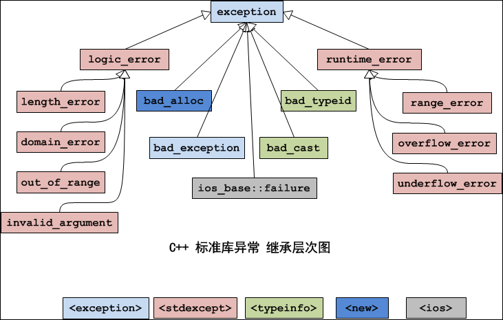

<!--
 * @Author: JohnJeep
 * @Date: 2020-05-27 10:12:26
 * @LastEditTime: 2022-01-27 15:41:24
 * @LastEditors: DESKTOP-0S33AUT
 * @Description: C++基础学习笔记
--> 

<!-- TOC -->

- [1. concept(概念)](#1-concept概念)
- [2. c++ basics(C++基础)](#2-c-basicsc基础)
- [3. namespace(命名空间)](#3-namespace命名空间)
- [4. header file(头文件)](#4-header-file头文件)
- [5. reference(引用)](#5-reference引用)
  - [5.1. ordinary reference(普通引用)](#51-ordinary-reference普通引用)
  - [5.2. lvalue reference(左值引用)](#52-lvalue-reference左值引用)
  - [5.3. rvalue reference(右值引用)](#53-rvalue-reference右值引用)
  - [5.4. const reference(常量引用)](#54-const-reference常量引用)
- [6. function(函数)](#6-function函数)
  - [6.1. inline(内联函数)](#61-inline内联函数)
  - [6.2. function parameter(函数参数)](#62-function-parameter函数参数)
  - [6.3. template function(模板函数)](#63-template-function模板函数)
  - [6.4. conversion function(转换函数)](#64-conversion-function转换函数)
  - [6.5. functor(仿函数)](#65-functor仿函数)
- [7. constructor(构造函数)](#7-constructor构造函数)
  - [7.1. copy constructor(拷贝构造)](#71-copy-constructor拷贝构造)
  - [7.2. copy assignment operator(拷贝赋值)](#72-copy-assignment-operator拷贝赋值)
- [8. destructor(析构函数)](#8-destructor析构函数)
- [9. empty class](#9-empty-class)
- [10. class object && class pointer(类对象与类指针的区别)](#10-class-object--class-pointer类对象与类指针的区别)
- [11. new && delete](#11-new--delete)
- [12. overload(重载)](#12-overload重载)
- [13. override(重写)](#13-override重写)
- [14. const](#14-const)
- [15. static](#15-static)
- [16. this](#16-this)
- [17. mutable](#17-mutable)
  - [17.1. mutable是什么？](#171-mutable是什么)
  - [17.2. 为什么要用mutable？](#172-为什么要用mutable)
  - [17.3. 使用mutable的注意事项](#173-使用mutable的注意事项)
  - [17.4. 常函数](#174-常函数)
- [18. pass by value && pass by reference(参数传递与返回值传递)](#18-pass-by-value--pass-by-reference参数传递与返回值传递)
- [19. friend(友元)](#19-friend友元)
- [20. operator overloading(操作运算符重载)](#20-operator-overloading操作运算符重载)
- [21. C++典型问题](#21-c典型问题)
  - [21.1. `.h`与 `.hpp` 文件区别](#211-h与-hpp-文件区别)
  - [21.2. ++i与i++效率问题](#212-i与i效率问题)
  - [21.3. 传值、传引用、传指针三者的区别](#213-传值传引用传指针三者的区别)
- [22. smart pointer(智能指针)](#22-smart-pointer智能指针)
  - [22.1. 为什么要使用智能指针？](#221-为什么要使用智能指针)
  - [22.2. 智能指针原理](#222-智能指针原理)
  - [22.3. 使用智能指针的优点](#223-使用智能指针的优点)
  - [22.4. auto_ptr](#224-auto_ptr)
  - [22.5. unique_ptr](#225-unique_ptr)
    - [22.5.1. 概述](#2251-概述)
    - [22.5.2. 为什么要用 unique_ptr](#2252-为什么要用-unique_ptr)
    - [22.5.3. 初始化](#2253-初始化)
    - [22.5.4. 成员函数](#2254-成员函数)
    - [22.5.5. unique_ptr 删除器](#2255-unique_ptr-删除器)
  - [22.6. shared_ptr](#226-shared_ptr)
    - [22.6.1. 概述](#2261-概述)
    - [22.6.2. 为什么要使用 shared_ptr](#2262-为什么要使用-shared_ptr)
    - [22.6.3. 成员函数](#2263-成员函数)
    - [22.6.4. 底层原理](#2264-底层原理)
    - [22.6.5. 初始化](#2265-初始化)
    - [22.6.6. 用法](#2266-用法)
    - [22.6.7. shared_ptr 删除器](#2267-shared_ptr-删除器)
    - [22.6.8. 注意点](#2268-注意点)
  - [22.7. weak_ptr](#227-weak_ptr)
    - [22.7.1. 概述](#2271-概述)
    - [22.7.2. 为什么要使用 weak_ptr](#2272-为什么要使用-weak_ptr)
    - [22.7.3. 初始化](#2273-初始化)
    - [22.7.4. 底层原理](#2274-底层原理)
    - [22.7.5. 成员函数](#2275-成员函数)
    - [22.7.6. 注意点](#2276-注意点)
  - [22.8. 参考](#228-参考)
- [23. typename](#23-typename)
  - [23.1. 概念](#231-概念)
  - [23.2. 为什么要用 typename ?](#232-为什么要用-typename-)
  - [23.3. 注意点](#233-注意点)
- [24. explicit conversions(显示类型转换)](#24-explicit-conversions显示类型转换)
  - [24.1. static_cast<>()](#241-static_cast)
  - [24.2. reinterpret_cast<>()](#242-reinterpret_cast)
  - [24.3. dynamic_cast<>()](#243-dynamic_cast)
  - [24.4. const_cast<>()](#244-const_cast)
- [25. exception(异常处理)](#25-exception异常处理)
  - [25.1. 异常变量的生命周期](#251-异常变量的生命周期)
  - [25.2. 异常的层次结构](#252-异常的层次结构)
  - [25.3. 异常的优缺点](#253-异常的优缺点)
  - [25.4. 构造函数中的异常](#254-构造函数中的异常)
- [26. meaningful aphorisms (隽永警句)](#26-meaningful-aphorisms-隽永警句)
- [27. Reference by website(学习参考)](#27-reference-by-website学习参考)

<!-- /TOC -->

# 1. concept(概念)

c++ 是一种倾向于系统编程的通用编程语言，在 C 语言的基础上发展起来的，支持的特性。

- supports data abstraction
- supports object-oriented programming
- supports generic programming  
- Compile-Time (constexpr and template metaprogramming)  

# 2. c++ basics(C++基础)
- C语言中，表达式的返回值是一个数值。C++中，表达式的返回值是变量的本身，可以作为左值，作为左值需要开辟一个内存空间。
- `endl` 与 `\n` 区别：
  - endl：换行和清除缓冲区到输出屏幕上
  - \n：仅仅只是换行
- float：有效数字是6~7位
- double：有效数字是15位
- char：8个bit，占一个字节空间
- 取模场景：
  - 取一个数的个位数
  - 多少天是一个月的第几天 
- `<<`左移运算符：右侧空位补 0
- `>>` 右移运算符：左侧空位补符号位，符号位正数部0，符号位为负数补1
- switch语句后的表达式只能为整型或字符类型
- break语句：执行循环体后，调出循环。可用于switch结构或者循环结构
- continue：只能用于循环结构，调出循环
- 计算数组大小：对基本类型（不包括String类型）：`sizeof(array_var) / sizeof(array_type)`
  
  >   sizeof(nums) / sizeof(int) 
- 指针：
  - 所有的指针都要初始化
  - `int *ptr`  整型指针，结果是一个值
  - `int *ptr  int*`：指向整型的指针，结果是一个地址
  - `void* ` 指针存放的是一个内存地址，地址的内容是什么类型不能确定 


# 3. namespace(命名空间)
- C中的命名空间
  - 只有一个全局的作用域，所有的全局标识符共用一个作用域。同名的标识符之间会发生冲突。

- C++的命名空间
  - 将全局的作用域分成不同的部分，不同命名空间的标识符可以同名而不会发生冲突。
  - 全局作用域也叫默认命名空间
  - 命名空间之间可以相互嵌套

- 语法
  ```cpp
  // 使用标准库中封装的内容。标准库中定义的所有名字都在命名空间 std 中
  using namespace std
  {
    .....
  }
  ```

- `::` 作用域运算符
  
  > `std::out` 从标准库中输出读取的内容，即编译器从操作符左侧名字的作用域中去寻找右侧的名字。
  
- 一般有三种方式去实现命名空间
  - 全部打开标准库中的内容。`using namespace std;`
  - 只打开标准库的部分内容。
    ```cpp
    using std::cout;
    
    int main()
    {
      cout << ...;
      std::cin >> ...;
      
      return 0;
    }
    ```

  - 在使用的时候根据需要打开
    ```cpp
    int main()
    {
      std::cout << ...;
      std::cin  >> ...;
     
      return 0;
    }


- 使用using定义别名与typedef的用法一样。`using uint64 = unsigned long long;`
  
  > C++编译器不支持使用 `typedef` 关键词为 模板类 设置别名，但是使用 `using` 的方式声明一个关键词却是允许的，只是这个是 C++11 标准才有的，如果在编译时不加上 `--std=c++11` 使用新的标准的话，编译器一样会报错。


# 4. header file(头文件)
- 头文件采用防御式声明 
  ```cpp
  #ifndef __TEST_H
  #define __TEST_H
    ...
    
  #endif
  ```

- 头文件名包含在尖括号 `<>` 中，则C++编译器将在存储标准头文件的主机系统的文件系统中查找；但如果文件名包含在双引号 `""` 中，则编译器将首先查找当前的工作目录或源代码目录（或其他目录，这取决于编译器）

- 类的声明和实现时分开的。
  - `.h` 文件只作类的声明
  - `.cpp` 文件进行类的实现 


# 5. reference(引用)

## 5.1. ordinary reference(普通引用)
在 C++ 中采用 `&` 符号表示引用，只是给对象起了一个别名。引用的功能主要是传递函数的参数和返回值。从使用者的角度，引用类似是一个别名，没有自己的内存空间，这是因为C++为了实用性，隐藏了相关细节。实质上引用有自己的内存空间。

引用初始化
- 引用被创建的同时必须被初始化，而指针则可以在任何时候被初始化。 一旦引用被初始化，就不能改变引用的关系，而指针则可以随时改变所指的对象。
- 单独定义引用时，必须要 `初始化`。
- 引用作为函数的参数声明时，`不` 需要进行初始化。
- 不能有 NULL 引用，引用必须与合法的存储单元关联，而指针则可以是NULL。


引用使用时注意点
- 传引用的效率比指针高，传递的直接是对象，而不是把对象复制。
- 函数内部的引用参数值可能会改变，一般需要加 `const` 解决。
- 不要返回局部变量的引用，全局变量和静态变量可以作为返回值的引用。 
- C++编译器在编译时使用一个常量指针作为引用的内部实现。因此，引用占用的内存空间大小与指针占用空间大小相同。`type& name <==> type* const name`


指针的引用 
- 格式 `const int* &a`
- 指针的引用做函数参数
- 函数二级指针作为输出变量


## 5.2. lvalue reference(左值引用)

左值就是一个能够被修改的变量。

- `引用` 作为 `左值`时，返回的是变量的本身，是变量而不是值（value）。变量只能是全局变量或静态变量，不能是局部变量，否则会出现 `Segmentation fault`。
- 函数的返回值作为一个 `左值`时，应该返回的是一个引用`(reference)`。
- 左值表达式表示的是一个对象的身份。
- 变量表达式是一个左值，作用的时间比较长，右值的作用时间比较短暂。 


## 5.3. rvalue reference(右值引用) 
何为右值引用？
- 必须绑定到右值的引用，采用 `&&` 来获得右值引用，而不是 `&` 
- 右值表达式表示的是对象的值。
- 右值引用只能绑定到一个将要被销毁的对象，该对象没有其它的用户。

`std::move()`
- 显式的将左值转化为对应的右值引用类型。
- 使用 `move()` 函数时告诉编译器，处理左值时像右值一样去处理它；对左值进行赋值或销毁外，不再使用它。


## 5.4. const reference(常量引用)
让变量的引用拥有只读 (read-only) 的属性。
```cpp
int x = 10;
const int &y = x;   // 不能通过y去修改x的值 
```

初始化
- 用变量初始化常引用。`int x = 10; const int &y = x;`
- 用自变量初始化常引用。`const int &a = 100;` 
- 使用常量引用进行初始化时，C++编译器会为常量值分配空间，并将引用名作为当前分配空间的别名。


# 6. function(函数)
C++对函数的检查更严格。C++支持bool类型：C++中的 `bool`，只占 1 个字节；java中使用 `boolean`；采用 `boolalpha`显示True或False；


## 6.1. inline(内联函数)
函数定义时，加 `inline` 关键字，例如 `inline void func(){}`。内联函数的关键字 `inline` 与函数体的实现在一起，不需额外的声明。 

实现机制
- C++编译器直接将函数体插入函数调用的地方。

什么时候可以用 `inline`？
- 函数体不能过大。
- 函数声明必须在调用之前声明。
- 不能对函数进行取值地址操作。 
- 不能存在任何形式的循环语句（for、while）。
- 内联函数省去了普通函数调用时的压栈、跳转、返回操作。


## 6.2. function parameter(函数参数)
默认参数
- 函数的参数有一个默认的值。
- 函数带有参数列表，参数列表的右边必须有默认的值，左边可以不给默认参数赋值。


占位参数
- 只有函数类型声明，没有函数变量声明。`int func(int a, int b, int)`


## 6.3. template function(模板函数)
什么是模板函数？
 - 函数定义时不指定具体的数据类型，建立一个通用函数。函数调用时，根据实际的参数反推数据类型，即类型的参数化。


## 6.4. conversion function(转换函数)
函数没有返回值，没有参数，函数的类型为需要转换的类型。通常转换函数中的内容都是不应该改变的，可以设置为 `const`。


## 6.5. functor(仿函数)
什么是仿函数？
- 一个 class 类中重载了函数调用操作运算符 `()`，任何一个东西能接受 `()` 操作运算符，这个东西就叫 `像函数` 或者叫 `仿函数`。
  


<font color=red>思考：</font>为什么C++中要把 class 设计成 pointer(智能指针)和 function(仿函数)？


# 7. constructor(构造函数)

- 为什么要用构造函数？
  - 被用来初始化类的对象。  
  - 类对象被创建时，编译器为对象(object)分配内存空间，并自动调用构造函数，完成成员的初始化 

- 构造函数特征 
  - 构造函数的 `函数名称` 与 `类的名称` 一样。
  - **函数没有返回值**
  - 函数参数值
    - 创建的对象有默认值时，应传入创建对象的默认值。
    - 创建的对象没有默认值时，编译器传入的默认值为 `0`

- 构造函数注意点
  - 构造函数是一个 `成员函数`，函数内有一个 `this` 指针
  - 构造函数的访问属性可以放在 `private` 中。在单例模式（singleton）中就采用这种用法。
  - `构造函数` 与 `析构函数` 在类中声明了 ，必须要通过类的方法去实现，即声明了必须要用，否则编译时会报错。
  - 多线程编程中，构造函数不能保证线程的安全。

- 类中默认的构造函数
  - 默认无参数构造：当类中没有定义构造函数时，C++编译器会默认提供一个无参数构造函数，构造函数的函数体为空。
  - 默认拷贝构造：当类中没有定义拷贝构造函数时，C++编译器会默认提供一个拷贝构造函数（浅拷贝），简单的进行成员变量的值拷贝操作。

- 构造函数分类
  - 无参构造：一般为栈内存空间，自动释放内存空间。调用时不用 `加括号`。
  - 带参数构造(重载了构造函数)
    - 一般为堆内存空间，需要使用delete释放内存空间；使用 `new` 关键字创建空间
    - 一般需要初始化构造的参数
    - 有默认值参数的构造函数，需要在类的声明中指定默认参数值，一般只能指定一次，在构造函数实现时不需要再给出默认值，否则会报错。
    ```cpp
    // 有参构造函数三种调用方法
    Test t1(10);         // 括号法
    Test t2 = t1;         // 等号法
    Test t3 = Test(30);  // 直接调用构造函数
    ```

  - 拷贝构造
    ```cpp
    // 声明一个类
    class String()
    {
      private:
        ...
      public:
        ...
    }
    // 实例化一个对象
    String st_one;
    
    // 拷贝构造
    String st_two = st_one;   // 方法一：等号(=)是拷贝一个对象不是赋值运算
    String st_three(st_one)   // 方法二：初始化拷贝构造
    ```

- 构造函数在继承中的用法
  > 构造函数与父类的其它成员(成员变量和成员方法)不同，它不能被子类继承。因此，在创建子类对象时，为了初始化从父类中继承来的成员变量，编译器需要调用其父类的构造函数。如果子类的构造函数没有显示地调用父类的构造函数，则默认调用父类的无参构造函数。 
  - 子类与父类均没有声明构造函数时，C++编译器会默认生成构造函数去调用。 
  - 子类继承父类的方法，默认会调用父类的无参数构造函数，再调用子类的无参或有参构造函数。
  - 当父类为有参构造函数时
    - 父类的有参构造函数有默认的值时，子类中不需要显式地调用父类的构造，C++编译器会默认的调用父类的有参构造函数。
    - 父类的有参构造函数没有默认的值时，子类中需要显式地调用父类的构造
      ```cpp
      class Parent
      {
       private:
       public:
         Parent(int a, int b){};
      }
       
      class Child:public Parent
      {
      private:
      public:
        Child(int m, int n):Parent(a, b)     // 显示的调用父类的构造函数
      }
      ```
    - 父类中既有无参默认构造又有带参默认构造函数时，子类继承父类时，需要子类显示的指定到底该调用哪一个构造函数。


## 7.1. copy constructor(拷贝构造)

- 拷贝构造函数是由普通构造函数和赋值操作符共同实现的。
- 拷贝构造函数必须以 `引用(reference)`的形式传递(参数为引用值)。
- 拷贝构造函数使程序更有效率，因为它不用再构造一个对象的时候改变构造函数的参数列表
- 当某对象是按值传递时（无论是类的对象作为函数参数，还是作为函数返回值），编译器都会先建立一个此对象的临时拷贝，而在建立该临时拷贝时就会调用类的拷贝构造函数。

-------------------------

- 浅拷贝
  - 当类的对象发生复制过程的时候，类的对象自己有资源（堆，或者是其它系统资源），但复制过程中并未复制资源，只是改变了指针的指向，这种称为浅拷贝。
  - 只是将类的成员值进行拷贝，类指针没有进行拷贝，两个指针同时指向一块内存空间。
    ```cpp
    // 没有做任何的说明，C++编译默认使用的是浅拷贝。
    People obj_2 = obj_1;   将obj_1对象的内容拷贝到obj_2对象中，不是拷贝的指针。
    ```
  - 浅拷贝完成后，在释放资源的时候会产生资源归属不清的情况，导致一个指针指向已经被删除的内存空间，使程序运行出错。即销毁对象时，两个对象的析构函数将对同一个内存空间释放两次。
  
- 深拷贝
  - 当类的对象发生复制过程的时候，类的对象自己有资源（堆，或者是其它系统资源），但拷贝过程中复制了资源，这种将一个对象的资源完整的拷贝到另一个对象的过程，称为深拷贝。
  - 不仅拷贝了类的 `成员变量值`，还拷贝了类的指针，两个指针指向两块不同的内存空间。


- 什么时候用深拷贝和浅拷贝？
  - 类中没有自定义拷贝构造函数时，编译器会默认调用浅拷贝，完成成员的复制。
  - 当类的成员中没有指针时，浅拷贝是可行的。
  - 当类的成员中有指针时，如果采用简单的浅拷贝，则两类中的两个指针将指向同一个地址，当对象快结束时，会调用两次析构函数，而导致指针悬挂现象，因此必须要用深拷贝。
  
- 参考
  - [c++拷贝构造函数详解](https://www.cnblogs.com/alantu2018/p/8459250.html)


## 7.2. copy assignment operator(拷贝赋值) 

```cpp
// 将对象s1拷贝赋值给对象s2，内部处理过程分3步：

class MyString
{
private:
    char* m_data;
public:
    MyString(const char* cstr = 0) {}             // 带有初始值的构造函数
    MyString(const MyString& str) {}              // 深拷贝构造
    MyString& operator=(const MyString& str);     // 操作符重载，拷贝赋值
    ~MyString() {}
    char* getStr() const {return m_data;}
};

MyString& MyString::operator=(const MyString& str) 
{
  if (this == &str)   // 进行自我赋值检测
  {
    return *this;
  }
  delete[] m_data;                           // 1、释放原先数据m_data的内存空间
  m_data = new char[strlen(str.m_data) + 1]; // 2、重新给m_data 分配内存空间
  strcpy(m_data, str.m_data);                // 3、执行拷贝操作
  return *this;
}
// 在拷贝之前需要进行自我赋值检测。即自己把值赋给自己，保证在执行第二步操作时，指针有指向的位置。
// 若不进行自我检测步骤，先释放原先数据m_data的内存空间后，此时指针m_data没有一个确定的指向，
// 不能重新分配内存空间，导致程序出错。
```

# 8. destructor(析构函数)

- 表示：在类名称之前加 `~`。例如：`string::~string()` 
- 作用：类的对象离开作用域后释放对象使用的资源，在类死亡之前的前一刻调用，用于清除类中的资源（比如：释放内存）。
- `一个类只能有一个析构函数，多个类有多个析构函数`，如果没有显式的定义，系统会自动生成一个默认的析构函数。
- 析构函数不能 `重载`。每有一次构造函数的调用就会有一次析构函数的调用。
- 只有当一切的构造动作都完成时，析构函数才有可能会被调用。因为在构造函数中可能会抛出异常从而导致程序结束。

# 9. empty class
- C++中一个 class 中什么也没有写，是一个空的类 (empty class)，形如 `class Stu {};` 这样，程序编译时，C++编译器会给这个 `empty class` 提供默认构造函数 (constructor)、析构函数 (deconstructor)、拷贝构造函数 (copy constructor)、拷贝赋值函数 (copy assignment)，并且这些函数的默认属性都是 `public` 且 `inline`。

- 注意：C++中一个空类的大小为 `1byte` 
  
  > 空类中没有函数和数据成员，但可以实例化类；一个类能被实例化，编译器就要给他分配空间，来指示类实例化的地址，通常编译器分配为 1 个字节（char类型），这样分配同时也保证了 空类占用的空间最小。


# 10. class object && class pointer(类对象与类指针的区别)
```cpp
class Stu
{
private:

public:
}
```

- 类对象
  - 格式：`Stu s1;`
  - 定义之后就已经为 `s1` 这个对象在栈上分配了内存

- 类指针
  - 格式：`Stu *s2 = new Stu;`
  - 定义 `*s2` 的时候没有分配内存，只有执行 `new` 后才会在堆上分配内存，是个永久的变量，需要用 `delete` 关键字手动去释放它。


# 11. new && delete
- windows 下内存显示总是 `16` 的倍数，若果不是 16 的倍数，则填充为最靠近 16 的倍数的大小。 
- `new` 动态分配内存 
  - 先分配memory，再调用构造函数 
  - new创建一维动态数据
    ```cpp
    // 普通类型
    根据哪种数据类型来分配内存？根据数据类型来确定分配多少内存？找到这样的内存，并返回其地址。
    格式：typeName* pointer_name = new typeName 
    例如：int *p = new int;
    
    指针 p 指向的内存没有名称，那么要如何称呼它呢？我们说指针 p 指向一个数据对象， 这里的“对象”不是“面向对象编程”中的对象， 而是一种“东西”，它指的是为数据项分配的内存块。 
    数据对象：可以是复杂的结构类型，也可以是基本类型。
    
    // 一维数组
    typeName* pointer_name = new typeName[num_elements];
    例如：int *p = new int[10];
    注意：将数组的元素类型和元素数目告诉new即可。 必须在类型名后加上方括号， 其中包含元素数目。new运算符返回第一个元素的地址。
    
    ```
  - 创建二维数组
    ```cpp
    格式：typeName (*ptr)[col_num] = new typeName[row_num][col_num];
    例子：int (*ptr)[2] = new int[4][2];
    ```
  - 创建对象
    ```cpp
    class Airplane
    {
      ...
    }
    
    Airplane *ap = new Airplane;
    ```


- `delete` 释放内存，与new配对使用 
  - 先调用析构函数，再释放memory  
  - 注意
    - 不要使用delete释放同一个内存块两次。
    - 不是用new分配的动态内存空间，不能用delete释放
    - 对空指针使用delete是安全的。


- 注意：
  - 采用 `array new` 的方式创建一块内存空间，则一定要采用 ` array delete` 方式去释放内存，否则在涉及指针的时候可能会导致内存泄漏。泄漏的并不是整个分配的内存空间，而是分配的空间中数组没有被释放的部分。
  - 不配对地使用new和delete，将发生内存泄漏（memory leak），被分配的内存再也无法使用了，如果内存泄漏严重，则程序将由于不断寻找更多内存而终止。


--------------
- class member operator new()


- 标准库中使用 `placement arguments new` 的例子


# 12. overload(重载)

指函数名相同，但是它的参数表列个数或顺序，类型不同，不能靠返回类型来判断，函数的返回值不是函数重载判断的标准。

- 在同一个作用域中（C++中构造函数也可以重载）。
- 函数名字相同。
- 参数不同。
- virtual 关键字可有可无。
- 返回值可以不同。

> 函数重载底层实现：编译器在编译时，根据函数的参数列表进行重命名。


- 子类无法重载父类的函数。如果子类与父类的函数名称相同，则发生函数名称覆盖，不会发生函数重载。若想在子类和父类中分别调用具有相同名称的函数，则需要使用 `域分符号::`
- 当子类中没有与父类相同参数的函数，只有名称相同的函数时，而子类去调用父类中重载的函数，则 C++ 编译器会将子类中有相同函数名称的函数去覆盖掉父类中相同名称的函数，从而将当前子类调用父类的函数当做子类中一个新的重载函数，但是编译器发现子类中并没有该函数的重载，因此会报错。


# 13. override(重写)

重写（也称为覆盖 override）是指派生类重新定义基类的虚函数。必须发生在子类与父类之间，并且父类与子类的函数具有完全相同的原型。使用 `virtual` 关键字声明后，能够产生多态，没有使用 `virtual` 关键字，只能叫重定义，不叫虚函数重写。

- 不在同一个作用域，分别位于派生类与基类。
- 函数名字相同。
- 参数相同。
- 基类函数必须有 virtual 关键字，不能有 static。
- 返回值相同，否则会报错。
- 重写函数的访问修饰符可以不同。若基类中函数的修饰符是 private，派生类中重写的函数可以是 public，protected。


<font color=red>
重载与重写的区别
- 作用域不同：重载是在同一区域，子类无法重载父类，父类同名函数的将被覆盖，重写 是在父类与子类之间。
- 重载是在 编译期间 根据参数列表决定，重写是在 运行期间 根据具体对象类型来决定调用的函数。
</font>


# 14. const
- C语言中，`const` 是只读的变量，有自己的存储空间。
- C++中，`const` 可能分配存储空间，也可能不分配存储空间。
  - 当 `const` 作为全局变量，并在其它的文件中到调用时，会分配存储空间。
  - 采用 `&` 地址运算符去取 `const` 变量的地址时，会分配存储空间。
- 加 `const` 后，不会改变数据的内容，不加`const`，则会改变数据的内容，一般数据的内容定义在 `private`中。

- const 放在函数声明前表明函数的 `返回值是 const 类型`，不能修改。
  ```cpp
  const int add(int x, int y)
  {
    return x+y;
  }
  ```

- 定义const成员函数时，把const关键字放在函数的参数表和函数体之间作用：表用该函数的数据成员不能被改变，`const` 修饰的是 `this` 指针指向的内存空间。如果在编写 const 成员函数时，不慎修改了数据成员，或者调用了其它非const 成员函数，编译器则将报错。
  ```cpp
  class Complex
  {
  public:
    double real(int a, int b) {
      return re;
    }
  
    // 不加const时，C++编译器简单编译等价为，不允许我们手动去改变this指针，否则会编译器会报错
    double real(Complex* const this, int a, int b) {
      return re;
    }
  
    double real(int a, int b) const {
      return re;
    }
  
    // 在编写代码时，隐藏了this指针，不用书写；但实际上C++编译器已经帮我们做好了this指针的处理，加const后，上面的成员函数等价于下面的函数
    double real(const Complex* const this, int a, int b) {
      return re;
    }
  
  };
  ```

  > <font color="red"> 
  > 注意：void test() const {}; 这样定义的函数只能作为类的成员函数，不能作为一个全局的函数，即非类的外部这样使用，编译器会报错。
  > </font>


- 在类中采用 `const`修饰函数，需要在类调用时必须加 `const`
  ```cpp
  // definition
  const class complex
  {
  
  };
  
  // 调用：
  const complex fx(1, 2);
  ```
- const 对象只能调用const成员函数，const 类对象成员的数据在类对象的生命周期内不能改变。
- const 成员函数是对 const 对象的限制；const 成员函数只能读类对象成员的数据，不能修改类对象成员的数据。


- `const常量` 由 `编译器`处理的，提供作用域检查和类型检查。而 `宏定义（#define）` 仅仅只是单纯的文本替换，在 `预处理` 阶段处理的。


# 15. static

static 成员定义
- 一个 static 数据成员只能被定义一次。static 数据成员类似于全局变量，定义在任何的函数之外，一旦被定义，就一直存在与程序的**整个生命周期内**。
- 既可以在类的外部定义又可以在类的内部定义 static 成员，但是在类的外部定义时，不能重复 `static` 关键字，`static` 只出现在类的内部。


static 成员初始化

- 若在类的内部提供了一个初始值，则在成员的定义时，不能再赋初值了。
- 不能在类的内部初始化静态成员，必须在类的外部初始化每个静态成员。
- 不能在构造函数或初始化列表中初始化静态成员。


<font color=red>
static 修饰的成员函数是属于 class 本身，在类加载的时候就会分配内存，可以通过类名直接去访问；而非 static 修饰的成员函数是属于 类的对象，只有在类的对象产生（创建类的实例）时才会分配内存，然后通过类的对象（实例）去访问。
</font>

非静态成员初始化
- `const` 类型的成员变量只能在初始化列表中初始化。
- 非 `const` 类型的成员变量可以在构造函数或初始化列表中初始化。

继承中的 `static`
  - 需要在类的外部进行初始化，并且C++编译器在外部初始化的同时还给变量分配内存空间，只有在使用时才分配内存空间，不调用不分配内存空间。

类模板中的 `static`
- 每个类模板中都有自己的类模板 `static` 数据成员副本。
- 与非类模板的 `static` 数据成员一样，类模板中的 `static` 数据成员也需要进行 `定义` 和 `初始化`。


static 成员与非 static 成员的区别?
- 一个类的成员变量为 static 成员变量时，这个类中无论有多少个对象被创建，这些对象都共享这个 `static` 成员；即静态成员独立于任何的对象。
- 静态成员可以作为默认的参数，而非静态成员不能作为默认的参数，因为它本身的值属于对象的一部分。


**为什么要用 static 成员函数？**
1. 由于没有 this 指针，可以把某些系统 API 的回调函数以静态函数的形式封装到类的内部。因为系统 API 的回调函数通常都是那种非成员函数，没有 this 指针的。比如你可以在类的内部写一个线程函数供 CreateThread 创建线程用，如果没有静态函数，那么这种回调函数就必须定义成 全局函数（非静态成员函数指针无法转换成全局函数指针），从而影响了OOP的“封装性”。
2. 封装某些算法，比如数学函数，如ln，sin，tan等等，这些函数本就没必要属于任何一个对象，所以从类上调用感觉更好，比如定义一个数学函数类Math，调用Math::sin(3.14);如果非要用非静态函数，那就必须：`Math math;math.sin(3.14); `行是行，只是不爽：就为了一个根本无状态存储可言的数学函数还要引入一次对象的构造和一次对象的析构，当然不爽。而且既然有了对象，说不得你还得小心翼翼的定义拷贝构造函数、拷贝赋值运算符等等，对于一些纯算法的东西显然是不合适的。


# 16. this

- C++中的成员函数和成员变量是分开存储的。
- 什么叫成员函数：在类（class）中声明的函数。
- 什么叫非成员函数：没有在类（class）中声明的函数，非成员函数也叫全局函数。
- 什么是 `this`?
  > `this` 是C++中的一个关键字，是一个 pointer。在面向对象中，哪个对象调用非静态成员函数，`this` 指针就指向哪个对象。 
  


- 静态成员函数中不包含 `this` 指针，非静态成员函数中包含 `this` 指针


- 成员函数中 `const` 修饰的是谁？
  ```cpp
  class TT
  {
  private:
    ......
  public:
    void func(int a, int b) const
    {}
  }
  
  // 由C++面向对象模型知，上面的函数等价于
  void func(TT *this, int a, int b) const
  {}
  
  // const 修饰的是this指针指向的内存空间。
  ```

- 类名后直接加括号，表示是一个临时对象(local object)。
  ```cpp
  //声明类
  class Complex
  {
  public:
      // 主要放置函数
      ........
  
  private:
      // 定义数据
      ........
  }
  
  // 调用临时对象
  Complex();
  ```

- 匿名对象什么时候留下？什么时候被析构？
  - 用匿名对象初始化一个同类型的对象，则匿名对象转化为有名字的对象。
  - 用匿名对象赋值给另外一个对象，则匿名对象被析构。


# 17. mutable

## 17.1. mutable是什么？
- mutable的中文译为 “可变的，易变的”，是constant（即C++中的const）的反义词。
- C++中为了突破 const 的限制而采用的，被 mutable 修饰的变量将永远处于可变的状态。

## 17.2. 为什么要用mutable？
- 我们知道，如果类的成员函数不会改变对象的状态，那么这个成员函数一般会声明成const的。但是，有些时候，我们需要在const的函数里面修改一些跟类状态无关的数据成员，那么这个数据成员就应该被 mutable 来修饰。
- mutable 常用于指定不影响类的外部可观察状态的成员（通常用于互斥体[mutexes]、记忆缓存[memo caches]、惰性求值[lazy evaluation]和访问指令[access instrumentation]等）。

```cpp
class ThreadsafeCounter {
mutable std::mutex m; // mutable 和 mutex 用在一起情况
int data = 0;
public:
int get() const {
    std::lock_guard<std::mutex> lk(m);
    return data;
}
void inc() {
    std::lock_guard<std::mutex> lk(m);
    ++data;
}
};
```


## 17.3. 使用mutable的注意事项
- mutable只能作用于类的非静态和非常量数据成员。mutable不能修饰static数据成员，因为static数据成员存储在Data段或BSS段，属于类，不属于类对象，因此类的static数据成员不需要 mutable 的修饰。但常对象和常函数可以对其任意地修改，对于常对象的数据成员一般不可以被修改，若想修改，则需要 mutable 的修饰。
- 在一个类中，应尽量或者不用 mutable，大量使用 mutable表示程序设计存在缺陷。
    ```cpp
    class Student
    {
    string name;
    mutable int getNum;             // ok
    mutable const int test;         // 编译出错
    //mutable static int static1;   // 编译出错
    }
    ```

## 17.4. 常函数
- 什么是常函数？
  - 常函数就是带const修饰的函数。

- 为什么要有常函数这个概念？
  - 为了封装的良好性，有时我们用到的一些函数并不需要我们去改变类中的参数和成员变量，仅仅只是为了显示和输出的作用，因此才引进常函数。


参考
  - [cpp reference官网解释mutable关键字](https://en.cppreference.com/w/cpp/language/cv)
  - [C++ mutable 的用法](https://blog.csdn.net/K346K346/article/details/48030597) 
  - [C++中的mutable关键字](https://blog.csdn.net/starlee/article/details/1430387?utm_medium=distribute.pc_relevant_t0.none-task-blog-BlogCommendFromBaidu-1.control&depth_1-utm_source=distribute.pc_relevant_t0.none-task-blog-BlogCommendFromBaidu-1.control)


# 18. pass by value && pass by reference(参数传递与返回值传递)
- 传值(pass by value)是将整个的数据传递给调用者
- 传引用(pass by reference)本质是 `传指针`。
  - 采用一个 `&` 符号表示。
  - 希望调用者对传递的数据不能进行修改，在数据前加 `const` 限制。

- 参数传递时：在能使用传reference的前提下，一般优先使用 `传引用` 而尽量少使用传值，并不是必须的。`传引用` 的速度比 `传值` 速度快。
- 函数返回 `值传递` 时：在能使用传reference的前提下，一般优先使用 `传引用` 而尽量少使用传值，并不是必须的。 

- 什么情况下不能使用 `引用传递（reference）`？
  - 当一个函数参数的变量为局部变量时，不能使用传引用。因为变量在函数结束时，变量就被销毁了，不存在，若再传递引用，调用者则不能得到值，会出错。


# 19. friend(友元)
- 友元函数
  - 在一个类中使用 `friend` 关键字时，不是当前类的成员函数可以去访问当前类的私有成员或 protect成员 数据。
  - 重载运算符 `<<` 和 `>>` 一般使用友元函数，其它的函数一般定义为 `类的成员函数`。
  - `类模板` 中一般不要滥用友元函数，使用会很复杂，若将 `.h` 文件与 `.cpp` 文件分开实现，将会更加的复杂。

- 同一个 class 中的各个对象(object) 互为友元。
  ```cpp
  // 函数定义：
  int func(const complex& param)
  {
      return param.value;
  }
  
  // 声明对象:
  complex c1;
  complex c2;
  c2.func(c1);   // 采用友元的方式实现，通过对象参数访问私有成员数据
  ```

- 友元类
  - 若B类是A类的友元类，则B类的所有成员函数都是A类的友元函数。
  - 通常是为设计一种数据操作或类之间传递消息的辅助类。

- 采用友元的优缺点
  - 优点
    - 可以灵活地实现需要访问若干类的私有或受保护的成员才能完成的任务；
    - 便于与其他不支持类概念的语言(如C语言、汇编等)进行混合编程；
    - 通过使用友元函数重载可以更自然地使用C++语言的IO流库。
  - 缺点
    - 一个类将对其非公有成员的访问权限授予其他函数或者类，会破坏该类的封装性，降低该类的可靠性和可维护性。


# 20. operator overloading(操作运算符重载)
- 为什么要操作符重载？
  
  > 普通的运算规则不能满足复杂的数据类型，像 `类（class）`数据类型，需要编程人员自定义运算规则去实现。
- 操作运算符重载的本质是个 `函数`。

- 操作符重载有两种实现的方式
  - 非成员函数方式，即全局函数（全域）的方式。
    - 通常与 `friend` 友元函数结合在一起使用。
    - 应用场景：重载不同类之间的操作符。例如，重载 `<<` 和 `>>`，编程人员自定义的类与C++编译器中 `ostream` 或 `istream` 类中的数据进行操作符重载。
  - 成员函数方式。
    - 函数的参数有一个隐藏的 `this` 指针，可以在函数里面去调用。

- 分析重载的步骤？
  - 确定函数名称
  - 确定函数参数
  - 根据业务，确定函数的返回值类型（是返回引用还是返回值？）以及函数体的实现。  

- `=赋值` 操作符重载
  - `=` 只是将成员变量的值相应复制。由于对象内包含指针，将造成不良后果：指针的值被丢弃了，但指针指向的内容并未释放。 


# 21. C++典型问题

## 21.1. `.h`与 `.hpp` 文件区别
- `.hpp` 本质就是将.cpp的实现代码混入.h头文件当中，定义与实现都包含在同一文件，则该类的调用者只需要include该.hpp文件即可，无需再将cpp加入到project中进行编译。而实现代码将直接编译到调用者的obj文件中，不再生成单独的obj，采用hpp将大幅度减少调用project中的cpp文件数与编译次数，也不用再发布lib与dll文件，因此非常适合用来编写公用的开源库。

- hpp的优点
  - 是Header Plus Plus的简写。（.h和.hpp就如同.c和.cpp似的）
  - 与.h类似，.hpp是C++程序头文件格式。
  - 是VCL专用的头文件,已预编译。
  - 是一般模板类的头文件。
  - 一般来说，.h里面只有声明，没有实现，而.hpp里声明实现都有，后者可以减少.cpp的数量。
  - .h里面可以有using namespace std，而.hpp里则无。
  - 不可包含全局对象和全局函数。

- 当hpp文件中存在全局对象或者全局函数，而该hpp被多个调用者include时，将在链接时导致符号重定义错误。要避免这种情况，需要去除全局对象，将全局函数封装为类的静态方法。


## 21.2. ++i与i++效率问题
- `++i` 返回的是对象的引用，而 `i++` 返回的是对象的原值（但非左值）。
- `++i` 先自增，后返回原对象的对象，没有产生任何临时对象；而 `i++`，先保存原对象，然后自增，最后返回该原对象的临时对象，需要创建和销毁对象。


## 21.3. 传值、传引用、传指针三者的区别
- 形参
  - 在函数或方法中定义的参数就是形参。
  - 函数没有被调用时，形参并不会占用内存的存储单元，只有当函数被调用时，形参才会被分配内存单元，在函数体执行完后，形参存储的内存单元被释放。

- 实参
  - 实参可以是常量、变量和表达式，但必须要有确定的值。  
  - 函数调用的时候，先给形参分配内存空间，然后将实参的值拷贝一份给形参，函数体调用结束后，形参分配的内存空间被释放，但是实参分配的内存空间还存在。

- 传值
  - 可以传实参和形参。
  - 比如函数定义为 `fun(int a)`，在调用的地方有`int x=6`， 使用`fun(x)`调用。这种方式在 `fun(int a)` 函数内部的对`a`的修改 `不能` 导致外部 `x` 的变化。
  - 值传递时，程序会为形参分配内存空间，并将实参的值赋值给形参，函数体中形参的改变并不会影响实参的值，形参存储的是实参的副本。


- 传地址
  - 传地址也叫指针传递。
  - 函数定义为 `fun(int *a)`，形参为指针，调用的时候传递的是参数的地址，例如 `int x=6; fun(&x)`。 这种方式在 `fun(int a)`函数内部的对 `a` 的修改 `能` 导致外部 `x` 的变化。


- 传引用
  - 用 `&` 符号定义的形参，在参数传递时相当于实参的一个别名，对形参的操作相当于直接对实参进行操作。
  - 函数定义为 `fun(int& a)`，形参为引用，例如 `int x=6; fun(x)`。 在 `fun(int& a)` 函数内部的对变量 `a` 的修改 `能` 导致外部 `x` 的变化。
  - 传引用时，程序不是将直接实参本身的值复制后传递给形参，而是将实参的地址值传递给形参，形参所引用地址上的变量与传递的实参相同，因此，函数体内形参的改变会直接改变实参的值。


# 22. smart pointer(智能指针)
C++11 起 C++ 标准库提供了两种类型的智能指针：`shared_ptr` 和 `unique_ptr`。而所有的智能指针都被封装在标准库的 `<memory>` 头文件中，要使用智能指针必须引入 `#include <memory>` 头文件。


## 22.1. 为什么要使用智能指针？
- 动态分配内存时可能会出现一些问题
  - 忘记释放内存，会造成内存泄漏
  - 有指针引用内存的情况下，释放了内存，产生引用非法内存的指针。
- 需要更加安全的来管理动态内存。动态内存分配常用 `new` 和 `delete` 来分配内存。不使用 smart pointer 时，用动态内存分配时，可能会忘记 delete，导致内存泄漏；也可以使用异常捕获，但是会导致代码比较臃肿，不易阅读和维护。因此智能指针可以很好的解决这个问题。
- 负责自动释放所指向对象的内存资源。智能指针就是一个类（class），当超出了类的作用域时，类会自动调用析构函数，释放资源。


## 22.2. 智能指针原理
智能指针底层源码采用类模板（class template）来实现的，并不是一个简单的普通指针。可以用下面的模型来简单的表示


## 22.3. 使用智能指针的优点
- 在函数结束时自动释放内存空间，不需要手动释放内存空间。


## 22.4. auto_ptr
- auto_ptr 智能指针采用所有权模式。
- 已被C++11弃用，潜在内存崩溃问题。
- 存在非法的申请内存时，在编译期时可能通过，但程序在运行时可能会出错。


## 22.5. unique_ptr

### 22.5.1. 概述
`unique_ptr` 实现的是一种独一无二拥有权 (exclusive ownership) 的概念。保证一个对象和其相应资源同一时间内只能被一个智能指针拥有(ownership)。当 unique_ptr 被销毁时，它所指向的对象也就自动销毁。

### 22.5.2. 为什么要用 unique_ptr
它对于避免资源泄露，例如以 `new` 创建对象后因为发生异常而忘记调用 `delete`特别有用。 


### 22.5.3. 初始化
unique_ptr 智能指针提供三种方式进行对象的初始化。构造函数中初始化、移动构造函数中初始化 `std::move()`、采用 `reset()` 成员函数进行初始化。

- unique_ptr 不允许执行 copy(拷贝) 和 assignment(赋值) 操作。但是可以用 `std::move()` 语义将对象的拥有权转移。
    ```cpp
    // initialize a unique_ptr with a new object
    std::unique_ptr<ClassA> up1(new ClassA);
    
    // copy the unique_ptr
    std::unique_ptr<ClassA> up2(up1);  // ERROR
    
    // assign the unique_ptr, transfer ownership from up1 to up3
    std::unique_ptr<ClassA> up3(std::move(up1));    // OK
    ```

- 当程序试图将一个 unique_ptr 赋值给另一个时，如果源 unique_ptr 是个临时右值，编译器允许这么做；如果源 unique_ptr 将存在一段时间，编译器将禁止这么做。
  ```cpp
  unique_ptr<string> pu1(new string ("hello world")); 
  unique_ptr<string> pu2; 
  pu2 = pu1;                                      // 不允许拷贝构造
  unique_ptr<string> pu3; 
  pu3 = unique_ptr<string>(new string ("You"));   // 允许
  ```

- 想要执行 ` pu2 = pu1;` 的操作，又要保证指针的安全。可以用C++有一个标准库函数 `std::move()`，让你能够将一个 `unique_ptr`赋给另一个。
  
  > 尽管转移所有权后 还是有可能出现原有指针调用（调用就崩溃）的情况。但是这个语法能强调你是在 `转移所有权`，让你清晰的知道自己在做什么，从而`不乱调用原有指针`。
  
- unique_ptr 可以转移对象的拥有权。使unique_ptr 不必一定拥有对象，它也可以是 empty；例如：当它被默认构造函数创建时。
  ```cpp
  std::unique_ptr<std::string> ip;
  ip = nullptr;
  ip.reset();
  ```

### 22.5.4. 成员函数
- `move()`: 转移对象的拥有权
- `reset()`: 销毁内部对象并接受新对象的所有权并将该智能指针被置为空，等价于 up = nullptr
- `release()`: 放弃内部对象的拥有权
- `swap()`: 交换两个指针指向的对象(即交换所拥有的对象)。
- `get()`: 获得内部对象的指针

### 22.5.5. unique_ptr 删除器
unique_ptr 也有自己的 删除器。
```cpp
    // 但lambda 表达式中没有写捕获参数时，要实现自己的删除器，需要在模板参数中指定其参数类型
    using func = void(*)(Stu*);    // void 类型的函数指针
    unique_ptr<Stu, func> s1(new Stu(100), [](Stu* p){    
        delete p;
    });


    // 有捕获参数时，unique_ptr 模板参数类型为 仿函数的返回类型
    unique_ptr<Stu, std::function<void (Stu*)>> s2(new Stu(200), [&](Stu* p){    
        delete p;
    });

    // 申请的内存为数组类型时，模板参数为数组类型
    unique_ptr<Stu[]> ptr1(new Stu[3]);
```

独占的智能指针能管理数组类型的地址，能够自动释放。
```cpp
unique_ptr<Stu[]> ptr1(new Stu[3]);
```

C++11 中 shared_ptr 不支持下面的语法，自C++11之后的版本，开始支持下面的语法。
```cpp
shared_ptr<Stu[]> ptr1(new Stu[3]);
```


## 22.6. shared_ptr

### 22.6.1. 概述
`share_ptr` 实现的是一种共享所有权 (shared ownership)的概念。多个智能指针可以指向同一个对象，该对象和它的相关资源会在最后一个指针的指向 (`reference`) 被销毁时，得到释放。


### 22.6.2. 为什么要使用 shared_ptr
shared_ptr 是为了解决 auto_ptr 在对象所有权上的局限性(auto_ptr 是独占的)，在使用引用计数的机制上提供了可以共享所有权的智能指针。  


### 22.6.3. 成员函数
- `use_count()` 返回引用计数的个数
- `unique()` 返回指针对象的拥有者是否唯一(等价于 use_count=1)
- `swap()` 交换两个 shared_ptr 对象(即交换所拥有的对象)
- `reset()` 放弃内部对象的所有权或拥有对象的变更, 会引起原有对象的引用计数的减少。简单来说，主要有两个作用：1、让指针指向另一块内存；2、重置指针，即让引用计数变为 0。
- `get()` 获得被 `shared_ptr` 包裹的内部对象, 即获得原始的指针，类似 `*p` 这样的。
- `get_deleter()` 返回删除器 (deleter) 的地址。
  

### 22.6.4. 底层原理
采用 `引用计数` 的方法，记录当前内存资源被多少个智能指针引用，该引用计数的内存在堆上分配。当新增一个指针时，`引用计数` 加1，当释放时 `引用计数` 减一。只有引用计数为0时，智能指针才会自动释放引用的内存资源。


### 22.6.5. 初始化
`shared_ptr` 有四种初始化方式。

- 通过构造函数初始化。
- 通过移动构造函数或者拷贝构造函数初始化。
- 通过 `reset()` 函数进行初始化。
- 通过 `make_shared` 初始化。用 `shared_ptr` 进行初始化时不能将一个普通指针直接赋值给智能指针，因为一个是指针，一个是类。但可以通过 `make_shared` 函数或者通过构造函数传入普通指针，并可以通过 `get()` 函数获得普通指针。 
    ```cpp
    shared_ptr<string> p = new string("hello");               // ERROR
    shared_ptr<string> p(new string("hello"));                // OK
    shared_ptr<string> p = make_shared<string>("hello"));     // OK
    ```

### 22.6.6. 用法
直接使用智能指针对象。
```cpp
    shared_ptr<Stu> st5 = make_shared<Stu>(9527);
    st6->setValue(777);
    st6->getValue();
```

获取智能指针对象的原始指针。
```cpp
    shared_ptr<Stu> st1(new Stu(007));
    Stu* p = st1.get();
    p->setValue(100);
    p->getValue();
```


### 22.6.7. shared_ptr 删除器
shared_ptr 默认的删除器函数不能自动析构申请的是数组类型对象的内存，因此需要手动实现一个删除器；当申请的内存不是数组类型时，不需要手动实现删除器。
```cpp
shared_ptr<Stu> st(new Stu(10), [](Stu* p){
    delete p;
});
```
其中对象中的第二个参数是匿名对象，这个匿名对象可以对象的外部实现后再传入进来，也可以在对象中使用 lambda 表达式，例如：`[](Stu* p){}`。
```cpp
    // 定义一个自己的删除器：deleter,可以选择自己不手动实现
    shared_ptr<string> str(new string("Implement my deleter"),
                          [](string* p) {
                              cout << "deleter: " << *p << endl;
                              delete p;
                          });
    str = nullptr;

    // 必须要手动实现删除器
    // shared_ptr<Stu> St7(new Stu[5]);   // 执行 5 次 构造函数，析构函数执行一次，造成内存泄漏
    shared_ptr<Stu> St7(new Stu[5], [](Stu* t){  // 改进版
        delete []t;
    });
```

在删除数组内存时，除了自己编写删除器，也可以使用 C++ 提供的 std::default_delete<T>() 函数作为删除器，这个函数内部的删除功能也是通过调用 delete 来实现的，要释放什么类型的内存就将模板类型 T 指定为什么类型即可。具体处理代码如下：
```cpp
    shared_ptr<Stu> st8(new Stu(5), default_delete<Stu>());
```

自己封装一个 `make_shared_array` 方法来让 `shared_ptr` 支持数组。
```cpp
template<typename T>
shared_ptr<T> make_shared_array(size_t len)
{
    return shared_ptr<T>(new T[len], default_delete<T[]>());
}

void test05()
{
    shared_ptr<Stu> t = make_shared_array<Stu>(4);
    cout << t.use_count() << endl;
}
```

完整的代码可在仓库中查看：[shared_ptr实现](./code/c11/shared_ptr.cpp)


### 22.6.8. 注意点
- `shared_ptr` 还有可能导致内存泄漏。两个对象相互使用一个 `shared_ptr` 成员变量指向对方，会造成循环引用，从而导致内存泄漏。
- 不能使用一个原始地址值初始化多个 shared_ptr。
- 函数不能返回管理了 this 指针的 shared_ptr 对象。
- shared_ptr 只提供 `operator*` 和 `operator->`，没有提供 `operator[]` 和指针运算。


## 22.7. weak_ptr 

### 22.7.1. 概述
`weak_ptr` 是弱引用指针，是一种不控制对象生命周期的智能指针，指向一个 `shared_ptr` 管理的对象。`weak_ptr` 只提供一种访问手段，它不共享指针，不能操作资源。


### 22.7.2. 为什么要使用 weak_ptr
- 配合 `shared_ptr` 智能指针来进行工作，解决 `shared_ptr` 智能指针相互引用时死锁的问题。当两个 `shared_ptr`智能指针相互引用时，这两个指针的引用数永远不可能减到 0 ，导致资源永远不会释放。
- 它是对 对象的一种弱引用，不会增加对象的 `引用计数`。
- `weak_ptr ` 与 `shared_ptr`之间可以相互转化。`shared_ptr` 可以直接赋值给 `weak_ptr`；而 `weak_ptr `通过调用 `lock()` 函数来获得 `shared_ptr`。

### 22.7.3. 初始化
`weak_ptr` 提供三种初始化的方式：构造函数中初始化、拷贝构造函数初始化、通过隐式类型转换，shared_ptr 对象直接赋值给 weak_ptr 对象来初始化。
```cpp
shared_ptr<int> st(new int()); // Create a object

weak_ptr<int> wt1;
cout << "wt1.use_count = " << wt1.use_count() << endl;

weak_ptr<int> wt2(st);
cout << "wt2.use_count = " << wt2.use_count() << endl;

weak_ptr<int> wt3(wt1);
cout << "wt3.use_count = " << wt3.use_count() << endl;

weak_ptr<int> wt4 = st; // 通过隐式类型转换，shared_ptr 对象直接赋值给 weak_ptr 对象
cout << "wt4.use_count = " << wt4.use_count() << endl;
```


### 22.7.4. 底层原理
`weak_ptr` 底层主要依赖于 `counter` 计数器类和 `shared_ptr` 赋值、构造等手段实现的。
- `counter` 对象的目地就是用来申请一个块内存来存引用基数。
- `share_ptr` 给出的函数接口为：构造，拷贝构造，赋值，解引用。


### 22.7.5. 成员函数
- `expired()` 检测所管理的对象是否已经释放, 如果已经释放, 返回 true; 否则返回 false。
- `lock()` 获取所管理的对象的强引用 `shared_ptr`；如果 `expired` 为 true, 返回一个空的 `shared_ptr`; 否则返回一个 `shared_ptr`, 其内部对象指向与 `weak_ptr` 相同。
- `reset()` 放弃被拥有物的拥有权，重新初始化为一个空的 `weak_ptr`。
- `use_count()` 返回所监测的 `shared_ptr` 共享对象的引用计数。

代码用例实现在工程库中：[Weak_ptr 智能指针用法](./code/c11/weak_ptr.cpp)

### 22.7.6. 注意点
- `weak_ptr` 没有重载 `*` 和`-> ` 但可以使用 `lock` 获得一个可用的 `shared_ptr` 对象。`weak_ptr` 在使用前需要检查合法性。
- `weak_ptr` 支持 `拷贝或赋值`, 但不会影响对应的 `shared_ptr` 内部对象的计数。


## 22.8. 参考
- [详解C++11智能指针](https://www.cnblogs.com/WindSun/p/11444429.html)
- [C++智能指针详解](https://blog.csdn.net/flowing_wind/article/details/81301001)
- [C++ 智能指针类](https://blog.csdn.net/heyabo/article/details/8791410)


# 23. typename

## 23.1. 概念
- 从属名称(dependent names)：类模板中出现的名称依赖于某个参数。
```cpp
template<typename T>
void show(const T& var)
{
    T::const_iterator iter(var.begin());  // T::const_iterator 为从属名称
}
```
- 嵌套从属名称(nested depended name)：从属名称在 class 内嵌套。

## 23.2. 为什么要用 typename ?
```cpp
template<typename T>
void show(const T& var)
{
T::const_iterator* x;
}
```
- `typename` 是C++中的一个关键字。当类模板中使用指针类型去定义变量时，编译并不知道 `T::const_iterator*` 是个类型还是一个变量，编译的时候会产生歧义，撰写C++解析的人员必须要考虑到所有可能出现的问题，因此引入了 `typename` 关键字。


- 在类模板中 `class` 关键字与 `typename` 关键字的用法一样，都是定义一个类。
  ```cpp
  // 两者声明的效果一样
  
  template<typename T> class Stu{};
  template<class T> class Stu{};
  ```

- `typename` 用于嵌套从属名称(nested depended name)。
  - 任何时候你要在 `template` 模板类中使用一个嵌套从属类型名称，就必须在它的前边放置 `typename` 关键字。
  - C++编译器有个解析的规则：如果解析器在 `template` 中遇到一个嵌套从属名称，它便假设这个名称不是类型，除非你要告诉编译器，这是一个类型。

  ```cpp
  // 未使用typename，可能在编译时出现问题
  template<typename T>
  void show(const T& var)
  {
    if (var.size() >= 2){
      // 默认情况下编译器认为 T::const_iterator 这个不是类型名，可能是个变量
      T::const_iterator iter(var.begin());    
    }
  }
  
  // 改进情况
  template<typename T>
  void show(const T& var)
  {
    if (var.size() >= 2){
      typename T::const_iterator iter(var.begin());    
    }
  }
  ```

## 23.3. 注意点
- `typename` 不可以出现在 `base classes list` 内的嵌套从属名称之前，也不可以在 `member initialization list(成员初值列)` 中作为 `base class` 修饰符。例如：
    ```cpp
    template<typename T>
    class Derived : public Base<T>::Nested {  // base class list 中不允许 typename
    public:
        explicit Derived (int x)
        : Base<T>::Nested(x)                    // mem.init.list中不允许typename
        {
            // 嵌套从属类型名称既不在base class list 中也不在 mem.init.list 中，
            // 作为一个 base class 修饰符则需要加上 typename
            typename Base<T>::Nested temp;       
            ...
    
        }
    };
    ```


# 24. explicit conversions(显示类型转换)
C++中的类型转换有4种。

## 24.1. static_cast<>() 

`static_cast` 是一种静态类型转换。编译时，编译器会做类型转换。C 语言中能使用隐式转换的类型均可以用 `static_cast` 类型转换。

格式
```cpp
static_cast<>()，
例如：
double a1 = 12.0;
int a2 = static_cast<int>(a1);  
```


## 24.2. reinterpret_cast<>() 

`reinterpret_cast<>()` 是一种重新解释类型转换。


## 24.3. dynamic_cast<>()

`dynamic_cast<>()` 是一种动态类型转换，用于父类与子类之间的多态类型转换。


## 24.4. const_cast<>()

`const_cast<>()` 是一种 const 类型转换，去除类型的只读属性。常常用于有函数重载的上下文中。


# 25. exception(异常处理)

C++ 中使用 `throw` 抛出异常，`try...catch` 等关键字来捕获异常。
```cpp
// 语法
try {
  program-statements
}
catch (exception-declaration) {
  handler-statements
}
catch (exception-declaration) {
  handler-statements
}

// throw语法
throw 需要处理的表达式;
```

>  注意：空的throw语句只能出现在catch语句或者被catch语句调用的函数体内，如果空的throw语句出现在处理代码以外，则编译器将执行terminate


异常的特性
- 异常严格按照类型进行匹配，不会进行隐式的类型转换。
- C++的异常处理机制使 `异常的检测` 与 `异常的处理` 不必在同一个函数中，很好的实现了软件的分层机制。
- 异常是一种 `跨越函数` 的机制。
- 栈解旋：类中的抛出异常会执行析构函数。


## 25.1. 异常变量的生命周期
- 异常接收时的变量是元素，且为 `类的类型` 时，则执行的是拷贝构造。
- 异常接收时的变量为 `类的引用` 时，使用 throw 去抛那个对象。
- 指针和引用或元素可以同时执行 `catch` 捕获，但引用和元素不能同时执行 `catch` 捕获。


## 25.2. 异常的层次结构

标准库中常常在继承中处理。按照 `引用` 传递异常，在异常中使用虚函数。

标准程序库中所有基类的异常为 `Exception()` 




## 25.3. 异常的优缺点

- 优点
  - 函数的返回值可以忽略，但异常不可忽略。如果程序出现异常，但是没有被捕获，程序就会终止，这多少会促使程序员开发出来的程序更健壮一点。而如果使用C语言的error宏或者函数返回值，调用者都有可能忘记检查，从而没有对错误进行处理，结果造成程序莫名其面的终止或出现错误。

  - 整型返回值没有任何语义信息，而异常却包含语义信息，有时你从类名就能够体现出来。整型返回值缺乏相关的上下文信息。异常作为一个类，可以拥有自己的成员，这些成员就可以传递足够的信息。

  - 异常处理可以在调用时跳级。这是一个代码编写时的问题：假设在有多个函数的调用栈中出现了某个错误，使用整型返回码要求你在每一级函数中都要进行处理。而使用异常处理的栈展开机制，只需要在一处进行处理就可以了，不需要每级函数都处理。

- 缺点
  - C++没有垃圾回收机制，资源需要自己管理。C++中异常经常会导致资源泄漏的问题，比如在new和delete中抛出了异常，导致内存泄漏，在lock和unlock之间抛出了异常导致死锁。
  - 异常会在程序运行出错时抛出异常，程序会乱跳，导致调试程序比较困难。
  - 异常会有一些性能的开销。 
  - 构造函数中不能抛异常，抛异常可能导致对象定义不完整。析构函数不能抛异常，可能导致内存泄漏。


## 25.4. 构造函数中的异常

处理构造函数中初始值异常的唯一方法：将构造函数写成 `try函数语句块`


# 26. meaningful aphorisms (隽永警句)

-----------------------
编程----写出大家风范。

胸中自有丘壑。

勿在浮沙筑高楼。

当你发现自己的才华撑不起野心时，就请安静下来学习吧！

-----------------------
**StyleGuide(规范)**

- 每个独立的类应单独放在一个文件里
- 变量一般声明为 private，采用间接访问

-----------------------


# 27. Reference by website(学习参考)
- [cppreference](https://en.cppreference.com/w/): 新版C++标准官方参考文档。
- [cplusplus](https://www.cplusplus.com/): 旧版的C++学习参考文档
- [GCC, the GNU Compiler Collection](http://gcc.gnu.org/): GCC编译器的官网
- [C++ Core Guidelines](https://isocpp.github.io/CppCoreGuidelines/CppCoreGuidelines): Bjarne Stroustrup 与 Herb Sutter 联合编写的 C++ 教程。
- [open-std.org](http://www.open-std.org/jtc1/sc22/wg21/docs/papers/): C++标准委员会列出的C++中某项技术如何被采纳到标准中？
- [isocpp.org](https://isocpp.org/): 标准委员会官方站点，近期的会议、行程、活动、计划等等都会发布在这里。这里也会推荐一些比较好的文章、教程、书籍等等内容，供C++程序员阅读。
- [C++ FAQ](https://www.stroustrup.com/C++11FAQ.html): 指出了C++编程中可能出现的一些问题，值得推荐阅读，中文网址 [C++11 FAQ](https://www.stroustrup.com/C++11FAQ.html)。
- [cpprocks.com](https://cpprocks.com/c11-compiler-support-shootout-visual-studio-gcc-clang-intel/)：查看C++11支持哪些编译，里面还有许多优质的东西，值得挖掘。
- [stroustrup.com](https://www.stroustrup.com/index.html): C++之父的主页，确定不来看看吗？好东西贼多。
- [Microsoft C++ 语言文档](https://docs.microsoft.com/zh-cn/cpp/cpp/?view=msvc-160): 微软官方写的C++参考技术文档，用于Visual Studio 中。
- [microsoft cppblog](https://devblogs.microsoft.com/cppblog/): 微软C++团队的博客，没事的话也可以看看。 
- [geeksforgeeks.org](https://www.geeksforgeeks.org/the-c-standard-template-library-stl/): GeeksforGeeks 是一个主要专注于计算机科学的网站。 它有大量的算法，解决方案和编程问题。
- [reddit cpp版块](https://www.reddit.com/r/cpp): reddit的cpp版块也不错，可以了解最新的C++消息，也可以提问题，也有人在这里写一些文章教程。
- [herbsutter.com](https://herbsutter.com/): Herb Sutter的博客，Herb Sutter是C++核心人物之一，早期The Free Lunch Is Over这篇文章就出自他手，他还写过Exceptional系列C++图书.
- [stepanovpapers.com](http://stepanovpapers.com/): 收录了泛型编程的祖师Alex Stepanov的论文网站，STL便是其杰作。可以说没人比他更懂泛型编程，而且这位大牛中的大牛竟然还仿照欧几里得的《几何原本》写了本《编程原本》，试图以公理化方法演绎编程。
- [modernescpp.com](https://www.modernescpp.com/index.php): 一个开发者个人的网站，网站上的文章质量很高。值得一读。
- [Preshing on Programming](https://preshing.com/): 自由开发者撰写的博客，内容质量很不错。
- [arne-mertz.de](https://arne-mertz.de/): 同样是自由开发者撰写的博客，内容质量很不错。
- [learncpp](https://www.learncpp.com/): 该网站主要是叫你如何使用C++，成为一个master。
- [TutorialsPoint](https://www.tutorialspoint.com/index.htm): 网站上有许多关于编程语言学习的教程，可以看看。
- [C++ shell](http://cpp.sh/): 在线的C++编译器，在线编辑代码。
- [herbsutter](https://herbsutter.com/): ISO C++标准委员会主席，C++/CLI首席架构师 的个人主页。
- [cppreference 列出的 C++ compiler support](https://en.cppreference.com/w/cpp/compiler_support) 
- [官方在线 The GNU C++ Library 文档](https://gcc.gnu.org/onlinedocs/libstdc++/)


