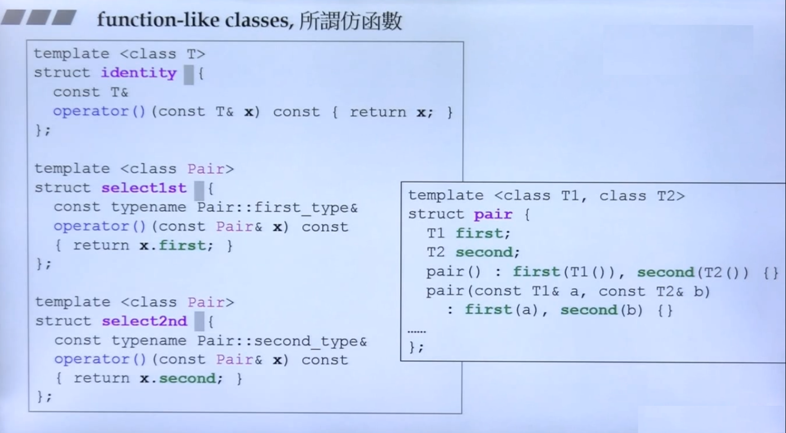
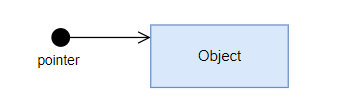

<!--
 * @Author: JohnJeep
 * @Date: 2020-05-27 10:12:26
 * @LastEditTime: 2021-11-18 18:05:33
 * @LastEditors: DESKTOP-0S33AUT
 * @Description: C++基础学习笔记
--> 

<!-- TOC -->

- [1. concept(概念)](#1-concept概念)
- [2. c++ basics(C++еџєзЎЂ)](#2-c-basicscеџєз)
- [3. namespace(е‘ЅеђЌз©єй—ґ)](#3-namespaceе‘ЅеђЌз©єй—ґ)
- [4. header file(头文д»?)](#4-header-file头文д»)
- [5. reference(еј•з”Ё)](#5-referenceеј•з”Ё)
  - [5.1. ordinary reference(ж™®йЂљеј•з”?)](#51-ordinary-referenceж™љеј•з”)
  - [5.2. lvalue reference(е·¦еЂјеј•з”?)](#52-lvalue-referenceе·јеј•з”)
  - [5.3. rvalue reference(еЏіеЂјеј•з”?)](#53-rvalue-referenceеЏіејеј•з”)
  - [5.4. const reference(еёёй‡Џеј•з”Ё)](#54-const-referenceеёёй‡Џеј•з”Ё)
- [6. function(函数)](#6-function函数)
  - [6.1. inline(内联函数)](#61-inline内联函数)
  - [6.2. function parameter(函数参数)](#62-function-parameter函数参数)
  - [6.3. template function(жЁЎжќїе‡Ѕж•°)](#63-template-functionжЁќїе‡Ѕж•°)
  - [6.4. conversion function(иЅ¬жЌўе‡Ѕж•°)](#64-conversion-functionиЅЌўе‡Ѕж•°)
  - [6.5. functor(д»їе‡Ѕж•?)](#65-functorд»їе‡Ѕж•)
- [7. constructor(жћ„йЂ е‡Ѕж•?)](#7-constructorжћ„й е‡Ѕж•)
  - [7.1. copy constructor(ж‹·иґќжћ„йЂ?)](#71-copy-constructorж‹·иґќжћ„й)
  - [7.2. copy assignment operator(拷贝赋еЂ?)](#72-copy-assignment-operator拷贝赋е)
- [8. destructor(жћђжћ„е‡Ѕж•°)](#8-destructorжћђжћ„е‡Ѕж•°)
- [9. empty class](#9-empty-class)
- [10. class object && class pointer(类对象与类指针的区别)](#10-class-object--class-pointerз±»еи±ёЋз±»жЊ‡й’€зљ„区别)
- [11. new && delete](#11-new--delete)
- [12. overload(重载)](#12-overload重载)
- [13. override(重写)](#13-override重写)
- [14. const](#14-const)
- [15. static](#15-static)
- [16. this](#16-this)
- [17. mutable](#17-mutable)
  - [17.1. mutableжЇд»Ђд№€пјџ](#171-mutableж»Ђд№€пјџ)
  - [17.2. дёєд»Ђд№€и¦Ѓз”Ёmutableпј?](#172-дёєд»Ђд№€из”utableпј)
  - [17.3. дЅїз”Ёmutableзљ„жіЁж„Џдє‹йЎ?](#173-дЅїз”Ёmutableзљ„жіЁж„Џдє‹йЎ)
  - [17.4. еёёе‡Ѕж•?](#174-еёёе‡Ѕж•)
- [18. pass by value && pass by reference(еЏ‚ж•°дј йЂ’дёЋиї”е›ћеЂјдј йЂ?)](#18-pass-by-value--pass-by-referenceеЏ‚ж•°дј й’дёЋиї”е›ћеЂјдј йЂ)
- [19. friend(еЏ‹е…ѓ)](#19-friendеЏ‹е…ѓ)
- [20. operator overloading(操作运算符重иЅ?)](#20-operator-overloading操作运算笇ЌиЅ)
- [21. C++е…ёећ‹й—®йў](#21-cе…ёећ‹й—)
  - [21.1. `.h`дё? `.hpp` 文件区别](#211-hдё-hpp-文件区别)
  - [21.2. ++iдёЋi++ж•€зЋ‡й—®йў](#212-iдёЋiж•€зЋ‡й—)
  - [21.3. 传值、传引用、传指针三者的区别](#213-дј ејгЃдј еј•з”ЁгЂЃдј жЊ‡й’€дё‰и…的区别)
- [22. smart pointer(ж™єиѓЅжЊ‡й’€)](#22-smart-pointerж™єиѓЅжЊ‡й’€)
  - [22.1. дёєд»Ђд№€и¦ЃдЅїз”Ёж™єиѓЅжЊ‡й’€пј?](#221-дёєд»Ђд№€идЅїз”Ёж™єиѓЅжЊ‡й’€пј)
  - [22.2. ж™єиѓЅжЊ‡й’€еЋџзђ†](#222-ж™єиѓЅжЊ‡й’€еЋџзђ†)
  - [22.3. дЅїз”Ёж™єиѓЅжЊ‡й’€зљ„дјз‚?](#223-дЅїз”Ёж™єиѓЅжЊ‡й’€зљ„дјз‚)
  - [22.4. auto_ptr](#224-auto_ptr)
  - [22.5. unique_ptr](#225-unique_ptr)
    - [22.5.1. 概述](#2251-概述)
    - [22.5.2. дёєд»Ђд№€и¦Ѓз”? unique_ptr](#2252-дёєд»Ђд№€из”-unique_ptr)
    - [22.5.3. 初始еЊ?](#2253-е€ќееЊ)
    - [22.5.4. ж€ђе‘е‡Ѕж•°](#2254-ж€ђе‘е‡Ѕж•°)
    - [22.5.5. unique_ptr 删除е™?](#2255-unique_ptr-删除е™)
  - [22.6. shared_ptr](#226-shared_ptr)
    - [22.6.1. 概述](#2261-概述)
    - [22.6.2. дёєд»Ђд№€и¦ЃдЅїз”Ё shared_ptr](#2262-дёєд»Ђд№€идЅїз”Ё-shared_ptr)
    - [22.6.3. ж€ђе‘е‡Ѕж•°](#2263-ж€ђе‘е‡Ѕж•°)
    - [22.6.4. 底层原理](#2264-底层原理)
    - [22.6.5. 初始еЊ?](#2265-е€ќееЊ)
    - [22.6.6. з”Ёжі•](#2266-з”Ёжі•)
    - [22.6.7. shared_ptr 删除е™?](#2267-shared_ptr-删除е™)
    - [22.6.8. жіЁж„Џз‚?](#2268-жіЁж„Џз‚)
  - [22.7. weak_ptr](#227-weak_ptr)
    - [22.7.1. 概述](#2271-概述)
    - [22.7.2. дёєд»Ђд№€и¦ЃдЅїз”Ё weak_ptr](#2272-дёєд»Ђд№€идЅїз”Ё-weak_ptr)
    - [22.7.3. 初始еЊ?](#2273-е€ќееЊ)
    - [22.7.4. 底层原理](#2274-底层原理)
    - [22.7.5. ж€ђе‘е‡Ѕж•°](#2275-ж€ђе‘е‡Ѕж•°)
    - [22.7.6. жіЁж„Џз‚?](#2276-жіЁж„Џз‚)
  - [22.8. еЏ‚иЂ?](#228-еЏ‚и)
- [23. typename](#23-typename)
  - [23.1. 概念](#231-概念)
  - [23.2. дёєд»Ђд№€и¦Ѓз”? typename ?](#232-дёєд»Ђд№€из”-typename-)
  - [23.3. жіЁж„Џз‚?](#233-жіЁж„Џз‚)
- [24. explicit conversions(жѕз¤єз±»ећ‹иЅ¬жЌў)](#24-explicit-conversionsжѕз¤єз±»ећ‹иЅЌў)
  - [24.1. static_cast<>()](#241-static_cast)
  - [24.2. reinterpret_cast<>()](#242-reinterpret_cast)
  - [24.3. dynamic_cast<>()](#243-dynamic_cast)
  - [24.4. const_cast<>()](#244-const_cast)
- [25. exception(异常处理)](#25-exception异常处理)
  - [25.1. еј‚еёёеЏй‡Џзљ„з”џе‘Ѕе‘Ёжњ?](#251-еј‚еёёеЏй‡Џзљ„з”џе‘Ѕе‘Ёжњ)
  - [25.2. 异常的层次结жћ?](#252-异常的层欻“жћ)
  - [25.3. еј‚еёёзљ„дјзјєз‚№](#253-еј‚еёёзљ„дјзјєз‚№)
  - [25.4. жћ„йЂ е‡Ѕж•°дё­зљ„еј‚её?](#254-жћ„й е‡Ѕж•°дё­зљ„еј‚её)
- [26. meaningful aphorisms (йљЅж°ёи­¦еЏҐ)](#26-meaningful-aphorisms-йљЅж°ёи­ЏҐ)
- [27. Reference by website(е­¦д№ еЏ‚иЂ?)](#27-reference-by-websiteе­№ еЏ‚и)

<!-- /TOC -->

# 1. concept(概念)

# 2. c++ basics(C++еџєзЎЂ)
- CиЇ­иЁЂдё­пјЊиЎЁиѕѕејЏзљ„иї”е›ћеЂјжЇдёЂдёЄж•°еЂјгЂ‚C++дё­пјЊиЎЁиѕѕејЏзљ„иї”е›ћеЂјжЇеЏй‡Џзљ„本身，可以作为左值，作为左值需要开辟一个内е­з©єй—ґгЂ?
- `endl` � `\n` 区别�
  - endl：换行和清除缓冲区到输出屏幕�
  - \nпјљд»…д»…еЏЄжЇжЌўиЎ?
- floatпјљжњ‰ж•€ж•°е­—жЇ6~7дЅ?
- doubleпјљжњ‰ж•€ж•°е­—жЇ15дЅ?
- charпј?8дёЄbitпјЊеЌ дёЂдёЄе­—иЉ‚з©єй—?
- еЏ–жЁЎењєж™Їпј?
  - еЏ–дёЂдёЄж•°зљ„дёЄдЅЌж•°
  - 多少天жЇдёЂдёЄжњ€зљ„第几天 
- `<<`左移运算符：右侧空位� 0
- `>>` 右移运算符：左侧空位补符号位，符号位正数�0，符号位为负数补1
- switch语句后的表达式只能为整型或字符类�
- break语句：执行循环体后，调出循环。可用于switch结构或者循环结�
- continueпјљеЏЄиѓЅз”ЁдєЋеѕЄзЋЇз»“жћ„пјЊи°ѓе‡єеѕЄзЋЇ
- 计算数组大小：对基本类型（不包括String类型）：`sizeof(array_var) / sizeof(array_type)`
  
  >   sizeof(nums) / sizeof(int) 
- жЊ‡й’€пј?
  - 所有的指针都要初始�
  - `int *ptr`  ж•ґећ‹жЊ‡й’€пјЊз»“жћњжЇдёЂдёЄеЂ?
  - `int *ptr  int*`пјљжЊ‡еђ‘ж•ґећ‹зљ„жЊ‡й’€пјЊз»“жћњжЇдёЂдёЄењ°еќЂ
  - `void* ` жЊ‡й’€е­ж”ѕзљ„жЇдёЂдёЄе†…е­ењ°еќЂпјЊењ°еќЂзљ„е†…е®№жЇд»Ђд№€з±»ећ‹дёЌиѓЅзЎ®е®? 


# 3. namespace(е‘ЅеђЌз©єй—ґ)
- Cдё­зљ„е‘ЅеђЌз©єй—ґ
  - 只有一个全局的作用域，所有的全局标识符共用一个作用域。同名的标识符之间会发生冲突�

- C++зљ„е‘ЅеђЌз©єй—?
  - 将全局的作用域分成不同的部分，不同命名空间的标识符可以同名而不会发生冲突�
  - е…Ёе±ЂдЅњз”Ёеџџд№џеЏ«й»и®¤е‘ЅеђЌз©єй—?
  - 命名空间之间可以相互嵌套

- иЇ­жі•
  ```cpp
  // 使用标准库中封装的内容。标准库中定义的所有名字都在命名空� std �
  using namespace std
  {
    .....
  }
  ```

- `::` 作用域运算符
  
  > `std::out` 从标准库中输出读取的内容，即编译器从操作符左侧名字的作用域中去寻找右侧的名字�
  
- 一般有三种方式去实现命名空�
  - 全部打开标准库中的内容。`using namespace std;`
  - 只打开标准库的部分内容�
    ```cpp
    using std::cout;
    
    int main()
    {
      cout << ...;
      std::cin >> ...;
      
      return 0;
    }
    ```

  - 在使用的时候根据需要打开
    ```cpp
    int main()
    {
      std::cout << ...;
      std::cin  >> ...;
     
      return 0;
    }


- 使用using定义别名与typedef的用法一样。`using uint64 = unsigned long long;`
  
  > C++зј–иЇ‘е™ЁдёЌж”ЇжЊЃдЅїз”Ё `typedef` е…ій”®иЇЌдёє жЁЎжќїз±? 设置别名，但жЇдЅїз”? `using` зљ„ж–№ејЏеЈ°жЋдёЂдёЄе…ій”®иЇЌеЌґжЇе…Ѓи®ёзљ„пјЊеЏЄжЇиї™дёЄж? C++11 标准才有的，如果在编译时不加дё? `--std=c++11` 使用新的标准的话，编译器一样会报错гЂ?


# 4. header file(头文�)
- 头文件采用йІеѕЎејЏеЈ°жЋ 
  ```cpp
  #ifndef __TEST_H
  #define __TEST_H
    ...
    
  #endif
  ```

- 头文件名包含在尖括号 `<>` дё­пјЊе€™C++зј–иЇ‘е™Ёе°†ењЁе­е‚Ёж ‡е‡†е¤ґж–‡д»¶зљ„主机系统的文件系统中查找；但如果文件名包含在双引号 `""` 中，则编译器将首先查找当前的工作目录或源代码目录（或其他目录，这取决于编译器пј?

- з±»зљ„еЈ°жЋе’Ње®ћзЋ°ж—¶е€†ејЂзљ„гЂ?
  - `.h` 文件只作类的声жЋ
  - `.cpp` 文件进行类的实现 


# 5. reference(еј•з”Ё)

## 5.1. ordinary reference(ж™®йЂљеј•з”?)
ењ? C++ 中采з”? `&` 符号表示引用，只жЇз»™еЇ№и±Ўиµ·дє†дёЂдёЄе€«еђЌгЂ‚еј•з”Ёзљ„еЉџиѓЅдё»и¦ЃжЇдј йЂ’е‡Ѕж•°зљ„еЏ‚ж•°е’Њиї”е›ћеЂјгЂ‚д»ЋдЅїз”ЁиЂ…зљ„и§’еє¦пјЊеј•з”Ёз±»дјјжЇдёЂдёЄе€«еђЌпјЊжІЎжњ‰и‡Єе·±зљ„е†…е­з©єй—ґпјЊиї™жЇе› дёєC++为了实用性，隐藏了相关细节。实质上引用有自己的内е­з©єй—ґгЂ?

引用初始�
- 引用被创建的同时必须被初始化，而指针则可以在任何时候被初始化гЂ? 一旦引用被初始化，就不能改еЏеј•з”Ёзљ„关系，而指针则可以随时改еЏж‰ЂжЊ‡зљ„еЇ№и±ЎгЂ?
- 单独定义引用时，必须� `初始化`�
- еј•з”ЁдЅњдёєе‡Ѕж•°зљ„еЏ‚ж•°еЈ°жЋж—¶пјЊ`дёЌ` 需要进行初始化гЂ?
- дёЌиѓЅжњ? NULL еј•з”ЁпјЊеј•з”Ёеї…йЎ»дёЋеђ€жі•зљ„е­е‚ЁеЌ•е…ѓе…іиЃ”，而指针则可以жЇNULLгЂ?


еј•з”ЁдЅїз”Ёж—¶жіЁж„Џз‚№
- дј еј•з”Ёзљ„ж•€зЋ‡жЇ”жЊ‡й’€й«пјЊдј йЂ’的直接жЇеЇ№и±ЎпјЊиЂЊдёЌжЇжЉЉеЇ№и±Ўе¤Ќе€¶гЂ?
- е‡Ѕж•°е†…йѓЁзљ„еј•з”ЁеЏ‚ж•°еЂјеЏЇиѓЅдјљж”№еЏпјЊдёЂи€¬йњЂи¦ЃеЉ  `const` и§Је†ігЂ?
- дёЌи¦Ѓиї”е›ће±ЂйѓЁеЏй‡Џзљ„еј•з”ЁпјЊе…Ёе±ЂеЏй‡Џе’Њйќ™жЂЃеЏй‡ЏеЏЇд»ҐдЅњдёєиї”е›ћеЂјзљ„еј•з”ЁгЂ? 
- C++зј–иЇ‘е™ЁењЁзј–иЇ‘ж—¶дЅїз”ЁдёЂдёЄеёёй‡ЏжЊ‡й’€дЅњдёєеј•з”Ёзљ„е†…йѓЁе®ћзЋ°гЂ‚е› ж­¤пјЊеј•з”ЁеЌ з”Ёзљ„е†…е­з©єй—ґе¤§е°ЏдёЋжЊ‡й’€еЌ з”Ёз©єй—ґе¤§е°Џз›ёеђЊгЂ‚`type& name <==> type* const name`


жЊ‡й’€зљ„еј•з”? 
- ж јејЏ `const int* &a`
- жЊ‡й’€зљ„еј•з”ЁеЃље‡Ѕж•°еЏ‚ж•°
- е‡Ѕж•°дєЊзє§жЊ‡й’€дЅњдёєиѕ“е‡єеЏй‡Џ


## 5.2. lvalue reference(е·¦еЂјеј•з”?)

е·¦еЂје°±жЇдёЂдёЄиѓЅе¤џиў«дї®ж”№зљ„еЏй‡ЏгЂ?

- `еј•з”Ё` дЅњдёє `е·¦еЂј`ж—¶пјЊиї”е›ћзљ„жЇеЏй‡Џзљ„жњ¬иє«пјЊжЇеЏй‡ЏиЂЊдёЌжЇеЂјпј€valueпј‰гЂ‚еЏй‡ЏеЏЄиѓЅжЇе…Ёе±ЂеЏй‡Џж€–йќ™жЂЃеЏй‡ЏпјЊдёЌиѓЅжЇе±ЂйѓЁеЏй‡ЏпјЊеђ¦е€™дјље‡єзЋ? `Segmentation fault`гЂ?
- е‡Ѕж•°зљ„иї”е›ћеЂјдЅњдёєдёЂдё? `е·¦еЂј`ж—¶пјЊеє”иЇҐиї”е›ћзљ„жЇдёЂдёЄеј•з”Ё`(reference)`гЂ?
- е·¦еЂјиЎЁиѕѕејЏиЎЁз¤єзљ„жЇдёЂдёЄеЇ№и±Ўзљ„иє«д»ЅгЂ?
- еЏй‡ЏиЎЁиѕѕејЏжЇдёЂдёЄе·¦еЂјпјЊдЅњз”Ёзљ„ж—¶й—ґжЇ”иѕѓй•їпјЊеЏіеЂјзљ„дЅњз”Ёж—¶й—ґжЇ”иѕѓзџ­жљ‚гЂ? 


## 5.3. rvalue reference(еЏіеЂјеј•з”?) 
дЅ•дёєеЏіеЂјеј•з”Ёпјџ
- 必须绑定到右值的引用，采з”? `&&` 来获得右值引用，而不ж? `&` 
- еЏіеЂјиЎЁиѕѕејЏиЎЁз¤єзљ„жЇеЇ№и±Ўзљ„еЂјгЂ?
- еЏіеЂјеј•з”ЁеЏЄиѓЅз»‘е®ље€°дёЂдёЄе°†и¦Ѓиў«й”ЂжЇЃзљ„еЇ№и±ЎпјЊиЇҐеЇ№и±ЎжІЎжњ‰е…¶е®ѓзљ„з”Ёж€·гЂ?

`std::move()`
- жѕејЏзљ„е°†е·¦еЂјиЅ¬еЊ–дёєеЇ№еє”зљ„еЏіеЂјеј•з”Ёз±»ећ‹гЂ?
- 使用 `move()` 函数时告诉编译器，处理左值时像右值一样去处理它；对左值进行赋值或销毁外，不再使用它�


## 5.4. const reference(еёёй‡Џеј•з”Ё)
и®©еЏй‡Џзљ„еј•з”Ёж‹Ґжњ‰еЏЄиЇ» (read-only) зљ„е±ћжЂ§гЂ?
```cpp
int x = 10;
const int &y = x;   // дёЌиѓЅйЂљиї‡yеЋ»дї®ж”№xзљ„еЂ? 
```

初始�
- з”ЁеЏй‡Џе€ќе§‹еЊ–еёёеј•з”ЁгЂ‚`int x = 10; const int &y = x;`
- з”Ёи‡ЄеЏй‡Џе€ќе§‹еЊ–еёёеј•з”ЁгЂ‚`const int &a = 100;` 
- 使用常量引用进行初始化时，C++编译器会为常量值分配空间，并将引用名作为当前分配空间的别名�


# 6. function(е‡Ѕж•°)
C++对函数的检查更严格。C++ж”ЇжЊЃboolз±»ећ‹пјљC++дё­зљ„ `bool`пјЊеЏЄеЌ? 1 дёЄе­—иЉ‚пј›javaдё­дЅїз”? `boolean`；采з”? `boolalpha`жѕз¤єTrueж€–Falseпј?


## 6.1. inline(е†…иЃ”е‡Ѕж•°)
函数定义时，еЉ? `inline` 关键字，例如 `inline void func(){}`гЂ‚е†…иЃ”е‡Ѕж•°зљ„е…ій”®е­? `inline` дёЋе‡Ѕж•°дЅ“зљ„е®ћзЋ°ењЁдёЂиµ·пјЊдёЌйњЂйўќе¤–зљ„еЈ°жЋгЂ? 

实现机制
- C++编译器直接将函数体插入函数调用的地方�

什么时候可以用 `inline`�
- 函数体不能过大�
- е‡Ѕж•°еЈ°жЋеї…须在调用之前声жЋгЂ?
- дёЌиѓЅеЇ№е‡Ѕж•°иї›иЎЊеЏ–еЂјењ°еќЂж“ЌдЅњгЂ? 
- дёЌиѓЅе­ењЁд»»дЅ•еЅўејЏзљ„еѕЄзЋЇиЇ­еЏҐпј€forгЂЃwhileпј‰гЂ?
- е†…иЃ”е‡Ѕж•°зњЃеЋ»дє†ж™®йЂље‡Ѕж•°и°ѓз”Ёж—¶зљ„еЋ‹ж €гЂЃи·іиЅ¬гЂЃиї”е›ћж“ЌдЅњгЂ?


## 6.2. function parameter(е‡Ѕж•°еЏ‚ж•°)
й»и®¤еЏ‚ж•°
- е‡Ѕж•°зљ„еЏ‚ж•°жњ‰дёЂдёЄй»и®¤зљ„еЂјгЂ?
- е‡Ѕж•°её¦жњ‰еЏ‚ж•°е€—иЎЁпјЊеЏ‚ж•°е€—иЎЁзљ„еЏіиѕ№еї…йЎ»жњ‰й»и®¤зљ„值，左边可以不给й»и®¤еЏ‚数赋值гЂ?


еЌ дЅЌеЏ‚ж•°
- еЏЄжњ‰е‡Ѕж•°з±»ећ‹еЈ°жЋпјЊжІЎжњ‰е‡Ѕж•°еЏй‡ЏеЈ°жЋгЂ‚`int func(int a, int b, int)`


## 6.3. template function(жЁЎжќїе‡Ѕж•°)
д»Ђд№€жЇжЁЎжќїе‡Ѕж•°пј?
 - 函数定义时不指定具体的数据类型，建立一个通用函数。函数调用时，根据实际的参数反推数据类型，即类型的参数化�


## 6.4. conversion function(иЅ¬жЌўе‡Ѕж•°)
е‡Ѕж•°жІЎжњ‰иї”е›ћеЂјпјЊжІЎжњ‰еЏ‚ж•°пјЊе‡Ѕж•°зљ„з±»ећ‹дёєйњЂи¦ЃиЅ¬жЌўзљ„з±»ећ‹гЂ‚йЂљеёёиЅ¬жЌўе‡Ѕж•°дё­зљ„е†…е®№йѓЅжЇдёЌеє”иЇҐж”№еЏзљ„，可以设置为 `const`гЂ?


## 6.5. functor(д»їе‡Ѕж•?)
д»Ђд№€жЇд»їе‡Ѕж•°пјџ
- 一� class 类中重载了函数调用操作运算符 `()`，任何一个东西能接受 `()` 操作运算符，这个东西就叫 `像函数` 或者叫 `仿函数`�
  




<font color=red>жЂќиЂѓпјљ</font>дёєд»Ђд№€C++дё­и¦ЃжЉ? class и®ѕи®Ўж€? pointer(ж™єиѓЅжЊ‡й’€)е’? function(д»їе‡Ѕж•?)пј?


# 7. constructor(жћ„йЂ е‡Ѕж•?)

- дёєд»Ђд№€и¦Ѓз”Ёжћ„йЂ е‡Ѕж•°пјџ
  - 被用来初始化类的对象�  
  - з±»еЇ№и±Ўиў«е€›е»єж—¶пјЊзј–иЇ‘е™ЁдёєеЇ№и±Ў(object)分配内е­з©єй—ґпјЊе№¶и‡ЄеЉЁи°ѓз”Ёжћ„йЂ е‡Ѕж•°пјЊе®Њж€ђж€ђе‘的初始化 

- 构造函数特� 
  - жћ„йЂ е‡Ѕж•°зљ„ `е‡Ѕж•°еђЌз§°` дё? `з±»зљ„еђЌз§°` дёЂж ·гЂ?
  - **е‡Ѕж•°жІЎжњ‰иї”е›ћеЂ?**
  - е‡Ѕж•°еЏ‚ж•°еЂ?
    - е€›е»єзљ„еЇ№и±Ўжњ‰й»и®¤еЂјж—¶пјЊеє”дј е…Ґе€›е»єеЇ№и±Ўзљ„й»и®¤еЂјгЂ?
    - е€›е»єзљ„еЇ№и±ЎжІЎжњ‰й»и®¤еЂјж—¶пјЊзј–иЇ‘е™Ёдј е…Ґзљ„й»и®¤еЂјдёє `0`

- жћ„йЂ е‡Ѕж•°жіЁж„Џз‚№
  - жћ„йЂ е‡Ѕж•°жЇдёЂдё? `ж€ђе‘е‡Ѕж•°`пјЊе‡Ѕж•°е†…жњ‰дёЂдё? `this` жЊ‡й’€
  - 构造函数的访问属性可以放� `private` 中。在单例模式（singleton）中就采用这种用法�
  - `жћ„йЂ е‡Ѕж•°` дё? `жћђжћ„е‡Ѕж•°` ењЁз±»дё­еЈ°жЋдє† пјЊеї…йЎ»и¦ЃйЂљиї‡з±»зљ„ж–№жі•еЋ»е®ћзЋ°пјЊеЌіеЈ°жЋдє†еї…йЎ»и¦Ѓз”ЁпјЊеђ¦е€™зј–иЇ‘ж—¶дјљжЉҐй”™гЂ?
  - 多线程编程中，构造函数不能保证线程的安全�

- з±»дё­й»и®¤зљ„жћ„йЂ е‡Ѕж•?
  - й»и®¤ж— еЏ‚数构造：当类中没有定义构造函数时，C++зј–иЇ‘е™Ёдјљй»и®¤жЏђдѕ›дёЂдёЄж— еЏ‚ж•°жћ„йЂ е‡Ѕж•°пјЊжћ„йЂ е‡Ѕж•°зљ„е‡Ѕж•°дЅ“дёєз©єгЂ?
  - й»и®¤ж‹·иґќжћ„造：当类中没有定义拷贝构造函数时，C++зј–иЇ‘е™Ёдјљй»и®¤жЏђдѕ›дёЂдёЄж‹·иґќжћ„йЂ е‡Ѕж•°пј€жµ…ж‹·иґќпј‰пјЊз®ЂеЌ•зљ„иї›иЎЊж€ђе‘еЏй‡Џзљ„еЂјж‹·иґќж“ЌдЅњгЂ?

- 构造函数分�
  - 无参构造：一般为栈内е­з©єй—ґпјЊи‡ЄеЉЁй‡Љж”ѕе†…е­з©єй—ґгЂ‚и°ѓз”Ёж—¶дёЌз”Ё `加括号`гЂ?
  - её¦еЏ‚ж•°жћ„йЂ?(й‡ЌиЅЅдє†жћ„йЂ е‡Ѕж•?)
    - 一般为堆内е­з©єй—ґпјЊйњЂи¦ЃдЅїз”Ёdeleteй‡Љж”ѕе†…е­з©єй—ґпј›дЅїз”? `new` е…ій”®е­—е€›е»єз©єй—?
    - 一般需要初始化构造的参数
    - жњ‰й»и®¤еЂјеЏ‚ж•°зљ„жћ„йЂ е‡Ѕж•°пјЊйњЂи¦ЃењЁз±»зљ„еЈ°жЋдё­жЊ‡е®љй»и®¤еЏ‚数值，一般只能指定一次，在构造函数实现时不需要再给出й»и®¤еЂјпјЊеђ¦е€™дјљжЉҐй”™гЂ?
    ```cpp
    // жњ‰еЏ‚жћ„йЂ е‡Ѕж•°дё‰з§Ќи°ѓз”Ёж–№жі?
    Test t1(10);         // 括号�
    Test t2 = t1;         // з­‰еЏ·жі?
    Test t3 = Test(30);  // 直接调用构造函�
    ```

  - ж‹·иґќжћ„йЂ?
    ```cpp
    // еЈ°жЋдёЂдёЄз±»
    class String()
    {
      private:
        ...
      public:
        ...
    }
    // е®ћдѕ‹еЊ–дёЂдёЄеЇ№и±?
    String st_one;
    
    // ж‹·иґќжћ„йЂ?
    String st_two = st_one;   // ж–№жі•дёЂпјљз­‰еЏ?(=)жЇж‹·иґќдёЂдёЄеЇ№и±ЎдёЌжЇиµ‹еЂјиїђз®?
    String st_three(st_one)   // 方法二：初始化拷贝构�
    ```

- 构造函数在继承中的用法
  > 构造函数与父类的其它成е‘?(ж€ђе‘еЏй‡Џе’Њж€ђе‘ж–№жі?)不同，它不能被子类继承。因此，在创建子类对象时，为了初始化从父类中继承来的成е‘еЏй‡ЏпјЊзј–译器需要调用其父类的构造函数。如果子类的构造函数没有жѕз¤єењ°и°ѓз”Ёз€¶з±»зљ„жћ„йЂ е‡Ѕж•°пјЊе€™й»и®¤и°ѓз”Ёз€¶з±»зљ„ж— еЏ‚жћ„йЂ е‡Ѕж•°гЂ? 
  - 子类与父类均没有声жЋжћ„йЂ е‡Ѕж•°ж—¶пјЊC++зј–иЇ‘е™Ёдјљй»и®¤з”џж€ђжћ„йЂ е‡Ѕж•°еЋ»и°ѓз”ЁгЂ? 
  - 子类继承父类的方法，й»и®¤дјљи°ѓз”Ёз€¶з±»зљ„ж— еЏ‚ж•°жћ„йЂ е‡Ѕж•°пјЊе†Ќи°ѓз”Ёе­ђз±»зљ„ж— еЏ‚ж€–жњ‰еЏ‚жћ„йЂ е‡Ѕж•°гЂ?
  - 当父类为有参构造函数时
    - 父类的有参构造函数有й»и®¤зљ„еЂјж—¶пјЊе­ђз±»дё­дёЌйњЂи¦ЃжѕејЏењ°и°ѓз”Ёз€¶з±»зљ„жћ„йЂ пјЊC++зј–иЇ‘е™Ёдјљй»и®¤зљ„调用父类的有参构造函数гЂ?
    - 父类的有参构造函数没有й»и®¤зљ„еЂјж—¶пјЊе­ђз±»дё­йњЂи¦ЃжѕејЏењ°и°ѓз”Ёз€¶з±»зљ„жћ„йЂ?
      ```cpp
      class Parent
      {
       private:
       public:
         Parent(int a, int b){};
      }
       
      class Child:public Parent
      {
      private:
      public:
        Child(int m, int n):Parent(a, b)     // жѕз¤єзљ„调用父类的构造函ж•?
      }
      ```
    - 父类中既有无参й»и®¤жћ„йЂ еЏ€жњ‰её¦еЏ‚й»и®¤жћ„造函数时，子类继承父类时，需要子类жѕз¤єзљ„жЊ‡е®ље€°еє•иЇҐи°ѓз”Ёе“ЄдёЂдёЄжћ„йЂ е‡Ѕж•°гЂ?


## 7.1. copy constructor(ж‹·иґќжћ„йЂ?)

- ж‹·иґќжћ„йЂ е‡Ѕж•°жЇз”±ж™®йЂљжћ„造函数和赋值操作符共同实现的гЂ?
- 拷贝构造函数必须以 `引用(reference)`的形式传�(参数为引用�)�
- 拷贝构造函数使程序更有效率，因为它不用再构造一个对象的时候改еЏжћ„йЂ е‡Ѕж•°зљ„еЏ‚ж•°е€—иЎЁ
- еЅ“жџђеЇ№и±ЎжЇжЊ‰еЂјдј йЂ’ж—¶пј€ж— и®єжЇз±»зљ„еЇ№и±ЎдЅњдёєе‡Ѕж•°еЏ‚ж•°пјЊиїжЇдЅњдёєе‡Ѕж•°иї”е›ћеЂјпј‰пјЊзј–иЇ‘е™ЁйѓЅдјље…€е»єз«‹дёЂдёЄж­¤еЇ№и±Ўзљ„дёґж—¶ж‹·иґќпјЊиЂЊењЁе»єз«‹иЇҐдёґж—¶ж‹·иґќж—¶е°±дјљи°ѓз”Ёз±»зљ„ж‹·иґќжћ„йЂ е‡Ѕж•°гЂ?

-------------------------

- жµ…ж‹·иґ?
  - 当类的对象发生复制过程的时候，类的对象自己有资源（堆，或者жЇе…¶е®ѓзі»з»џиµ„源），但复制过程中并未复制资源，只жЇж”№еЏдє†жЊ‡й’€зљ„жЊ‡еђ‘пјЊиї™з§Ќз§°дёєжµ…ж‹·иґќгЂ?
  - еЏЄжЇе°†з±»зљ„ж€ђе‘еЂјиї›иЎЊж‹·иґќпјЊз±»жЊ‡й’€жІЎжњ‰иї›иЎЊж‹·иґќпјЊдё¤дёЄжЊ‡й’€еђЊж—¶жЊ‡еђ‘дёЂеќ—е†…е­з©єй—ґгЂ?
    ```cpp
    // жІЎжњ‰еЃљд»»дЅ•зљ„иЇґжЋпјЊC++зј–иЇ‘й»и®¤дЅїз”Ёзљ„жЇжµ…ж‹·иґќгЂ?
    People obj_2 = obj_1;   е°†obj_1еЇ№и±Ўзљ„е†…е®№ж‹·иґќе€°obj_2еЇ№и±Ўдё­пјЊдёЌжЇж‹·иґќзљ„жЊ‡й’€гЂ?
    ```
  - 浅拷贝完成后，在释放资源的时候会产生资源归属不清的情况，导致一个指针指向已经被删除的内е­з©єй—ґпјЊдЅїзЁ‹еєЏиїђиЎЊе‡єй”™гЂ‚еЌій”ЂжЇЃеЇ№и±Ўж—¶пјЊдё¤дёЄеЇ№и±Ўзљ„жћђжћ„е‡Ѕж•°е°†еЇ№еђЊдёЂдёЄе†…е­з©єй—ґй‡Љж”ѕдё¤ж¬ЎгЂ?
  
- ж·±ж‹·иґ?
  - 当类的对象发生复制过程的时候，类的对象自己有资源（堆，或者жЇе…¶е®ѓзі»з»џиµ„源），但拷贝过程中复制了资源，这种将一个对象的资源完整的拷贝到另一个对象的过程，称为深拷贝гЂ?
  - дёЌд»…ж‹·иґќдє†з±»зљ? `ж€ђе‘еЏй‡ЏеЂј`пјЊиїж‹·иґќдє†з±»зљ„жЊ‡й’€пјЊдё¤дёЄжЊ‡й’€жЊ‡еђ‘дё¤еќ—дёЌеђЊзљ„е†…е­з©єй—ґгЂ?


- д»Ђд№€ж—¶еЂ™з”Ёж·±ж‹·иґќе’Њжµ…ж‹·иґќпјџ
  - 类中没有自定义拷贝构造函数时，编译器会й»и®¤и°ѓз”Ёжµ…ж‹·иґќпјЊе®Њж€ђж€ђе‘的复制гЂ?
  - еЅ“з±»зљ„ж€ђе‘дё­жІЎжњ‰жЊ‡й’€ж—¶пјЊжµ…ж‹·иґќжЇеЏЇиЎЊзљ„гЂ?
  - еЅ“з±»зљ„ж€ђе‘中有指针时，如果采用简单的浅拷贝，则两类中的两个指针将指向同一个地址，当对象快结束时，会调用两次析构函数，而导致指针悬挂现象，因此必须要用深拷贝гЂ?
  
- еЏ‚иЂ?
  - [c++ж‹·иґќжћ„йЂ е‡Ѕж•°иЇ¦и§Ј](https://www.cnblogs.com/alantu2018/p/8459250.html)


## 7.2. copy assignment operator(拷贝赋�) 

```cpp
// 将对象s1拷贝赋值给对象s2，内部处理过程分3步：

class MyString
{
private:
    char* m_data;
public:
    MyString(const char* cstr = 0) {}             // 带有初始值的构造函�
    MyString(const MyString& str) {}              // ж·±ж‹·иґќжћ„йЂ?
    MyString& operator=(const MyString& str);     // 操作符重载，拷贝赋�
    ~MyString() {}
    char* getStr() const {return m_data;}
};

MyString& MyString::operator=(const MyString& str) 
{
  if (this == &str)   // 进行自我赋值检�
  {
    return *this;
  }
  delete[] m_data;                           // 1гЂЃй‡Љж”ѕеЋџе…€ж•°жЌ®m_dataзљ„е†…е­з©єй—?
  m_data = new char[strlen(str.m_data) + 1]; // 2гЂЃй‡Ќж–°з»™m_data 分配内е­з©єй—ґ
  strcpy(m_data, str.m_data);                // 3、执行拷贝操�
  return *this;
}
// 在拷贝之前需要进行自我赋值检测。即自己把值赋给自己，保证在执行第二步操作时，指针有指向的位置�
// 若不进行自我检测步骤，先释放原先数据m_dataзљ„е†…е­з©єй—ґеђЋпјЊж­¤ж—¶жЊ‡й’€m_dataжІЎжњ‰дёЂдёЄзЎ®е®љзљ„жЊ‡еђ‘пј?
// 不能重新分配内е­з©єй—ґпјЊеЇји‡ґзЁ‹еєЏе‡єй”™гЂ?
```

# 8. destructor(жћђжћ„е‡Ѕж•°)

- 表示：在类名称之前加 `~`。例如：`string::~string()` 
- 作用：类的对象离开作用域后释放对象使用的资源，在类死亡之前的前一刻调用，用于清除类中的资源（比如：释放内е­пј‰гЂ?
- `дёЂдёЄз±»еЏЄиѓЅжњ‰дёЂдёЄжћђжћ„е‡Ѕж•°пјЊе¤љдёЄз±»жњ‰е¤љдёЄжћђжћ„е‡Ѕж•°`，如果没有жѕејЏзљ„定义，系统会自动生成一个й»и®¤зљ„жћђжћ„е‡Ѕж•°гЂ?
- жћђжћ„е‡Ѕж•°дёЌиѓЅ `й‡ЌиЅЅ`гЂ‚жЇЏжњ‰дёЂж¬Ўжћ„йЂ е‡Ѕж•°зљ„и°ѓз”Ёе°±дјљжњ‰дёЂж¬Ўжћђжћ„е‡Ѕж•°зљ„и°ѓз”ЁгЂ?
- 只有当一切的构造动作都完成时，析构函数才有可能会被调用。因为在构造函数中可能会抛出异常从而导致程序结束�

# 9. empty class
- C++дё­дёЂдё? class 中什么也没有写，жЇдёЂдёЄз©єзљ„з±» (empty class)пјЊеЅўе¦? `class Stu {};` иї™ж ·пјЊзЁ‹еєЏзј–иЇ‘ж—¶пјЊC++зј–иЇ‘е™Ёдјљз»™иї™дё? `empty class` жЏђдѕ›й»и®¤жћ„йЂ е‡Ѕж•? (constructor)гЂЃжћђжћ„е‡Ѕж•? (deconstructor)гЂЃж‹·иґќжћ„йЂ е‡Ѕж•? (copy constructor)、拷贝赋值函ж•? (copy assignment)，并且这些函数的й»и®¤е±ћжЂ§йѓЅж? `public` дё? `inline`гЂ?

- 注意：C++中一个空类的大小� `1byte` 
  
  > з©єз±»дё­жІЎжњ‰е‡Ѕж•°е’Њж•°жЌ®ж€ђе‘，但可以实例化类；一个类能被实例化，编译器就要给他分配空间，来指示类实例化的地址，通常编译器分配为 1 дёЄе­—иЉ‚пј€char类型），这样分配同时也保证了 з©єз±»еЌ з”Ёзљ„з©єй—ґжњЂе°ЏгЂ?


# 10. class object && class pointer(类对象与类指针的区别)
```cpp
class Stu
{
private:

public:
}
```

- з±»еЇ№и±?
  - ж јејЏпјљ`Stu s1;`
  - 定义之后就已经为 `s1` 这个对象在栈上分配了内е­

- з±»жЊ‡й’?
  - ж јејЏпјљ`Stu *s2 = new Stu;`
  - 定义 `*s2` 的时候没有分配内е­пјЊеЏЄжњ‰ж‰§иЎЊ `new` 后才会在堆上分配内е­пјЊжЇдёЄж°ёд№…зљ„еЏй‡ЏпјЊйњЂи¦Ѓз”Ё `delete` 关键字手动去释放它гЂ?


# 11. new && delete
- windows дё‹е†…е­жѕз¤єжЂ»жЇ `16` зљ„еЂЌж•°пјЊи‹ҐжћњдёЌж? 16 зљ„еЂЌж•°пјЊе€™еЎ«е……дёєжњЂйќ иї‘ 16 的倍数的大小гЂ? 
- `new` 动态分配内� 
  - 先分配memory，再调用构造函� 
  - new创建一维动态数�
    ```cpp
    // ж™®йЂљз±»ећ?
    根据哪种数据类型来分配内е­пјџж №жЌ®ж•°жЌ®з±»ећ‹жќҐзЎ®е®ље€†й…Ќе¤ље°‘е†…е­пјџж‰ѕе€°иї™ж ·зљ„е†…е­пјЊе№¶иї”е›ће…¶ењ°еќЂгЂ?
    ж јејЏпјљtypeName* pointer_name = new typeName 
    例如：int *p = new int;
    
    жЊ‡й’€ p жЊ‡еђ‘зљ„е†…е­жІЎжњ‰еђЌз§°пјЊй‚Јд№€и¦Ѓе¦‚何称呼它呢？我们说指й’? p жЊ‡еђ‘дёЂдёЄж•°жЌ®еЇ№и±ЎпјЊ 这里的“对象”不жЇвЂњйќўеђ‘对象编程”中的对象， иЂЊжЇдёЂз§ЌвЂњдёњиҐївЂќпјЊе®ѓжЊ‡зљ„жЇдёєж•°жЌ®йЎ№е€†й…Ќзљ„е†…е­еќ—гЂ? 
    数据对象：可以жЇе¤Ќжќ‚的结构类型，也可以жЇеџєжњ¬з±»ећ‹гЂ?
    
    // 一维数�
    typeName* pointer_name = new typeName[num_elements];
    例如：int *p = new int[10];
    注意：将数组的元素类型和元素数目告诉new即可� 必须在类型名后加上方括号� 其中包含元素数目。new运算符返回第一个元素的地址�
    
    ```
  - 创建二维数组
    ```cpp
    ж јејЏпјљtypeName (*ptr)[col_num] = new typeName[row_num][col_num];
    дѕ‹е­ђпјљint (*ptr)[2] = new int[4][2];
    ```
  - е€›е»єеЇ№и±Ў
    ```cpp
    class Airplane
    {
      ...
    }
    
    Airplane *ap = new Airplane;
    ```


- `delete` й‡Љж”ѕе†…е­пјЊдёЋnewй…ЌеЇ№дЅїз”Ё 
  - е…€и°ѓз”Ёжћђжћ„е‡Ѕж•°пјЊе†Ќй‡Љж”ѕmemory  
  - жіЁж„Џ
    - дёЌи¦ЃдЅїз”Ёdeleteй‡Љж”ѕеђЊдёЂдёЄе†…е­еќ—дё¤ж¬ЎгЂ?
    - дёЌжЇз”Ёnew分配的动态内е­з©єй—ґпјЊдёЌиѓЅз”Ёdeleteй‡Љж”ѕ
    - еЇ№з©єжЊ‡й’€дЅїз”ЁdeleteжЇе®‰е…Ёзљ„гЂ?


- жіЁж„Џпј?
  - 采用 `array new` зљ„ж–№ејЏе€›е»єдёЂеќ—е†…е­з©єй—ґпјЊе€™дёЂе®љи¦Ѓй‡‡з”Ё ` array delete` ж–№ејЏеЋ»й‡Љж”ѕе†…е­пјЊеђ¦е€™ењЁж¶‰еЏЉжЊ‡й’€зљ„时候可能会导致内е­жі„漏。泄漏的并不жЇж•ґдёЄе€†й…Ќзљ„е†…е­з©єй—ґпјЊиЂЊжЇе€†й…Ќзљ„空间中数组没有被释放的部分гЂ?
  - дёЌй…ЌеЇ№ењ°дЅїз”Ёnewе’ЊdeleteпјЊе°†еЏ‘з”џе†…е­жі„жјЏпј€memory leak），被分配的内е­е†Ќд№џж— жі•дЅїз”Ёдє†пјЊе¦‚жћње†…е­жі„漏严重，则程序将由于不断寻找更多内е­иЂЊз»€ж­ЂЂ?


--------------
- class member operator new()


- 标准库中使用 `placement arguments new` 的例�


# 12. overload(й‡ЌиЅЅ)

жЊ‡е‡Ѕж•°еђЌз›ёеђЊпјЊдЅ†жЇе®ѓзљ„参数表列个数或顺序，类型不同，不能靠返回类型来判断，函数的返回值不жЇе‡Ѕж•°й‡ЌиЅЅе€¤ж–­зљ„标准гЂ?

- 在同一个作用域中（C++中构造函数也可以重载）�
- е‡Ѕж•°еђЌе­—з›ёеђЊгЂ?
- еЏ‚ж•°дёЌеђЊгЂ?
- virtual е…ій”®е­—еЏЇжњ‰еЏЇж— гЂ?
- 返回值可以不同�

> 函数重载底层实现：编译器在编译时，根据函数的参数列表进行重命名�


- 子类无法重载父类的函数。如果子类与父类的函数名称相同，则发生函数名称覆盖，不会发生函数重载。若想在子类和父类中分别调用具有相同名称的函数，则需要使� `域分符号::`
- 当子类中没有与父类相同参数的函数，只有名称相同的函数时，而子类去调用父类中重载的函数，则 C++ 编译器会将子类中有相同函数名称的函数去覆盖掉父类中相同名称的函数，从而将当前子类调用父类的函数当做子类中一个新的重载函数，但жЇзј–译器发现子类中并没有该函数的重载，因此会报错гЂ?


# 13. override(重写)

重写（也称为覆盖 overrideпј‰жЇжЊ‡жґѕз”џз±»й‡Ќж–°е®љд№‰еџєз±»зљ„虚函数。必须发生在子类与父类之间，并且父类与子类的函数具有完全相同的原型。使з”? `virtual` е…ій”®е­—еЈ°жЋеђЋпјЊиѓЅе¤џдє§з”џе¤љжЂЃпјЊжІЎжњ‰дЅїз”Ё `virtual` 关键字，只能叫重定义，不叫虚函数重写гЂ?

- 不在同一个作用域，分别位于派生类与基类�
- е‡Ѕж•°еђЌе­—з›ёеђЊгЂ?
- еЏ‚ж•°з›ёеђЊгЂ?
- еџєз±»е‡Ѕж•°еї…йЎ»жњ? virtual е…ій”®е­—пјЊдёЌиѓЅжњ? staticгЂ?
- иї”е›ћеЂјз›ёеђЊпјЊеђ¦е€™дјљжЉҐй”™гЂ?
- й‡Ќе†™е‡Ѕж•°зљ„и®їй—®дї®йҐ°з¬¦еЏЇд»ҐдёЌеђЊгЂ‚и‹Ґеџєз±»дё­е‡Ѕж•°зљ„дї®йҐ°з¬¦жЇ private，派生类中重写的函数可以ж? publicпјЊprotectedгЂ?


<font color=red>
重载与重写的区别
- дЅњз”ЁеџџдёЌеђЊпјљй‡ЌиЅЅжЇењЁеђЊдёЂеЊєеџџпјЊе­ђз±»ж— жі•й‡ЌиЅЅз€¶з±»пјЊз€¶з±»еђЊеђЌе‡Ѕж•°зљ„将被覆盖，重写 жЇењЁз€¶з±»дёЋе­ђз±»д№‹й—ґгЂ?
- й‡ЌиЅЅжЇењЁ зј–иЇ‘жњџй—ґ 根据参数列表决定，重写жЇењ? иїђиЎЊжњџй—ґ 根据具体对象类型来决定调用的函数гЂ?
</font>


# 14. const
- CиЇ­иЁЂдё­пјЊ`const` жЇеЏЄиЇ»зљ„еЏй‡ЏпјЊжњ‰и‡Єе·±зљ„е­е‚Ёз©єй—ґгЂ?
- C++дё­пјЊ`const` 可能分配е­е‚Ёз©єй—ґпјЊд№џеЏЇиѓЅдёЌе€†й…Ќе­е‚Ёз©єй—ґгЂ?
  - еЅ? `const` дЅњдёєе…Ёе±ЂеЏй‡ЏпјЊе№¶ењЁе…¶е®ѓзљ„文件中到调用时，会分配е­е‚Ёз©єй—ґгЂ?
  - 采用 `&` 地址运算符去еЏ? `const` еЏй‡Џзљ„地址时，会分配е­е‚Ёз©єй—ґгЂ?
- еЉ? `const` еђЋпјЊдёЌдјљж”№еЏж•°жЌ®зљ„е†…е®№пјЊдёЌеЉ `const`пјЊе€™дјљж”№еЏж•°жЌ®зљ„内容，一般数据的内容定义ењ? `private`дё­гЂ?

- const ж”ѕењЁе‡Ѕж•°еЈ°жЋе‰ЌиЎЁжЋе‡Ѕж•°зљ„ `иї”е›ћеЂјжЇ const з±»ећ‹`пјЊдёЌиѓЅдї®ж”№гЂ?
  ```cpp
  const int add(int x, int y)
  {
    return x+y;
  }
  ```

- 定义constж€ђе‘е‡Ѕж•°ж—¶пјЊжЉЉconst关键字放在函数的参数表和函数体之间作用：表用该函数的数据成е‘дёЌиѓЅиў«ж”№еЏпјЊ`const` дї®йҐ°зљ„жЇ `this` жЊ‡й’€жЊ‡еђ‘зљ„е†…е­з©єй—ґгЂ‚如果在编写 const ж€ђе‘е‡Ѕж•°ж—¶пјЊдёЌж…Ћдї®ж”№дє†ж•°жЌ®ж€ђе‘пјЊж€–иЂ…и°ѓз”Ёдє†е…¶е®ѓйќћconst ж€ђе‘е‡Ѕж•°пјЊзј–иЇ‘е™Ёе€™е°†жЉҐй”™гЂ?
  ```cpp
  class Complex
  {
  public:
    double real(int a, int b) {
      return re;
    }
  
    // дёЌеЉ constж—¶пјЊC++编译器简单编译等价为，不允许我们手动去改еЏthisжЊ‡й’€пјЊеђ¦е€™дјљзј–иЇ‘е™ЁдјљжЉҐй”™
    double real(Complex* const this, int a, int b) {
      return re;
    }
  
    double real(int a, int b) const {
      return re;
    }
  
    // 在编写代码时，隐藏了this指针，不用书写；但实际上C++编译器已经帮我们做好了this指针的处理，加constеђЋпјЊдёЉйќўзљ„ж€ђе‘е‡Ѕж•°з­‰д»·дєЋдё‹йќўзљ„е‡Ѕж•?
    double real(const Complex* const this, int a, int b) {
      return re;
    }
  
  };
  ```

  > <font color="red"> 
  > жіЁж„Џпјљvoid test() const {}; 这样定义的函数只能作为类的成е‘е‡Ѕж•°пјЊдёЌиѓЅдЅњдёєдёЂдёЄе…Ёе±Ђзљ„е‡Ѕж•°пјЊеЌійќћз±»зљ„е¤–йѓЁиї™ж ·дЅїз”ЁпјЊзј–иЇ‘е™ЁдјљжЉҐй”™гЂ?
  > </font>


- 在类中采� `const`修饰函数，需要在类调用时必须� `const`
  ```cpp
  // definition
  const class complex
  {
  
  };
  
  // и°ѓз”Ёпј?
  const complex fx(1, 2);
  ```
- const еЇ№и±ЎеЏЄиѓЅи°ѓз”Ёconstж€ђе‘е‡Ѕж•°пјЊconst з±»еЇ№и±Ўж€ђе‘зљ„ж•°жЌ®ењЁз±»еЇ№и±Ўзљ„з”џе‘Ѕе‘Ёжњџе†…дёЌиѓЅж”№еЏгЂ?
- const ж€ђе‘е‡Ѕж•°жЇеЇ№ const 对象的限制；const ж€ђе‘е‡Ѕж•°еЏЄиѓЅиЇ»з±»еЇ№и±Ўж€ђе‘зљ„ж•°жЌ®пјЊдёЌиѓЅдї®ж”№з±»еЇ№и±Ўж€ђе‘зљ„ж•°жЌ®гЂ?


- `constеёёй‡Џ` з”? `зј–иЇ‘е™Ё`处理的，提供作用域检查和类型检查。иЂ? `宏定义（#defineпј‰` д»…д»…еЏЄжЇеЌ•зєЇзљ„ж–‡жњ¬ж›їжЌўпјЊењ? `预处理` й¶ж®µе¤„зђ†зљ„гЂ?


# 15. static
static ж€ђе‘定义

- дёЂдё? static ж•°жЌ®ж€ђе‘只能被定义一次。static ж•°жЌ®ж€ђе‘з±»дјјдєЋе…Ёе±ЂеЏй‡ЏпјЊе®љд№‰ењЁд»»дЅ•зљ„函数之外，一旦被定义，就一直е­ењЁдёЋзЁ‹еєЏзљ?**ж•ґдёЄз”џе‘Ѕе‘Ёжњџе†?**гЂ?
- 既可以在类的外部定义又可以在类的内部定义 static ж€ђе‘пјЊдЅ†жЇењЁз±»зљ„外部定义时，不能重复 `static` е…ій”®е­—пјЊ`static` еЏЄе‡єзЋ°ењЁз±»зљ„е†…йѓЁгЂ?

static ж€ђе‘初始еЊ?

- 若在类的内部提供了一个初始值，则在成е‘的定义时，不能再赋初值了гЂ?
- 不能在类的内部初始化静态成е‘，必须在类的外部初始化每个静态成е‘гЂ?
- 不能在构造函数或初始化列表中初始化静态成е‘гЂ?

-------------

static ж€ђе‘е‡Ѕж•°дё­дёЌиѓЅдЅїз”Ёйќћ static ж€ђе‘еЏй‡Џе’Њйќћ static ж€ђе‘е‡Ѕж•°пј›static ж€ђе‘е‡Ѕж•°дёЌдёЋд»»дЅ•еЇ№и±Ўз»‘е®љењЁдёЂиµ·пјЊдёЌеЊ…еђ? `this` жЊ‡й’€гЂ? 

<font color=red>
static 修饰的成е‘е‡Ѕж•°жЇе±ћдєЋ class 本身，在类加载的时候就会分配内е­пјЊеЏЇд»ҐйЂљиї‡з±»еђЌз›ґжЋҐеЋ»и®їй—®пј›иЂЊйќћ static 修饰的成е‘е‡Ѕж•°жЇе±ћдєЋ 类的对象，只有在类的对象产生（创建类的实例）时才会分配内е­пјЊз„¶еђЋйЂљиї‡з±»зљ„еЇ№и±Ўпј€е®ћдѕ‹пј‰еЋ»и®їй—®гЂ?
</font>

йќ? static ж€ђе‘初始еЊ?
- `const` з±»ећ‹зљ„ж€ђе‘еЏй‡ЏеЏЄиѓЅењЁе€ќе§‹еЊ–列表中初始化гЂ?
- йќ? `const` з±»ећ‹зљ„ж€ђе‘еЏй‡ЏеЏЇд»ҐењЁжћ„造函数或初始化列表中初始化гЂ?

继承中的 static

- 需要在类的外部进行初始化，并且C++编译器在外部初始化的同时иїз»™еЏй‡Џе€†й…Ќе†…е­з©єй—ґпјЊеЏЄжњ‰ењЁдЅїз”Ёж—¶ж‰Ќе€†й…Ќе†…е­з©єй—ґпјЊдёЌи°ѓз”ЁдёЌе€†й…Ќе†…е­з©єй—ґгЂ?

з±»жЁЎжќїдё­зљ? static
- жЇЏдёЄз±»жЁЎжќїдё­йѓЅжњ‰и‡Єе·±зљ„з±»жЁЎжќї `static` ж•°жЌ®ж€ђе‘е‰Їжњ¬гЂ?
- дёЋйќћз±»жЁЎжќїзљ„ `static` ж•°жЌ®ж€ђе‘дёЂж ·пјЊз±»жЁЎжќїдё­зљ? `static` ж•°жЌ®ж€ђе‘д№џйњЂи¦Ѓиї›иЎ? `定义` е’? `初始化`гЂ?

static ж€ђе‘дёЋйќћ static ж€ђе‘зљ„еЊєе€?

- дёЂдёЄз±»зљ„ж€ђе‘еЏй‡Џдёєйќ™жЂЃж€ђе‘еЏй‡Џпј€еЌіеђ«жњ‰`static` е…ій”®е­—пј‰ж—¶пјЊиї™дёЄз±»дё­ж— и®єжњ‰е¤ље°‘дёЄеЇ№и±Ўиў«е€›е»єпјЊиї™дє›еЇ№и±ЎйѓЅе…±дє«иї™дё? `static` ж€ђе‘пј›еЌійќ™жЂЃж€ђе‘独立于任何的对象гЂ?
- йќ™жЂЃж€ђе‘可以作为й»и®¤зљ„еЏ‚ж•°пјЊиЂЊйќћйќ™жЂЃж€ђе‘дёЌиѓЅдЅњдёєй»и®¤зљ„参数，因为它本身的值属于对象的一部分гЂ?

**дёєд»Ђд№€и¦Ѓз”? static ж€ђе‘е‡Ѕж•°пј?**

1. з”±дєЋжІЎжњ‰ this 指针，可以把某些系统 API 的回调函数以静态函数的形式封装到类的内部。因为系统APIзљ„е›ћи°ѓе‡Ѕж•°йЂљеёёйѓЅжЇй‚Јз§Ќйќћж€ђе‘е‡Ѕж•°пјЊжІЎжњ‰ this 指针的。比如你可以在类的内部写一个线程函数供CreateThread创建线程用，如果没有静态函数，那么这种回调函数就必须定义成 е…Ёе±Ђе‡Ѕж•°пј€йќћйќ™жЂЃж€ђе‘е‡Ѕж•°жЊ‡й’€ж— жі•иЅ¬жЌўж€ђе…Ёе±Ђе‡Ѕж•°жЊ‡й’€пј‰пјЊд»ЋиЂЊеЅ±е“Ќдє†OOP的“封装性”гЂ?
2. 封装某些算法，比如数学函数，如lnпјЊsinпјЊtan等等，这些函数本就没必要属于任何一个对象，所以从类上调用感觉更好，比如定义一个数学函数类MathпјЊи°ѓз”ЁMath::sin(3.14);如果非要用非静态函数，那就必须：`Math math;math.sin(3.14); `иЎЊжЇиЎЊпјЊеЏЄжЇдёЌз€Ѕпјље°±дёєдє†дёЂдёЄж №жњ¬ж— зЉ¶жЂЃе­е‚ЁеЏЇиЁЂзљ„ж•°е­¦е‡Ѕж•°иїи¦Ѓеј•е…ҐдёЂж¬ЎеЇ№и±Ўзљ„构造和一次对象的析构，当然不爽。而且既然有了对象，说不得你иїеѕ—小心翼翼的定义拷贝构造函数、拷贝赋值运算符等等，对于一些纯算法的东西жѕз„¶жЇдёЌеђ€йЂ‚зљ„гЂ?

# 16. this

- C++дё­зљ„ж€ђе‘е‡Ѕж•°е’Њж€ђе‘еЏй‡ЏжЇе€†ејЂе­е‚Ёзљ„гЂ?
- д»Ђд№€еЏ«ж€ђе‘е‡Ѕж•°пјљењЁз±»пј€classпј‰дё­еЈ°жЋзљ„е‡Ѕж•°гЂ?
- д»Ђд№€еЏ«йќћж€ђе‘е‡Ѕж•°пјљжІЎжњ‰ењЁз±»пј€classпј‰дё­еЈ°жЋзљ„е‡Ѕж•°пјЊйќћж€ђе‘е‡Ѕж•°д№џеЏ«е…Ёе±Ђе‡Ѕж•°гЂ?
- д»Ђд№€жЇ `this`?
  > `this` жЇC++дё­зљ„дёЂдёЄе…ій”®е­—пјЊжЇдёЂдё? pointerгЂ‚ењЁйќўеђ‘еЇ№и±Ўдё­пјЊе“ЄдёЄеЇ№и±Ўи°ѓз”Ёйќћйќ™жЂЃж€ђе‘е‡Ѕж•°пјЊ`this` жЊ‡й’€е°±жЊ‡еђ‘е“ЄдёЄеЇ№и±ЎгЂ? 
  


- йќ™жЂЃж€ђе‘е‡Ѕж•°дё­дёЌеЊ…еђ? `this` жЊ‡й’€пјЊйќћйќ™жЂЃж€ђе‘е‡Ѕж•°дё­еЊ…еђ« `this` жЊ‡й’€


- ж€ђе‘е‡Ѕж•°дё? `const` 修饰的жЇи°Ѓпјџ
  ```cpp
  class TT
  {
  private:
    ......
  public:
    void func(int a, int b) const
    {}
  }
  
  // 由C++面向对象模型知，上面的函数等价于
  void func(TT *this, int a, int b) const
  {}
  
  // const 修饰的жЇthisжЊ‡й’€жЊ‡еђ‘зљ„е†…е­з©єй—ґгЂ?
  ```

- 类名后直接加括号，表示жЇдёЂдёЄдёґж—¶еЇ№и±?(local object)гЂ?
  ```cpp
  //еЈ°жЋз±?
  class Complex
  {
  public:
      // дё»и¦Ѓж”ѕзЅ®е‡Ѕж•°
      ........
  
  private:
      // 定义数据
      ........
  }
  
  // и°ѓз”Ёдёґж—¶еЇ№и±Ў
  Complex();
  ```

- еЊїеђЌеЇ№и±Ўд»Ђд№€ж—¶еЂ™з•™дё‹пјџд»Ђд№€ж—¶еЂ™иў«жћђжћ„пј?
  - 用匿名对象初始化一个同类型的对象，则匿名对象转化为有名字的对象�
  - 用匿名对象赋值给另外一个对象，则匿名对象被析构�


# 17. mutable

## 17.1. mutableжЇд»Ђд№€пјџ
- mutableзљ„дё­ж–‡иЇ‘дё? “可еЏзљ„пјЊж“еЏзљ„”，жЇconstantпј€еЌіC++дё­зљ„const）的反义词гЂ?
- C++дё­дёєдє†зЄЃз ? const 的限制而采用的，被 mutable 修饰的еЏй‡Џе°†ж°ёиїње¤„дєЋеЏЇеЏзљ„зЉ¶жЂЃгЂ?

## 17.2. дёєд»Ђд№€и¦Ѓз”Ёmutableпј?
- 我们知道，如果类的成е‘е‡Ѕж•°дёЌдјљж”№еЏеЇ№и±Ўзљ„зЉ¶жЂЃпјЊй‚Јд№€иї™дёЄж€ђе‘函数一般会声жЋж€ђconstзљ„гЂ‚дЅ†жЇпјЊжњ‰дє›ж—¶еЂ™пјЊж€‘们需要在constзљ„е‡Ѕж•°й‡Њйќўдї®ж”№дёЂдє›и·џз±»зЉ¶жЂЃж— е…ізљ„ж•°жЌ®ж€ђе‘пјЊй‚Јд№€иї™дёЄж•°жЌ®ж€ђе‘е°±еє”иЇҐиў? mutable 来修饰гЂ?
- mutable 常用于指定不影响类的外部可观察状态的成е‘пј€йЂљеёёз”ЁдєЋдє’ж–ҐдЅ“[mutexes]гЂЃи®°еї†зј“е­[memo caches]、惰性求值[lazy evaluation]和访问指令[access instrumentation]з­‰пј‰гЂ?

```cpp
class ThreadsafeCounter {
mutable std::mutex m; // mutable е’? mutex з”ЁењЁдёЂиµ·жѓ…е†?
int data = 0;
public:
int get() const {
    std::lock_guard<std::mutex> lk(m);
    return data;
}
void inc() {
    std::lock_guard<std::mutex> lk(m);
    ++data;
}
};
```


## 17.3. дЅїз”Ёmutableзљ„жіЁж„Џдє‹йЎ?
- mutableеЏЄиѓЅдЅњз”ЁдєЋз±»зљ„йќћйќ™жЂЃе’Њйќћеёёй‡Џж•°жЌ®ж€ђе‘гЂ‚mutable不能修饰staticж•°жЌ®ж€ђе‘пјЊе› дёєstaticж•°жЌ®ж€ђе‘е­е‚ЁењЁDataж®µж€–BSSж®µпјЊе±ћдєЋз±»пјЊдёЌе±ћдєЋз±»еЇ№и±ЎпјЊе› ж­¤з±»зљ„staticж•°жЌ®ж€ђе‘дёЌйњЂи¦? mutable 的修饰。但常对象和常函数可以对其任意地修改，对于常对象的数据成е‘一般不可以被修改，若想修改，则需и¦? mutable 的修饰гЂ?
- ењЁдёЂдёЄз±»дё­пјЊеє”е°Ѕй‡Џж€–иЂ…дёЌз”? mutable，大量使з”? mutableиЎЁз¤єзЁ‹еєЏи®ѕи®Ўе­ењЁзјєй™·гЂ?
    ```cpp
    class Student
    {
    string name;
    mutable int getNum;             // ok
    mutable const int test;         // зј–иЇ‘е‡єй”™
    //mutable static int static1;   // зј–иЇ‘е‡єй”™
    }
    ```

## 17.4. еёёе‡Ѕж•?
- д»Ђд№€жЇеёёе‡Ѕж•°пјџ
  - еёёе‡Ѕж•°е°±жЇеё¦const修饰的函数гЂ?

- 为什么要有常函数这个概念�
  - 为了封装的良好性，有时我们用到的一些函数并不需要我们去改еЏз±»дё­зљ„еЏ‚ж•°е’Њж€ђе‘еЏй‡ЏпјЊд»…д»…еЏЄжЇдёєдє†жѕз¤єе’Њиѕ“е‡єзљ„дЅњз”ЁпјЊе› ж­¤ж‰Ќеј•иї›еёёе‡Ѕж•°гЂ?


еЏ‚иЂ?
  - [cpp referenceе®зЅ‘и§Јй‡Љmutableе…ій”®е­—](https://en.cppreference.com/w/cpp/language/cv)
  - [C++ mutable зљ„з”Ёжі•](https://blog.csdn.net/K346K346/article/details/48030597) 
  - [C++дё­зљ„mutableе…ій”®е­—](https://blog.csdn.net/starlee/article/details/1430387?utm_medium=distribute.pc_relevant_t0.none-task-blog-BlogCommendFromBaidu-1.control&depth_1-utm_source=distribute.pc_relevant_t0.none-task-blog-BlogCommendFromBaidu-1.control)


# 18. pass by value && pass by reference(еЏ‚ж•°дј йЂ’дёЋиї”е›ћеЂјдј йЂ?)
- дј еЂ?(pass by value)жЇе°†ж•ґдёЄзљ„ж•°жЌ®дј йЂ’з»™и°ѓз”ЁиЂ?
- дј еј•з”?(pass by reference)жњ¬иґЁж? `дј жЊ‡й’€`гЂ?
  - 采用一� `&` 符号表示�
  - 希望调用者对传递的数据不能进行修改，在数据前加 `const` 限制�

- еЏ‚ж•°дј йЂ’ж—¶пјљењЁиѓЅдЅїз”Ёдј reference的前提下，一般дје…€дЅїз”? `дј еј•з”Ё` 而尽量少使用传值，并不жЇеї…йЎ»зљ„гЂ‚`дј еј•з”Ё` зљ„йЂџеє¦жЇ? `дј еЂј` йЂџеє¦еї«гЂ?
- е‡Ѕж•°иї”е›ћ `еЂјдј йЂ’` ж—¶пјљењЁиѓЅдЅїз”Ёдј reference的前提下，一般дје…€дЅїз”? `дј еј•з”Ё` 而尽量少使用传值，并不жЇеї…йЎ»зљ„гЂ? 

- 什么情况下不能使用 `引用传递（reference）`�
  - еЅ“дёЂдёЄе‡Ѕж•°еЏ‚ж•°зљ„еЏй‡Џдёєе±ЂйѓЁеЏй‡Џж—¶пјЊдёЌиѓЅдЅїз”Ёдј еј•з”ЁгЂ‚е› дёєеЏй‡ЏењЁе‡Ѕж•°з»“жќџж—¶пјЊеЏй‡Џе°±иў«й”ЂжЇЃдє†пјЊдёЌе­ењЁпјЊи‹Ґе†Ќдј йЂ’еј•з”ЁпјЊи°ѓз”ЁиЂ…е€™дёЌиѓЅеѕ—е€°еЂјпјЊдјље‡єй”™гЂ?


# 19. friend(еЏ‹е…ѓ)
- еЏ‹е…ѓе‡Ѕж•°
  - ењЁдёЂдёЄз±»дё­дЅїз”? `friend` е…ій”®е­—ж—¶пјЊдёЌжЇеЅ“е‰Ќз±»зљ„ж€ђе‘函数可以去访问当前类的私有成е‘ж€? protectж€ђе‘ ж•°жЌ®гЂ?
  - й‡ЌиЅЅиїђз®—з¬? `<<` е’? `>>` 一般使用友元函数，其它的函数一般定义为 `з±»зљ„ж€ђе‘е‡Ѕж•°`гЂ?
  - `类模板` 中一般不要滥用友元函数，使用会很复杂，若� `.h` 文件� `.cpp` 文件分开实现，将会更加的复杂�

- еђЊдёЂдё? class дё­зљ„еђ„дёЄеЇ№и±Ў(object) дє’дёєеЏ‹е…ѓгЂ?
  ```cpp
  // 函数定义�
  int func(const complex& param)
  {
      return param.value;
  }
  
  // еЈ°жЋеЇ№и±Ў:
  complex c1;
  complex c2;
  c2.func(c1);   // 采用友元的方式实现，通过对象参数访问私有成е‘ж•°жЌ®
  ```

- еЏ‹е…ѓз±?
  - и‹ҐBз±»жЇAз±»зљ„еЏ‹е…ѓз±»пјЊе€™Bз±»зљ„ж‰Ђжњ‰ж€ђе‘е‡Ѕж•°йѓЅжЇAз±»зљ„еЏ‹е…ѓе‡Ѕж•°гЂ?
  - йЂљеёёжЇдёєи®ѕи®ЎдёЂз§Ќж•°жЌ®ж“ЌдЅњж€–类之间传递消息的辅助类гЂ?

- 采用友元的дјзјєз‚№
  - дјз‚№
    - 可以灵活地实现需要访问若干类的私有或受保护的成е‘ж‰ЌиѓЅе®Њж€ђзљ„д»»еЉЎпј›
    - 便于与其他不支持类概念的语言(如C语言、汇编等)进行混合编程�
    - 通过使用友元函数重载可以更自然地使用C++语言的IO流库�
  - зјєз‚№
    - дёЂдёЄз±»е°†еЇ№е…¶йќће…¬жњ‰ж€ђе‘的访问权限授予其他函数或者类，会破坏该类的封装性，降低该类的可靠性和可维护性гЂ?


# 20. operator overloading(操作运算符重�)
- 为什么要操作符重载？
  
  > 普通的运算规则不能满足复杂的数据类型，еѓ? `з±»пј€classпј‰`ж•°жЌ®з±»ећ‹пјЊйњЂи¦Ѓзј–зЁ‹дєєе‘自定义运算规则去实现гЂ?
- 操作运算符重载的本质жЇдёЄ `е‡Ѕж•°`гЂ?

- 操作符重载有两种实现的方�
  - йќћж€ђе‘е‡Ѕж•°ж–№ејЏпјЊеЌіе…Ёе±Ђе‡Ѕж•°пј€е…Ёеџџпј‰зљ„ж–№ејЏгЂ?
    - йЂљеёёдё? `friend` еЏ‹е…ѓе‡Ѕж•°з»“еђ€ењЁдёЂиµ·дЅїз”ЁгЂ?
    - 应用场景：重载不同类之间的操作符。例如，重载 `<<` е’? `>>`пјЊзј–зЁ‹дєєе‘自定义的类与C++зј–иЇ‘е™Ёдё­ `ostream` ж€? `istream` 类中的数据进行操作符重载гЂ?
  - ж€ђе‘е‡Ѕж•°ж–№ејЏгЂ?
    - 函数的参数有一个隐藏的 `this` 指针，可以在函数里面去调用�

- 分析重载的步骤？
  - зЎ®е®ље‡Ѕж•°еђЌз§°
  - зЎ®е®ље‡Ѕж•°еЏ‚ж•°
  - ж №жЌ®дёљеЉЎпјЊзЎ®е®ље‡Ѕж•°зљ„иї”е›ћеЂјз±»ећ‹пј€жЇиї”е›ћеј•з”ЁиїжЇиї”回值？）以及函数体的实现гЂ?  

- `=赋值` 操作符重�
  - `=` еЏЄжЇе°†ж€ђе‘еЏй‡Џзљ„值相应复制。由于对象内包含指针，将造成不良后果：指针的值被丢弃了，但指针指向的内容并未释放гЂ? 


# 21. C++е…ёећ‹й—®йў

## 21.1. `.h`� `.hpp` 文件区别
- `.hpp` жњ¬иґЁе°±жЇе°?.cppзљ„е®ћзЋ°д»Јз Ѓж··е…?.h头文件当中，定义与实现都包含在同一文件，则该类的调用者只需要includeиЇ?.hpp文件即可，无需再将cppеЉ е…Ґе€°project中进行编译。而实现代码将直接编译到调用者的obj文件中，不再生成单独的obj，采用hpp将大幅度减少调用projectдё­зљ„cpp文件数与编译次数，也不用再发布libдёЋdll文件，因此非常适合用来编写公用的开源库гЂ?

- hppзљ„дјз‚?
  - жЇHeader Plus Plus的简写。（.hе’?.hpp就如еђ?.cе’?.cppдјјзљ„пј?
  - дё?.hз±»дјјпј?.hppжЇC++程序头文件格式гЂ?
  - жЇVCL专用的头文件,е·Ійў„зј–иЇ‘гЂ?
  - жЇдёЂи€¬жЁЎжќїз±»зљ„头文件гЂ?
  - 一般来说，.hй‡ЊйќўеЏЄжњ‰еЈ°жЋпјЊжІЎжњ‰е®ћзЋ°пјЊиЂ?.hppй‡ЊеЈ°жЋе®ћзЋ°йѓЅжњ‰пјЊеђЋиЂ…可以减е°?.cppзљ„ж•°й‡ЏгЂ?
  - .h里面可以有using namespace std，�.hpp里则无�
  - дёЌеЏЇеЊ…еђ«е…Ёе±ЂеЇ№и±Ўе’Ње…Ёе±Ђе‡Ѕж•°гЂ?

- еЅ“hpp文件中е­ењЁе…Ёе±ЂеЇ№и±Ўж€–иЂ…е…Ёе±Ђе‡Ѕж•°пјЊиЂЊиЇҐhppиў«е¤љдёЄи°ѓз”ЁиЂ…include时，将在链接时导致符号重定义错误。要避免这种情况，需要去除全局对象，将全局函数封装为类的静态方法гЂ?


## 21.2. ++iдёЋi++ж•€зЋ‡й—®йў
- `++i` иї”е›ћзљ„жЇеЇ№и±Ўзљ„еј•з”ЁпјЊиЂ? `i++` иї”е›ћзљ„жЇеЇ№и±Ўзљ„еЋџеЂјпј€дЅ†йќће·¦еЂјпј‰гЂ?
- `++i` е…€и‡ЄеўћпјЊеђЋиї”е›ћеЋџеЇ№и±Ўзљ„еЇ№и±ЎпјЊжІЎжњ‰дє§з”џд»»дЅ•дёґж—¶еЇ№и±Ўпј›иЂ? `i++`пјЊе…€дїќе­еЋџеЇ№и±ЎпјЊз„¶еђЋи‡ЄеўћпјЊжњЂеђЋиї”е›ћиЇҐеЋџеЇ№и±Ўзљ„дёґж—¶еЇ№и±ЎпјЊйњЂи¦Ѓе€›е»єе’Њй”ЂжЇЃеЇ№и±ЎгЂ?


## 21.3. 传值、传引用、传指针三者的区别
- еЅўеЏ‚
  - 在函数或方法中定义的参数就жЇеЅўеЏ‚гЂ?
  - 函数没有被调用时，形参并不会占用内е­зљ„е­е‚ЁеЌ•е…ѓпјЊеЏЄжњ‰еЅ“函数被调用时，形参才会被分配内е­еЌ•е…ѓпјЊењЁе‡Ѕж•°дЅ“执行完后，形参е­е‚Ёзљ„е†…е­еЌ•е…ѓиў«й‡Љж”ѕгЂ?

- е®ћеЏ‚
  - 实参可以жЇеёёй‡ЏгЂЃеЏй‡Џе’ЊиЎЁиѕѕејЏпјЊдЅ†еї…йЎ»и¦Ѓжњ‰зЎ®е®љзљ„еЂјгЂ?  
  - 函数调用的时候，先给形参分配内е­з©єй—ґпјЊз„¶еђЋе°†е®ћеЏ‚的值拷贝一份给形参，函数体调用结束后，形参分配的内е­з©єй—ґиў«й‡Љж”ѕпјЊдЅ†жЇе®ћеЏ‚分配的内е­з©єй—ґиїе­ењЁгЂ?

- дј еЂ?
  - 可以传实参和形参�
  - 比如函数定义дё? `fun(int a)`пјЊењЁи°ѓз”Ёзљ„ењ°ж–№жњ‰`int x=6`пј? дЅїз”Ё`fun(x)`и°ѓз”ЁгЂ‚иї™з§Ќж–№ејЏењЁ `fun(int a)` е‡Ѕж•°е†…йѓЁзљ„еЇ№`a`зљ„дї®ж”? `дёЌиѓЅ` 导致外部 `x` зљ„еЏеЊ–гЂ?
  - 值传递时，程序会为形参分配内е­з©єй—ґпјЊе№¶е°†е®ћеЏ‚的值赋值给形参，函数体中形参的改еЏе№¶дёЌдјљеЅ±е“Ќе®ћеЏ‚зљ„еЂјпјЊеЅўеЏ‚е­е‚Ёзљ„жЇе®ћеЏ‚зљ„е‰Їжњ¬гЂ?


- дј ењ°еќЂ
  - дј ењ°еќЂд№џеЏ«жЊ‡й’€дј йЂ’гЂ?
  - 函数定义дё? `fun(int *a)`пјЊеЅўеЏ‚дёєжЊ‡й’€пјЊи°ѓз”Ёзљ„ж—¶еЂ™дј йЂ’зљ„жЇеЏ‚ж•°зљ„ењ°еќЂпјЊдѕ‹е¦? `int x=6; fun(&x)`гЂ? иї™з§Ќж–№ејЏењ? `fun(int a)`е‡Ѕж•°е†…йѓЁзљ„еЇ№ `a` зљ„дї®ж”? `иѓЅ` 导致外部 `x` зљ„еЏеЊ–гЂ?


- дј еј•з”?
  - � `&` 符号定义的形参，在参数传递时相当于实参的一个别名，对形参的操作相当于直接对实参进行操作�
  - 函数定义дё? `fun(int& a)`пјЊеЅўеЏ‚дёєеј•з”ЁпјЊдѕ‹е¦? `int x=6; fun(x)`гЂ? ењ? `fun(int& a)` е‡Ѕж•°е†…йѓЁзљ„еЇ№еЏй‡Џ `a` зљ„дї®ж”? `иѓЅ` 导致外部 `x` зљ„еЏеЊ–гЂ?
  - дј еј•з”Ёж—¶пјЊзЁ‹еєЏдёЌжЇе°†з›ґжЋҐе®ћеЏ‚本身的值复制后传递给形参，而жЇе°†е®ћеЏ‚зљ„ењ°еќЂеЂјдј йЂ’з»™еЅўеЏ‚пјЊеЅўеЏ‚ж‰Ђеј•з”Ёењ°еќЂдёЉзљ„еЏй‡ЏдёЋдј йЂ’зљ„е®ћеЏ‚з›ёеђЊпјЊе› ж­¤пјЊе‡Ѕж•°дЅ“е†…еЅўеЏ‚зљ„ж”№еЏдјљз›ґжЋҐж”№еЏе®ћеЏ‚зљ„еЂјгЂ?


# 22. smart pointer(ж™єиѓЅжЊ‡й’€)
- C++11 � C++ 标准库提供了两种类型的智能指针：`shared_ptr` � `unique_ptr`�
- 所有的智能指针都被定义在头文件 `<memory>` 内�


## 22.1. дёєд»Ђд№€и¦ЃдЅїз”Ёж™єиѓЅжЊ‡й’€пј?
- 动态分配内е­ж—¶еЏЇиѓЅдјље‡єзЋ°дёЂдє›й—®йў?
  - еїи®°й‡Љж”ѕе†…е­пјЊдјљйЂ ж€ђе†…е­жі„жјЏ
  - жњ‰жЊ‡й’€еј•з”Ёе†…е­зљ„情况下，释放了内е­пјЊдє§з”џеј•з”Ёйќћжі•е†…е­зљ„жЊ‡й’€гЂ?
- 需要更加安全的来管理动态内е­гЂ‚еЉЁжЂЃе†…е­е€†й…Ќеёёз”? `new` е’? `delete` 来分配内е­гЂ‚дёЌдЅїз”Ёsmart pointerж—¶пјЊз”ЁеЉЁжЂЃе†…е­е€†й…Ќж—¶пјЊеЏЇиѓЅдјљеїи®° delete，导致内е­жі„漏；也可以使用异常捕获，但жЇдјљеЇји‡ґд»Јз ЃжЇ”иѕѓи‡ѓи‚їпјЊдёЌж“й…读和维护。因此智能指针可以很好的解决这个问йўгЂ?
- иґџиґЈи‡ЄеЉЁй‡Љж”ѕж‰ЂжЊ‡еђ‘еЇ№и±Ўзљ„е†…е­иµ„жєђгЂ‚ж™єиѓЅжЊ‡й’€е°±жЇдёЂдёЄз±»пјЊеЅ“超出了类的作用域时，类会自动调用析构函数，释放资源гЂ?


## 22.2. ж™єиѓЅжЊ‡й’€еЋџзђ†
- 智能指针底层源码采用类模板来实现的，并不жЇдёЂдёЄз®ЂеЌ•зљ„普通指针。智能指针被封装在标准库зљ? `<memory>` 头文件中гЂ?

- 可以用下面的模型来简单的表示



## 22.3. дЅїз”Ёж™єиѓЅжЊ‡й’€зљ„дјз‚?
- ењЁе‡Ѕж•°з»“жќџж—¶и‡ЄеЉЁй‡Љж”ѕе†…е­з©єй—ґпјЊдёЌйњЂи¦Ѓж‰‹еЉЁй‡Љж”ѕе†…е­з©єй—ґгЂ?


## 22.4. auto_ptr
- auto_ptr智能指针采用所有权模式�
- е·Іиў«C++11ејѓз”ЁпјЊжЅњењЁе†…е­еґ©жєѓй—®йўгЂ?
- е­ењЁйќћжі•зљ„з”іиЇ·е†…е­ж—¶пјЊењЁзј–иЇ‘жњџж—¶еЏЇиѓЅйЂљиї‡пјЊдЅ†зЁ‹еєЏењЁиїђиЎЊж—¶еЏЇиѓЅдјље‡єй”™гЂ?


## 22.5. unique_ptr

### 22.5.1. 概述
`unique_ptr` е®ћзЋ°зљ„жЇдёЂз§Ќз‹¬дёЂж— дєЊж‹Ґжњ‰жќ? (exclusive ownership) 的概念。保证一个对象和其相应资源同一时间内只能被一个智能指针拥жњ?(ownership)гЂ‚еЅ“ unique_ptr иў«й”ЂжЇЃж—¶пјЊе®ѓж‰ЂжЊ‡еђ‘зљ„еЇ№и±Ўд№џе°±и‡ЄеЉЁй”ЂжЇЃгЂ?

### 22.5.2. дёєд»Ђд№€и¦Ѓз”? unique_ptr
它对于避免资源泄露，例如д»? `new` е€›е»єеЇ№и±ЎеђЋе› дёєеЏ‘з”џеј‚еёёиЂЊеїи®°и°ѓз”? `delete`特别有用гЂ? 


### 22.5.3. 初始�
unique_ptr 智能指针提供三种方式进行对象的初始化。构造函数中初始化、移动构造函数中初始еЊ? `std::move()`、采з”? `reset()` ж€ђе‘函数进行初始化гЂ?

- unique_ptr 不允许执иЎ? copy(ж‹·иґќ) е’? assignment(赋еЂ?) ж“ЌдЅњгЂ‚дЅ†жЇеЏЇд»Ґз”Ё `std::move()` 语义将对象的拥有权转移гЂ?
    ```cpp
    // initialize a unique_ptr with a new object
    std::unique_ptr<ClassA> up1(new ClassA);
    
    // copy the unique_ptr
    std::unique_ptr<ClassA> up2(up1);  // ERROR
    
    // assign the unique_ptr, transfer ownership from up1 to up3
    std::unique_ptr<ClassA> up3(std::move(up1));    // OK
    ```

- еЅ“зЁ‹еєЏиЇ•е›ѕе°†дёЂдё? unique_ptr 赋值给另一个时，如果源 unique_ptr жЇдёЄдёґж—¶еЏіеЂјпјЊзј–译器允许这么做；如果源 unique_ptr е°†е­ењЁдёЂж®µж—¶й—ґпјЊзј–иЇ‘е™Ёе°†з¦Ѓж­ўиї™д№€еЃљгЂ?
  ```cpp
  unique_ptr<string> pu1(new string ("hello world")); 
  unique_ptr<string> pu2; 
  pu2 = pu1;                                      // дёЌе…Ѓи®ёж‹·иґќжћ„йЂ?
  unique_ptr<string> pu3; 
  pu3 = unique_ptr<string>(new string ("You"));   // е…Ѓи®ё
  ```

- 想要执行 ` pu2 = pu1;` 的操作，又要保证指针的安全。可以用C++有一个标准库函数 `std::move()`，让你能够将一� `unique_ptr`赋给另一个�
  
  > 尽管转移所有权еђ? иїжЇжњ‰еЏЇиѓЅе‡єзЋ°еЋџжњ‰жЊ‡й’€и°ѓз”Ёпј€и°ѓз”Ёе°±еґ©жєѓпј‰зљ„情况。但жЇиї™дёЄиЇ­жі•иѓЅејєи°ѓдЅ жЇењ? `转移所有权`，让你清晰的知道自己在做什么，从而`дёЌд№±и°ѓз”ЁеЋџжњ‰жЊ‡й’€`гЂ?
  
- unique_ptr 可以转移对象的拥有权。使unique_ptr 不必一定拥有对象，它也可以ж? empty；例如：当它被й»и®¤жћ„йЂ е‡Ѕж•°е€›е»єж—¶гЂ?
  ```cpp
  std::unique_ptr<std::string> ip;
  ip = nullptr;
  ip.reset();
  ```

### 22.5.4. ж€ђе‘е‡Ѕж•°
- `move()`: 转移对象的拥有权
- `reset()`: 销毁内部对象并接受新对象的所有权并将该智能指针被置为空，等价� up = nullptr
- `release()`: ж”ѕејѓе†…йѓЁеЇ№и±Ўзљ„ж‹Ґжњ‰жќѓ
- `swap()`: дє¤жЌўдё¤дёЄжЊ‡й’€жЊ‡еђ‘зљ„еЇ№и±?(еЌідє¤жЌўж‰Ђж‹Ґжњ‰зљ„еЇ№и±?)гЂ?
- `get()`: иЋ·еѕ—е†…йѓЁеЇ№и±Ўзљ„жЊ‡й’?

### 22.5.5. unique_ptr 删除�
unique_ptr 也有自己� 删除器�
```cpp
    // 但lambda 表达式中没有写捕获参数时，要实现自己的删除器，需要在模板参数中指定其参数类型
    using func = void(*)(Stu*);    // void з±»ећ‹зљ„е‡Ѕж•°жЊ‡й’?
    unique_ptr<Stu, func> s1(new Stu(100), [](Stu* p){    
        delete p;
    });


    // жњ‰жЌ•иЋ·еЏ‚ж•°ж—¶пјЊunique_ptr жЁЎжќїеЏ‚ж•°з±»ећ‹дё? д»їе‡Ѕж•°зљ„иї”е›ћз±»ећ‹
    unique_ptr<Stu, std::function<void (Stu*)>> s2(new Stu(200), [&](Stu* p){    
        delete p;
    });

    // з”іиЇ·зљ„е†…е­дёєж•°з»„з±»ећ‹ж—¶пјЊжЁЎжќїеЏ‚ж•°дёєж•°з»„з±»ећ?
    unique_ptr<Stu[]> ptr1(new Stu[3]);
```

独占的智能指针能管理数组类型的地址，能够自动释放�
```cpp
unique_ptr<Stu[]> ptr1(new Stu[3]);
```

C++11 � shared_ptr 不支持下面的语法，自C++11之后的版本，开始支持下面的语法�
```cpp
shared_ptr<Stu[]> ptr1(new Stu[3]);
```


## 22.6. shared_ptr

### 22.6.1. 概述
`share_ptr` е®ћзЋ°зљ„жЇдёЂз§Ќе…±дє«ж‰Ђжњ‰жќѓ (shared ownership)的概念。多个智能指针可以指向同一个对象，该对象和它的相关资源会在最后一个指针的指向 (`reference`) иў«й”ЂжЇЃж—¶пјЊеѕ—е€°й‡Љж”ѕгЂ?


### 22.6.2. дёєд»Ђд№€и¦ЃдЅїз”Ё shared_ptr
shared_ptr жЇдёєдє†и§Је†? auto_ptr ењЁеЇ№и±Ўж‰Ђжњ‰жќѓдёЉзљ„е±Ђй™ђжЂ?(auto_ptr жЇз‹¬еЌ зљ„)，在使用引用计数的机制上提供了可以共享所有权的智能指针гЂ?  


### 22.6.3. ж€ђе‘е‡Ѕж•°
- `use_count()` иї”е›ћеј•з”Ёи®Ўж•°зљ„дёЄж•?
- `unique()` иї”е›ћжЊ‡й’€еЇ№и±Ўзљ„ж‹Ґжњ‰иЂ…жЇеђ¦е”ЇдёЂ(з­‰д»·дє? use_count=1)
- `swap()` дє¤жЌўдё¤дёЄ shared_ptr еЇ№и±Ў(еЌідє¤жЌўж‰Ђж‹Ґжњ‰зљ„еЇ№и±?)
- `reset()` ж”ѕејѓе†…йѓЁеЇ№и±Ўзљ„ж‰Ђжњ‰жќѓж€–ж‹Ґжњ‰еЇ№и±Ўзљ„еЏж›ґ, 会引起原有对象的引用计数的减少。简单来说，主要有两个作用：1гЂЃи®©жЊ‡й’€жЊ‡еђ‘еЏ¦дёЂеќ—е†…е­пј›2гЂЃй‡ЌзЅ®жЊ‡й’€пјЊеЌіи®©еј•з”Ёи®Ўж•°еЏдёє 0гЂ?
- `get()` 获得� `shared_ptr` 包裹的内部对�, 即获得原始的指针，类� `*p` 这样的�
- `get_deleter()` 返回删除� (deleter) 的地址�
  

### 22.6.4. 底层原理
采用 `еј•з”Ёи®Ўж•°` зљ„ж–№жі•пјЊи®°еЅ•еЅ“е‰Ќе†…е­иµ„жєђиў«е¤ље°‘дёЄж™єиѓЅжЊ‡й’€еј•з”ЁпјЊиЇҐеј•з”Ёи®Ўж•°зљ„е†…е­ењЁе †дёЉе€†й…ЌгЂ‚еЅ“ж–°еўћдёЂдёЄжЊ‡й’€ж—¶пјЊ`еј•з”Ёи®Ўж•°` еЉ?1пјЊеЅ“й‡Љж”ѕж—? `еј•з”Ёи®Ўж•°` е‡ЏдёЂгЂ‚еЏЄжњ‰еј•з”Ёи®Ўж•°дёє0ж—¶пјЊж™єиѓЅжЊ‡й’€ж‰Ќдјљи‡ЄеЉЁй‡Љж”ѕеј•з”Ёзљ„е†…е­иµ„жєђгЂ?


### 22.6.5. 初始�
`shared_ptr` 有四种初始化方式�

- 通过构造函数初始化�
- 通过移动构造函数或者拷贝构造函数初始化�
- 通过 `reset()` 函数进行初始化�
- йЂљиї‡ `make_shared` 初始化。用 `shared_ptr` 进行初始化时不能将一个普通指针直接赋值给智能指针，因为一个жЇжЊ‡й’€пјЊдёЂдёЄжЇз±»гЂ‚但可以通过 `make_shared` 函数或者通过构造函数传入普通指针，并可以通过 `get()` е‡Ѕж•°иЋ·еѕ—ж™®йЂљжЊ‡й’€гЂ? 
    ```cpp
    shared_ptr<string> p = new string("hello");               // ERROR
    shared_ptr<string> p(new string("hello"));                // OK
    shared_ptr<string> p = make_shared<string>("hello"));     // OK
    ```

### 22.6.6. з”Ёжі•
直接使用智能指针对象�
```cpp
    shared_ptr<Stu> st5 = make_shared<Stu>(9527);
    st6->setValue(777);
    st6->getValue();
```

获取智能指针对象的原始指针�
```cpp
    shared_ptr<Stu> st1(new Stu(007));
    Stu* p = st1.get();
    p->setValue(100);
    p->getValue();
```


### 22.6.7. shared_ptr 删除�
shared_ptr й»и®¤зљ„删除器函数不能自动析构申请的жЇж•°з»„з±»ећ‹еЇ№и±Ўзљ„е†…е­пјЊе› ж­¤йњЂи¦Ѓж‰‹еЉЁе®ћзЋ°дёЂдёЄе€ й™¤е™Ёпј›еЅ“з”іиЇ·зљ„е†…е­дёЌжЇж•°з»„类型时，不需要手动实现删除器гЂ?
```cpp
shared_ptr<Stu> st(new Stu(10), [](Stu* p){
    delete p;
});
```
其中对象中的第二个参数жЇеЊїеђЌеЇ№и±ЎпјЊиї™дёЄеЊїеђЌеЇ№и±ЎеЏЇд»ҐеЇ№и±Ўзљ„外部实现后再传入进来，也可以在对象中使用 lambda 表达式，例如：`[](Stu* p){}`гЂ?
```cpp
    // 定义一个自己的删除器：deleter,可以选择自己不手动实�
    shared_ptr<string> str(new string("Implement my deleter"),
                          [](string* p) {
                              cout << "deleter: " << *p << endl;
                              delete p;
                          });
    str = nullptr;

    // 必须要手动实现删除器
    // shared_ptr<Stu> St7(new Stu[5]);   // 执行 5 ж¬? 构造函数，析构函数执行一次，造成内е­жі„жјЏ
    shared_ptr<Stu> St7(new Stu[5], [](Stu* t){  // ж”№иї›з‰?
        delete []t;
    });
```

在删除数组内е­ж—¶пјЊй™¤дє†и‡Єе·±зј–写删除器，也可以使用 C++ жЏђдѕ›зљ? std::default_delete<T>() 函数作为删除器，这个函数内部的删除功能也жЇйЂљиї‡и°ѓз”Ё delete 来实现的，要释放什么类型的内е­е°±е°†жЁЎжќїз±»ећ‹ T 指定为什么类型即可。具体处理代码如下：
```cpp
    shared_ptr<Stu> st8(new Stu(5), default_delete<Stu>());
```

自己封装一� `make_shared_array` 方法来让 `shared_ptr` 支持数组�
```cpp
template<typename T>
shared_ptr<T> make_shared_array(size_t len)
{
    return shared_ptr<T>(new T[len], default_delete<T[]>());
}

void test05()
{
    shared_ptr<Stu> t = make_shared_array<Stu>(4);
    cout << t.use_count() << endl;
}
```

完整的代码可在仓库中查看：[shared_ptr实现](./code/c11/shared_ptr.cpp)


### 22.6.8. жіЁж„Џз‚?
- `shared_ptr` иїжњ‰еЏЇиѓЅеЇји‡ґе†…е­жі„жјЏгЂ‚дё¤дёЄеЇ№и±Ўз›ёдє’дЅїз”ЁдёЂдё? `shared_ptr` ж€ђе‘еЏй‡ЏжЊ‡еђ‘对方，会造成循环引用，从而导致内е­жі„жјЏгЂ?
- 不能使用一个原始地址值初始化多个 shared_ptr�
- е‡Ѕж•°дёЌиѓЅиї”е›ћз®Ўзђ†дє? this жЊ‡й’€зљ? shared_ptr еЇ№и±ЎгЂ?
- shared_ptr еЏЄжЏђдѕ? `operator*` е’? `operator->`пјЊжІЎжњ‰жЏђдѕ? `operator[]` е’ЊжЊ‡й’€иїђз®—гЂ?


## 22.7. weak_ptr 

### 22.7.1. 概述
`weak_ptr` жЇеј±еј•з”ЁжЊ‡й’€пјЊжЇдёЂз§ЌдёЌжЋ§е€¶еЇ№и±Ўз”џе‘Ѕе‘Ёжњџзљ„ж™єиѓЅжЊ‡й’€пјЊжЊ‡еђ‘дёЂдё? `shared_ptr` з®Ўзђ†зљ„еЇ№и±ЎгЂ‚`weak_ptr` 只提供一种访问手段，它不共享指针，不能操作资源гЂ?


### 22.7.2. дёєд»Ђд№€и¦ЃдЅїз”Ё weak_ptr
- й…Ќеђ€ `shared_ptr` 智能指针来进行工作，解决 `shared_ptr` ж™єиѓЅжЊ‡й’€з›ёдє’еј•з”Ёж—¶ж­»й”Ѓзљ„й—®йўгЂ‚еЅ“дё¤дёЄ `shared_ptr`ж™єиѓЅжЊ‡й’€з›ёдє’еј•з”Ёж—¶пјЊиї™дё¤дёЄжЊ‡й’€зљ„еј•з”Ёж•°ж°ёиїњдёЌеЏЇиѓЅе‡Џе€° 0 ，导致资源永远不会释放гЂ?
- е®ѓжЇеЇ? еЇ№и±Ўзљ„дёЂз§Ќеј±еј•з”ЁпјЊдёЌдјљеўћеЉ еЇ№и±Ўзљ„ `еј•з”Ёи®Ўж•°`гЂ?
- `weak_ptr ` � `shared_ptr`之间可以相互转化。`shared_ptr` 可以直接赋值给 `weak_ptr`；� `weak_ptr `通过调用 `lock()` 函数来获� `shared_ptr`�

### 22.7.3. 初始�
`weak_ptr` 提供三种初始化的方式：构造函数中初始化、拷贝构造函数初始化、通过隐式类型转换，shared_ptr 对象直接赋值给 weak_ptr 对象来初始化�
```cpp
shared_ptr<int> st(new int()); // Create a object

weak_ptr<int> wt1;
cout << "wt1.use_count = " << wt1.use_count() << endl;

weak_ptr<int> wt2(st);
cout << "wt2.use_count = " << wt2.use_count() << endl;

weak_ptr<int> wt3(wt1);
cout << "wt3.use_count = " << wt3.use_count() << endl;

weak_ptr<int> wt4 = st; // 通过隐式类型转换，shared_ptr 对象直接赋值给 weak_ptr 对象
cout << "wt4.use_count = " << wt4.use_count() << endl;
```


### 22.7.4. 底层原理
`weak_ptr` 底层主要依赖� `counter` 计数器类� `shared_ptr` 赋值、构造等手段实现的�
- `counter` еЇ№и±Ўзљ„з›®ењ°е°±жЇз”ЁжќҐз”іиЇ·дёЂдёЄеќ—е†…е­жќҐе­еј•з”Ёеџєж•°гЂ?
- `share_ptr` 给出的函数接口为：构造，拷贝构造，赋值，解引用�


### 22.7.5. ж€ђе‘е‡Ѕж•°
- `expired()` 检测所管理的对象жЇеђ¦е·Із»Џй‡Љж”?, 如果已经释放, иї”е›ћ true; еђ¦е€™иї”е›ћ falseгЂ?
- `lock()` 获取所管理的对象的强引� `shared_ptr`；如� `expired` � true, 返回一个空� `shared_ptr`; 否则返回一� `shared_ptr`, 其内部对象指向与 `weak_ptr` 相同�
- `reset()` 放弃被拥有物的拥有权，重新初始化为一个空� `weak_ptr`�
- `use_count()` 返回所监测� `shared_ptr` 共享对象的引用计数�

д»Јз Ѓз”Ёдѕ‹е®ћзЋ°ењЁе·ҐзЁ‹еє“дё­пјљ[Weak_ptr ж™єиѓЅжЊ‡й’€з”Ёжі•](./code/c11/weak_ptr.cpp)

### 22.7.6. жіЁж„Џз‚?
- `weak_ptr` 没有重载 `*` 和`-> ` 但可以使� `lock` 获得一个可用的 `shared_ptr` 对象。`weak_ptr` 在使用前需要检查合法性�
- `weak_ptr` 支持 `拷贝或赋值`, 但不会影响对应的 `shared_ptr` 内部对象的计数�


## 22.8. еЏ‚иЂ?
- [иЇ¦и§ЈC++11ж™єиѓЅжЊ‡й’€](https://www.cnblogs.com/WindSun/p/11444429.html)
- [C++ж™єиѓЅжЊ‡й’€иЇ¦и§Ј](https://blog.csdn.net/flowing_wind/article/details/81301001)
- [C++ ж™єиѓЅжЊ‡й’€з±»](https://blog.csdn.net/heyabo/article/details/8791410)


# 23. typename

## 23.1. 概念
- д»Ће±ћеђЌз§°(dependent names)пјљз±»жЁЎжќїдё­е‡єзЋ°зљ„еђЌз§°дѕќиµ–дєЋжџђдёЄеЏ‚ж•°гЂ?
```cpp
template<typename T>
void show(const T& var)
{
    T::const_iterator iter(var.begin());  // T::const_iterator дёєд»Ће±ћеђЌз§?
}
```
- 嵌套从属名称(nested depended name)：从属名称在 class 内嵌套�

## 23.2. дёєд»Ђд№€и¦Ѓз”? typename ?
```cpp
template<typename T>
void show(const T& var)
{
T::const_iterator* x;
}
```
- `typename` жЇC++中的一个关键字。当类模板中使用指针类型去定义еЏй‡Џж—¶пјЊзј–译并不知йЃ? `T::const_iterator*` жЇдёЄз±»ећ‹иїжЇдёЂдёЄеЏй‡ЏпјЊзј–译的时候会产生歧义，撰写C++и§Јжћђзљ„дєєе‘еї…йЎ»и¦ЃиЂѓи™‘е€°ж‰Ђжњ‰еЏЇиѓЅе‡єзЋ°зљ„й—®йўпјЊе› ж­¤еј•е…Ґдє† `typename` е…ій”®е­—гЂ?


- ењЁз±»жЁЎжќїдё? `class` е…ій”®е­—дёЋ `typename` е…ій”®е­—зљ„з”Ёжі•дёЂж ·пјЊйѓЅжЇе®љд№‰дёЂдёЄз±»гЂ?
  ```cpp
  // дё¤иЂ…еЈ°жЋзљ„ж•€жћњдёЂж ?
  
  template<typename T> class Stu{};
  template<class T> class Stu{};
  ```

- `typename` 用于嵌套从属名称(nested depended name)�
  - 任何时候你要在 `template` 模板类中使用一个嵌套从属类型名称，就必须在它的前边放置 `typename` 关键字�
  - C++编译器有个解析的规则：如果解析器ењ? `template` 中遇到一个嵌套从属名称，它便假设这个名称不жЇз±»ећ‹пјЊй™¤йќћдЅ и¦Ѓе‘ЉиЇ‰зј–иЇ‘е™ЁпјЊиї™жЇдёЂдёЄз±»ећ‹гЂ?

  ```cpp
  // жњЄдЅїз”ЁtypenameпјЊеЏЇиѓЅењЁзј–иЇ‘ж—¶е‡єзЋ°й—®йў?
  template<typename T>
  void show(const T& var)
  {
    if (var.size() >= 2){
      // й»и®¤жѓ…况下编译器认为 T::const_iterator иї™дёЄдёЌжЇз±»ећ‹еђЌпјЊеЏЇиѓЅжЇдёЄеЏй‡Џ
      T::const_iterator iter(var.begin());    
    }
  }
  
  // 改进情况
  template<typename T>
  void show(const T& var)
  {
    if (var.size() >= 2){
      typename T::const_iterator iter(var.begin());    
    }
  }
  ```

## 23.3. жіЁж„Џз‚?
- `typename` 不可以出现在 `base classes list` 内的嵌套从属名称之前，也不可以在 `member initialization list(ж€ђе‘е€ќеЂје€—)` дё­дЅњдё? `base class` 修饰符。例如：
    ```cpp
    template<typename T>
    class Derived : public Base<T>::Nested {  // base class list дё­дёЌе…Ѓи®ё typename
    public:
        explicit Derived (int x)
        : Base<T>::Nested(x)                    // mem.init.listдё­дёЌе…Ѓи®ёtypename
        {
            // 嵌套从属类型名称既不在base class list 中也不在 mem.init.list 中，
            // 作为一� base class 修饰符则需要加� typename
            typename Base<T>::Nested temp;       
            ...
    
        }
    };
    ```


# 24. explicit conversions(жѕз¤єз±»ећ‹иЅ¬жЌў)
C++дё­зљ„з±»ећ‹иЅ¬жЌўжњ?4з§ЌгЂ?

## 24.1. static_cast<>() 

`static_cast` жЇдёЂз§Ќйќ™жЂЃз±»ећ‹иЅ¬жЌЂЂ‚зј–иЇ‘ж—¶пјЊзј–иЇ‘е™ЁдјљеЃљз±»ећ‹иЅ¬жЌўгЂ‚C 语言中能使用隐式转换的类型均可以з”? `static_cast` з±»ећ‹иЅ¬жЌўгЂ?

ж јејЏ
```cpp
static_cast<>()пј?
例如�
double a1 = 12.0;
int a2 = static_cast<int>(a1);  
```


## 24.2. reinterpret_cast<>() 

`reinterpret_cast<>()` жЇдёЂз§Ќй‡Ќж–°и§Јй‡Љз±»ећ‹иЅ¬жЌЂЂ?


## 24.3. dynamic_cast<>()

`dynamic_cast<>()` жЇдёЂз§ЌеЉЁжЂЃз±»ећ‹иЅ¬жЌўпјЊз”ЁдєЋз€¶з±»дёЋе­ђз±»д№‹й—ґзљ„е¤љжЂЃз±»ећ‹иЅ¬жЌЂЂ?


## 24.4. const_cast<>()

`const_cast<>()` жЇдёЂз§? const 类型转换，去除类型的只读属性。常常用于有函数重载的上下文中гЂ?


# 25. exception(异常处理)

C++ 中使� `throw` 抛出异常，`try...catch` 等关键字来捕获异常�
```cpp
// иЇ­жі•
try {
  program-statements
}
catch (exception-declaration) {
  handler-statements
}
catch (exception-declaration) {
  handler-statements
}

// throwиЇ­жі•
throw 需要处理的表达�;
```

>  注意：空的throw语句只能出现在catch语句或者被catch语句调用的函数体内，如果空的throw语句出现在处理代码以外，则编译器将执行terminate


异常的特�
- 异常严格按照类型进行匹配，不会进行隐式的类型转换�
- C++的异常处理机制使 `异常的检测` � `异常的处理` 不必在同一个函数中，很好的实现了软件的分层机制�
- еј‚еёёжЇдёЂз§? `и·Ёи¶Ље‡Ѕж•°` 的机制гЂ?
- 栈解旋：类中的抛出异常会执行析构函数�


## 25.1. еј‚еёёеЏй‡Џзљ„з”џе‘Ѕе‘Ёжњ?
- 异常接收时的еЏй‡ЏжЇе…ѓзґ пјЊдё”дёє `з±»зљ„з±»ећ‹` 时，则执行的жЇж‹·иґќжћ„йЂ гЂ?
- 异常接收时的еЏй‡Џдё? `з±»зљ„еј•з”Ё` ж—¶пјЊдЅїз”Ё throw еЋ»жЉ›й‚ЈдёЄеЇ№и±ЎгЂ?
- 指针和引用或元素可以同时执行 `catch` 捕获，但引用和元素不能同时执� `catch` 捕获�


## 25.2. 异常的层次结�

标准库中常常在继承中处理。按� `引用` 传递异常，在异常中使用虚函数�

标准程序库中所有基类的异常� `Exception()` 


## 25.3. еј‚еёёзљ„дјзјєз‚№

- дјз‚№
  - 函数的返回值可以忽略，但异常不可忽略。如果程序出现异常，但жЇжІЎжњ‰иў«жЌ•иЋ·пјЊзЁ‹еєЏе°±дјљз»€ж­ўпјЊиї™е¤ље°‘дјљдїѓдЅїзЁ‹еєЏе‘开发出来的程序更健壮一点。而如果使用CиЇ­иЁЂзљ„errorе®Џж€–иЂ…е‡Ѕж•°иї”е›ћеЂјпјЊи°ѓз”ЁиЂ…йѓЅжњ‰еЏЇиѓЅеїи®°жЈЂжџҐпјЊд»ЋиЂЊжІЎжњ‰еЇ№й”™иЇЇиї›иЎЊе¤„理，结果造成程序莫名其面的终止或出现错误гЂ?

  - 整型返回值没有任何语义信息，而异常却包含语义信息，有时你从类名就能够体现出来。整型返回值缺乏相关的上下文信息。异常作为一个类，可以拥有自己的成е‘пјЊиї™дє›ж€ђе‘就可以传递足够的信息гЂ?

  - 异常处理可以在调用时跳级。这жЇдёЂдёЄд»Јз Ѓзј–写时的问йўпјљеЃ‡и®ѕењЁжњ‰е¤љдёЄе‡Ѕж•°зљ„调用栈中出现了某个错误，使用整型返回码要求你在每一级函数中都要进行处理。而使用异常处理的栈展开机制，只需要在一处进行处理就可以了，不需要每级函数都处理гЂ?

- зјєз‚№
  - C++没有垃圾回收机制，资源需要自己管理。C++中异常经常会导致资源泄漏的问йўпјЊжЇ”如在newе’Њdelete中抛出了异常，导致内е­жі„жјЏпјЊењЁlockе’Њunlock之间抛出了异常导致死锁гЂ?
  - 异常会在程序运行出错时抛出异常，程序会乱跳，导致调试程序比较困难�
  - еј‚еёёдјљжњ‰дёЂдє›жЂ§иѓЅзљ„ејЂй”ЂгЂ? 
  - 构造函数中不能抛异常，抛异常可能导致对象定义不完整。析构函数不能抛异常，可能导致内е­жі„жјЏгЂ?


## 25.4. жћ„йЂ е‡Ѕж•°дё­зљ„еј‚её?

处理构造函数中初始值异常的唯一方法：将构造函数写� `try函数语句块`


# 26. meaningful aphorisms (йљЅж°ёи­¦еЏҐ)

-----------------------
编程----写出大家风范�

иѓёдё­и‡Єжњ‰дёеЈ‘гЂ?

е‹їењЁжµ®жІ™з­‘й«жҐјгЂ?

-----------------------
**StyleGuide(规范)**

- 每个独立的类应单独放在一个文件里
- еЏй‡ЏдёЂи€¬еЈ°жЋдёє private，采用间接访й—?

-----------------------


# 27. Reference by website(е­¦д№ еЏ‚иЂ?)
- [cppreference](https://en.cppreference.com/w/): 新版C++标准е®ж–№еЏ‚иЂѓж–‡жЎЈгЂ?
- [cplusplus](https://www.cplusplus.com/): 旧版的C++学习参考文�
- [GCC, the GNU Compiler Collection](http://gcc.gnu.org/): GCCзј–иЇ‘е™Ёзљ„е®зЅ‘
- [open-std.org](http://www.open-std.org/jtc1/sc22/wg21/docs/papers/): C++标准委е‘дјље€—е‡єзљ„C++中某项技术如何被采纳到标准中пј?
- [isocpp.org](https://isocpp.org/): 标准委е‘дјље®ж–№з«™з‚№пјЊиї‘期的会议、行程、活动、计划等等都会发布在这里。这里也会推荐一些比较好的文章、教程、书籍等等内容，供C++зЁ‹еєЏе‘й…иЇ»гЂ?
- [C++ FAQ](https://www.stroustrup.com/C++11FAQ.html): жЊ‡е‡єдє†C++зј–зЁ‹дё­еЏЇиѓЅе‡єзЋ°зљ„дёЂдє›й—®йўпјЊеЂјеѕ—жЋЁиЌђй…иЇ»пјЊдё­ж–‡зЅ‘еќЂ [C++11 FAQ](https://www.stroustrup.com/C++11FAQ.html)гЂ?
- [cpprocks.com](https://cpprocks.com/c11-compiler-support-shootout-visual-studio-gcc-clang-intel/)：查看C++11ж”ЇжЊЃе“Єдє›зј–иЇ‘пјЊй‡Њйќўиїжњ‰и®ёе¤љдјиґЁзљ„东西，值得挖жЋгЂ?
- [stroustrup.com](https://www.stroustrup.com/index.html): C++之父的主页，确定不来看看吗？好东西贼多�
- [Microsoft C++ иЇ­иЁЂж–‡жЎЈ](https://docs.microsoft.com/zh-cn/cpp/cpp/?view=msvc-160): еѕ®иЅЇе®ж–№е†™зљ„C++еЏ‚иЂѓжЉЂжњЇж–‡жЎЈпјЊз”ЁдєЋVisual Studio дё­гЂ?
- [microsoft cppblog](https://devblogs.microsoft.com/cppblog/): еѕ®иЅЇC++е›ўйџзљ„博客，没事的话也可以看看гЂ? 
- [geeksforgeeks.org](https://www.geeksforgeeks.org/the-c-standard-template-library-stl/): GeeksforGeeks жЇдёЂдёЄдё»и¦Ѓдё“注于计算机科学的网站гЂ? 它有大量的算法，解决方案和编程问йўгЂ?
- [reddit cpp版块](https://www.reddit.com/r/cpp): redditзљ„cpp版块也不错，可以了解最新的C++消息，也可以提问йўпјЊд№џжњ‰дєєењЁиї™й‡Ње†™дёЂдє›ж–‡з« ж•™зЁ‹гЂ?
- [herbsutter.com](https://herbsutter.com/): Herb Sutterзљ„еЌље®ўпјЊHerb SutterжЇC++核心人物之一，早期The Free Lunch Is Over这篇文章就出自他手，他иїе†™иї‡Exceptionalзі»е€—C++图书.
- [stepanovpapers.com](http://stepanovpapers.com/): 收录了泛型编程的祖师Alex Stepanovзљ„и®єж–‡зЅ‘з«™пјЊSTLдѕїжЇе…¶жќ°дЅњгЂ‚可以说没人比他更懂泛型编程，而且这位大牛中的大牛竟然иїд»їз…§ж¬§е‡ й‡Њеѕ—的《几何原本》写了本《编程原本》，试图以公理化方法演绎编程гЂ?
- [modernescpp.com](https://www.modernescpp.com/index.php): дёЂдёЄејЂеЏ‘иЂ…дёЄдєєзљ„зЅ‘з«™пјЊзЅ‘з«™дёЉзљ„ж–‡з« иґЁй‡Џеѕ€й«гЂ‚еЂјеѕ—дёЂиЇ»гЂ?
- [Preshing on Programming](https://preshing.com/): 自由开发者撰写的博客，内容质量很不错�
- [arne-mertz.de](https://arne-mertz.de/): еђЊж ·жЇи‡Єз”±ејЂеЏ‘者撰写的博客，内容质量很不错гЂ?
- [learncpp](https://www.learncpp.com/): иЇҐзЅ‘з«™дё»и¦ЃжЇеЏ«дЅ е¦‚дЅ•дЅїз”ЁC++пјЊж€ђдёєдёЂдёЄmasterгЂ?
- [TutorialsPoint](https://www.tutorialspoint.com/index.htm): 网站上有许多关于编程语言学习的教程，可以看看�
- [C++ shell](http://cpp.sh/): ењЁзєїзљ„C++зј–иЇ‘е™ЁпјЊењЁзєїзј–иѕ‘д»Јз ЃгЂ?
- [herbsutter](https://herbsutter.com/): ISO C++标准委е‘дјљдё»её­пјЊC++/CLIй¦–её­жћ¶жћ„её? зљ„дёЄдєєдё»йЎµгЂ?

