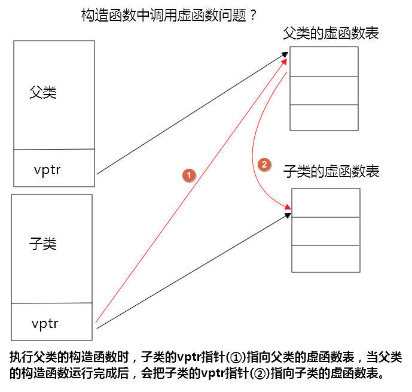

<!--
 * @Author: JohnJeep
 * @Date: 2020-06-08 08:47:41
 * @LastEditTime: 2020-06-10 14:17:56
 * @LastEditors: Please set LastEditors
 * @Description: C++基础面向对象部分
 * @FilePath: /C++/02-C++基础.md
--> 

<!-- TOC -->

- [0.1. 封装](#01-封装)
- [0.2. 面向对象编程（OOP）](#02-面向对象编程oop)
- [0.3. 复合（composition）](#03-复合composition)
- [0.4. 委托（delegation）](#04-委托delegation)
- [0.5. 继承（Inheritance）](#05-继承inheritance)
  - [0.5.1. 类型兼容原则](#051-类型兼容原则)
  - [0.5.2. 继承中的构造与析构调用原则](#052-继承中的构造与析构调用原则)
  - [0.5.3. 继承中同名成员变量处理方法](#053-继承中同名成员变量处理方法)
  - [0.5.4. 继承与虚函数（virtual function）的结合](#054-继承与虚函数virtual-function的结合)
- [0.6. 多态（polymorphism）](#06-多态polymorphism)
- [0.7. 纯虚函数和抽象类](#07-纯虚函数和抽象类)
- [0.8. 耦合与解耦的概念](#08-耦合与解耦的概念)
- [智能指针](#智能指针)
  - [四种智能指针](#四种智能指针)

<!-- /TOC -->

## 0.1. 封装
- 封装了成员数据和常用函数
- 封装了属性和方法。
- `public`  修饰类的成员变量和函数，既能在类的内部使用又能在类的外部使用
- `private` 修饰类的成员变量和函数，只能在类的内部使用，不能在类的外部使用
- `protect` 修饰类的成员变量和函数，只能在 `类的内部` 使用，不能在类的外部使用，可以在继承的子类中使用。    


## 0.2. 面向对象编程（OOP）
- 静态对象（static object）：在作用域（scope）结束后，生命周期还存在，即没有结束，一直到整个程序结束了，它的生命周期也就结束了。
  - 静态的函数没有 `this` pointer，只能去处理静态的数据
    ```
    如何去调用？ 
    1、使用 object 调用。Account a.state(10);
    2、通过 class name 来调用。Account::state(10);
    ```
- 全局对象（global object）：整个程序结束了，它的生命周期也就结束了。
- 头文件名包含在尖括号 `<>` 中，则C++编译器将在存储标准头文件的主机系统的文件系统中查找；但如果文件名包含在双引号 `""` 中，则编译器将首先查找当前的工作目录或源代码目录（或其他目录，这取决于编译器）

- 类的声明和实现时分开的。
  - `.h` 文件只作类的声明
  - `.cpp` 文件进行类的实现 


## 0.3. 复合（composition）


## 0.4. 委托（delegation）
- 两个类之间通过指针相连


## 0.5. 继承（Inheritance）
- 三种继承：public、private、protect
- 数据的继承：子类继承的是父类内存中的数据。
- 函数的继承：子类继承的是父类的调用权利。
- 如何看继承中的访问控制权限
  - 看类的调用语句，是在类的内部还是在类的外部？
  - 看子类如何从父类中继承？
  - 看父类的访问级别？ 
- `public继承`    父类成员在子类中保持原有的访问级别。
- `private继承`   父类成员在子类中的访问级别都变为 `private`
- `protected继承` 
  - 父类中 `public` 成员属性会变为 `protected`
  - 父类中 `private` 成员属性仍然为 `private`
  - 父类中 `protected` 成员属性仍然为 `protected`

- C++中支持多继承的方式


### 0.5.1. 类型兼容原则
- 子类是特殊的父类。
- 基类（父类）的指针或引用 `直接指向` 子类的对象。
  - 指针做函数参数
    ```
    class Parent
    {}

    class Child
    {}

    Parent *p1 = NUll;
    Child c1;
    p = &c1;     // 父类的指针直接指向子类的对象
    ```
  - 引用做函数参数
- 子类对象直接`初始化` 父类对象。
- 子类对象直接 `赋值` 给父类对象。
- 子类对象可以 `当做父类对象使用`。


### 0.5.2. 继承中的构造与析构调用原则
- 内存角度探讨调用原则
  - 构造：由内而外。先调用base(父类)的默认构造函数，然后才执行自己。
  - 析造：由外而内。先执行自己，然后再调用 base(父类)的析构函数。


### 0.5.3. 继承中同名成员变量处理方法
- 子类与父类中的成员变量和成员函数有相同的名称时，采用作用域的方式调用。
```
class Parent
{
public:
    int m;
    void shoe();
}

class child
{
public:
    int m;
    void shoe();
}

Parent p1;
Child c1;

// 调用
p1.Parent::m = 100;
c1.Child::m = 200;
p1.Parent::shoe();
c1.Child::shoe();
```

### 0.5.4. 继承与虚函数（virtual function）的结合
- 为什么会有虚继承
  - 解决多个继承可能产生的二义性。 
  - 二义性：若果一个派生类（子类）由多个基类（父类）继承，这些基类都有一个共同的基类，则在对该基类中声明的变量进行访问时，可能会出现二义性。

- 为什么要用虚函数
  - 相同接口，实现不同功能。
  - 虚函数是动态生成的，普通成员函数是静态生成的。  


- non-virtual: 不希望子类（derived）重写
- virtual: 希望子类重写（override）父类，父类已有默认值
- pure-virtual: 子类（derived）中必须重写(override)父类，父类没有默认值。


## 0.6. 多态（polymorphism）
- 根据实际的对象类型决定函数调用语句的具体调用目标。
  - 父类指针指向父类的对象，则调用父类中定义的函数 
  - 父类指针指向子类的对象，则调用子类中定义的函数 

- 多态实现的效果
  - 同一种调用语句，有多种表现形态。

- 实现多态的三个条件
  - 要有继承
  - 子类中有虚函数重写
  - 父类指针或引用指向子类的对象。

- 链编：一个程序模块，代码之间相互关联的过程。
  - 静态链编：程序的匹配、链接的过程在编译阶段中实现。重载函数使用的是静态链编。
  - 动态链编：程序的匹配、链接的过程在运行时实现。switch、if语句都是采用的动态链编。


- 虚析构函数
  - 为什么要虚析构函数？
    - 通过父类指针将子类的所有资源都释放，即把子类的所有析构函数都执行一遍。
  - 函数格式
    ```
    virtual ~People()
    {}
    ```

- 多态的内部原理探究
  - 当类中声明虚函数时，编译器自动创建了一个虚函数表，每个类的对象都有一个虚函数表。
  - 虚函数表：存储多个虚函数的开始地址。
  - 虚函数表由编译器自动创建于维护。
  - 有 virtual 关键字的成员函数会被编译器放入虚函数表中。
  - 存在虚函数时，在用类实例化一个对象时，C++编译器会在类的对象中添加一个 `vptr` 指针，每个对象中都有一个指向虚函数表的 `vptr` 指针。
  - 通过虚函数表指针 `vptr` 调用重写函数是在程序运行时进行的，需要通过寻址操作才能确定该调用哪个函数。
  - 虚函数的效率比普通成员的效率要低。

- 构造函数中调用虚函数


- 多态是实现框架的基础。在使用框架结构去设计程序的时候，常常使用 `Template Method` 设计模式去实现。


## 0.7. 纯虚函数和抽象类
- 纯虚函数
  ```
  // 语法
  virtual int func() = 0;
  ```
- 含有纯虚函数的类叫抽象类。
  ```
  // 抽象类
  class People
  {
  private:
    ....
  public:
    ....
  
  virtual int func(int a) = 0;
  }
  ```
- 抽象类不能实例化对象，可以声明抽象类的指针。
- 抽象类不能作为函数的参数类型。 `void fg(People)  // error`
- 抽象类不能作为函数返回的类型。`People eat();  // error`
- 抽象类可以声明类的引用。`People& run(People&);`

- 在父类中只定义一套通用的接口，在子类中去实现。

- 继承与虚函数在工程中的应用
  - 由于多继承的二义性，很少使用多继承，一般采用单继承。
  - C++ 中没有真正的类似Java中接口的方法，但可以使用虚继承来模拟接口的方法。
  - 虚继承中可以使用多继承的方式，来实现复杂的业务。


## 0.8. 耦合与解耦的概念
- C++中采用抽象类，提前布局 `vptr` 指针，虚函数表，调用动态链编，实现与第三方产品的解耦合。
- 动态库-----函数的首地址----调用函数指针----调用函数
- 常常采用函数指针将任务的调用者与任务的实现者进行分开，两者互不依赖。  


## 智能指针
- 参考
  - [详解C++11智能指针](https://www.cnblogs.com/WindSun/p/11444429.html)
  - [【C++】智能指针详解](https://blog.csdn.net/flowing_wind/article/details/81301001)


- 动态内存分配常用 `new` 和 `delete` 来分配内存。
- 动态内存分配可能会出现的问题？
  - 忘记释放内存，会造成内存泄漏
  - 有指针引用内存的情况下，释放了内存，产生引用非法内存的指针。
- 为什么要使用智能指针？
  - 需要更加安全的使用动态内存。
  - 负责自动释放所指向对象内存资源。智能指针就是一个类，当超出了类的作用域是，类会自动调用析构函数，析构函数会自动释放资源。

- 智能指针原理：在函数结束时自动释放内存空间，不需要手动释放内存空间。
- 智能指针底层源码采用类模板来实现的，并不是一个简单的普通指针。

### 四种智能指针
- `auto_ptr`
  - 采用所有权模式。
  - 已被C++11弃用，潜在内存崩溃问题。
  - 存在非法的申请内存时，在编译期时可能通过，但程序在运行时可能会出错。


- `unique_ptr`
  - 保证同一时间内只有一个智能指针可以指向该对象。
  - 它对于避免资源泄露(例如“以new创建对象后因为发生异常而忘记调用delete”)特别有用。 
  - 当程序试图将一个 unique_ptr 赋值给另一个时，如果源 unique_ptr 是个临时右值，编译器允许这么做；如果源 unique_ptr 将存在一段时间，编译器将禁止这么做。
    ```
    unique_ptr<string> pu1(new string ("hello world")); 
    unique_ptr<string> pu2; 
    pu2 = pu1;                                      // #1 不允许
    unique_ptr<string> pu3; 
    pu3 = unique_ptr<string>(new string ("You"));   // #2 允许
    ```
  - 想要执行 ` pu2 = pu1;` 的操作，又要保证指针的安全。可以用C++有一个标准库函数 `std::move()`，让你能够将一个 `unique_ptr`赋给另一个。
    > 尽管转移所有权后 还是有可能出现原有指针调用（调用就崩溃）的情况。但是这个语法能强调你是在 `转移所有权`，让你清晰的知道自己在做什么，从而`不乱调用原有指针`。


- `shared_ptr`
  - 多个指针指向同一个对象
  - 采用 `引用计数` 的方法，记录当前内存资源被多少个智能指针引用，该引用计数的内存在堆上分配。
    > 当新增一个指针时，`引用计数` 加1，当释放时 `引用计数` 减一。只有引用计数为0时，智能指针才会自动释放引用的内存资源。
  
  - 对 `shared_ptr` 进行初始化时不能将一个普通指针直接赋值给智能指针，因为一个是指针，一个是类。可以通过 `make_shared` 函数或者通过构造函数传入普通指针，并可以通过get函数获得普通指针。
    
  - 使用 `shared_ptr` 的目的？
    > shared_ptr 是为了解决 auto_ptr 在对象所有权上的局限性(auto_ptr 是独占的), 在使用引用计数的机制上提供了可以共享所有权的智能指针。  
    
  - `shared_ptr` 类中的成员函数
    - `use_count` 返回引用计数的个数
    - `unique` 返回是否是独占所有权( use_count 为 1)
    - `swap` 交换两个 shared_ptr 对象(即交换所拥有的对象)
    - `reset` 放弃内部对象的所有权或拥有对象的变更, 会引起原有对象的引用计数的减少
    - `get` 返回内部对象(指针), 由于已经重载了()方法, 因此和直接使用对象是一样的
    
  - `shared_ptr` 还有可能导致内存泄漏？
    > 两个对象相互使用一个 `shared_ptr` 成员变量指向对方，会造成循环引用，从而导致内存泄漏。


- `weak_ptr `
  - `weak_ptr `是弱引用指针，是一种不控制对象生命周期的智能指针，指向一个 `shared_ptr` 管理的对象。
  - `weak_ptr` 只提供了对管理对象的一中访问手段。

  - 为什么要使用 `weak_ptr` ？
    - 配合 `shared_ptr` 智能指针来进行工作，解决 `shared_ptr` 智能指针相互引用时死锁的问题。当两个 `shared_ptr`智能指针相互引用时，这两个指针的引用数永远不可能减到 0 ，导致资源永远不会释放。
    - 它是对 对象的一种弱引用，不会增加对象的 `引用` 数。
    - `weak_ptr ` 与 `shared_ptr`之间可以相互转化，`shared_ptr` 可以直接赋值给它，`weak_ptr `可以通过调用 `lock` 函数来获得 `shared_ptr`

  - `weak_ptr` 没有重载 `*` 和`-> ` 但可以使用 `lock` 获得一个可用的 `shared_ptr` 对象 

  - `weak_ptr` 在使用前需要检查合法性
    - `expired()` 检测所管理的对象是否已经释放, 如果已经释放, 返回 true; 否则返回 false。
    - `lock()` 获取所管理的对象的强引用 `shared_ptr`；如果 `expired` 为 true, 返回一个空的 `shared_ptr`; 否则返回一个 `shared_ptr`, 其内部对象指向与 `weak_ptr` 相同。
    - `reset()` 将 `weak_ptr` 置空
    - `use_count()` 返回与 `shared_ptr` 共享对象的引用计数。
    - `weak_ptr` 支持 `拷贝或赋值`, 但不会影响对应的 `shared_ptr` 内部对象的计数。

  - `weak_ptr` 底层主要依赖于 `counter` 计数器类和 `shared_ptr` 赋值、构造等手段实现的。
    - counter对象的目地就是用来申请一个块内存来存引用基数  
    - `share_ptr` 给出的函数接口为：构造，拷贝构造，赋值，解引用
    - 