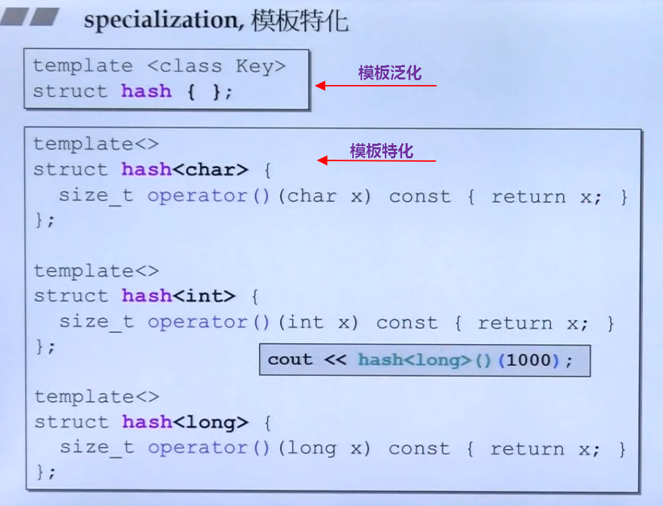

<!--
 * @Author: JohnJeep
 * @Date: 2020-06-15 08:48:16
 * @LastEditTime: 2021-08-19 22:24:40
 * @LastEditors: Windows10
 * @Description: C++提高部分
 * 
--> 
<!-- TOC -->

- [1. class(类)](#1-class类)
- [2. Encapsulation(封装)](#2-encapsulation封装)
- [3. OOP: Object-Oriented-Programming(面向对象编程)](#3-oop-object-oriented-programming面向对象编程)
  - [3.1. 功能复用技术](#31-功能复用技术)
    - [3.1.1. Composition(复合)](#311-composition复合)
    - [3.1.2. Delegation(委托)](#312-delegation委托)
    - [3.1.3. Inheritance(继承)](#313-inheritance继承)
    - [3.1.4. Composite, Inheritance和Delegation对比](#314-composite-inheritance和delegation对比)
    - [3.1.5. Parameterized Type(参数化类型)](#315-parameterized-type参数化类型)
  - [3.2. 类型兼容原则](#32-类型兼容原则)
  - [3.3. 继承中的构造与析构调用原则](#33-继承中的构造与析构调用原则)
  - [3.4. 继承中同名成员变量处理方法](#34-继承中同名成员变量处理方法)
  - [3.5. 继承与虚函数(virtual function)的结合](#35-继承与虚函数virtual-function的结合)
  - [3.6. Polymorphism(多态)](#36-polymorphism多态)
  - [3.7. 纯虚函数和抽象类](#37-纯虚函数和抽象类)
  - [3.8. 耦合与解耦的概念](#38-耦合与解耦的概念)
- [4. Generic Programming(泛型编程)](#4-generic-programming泛型编程)
  - [4.1. 模板编译](#41-模板编译)
  - [4.2. Function Template(函数模板)](#42-function-template函数模板)
  - [4.3. Class Template(类模板)](#43-class-template类模板)
    - [4.3.1. Specialization(模板特化)](#431-specialization模板特化)
    - [4.3.2. Class Partial Specialization(类模板偏特化)](#432-class-partial-specialization类模板偏特化)
  - [4.4. Member Template(成员模板)](#44-member-template成员模板)
  - [4.5. template template parameter](#45-template-template-parameter)
- [5. 输入输出流](#5-输入输出流)
- [6. Resource acquisition is initialization(RAII)](#6-resource-acquisition-is-initializationraii)
- [7. std::move()](#7-stdmove)
- [8. Meata Programming(元编程)](#8-meata-programming元编程)

<!-- /TOC -->

# 1. class(类)

- class without pointer members：类中的成员不带有指针。
- class with pointer members：类中的成员带有指针。


# 2. Encapsulation(封装)

- 封装了成员数据和常用函数
- 封装了属性和方法。
- `public`  修饰类的成员变量和函数，既能在类的内部使用又能在类的外部使用
- `private` 修饰类的成员变量和函数，只能在类的内部使用，不能在类的外部使用
- `protect` 修饰类的成员变量和函数，只能在 `类的内部` 使用，不能在类的外部使用，可以在继承的子类中使用。    


# 3. OOP: Object-Oriented-Programming(面向对象编程)

静态对象（static object）：在作用域（scope）结束后，生命周期还存在，即没有结束，一直到整个程序结束了，它的生命周期也就结束了。
  - 静态的函数没有 `this` pointer，只能去处理静态的数据
    ```cpp
    如何去调用？ 
    1、使用 object 调用。Account a.state(10);
    2、通过 class name 来调用。Account::state(10);
    ```

全局对象（global object）：整个程序结束了，它的生命周期也就结束了。


## 3.1. 功能复用技术

C++中类与类之间的关系主要归为三大类：复合、委托、继承。

### 3.1.1. Composition(复合)

什么是复合？
  > 每当一个类的对象作为另一个类的成员变量时，就实现了复合。当一个类中包含(`has-a`)另一个类时，将其它类的对象作为当前类的成员使用，当前类的成员变量不再是简单的基础类型，而是变为复杂的其它类的对象。
  <p></p>

  ```C++
  // queue类中包含deque类
  Template <class T>
  class queue {
    ...

    protected:
      deque<T> C;
    
    public:
      ...
  };
  ```


内存角度理解复合中的构造与析构
- 构造（由内而外）：编译器默认先调用当前类中包含的类的默认构造函数，然后再调用当前类的构造函数。
- 析构（由外而内）：编译器默认先调用调用当前类的析构函数，然后再调用当前类中包含的类的析构函数。
  <p></p>


类与类之间的生命周期两者是同步的。


### 3.1.2. Delegation(委托)
- 什么是delegation？
  > 委托(delegation)也叫Composition by reference。两个类之间通过指针相连。
  <p></p>

  ```C++
  // MyString类指向Stu类
  class MyString
  {
  private:
      Stu* st;       // 采用委托的方式
  public:
      MyString(/* args */) {}
      ~MyString() {}
  };

  class Stu
  {
  private:
      char* m_data;
      int n;
  public:
      Stu(/* args */) {}
      ~Stu() {}
  };
  ```
- 类与类之间的生命周期两者是不同步的。


copy on write
  > MyString类对象的三个实例a，b, c 同时共享Stu类中的整数 `n`，指针 `rep` 指向数据 `hello`。如果实例 `a` 想要修改 `hello` 这个数据，则需要先拷贝一份，然后再修改拷贝的数据，这种实现的方法称为 `copy on write(写时复制)`
  <p></p>


pImpl

-  pImpl(Pointer to implementation, 指向实现的指针)是一种常用的，也叫`handle/body`或者叫防火墙编译，用来对 `类的接口与实现` 进行解耦的方法。这个技巧可以避免在头文件中暴露私有细节，是促进API接口与实现保持完全分离的重要机制。但是pImpl并不是严格意义上的设计模式(它是受制于C++特定限制的变通方案)，这种惯用法可以看作桥接设计模式的一种特例。
- 优点
  - 降低耦合
  - 信息隐藏
  - 降低编译依赖，提高编译速度
  - 接口与实现分离


### 3.1.3. Inheritance(继承)

什么是Inheritance？
  > 继承（英语：inheritance）是面向对象软件技术当中的一个概念。如果一个类别B“继承自”另一个类别A，就把这个B称为“A的子类”，而把A称为“B的父类别”也可以称“A是B的超类”。继承可以使得子类具有父类别的各种属性和方法，而不需要再次编写相同的代码。在令子类别继承父类别的同时，可以重新定义某些属性，并重写某些方法，即覆盖父类别的原有属性和方法，使其获得与父类别不同的功能。另外，为子类追加新的属性和方法也是常见的做法。 一般静态的面向对象编程语言，继承属于静态的，意即在子类的行为在编译期就已经决定，无法在运行期扩展。

从内存的角度看继承
  

子类（派生类）可以从父类（基类）继承哪些方法和成员?
  - 数据的继承：子类继承的是父类内存中的数据。
  - 函数的继承：从内存的角度去看待，子类函数继承的是父类的调用权，而不是父类的内存大小。
  - 子类不能继承父类中以下的几种的数据
    - 基类的构造函数、析构函数和拷贝构造函数。
    - 基类的重载运算符。
    - 基类的友元函数。


如何判断继承中的访问控制权限
  - 看类的调用语句，是在类的内部还是在类的外部？
  - 看子类如何从父类中继承？
  - 看父类的访问级别？ 


C++中支持多继承的方式。常见的三种继承方式：public、private、protected

- `public继承`  
  - 父类成员在子类中保持原有的访问级别。
  - 类的对象的公共数据成员可以使用直接成员访问运算符 `.` 来访问；但私有的成员和受保护的成员不能使用直接成员访问运算符 `.` 来直接访问。


- `private继承` 
  - 父类成员在子类中的访问级别都变为 `private`


- `protected继承` 
  - 父类中为 `public` 成员属性，在子类中变为 `protected`
  - 父类中为 `private` 成员属性，在子类中为 `private`
  - 父类中为 `protected` 成员属性，在子类中为 `protected`


public、protect、private三个关键字的访问范围
- public: 能被类成员函数、子类函数、友元访问，也能被类的对象访问。
- private: 只能被类成员函数及友元访问，不能被其他任何访问，本身的类对象也不行。
- protected: 只能被类成员函数、子类函数及友元访问，不能被其它任何的数据访问，本身的类对象也不行。  
  - 为什么要引入 protected 访问权限？
    > 引入保护成员的理由是：基类的成员本来就是派生类的成员，对于那些隐藏的、不宜设为公有的，但又确实需要在派生类的成员函数中经常访问的基类成员，则将它们设置为protected成员，既能起到隐藏的目的，又避免了派生类成员函数要访问它们时只能间接访问所带来的麻烦。 
  - 子类（派生类）的成员函数只能访问所作用的那个对象（即this指针指向的对象）的基类保护成员，不能访问其他父类（基类）对象的父类保护成员。  
    > 类的对象只能调用其public部分的成员，而不能调用protected和private部分的成员。


- 参考
  - [C++：继承访问属性（public/protected/private）](https://www.cnblogs.com/duwenxing/p/7476469.html) 
  - [c++父类和子类的关系](https://blog.csdn.net/limengjuhanxin/article/details/90582443)


### 3.1.4. Composite, Inheritance和Delegation对比
- 继承
  - 类继承允许你根据其他类的实现来定义一个类的实现。在继承方式中，父类的内部细节对子类可见。
  - 类继承是在编译时刻静态定义的，且可直接使用，因为程序设计语言直接支持类继承。类继承可以较方便地改变被复用的实现。当一个子类重定义一些而不是全部操作时，它也能影响它所继承的操作，只要在这些操作中调用了被重定义的操作。
  - 类继承也有一些不足之处。首先，因为继承在编译时刻就定义了，所以无法在运行时刻改变从父类继承的实现。更糟的是，父类通常至少定义了部分子类的具体表示。因为继承对子类揭示了其父类的实现细节，所以继承常被认为“破坏了封装性”。子类中的实现与它的父类有如此紧密的依赖关系，以至于父类实现中的任何变化必然会导致子类发生变化。
  - 使用继承时，被继承的操作总能引用接受请求的对象，C++ 中通过 this 成员变量。委托方式为了得到同样的效果，接受请求的对象将自己传给被委托者（代理人），使被委托的操作可以引用接受请求的对象。


- 组合
  - 对象组合要求被组合 的对象具有良好定义的接口，对象的内部细节是不可见的。  
  - 对象组合是通过获得对其他对象的引用而在运行时刻动态定义的。组合要求对象遵守彼此的接口约定，进而要求更仔细地定义接口，而这些接口并不妨碍你将一个对象和其他对象一起使用。这还会产生良好的结果：因为对象只能通过接口访问，所以我们并不破坏封装性；只要类型一致，运行时刻还可以用一个对象来替代另一个对象；更进一步，因为对象的实现是基于接口写的，所以实现上存在较少的依赖关系。
  - 优先使用对象组合有助于你保持每个类被封装，并被集中在单个任务上。这样类和类继承层次会保持较小规模，并且不太可能增长为不可控制的庞然大物。另一方面，基于对象组合的设计会有更多的对象 (而有较少的类)，且系统的行为将依赖于对象间的关系而不是被定义在某个类中。


- 委托
  - 委托(delegation)是一种组合方法，它使组合具有与继承同样的复用能力。在委托方式下，有两个对象参与处理一个请求，接受请求的对象将操作委托给它的代理者(delegate)。类似于子类将请求交给它的父类处理。
  - 优缺点
    - 优点：便于运行时刻组合对象操作以及改变这些操作的组合方式。
    - 缺点： 动态的、高度参数化的软件比静态软件更难于理解。还有运行低效问题，不过从长远来看人的低效才是更主要的。只有当委托使设计比较简单而不是更复杂时，它才是好的选择。要给出一个能确切告诉你什么时候可以使用委托的规则是很困难的。因为委托可以得到的效率是与上下文有关的，并且还依赖于你的经验。


### 3.1.5. Parameterized Type(参数化类型)

参数化类型(parameterized type)也就是泛型编程(generic)和模板(templates)。


## 3.2. 类型兼容原则
- 子类是特殊的父类。
- 基类(base)的指针或引用 `直接指向` 子类(derived)的对象。
  - 指针做函数参数
    ```cpp
    class Parent
    {}

    class Child
    {}

    Parent *p1 = NUll;
    Child c1;
    p = &c1;     // 父类的指针直接指向子类的对象
    ```
  - 引用做函数参数
- 子类对象直接`初始化` 父类对象。
- 子类对象直接 `赋值` 给父类对象。
- 子类对象可以 `当做父类对象使用`。


## 3.3. 继承中的构造与析构调用原则

内存角度探讨调用原则
- 构造：由内而外。先调用base(父类)的默认构造函数，然后才执行自己。
- 析造：由外而内。先执行自己，然后再调用 base(父类)的析构函数。


## 3.4. 继承中同名成员变量处理方法

子类与父类中的成员变量和成员函数有相同的名称时，采用作用域的方式调用。
```cpp
class Parent
{
public:
    int m;
    void shoe();
}

class child
{
public:
    int m;
    void shoe();
}

Parent p1;
Child c1;

// 调用
p1.Parent::m = 100;
c1.Child::m = 200;
p1.Parent::shoe();
c1.Child::shoe();
```

## 3.5. 继承与虚函数(virtual function)的结合

在 C++ 中，在基类的成员函数声明前加上关键字 virtual 即可让该函数成为 虚函数，派生类中对此函数的不同实现都会继承这一修饰符，允许后续派生类覆盖，达到迟绑定的效果。

- 为什么会有虚继承
  - 解决多个继承可能产生的二义性。 
  - 二义性：若果一个派生类（子类）由多个基类（父类）继承，这些基类都有一个共同的基类，则在对该基类中声明的变量进行访问时，可能会出现二义性。

- 为什么要用虚函数
  - 相同的接口，实现不同的功能。
  - 有了虚函数，程序能够调用编译期还不存在的函数。
  - 虚函数是动态生成的，普通成员函数是静态生成的。  


- non-virtual: 不希望子类（derived）重写
- virtual: 希望子类重写（override）父类，父类已有默认值
- pure-virtual: 子类（derived）中必须重写(override)父类，父类没有默认值。


## 3.6. Polymorphism(多态)

多态（英语：polymorphism）指为不同数据类型的实体提供统一的接口。

- 根据实际的对象类型决定函数调用语句的具体调用目标。
  - 父类指针指向父类的对象，则调用父类中定义的函数 
  - 父类指针指向子类的对象，则调用子类中定义的函数 

- 多态实现的效果
  - 同一种调用语句，有多种表现形态。

- 实现多态的三个条件
  - 要有继承
  - 子类中有虚函数重写
  - 父类指针或引用指向子类的对象。


- 链编(bind)：一个程序模块，代码之间相互关联的过程。
  - 静态链编：程序的匹配、链接的过程在编译阶段中实现。重载函数使用的是静态链编。
  - 动态链编：程序的匹配、链接的过程在运行时实现。switch、if语句都是采用的动态链编。


- 虚析构函数
  - 为什么要虚析构函数？
    - 通过父类指针将子类的所有资源都释放，即把子类的所有析构函数都执行一遍。
  - 函数格式
    ```cpp
    virtual ~People()
    {
    }
    ```


- 多态的内部原理探究
  - 当类中声明虚函数时，编译器自动创建了一个虚函数表，每个类的对象都有一个虚函数表。
  - 虚函数表：存储多个虚函数的开始地址。虚函数表由编译器自动创建和维护。
  - 有 `virtual` 关键字的成员函数会被编译器放入虚函数表中。
  - 存在虚函数时，用类实例化一个对象的过程中，C++编译器会在类的对象中添加一个 `vptr` 指针，每个对象中都有一个指向虚函数表的 `vptr` 指针。
  - 通过虚函数表的虚指针 `vptr` 调用重写函数是在程序运行时进行的，需要通过寻址操作才能确定调用的是哪个函数。
  - 虚函数的效率比普通成员的效率要低。因为函数所有的调用都是动态绑定的。


- vptr(虚指针)和vtbl(虚函数表)


- 构造函数中调用虚函数


- 函数的静态绑定


- 函数的动态绑定


- 结论：多态是实现框架的基础。在使用框架结构去设计程序的时候，常常结合 `Template Method` 和其它的设计模式去实现。

参考： [C++编译期多态与运行期多态](https://www.cnblogs.com/QG-whz/p/5132745.html)


## 3.7. 纯虚函数和抽象类

纯虚函数
```cpp
// 语法
virtual int func() = 0;
```

含有纯虚函数的类叫抽象类。在父类中只定义一套通用的接口，在子类中去实现。
  ```cpp
  // 抽象类
  class People
  {
  private:
    ....
  public: 
    ....
  
  virtual int func(int a) = 0;
  }
  ```

虚函数注意点
- 静态函数没有虚函数，内联函数不可能是虚函数，构造函数不能是虚函数。
- 抽象类不能实例化对象，可以声明抽象类的指针。
- 抽象类不能作为函数的参数类型。 `void fg(People)  // error, People为抽象类`
- 抽象类不能作为函数返回的类型。`People eat();  // error，People为抽象类`
- 抽象类可以声明类的引用。`People& run(People&); // People为抽象类`

  
继承与虚函数在工程中的应用
- 由于多继承的二义性，很少使用多继承，一般采用单继承。
- C++ 中没有真正的类似Java中接口的方法，但可以使用虚继承来模拟接口的方法。
- 虚继承中可以使用多继承的方式，来实现复杂的业务。


## 3.8. 耦合与解耦的概念

- C++中采用抽象类，提前布局 `vptr` 指针，虚函数表，调用动态链编，实现与第三方产品的解耦合。
- 动态库-----函数的首地址----调用函数指针----调用函数
- 常常采用函数指针将任务的调用者与任务的实现者进行分开，两者互不依赖。  

Aggregation
  > 聚合意味着一个对象拥有另一个对象或对另一个对象负责。一般我们称一个对象包含另一个对象或者是另一个对象的一部分。聚合意味着聚合对象和其所有者具有相同的生命周期。

  > C++中，聚合可以通过定义表示真正实例的成员变量来实现，但更通常的是将这些成员变量定义为实例指针或引用。

Acquaintance(相识) 
  > 相识意味着一个对象仅仅知道另一个对象。有时相识也被称为“关联”或“引用”关系。相识的对象可能请求彼此的操作，但是它们不为对方负责。相识是一种比聚合要弱的关系，它只标识了对象间较松散的耦合关系。
  - 通过指针或引用来实现。 


聚合关系使用较少且比相识关系更持久；而相识关系则出现频率较高，但有时只存在于一个操作期间，相识也更具动态性，使得它在源代码中更难被辨别出来。


# 4. Generic Programming(泛型编程) 

Generic Programming(泛型编程): 操作(operations)使用相同的接口，但是其类型(type)不相同，即使用模板(template)将泛型操作公式化。其中STL是泛型编程(GP)最成功的一个作品。

泛型编程在程序编译时就能获知其类型。而面向对象编程处理的类型在程序运行之前都是未知的情况。


模板是泛型编程的基础。C++语言既有类模板（class template），也有函数模板（function template），只有对C++语言有了相当深入的理解后才能写出模板。**模板本身不是类或函数，可以将模板看作是：编译器为生成类或函数编写的一份说明，或认为一个模板就是为创建类或函数的公式。** 编译器根据模板创建类或函数的过程称为实例化（Instantiation），当使用模板时，编译器需要明确应该吧类或函数实例化成何种类型。

**面向对象编程与泛型编程的区别？**
> OOP是将类中的data与methods组合在一起的，而泛型编程(GP)则是将类中的data与methods分开来的。采用泛型编程可以实现容器(Containers)与算法(Algorithms)的各自分离与实现。


## 4.1. 模板编译

当编译器遇到一个模板定义时，它并不生成代码。只有当我们实例化出模板的一个特定版本时，编译器才会生成代码。当我们使用（而不是定义）模板时，编译器才生成代码，这一特性影响了我们如何去组织代码以及错误何时被检测到。

通常，当我们调用一个函数时，编译器只需要掌握函数的声明。类似的，当我们使用一个类类型的对象时，类定义必须是可用的，但成员函数的定义不必己经出现。因此，我们将类定义和函数声明放在头文件中，而普通函数和类的成员函数的定义放在源文件中。

模板则不同：为了生成一个实例化版本，编译器需要掌握函数模板或类模板成员函数的定义。因此，与非模板代码不同，模板的头文件通常既包括声明也包括定义。


## 4.2. Function Template(函数模板)

模板函数语法

实例一：
```cpp
template <typename T> 
  void Show(T arrNum[], int len);
```

实例二：
```c++
// 声明
template <typename T>
void func(T a, T b)

// 调用
func<int>(x, y);      // 显示调用
func(x, y);           // 调用时自动类型推导，不需要写出具体的函数类型 int，编译器会对
                      // function template 进行实参推导
```


- 两种方式调用
  - 显示类型调用
  - 自动类型推导

- 函数模板与函数重载
  - 函数模板的调用严格按照类型进行匹配，不会进行类型的自动转换。
  - `普通函数` 的调用可以进行 `隐式` 的类型转换。
  - 调用规则
    - 函数模板与普通函数都符合调用时，C++编译器优先考虑普通函数
    - 函数模板可以像普通函数一样被重载。
    - 若函数模板可以产生一个更好的匹配，那么选择模板
    - 通过空模板 `<>` 实参数列表的语法限定编译器只通过模板匹配。

- 函数模板调用的机制
  - 编译器并不是把函数模板处理成能够匹配任意类型的函数，而是根据函数模板中的具体类型产生不同的函数。
  - 编译器会对 `函数模板进行两次编译`。`第一次在声明` 的地方对模板进行编译，`第二次在实际调用` 的地方将参数替换后，再对代码进行编译。

- 函数模板当函数参数与函数指针当函数参数的情况类似。 


## 4.3. Class Template(类模板)

对类模板来说，我们通过提供一些额外信息来指定模板到底实例化成什么样的类，需要提供哪些信息由模板决定。在模板名字后面跟一对尖括号，尖括号内放上需要提供的信息。

与函数模板不同之处是，编译器不能自动为类模板推断模板参数类型，需要显示的指定传入的参数类型。


为什么要使用类模板？
  - 让 `算法` 和 `数据类型` 进行各自的分离。 

代码示例：
```cpp
// 定义类模板
template <typename T>
class Complex
{
public:
  Complex(T r = 0, T i = 0)
    : re(r), im(i)
    {}
  Complex& operator += (const Complex&);
  T real() const {retuen re;}
  T image() const {return im;}

private:
  T re;
  T im;
}

{
  // 具体使用类模板
  Complex<double> c1(5.5, 10.8);
  Complex<int> c2(4, 6);

}
```
> 要实现不同类型的复数类进行加、减、乘的运算，其中进行运算的规则都是一样的，只是传入的类型不同而已，这时类模板就很好的解决了这个问题。


- 单个类中的类模板
  - 模板类型参数化  

- 继承中的类模板
  - 从模板类派生普通的类时，需要具体化模板类（即指定类的参数类型），C++编译器需要知道父类的数据类型具体是怎样的。 
  - 类模板可以派生 `类模板`

- 注意
  - 一个类模板的每个实例都形成一个独立的类。 

### 4.3.1. Specialization(模板特化)

什么是模板特化？
  > 模板特化也叫模板全特化。使用时，给类模板指定具体的参数类型，这样使用类模板的方式就叫模板特化。



### 4.3.2. Class Partial Specialization(类模板偏特化)
类模板偏特化也叫类模板局部特化。对一个类模板中的参数类型只指定部分参数，不全部在类模板调用时传入。类模板偏特化按照模板参数的个数和参数类型的范围，分为模板个数偏特化和模板范围偏特化。

**1. 模板个数的偏特化**
> 只指定类模板中部分的参数个数


**2. 类模板范围的偏特化**
> 下图中类模板传入的是一种通用的 T 类型，而另外一个相同的类模板，传入的参数 是 `T*` 类型，类模板的类型从 T 缩小为 T* 类型，这种的方式的类模板就是类模板范围的偏特化。


## 4.4. Member Template(成员模板)
- 为什么要使用 `member template`?
  - STL 标准库中很多的构造函数都使用了，为了让模板类更加有弹性，支持更多的数据类型。


## 4.5. template template parameter
- 什么是模板参数模板？
  - 模板参数列表里面可以存在模板，称之为模板参数模板。


- 参考
  - [【C++】template template argument 模板参数模板](https://www.cnblogs.com/visayafan/archive/2011/11/29/2268041.html) 


# 5. 输入输出流
- 输入流 `cin`
  - `getline()` 终端输入缓冲区中时可以输入 `空格`。
  - `ignore()` 忽略缓冲区指定的数据
  - `peek()` 读缓冲区的数据，若有数据，则读出缓冲区的一个数据；没有数据，则读出无数据。
  - `putback()`

- 输出流 `cout`
  - `flush()` 刷新缓冲区的数据
  - `put()` 将字符一个一个地输出到标准输出上
  - `write()`
  - `width()`
  - `fill()`  

- 文件IO流
  - `ofstream`建立一个输出流对象，将数据输出到指定文件中。
  - `ifstream` 建立一个输入流对象，将从文件中读到的数据输出到终端上。


# 6. Resource acquisition is initialization(RAII)


# 7. std::move()

有利于编译器对程序做更多的优化。英文名叫 `move assignment`，又称为移动赋值函数。与早期版本中的复制赋值函数对应。在c++11以后，可以直接将临时变量b中的内存指针直接传递给a，由于避免了多余的内存分配操作，因此大大提高了程序效率。


# 8. Meata Programming(元编程)

元编程针对**类型**进行操作。而一般的编程是对 **变量或对象** 进行操作。

`tuple` 标准库的底层是采用递归的方式去实现的。 