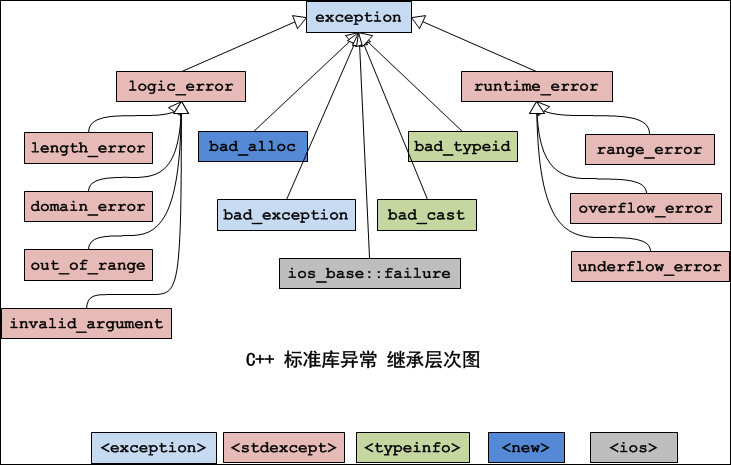
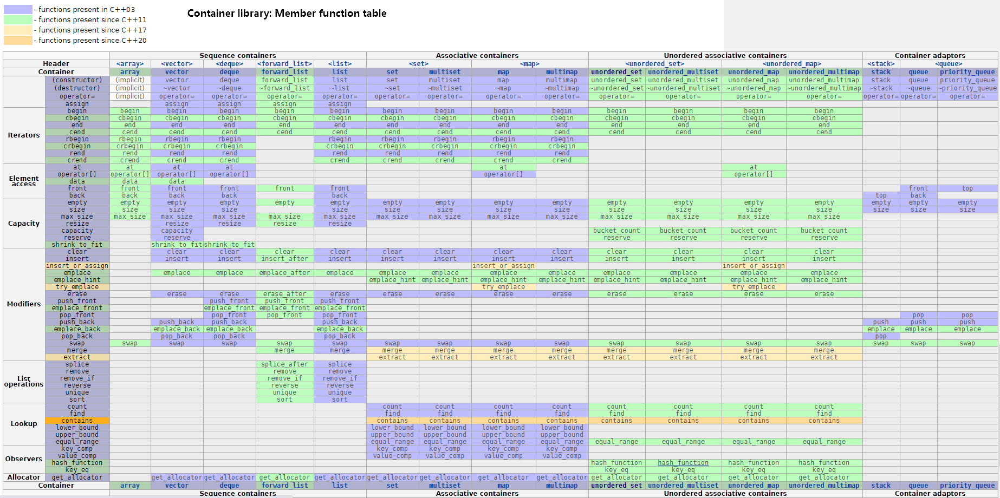
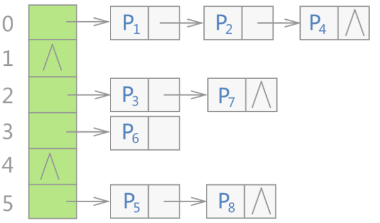

<!--
 * @Author: JohnJeep
 * @Date: 2020-06-15 08:48:16
 * @LastEditTime: 2020-07-16 16:18:20
 * @LastEditors: Please set LastEditors
 * @Description: C++提高部分
 * 
--> 

<!-- TOC -->

- [0.1. 函数模板](#01-函数模板)
- [0.2. 类模板](#02-类模板)
- [0.3. 类型转换](#03-类型转换)
- [0.4. 异常处理](#04-异常处理)
- [0.5. 输入输出流](#05-输入输出流)
- [0.6. STL（Standard Template Library）标准模板库](#06-stlstandard-template-library标准模板库)
  - [0.6.1. Sequence containers(有序容器)](#061-sequence-containers有序容器)
    - [0.6.1.1. vector（单端的动态数组）](#0611-vector单端的动态数组)
    - [0.6.1.2. deque（双端数组）](#0612-deque双端数组)
    - [0.6.1.3. list（双向链表）](#0613-list双向链表)
  - [0.6.2. Associative containers(关联性容器)](#062-associative-containers关联性容器)
    - [0.6.2.1. set容器](#0621-set容器)
    - [0.6.2.2. map容器](#0622-map容器)
    - [0.6.2.3. multiset](#0623-multiset)
    - [0.6.2.4. mutimap](#0624-mutimap)
  - [0.6.3. Unordered associative containers(无序关联容器)](#063-unordered-associative-containers无序关联容器)
    - [0.6.3.1. unordered_set](#0631-unordered_set)
    - [0.6.3.2. unordered_map](#0632-unordered_map)
    - [0.6.3.3. unordered_multisert](#0633-unordered_multisert)
    - [0.6.3.4. unordered_multimap](#0634-unordered_multimap)
  - [0.6.4. Container adaptors(容器适配器)](#064-container-adaptors容器适配器)
    - [0.6.4.1. stack容器](#0641-stack容器)
    - [0.6.4.2. queue容器](#0642-queue容器)
    - [0.6.4.3. 优先级队列 priority_queue](#0643-优先级队列-priority_queue)
- [0.7. STL常用算法](#07-stl常用算法)

<!-- /TOC -->

## 0.1. 函数模板
- 语法
  ```
  // 声明
  template <typename T>
  void func(T a, T b)

  func<int>(x, y);      // 显示调用
  func(x, y);           // 调用时自动类型推导
  ```

- 两种方式调用
  - 显示类型调用
  - 自动类型推导

- 函数模板与函数重载
  - 函数模板的调用严格按照类型进行匹配，不会进行类型的自动转换。
  - `普通函数` 的调用可以进行 `隐式` 的类型转换。
  - 调用规则
    - 函数模板与普通函数都符合调用时，C++编译器优先考虑普通函数
    - 函数模板可以像普通函数一样被重载。
    - 若函数模板可以产生一个更好的匹配，那么选择模板
    - 通过空模板 `<>` 实参数列表的语法限定编译器只通过模板匹配。

- 函数模板调用的机制
  - 编译器并不是把函数模板处理成能够匹配任意类型的函数，而是根据函数模板中的具体类型产生不同的函数。
  - 编译器会对 `函数模板进行两次编译`。`第一次在声明`的地方对模板进行编译，`第二次在调用` 的地方对将参数替换后的代码进行编译。

- 函数模板当函数参数与函数指针当函数参数类似。 


## 0.2. 类模板
- 为什么要使用类模板？
  - 让 `算法` 和 `数据类型` 进行各自的分离。 

- 单个类中的类模板
  - 模板类型参数化  
- 继承中的类模板
  - 从模板类派生普通的类时，需要具体化模板类（即指定类的参数类型），C++编译器需要知道父类的数据类型具体是怎样的。 
  - 类模板可以派生 `类模板`


## 0.3. 类型转换
- 4种类型转换
  - `static_cast` 静态类型转换。
    - 格式
      ```
      static_cast<>()，
      例如：
      double a1 = 12.0;
      int a2 = static_cast<int>(a1);  
      ```
    - 编译时，编译器会做类型转换。
    - C语言中能使用隐式转换的类型均可以用 `static_cast` 类型转换
  - `reinterpret_cast<>()` 重新解释类型
  - `dynamic_cast<>()` 动态类型转换（父类与子类之间的多态类型转换）
  - `const_cast<>()` const类型转换，去除类型的只读属性。


## 0.4. 异常处理
- C++中使用 `throw` 抛出异常，`try...catch` 等关键字来捕获异常。
  ```
  // 语法
  try
  {
    program-statements
  }
  catch (exception-declaration)
  {
    handler-statements
  }
  catch (exception-declaration)
  {
    handler-statements
  }

  // throw语法
  throw 需要处理的表达式;

  // 注意：空的throw语句只能出现在catch语句或者被catch语句调用的函数体内，如果空的throw语句出现在处理代码以外，则编译器将执行terminate
  ```

- 异常严格按照类型进行匹配，不会进行隐式的类型转换。
- C++的异常处理机制使 `异常的检测` 与 `异常的处理` 不必在同一个函数中，很好的实现了软件的分层机制。
- 异常是一种 `跨越函数` 的机制。
- 栈解旋：类中的抛出异常会执行析构函数。

- 异常变量的生命周期
  - 异常接收时的变量是元素，且为 `类的类型` 时，则执行的是拷贝构造。
  - 异常接收时的变量为 `类的引用` 时，使用 throw 去抛那个对象。
  - 指针和引用或元素可以同时执行 `catch` 捕获，但引用和元素不能同时执行 `catch` 捕获。

- 异常的层次结构
  - 标准库中常常在继承中处理。
  - 按照引用传递异常，在异常中使用虚函数。

- 标准程序库中所有基类的异常为 `Exception()` 
  <p align="center">
    
  </p>


- 异常的优缺点
  - 优点
    - 函数的返回值可以忽略，但异常不可忽略。如果程序出现异常，但是没有被捕获，程序就会终止，这多少会促使程序员开发出来的程序更健壮一点。而如果使用C语言的error宏或者函数返回值，调用者都有可能忘记检查，从而没有对错误进行处理，结果造成程序莫名其面的终止或出现错误的结果。
    - 整型返回值没有任何语义信息。而异常却包含语义信息，有时你从类名就能够体现出来。
    - 整型返回值缺乏相关的上下文信息。异常作为一个类，可以拥有自己的成员，这些成员就可以传递足够的信息。
    - 异常处理可以在调用跳级。这是一个代码编写时的问题：假设在有多个函数的调用栈中出现了某个错误，使用整型返回码要求你在每一级函数中都要进行处理。而使用异常处理的栈展开机制，只需要在一处进行处理就可以了，不需要每级函数都处理。
  - 缺点
    - C++没有垃圾回收机制，资源需要自己管理。C++中异常经常会导致资源泄漏的问题，比如在new和delete中抛出了异常，导致内存泄漏，在lock和unlock之间抛出了异常导致死锁。
    - 异常会在程序运行出错时抛出异常，程序会乱跳，导致调试程序比较困难。
    - 异常会有一些性能的开销。 
    - 构造函数中不能抛异常，抛异常可能导致对象定义不完整。析构函数不能抛异常，可能导致内存泄漏。


- 构造函数中的异常
  - 处理构造函数中初始值异常的唯一方法：将构造函数写成try函数语句块

- noexception关键字
  - 表明使用该关键字时，指定某个函数不会抛出异常。
  - `void add(int) noexception;`   // 表明add()不会抛出异常
  - 注意
    - 函数指针的声明和定义中可以指定 noexception
    - `typedef或类型的别名` 中不能使用noexception
    - 成员函数中，noexception需要跟在 `const或引用` 限定符之后，但是跟在 `final、override或虚函数=0` 这些限定符之前。

- noexcept关键字


## 0.5. 输入输出流
- 输入流 `cin`
  - `getline()` 终端输入缓冲区中时可以输入 `空格`。
  - `ignore()` 忽略缓冲区指定的数据
  - `peek()` 读缓冲区的数据，若有数据，则读出缓冲区的一个数据；没有数据，则读出无数据。
  - `putback()`

- 输出流 `cout`
  - `flush()` 刷新缓冲区的数据
  - `put()` 将字符一个一个地输出到标准输出上
  - `write()`
  - `width()`
  - `fill()`

- 文件IO流
  - `ofstream`建立一个输出流对象，将数据输出到指定文件中。
  - `ifstream` 建立一个输入流对象，将从文件中读到的数据输出到终端上。


## 0.6. STL（Standard Template Library）标准模板库
- 广义分类
  - 算法（Algorithm）
  - 容器（Container）
  - 迭代器（Iterator）：相当于一个指针
  - 仿函数（Function object）
  - 适配器（Adaptor）
  - 空间适配器（Alloctor） 
- STL的核心思想：算法和数据结构的实现是分离的。

- 常用的容器
  - Vector(向量)
  - Deque(双队列)
  - List(链表)
  - Map/Multimap(映射/多重映射)
  - Set/Multiset(集合/多重集合)
  <p align="center">
    
  </p>

- STL标准库中的容器内存储的元素都必须能够拷贝，C++编译器默认提供的是浅拷贝，程序在执行时，会出现问题。因此需要重写构造函数和重载 `=` 操作运算符，执行深拷贝。


### 0.6.1. Sequence containers(有序容器)

#### 0.6.1.1. vector（单端的动态数组）
- 动态数组实现机制：
  > 先为数组开辟较小的空间，然后往数组里面添加数据，当数据的数目超过数组的容量时，再重新分配一块更大的空间（STL中 `vector` 每次扩容时，新的容量都是前一次的两倍），再把之前的数据复制到新的数组中，再把之前的内存释放。
  - 注意：使用动态数组时，尽量减少改变数组容量大小的次数，可以减少时间性能的消耗。
- 动态数组，在运行阶段执行。
- 向容器中插入元素时，内部的元素必须能够执行 `拷贝（必须提供拷贝构造）` 操作。
- `vector` 支持随机迭代访问器。

- 模板：`template <typename T> void Show(T arrNum[], int len);`
- 函数接口
  - `size()`: 返回容器中元素的个数
  - `get(r)`: 获取秩（索引）为r的元素
  - `put(r, e)`: 用e替换秩为r元素的数值
  - `insert(r, e)`: 向秩为r的元素处插入数值e，后面元素依次后移
  - `remove(r)`: 初除秩为 `r` 的元素，返回全元素中原存放的对象
  - `disordered()`: 判断所有元素是否已按升序序排列
  - `sort()`: 调整各元素癿位置，使按照升序序排列
  - `deduplicate()`: 删除重复元素   ---向量
  - `uniquify()`: 删除重复元素 ---有序向量
  - `traverse()`: 遍历向量幵统一处理所有元素，处理斱法由函数对象指定
  - `empty()`: 判断容器是否为空
  - `at(index)`: 返回索引为index的元素
  - `erase(p)`: 删除p位置处的元素
  - `erase(beg, end)`:删除区间`[beg, end)`的数据
  - `pop_back()`: 删除最后一个元素
  - `push_back()`: 在容器末尾插入一个元素
  - `back()`: 获取尾部元素
  - `front()`: 获取首部元素
  - `begin(), end()`: 返回容器首尾元素的迭代器
  - `clear()`: 移除容器中所有的元素
  - `swap()`: 交换两个容器的内容


#### 0.6.1.2. deque（双端数组）
- 与 `vector` 容器类似，但是可以在 `Deque` 的两端进行操作。
- `push_back()`: 在容器末尾插入一个元素
- `push_front()` 容器头部插入一个元素
- `pop_front()`: 容器头部删除一个元素
- `pop_back()`: 删除最后一个元素


#### 0.6.1.3. list（双向链表）
- 是一个双向链表的容器，可以高效的进行插入和删除元素。
- 不支持随机存储元素，即不支持 `at.(pos)` 函数和 `[]` 操作符。
- 链表的插入操作：在 pos 位置插入新的节点，新插入的数据存放在 pos 位置之前。
- list 的删除
  - `clear()` 移除容器中所有的数据
  - `erase(begin, end)` 删除区间 `[begin, end)` 的数据，返回下一个元素的位置。
  - `erase(pos)` 删除指定 pos 位置的数据，返回下一个元素的位置。
  - `remove(element)` 删除容器中所有与 element 值匹配的数据。 


### 0.6.2. Associative containers(关联性容器)

#### 0.6.2.1. set容器
- set 是一个 `集合` 容器，包含的元素是唯一的，集合中的元素按照一定的顺序排列，不能随意指定位置插入元素。
- set 底层采用红黑树的数据结构实现的。
- set 支持唯一的键值，容器里面的元素值只能出现一次，而 `multiset` 集合容器中同一个元素值可以出现多次。
- 不可以直接修改 set和multiset集合容器中元素的值，因为集合容器是自动排序的。修改集合容器中元素的值，必须先删除原先元素的值，再插入新元素的值。


- 仿函数（伪函数）
  - 在 `struct` 结构体中定义新的函数。 

- `insert()` 函数的返回值类型为 `pair<iterator, bool>`，结果是一对数据类型。
  ```
  pair<T1, T2> 存放两个不同类型的数值
  ```

- set 容器中的查找
  - `find()` 返回查找元素的迭代器，查找的元素默认是区分大小写的。
  - `count()` 返回容器中查找元素的个数
  - `upper_bound` 返回容器中大于查找元素的迭代器位置
  - `lower_bound` 返回容器中小于查找元素的迭代器位置
  - `equal_range(ele)`返回容器中等于查找元素的两个上下限的迭代器位置（第一个：大于等于ele元素的位置，第二个：大于 ele元素的位置）


#### 0.6.2.2. map容器
- map 是关联式容器，一个 map 就是一个键值对。map 中的 `key` 值唯一，容器中的元素按照一定的顺序排列，不能在任意指定的位置插入元素。
- map 的底层原理是按照平衡二叉树的数据结构来实现的，在插入和删除的操作上比 `vector` 容器快。
- map 支持唯一的键值，每个 `key` 只能出现一次，支持 `[]` 操作，形如：`map[key] = value`。 `multimap` 不支持唯一的键值，容器中的每个 `key` 可以出现相同的多次，不支持 `[]` 操作。

```
  // 四种map容器的插入方法
  map<int, string> mp;
  mp.insert(pair<int, string>(101, "赵云"));                   // 法一
  mp.insert(make_pair<int, string>(102, "关羽"));              // 法二
  mp.insert(map<int, string>::value_type(103, "曹操"));        // 发三
  mp[104] = "张飞";                                            // 法四

  // 方法一到方法三向容器中插入相同的键值时，不会插入成功。
  // 采用法四向容器中插入相同的键值时，会覆盖原先相同键值的数据。

```
- map的查找操作需要做异常判断处理


#### 0.6.2.3. multiset
collection of keys, sorted by keys


#### 0.6.2.4. mutimap
collection of key-value pairs, sorted by keys


### 0.6.3. Unordered associative containers(无序关联容器)
#### 0.6.3.1. unordered_set
- `unordered_set` 是一种无序的容器集合。底层采用哈希表实现的。
- STL无序容器存储状态，hash表存储结构图
  <p align="center">
    
  </p>
  
-  `unordered_set` 模板类中的定义
  ```
    template<typename _Value,                        // 容器中存储元素的类型
            typename _Hash = hash<_Value>,           // 确定元素存储位置的哈希函数
            typename _Pred = std::equal_to<_Value>,  // 判断各个元素是否相等
            typename _Alloc = std::allocator<_Value>, // 指定分配器对象的类型
            typename _Tr = __uset_traits<__cache_default<_Value, _Hash>::value>>
  ```

- 注意：此容器模板类中没有重载 `[ ]` 运算符，也没有提供 `at()` 成员方法，`unordered_set` 容器内部存储的元素值不能被修改，可以使用迭代器遍历容器中的数，但不能修改容器中元素的值。


#### 0.6.3.2. unordered_map


#### 0.6.3.3. unordered_multisert


#### 0.6.3.4. unordered_multimap


### 0.6.4. Container adaptors(容器适配器)
容器适配器为有序的容器提供了不同的接口。

#### 0.6.4.1. stack容器
- `push()` 入栈
- `pop()` 出栈
- `top()` 获取栈顶元素
- `size()` 获取栈大小
- `empty()` 栈为空


#### 0.6.4.2. queue容器
- `push()` 入队列
- `pop()` 出队列
- `empty()` 对列为空
- `front()` 队列头部元素


#### 0.6.4.3. 优先级队列 priority_queue
```
// 最大或最小优先级队列变量的声明 

priority_queue<int> g_priq;                            // 默认为最大值优先队列
priority_queue<int, vector<int>, greater<int>> l_priq; // 最小值优先队列
```


## 0.7. STL常用算法
- 函数对象: 需要重载 `()` 操作运算符。函数对象调用与 `回调函数` 的调用类似。
- 分类
  - 预定义函数对象：标准STL模板库中提前预定义了很多的函数对象。
  - 用户自定义的函数对象 

- 函数对象调用
  - 函数对象可以做函数参数。 
  - 函数对象可以做返回值。 
  ```
  clss Stu
  {
    private:
    public:
      void operator() (Stu& T) {}
  }
  ``` 

- 函数适配器
  - 绑定适配器（bind adaptor）
  - 组合适配器（composite adaptor）
  - 指针适配器（pointer adaptor）
  - 成员函数适配器（member function adaptor） 

- STL算法的核心思想
  - STL通过类模板技术，实现了数据类型与容器模型的分离。
  - 通过函数对象实现了自定义数据类型与底层算法的分离。
  - 通过迭代器的方式统一的去遍历容器，向容器中读数据和写数据。


- `for_each()` 遍历容器中的所有元素。
- `transform()` 将容器中的数据进行某种转换的运算。
- 两个算法的区别
  - `for_each()` 使用的函数对象可以没有 `返回值`，参数一般传 `reference`，因此速度较快，不是很灵活。
  - `transform()` 使用的函数对象必须要有 `返回值`，参数一般传 `value`，因此速度较慢，但是很灵活。


- `adjacent()` 查找一对相邻位置重复的元素，找到则返回指向这对元素的第一个元素的迭代器值。
- `distance()` 迭代器下标的位置。
- `binary_search()` 采用二分法在有序序列中查找 value，找到则返回 true。在无序的序列中不能使用。
- `count()` 计数容器中指定元素的个数。
- `count_if()` 使用 `谓词` 计数容器中指定条件元素的个数。
- `find()` 
- `find_if()` 
- `merge()`  合并两个有序的序列，并存放到另一个序列中。
- `sort()` 默认按照升序的方式重新排列指定范围内元素的元素。
- `random_shuffle()` 对指定范围内的元素随机进行排序。
- `reverse()` 对指定范围内的元素进行倒叙排序。
- `copy()` 将一个容器中的元素值拷贝到另一个容器中
- `replace()` 将指定范围内的 `oldValue` 替换为 `newValue`
- `replace_if()` 将指定范围内的 `oldValue` 替换为 `newValue`，需要指定 `函数对象`（是自定义的函数对象或STL预定义的函数对象）。
- `swap()`  交换两个容器
- `accumulate()` 累加遍历容器中指定范围内的元素，并在结果上加一个指定的值。


- 堆（heap）的STL库中函数
  - `make_heap(first, last, comp);` 建立一个空堆；
  - `push_heap(first, last, comp);` 向堆中插入一个新元素；
  - `top_heap(first, last, comp); ` 获取当前堆顶元素的值；
  - `sort_heap(first, last, comp);` 对当前堆进行排序；


- `stable_partition()`函数
- `upper_bound()` 函数
- `lower_bound()` 函数