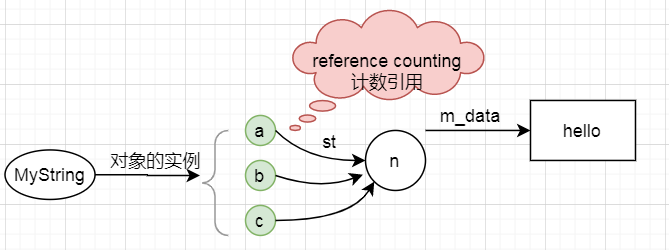

<!--
 * @Author: JohnJeep
 * @Date: 2020-06-15 08:48:16
 * @LastEditTime: 2020-10-29 16:07:06
 * @LastEditors: Please set LastEditors
 * @Description: C++提高部分
 * 
--> 

<!-- TOC -->

- [0.1. class类](#01-class类)
- [0.2. 封装](#02-封装)
- [0.3. 面向对象编程(OOP)](#03-面向对象编程oop)
- [0.4. 复合(composition)](#04-复合composition)
- [0.5. 委托(delegation)](#05-委托delegation)
- [0.6. 继承(Inheritance)](#06-继承inheritance)
  - [0.6.1. 类型兼容原则](#061-类型兼容原则)
  - [0.6.2. 继承中的构造与析构调用原则](#062-继承中的构造与析构调用原则)
  - [0.6.3. 继承中同名成员变量处理方法](#063-继承中同名成员变量处理方法)
  - [0.6.4. 继承与虚函数(virtual function)的结合](#064-继承与虚函数virtual-function的结合)
- [0.7. 多态(polymorphism)](#07-多态polymorphism)
- [0.8. 纯虚函数和抽象类](#08-纯虚函数和抽象类)
- [0.9. 耦合与解耦的概念](#09-耦合与解耦的概念)
- [0.10. 函数模板](#010-函数模板)
- [0.11. 类模板](#011-类模板)
- [0.12. 输入输出流](#012-输入输出流)
- [0.13. STL（Standard Template Library）标准模板库](#013-stlstandard-template-library标准模板库)
  - [0.13.1. Sequence containers(有序容器)](#0131-sequence-containers有序容器)
    - [0.13.1.1. vector（单端的动态数组）](#01311-vector单端的动态数组)
    - [0.13.1.2. deque（双端数组）](#01312-deque双端数组)
    - [0.13.1.3. list（双向链表）](#01313-list双向链表)
  - [0.13.2. Associative containers(关联性容器)](#0132-associative-containers关联性容器)
    - [0.13.2.1. set容器](#01321-set容器)
    - [0.13.2.2. map容器](#01322-map容器)
    - [0.13.2.3. multiset](#01323-multiset)
    - [0.13.2.4. mutimap](#01324-mutimap)
  - [0.13.3. Unordered associative containers(无序关联容器)](#0133-unordered-associative-containers无序关联容器)
    - [0.13.3.1. unordered_set](#01331-unordered_set)
    - [0.13.3.2. unordered_map](#01332-unordered_map)
    - [0.13.3.3. unordered_multisert](#01333-unordered_multisert)
    - [0.13.3.4. unordered_multimap](#01334-unordered_multimap)
  - [0.13.4. Container adaptors(容器适配器)](#0134-container-adaptors容器适配器)
    - [0.13.4.1. stack容器](#01341-stack容器)
    - [0.13.4.2. queue容器](#01342-queue容器)
    - [0.13.4.3. 优先级队列 priority_queue](#01343-优先级队列-priority_queue)
- [0.14. STL常用算法](#014-stl常用算法)

<!-- /TOC -->


## 0.1. class类
- class without pointer members：类中的成员不带有指针。
- class with pointer members：class类中的成员带有指针。


## 0.2. 封装
- 封装了成员数据和常用函数
- 封装了属性和方法。
- `public`  修饰类的成员变量和函数，既能在类的内部使用又能在类的外部使用
- `private` 修饰类的成员变量和函数，只能在类的内部使用，不能在类的外部使用
- `protect` 修饰类的成员变量和函数，只能在 `类的内部` 使用，不能在类的外部使用，可以在继承的子类中使用。    


## 0.3. 面向对象编程(OOP)
- 静态对象（static object）：在作用域（scope）结束后，生命周期还存在，即没有结束，一直到整个程序结束了，它的生命周期也就结束了。
  - 静态的函数没有 `this` pointer，只能去处理静态的数据
    ```
    如何去调用？ 
    1、使用 object 调用。Account a.state(10);
    2、通过 class name 来调用。Account::state(10);
    ```
- 全局对象（global object）：整个程序结束了，它的生命周期也就结束了。

- C++中类与类之间的关系主要归为三大类：复合、委托、继承。

## 0.4. 复合(composition)
- 什么是复合？
  > 每当一个类的对象作为另一个类的成员变量时，就实现了复合。

- 当一个类中包含另一个类时，将其它类的对象作为当前类的成员使用，当前类的成员变量不再是简单的基础类型，而是变为复杂的其它类的对象。

- 复合中的构造与析构
  - 构造（由内而外）：编译器默认先调用当前类中包含的类的默认构造函数，然后再调用当前类的构造函数。
  - 析构（由外而内）：编译器默认先调用调用当前类的析构函数，然后再调用当前类中包含的类的析构函数。


## 0.5. 委托(delegation)
> 委托(delegation)也叫Composition by reference
- 两个类之间通过指针相连。
  ```
  // MyString类指向Stu类

  class MyString
  {
  private:
      Stu* st;       // 采用委托的方式
  public:
      MyString(/* args */) {}
      ~MyString() {}
  };

  class Stu
  {
  private:
      char* m_data;
      int n;
  public:
      Stu(/* args */) {}
      ~Stu() {}
  };
  ```

MyString类对象的三个实例a，b, c 同时共享Stu类中的整数 `n`，指针m_data指向的数据 `hello`。如果实例 `a` 想要修改 `hello` 这个数据，则需要先拷贝一份，然后再修改拷贝的数据，这种实现的方法称为 `copy on write`
<p></p>


## 0.6. 继承(Inheritance)
- 参考
  - [C++：继承访问属性（public/protected/private）](https://www.cnblogs.com/duwenxing/p/7476469.html) 
  - [c++父类和子类的关系](https://blog.csdn.net/limengjuhanxin/article/details/90582443)


- C++中支持多继承的方式。三种继承方式：public、private、protect
- 子类（派生类）可以从父类（基类）继承哪些方法和成员?
  - 数据的继承：子类继承的是父类内存中的数据。
  - 函数的继承：子类继承的是父类的调用权利。
  - 子类不能继承父类中以下的几种的数据
    - 基类的构造函数、析构函数和拷贝构造函数。
    - 基类的重载运算符。
    - 基类的友元函数。


- 如何判断继承中的访问控制权限
  - 看类的调用语句，是在类的内部还是在类的外部？
  - 看子类如何从父类中继承？
  - 看父类的访问级别？ 


- `public继承`  
  - 父类成员在子类中保持原有的访问级别。
  - 类的对象的公共数据成员可以使用直接成员访问运算符 `.` 来访问；但私有的成员和受保护的成员不能使用直接成员访问运算符 `.` 来直接访问。


- `private继承` 
  - 父类成员在子类中的访问级别都变为 `private`


- `protected继承` 
  - 父类中为 `public` 成员属性，在子类中变为 `protected`
  - 父类中为 `private` 成员属性，在子类中为 `private`
  - 父类中为 `protected` 成员属性，在子类中为 `protected`

- public、protect、private三个关键字的访问范围
  - public: 能被类成员函数、子类函数、友元访问，也能被类的对象访问。
  - private: 只能被类成员函数及友元访问，不能被其他任何访问，本身的类对象也不行。
  - protected: 只能被类成员函数、子类函数及友元访问，不能被其它任何的数据访问，本身的类对象也不行。  
    - 为什么要引入 protected 访问权限？
      > 引入保护成员的理由是：基类的成员本来就是派生类的成员，对于那些隐藏的、不宜设为公有的，但又确实需要在派生类的成员函数中经常访问的基类成员，则将它们设置为protected成员，既能起到隐藏的目的，又避免了派生类成员函数要访问它们时只能间接访问所带来的麻烦。 
    - 子类（派生类）的成员函数只能访问所作用的那个对象（即this指针指向的对象）的基类保护成员，不能访问其他父类（基类）对象的父类保护成员。  
      > 类的对象只能调用其public部分的成员，而不能调用protected和private部分的成员。


### 0.6.1. 类型兼容原则
- 子类是特殊的父类。
- 基类(base)的指针或引用 `直接指向` 子类(derived)的对象。
  - 指针做函数参数
    ```
    class Parent
    {}

    class Child
    {}

    Parent *p1 = NUll;
    Child c1;
    p = &c1;     // 父类的指针直接指向子类的对象
    ```
  - 引用做函数参数
- 子类对象直接`初始化` 父类对象。
- 子类对象直接 `赋值` 给父类对象。
- 子类对象可以 `当做父类对象使用`。


### 0.6.2. 继承中的构造与析构调用原则
- 内存角度探讨调用原则
  - 构造：由内而外。先调用base(父类)的默认构造函数，然后才执行自己。
  - 析造：由外而内。先执行自己，然后再调用 base(父类)的析构函数。


### 0.6.3. 继承中同名成员变量处理方法
- 子类与父类中的成员变量和成员函数有相同的名称时，采用作用域的方式调用。
```
class Parent
{
public:
    int m;
    void shoe();
}

class child
{
public:
    int m;
    void shoe();
}

Parent p1;
Child c1;

// 调用
p1.Parent::m = 100;
c1.Child::m = 200;
p1.Parent::shoe();
c1.Child::shoe();
```

### 0.6.4. 继承与虚函数(virtual function)的结合
- 为什么会有虚继承
  - 解决多个继承可能产生的二义性。 
  - 二义性：若果一个派生类（子类）由多个基类（父类）继承，这些基类都有一个共同的基类，则在对该基类中声明的变量进行访问时，可能会出现二义性。

- 为什么要用虚函数
  - 相同接口，实现不同功能。
  - 虚函数是动态生成的，普通成员函数是静态生成的。  


- non-virtual: 不希望子类（derived）重写
- virtual: 希望子类重写（override）父类，父类已有默认值
- pure-virtual: 子类（derived）中必须重写(override)父类，父类没有默认值。


## 0.7. 多态(polymorphism)
- 根据实际的对象类型决定函数调用语句的具体调用目标。
  - 父类指针指向父类的对象，则调用父类中定义的函数 
  - 父类指针指向子类的对象，则调用子类中定义的函数 

- 多态实现的效果
  - 同一种调用语句，有多种表现形态。

- 实现多态的三个条件
  - 要有继承
  - 子类中有虚函数重写
  - 父类指针或引用指向子类的对象。

- 链编：一个程序模块，代码之间相互关联的过程。
  - 静态链编：程序的匹配、链接的过程在编译阶段中实现。重载函数使用的是静态链编。
  - 动态链编：程序的匹配、链接的过程在运行时实现。switch、if语句都是采用的动态链编。


- 虚析构函数
  - 为什么要虚析构函数？
    - 通过父类指针将子类的所有资源都释放，即把子类的所有析构函数都执行一遍。
  - 函数格式
    ```
    virtual ~People()
    {}
    ```

- 多态的内部原理探究
  - 当类中声明虚函数时，编译器自动创建了一个虚函数表，每个类的对象都有一个虚函数表。
  - 虚函数表：存储多个虚函数的开始地址。
  - 虚函数表由编译器自动创建于维护。
  - 有 virtual 关键字的成员函数会被编译器放入虚函数表中。
  - 存在虚函数时，在用类实例化一个对象时，C++编译器会在类的对象中添加一个 `vptr` 指针，每个对象中都有一个指向虚函数表的 `vptr` 指针。
  - 通过虚函数表指针 `vptr` 调用重写函数是在程序运行时进行的，需要通过寻址操作才能确定该调用哪个函数。
  - 虚函数的效率比普通成员的效率要低。

- 构造函数中调用虚函数


- 多态是实现框架的基础。在使用框架结构去设计程序的时候，常常使用 `Template Method` 和设计模式去实现。


## 0.8. 纯虚函数和抽象类
- 纯虚函数
  ```
  // 语法
  virtual int func() = 0;
  ```
- 含有纯虚函数的类叫抽象类。在父类中只定义一套通用的接口，在子类中去实现。
  ```
  // 抽象类
  class People
  {
  private:
    ....
  public:
    ....
  
  virtual int func(int a) = 0;
  }
  ```
- 虚函数注意点
  - 静态函数没有虚函数，内联函数不可能是虚函数，构造函数不能是虚函数。
  - 抽象类不能实例化对象，可以声明抽象类的指针。
  - 抽象类不能作为函数的参数类型。 `void fg(People)  // error, People为抽象类`
  - 抽象类不能作为函数返回的类型。`People eat();  // error，People为抽象类`
  - 抽象类可以声明类的引用。`People& run(People&); // People为抽象类`
- 继承与虚函数在工程中的应用
  - 由于多继承的二义性，很少使用多继承，一般采用单继承。
  - C++ 中没有真正的类似Java中接口的方法，但可以使用虚继承来模拟接口的方法。
  - 虚继承中可以使用多继承的方式，来实现复杂的业务。


## 0.9. 耦合与解耦的概念
- C++中采用抽象类，提前布局 `vptr` 指针，虚函数表，调用动态链编，实现与第三方产品的解耦合。
- 动态库-----函数的首地址----调用函数指针----调用函数
- 常常采用函数指针将任务的调用者与任务的实现者进行分开，两者互不依赖。  


## 0.10. 函数模板
- 语法
  ```
  // 声明
  template <typename T>
  void func(T a, T b)

  func<int>(x, y);      // 显示调用
  func(x, y);           // 调用时自动类型推导
  ```

- 两种方式调用
  - 显示类型调用
  - 自动类型推导

- 函数模板与函数重载
  - 函数模板的调用严格按照类型进行匹配，不会进行类型的自动转换。
  - `普通函数` 的调用可以进行 `隐式` 的类型转换。
  - 调用规则
    - 函数模板与普通函数都符合调用时，C++编译器优先考虑普通函数
    - 函数模板可以像普通函数一样被重载。
    - 若函数模板可以产生一个更好的匹配，那么选择模板
    - 通过空模板 `<>` 实参数列表的语法限定编译器只通过模板匹配。

- 函数模板调用的机制
  - 编译器并不是把函数模板处理成能够匹配任意类型的函数，而是根据函数模板中的具体类型产生不同的函数。
  - 编译器会对 `函数模板进行两次编译`。`第一次在声明`的地方对模板进行编译，`第二次在调用` 的地方对将参数替换后的代码进行编译。

- 函数模板当函数参数与函数指针当函数参数类似。 


## 0.11. 类模板
- 为什么要使用类模板？
  - 让 `算法` 和 `数据类型` 进行各自的分离。 

- 单个类中的类模板
  - 模板类型参数化  
- 继承中的类模板
  - 从模板类派生普通的类时，需要具体化模板类（即指定类的参数类型），C++编译器需要知道父类的数据类型具体是怎样的。 
  - 类模板可以派生 `类模板`


## 0.12. 输入输出流
- 输入流 `cin`
  - `getline()` 终端输入缓冲区中时可以输入 `空格`。
  - `ignore()` 忽略缓冲区指定的数据
  - `peek()` 读缓冲区的数据，若有数据，则读出缓冲区的一个数据；没有数据，则读出无数据。
  - `putback()`

- 输出流 `cout`
  - `flush()` 刷新缓冲区的数据
  - `put()` 将字符一个一个地输出到标准输出上
  - `write()`
  - `width()`
  - `fill()`

- 文件IO流
  - `ofstream`建立一个输出流对象，将数据输出到指定文件中。
  - `ifstream` 建立一个输入流对象，将从文件中读到的数据输出到终端上。


## 0.13. STL（Standard Template Library）标准模板库
- 广义分类
  - 算法（Algorithm）
  - 容器（Container）
  - 迭代器（Iterator）：相当于一个指针
  - 仿函数（Function object）
  - 适配器（Adaptor）
  - 空间适配器（Alloctor） 
- STL的核心思想：算法和数据结构的实现是分离的。

- 常用的容器
  - Vector(向量)
  - Deque(双队列)
  - List(链表)
  - Map/Multimap(映射/多重映射)
  - Set/Multiset(集合/多重集合)
  <p align="center">
    
  </p>

- STL标准库中的容器内存储的元素都必须能够拷贝，C++编译器默认提供的是浅拷贝，程序在执行时，会出现问题。因此需要重写构造函数和重载 `=` 操作运算符，执行深拷贝。


### 0.13.1. Sequence containers(有序容器)

#### 0.13.1.1. vector（单端的动态数组）
- 动态数组实现机制：
  > 先为数组开辟较小的空间，然后往数组里面添加数据，当数据的数目超过数组的容量时，再重新分配一块更大的空间（STL中 `vector` 每次扩容时，新的容量都是前一次的两倍），再把之前的数据复制到新的数组中，再把之前的内存释放。
  - 注意：使用动态数组时，尽量减少改变数组容量大小的次数，可以减少时间性能的消耗。
- 动态数组，在运行阶段执行。
- 向容器中插入元素时，内部的元素必须能够执行 `拷贝（必须提供拷贝构造）` 操作。
- `vector` 支持随机迭代访问器。

- 模板：`template <typename T> void Show(T arrNum[], int len);`
- 函数接口
  - `size()`: 返回容器中元素的个数
  - `get(r)`: 获取秩（索引）为r的元素
  - `put(r, e)`: 用e替换秩为r元素的数值
  - `insert(r, e)`: 向秩为r的元素处插入数值e，后面元素依次后移
  - `remove(r)`: 初除秩为 `r` 的元素，返回全元素中原存放的对象
  - `disordered()`: 判断所有元素是否已按升序序排列
  - `sort()`: 调整各元素癿位置，使按照升序序排列
  - `deduplicate()`: 删除重复元素   ---向量
  - `uniquify()`: 删除重复元素 ---有序向量
  - `traverse()`: 遍历向量幵统一处理所有元素，处理斱法由函数对象指定
  - `empty()`: 判断容器是否为空
  - `at(index)`: 返回索引为index的元素
  - `erase(p)`: 删除p位置处的元素
  - `erase(beg, end)`:删除区间`[beg, end)`的数据
  - `pop_back()`: 删除最后一个元素
  - `push_back()`: 在容器末尾插入一个元素
  - `back()`: 获取尾部元素
  - `front()`: 获取首部元素
  - `begin(), end()`: 返回容器首尾元素的迭代器
  - `clear()`: 移除容器中所有的元素
  - `swap()`: 交换两个容器的内容


#### 0.13.1.2. deque（双端数组）
- 与 `vector` 容器类似，但是可以在 `Deque` 的两端进行操作。
- `push_back()`: 在容器末尾插入一个元素
- `push_front()` 容器头部插入一个元素
- `pop_front()`: 容器头部删除一个元素
- `pop_back()`: 删除最后一个元素


#### 0.13.1.3. list（双向链表）
- 是一个双向链表的容器，可以高效的进行插入和删除元素。
- 不支持随机存储元素，即不支持 `at.(pos)` 函数和 `[]` 操作符。
- 链表的插入操作：在 pos 位置插入新的节点，新插入的数据存放在 pos 位置之前。
- list 的删除
  - `clear()` 移除容器中所有的数据
  - `erase(begin, end)` 删除区间 `[begin, end)` 的数据，返回下一个元素的位置。
  - `erase(pos)` 删除指定 pos 位置的数据，返回下一个元素的位置。
  - `remove(element)` 删除容器中所有与 element 值匹配的数据。 


### 0.13.2. Associative containers(关联性容器)

#### 0.13.2.1. set容器
- set 是一个 `集合` 容器，包含的元素是唯一的，集合中的元素按照一定的顺序排列，不能随意指定位置插入元素。
- set 底层采用红黑树的数据结构实现的。
- set 支持唯一的键值，容器里面的元素值只能出现一次，而 `multiset` 集合容器中同一个元素值可以出现多次。
- 不可以直接修改 set和multiset集合容器中元素的值，因为集合容器是自动排序的。修改集合容器中元素的值，必须先删除原先元素的值，再插入新元素的值。


- 仿函数（伪函数）
  - 在 `struct` 结构体中定义新的函数。 

- `insert()` 函数的返回值类型为 `pair<iterator, bool>`，结果是一对数据类型。
  ```
  pair<T1, T2> 存放两个不同类型的数值
  ```

- set 容器中的查找
  - `find()` 返回查找元素的迭代器，查找的元素默认是区分大小写的。
  - `count()` 返回容器中查找元素的个数
  - `upper_bound` 返回容器中大于查找元素的迭代器位置
  - `lower_bound` 返回容器中小于查找元素的迭代器位置
  - `equal_range(ele)`返回容器中等于查找元素的两个上下限的迭代器位置（第一个：大于等于ele元素的位置，第二个：大于 ele元素的位置）


#### 0.13.2.2. map容器
- map 是关联式容器，一个 map 就是一个键值对。map 中的 `key` 值唯一，容器中的元素按照一定的顺序排列，不能在任意指定的位置插入元素。
- map 的底层原理是按照平衡二叉树的数据结构来实现的，在插入和删除的操作上比 `vector` 容器快。
- map 支持唯一的键值，每个 `key` 只能出现一次，支持 `[]` 操作，形如：`map[key] = value`。 `multimap` 不支持唯一的键值，容器中的每个 `key` 可以出现相同的多次，不支持 `[]` 操作。

```
  // 四种map容器的插入方法
  map<int, string> mp;
  mp.insert(pair<int, string>(101, "赵云"));                   // 法一
  mp.insert(make_pair<int, string>(102, "关羽"));              // 法二
  mp.insert(map<int, string>::value_type(103, "曹操"));        // 发三
  mp[104] = "张飞";                                            // 法四

  // 方法一到方法三向容器中插入相同的键值时，不会插入成功。
  // 采用法四向容器中插入相同的键值时，会覆盖原先相同键值的数据。

```
- map的查找操作需要做异常判断处理


#### 0.13.2.3. multiset
collection of keys, sorted by keys


#### 0.13.2.4. mutimap
collection of key-value pairs, sorted by keys


### 0.13.3. Unordered associative containers(无序关联容器)


#### 0.13.3.1. unordered_set
- `unordered_set` 是一种无序的容器集合。底层采用哈希表实现的。
- STL无序容器存储状态，hash表存储结构图
  <p align="center">
    
  </p>
  
-  `unordered_set` 模板类中的定义
  ```
    template<typename _Value,                        // 容器中存储元素的类型
            typename _Hash = hash<_Value>,           // 确定元素存储位置的哈希函数
            typename _Pred = std::equal_to<_Value>,  // 判断各个元素是否相等
            typename _Alloc = std::allocator<_Value>, // 指定分配器对象的类型
            typename _Tr = __uset_traits<__cache_default<_Value, _Hash>::value>>
  ```

- 注意：此容器模板类中没有重载 `[ ]` 运算符，也没有提供 `at()` 成员方法，`unordered_set` 容器内部存储的元素值不能被修改，可以使用迭代器遍历容器中的数，但不能修改容器中元素的值。


#### 0.13.3.2. unordered_map


#### 0.13.3.3. unordered_multisert


#### 0.13.3.4. unordered_multimap


### 0.13.4. Container adaptors(容器适配器)
容器适配器为有序的容器提供了不同的接口。

#### 0.13.4.1. stack容器
- `push()` 入栈
- `pop()` 出栈
- `top()` 获取栈顶元素
- `size()` 获取栈大小
- `empty()` 栈为空


#### 0.13.4.2. queue容器
- `push()` 入队列
- `pop()` 出队列
- `empty()` 对列为空
- `front()` 队列头部元素


#### 0.13.4.3. 优先级队列 priority_queue
```
// 最大或最小优先级队列变量的声明 

priority_queue<int> g_priq;                            // 默认为最大值优先队列
priority_queue<int, vector<int>, greater<int>> l_priq; // 最小值优先队列
```


## 0.14. STL常用算法
- 函数对象: 需要重载 `()` 操作运算符。函数对象调用与 `回调函数` 的调用类似。
- 分类
  - 预定义函数对象：标准STL模板库中提前预定义了很多的函数对象。
  - 用户自定义的函数对象 

- 函数对象调用
  - 函数对象可以做函数参数。 
  - 函数对象可以做返回值。 
  ```
  clss Stu
  {
    private:
    public:
      void operator() (Stu& T) {}
  }
  ``` 

- 函数适配器
  - 绑定适配器（bind adaptor）
  - 组合适配器（composite adaptor）
  - 指针适配器（pointer adaptor）
  - 成员函数适配器（member function adaptor） 

- STL算法的核心思想
  - STL通过类模板技术，实现了数据类型与容器模型的分离。
  - 通过函数对象实现了自定义数据类型与底层算法的分离。
  - 通过迭代器的方式统一的去遍历容器，向容器中读数据和写数据。


- `for_each()` 遍历容器中的所有元素。
- `transform()` 将容器中的数据进行某种转换的运算。
- 两个算法的区别
  - `for_each()` 使用的函数对象可以没有 `返回值`，参数一般传 `reference`，因此速度较快，不是很灵活。
  - `transform()` 使用的函数对象必须要有 `返回值`，参数一般传 `value`，因此速度较慢，但是很灵活。


- `adjacent()` 查找一对相邻位置重复的元素，找到则返回指向这对元素的第一个元素的迭代器值。
- `distance()` 迭代器下标的位置。
- `binary_search()` 采用二分法在有序序列中查找 value，找到则返回 true。在无序的序列中不能使用。
- `count()` 计数容器中指定元素的个数。
- `count_if()` 使用 `谓词` 计数容器中指定条件元素的个数。
- `find()` 
- `find_if()` 
- `merge()`  合并两个有序的序列，并存放到另一个序列中。
- `sort()` 默认按照升序的方式重新排列指定范围内元素的元素。
- `random_shuffle()` 对指定范围内的元素随机进行排序。
- `reverse()` 对指定范围内的元素进行倒叙排序。
- `copy()` 将一个容器中的元素值拷贝到另一个容器中
- `replace()` 将指定范围内的 `oldValue` 替换为 `newValue`
- `replace_if()` 将指定范围内的 `oldValue` 替换为 `newValue`，需要指定 `函数对象`（是自定义的函数对象或STL预定义的函数对象）。
- `swap()`  交换两个容器
- `accumulate()` 累加遍历容器中指定范围内的元素，并在结果上加一个指定的值。


- 堆（heap）的STL库中函数
  - `make_heap(first, last, comp);` 建立一个空堆；
  - `push_heap(first, last, comp);` 向堆中插入一个新元素；
  - `top_heap(first, last, comp); ` 获取当前堆顶元素的值；
  - `sort_heap(first, last, comp);` 对当前堆进行排序；


- `stable_partition()`函数
- `upper_bound()` 函数
- `lower_bound()` 函数
