<!--
 * @Author: JohnJeep
 * @Date: 2021-01-10 18:21:43
 * @LastEditors: JohnJeep
 * @LastEditTime: 2022-07-13 23:55:17
 * @Description: C++ 语言不同标准新特性学习
 * Copyright (c) 2022 by JohnJeep, All Rights Reserved. 
-->

<!-- TOC -->

- [1. C++11 新特性](#1-c11-新特性)
  - [1.1. Template of  Space](#11-template-of--space)
  - [1.2. Initializer lists](#12-initializer-lists)
  - [1.3. nullptr](#13-nullptr)
  - [1.4. range based for statement](#14-range-based-for-statement)
  - [1.5. Lambda](#15-lambda)
  - [1.6. decltype](#16-decltype)
  - [1.7. explicit](#17-explicit)
  - [1.8. auto](#18-auto)
  - [1.9. noexcept](#19-noexcept)
  - [1.10. constexpr](#110-constexpr)
  - [1.11. override](#111-override)
  - [1.12. final](#112-final)
  - [1.13. New Function Declaration Syntax](#113-new-function-declaration-syntax)
  - [1.14. Scoped Enumerations](#114-scoped-enumerations)
  - [1.15. New Template Features](#115-new-template-features)
    - [1.15.1. **variadic templates**](#1151-variadic-templates)
    - [1.15.2. Alias Templates (Template Typedef)](#1152-alias-templates-template-typedef)
    - [1.15.3. Type Alias](#1153-type-alias)
    - [1.15.4. Function template](#1154-function-template)
  - [1.16. using](#116-using)
  - [1.17. Move Semantics and Rvalue References](#117-move-semantics-and-rvalue-references)
  - [1.18. =delete && =default](#118-delete--default)
  - [1.19. Chrono](#119-chrono)
    - [1.19.1. duration](#1191-duration)
    - [1.19.2. timepoint and clock](#1192-timepoint-and-clock)
- [2. C++14 新特性](#2-c14-新特性)
- [3. C++17 新特性](#3-c17-新特性)
- [4. C++20 新特性](#4-c20-新特性)
  - [4.1. Coroutine](#41-coroutine)

<!-- /TOC -->

C++ 新特性演化整体概览。


# 1. C++11 新特性

## 1.1. Template of  Space

在 C++11之后，对一些语法做了一些优化(Important Minor Syntax Cleanups)。比如，优化了 template（模板）中的尖括号的问题，中间是否需要加空格。

```cpp
vector<list<int> > ;  // C+11之前版本，必须要加一个空格，否则编译器会报错
vector<list<int>> ;   // C++11之后，不用加空格，语法得到了优化
```

## 1.2. Initializer lists

C++11 引入了初值列 (initializer list) 和一致性初始化 (Uniform Initialization)。即采用 `{}` 去初始化需要初始化的参数，引入新特的同时也兼容原版本的 `()` 初始化操作。

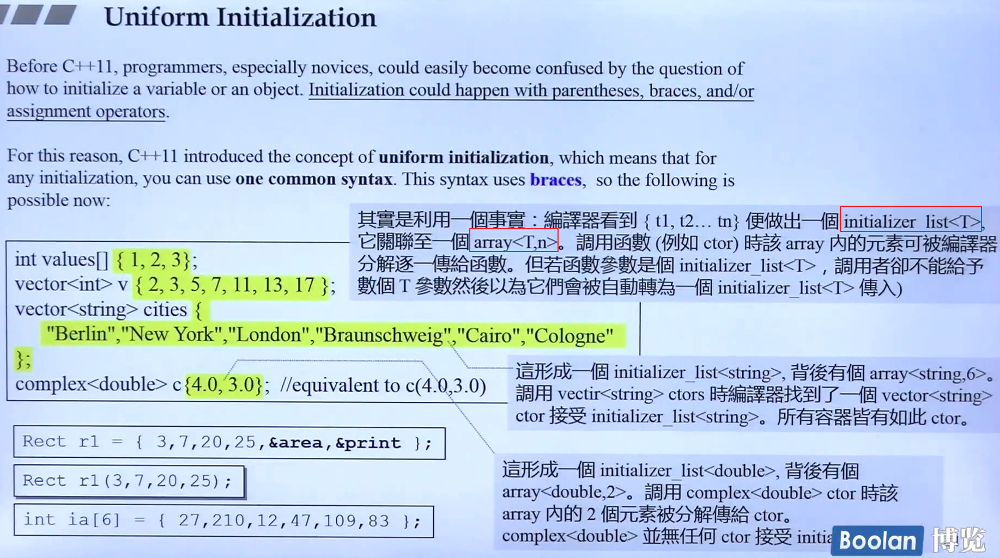

`initializer list` 的底层是采用 `initializer_list<T>` 这个类模板实现的，其中这个类模板下层采用 `array<T, n>` 的方式去实现的。

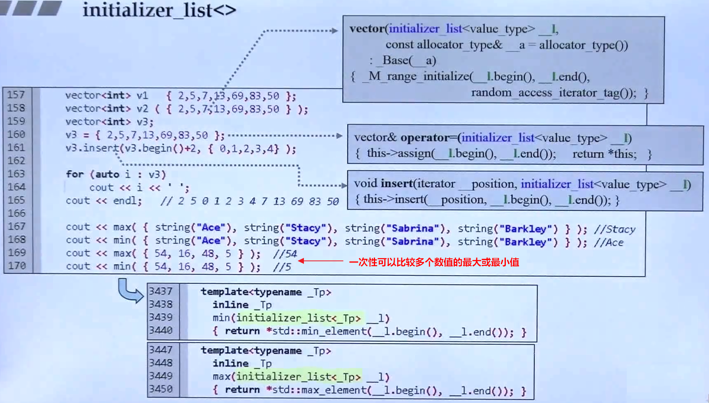

`初值列` 赋值是在对象创建成功之前完成的，而 `函数体内赋值` 是你的对象成员都已经创建好后再对成员进行赋值。`初值列` 是在带参构造函数的函数体外面，第一行进行初始化。

- 初值列初始化语法
  
  ```cpp
  //  将成员变量设置为 m_re=re, m_im=im
  class Stu(int re, int im)
    : m_re(re), m_im(im)
  {
  public:
        ...
  private:
    int m_re;
    int m_im;  
  };
  ```

- 这种初始化并不是必须的，但是在以下几种情况时是必须进行初始化的
  
  - 成员是 `const` 类型。
  - 成员是`引用类型`。
  - 有一个成员是类型的对象（不是默认的构造函数）。

> 初始化列表的顺序并不限定初始化的执行顺序，成员的初始化顺序是与类中定义的顺序保持一致。最好让构造函数初始值的顺序与成员声明的顺序保持一致。

## 1.3. nullptr

C++11 开始让你使用 `nullptr` 关键字去替代老版本中 `0 或 NULL` 的值。`nullptr` 不是整型也不是一个指针类型，你可以把它认为是**所有**类型的指针。它表示一个指针指向的值是没有值的，这个特性可以避免当一个 `NULL` 指针被当做一个整型解释时，程序产生的错误。

`nullptr` 的真正的类型是 `std::nullptr_t`，位于标准库的 `<stddef.h>` 头文件中。在源码中，`std::nullptr_t` 被重定义（define）为 `nullptr`。因此`std::nullptr_t` 可以隐式转换为任意的原生指针（raw pointer）类型，这也是为什么 `nullptr` 表现得像所有类型的指针。

标准库中源码实现

```cpp
#if defined(__cplusplus) && __cplusplus >= 201103L
#ifndef _GXX_NULLPTR_T
#define _GXX_NULLPTR_T
typedef decltype(nullptr) nullptr_t;
#endif
#endif /* C++11.  */
```

推荐优先考虑 `nullptr` 而非 `0` 和 `NULL` 的原因

- 如果 C++ 发现在当前上下文只能使用指针，它会很不情愿地把 `0` 解释为指针（pointer），但那是最后的办法。一般情况下，C++ 的解析策略是把 `0` 看做 `int` 而非指针类型，把 `NULL` 解析成 `integral(int 或 long 类型)`，而非指针类型。

- 避免函数重载（overload）解析产生的歧义。若使用 `nullptr` 替代 `0` 或 `NULL` 可以避免函数重载解析时一些意想不到的问题。
  
  在 C++98 中，对指针类型和整型进行函数重载可能会导致意想不到的错误。比如下面的代码，函数重载中传递参数 `0` 或 `NULL`，调用时，前两种重载的函数会调用，但不会调用指针版本的重载函数。
  
  ```cpp
  // 三个重载函数 f()
  void f(int);      
  void f(bool);
  void f(void*);
  
  f(0);               // 调用 f(int) 重载函数而不是 f(void*)
  
  f(NULL);            // 可能不会被编译，一般来说调用f(int)，
                      // 绝对不会调用 f(void*) 重载函数
  ```
  
  `f(NULL)` 函数调用的不确定行为是因为参数 `NULL` 的实现不同造成的。若 `NULL` 被定义为 `0` ，其类型为 `long` 时，函数调用是有歧义的。因为从 `long` 转化为 `int`，`long` 转化为 `bool` 和 `0` 转化为 `void*` ，都要进行类型转化。代码中认为调用 `f(NULL)` 函数，传递的参数就是 `null` 指针，而实际上调用 `f(NULL)` 函数，传递的参数是 `integral`，并不是 `null` 指针。由于这种违反直觉的行为，导致以 C++98 风格编写代码的程序员，要避免函数重载时，传指针和整型的情形。
  
  调用时，若函数传递的参数为 `nullptr`，将会调用 `void*` 版本的重载函数，因为 `nullptr` 不能被看做任何的整形。
  
  ```cpp
  f(nullptr); // calls f(void*) overload
  ```

- 特别是与 `auto` 声明的变量一起使用时，使代码表意更明确。
  
  比如：你在代码库中遇到了这样的代码
  
  ```cpp
  auto result = findRecord( /* arguments */ );
  if (result == 0) {
      ...
  } 
  ```
  
  如果你不知道 `findRecord` 函数返回类型是什么，那么你也许不清楚 `result` 是一个指针类型还是一个整型。毕竟 `0` 也可以解析为 指针类型或整型，容易引发歧义。
  
  若将 `0` 替换为 `nullptr` 后，函数返回的结果不会产生歧义（ambiguity），因为 `result` 的类型一定为指针类型。
  
  ```cpp
  auto result = findRecord( /* arguments */ );
  if (result == nullptr) {
      ...
  } 
  ```

- 模板类型推导将 `0` 和 `NULL` 推导为一个错误的类型（即它们的实际类型，而不是作为空指针的隐含意义），这就导致在当你想要一个空指针时，它们的替代品`nullptr`很吸引人。
  
  假如你有一些函数只能被合适的已上锁的 `mutex` 调用，且每个函数的形参都是指针类型。
  
  ```cpp
  // 只能被以上锁合适的 mutex 调用
  int f1(std::shared_ptr<Widget> spw); 
  double f2(std::unique_ptr<Widget> upw); 
  bool f3(Widget* pw); 
  ```
  
  调用代码传递的是 `null` 指针
  
  ```cpp
  std::mutex f1m, f2m, f3m; // mutexes for f1, f2, and f3
  
  using MuxGuard = // C++11 typedef; see Item 9
  std::lock_guard<std::mutex>;
      … 
  
  {
      MuxGuard g(f1m);     // lock mutex for f1
      auto result = f1(0); // pass 0 as null ptr to f1
  }                        // unlock mutex
  
  … 
  
  {
      MuxGuard g(f2m);        // lock mutex for f2
      auto result = f2(NULL); // pass NULL as null ptr to f2
  }                           // unlock mutex
  
  … 
  
  {
      MuxGuard g(f3m);           // lock mutex for f3
      auto result = f3(nullptr); // pass nullptr as null ptr to f3
  }                              // unlock mutex
  ```
  
  上面的代码中，前两个的调用没有使用 `nullptr`，但代码可以正常工作。但是代码中有重复的调用，会多次执行 `lock mutex, call function, unlock mutex` 这些步骤，让代码很臃肿。模板的使用会减少代码量，上面的代码很臃肿，因此可用模板来执行上面的流程。
  
  ```cpp
  template<typename FuncType,
           typename MuxType,
           typename PtrType>
  auto lockAndCall(FuncType func,                 
                   MuxType& mutex,                 
                   PtrType ptr) -> decltype(func(ptr))
  {
      MuxGuard g(mutex);  
      return func(ptr); 
  }
  ```
  
  调用 `lockAndCall` 模板函数可用下面的代码
  
  ```cpp
  auto result1 = lockAndCall(f1, f1m, 0);         // error!
  ...
  auto result2 = lockAndCall(f2, f2m, NULL);      // error!
  ...
  auto result3 = lockAndCall(f3, f3m, nullptr);   // fine
  ```
  
  代码中的前两个是不能通过编译的。第一个调用的问题是：当 `0` 被传递给 `lockAndCall` 模板函数时，模板类型推导会尝试去推导实参类型，将 `lockAndCall` 模板函数的 `ptr` 形参被推导为 `int` 类型。与 `f1` 函数期待的 `std::shared_ptr<Widget>` 类型不符。因为传递 `0` 给`lockAndCall` 模板函数本来想表示空指针，但  `f1` 函数得到的却是 `int` 类型。把 `int` 类型看做 `std::shared_ptr<Widget>` 类型传递给 `f1` 函数，编译时会产生类型错误（type error）。
  
  第二个调用的问题是：当 `NULL` 被传递给 `lockAndCall` 模板函数时，形参 `ptr` 被推导为整型（integral）。即当形参 `ptr` 的类型为 `int` 或者类似 `int` 的类型时，传递给  `f2` 函数的时候就会发生类型错误（type error），因为 `f2` 函数期待的是 `std::unique_ptr<Widget>` 类型。
  
  第三个调用是没有问题的。当 `nullptr` 传给 `lockAndCall` 模板函数时，形参 `ptr` 被推导为 `std::nullptr_t` 类型。当 `ptr` 被传递给 `f3` 函数时，隐式的将 `std::nullptr_t` 转换为 `Widget` 类型，因为 `std::nullptr_t` 可以隐式转换为任何指针类型。

**准则**

- 优先考虑 `nullptr` 而非 `0` 和 `NULL`
- 避免重载指针和整型

## 1.4. range based for statement

引入了一种崭新的 `for` 循环：逐一迭代给定的某个区间、数组、集合、表达式、初始值列表内的每一个元素。

```cpp
for (auto& i : {1, 3, 5, 7})   // 注意: {} 表示是一个容器，初始值列表
{
    cout << i << endl;
}
```

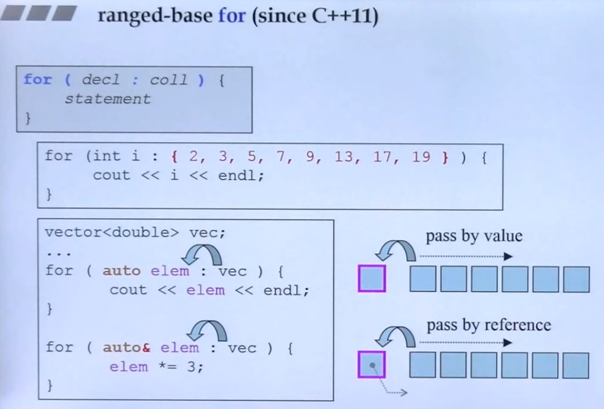

## 1.5. Lambda

Lambda 表达式是现代 C++ 中最重要的特性之一，而 Lambda 表达式，实际上就是提供了一个类似匿名函数的特性， 而匿名函数则是在需要一个函数，但是又不想费力去命名一个函数的情况下去使用的。这样的场景其实有很多很多， 所以匿名函数几乎是现代编程语言的标配。

lambda 表达式是 C++11新引进的一种新特性，允许内联函数的定义（inline functionality）作为 `parameter（参数）` 或者 `local object（局部对象）`，它改变了 C++ 标准库使用的方式。

lambda 是一份功能性的定义，定义在语句（statement）和表达式（expression）中，可以使用 lambda 作为内联函数。

基本语法

```cpp
[捕获列表](参数列表) mutable(可选) 异常属性 -> 返回类型 {
// 函数体
}
```

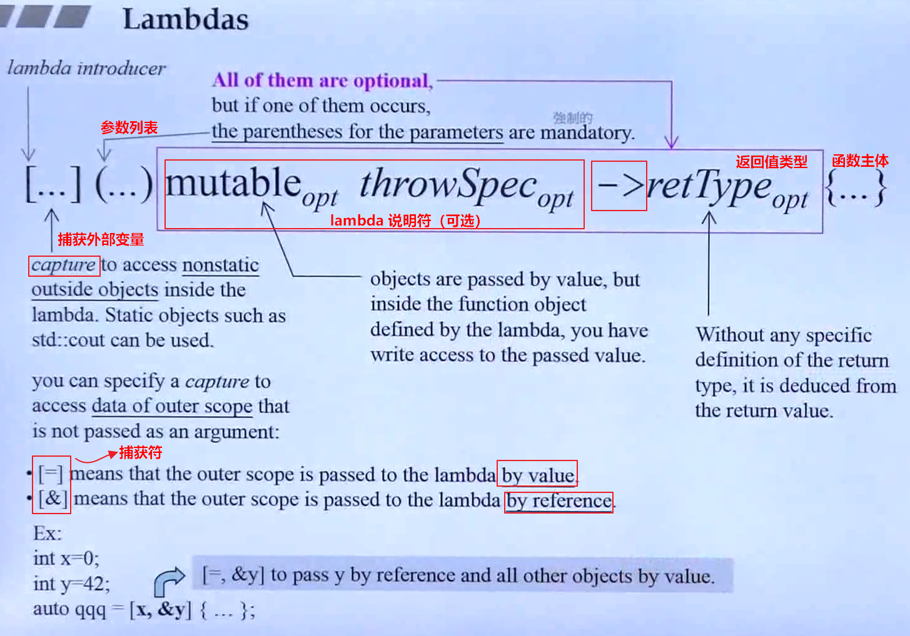

上面的语法规则除了 `[捕获列表]` 内的东西外，其他部分都很好理解，只是一般函数的函数名被略去， 返回值使用了一个 `->` 的形式进行。

所谓捕获列表，其实可以理解为参数的一种类型，lambda 表达式内部函数体在默认情况下是不能够使用函数体外部的变量的， 这时候捕获列表可以起到传递外部数据的作用。根据传递的行为，捕获列表也分为以下几种：

- `[=]`: 以传值的方式捕获外部作用域之外的所有变量，若 lambda 中有被定义的内容时。不能修改外部作用域中的数据，只有 read 的权限。

- `[&]`: 以传引用的方式捕获外部作用域之外的所有变量，若 lambda 中有被定义的内容时，可以修改外部作用域中的数据，具有 write 的权限。
  
  ```cpp
    int x = 100;
    int y = 200;
  
    auto val = [x, &y](){
        cout << "x: " << x << endl;
        cout << "y: " << y << endl;
        ++y;
    };
    // 当前 x，y 分别捕获的值是 100，200
    x = y = 300;
  
    // 当前 x，y 分别捕获的值是 100，300，
    // 当 x 为值传递，外部值的改变不会改变 lambda 中原先以捕获的值，其中 x 原来捕获的值为 x=100
    val();
    val();
    cout << "final y: " << y << endl
  
    // 输出结果为： 
    x: 100
    y: 300
    x: 100
    y: 301
    final y: 302
  ```

- []：表示不捕获任何外部变量
- [this]：捕获外部的this指针
- [=，&a]：以传值的方式捕获外部的所有变量，但是a变量以传引用的方式捕获
- [a，b]：以传值的方式捕获外部变量a和b
- [a, &b]：a以传值方式捕获，b以传引用的方式捕获

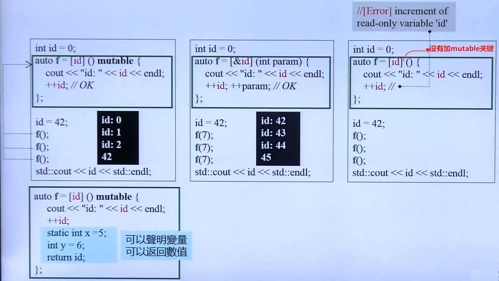

当 lambda 说明中有 mutable 关键字修饰时，表明在 lambda 中可以改变捕获的值。上图中的第一个案例表明，开始时捕获的 id=0, 当运行至 `id=42` 这一行时，由于是按照 值传递，且 lambda 还没有执行，因此，lambda 中的 id 捕获的还是为 0 ，当执行 lambda 后，id 值每次++，改变了 lambda 表达式中捕获的内容。  

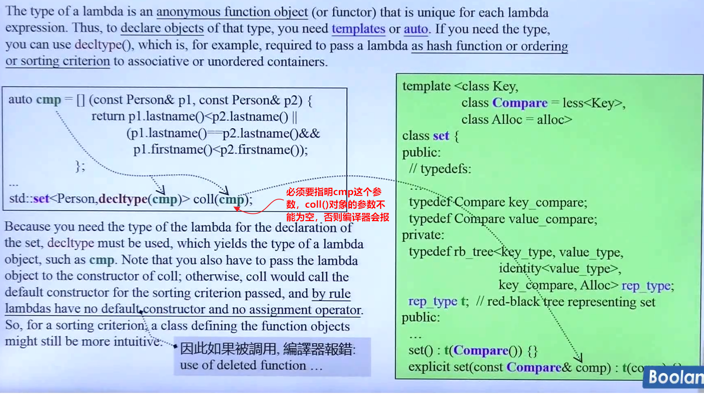

<font color=red> 注意：</font>

- lambda 没有默认的构造和赋值操作函数（ `default constructor` 和 `assignment operator`）。
- 捕获变量中没有加 `=` 或 `&`时，编译器默认按照是值传递 `=`；在捕获变量时，一边建议使用 传引用，而非传值。

优点

-  C++ 编译器对 lambda 的优化效果高于普通的函数。

缺点

- 根据 C++ 语言规定，lambda 没有默认的构造函数，也没有 assignment 操作符。

## 1.6. decltype

decltype 是C++11 增加的一个关键字，作为类型推导，操作过程是在编译时进行的。 

decltype 通常有以下几种用法：

- 常常与 `typdef/using` 关键字结合起来使用。

- 可以处理匿名的类型。比如：`union`, `struct `结构中出现的匿名数据，可以使用这个来解决。

- **最重要的一个作用：推导函数的返回类型(used to declare return types)。**
  
  ```cpp
  template<typename T1, typename T2>
  auto add(T1 + T2)->decltype(x + y);   // 自动推导 x + y 结果的返回类型
  ```

- 元编程中使用(use it in metaprogramming)
  
  ```cpp
  template<typename T1, typename T2>
  struct common_type<T1, T2> {
  typedef decltype(true ? declval<T1>() : declval<T2>()) type;
  };
  ```

- lambda 表达式作为类型参数传入(use to pass the type of the a lambda)
  
  ```cpp
  class Person {
  ...
  };
  
  auto cmp = [](const Person1&, const Person2) {
      ...
  };
  std::set<Person, decltype(cmp)> p(cmp);
  ```

## 1.7. explicit

大部分情况下 `explicit` 关键字用在构造函数中，只有少部分用在模板中。注意：被 `explicit` 关键字修饰的构造函数，不能进行自动地进行隐式 (implicit) 类型转换，只能显式 (explicit) 地进行类型转换。

- 当类的声明和定义分别在两个文件中时，`explicit` 只能写在在声明 (`declaration`) 中，不能写在定义 (`definition`) 中。
- 被声明为 `explicit` 的构造函数通常比它的兄弟 `non-explicit` 更受欢迎，因为它们禁止编译器执行非预期（往往也不被期望）的类型转换。除非我有一个好的理由允许构造函数被用于隐式类型转换，否则我会把它声明为 `explicit` 。我鼓励你遵循相同的政策。

## 1.8. auto

C++11中新增的一个关键字，让编译器通过初始值去分析所属类的类型。`auto` 关键字会完成类型自动推导(Automatic Type Deduction with auto)：根据初始值自动推导变量的类型，因此，在使用这个关键字之前，必须需要将变量初始化。

- `auto` 一般会忽略掉顶层的 const，但底层的const会保留下来。从变量声明的初始化表达式处获得变量的类型。
  
  ```C++
  const int ci = i;
  const auto f = ci;  // ci的推演类型是int，f是const int
  ```

## 1.9. noexcept

C++11 引入了该关键字 `noexcept`。该关键字告诉编译器，指定的某个函数不会抛出异常。通常有两种不同的方式来使用这个关键字。

- 第一种方式，简单地将 `noexcept` 关键字放在函数声明的后面，这样该函数便会被标记为不会抛出异常。
  
  ```cpp
  void add(int) noexcept;   // 表明add() 函数不会抛出异常
  ```

- 第二种方式：为 `noexcept` 关键字额外提供一个常量表达式作为其参数，若这个常量表达式的值为 “true”，那么函数就会被标记为不会抛出异常，反之亦然。
  
  ```cpp
  constexpr bool suppressExcept = true;
  void excpt_func() noexcept (suppressExcept);
  ```

<font color=red>
注意：
</font>

- 若当前函数抛出来的异常没有被立即处理，则一直通过 throw 关键往上抛，直到被标准库中的 `std::terminal()` 捕获，再去处理，其中 `std::terminal()` 内部默认调用的是 `std::abort()`。
- C++中的异常处理是在程序运行时检测，而不是编译时检测的。为了实现运行时检测，编译器会创建额外的代码，然而这会妨碍程序优化。
- 函数指针的声明和定义中可以指定 `noexcept`
- `typedef或类型的别名` 中不能使用 `noexcept`
- 成员函数中，`noexcept` 需要跟在 `const或引用` 限定符之后，但是跟在 `final、override或虚函数=0` 这些限定符之前。
- 移动构造函数(move constructor)：在对象进行 `copy` 时，直接拷贝对象所保有的一些资源。比如，已经在原对象中分配的堆内存、文件描述符，以及 IO 流等。
- 移动分配函数(move assignment)
- 析构函数(destructor)。在新版本的编译器中，析构函数是默认加上关键字 `noexcept`的。

参考

- [C++ 中的移动构造与 noexcept](https://www.yhspy.com/2019/11/22/C-%E4%B8%AD%E7%9A%84%E7%A7%BB%E5%8A%A8%E6%9E%84%E9%80%A0%E4%B8%8E-noexcept/) 

## 1.10. constexpr

常量表达式(const expression)：表示值不会改变，并且在编译过程中就能得到计算的结果的表达式。

- 为什么要使用constexpr？
  
  > 提高程序的执行效率，允许一些计算发生在编译时，而不是在运行的时候，因而采用常量表达式。`constexpr` 关键字在 C++11 中引入，而在 C++14 中得到改善，使用更加灵活。`constexpr` 表示允许将变量声明为 `constexpr` 类型，让编译器来验证变量的值是否是一个常数表达式。

- const与constexpr的区别：
  
  - const变量的初始化可以延迟到程序运行时 
  
  - constexpr变量的初始化必须在编译时进行，但不能作为函数的参数。
  
  - constexpr指针：限定符 constexpr 仅对指针有效，与指针所指向的对象无关。
    
    ```cpp
    const int* p = nullpter;      // p是一个指向整型常量的指针
    constexpr int* q = nullptr;   // q是一个指向整数的常量指针 
    ```

利用 constexpr 可以修饰函数。修饰的函数可是：普通成员函数、构造函数、模板函数。

- 修饰函数时，函数体必须要有返回值，且返回的表达式必须是常量表达式，非常量表达式就编译报错。
  
  ```cpp
  constexpr int func() 
  {
    return 100;
  }
  ```

- 整个函数的函数体中不能出现非常量表达式之外的语句，例如 `for` 循环。但 using语句，typedef语句，static_assert 断言以及return语句等这些语句除外。

- constexpr 修饰构造函数时，类中的变量初始化必须放在初始值列表，且构造函数中必须是空的。
  
  ```cpp
  class Animal
  {
    Animal(int id) : m_id(id) 
    {
    }
  private:
    int m_id;
  };
  ```

- C++11 语法中，constexpr 可以修饰函数模板，但由于模板中类型的不确定性，因此函数模板实例化后的模板函数是否符合常量表达式函数的要求也是不确定的。如果 constexpr 修饰的模板函数实例化结果不满足常量表达式函数的要求，则 constexpr 会被自动忽略，即该函数就等同于一个普通函数。
  
  ```cpp
  // initializer list 中的一段源码
  template<class _Tp>
    constexpr const _Tp*
    begin(initializer_list<_Tp> __ils) noexcept
    { return __ils.begin(); }
  ```

> 在编译时，被 `constexpr` 修饰的函数会隐式的被指定为内联函数。其中内联函数一般定义在头文件中。

参考: https://subingwen.cn/cpp/constexpr/#2-1-%E4%BF%AE%E9%A5%B0%E5%87%BD%E6%95%B0

## 1.11. override

override 是 C++11 引进的一个说明符，翻译为 `覆盖、重写` 的意思。C++11 中的 override 关键字，可以显式的在派生类（子类）中声明，看哪些成员函数需要被重写。

- override 有什么用?
  
- 一般在继承中，涉及到虚函数时，需要在子类中重新改写函数的内容，去实现父类的方法，这时 `override` 关键字就派上用场了。
  
- 注意事项
  - 在派生类的成员函数中使用 override 时，如果基类中无此函数或基类中的函数并不是虚函数，编译器会给出相关错误信息。 
    
    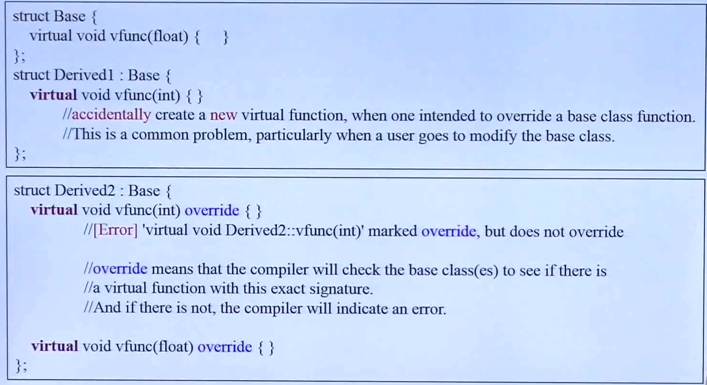

## 1.12. final

final 是 C++11 引进的一个说明符，有两种使用方式。

- 第一种：用在 `class` 类名之后，表示当前的类是一个类的最终继承者，不能再被额外的类继承了。若还有子类继承自用 `final` 关键字修饰的父类，编译器则会报错。

- 第二种：虚函数中用于修饰函数。若父类中有用 `final` 关键字修饰的虚函数，则表明该虚函数不能再被其子类重写了，即它是一个最终的虚函数；否则编译器会报错。
  
  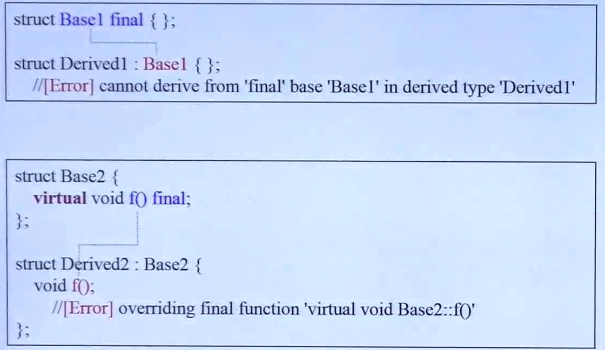

## 1.13. New Function Declaration Syntax

New Function Declaration Syntax 是新的函数声明语法。

## 1.14. Scoped Enumerations

Scoped Enumerations 英文可翻译为带作用域的枚举。

## 1.15. New Template Features

### 1.15.1. **variadic templates**

variadic templates(参数数量不定的模板)是C++新增的一个非常重要的特性。

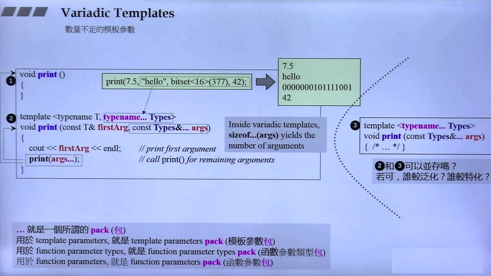

- 代码部分
  
  ```cpp
  #include <iostream>
  #include <bitset>
  
  using namespace std;
  
  /**
   * @description: 当包 ... 中 的个数等于0时就会执行下面这个空的函数 
   * @param {*}
   * @return {*}
   */
  void my_print()
  {
  }
  
  template<typename T, typename... Types>
  void my_print(const T& firstAgs, const Types&... args)
  {
      cout << firstAgs << endl;
      my_print(args...);
  }
  
  int main(int argc, char *argv[])
  {
      my_print(100, "hello", bitset<16>(377), 50);
  
      return 0;
  }
  ```

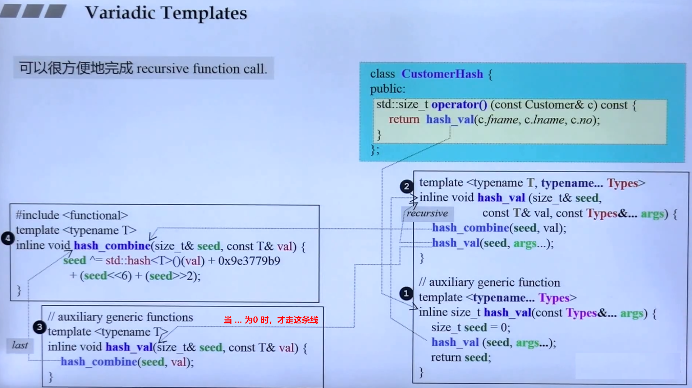

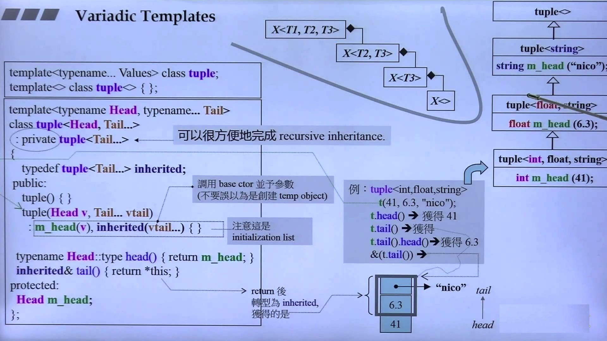

使用这个的好处是帮助我们解决递归。递归的过程就是把不定参数的个数一一分解出来。

### 1.15.2. Alias Templates (Template Typedef)

Alias Templates 是一个别名模板。

- 简单用法
  
  ```cpp
  // declaration
  template<typename T>
  using Vec = std::Vector<T, MyAlloc<T>>;
  
  // call 
  Vec<int> coll;
  ```

- 上面的代码等价于 
  
  ```cpp
  std::vector<int, MyAlloc<int>> coll;
  ```

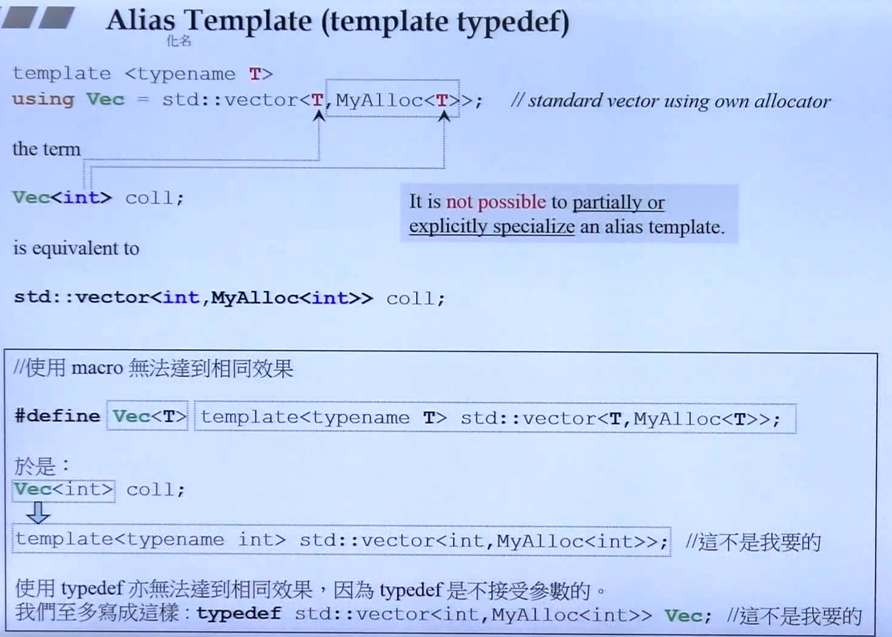

<font color=red>
alias template 不可能用作 偏特化 或 全特化。

从上面的代码看，`using` 使用的效果与 `#define` 或 `typedef` 的用法似乎是一样的，其实并不是一样的，反而使用 `#define` 或 `typedef`不能实现 `alias template` 所达到的效果。

</font>

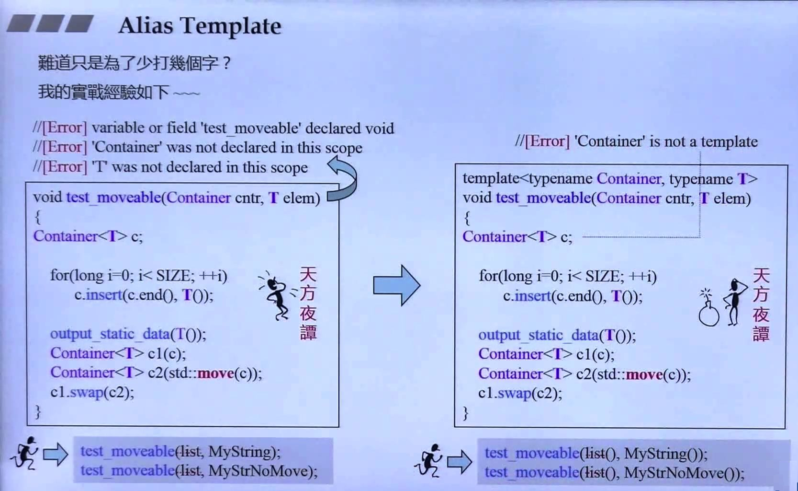

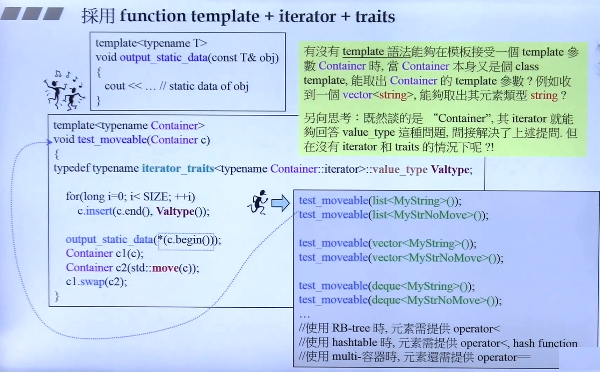

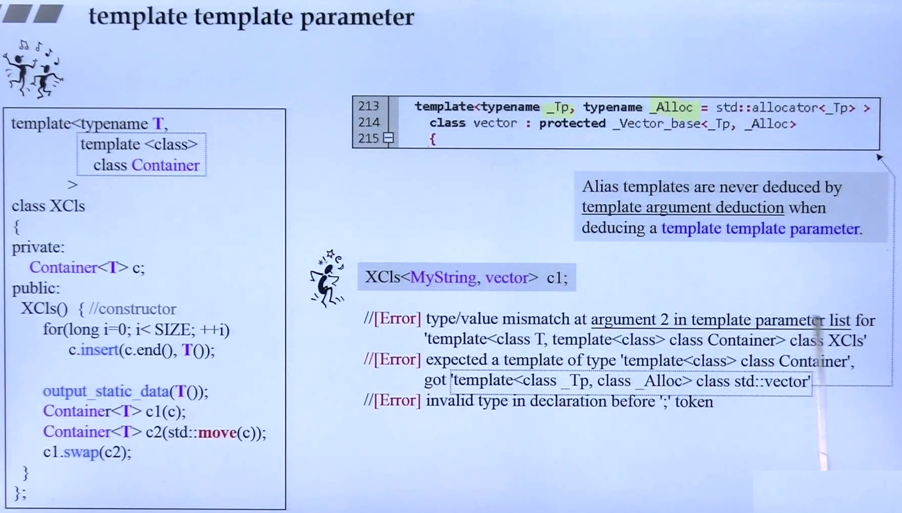

### 1.15.3. Type Alias

Type Alias 是一个类型别名。

- 第一种用法与 `typedef` 的用法是一样的。
  
  ```cpp
  typedef void(*func)(int, int);
  using func = void(*)(int, int);  // 两者实现的用法是等同的
  
  void example(int, int) {}
  func f = example;
  ```

- 第二种用法：type alias 用在 `member typedef name(成员类型名字)`。
  
  ```cpp
  template<typename T>
  struct Container {
    using value_type = T;  // 等同于 typedef T value_type;
  };
  
  // 泛型编程中使用
  template<typename Cntr>
  void f2(const Cntr& ct)
  {
    typename Cntr::value_type n;
  }
  ```

### 1.15.4. Function template

## 1.16. using

哪些地方会用到 using 关键字？

- 第一种： namespace 用在命令空间中： `using namespace std;`

- 第二种：为类成员做声明 (using-declarations for class members)。可用于子类继承于父类的成员或函数。
  
  ```cpp
  // vector 容器中的一段源码
  protected:
    using _Base::_M_allocate;
    using _Base::_M_deallocate;
    using _Base::_M_impl;
  ```
  
  > 有一篇博客写得很好可以值得参考：[委托构造和继承构造函数](https://subingwen.cn/cpp/construct/)，可以看我自己用代码实现的例子：[using用法](./code/c11/using.cpp)

- 第三中：C++11 起引入了 `type alias` 和 `alias template`，可使用 `using` 关键字作为类型或模板的别名。
  
  类模板中使用
  
  ```cpp
  template<typename T>
  struct Container {
  
    // 类型别名
    using value_type = T;  // 等同于 typedef T value_type;
  };
  
  // 模板别名 
  template <class CharT> using mystring = std::basic_string<CharT, std::char_traits<CharT>>;    
  ```
  
  普通类型中使用
  
  ```cpp
  // 函数指针中使用，给类型起个别名
  typedef int(func1*)(int, string);  // 法一：使用typedef
  using func2 = int(*)(int, string);  // 法二：使用using
  ```

> using 关键字的代码实现可参考：[using 用法](./code/c11/using.cpp)

## 1.17. Move Semantics and Rvalue References

Rvalue 只能出现在左边。常见的右值：`临时对象 (temp object)`。

STL 中更好的解决 `perfect forward` 问题的的源码部分。

```cpp
  /**
   *  @addtogroup utilities
   *  @{
   */

  /**
   *  @brief  Forward an lvalue.
   *  @return The parameter cast to the specified type.
   *
   *  This function is used to implement "perfect forwarding".
   */
  template<typename _Tp>
    constexpr _Tp&&
    forward(typename std::remove_reference<_Tp>::type& __t) noexcept
    { return static_cast<_Tp&&>(__t); }

  /**
   *  @brief  Forward an rvalue.
   *  @return The parameter cast to the specified type.
   *
   *  This function is used to implement "perfect forwarding".
   */
  template<typename _Tp>
    constexpr _Tp&&
    forward(typename std::remove_reference<_Tp>::type&& __t) noexcept
    {
      static_assert(!std::is_lvalue_reference<_Tp>::value, "template argument"
            " substituting _Tp is an lvalue reference type");
      return static_cast<_Tp&&>(__t);
    }

  /**
   *  @brief  Convert a value to an rvalue.
   *  @param  __t  A thing of arbitrary type.
   *  @return The parameter cast to an rvalue-reference to allow moving it.
  */
  template<typename _Tp>
    constexpr typename std::remove_reference<_Tp>::type&&
    move(_Tp&& __t) noexcept
    { return static_cast<typename std::remove_reference<_Tp>::type&&>(__t); }
```

## 1.18. =delete && =default

构造函数后面加上 `=default` 关键字，告诉编译器要显式的将哪个作为默认构造函数，而不去调用空类型参数的构造函数。比如：下面的类中，将拷贝赋值函数作为默认的构造函数，而不是 `Pro()` 这个构造函数。

```cpp
class Pro
{
public:
  Pro();                                  // constructor
  Pro(const pro&) = delete;               // copy constructor
  Pro(Pro&&) = default;                   // move constructor
  Pro& operator= (const Pro&) = default;  // copy assignment
  Pro& operator= (const Pro&&) = delete;  // move assignment
  virtual ~Pro();                         // deconstructor
};
```

类中有拷贝构造函数或拷贝赋值函数后，不能再在拷贝构造函数或拷贝赋值函数后面加 `=default` 或 `=delete` 关键字修饰了。

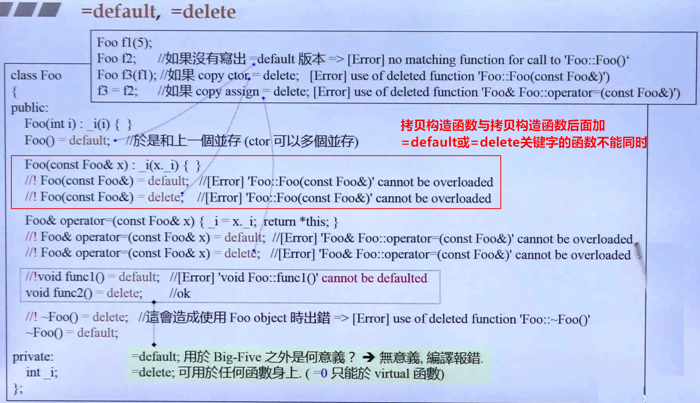

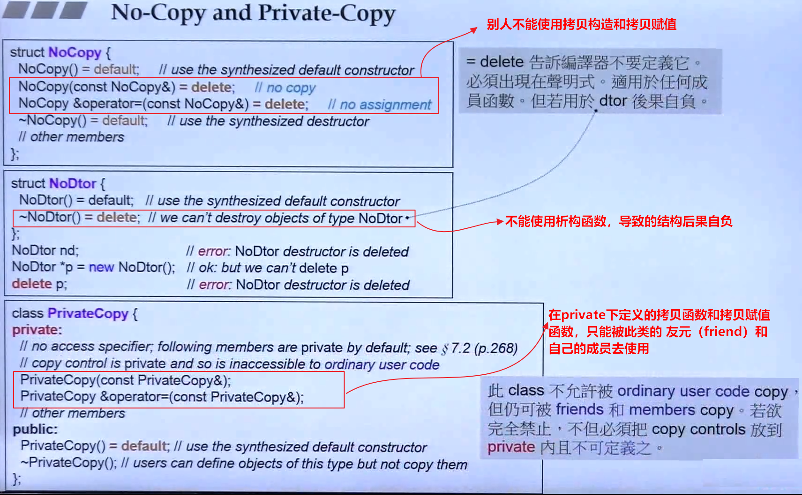

## 1.19. Chrono

通用术语

- `duration` 时间段：指的是在某时间单位时间上的一个明确的 tick（片刻数）。

- `timepoint`（时间点）：表示某个特定的时间点，是一个 duration 和 epoch 的组合。关联至某个 clock 的某个正值或负值 duration。

- `epoch`（时间段的起点）。1970年1月1日是 UNIX 和 POSIX 系统时钟（system clock）的起点。

### 1.19.1. duration

class duration 类 API 接口

- `d.count()` 返回 duration d 的 tick 数量，即打印 tick 数。
- `duration::zero()` 获得一个长度为 0 的时间段（duration）。
- `duration::min()` 和 `duration::max()` 则分别获得一个 duration 所拥有的最小和最大值。
- `duration::rep` 获得 ticks 的类型。
- `duration::period`获得 unit type 的类型。

### 1.19.2. timepoint and clock


# 2. C++14 新特性

C++14引入了一些新特性，以下是其中一些：

1. 泛型lambda表达式：允许lambda表达式具有自动类型推导和通用的参数列表。
2. constexpr函数的扩展：C++11中，constexpr函数只允许包含单个return语句。C++14中允许constexpr函数中有多个return语句，也可以包含局部变量。
3. 返回类型推导：C++14允许使用auto来推导函数的返回类型，如下所示：

    ```cpp
    cppCopy codeauto add(int x, int y) {
      return x + y;
    }
    ```

4. 字符串字面量的改进：C++14支持R"delim(...)delim"的原始字符串字面量，其中delim可以是任何字符序列。这种类型的字符串字面量可以包含换行符和反斜杠字符。
5. 二进制字面量：C++14允许使用0b或0B前缀来表示二进制数字。
6. 数组初始化的简化：C++14允许在花括号中使用“等号”来表示“全部初始化为指定值”，如下所示：

    ```cpp
    cppCopy code
    int arr[10] = { 0 }; //所有元素初始化为0
    ```

7. sizeof()的变量模板：C++14允许使用变量模板来获取对象的大小，如下所示：

    ```cpp
    cppCopy codetemplate <typename T>
    constexpr std::size_t size = sizeof(T);
    ```

8. 常量表达式if语句：C++14允许在常量表达式中使用if语句。
9. 容器的`emplace_back()`函数的改进：C++14 允许使用可变参数模板来调用`emplace_back()`函数。
10. 引入了 `std::make_unique` 创建 `unique_ptr `对象，可以使用 `std::make_unique()`函数来创建。

# 3. C++17 新特性

1. 结构化绑定（Structured Binding）：

    ```
    c++Copy code#include <tuple>
    #include <iostream>
    using namespace std;

    int main() {
        auto [x, y, z] = make_tuple(1, 2, 3);
        cout << x << " " << y << " " << z << endl;
        return 0;
    }
    ```

    输出：

    ```
    Copy code
    1 2 3
	```

1. if语句中的初始化（if with initializer）：

    ```
    c++Copy code#include <iostream>
    using namespace std;

    int main() {
        if (int x = 42; x > 0) {
            cout << x << endl;
        }
        return 0;
    }
    ```

    输出：

    ```
    Copy code
    42
    ```

1. 折叠表达式（Fold Expressions）：

    ```
    c++Copy code#include <iostream>
    using namespace std;

    template<typename... Args>
    auto sum(Args... args) {
        return (args + ...);
    }

    int main() {
        cout << sum(1, 2, 3, 4, 5) << endl;
        return 0;
    }
    ```

    输出：

    ```
    Copy code
    15
    ```

1. constexpr if：

    ```
    c++Copy code#include <iostream>
    using namespace std;

    template<typename T>
    void foo(T t) {
        if constexpr (is_same_v<T, int>) {
            cout << "int: " << t << endl;
        } else if constexpr (is_same_v<T, double>) {
            cout << "double: " << t << endl;
        } else {
            cout << "unknown type" << endl;
        }
    }

    int main() {
        foo(42);
        foo(3.14);
        foo("hello");
        return 0;
    }
    ```

    输出：

    ```
    sqlCopy codeint: 42
    double: 3.14
    unknown type
    ```

1. 结构化绑定与tuple的整合使用：

    ```
    c++Copy code#include <tuple>
    #include <iostream>
    using namespace std;

    struct Point {
        int x;
        int y;
    };

    int main() {
        Point p{1, 2};
        auto [x, y] = tie(p.x, p.y);
        cout << x << " " << y << endl;
        return 0;
    }
    ```

    输出：

    ```
    Copy code
    1 2
    ```

1. [[nodiscard]]属性：

    ```
    c++Copy code#include <iostream>
    using namespace std;

    [[nodiscard]] int foo() {
        return 42;
    }

    int main() {
        foo();
        return 0;
    }
    ```

    编译时会提示：

    ```
    vbnetCopy code
    warning: ignoring return value of function declared with 'nodiscard' attribute
    ```

1. constexpr lambda：

    ```
    c++Copy code#include <iostream>
    using namespace std;

    int main() {
        constexpr auto f = [] (int x) { return x * 2; };
        constexpr int x = f(3);
        cout << x << endl;
        return 0;
    }
    ```

    输出：

    ```
    Copy code
    6
    ```

1. 嵌套命名空间：

    ```
    c++Copy code#include <iostream>
    using namespace std;

    namespace ns1 {
        namespace ns2 {
            int x = 42;
        }
    }

    int main() {
        cout << ns1::ns2::x << endl;
        return 0;
    }
    ```

    输出：

    ```
    Copy code
    42
    ```

1. if constexpr中的变量声明：

    ```
    c++Copy code#include <iostream>
    using namespace std;
    
    template<typename T>
    void foo(T t) {
        if constexpr (bool b
    ```

# 4. C++20 新特性

## 4.1. Coroutine

C++20 引进的一种新技术。
