<!--
 * @Author: JohnJeep
 * @Date: 2021-01-10 18:25:09
 * @LastEditTime: 2021-05-28 20:26:53
 * @LastEditors: Please set LastEditors
 * @Description: 剖析C++标准库
-->

<!-- TOC -->

- [1. Standard Template Library](#1-standard-template-library)
- [2. Thinking(思考)](#2-thinking思考)
- [3. History(历史)](#3-history历史)
- [4. STL(Standard Template Library)标准模板库](#4-stlstandard-template-library标准模板库)
- [5. Container(容器)](#5-container容器)
  - [5.1. Sequence containers(有序容器)](#51-sequence-containers有序容器)
    - [5.1.1. Array](#511-array)
      - [5.1.1.1. 内部结构](#5111-内部结构)
      - [5.1.1.2. 缺点](#5112-缺点)
      - [5.1.1.3. 源码分析](#5113-源码分析)
    - [5.1.2. vector(单端的动态数组)](#512-vector单端的动态数组)
      - [5.1.2.1. 内部结构图](#5121-内部结构图)
      - [5.1.2.2. API接口](#5122-api接口)
      - [5.1.2.3. 优点](#5123-优点)
      - [5.1.2.4. 缺点](#5124-缺点)
      - [5.1.2.5. 源码分析](#5125-源码分析)
    - [5.1.3. deque(双端数组)](#513-deque双端数组)
      - [5.1.3.1. 内部结构图](#5131-内部结构图)
      - [5.1.3.2. API接口](#5132-api接口)
      - [5.1.3.3. 优点](#5133-优点)
      - [5.1.3.4. 缺点](#5134-缺点)
    - [5.1.4. list(双向链表)](#514-list双向链表)
      - [5.1.4.1. list insert](#5141-list-insert)
      - [5.1.4.2. list delete](#5142-list-delete)
      - [5.1.4.3. 内部结构图](#5143-内部结构图)
      - [5.1.4.4. 优点](#5144-优点)
      - [5.1.4.5. 缺点](#5145-缺点)
      - [5.1.4.6. API接口](#5146-api接口)
      - [5.1.4.7. 源码分析](#5147-源码分析)
    - [5.1.5. forword list(单向链表)](#515-forword-list单向链表)
      - [5.1.5.1. 内部结构图](#5151-内部结构图)
      - [5.1.5.2. 缺点](#5152-缺点)
      - [5.1.5.3. 源码分析](#5153-源码分析)
  - [5.2. Associative containers(关联性容器)](#52-associative-containers关联性容器)
    - [5.2.1. set && multiset](#521-set--multiset)
      - [5.2.1.1. 内部结构图](#5211-内部结构图)
      - [5.2.1.2. set 容器中的查找](#5212-set-容器中的查找)
      - [5.2.1.3. 优点](#5213-优点)
      - [5.2.1.4. 缺点](#5214-缺点)
    - [5.2.2. map && mutimap](#522-map--mutimap)
      - [5.2.2.1. map与multimap内部结构图](#5221-map与multimap内部结构图)
      - [5.2.2.2. map insert](#5222-map-insert)
      - [5.2.2.3. at() && [] 操作](#5223-at---操作)
      - [5.2.2.4. 优点](#5224-优点)
      - [5.2.2.5. 缺点](#5225-缺点)
  - [5.3. Unordered associative containers(无序关联容器)](#53-unordered-associative-containers无序关联容器)
    - [5.3.1. unordered_set && unordered_multiset](#531-unordered_set--unordered_multiset)
    - [5.3.2. unordered_map && unordered_multimap](#532-unordered_map--unordered_multimap)
    - [5.3.3. API 接口](#533-api-接口)
  - [5.4. Containers Difference(容器之间的差异性)](#54-containers-difference容器之间的差异性)
  - [5.5. Container adaptors(容器适配器)](#55-container-adaptors容器适配器)
    - [5.5.1. stack](#551-stack)
    - [5.5.2. queue](#552-queue)
      - [5.5.2.1. API 接口](#5521-api-接口)
    - [5.5.3. priority_queue(优先级队列)](#553-priority_queue优先级队列)
      - [5.5.3.1. 什么是优先级队列](#5531-什么是优先级队列)
      - [5.5.3.2. 标准库接口](#5532-标准库接口)
- [6. Algorithm](#6-algorithm)
  - [6.1. Heap(堆)](#61-heap堆)
  - [6.2. API 接口](#62-api-接口)
- [7. Adaptor(适配器)](#7-adaptor适配器)
  - [7.1. 什么是适配器？](#71-什么是适配器)
    - [7.1.1. 函数适配器](#711-函数适配器)
    - [7.1.2. bind adaptor(绑定适配器)](#712-bind-adaptor绑定适配器)
    - [7.1.3. composite adaptor(组合适配器)](#713-composite-adaptor组合适配器)
    - [7.1.4. pointer adaptor(指针适配器)](#714-pointer-adaptor指针适配器)
    - [7.1.5. member function adaptor(成员函数适配器)](#715-member-function-adaptor成员函数适配器)
- [8. Functor(仿函数)](#8-functor仿函数)
  - [8.1. 什么是仿函数？](#81-什么是仿函数)
  - [8.2. 分类](#82-分类)
  - [8.3. 可调用对象](#83-可调用对象)
  - [8.4. 函数对象调用](#84-函数对象调用)
  - [8.5. 可调用对象包装器](#85-可调用对象包装器)
  - [8.6. 可调用对象绑定器](#86-可调用对象绑定器)
  - [8.7. Predefined Function Objects (预定义函数对象)](#87-predefined-function-objects-预定义函数对象)
  - [8.8. 其它](#88-其它)
- [9. Iterator(迭代器)](#9-iterator迭代器)
  - [9.1. 什么是迭代器？](#91-什么是迭代器)
  - [9.2. 基本操作](#92-基本操作)
  - [9.3. half-open range(前闭后开区间)](#93-half-open-range前闭后开区间)
  - [9.4. iterator遵循的原则](#94-iterator遵循的原则)
  - [9.5. Iterator 分类](#95-iterator-分类)
  - [9.6. 源码分析](#96-源码分析)
  - [9.7. 迭代器失效的原因？](#97-迭代器失效的原因)
- [10. Allocator(分配器)](#10-allocator分配器)
- [11. Traits(萃取机)](#11-traits萃取机)
  - [11.1. iterator_traits](#111-iterator_traits)
  - [11.2. type traits](#112-type-traits)
  - [11.3. char traits](#113-char-traits)
  - [11.4. allocator traits](#114-allocator-traits)
  - [11.5. pointer traits](#115-pointer-traits)
  - [11.6. array traits](#116-array-traits)

<!-- /TOC -->

# 1. Standard Template Library

# 2. Thinking(思考)

---------------------------
使用它是一件很愉快的事。

使用一个东西，却不明白它的道理，不高明！---林语堂

源码之前了无秘密。

天下大事，必作于细。

高屋建瓴，细致入微。

所谓剖析源码，其目的在于明理、解惑，提高自身水平，并不是要穷经皓首，倒背如流。


---------------------------
STL学习境界：会用，明理，能扩展。
- 会用：熟练使用 STL 的各种 API 接口。
- 明理：明白 STL 设计的思想，各种 API 的底层实现原理。
- 能扩展：对 STL 添加自己实现的各种接口，扩充 STL 的功能。 


---------------------------
目标

Level 0: 使用C++标准库

Level 1: 深入认识C++标准库(胸中自有丘壑)

Level 2: 良好使用C++标准库

Level 3: 扩充C++标准库

---------------------------

源码版本：GNU 2.91, GNU 4.9


---------------------------


# 3. History(历史)
C++创始人：比尼亚·斯特鲁斯特鲁普（Bjarne Stroustrup）

STL创始人：Alexander Stepanov(亚历山大·斯蒂芬诺夫)

GPL(General Public licence): 广泛开放授权。使用者可以自由阅读与修改GPL软件的源代码，但如果使用者要传播借助GPL软件而完成的软件，他们必须也同意GPL规范。这种精神主要是强迫人们分享并回馈他们对GPL软件的改善。得之于人，舍于人。


# 4. STL(Standard Template Library)标准模板库
- Generic Programming(泛型编程): 操作(operations)使用相同的接口，但是其类型(type)不相同，即使用模板(template)将泛型操作公式化。其中STL是泛型编程(GP)最成功的一个作品。

- STL所实现的是依据泛型思维架设起来的概念结构。STL的核心思想：算法和数据结构的实现是分离的。


- STL六大部件
  - 算法 (Algorithm)
  - 容器 (Container）
  - 迭代器 (Iterator)
  - 仿函数 (Functor)
  - 适配器 (Adaptor)
  - 分配器 (Alloctor)
  
  > 从语言实现的层面分析，Algorithm 采用 function template 实现的，而 Container、Iterator、Functor、Adaptor、Alloctor 都是采用 class template 实现的。

- **六大部件之间的关系**
  - Container 通过 Allocator 取得数据存储的空间；
  - Algorithm 通过 Iterator 访问 Container 中的内容，Container 与 Algorithm 之间不能直接访问，需要借助 iterator，可以把 Iterator 看做是算法与容器之间沟通的桥梁；
  - Functor 协助 Algorithm 完成不同的策略变化；
  - Adaptor 修饰或套接 Functor；


- 使用六大部件的例子
  
  

- 常用的容器
  - Vector(向量)
  - Deque(双队列)
  - List(链表)
  - Map/Multimap(映射/多重映射)
  - Set/Multiset(集合/多重集合)


# 5. Container(容器)
容器是一个一个的类模板 (class template)，里面放的是元素。

STL标准库中 **容器**** 内存储的元素都必须能够拷贝，而C++编译器默认提供的是浅拷贝，程序在执行时，则会出现问题。因此需要 **重写构造函数** 和重载 **=** 操作运算符，执行深拷贝。


https://cloud.tencent.com/developer/article/1052125

## 5.1. Sequence containers(有序容器)

### 5.1.1. Array
Array是C++11标准之后新增的一个容器，表示固定数量的元素(fixed number of elements)。为了模拟数组的相关特性。

#### 5.1.1.1. 内部结构


STL源码中实现，没有构造和析构函数。

#### 5.1.1.2. 缺点
- 不能扩容。

#### 5.1.1.3. 源码分析
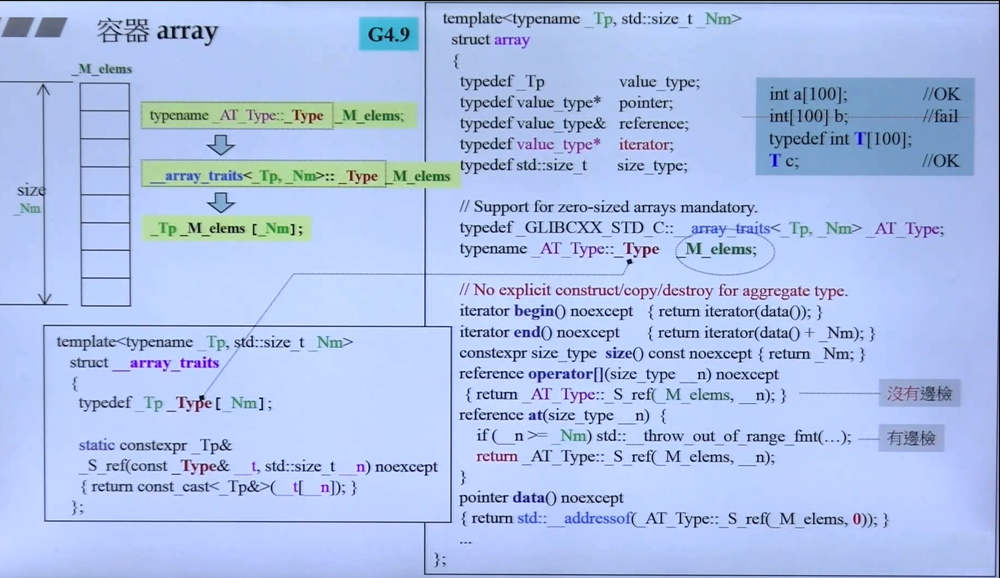

### 5.1.2. vector(单端的动态数组)
- vector是C++标准模板库中的部分内容，它是一个多功能的，能够操作多种数据结构和算法的模板类和函数库。vector之所以被认为是一个容器，是因为它能够像容器一样存放各种类型的对象，简单地说vector是一个能够存放任意类型的动态数组，能够增加和压缩数据。


- 动态数组实现机制：
  > 先为数组开辟较小的空间，然后往数组里面添加数据，当数据的数目超过数组的容量时，再重新分配一块更大的空间（STL中 `vector` 每次扩容时，新的容量都是前一次的两倍），再把之前的数据复制到新的数组中，再把之前的内存释放。


- <font color=red> 注意：</font>
  - 使用动态数组时，尽量减少改变数组容量大小的次数，可以减少时间性能的消耗。 一般每次扩容为原来的  2 倍。
  - 当vector 扩容时，会调用 `move constructor` 和 `move destructor`，并且移动构造和移动析构函数在执行期间是不会抛出异常的，用 `noexcept` 关键字修饰。因为它不能确保异常发生后，移动构造和移动析构函数还能满足标准库的要求，所以是禁止抛异常的。
  - <font color=red> 成长型的容器（需要发生 memory reallocation）在标准库中只有两种：`vector` 和 `deque`。</font>


#### 5.1.2.1. 内部结构图


#### 5.1.2.2. API接口
- `size()`: 返回容器中元素的个数
- `get(r)`: 获取秩（索引）为r的元素
- `put(r, e)`: 用e替换秩为r元素的数值
- `insert(r, e)`: 向秩为r的元素处插入数值e，后面元素依次后移
- `remove(r)`: 初除秩为 `r` 的元素，返回全元素中原存放的对象
- `disordered()`: 判断所有元素是否已按升序序排列
- `sort()`: 调整各元素癿位置，使按照升序序排列
- `deduplicate()`: 删除重复元素   ---向量
- `uniquify()`: 删除重复元素 ---有序向量
- `traverse()`: 遍历向量幵统一处理所有元素，处理斱法由函数对象指定
- `empty()`: 判断容器是否为空
- `at(index)`: 返回索引为index的元素
- `erase(p)`: 删除指针p指向位置的数据，返回下指向下一个数据位置的指针（迭代器）
- `erase(beg, end)`:删除区间`[beg, end)`的数据
- `pop_back()`: 删除最后一个元素
- `push_back()`: 在容器末尾插入一个元素
- `back()`: 获取尾部元素
- `front()`: 获取首部元素
- `begin(), end()`: 返回容器首尾元素的迭代器
- `clear()`: 移除容器中所有的元素
- `swap()`: 交换两个容器的内容，交换两个 vector 的内容后，两者的容量也交换了，这是一个间接缩短vector的小窍门。
- `shrink_to_fit()`: 缩短vector的大小到合适的空间，为实现特定的优化保留了回旋的余地。
- `resize()`: 重新设置vector的容量


#### 5.1.2.3. 优点
- 不指定一块内存大小的数组的连续存储，即可以像数组一样操作，但可以对此数组进行动态操作，运行阶段执行。
- 随机访问快，支持随机迭代访问器。即支持 `[]` 操作符和 `at()`操作。
- 节省空间。

                      
#### 5.1.2.4. 缺点
- 向容器中插入元素时，内部的元素必须能够执行 `拷贝（必须提供拷贝构造）` 操作。
- 在内部进行插入删除操作效率低。
- 只能在vector的最后进行push和pop，不能在vector的头进行push和pop。
- 当动态添加的数据超过vector默认分配的大小时要进行整体的重新分配、拷贝与释放。

#### 5.1.2.5. 源码分析
GNU 2.9版源码UML图
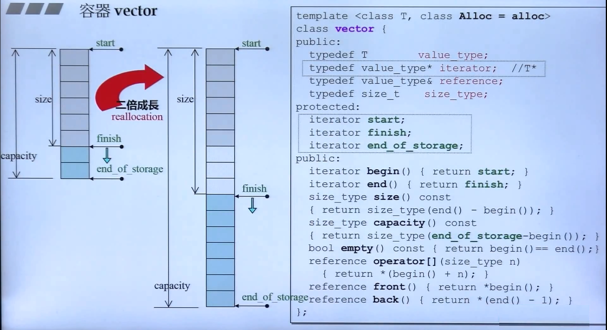


GNU 4.9版源码UML图
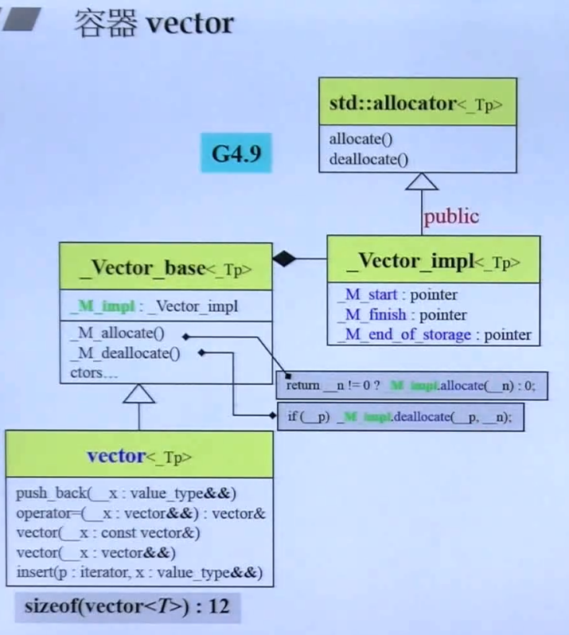


**Vector类与其基类之间的关系**


**Vector_base内部类与其它类之间的关系**
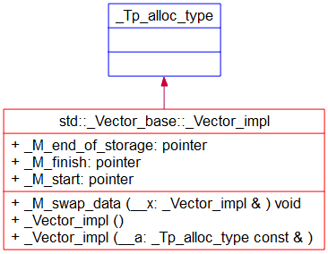


**迭代器之间的关系**


### 5.1.3. deque(双端数组)
deque是在功能上合并了vector和list。与 `vector` 容器类似，但是可以在 `Deque` 的两端进行操作。


#### 5.1.3.1. 内部结构图


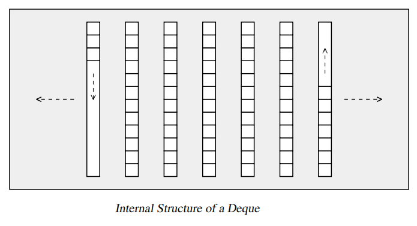

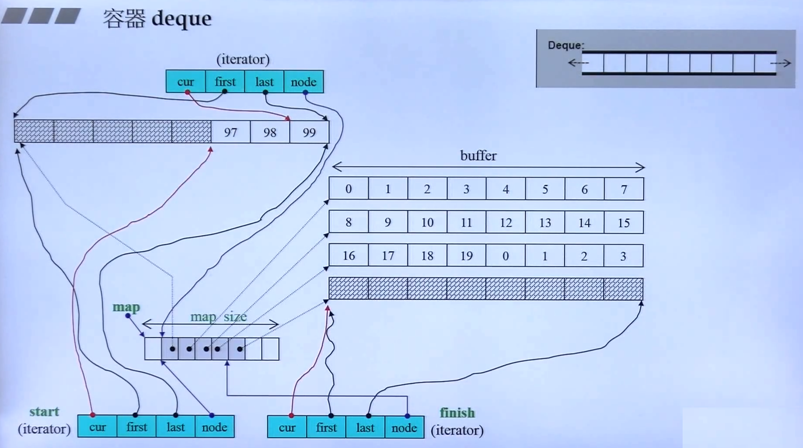

#### 5.1.3.2. API接口
- `push_back()`: 在容器末尾插入一个元素
- `push_front()` 容器头部插入一个元素
- `pop_front()`: 容器头部删除一个元素
- `pop_back()`: 删除最后一个元素


#### 5.1.3.3. 优点
- 支持随机访问，即支持 `[]`操作符和 `at()`。
- 在内部方便的进行插入和删除操作
- 可在两端进行push、pop

#### 5.1.3.4. 缺点
- 每次扩容的大小为一个 buffer。
- 占用内存多。


### 5.1.4. list(双向链表)
list是一个双向链表的容器，可以高效的进行 `插入` 和 `删除` 元素。每一个结点都包括一个信息快Info、一个前驱指针Pre、一个后驱指针Post。可以不分配固定的内存大小，方便的进行添加和删除操作，使用的是非连续的内存空间进行存储。


#### 5.1.4.1. list insert
- 链表的插入操作：在 pos 位置插入新的节点，新插入的数据存放在 pos 位置之前。


#### 5.1.4.2. list delete
- `clear()` 移除容器中所有的数据
- `erase(begin, end)` 删除区间 `[begin, end)` 的数据，返回下一个元素的位置。
- `erase(pos)` 删除指定 pos 位置的数据，返回下一个元素的位置。
- `remove(element)` 删除容器中所有与 element 值匹配的数据。 


#### 5.1.4.3. 内部结构图


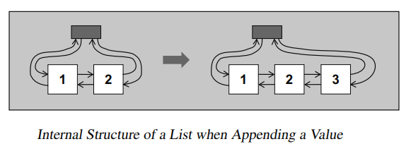

#### 5.1.4.4. 优点
- 不使用连续内存完成动态操作。
- 在内部方便的进行插入和删除操作
- 可在两端进行push、pop


#### 5.1.4.5. 缺点
- 每次只能扩充一个结点，效率低，但空间浪费是最小的。
- 不能进行内部的随机访问，即不支持 `at.(pos)` 函数和 `[]` 操作符。
- 相对于verctor占用内存多。

#### 5.1.4.6. API接口

#### 5.1.4.7. 源码分析
```cpp
    _Self&
    operator++() _GLIBCXX_NOEXCEPT      // 前置++
    {
_M_node = _M_node->_M_next;             // 移动结点
return *this;
    }

    _Self
    operator++(int) _GLIBCXX_NOEXCEPT   // 后置++
    {
_Self __tmp = *this;                    // 记录原值
_M_node = _M_node->_M_next;             // 执行操作
return __tmp;                           // 返回原值，执行的是拷贝构造
    }
```
通过两者传入的参数值不同来区分是前置++还是后置++。

**```_M_node = _M_node->_M_next;``` 这一行为++操作的具体实现过程：**
> 移动结点。过程：将当前结点next域的值取出来赋给_M_node，而_M_node本身指向当前的结点，_M_node->_M_next 指到下一个结点的prev域。此时_M_node 与_M_node->_M_next指向的内容是一样的，所以把_M_node移动到 _M_node->_M_next 指向的位置，这一过程就是结点的++操作。

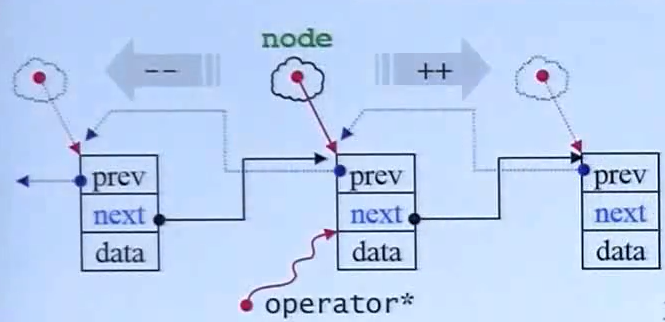


**思考：为什么前置++与后置++两者的返回值是不一样的？**
> 为了与整数的++操作保持一致，操作运算符重载持有的操作应该向整数的操作看起，拥有类似的功。保证不能进行两次的++运算操作。
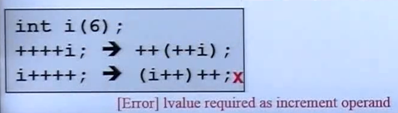


源码中list的UML图分析
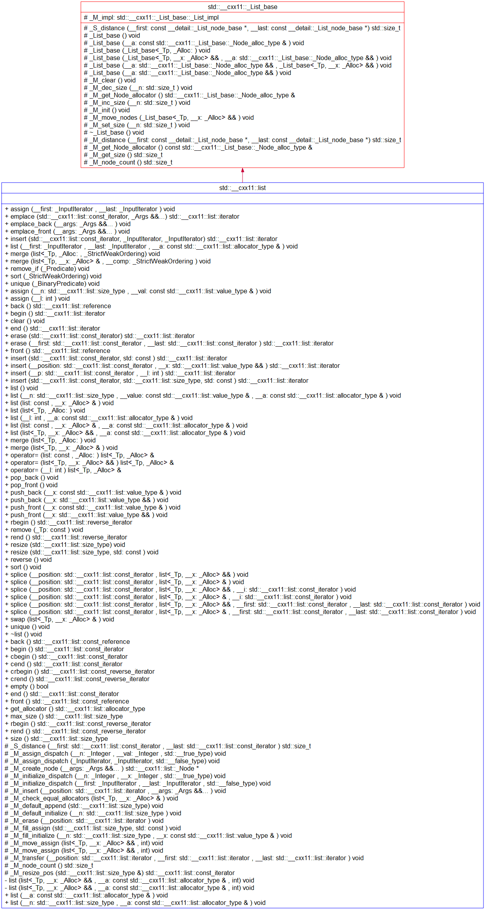

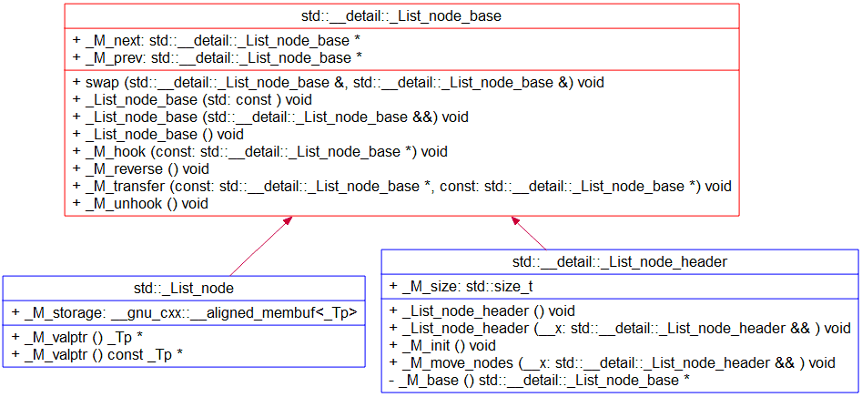


### 5.1.5. forword list(单向链表)
`forword list` 链表是C++11新加的功能，比list的效率要快，是单向的链表。

#### 5.1.5.1. 内部结构图  


#### 5.1.5.2. 缺点
- 只能扩充一个结点。

#### 5.1.5.3. 源码分析


## 5.2. Associative containers(关联性容器)
关联式容器并不提供元素的直接访问，需要依靠迭代器访问。map 是个例外，提供了subscript(下标)操作符，支持元素的直接访问。


### 5.2.1. set && multiset
> set 是一个 `集合` 容器，包含的元素是唯一的，集合中的元素按照一定的顺序排列，不能随意指定位置插入元素。

> collection of keys, sorted by keys. 容器中的 key 可以重复。


- set 底层采用红黑树的数据结构实现的。
- set 支持唯一的键值，容器里面的元素值只能出现一次，而 `multiset` 集合容器中同一个元素值可以出现多次。
- 不可以直接修改 set和multiset集合容器中元素的值，因为集合容器是自动排序的。修改集合容器中元素的值，必须先删除原先元素的值，再插入新元素的值。

#### 5.2.1.1. 内部结构图  


- `insert()` 函数的返回值类型为 `pair<iterator, bool>`，结果是一对数据类型。
  ```
  pair<T1, T2> 存放两个不同类型的数值
  ```

#### 5.2.1.2. set 容器中的查找
- `find()` 返回查找元素的迭代器，查找的元素默认是区分大小写的。
- `count()` 返回容器中查找元素的个数
- `upper_bound` 返回容器中大于查找元素的迭代器位置
- `lower_bound` 返回容器中小于查找元素的迭代器位置
- `equal_range(ele)`返回容器中等于查找元素的两个上下限的迭代器位置（第一个：大于等于ele元素的位置，第二个：大于 ele元素的位置）

#### 5.2.1.3. 优点


#### 5.2.1.4. 缺点


### 5.2.2. map && mutimap
map 是关联式容器，一个 map 就是一个键值对。map 中的 `key` 值唯一，容器中的元素按照一定的顺序排列，不能在任意指定的位置插入元素。

multimap (collection of key-value pairs, sorted by keys.)


- map 的底层原理是按照平衡二叉树的数据结构来实现的，在插入和删除的操作上比 `vector` 容器快。

- map 支持唯一的键值，每个 `key` 只能出现一次，支持 `[]` 操作，形如：`map[key] = value`。 `multimap` 不支持唯一的键值，容器中的每个 `key` 可以出现相同的多次，不支持 `[]` 操作。
> set 和 map 中的 key 不能重复，而 multiset 和 multimap 中的 key 却能重复的原因：set 和 map 底层调用的是红黑树的 `insert_unique()`，而 multiset 和 multimap 底层调用的是红黑树中的 `insert_equal()` 去进行 `insert` 操作的。


- map和multimap会根据元素的 `key` 自动对元素排序。这么一来，根据已知的 `key` 查找某个元素时就能够有很好的效率，而根据己知 `value` 查找元素时，效率就很糟糕。“自动排序"这一性质使得 map 和 multimap 本身有了一条重要限制：你不可以直接改变元素的 `key`。因为这样做会损坏正确的次序。想要修改元素的 `key` ，必须先移除拥有该 `key` 的元素，然后插人拥有新 `key/value` 的元素。从迭代器的视角看，元素的 `key` 是常量。然而直接修改元素的 `value` 是可能的，提供的值的类型不能是 `constant`。


#### 5.2.2.1. map与multimap内部结构图  
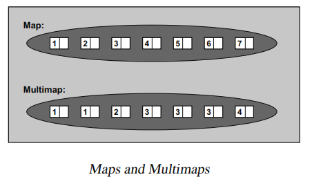

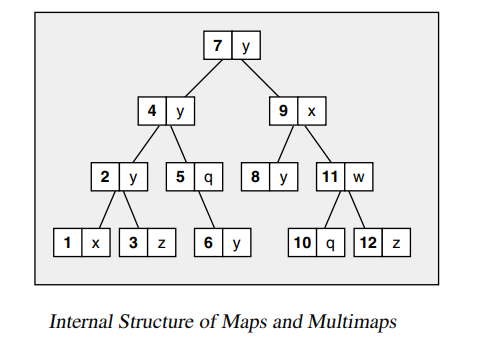


#### 5.2.2.2. map insert
```cpp
// 四种map容器的插入方法
map<int, string> mp;
mp.insert(pair<int, string>(101, "赵云"));                   // 法一
mp.insert(make_pair<int, string>(102, "关羽"));              // 法二
mp.insert(map<int, string>::value_type(103, "曹操"));        // 法三
mp[104] = "张飞";                                            // 法四

// 方法一到方法三向容器中插入相同的键值时，不会插入成功。
// 采用法四向容器中插入相同的键值时，会覆盖原先相同键值的数据。
```

- <font color=red>注意:</font> 
  - map的查找操作需要做异常判断处理
  - key 与 value 两个值必须是可拷贝的(copyable)和可移动的(movable)。
  - 指定的排序准则下，key 必须是可比较的(comparable)。

#### 5.2.2.3. at() && [] 操作
- `at()` 函数会根据它收到的 `key` 得到元素的 `value`，如果不存在这样的元素，则抛出 `out_of_range` 异常。


- `operator []`
  - `operator []` 的索引就是 `key`，其类型可能属于任何的类型，不一定是整数。
  - 如果你选择某 `key` 作为索引，容器内没有相应的元素，那么 map 会自动安插一个新元素，其 value 将被其类型的 default 构造函数初始化。因此你不可以指定一个 `不具 default 构造函数的 value 类型`。一般基础类型都有一个 `default 构造函数`，设初值为 `0`。


#### 5.2.2.4. 优点
插入键值的元素不允许重复，只对元素的键值进行比较，元素的各项数据可以通过 key 值进行检索。 


#### 5.2.2.5. 缺点


## 5.3. Unordered associative containers(无序关联容器)


### 5.3.1. unordered_set && unordered_multiset
`unordered_set` 是一种无序的容器集合。底层采用哈希表实现的。

- STL无序容器存储状态，hash表存储结构图


  

- `unordered_set` 模板类中的定义
  ```cpp
  template<typename _Value,                        // 容器中存储元素的类型
          typename _Hash = hash<_Value>,           // 确定元素存储位置的哈希函数
          typename _Pred = std::equal_to<_Value>,  // 判断各个元素是否相等
          typename _Alloc = std::allocator<_Value>, // 指定分配器对象的类型
          typename _Tr = __uset_traits<__cache_default<_Value, _Hash>::value>>
  ```

- 注意：此容器模板类中没有重载 `[ ]` 运算符，也没有提供 `at()` 成员方法，`unordered_set` 容器内部存储的元素值不能被修改，可以使用迭代器遍历容器中的数，但不能修改容器中元素的值。


- hash table 为了解决冲突采用 `separate chaining` 的方式。


### 5.3.2. unordered_map && unordered_multimap
内部结构图


### 5.3.3. API 接口 
- `count(key)` : 对multimap而言，返回 key 在multimap 中出现的次数；对 map 而言，返回结果为：当前key在map中，返回结果为 1，没在返回结果就为 0；


## 5.4. Containers Difference(容器之间的差异性)
和其他所有关联式容器一样，`map/multimap` 底层是以平衡二叉树完成的。C++ standard 并未明定这一点，但是从map和multimap各项操作的复杂度自然可以得出这一结念。通常set、multiset、map和multimp都使用相同的内部结构，因此，你可以把set和multiset视为特殊的map和multimp，只不过set元素的 `value和key是同一对象`。因此，map和multimap拥有set和multiset的所有能力和所有操作。当然，某些细微差异还是有的：首先，它们的元素是key/value pair，其次，map可作为关联式数组(associative array)来使用。

vector list map set容器如何选择？
- list和vector最主要的区别在于vector是使用连续内存存储的，他支持 `[]` 运算符，而list是底层用链表数据结构实现的，不支持 `[]` 。
- Vector对元素随机访问的速度很快，但是在头部插入元素速度很慢，在尾部插入速度很快。
- List对于随机访问速度慢得多，因为需要遍历整个链表才能做到，但是对元素的插入就快的多了，不需要拷贝和移动数据，只需要改变指针的指向就可以了。另外对于新添加的元素，Vector有一套算法，而List可以任意加入。
- Map、Set属于关联性容器，底层是采用红黑树实现的，它的插入、删除效率比其他序列容器高，因为它不需要做内存拷贝和内存移动，而是改变指向节点的指针。
- Set和Vector的区别在于Set容器不包含重复的数据。Set和Map的区别在于Set只含有Key，而Map有一个Key和Key所对应的Value两个元素。
- Map和Hash_Map的区别是Hash_Map使用了Hash算法来加快查找过程，但是需要更多的内存来存放这些Hash桶元素，因此可以算得上是采用空间来换取时间策略。

   1 如果你需要高效的随即存取，而不在乎插入和删除的效率，使用vector 
     2 如果你需要大量的插入和删除，而不关心随即存取，则应使用list 
     3 如果你需要随即存取，而且关心两端数据的插入和删除，则应使用deque


## 5.5. Container adaptors(容器适配器)
容器适配器为有序的容器提供了不同的接口。queue和stack底层完全借助 deque实现的。


### 5.5.1. stack
内部结构图

 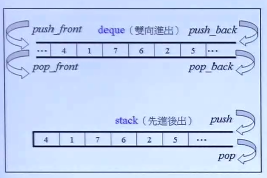

- API 接口
  - `push()` 入栈
  - `pop()` 出栈
  - `top()` 获取栈顶元素
  - `size()` 获取栈大小
  - `empty()` 栈为空


### 5.5.2. queue
内部结构图

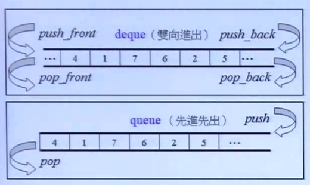


#### 5.5.2.1. API 接口
  - `push()` 入队列
  - `pop()` 出队列
  - `empty()` 对列为空
  - `front()` 队列头部元素
  


### 5.5.3. priority_queue(优先级队列)
#### 5.5.3.1. 什么是优先级队列


#### 5.5.3.2. 标准库接口
```cpp
// 最大或最小优先级队列变量的声明 

priority_queue<int> g_priq;                            // 默认为最大值优先队列
priority_queue<int, vector<int>, greater<int>> l_priq; // 最小值优先队列
```


# 6. Algorithm
- 从实现的角度来看，STL算法是一种 `function template`。

- STL算法的核心思想
  - STL通过类模板技术，实现了数据类型与容器模型的分离。
  - 通过函数对象实现了自定义数据类型与底层算法的分离。
  - 通过迭代器的方式统一的去遍历容器，向容器中读数据和写数据。

**所有的Algorithms内部最本质的操作无非就是比大小。**

## 6.1. Heap(堆)
- heap(堆)的STL库中函数
  - `make_heap(first, last, comp);` 建立一个空堆；
  - `push_heap(first, last, comp);` 向堆中插入一个新元素；
  - `top_heap(first, last, comp); ` 获取当前堆顶元素的值；
  - `sort_heap(first, last, comp);` 对当前堆进行排序；


## 6.2. API 接口
- `for_each()` 遍历容器中的所有元素。
- `transform()` 将容器中的数据进行某种转换的运算。
  - 两个算法的区别
    - `for_each()` 使用的函数对象可以没有 `返回值`，参数一般传 `reference`，因此速度较快，不是很灵活。
    - `transform()` 使用的函数对象必须要有 `返回值`，参数一般传 `value`，因此速度较慢，但是很灵活。
- `adjacent()` 查找一对相邻位置重复的元素，找到则返回指向这对元素的第一个元素的迭代器值。
- `distance()` 返回两个迭代器之间的距离，两个迭代器必须指向同一个容器。
- `binary_search()` 采用二分法在有序序列中查找 value，找到则返回 true。在无序的序列中不能使用。
- `count()` 计数容器中指定元素的个数。
- `count_if()` 使用 `谓词` 计数容器中指定条件元素的个数。
- `find()` 
- `find_if()` 
- `merge()`  合并两个有序的序列，并存放到另一个序列中。
- `sort()` 默认按照升序的方式重新排列指定范围内元素的元素。
- `random_shuffle()` 对指定范围内的元素随机进行排序。
- `reverse()` 对指定范围内的元素进行倒叙排序。
- `copy()` 将一个容器中的元素值拷贝到另一个容器中
- `replace()` 将指定范围内的 `oldValue` 替换为 `newValue`
- `replace_if()` 将指定范围内的 `oldValue` 替换为 `newValue`，需要指定 `函数对象`（是自定义的函数对象或STL预定义的函数对象）。
- `swap()`  交换两个容器
- `accumulate()` 累加遍历容器中指定范围内的元素，并在结果上加一个指定的值。
- `stable_partition()`
- `upper_bound()` 
- `lower_bound()` 
- `std::floor()` 和 `std::ceil()`都是对变量进行四舍五入，只不过四舍五入的方向不同。 
  - `std::floor()` -->向下取整数。`5.88   std::floor(5.88) = 5;`
  - `std::ceil()` -->向上取整数。`std::ceil(5.88)   = 6;`


     

# 7. Adaptor(适配器)
## 7.1. 什么是适配器？
> 一种用来修饰容器(containers)或仿函数(functor)或迭代器(iterators)接口的东西。改变 `functor` 接口者，称为 `function adaptor`；改变 `container` 接口者，称为 `container adaptor`；改变 `iterator` 接口者，称为 `iterator adaptor`。


### 7.1.1. 函数适配器
### 7.1.2. bind adaptor(绑定适配器)


### 7.1.3. composite adaptor(组合适配器)


### 7.1.4. pointer adaptor(指针适配器)


### 7.1.5. member function adaptor(成员函数适配器) 

predicate: 判断这个条件是真还是假


# 8. Functor(仿函数)
## 8.1. 什么是仿函数？
仿函数(Functor)也叫函数对象(Function object)或者叫伪函数。它是在 `struct` 结构体中定义一种新的函数，它只为算法 (Algorithms) 服务。从实现的角度看，仿函数是一种重载了 `operator()` 的 `class` 或 `class template`，让对象也具有像函数一样的功能。一般函数指针可视为狭义的仿函数。 


## 8.2. 分类

按操作数个数划分
- 一元运算 (unary_function)
- 二元运算 (binary_function)

按功能划分
- 算术运算 (Arithmetic)
  - 加：plus<T>
  - 减: minus<T>
  - 乘: multiplies<T>
  - 除: divides<T>
  - 取模: modulus<T>  
  - 否定: negate<T> 
  > negate 属于一元运算，其余的都属于二元运算。


- 关系运算 (Ratioanl)
  - 等于: equal_to<T> 
  - 不等于: not_equal_to<T>
  - 大于: greater<T>
  - 大于等于: greater_equal<T>
  - 小于: less<T>
  - 小于等于: less_equal<T>
  > 六种都属于二元运算。 
  

- 逻辑运算 (Logical)
  - 逻辑 And: logical_and<T> 
  - 逻辑 Or: logical_or<T>
  - 逻辑 Not: logical_not<T>
  > And, Or 属于二元运算，Not 属于一元运算。 


## 8.3. 可调用对象
哪些可以是可调用对象？
- 函数指针 (function pointer)
- 带有成员函数 `operator()` 创建的 object。
- 带有转换函数，可将自己转换为函数指针的 类 所创建的 object。
- lambda 表达式。


## 8.4. 函数对象调用
- 函数对象可以做函数参数。 
- 函数对象可以做返回值。 
- 函数对象的调用与 `回调函数` 的调用类似。 
  ```cpp
  class Stu
  {
    private:
    public:
      void operator() (Stu& T) {}
  }
  ``` 


## 8.5. 可调用对象包装器
包含头文件：`#include <functional>`

语法
`std::function<返回值类型(参数列表)> obj_name = 可调用对象`

包装器可包装哪些东西？
- 包装类的普通成员函数
- 包装类的静态函数
- 包装仿函数
- 包装转化为函数指针的函数对象

类的成员函数不能直接使用可调用对象包装器，还需要结合绑定器一起使用。


## 8.6. 可调用对象绑定器
std::bind()

绑定器作用
- 将可调用对象与其参数一起绑定成为仿函数。
- 将多元可调用转化为一元可调用对象


两种方式
- 绑定非类的成员变量。
- 绑定类的成员变量或成员函数。


## 8.7. Predefined Function Objects (预定义函数对象)
标准STL模板库中提前预定义了很多的函数对象。任何应用程序想要使用 STL 内建的仿函数，都必须包含标准库预定义函数对象的头文件 `<functional>`。

仿函数的主要作用就是为了搭配 STL 算法，在算法中进行使用。


## 8.8. 其它
- 证同函数(identity_function): 任何数值通过此函数后，不会有任何改变。标准库 `stl_function.h` 中用 `identity` 来指定 RB-tree 所需的 KeyOfValue。

- 选择函数(selection_function)，标准库 `stl_function.h` 中用 `select1st` 和 `select2nd` 来指定 RB-tree 所需的 KeyOfValue。
  - select1st: 接受一个pair，传回它的第一个元素。
  - select2nd: 接受一个pair，传回它的第二个元素。

- 投射函数
  - project1st: 传回第一参数，忽略第二参数。
  - project2nd: 传回第二参数，忽略第1参数。


# 9. Iterator(迭代器)
## 9.1. 什么是迭代器？
> 表示元素在容器中的位置，这种对象的概念就称为迭代器。(STL标准库中的解释：we need a concept of an object that represents positions of elements in a container. This concept exists.Objects that fulfill this concept are called iterators.  
> 迭代器就是一种泛化的指针，是一个可遍历STL容器中全部或部分元素的对象。从实现的角度看，迭代器是一种将 `operator*`, `operator->`, `operator++`, `operator--` 等指针操作给予重载的 `class template`。


## 9.2. 基本操作
- `operator *`: 返回当前位置上元素的值。
- `operator ++ 或 operator --`: 让迭代器指向下一个或上一个元素。
- `operator == 或 operator !=`: 判断两个迭代器是否指向同一个位置。
- `operator =`: 赋值给迭代器  

> 不同的迭代器也许是 `smart pointers`，具有遍历复杂数据结构的能力，其内部运作机制取决于所遍历的数据结构。每一种容器都必须提供自己的迭代器。事实上每一种容器的确都将其迭代器以嵌套方式定义与 class 内部，因此各种迭代器的接口（interface）虽然相同，但类型（type）却是各不相同。


## 9.3. half-open range(前闭后开区间)
- begin: 返回一个迭代器，指向容器中第一个元素的位置。
- end: 返回一个迭代器，指向容器的终点，终点位于最后一个元素的下一个位置。
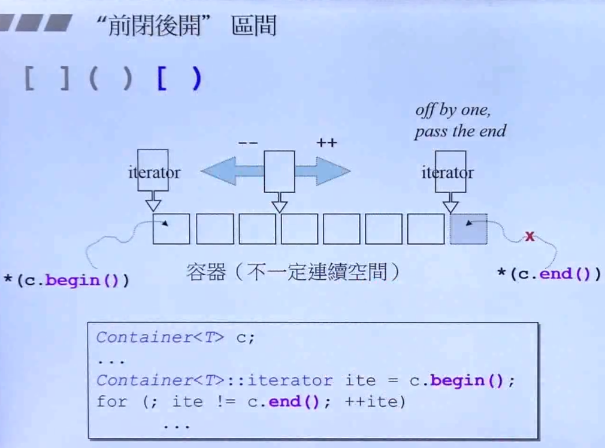


- 采用半开区间的优点？
  - 给遍历元素时，循环（loop）结束的时候，提供一个简单的判断依据。只要尚未达 `end()`，loop就继续执行。
  - 避免对空区间（empty ranges）采取特殊的处理。对于 `empty ranges` 而言，`begin()` 就等于 `end()`。
 


## 9.4. iterator遵循的原则
iterator 是算法 (Algorithms) 与容器 (containers) 之间的桥梁。


## 9.5. Iterator 分类
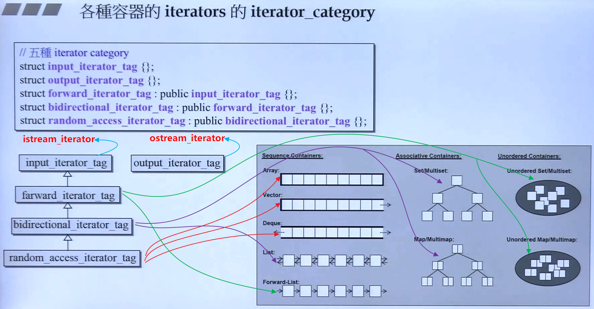

istream_iterator 的 iterator_category


ostream_iterator 的 iterator_category
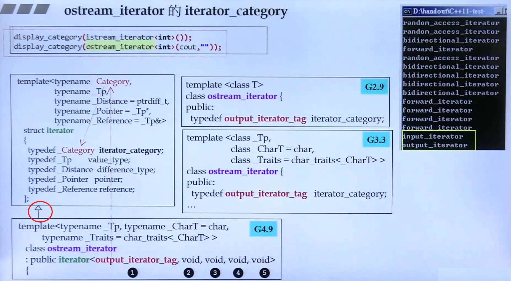

父类中没有data 和 function，子类继承于父类的 typedef。

**Iterator分类对算法的影响**


## 9.6. 源码分析
位于标准库的 `stl_iterator_base_types.h` 文件中。

```cpp
///  Marking input iterators.
struct input_iterator_tag { };

///  Marking output iterators.
struct output_iterator_tag { };

/// Forward iterators support a superset of input iterator operations.
struct forward_iterator_tag : public input_iterator_tag { };

/// Bidirectional iterators support a superset of forward iterator
/// operations.
struct bidirectional_iterator_tag : public forward_iterator_tag { };

/// Random-access iterators support a superset of bidirectional
/// iterator operations.
struct random_access_iterator_tag : public bidirectional_iterator_tag { };
```


## 9.7. 迭代器失效的原因？
- 何为迭代器失效？
  - STL容器中元素整体“迁移”导致存放原容器元素的空间不再有效，使原本指向某元素的迭代器不再指向希望指向的元素，从而使得指向原空间的迭代器失效。 


-  对于序列式容器，比如vector，删除当前的iterator会使后面所有元素的iterator都失效。因为序列式容器中内存是连续分配的（分配一个数组作为内存），删除一个元素导致后面所有的元素会向前移动一个位置。删除了一个元素，该元素后面的所有元素都要挪位置，所以，删除一个数据后，其他数据的地址发生了变化，之前获取的迭代器根据原有的信息就访问不到正确的数据。

- 数组型数据结构的元素是分配在连续的内存中，`insert` 和 `erase` 操作，会使删除点和插入点之后的元素挪位置。所以，插入点和删除掉之后的迭代器全部失效，也就是说 `insert(*iter)(或erase(*iter))`，然后再 `iter++`，是没有意义的。
  - 解决方法：`erase(*iter)`的返回值是下一个有效迭代器的值 `iter =cont.erase(iter);`

- list型的数据结构，使用了不连续分配的内存，删除运算使指向删除位置的迭代器失效，但是不会失效其他迭代器。
  - 解决办法两种，`erase(*iter)` 会返回下一个有效迭代器的值，或者`erase(iter++)`。

- 红黑树存储的数据，插入操作不会使任何迭代器失效；删除操作使指向删除位置的迭代器失效，但不会失效其他迭代器。`erase` 迭代器只是被删元素的迭代器失效，但是返回值为 `void`，所以要采用 `erase(iter++)`的方式删除迭代器。

<font color=red>注意：</font>  经过 `erase(iter)` 之后的迭代器完全失效，该迭代器 `iter` 不能参与任何运算，包括 `iter++和*ite`。

- 参考
  - [迭代器失效的几种情况总结](https://blog.csdn.net/lujiandong1/article/details/49872763) 
  - [聊聊map和vector的迭代器失效问题](https://blog.csdn.net/stpeace/article/details/46507451?utm_medium=distribute.pc_relevant_t0.none-task-blog-BlogCommendFromMachineLearnPai2-1.control&dist_request_id=2cff67d7-d841-4421-bbca-7f85ba6e0330&depth_1-utm_source=distribute.pc_relevant_t0.none-task-blog-BlogCommendFromMachineLearnPai2-1.control)
  - [C++ STL 迭代器失效问题](https://www.cnblogs.com/qiaoconglovelife/p/5370396.html)


# 10. Allocator(分配器)
什么是Allocator？
  > 负责内存空间的分配与管理。分配器是一个实现了动态空间配置、空间管理、空间释放的 `class template`。
  
分配器我们一般不直接使用它，它是给容器使用的。容器的内存分配是通过分配器来管理的。

C++标准库在许多地方使用特殊的对象(objects)处理内存的分配(allocation)和归还(deallocation)，像这样的对象(objects)就称为分配器`allocators`。

**Allocator代表的是一种特殊内存模型(memorymodel)，并提供一种抽象的概念，将对内存的索求(need to use memory)转变为对内存的直接调用(raw call for memory)。** 如果在相同的时间使用不同的分配器(allocato)对象，允许你在程序中使用不同的内存模型(memory models)。

最初，allocator只是作为STL的一部分而引人的，用来处理像PC上不同类型的指针（例如near、far、huge指针）这一类乱七八艚的问题；现在则是作为“运用某种内存模型”技术方案的基础，使得像共享内存(shared memory）、垃圾回收（garbagecollection）、面向对象数据库(object-oriented database)等解决方案能保特一致接。

C++标准定了一个default allocator如下：
```cpp
namespace std {
  template < typename T>
  class allocator;
}
```

这个default allocator可在 "allocator得以被当作实参使用”的任何地方允许当默认值，它会执行内存分配和回收的一般用法。也是说，它会调用new和delete操作符。但C++并没有对“在什么时候以什么方式调用这些操作符"给予明确规定。因此，default allocator甚至可能在内部对分配内存采用缓存(cache)的手法。

绝人多数程序都使用 default allocator，但有时其它程序库也可能提供些 allocator 满足特定需求。这种情况下只需简单地将它们当做实参即可。只有少数情况下才需要自行写一个 allocator，现实中最常使用的还是default allocator。

allocator底层的操作都是采用 `malloc()` 和 `free()`来分配和释放内存。

malloc分配内存时，会有额外的外开销(overhead)，使程序变慢。使内存分配的效率高，需要减少cookie的开销。


`operator new()`

 `malloc() `


# 11. Traits(萃取机) 
## 11.1. iterator_traits
trait 中文译为：特点、特征。 iterator_traits即为迭代器的特征。这个有点不好理解，可以把它理解成一个 `萃取机`，用来区分传入迭代器中的类型是 `class iterators` 还是 `non class iterators，即native pointer`。可以利用 `类模板中的partial specialization` 可以得到目标。


位于 `../C++/bits/stl_iterators.h>` 头文件中。


## 11.2. type traits
位于 `../C++/type_traits.h>` 头文件中。
## 11.3. char traits
位于 `../C++/bits/char_traits.h>` 头文件中。

## 11.4. allocator traits
位于 `../C++/bits/alloc_traits.h>` 头文件中。

## 11.5. pointer traits
位于 `../C++/bits/ptr_traits.h>` 头文件中。

## 11.6. array traits
位于 `../C++/array>` 头文件中。


