<!--
 * @Author: JohnJeep
 * @Date: 2021-01-10 18:25:09
 * @LastEditTime: 2021-03-17 18:29:32
 * @LastEditors: Please set LastEditors
 * @Description: 剖析C++标准库
-->

<!-- TOC -->

- [1. Standard Template Library](#1-standard-template-library)
  - [1.1. Thinking(思考)](#11-thinking思考)
  - [1.2. History(历史)](#12-history历史)
  - [1.3. STL（Standard Template Library）标准模板库](#13-stlstandard-template-library标准模板库)
  - [1.4. Container(容器)](#14-container容器)
    - [1.4.1. Sequence containers(有序容器)](#141-sequence-containers有序容器)
      - [1.4.1.1. Array](#1411-array)
        - [1.4.1.1.1. 内部结构](#14111-内部结构)
        - [1.4.1.1.2. 缺点](#14112-缺点)
      - [1.4.1.2. vector（单端的动态数组）](#1412-vector单端的动态数组)
        - [1.4.1.2.1. 内部结构图](#14121-内部结构图)
        - [1.4.1.2.2. 成员函数](#14122-成员函数)
        - [1.4.1.2.3. 优点](#14123-优点)
        - [1.4.1.2.4. 缺点](#14124-缺点)
      - [1.4.1.3. deque（双端数组）](#1413-deque双端数组)
        - [1.4.1.3.1. 内部结构图](#14131-内部结构图)
        - [1.4.1.3.2. 成员函数](#14132-成员函数)
        - [1.4.1.3.3. 优点](#14133-优点)
        - [1.4.1.3.4. 缺点](#14134-缺点)
      - [1.4.1.4. list（双向链表）](#1414-list双向链表)
        - [1.4.1.4.1. list插入](#14141-list插入)
        - [1.4.1.4.2. list 的删除](#14142-list-的删除)
        - [1.4.1.4.3. 内部结构图](#14143-内部结构图)
        - [1.4.1.4.4. 优点](#14144-优点)
        - [1.4.1.4.5. 缺点](#14145-缺点)
      - [1.4.1.5. forword list(单向链表)](#1415-forword-list单向链表)
        - [1.4.1.5.1. 内部结构图](#14151-内部结构图)
        - [1.4.1.5.2. 缺点](#14152-缺点)
    - [1.4.2. Associative containers(关联性容器)](#142-associative-containers关联性容器)
      - [1.4.2.1. set && multiset](#1421-set--multiset)
        - [1.4.2.1.1. 内部结构图](#14211-内部结构图)
        - [1.4.2.1.2. set 容器中的查找](#14212-set-容器中的查找)
        - [1.4.2.1.3. 优点](#14213-优点)
        - [1.4.2.1.4. 缺点](#14214-缺点)
      - [1.4.2.2. map && mutimap](#1422-map--mutimap)
        - [1.4.2.2.1. map与multimap内部结构图](#14221-map与multimap内部结构图)
        - [1.4.2.2.2. map insert](#14222-map-insert)
        - [1.4.2.2.3. at() && [] 操作](#14223-at---操作)
        - [1.4.2.2.4. 优点](#14224-优点)
        - [1.4.2.2.5. 缺点](#14225-缺点)
    - [1.4.3. Unordered associative containers(无序关联容器)](#143-unordered-associative-containers无序关联容器)
      - [1.4.3.1. unordered_set && unordered_multiset](#1431-unordered_set--unordered_multiset)
      - [1.4.3.2. unordered_map && unordered_multimap](#1432-unordered_map--unordered_multimap)
    - [1.4.4. Containers Difference(容器之间的差异性)](#144-containers-difference容器之间的差异性)
    - [1.4.5. Container adaptors(容器适配器)](#145-container-adaptors容器适配器)
      - [1.4.5.1. stack](#1451-stack)
      - [1.4.5.2. queue](#1452-queue)
      - [1.4.5.3. priority_queue(优先级队列)](#1453-priority_queue优先级队列)
        - [1.4.5.3.1. 什么是优先级队列](#14531-什么是优先级队列)
        - [1.4.5.3.2. 标准库接口](#14532-标准库接口)
  - [1.5. Algorithm](#15-algorithm)
    - [1.5.1. heap](#151-heap)
    - [1.5.2. 其它函数](#152-其它函数)
  - [1.6. Adaptor(适配器)](#16-adaptor适配器)
    - [1.6.1. 什么是适配器？](#161-什么是适配器)
    - [1.6.2. 函数适配器](#162-函数适配器)
  - [1.7. Functor(仿函数)](#17-functor仿函数)
    - [1.7.1. 什么是仿函数？](#171-什么是仿函数)
    - [1.7.2. 分类](#172-分类)
    - [1.7.3. 函数对象调用](#173-函数对象调用)
  - [1.8. Iterator(迭代器)](#18-iterator迭代器)
    - [1.8.1. 什么是迭代器？](#181-什么是迭代器)
    - [1.8.2. 基本操作](#182-基本操作)
    - [1.8.3. half-open range(前闭后开区间)](#183-half-open-range前闭后开区间)
    - [1.8.4. 迭代器失效的原因？](#184-迭代器失效的原因)
  - [1.9. Allocator(分配器)](#19-allocator分配器)

<!-- /TOC -->

# 1. Standard Template Library

## 1.1. Thinking(思考)

---------------------------
使用它是一件很愉快的事。

使用一个东西，却不明白它的道理，不高明！---林语堂

源码之前了无秘密。

天下大事，必作于细。

高屋建瓴，细致入微。

所谓剖析源码，其目的在于明理、解惑，提高自身水平，并不是要穷经皓首，倒背如流。


---------------------------
STL学习境界：会用，明理，能扩展。


目标

Level 0: 使用C++标准库

Level 1: 深入认识C++标准库(胸中自有丘壑)

Level 2: 良好使用C++标准库

Level 3: 扩充C++标准库

---------------------------

## 1.2. History(历史)
STL创始人：Alexander Stepanov

GPL(General Public licence): 广泛开放授权。使用者可以自由阅读与修改GPL软件的源代码，但如果使用者要传播借助GPL软件而完成的软件，他们必须也同意GPL规范。这种精神主要是强迫人们分享并回馈他们对GPL软件的改善。得之于人，舍于人。


## 1.3. STL（Standard Template Library）标准模板库
- Generic Programming(泛型编程): 操作(operations)使用相同的接口，但是其类型(type)不相同，即使用模板(template)将泛型操作公式化。其中STL是泛型编程(GP)最成功的一个作品。

- STL所实现的是依据泛型思维架设起来的概念结构。STL的核心思想：算法和数据结构的实现是分离的。


- STL六大部件
  - 算法（Algorithm）
  - 容器（Container）
  - 迭代器（Iterator）
  - 仿函数（Functor）
  - 适配器（Adaptor）
  - 分配器（Alloctor） 

- 六大部件之间的关系
  > Container 通过 Allocator 取得数据存储空间，Algorithm 通过 Iterator 存取 Container 内容，Functor 可以协助 Algorithm 完成不同的策略变化，Adaptor 可以修饰或套接 Functor。
  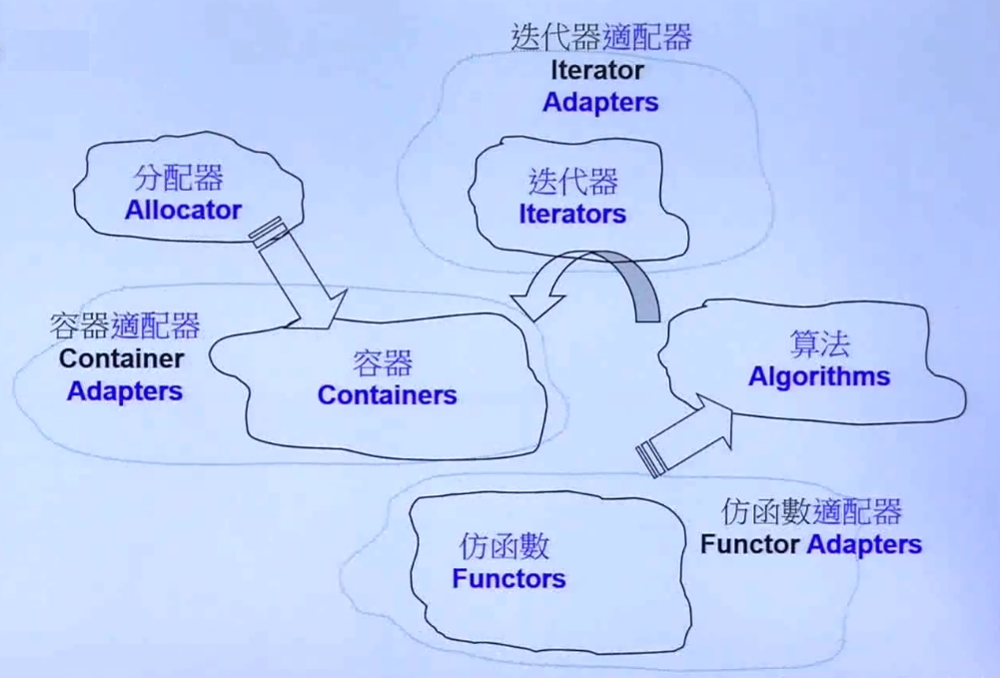


- 使用六大部件的例子
  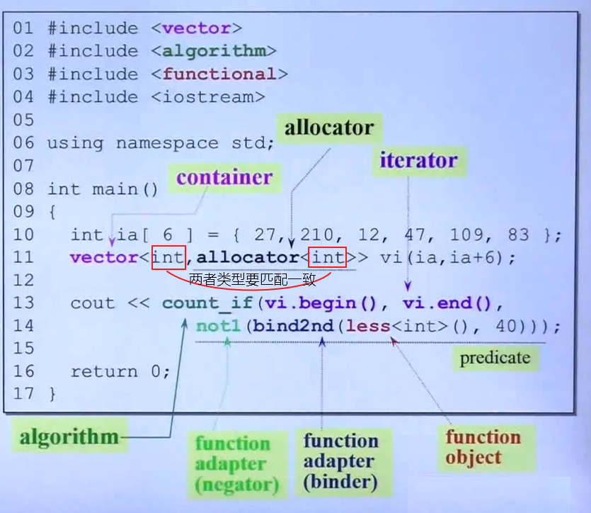
  

- 常用的容器
  - Vector(向量)
  - Deque(双队列)
  - List(链表)
  - Map/Multimap(映射/多重映射)
  - Set/Multiset(集合/多重集合)
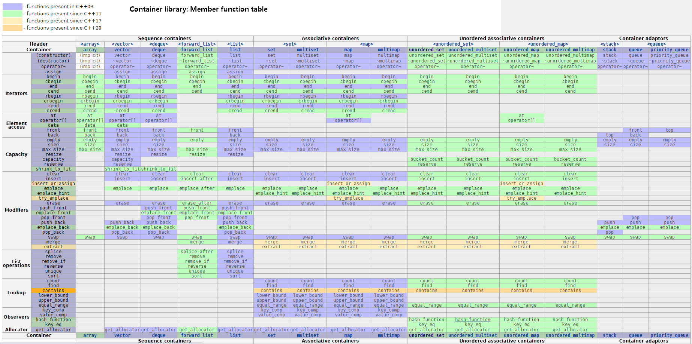


## 1.4. Container(容器)
容器是一个一个的模板类，里面放的是元素。

STL标准库中 `容器` 内存储的元素都必须能够拷贝，而C++编译器默认提供的是浅拷贝，程序在执行时，则会出现问题。因此需要 `重写构造函数` 和重载 `=` 操作运算符，执行深拷贝。


https://cloud.tencent.com/developer/article/1052125

### 1.4.1. Sequence containers(有序容器)

#### 1.4.1.1. Array
Array是fixed number of elements(固定数量的元素)。

##### 1.4.1.1.1. 内部结构
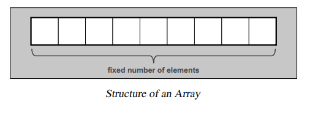

##### 1.4.1.1.2. 缺点
- 不能扩容。


#### 1.4.1.2. vector（单端的动态数组）
vector是C++标准模板库中的部分内容，它是一个多功能的，能够操作多种数据结构和算法的模板类和函数库。vector之所以被认为是一个容器，是因为它能够像容器一样存放各种类型的对象，简单地说vector是一个能够存放任意类型的动态数组，能够增加和压缩数据。


动态数组实现机制：
  > 先为数组开辟较小的空间，然后往数组里面添加数据，当数据的数目超过数组的容量时，再重新分配一块更大的空间（STL中 `vector` 每次扩容时，新的容量都是前一次的两倍），再把之前的数据复制到新的数组中，再把之前的内存释放。
  - 注意：使用动态数组时，尽量减少改变数组容量大小的次数，可以减少时间性能的消耗。 一般每次扩容为原来的  2 倍。


##### 1.4.1.2.1. 内部结构图
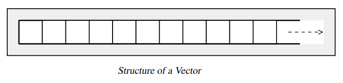


- 模板：`template <typename T> void Show(T arrNum[], int len);`


##### 1.4.1.2.2. 成员函数
- `size()`: 返回容器中元素的个数
- `get(r)`: 获取秩（索引）为r的元素
- `put(r, e)`: 用e替换秩为r元素的数值
- `insert(r, e)`: 向秩为r的元素处插入数值e，后面元素依次后移
- `remove(r)`: 初除秩为 `r` 的元素，返回全元素中原存放的对象
- `disordered()`: 判断所有元素是否已按升序序排列
- `sort()`: 调整各元素癿位置，使按照升序序排列
- `deduplicate()`: 删除重复元素   ---向量
- `uniquify()`: 删除重复元素 ---有序向量
- `traverse()`: 遍历向量幵统一处理所有元素，处理斱法由函数对象指定
- `empty()`: 判断容器是否为空
- `at(index)`: 返回索引为index的元素
- `erase(p)`: 删除指针p指向位置的数据，返回下指向下一个数据位置的指针（迭代器）
- `erase(beg, end)`:删除区间`[beg, end)`的数据
- `pop_back()`: 删除最后一个元素
- `push_back()`: 在容器末尾插入一个元素
- `back()`: 获取尾部元素
- `front()`: 获取首部元素
- `begin(), end()`: 返回容器首尾元素的迭代器
- `clear()`: 移除容器中所有的元素
- `swap()`: 交换两个容器的内容，交换两个 vector 的内容后，两者的容量也交换了，这是一个间接缩短vector的小窍门。
- `shrink_to_fit()`: 缩短vector的大小到合适的空间，为实现特定的优化保留了回旋的余地。
- `resize()`: 重新设置vector的容量


##### 1.4.1.2.3. 优点
- 不指定一块内存大小的数组的连续存储，即可以像数组一样操作，但可以对此数组进行动态操作，运行阶段执行。
- 随机访问快，支持随机迭代访问器。即支持 `[]` 操作符和 `at()`操作。
- 节省空间。

                      
##### 1.4.1.2.4. 缺点
- 向容器中插入元素时，内部的元素必须能够执行 `拷贝（必须提供拷贝构造）` 操作。
- 在内部进行插入删除操作效率低。
- 只能在vector的最后进行push和pop，不能在vector的头进行push和pop。
- 当动态添加的数据超过vector默认分配的大小时要进行整体的重新分配、拷贝与释放。


#### 1.4.1.3. deque（双端数组）
deque是在功能上合并了vector和list。与 `vector` 容器类似，但是可以在 `Deque` 的两端进行操作。


##### 1.4.1.3.1. 内部结构图
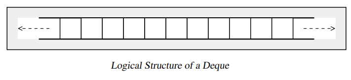
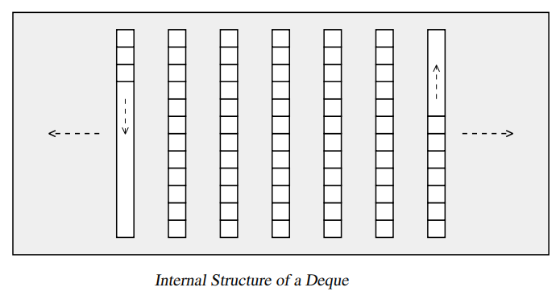
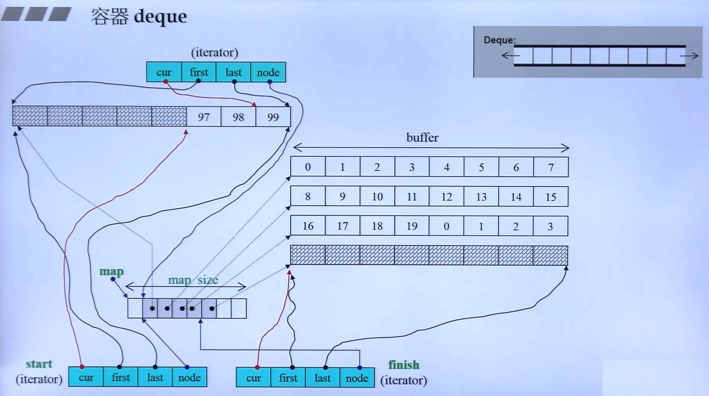

##### 1.4.1.3.2. 成员函数
- `push_back()`: 在容器末尾插入一个元素
- `push_front()` 容器头部插入一个元素
- `pop_front()`: 容器头部删除一个元素
- `pop_back()`: 删除最后一个元素


##### 1.4.1.3.3. 优点
- 支持随机访问，即支持 `[]`操作符和 `at()`。
- 在内部方便的进行插入和删除操作
- 可在两端进行push、pop

##### 1.4.1.3.4. 缺点
- 每次扩容的大小为一个 buffer。
- 占用内存多。


#### 1.4.1.4. list（双向链表）
list是一个双向链表的容器，可以高效的进行 `插入` 和 `删除` 元素。每一个结点都包括一个信息快Info、一个前驱指针Pre、一个后驱指针Post。可以不分配固定的内存大小，方便的进行添加和删除操作，使用的是非连续的内存空间进行存储。


##### 1.4.1.4.1. list插入
- 链表的插入操作：在 pos 位置插入新的节点，新插入的数据存放在 pos 位置之前。


##### 1.4.1.4.2. list 的删除
- `clear()` 移除容器中所有的数据
- `erase(begin, end)` 删除区间 `[begin, end)` 的数据，返回下一个元素的位置。
- `erase(pos)` 删除指定 pos 位置的数据，返回下一个元素的位置。
- `remove(element)` 删除容器中所有与 element 值匹配的数据。 


##### 1.4.1.4.3. 内部结构图
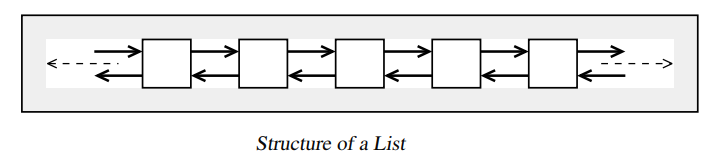
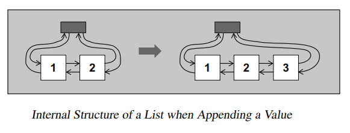

##### 1.4.1.4.4. 优点
- 不使用连续内存完成动态操作。
- 在内部方便的进行插入和删除操作
- 可在两端进行push、pop


##### 1.4.1.4.5. 缺点
- 每次只能扩充一个结点，效率低，但空间浪费是最小的。
- 不能进行内部的随机访问，即不支持 `at.(pos)` 函数和 `[]` 操作符。
- 相对于verctor占用内存多。


#### 1.4.1.5. forword list(单向链表)
`forword list` 链表是C++11新加的功能，比list的效率要快，是单向的链表。

##### 1.4.1.5.1. 内部结构图  
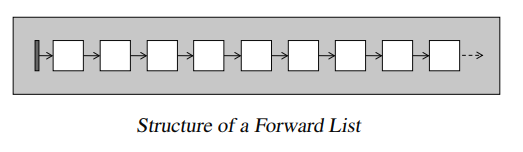

##### 1.4.1.5.2. 缺点
- 只能扩充一个结点。


### 1.4.2. Associative containers(关联性容器)
关联式容器并不提供元素的直接访问，需要依靠迭代器访问。map 是个例外，提供了subscript(下标)操作符，支持元素的直接访问。


#### 1.4.2.1. set && multiset
> set 是一个 `集合` 容器，包含的元素是唯一的，集合中的元素按照一定的顺序排列，不能随意指定位置插入元素。

> collection of keys, sorted by keys. 容器中的 key 可以重复。


- set 底层采用红黑树的数据结构实现的。
- set 支持唯一的键值，容器里面的元素值只能出现一次，而 `multiset` 集合容器中同一个元素值可以出现多次。
- 不可以直接修改 set和multiset集合容器中元素的值，因为集合容器是自动排序的。修改集合容器中元素的值，必须先删除原先元素的值，再插入新元素的值。

##### 1.4.2.1.1. 内部结构图  
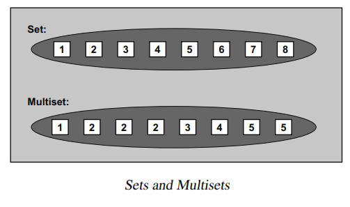
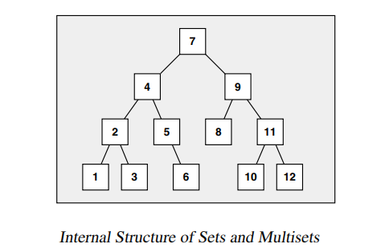


- `insert()` 函数的返回值类型为 `pair<iterator, bool>`，结果是一对数据类型。
  ```
  pair<T1, T2> 存放两个不同类型的数值
  ```

##### 1.4.2.1.2. set 容器中的查找
- `find()` 返回查找元素的迭代器，查找的元素默认是区分大小写的。
- `count()` 返回容器中查找元素的个数
- `upper_bound` 返回容器中大于查找元素的迭代器位置
- `lower_bound` 返回容器中小于查找元素的迭代器位置
- `equal_range(ele)`返回容器中等于查找元素的两个上下限的迭代器位置（第一个：大于等于ele元素的位置，第二个：大于 ele元素的位置）

##### 1.4.2.1.3. 优点
##### 1.4.2.1.4. 缺点


#### 1.4.2.2. map && mutimap
map 是关联式容器，一个 map 就是一个键值对。map 中的 `key` 值唯一，容器中的元素按照一定的顺序排列，不能在任意指定的位置插入元素。

multimap (collection of key-value pairs, sorted by keys.)


- map 的底层原理是按照平衡二叉树的数据结构来实现的，在插入和删除的操作上比 `vector` 容器快。
- map 支持唯一的键值，每个 `key` 只能出现一次，支持 `[]` 操作，形如：`map[key] = value`。 `multimap` 不支持唯一的键值，容器中的每个 `key` 可以出现相同的多次，不支持 `[]` 操作。

- map和multimap会根据元素的 `key` 自动对元素排序。这么一来，根据已知的 `key` 查找某个元素时就能够有很好的效率，而根据己知 `value` 查找元素时，效率就很糟糕。“自动排序"这一性质使得 map 和 multimap 本身有了一条重要限制：你不可以直接改变元素的 `key`。因为这样做会损坏正确的次序。想要修改元素的 `key` ，必须先移除拥有该 `key` 的元素，然后插人拥有新 `key/value` 的元素。从迭代器的视角看，元素的 `key` 是常量。然而直接修改元素的 `value` 是可能的，提供的值的类型不能是 `constant`。


##### 1.4.2.2.1. map与multimap内部结构图  
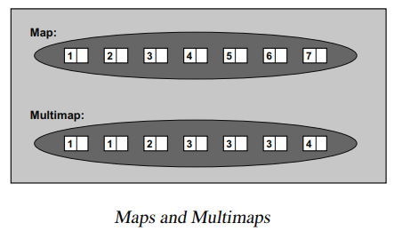
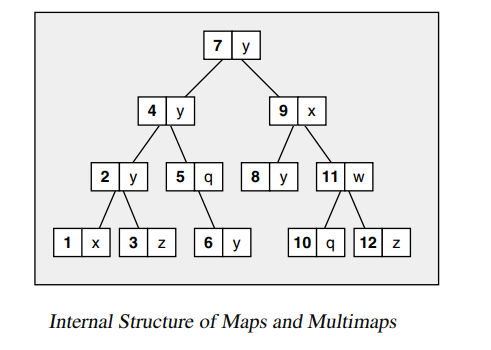


##### 1.4.2.2.2. map insert
```C++
  // 四种map容器的插入方法
  map<int, string> mp;
  mp.insert(pair<int, string>(101, "赵云"));                   // 法一
  mp.insert(make_pair<int, string>(102, "关羽"));              // 法二
  mp.insert(map<int, string>::value_type(103, "曹操"));        // 发三
  mp[104] = "张飞";                                            // 法四

  // 方法一到方法三向容器中插入相同的键值时，不会插入成功。
  // 采用法四向容器中插入相同的键值时，会覆盖原先相同键值的数据。
```

- <font color=red>注意:</font> 
  - map的查找操作需要做异常判断处理
  - key 与 value 两个值必须是可拷贝的(copyable)和可移动的(movable)。
  - 指定的排序准则下，key 必须是可比较的(comparable)。

##### 1.4.2.2.3. at() && [] 操作
- `at()` 函数会根据它收到的 `key` 得到元素的 `value`，如果不存在这样的元素，则抛出 `out_of_range` 异常。


- `operator []`
  - `operator []` 的索引就是 `key`，其类型可能属于任何的类型，不一定是整数。
  - 如果你选择某 `key` 作为索引，容器内没有相应的元素，那么 map 会自动安插一个新元素，其 value 将被其类型的 default 构造函数初始化。因此你不可以指定一个 `不具 default 构造函数的 value 类型`。一般基础类型都有一个 `default 构造函数`，设初值为 `0`。


##### 1.4.2.2.4. 优点
插入键值的元素不允许重复，只对元素的键值进行比较，元素的各项数据可以通过 key 值进行检索。 

##### 1.4.2.2.5. 缺点


### 1.4.3. Unordered associative containers(无序关联容器)


#### 1.4.3.1. unordered_set && unordered_multiset
> `unordered_set` 是一种无序的容器集合。底层采用哈希表实现的。

- STL无序容器存储状态，hash表存储结构图
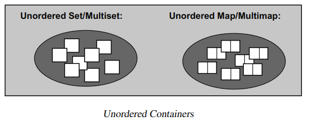
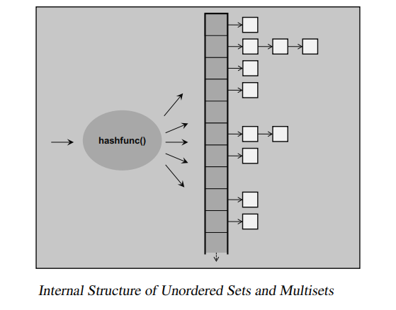
  

- `unordered_set` 模板类中的定义
  ```C++
  template<typename _Value,                        // 容器中存储元素的类型
          typename _Hash = hash<_Value>,           // 确定元素存储位置的哈希函数
          typename _Pred = std::equal_to<_Value>,  // 判断各个元素是否相等
          typename _Alloc = std::allocator<_Value>, // 指定分配器对象的类型
          typename _Tr = __uset_traits<__cache_default<_Value, _Hash>::value>>
  ```

- 注意：此容器模板类中没有重载 `[ ]` 运算符，也没有提供 `at()` 成员方法，`unordered_set` 容器内部存储的元素值不能被修改，可以使用迭代器遍历容器中的数，但不能修改容器中元素的值。


- hash table 为了解决冲突采用 `separate chaining` 的方式。


#### 1.4.3.2. unordered_map && unordered_multimap
- 内部结构图
- 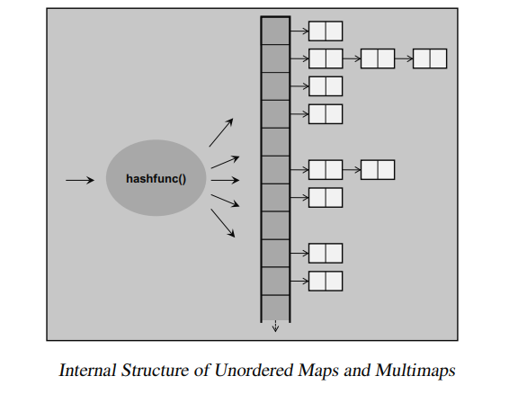


### 1.4.4. Containers Difference(容器之间的差异性)
和其他所有关联式容器一样，`map/multimap` 底层是以平衡二叉树完成的。C++ standard 并未明定这一点，但是从map和multimap各项操作的复杂度自然可以得出这一结念。通常set、multiset、map和multimp都使用相同的内部结构，因此，你可以把set和multiset视为特殊的map和multimp，只不过set元素的 `value和key是同一对象`。因此，map和multimap拥有set和multiset的所有能力和所有操作。当然，某些细微差异还是有的：首先，它们的元素是key/value pair，其次，map可作为关联式数组(associative array)来使用。

vector list map set容器如何选择？
- list和vector最主要的区别在于vector是使用连续内存存储的，他支持 `[]` 运算符，而list是底层用链表数据结构实现的，不支持 `[]` 。
- Vector对元素随机访问的速度很快，但是在头部插入元素速度很慢，在尾部插入速度很快。
- List对于随机访问速度慢得多，因为需要遍历整个链表才能做到，但是对元素的插入就快的多了，不需要拷贝和移动数据，只需要改变指针的指向就可以了。另外对于新添加的元素，Vector有一套算法，而List可以任意加入。
- Map、Set属于关联性容器，底层是采用红黑树实现的，它的插入、删除效率比其他序列容器高，因为它不需要做内存拷贝和内存移动，而是改变指向节点的指针。
- Set和Vector的区别在于Set容器不包含重复的数据。Set和Map的区别在于Set只含有Key，而Map有一个Key和Key所对应的Value两个元素。
- Map和Hash_Map的区别是Hash_Map使用了Hash算法来加快查找过程，但是需要更多的内存来存放这些Hash桶元素，因此可以算得上是采用空间来换取时间策略。


   1 如果你需要高效的随即存取，而不在乎插入和删除的效率，使用vector 
     2 如果你需要大量的插入和删除，而不关心随即存取，则应使用list 
     3 如果你需要随即存取，而且关心两端数据的插入和删除，则应使用deque


### 1.4.5. Container adaptors(容器适配器)
容器适配器为有序的容器提供了不同的接口。queue和stack底层完全借助 deque实现的。


#### 1.4.5.1. stack
- 内部结构图
- 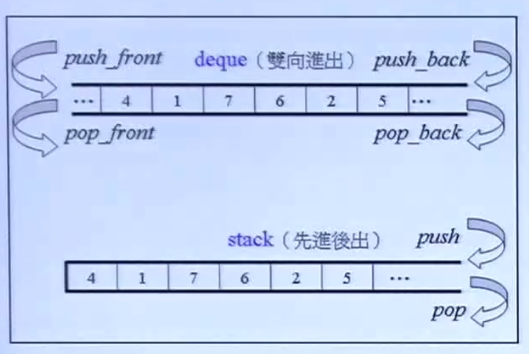

- 函数接口
  - `push()` 入栈
  - `pop()` 出栈
  - `top()` 获取栈顶元素
  - `size()` 获取栈大小
  - `empty()` 栈为空


#### 1.4.5.2. queue
- 内部结构图
- 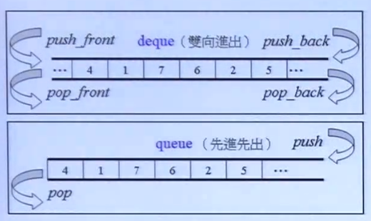

- 函数接口
  - `push()` 入队列
  - `pop()` 出队列
  - `empty()` 对列为空
  - `front()` 队列头部元素
  


#### 1.4.5.3. priority_queue(优先级队列)
##### 1.4.5.3.1. 什么是优先级队列


##### 1.4.5.3.2. 标准库接口
```C++
// 最大或最小优先级队列变量的声明 

priority_queue<int> g_priq;                            // 默认为最大值优先队列
priority_queue<int, vector<int>, greater<int>> l_priq; // 最小值优先队列
```


## 1.5. Algorithm
- 从实现的角度来看，STL算法是一种 `function template`。

- STL算法的核心思想
  - STL通过类模板技术，实现了数据类型与容器模型的分离。
  - 通过函数对象实现了自定义数据类型与底层算法的分离。
  - 通过迭代器的方式统一的去遍历容器，向容器中读数据和写数据。


### 1.5.1. heap
- heap(堆)的STL库中函数
  - `make_heap(first, last, comp);` 建立一个空堆；
  - `push_heap(first, last, comp);` 向堆中插入一个新元素；
  - `top_heap(first, last, comp); ` 获取当前堆顶元素的值；
  - `sort_heap(first, last, comp);` 对当前堆进行排序；


### 1.5.2. 其它函数
- `for_each()` 遍历容器中的所有元素。
- `transform()` 将容器中的数据进行某种转换的运算。
  - 两个算法的区别
    - `for_each()` 使用的函数对象可以没有 `返回值`，参数一般传 `reference`，因此速度较快，不是很灵活。
    - `transform()` 使用的函数对象必须要有 `返回值`，参数一般传 `value`，因此速度较慢，但是很灵活。
- `adjacent()` 查找一对相邻位置重复的元素，找到则返回指向这对元素的第一个元素的迭代器值。
- `distance()` 迭代器下标的位置。
- `binary_search()` 采用二分法在有序序列中查找 value，找到则返回 true。在无序的序列中不能使用。
- `count()` 计数容器中指定元素的个数。
- `count_if()` 使用 `谓词` 计数容器中指定条件元素的个数。
- `find()` 
- `find_if()` 
- `merge()`  合并两个有序的序列，并存放到另一个序列中。
- `sort()` 默认按照升序的方式重新排列指定范围内元素的元素。
- `random_shuffle()` 对指定范围内的元素随机进行排序。
- `reverse()` 对指定范围内的元素进行倒叙排序。
- `copy()` 将一个容器中的元素值拷贝到另一个容器中
- `replace()` 将指定范围内的 `oldValue` 替换为 `newValue`
- `replace_if()` 将指定范围内的 `oldValue` 替换为 `newValue`，需要指定 `函数对象`（是自定义的函数对象或STL预定义的函数对象）。
- `swap()`  交换两个容器
- `accumulate()` 累加遍历容器中指定范围内的元素，并在结果上加一个指定的值。
- `stable_partition()`函数
- `upper_bound()` 函数
- `lower_bound()` 函数
- `std::floor` 和 `std::ceil`都是对变量进行四舍五入，只不过四舍五入的方向不同。 
  - `std::floor` -->向下取整数。`5.88   std::floor(5.88) = 5;`
  - `std::ceil ` -->向上取整数。`std::ceil(5.88)   = 6;`


     

## 1.6. Adaptor(适配器)
### 1.6.1. 什么是适配器？
> 一种用来修饰容器(containers)或仿函数(functor)或迭代器(iterators)接口的东西。改变 `functor` 接口者，称为 `function adaptor`；改变 `container` 接口者，称为 `container adaptor`；改变 `iterator` 接口者，称为 `iterator adaptor`。


### 1.6.2. 函数适配器
  - bind adaptor(绑定适配器)
  - composite adaptor(组合适配器)
  - pointer adaptor(指针适配器)
  - member function adaptor(成员函数适配器) 

predicate: 判断这个条件是真还是假


## 1.7. Functor(仿函数)
### 1.7.1. 什么是仿函数？
  > 仿函数(Functor)也叫函数对象(Function object)或者叫伪函数。它是在 `struct` 结构体中定义一种新的函数。从实现的角度看，仿函数是一种重载了 `operator()` 的 `class` 或 `class template`。一般函数指针可视为狭义的仿函数。 

### 1.7.2. 分类
  - 预定义函数对象：标准STL模板库中提前预定义了很多的函数对象。
  - 用户自定义的函数对象 。
    > Function object(函数对象): 需要重载 `()` 操作运算符。函数对象的调用与 `回调函数` 的调用类似。

### 1.7.3. 函数对象调用
  - 函数对象可以做函数参数。 
  - 函数对象可以做返回值。 
  ```C++
  class Stu
  {
    private:
    public:
      void operator() (Stu& T) {}
  }
  ``` 


## 1.8. Iterator(迭代器)
### 1.8.1. 什么是迭代器？
> 表示元素在容器中的位置，这种对象的概念就称为迭代器。(STL标准库中的解释：we need a concept of an object that represents positions of elements in a container. This concept exists.Objects that fulfill this concept are called iterators.  
> 迭代器就是一种泛化的指针，是一个可遍历STL容器中全部或部分元素的对象。从实现的角度看，迭代器是一种将 `operator*`, `operator->`, `operator++`, `operator--` 等指针操作给予重载的 `class template`。


### 1.8.2. 基本操作
- `operator *`: 返回当前位置上元素的值。
- `operator ++ 或 operator --`: 让迭代器指向下一个或上一个元素。
- `operator == 或 operator !=`: 判断两个迭代器是否指向同一个位置。
- `operator =`: 赋值给迭代器  

> 不同的迭代器也许是 `smart pointers`，具有遍历复杂数据结构的能力，其内部运作机制取决于所遍历的数据结构。每一种容器都必须提供自己的迭代器。事实上每一种容器的确都将其迭代器以嵌套方式定义与 class 内部，因此各种迭代器的接口（interface）虽然相同，但类型（type）却是各不相同。


### 1.8.3. half-open range(前闭后开区间)
- begin: 返回一个迭代器，指向容器中第一个元素的位置。
- end: 返回一个迭代器，指向容器的终点，终点位于最后一个元素的下一个位置。
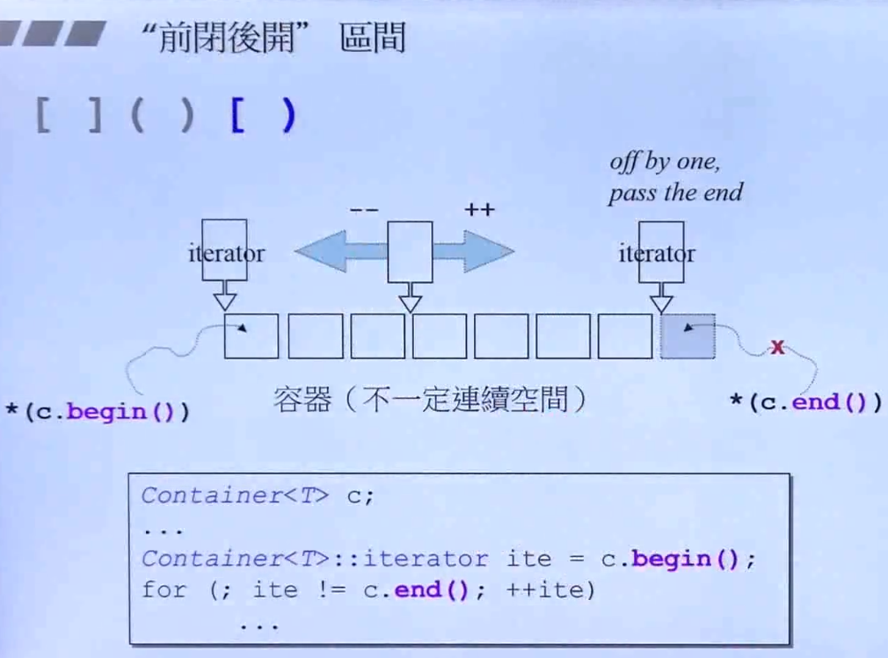


- 采用半开区间的优点？
  - 给遍历元素时，循环（loop）结束的时候，提供一个简单的判断依据。只要尚未达 `end()`，loop就继续执行。
  - 避免对空区间（empty ranges）采取特殊的处理。对于 `empty ranges` 而言，`begin()` 就等于 `end()`。


### 1.8.4. 迭代器失效的原因？
- 参考
  - [迭代器失效的几种情况总结](https://blog.csdn.net/lujiandong1/article/details/49872763) 
  - [聊聊map和vector的迭代器失效问题](https://blog.csdn.net/stpeace/article/details/46507451?utm_medium=distribute.pc_relevant_t0.none-task-blog-BlogCommendFromMachineLearnPai2-1.control&dist_request_id=2cff67d7-d841-4421-bbca-7f85ba6e0330&depth_1-utm_source=distribute.pc_relevant_t0.none-task-blog-BlogCommendFromMachineLearnPai2-1.control)
  - [C++ STL 迭代器失效问题](https://www.cnblogs.com/qiaoconglovelife/p/5370396.html)

- 何为迭代器失效？
  - STL容器中元素整体“迁移”导致存放原容器元素的空间不再有效，使原本指向某元素的迭代器不再指向希望指向的元素，从而使得指向原空间的迭代器失效。 


-  对于序列式容器，比如vector，删除当前的iterator会使后面所有元素的iterator都失效。因为序列式容器中内存是连续分配的（分配一个数组作为内存），删除一个元素导致后面所有的元素会向前移动一个位置。删除了一个元素，该元素后面的所有元素都要挪位置，所以，删除一个数据后，其他数据的地址发生了变化，之前获取的迭代器根据原有的信息就访问不到正确的数据。

- 数组型数据结构的元素是分配在连续的内存中，`insert` 和 `erase` 操作，会使删除点和插入点之后的元素挪位置。所以，插入点和删除掉之后的迭代器全部失效，也就是说 `insert(*iter)(或erase(*iter))`，然后再 `iter++`，是没有意义的。
  - 解决方法：`erase(*iter)`的返回值是下一个有效迭代器的值 `iter =cont.erase(iter);`

- list型的数据结构，使用了不连续分配的内存，删除运算使指向删除位置的迭代器失效，但是不会失效其他迭代器。
  - 解决办法两种，`erase(*iter)` 会返回下一个有效迭代器的值，或者`erase(iter++)`。

- 红黑树存储的数据，插入操作不会使任何迭代器失效；删除操作使指向删除位置的迭代器失效，但不会失效其他迭代器。`erase` 迭代器只是被删元素的迭代器失效，但是返回值为 `void`，所以要采用 `erase(iter++)`的方式删除迭代器。

<font color=red>注意：</font>  经过 `erase(iter)` 之后的迭代器完全失效，该迭代器 `iter` 不能参与任何运算，包括 `iter++和*ite`。


## 1.9. Allocator(分配器)
- 什么是Allocator？
  > 负责内存空间的分配与管理。分配器是一个实现了动态空间配置、空间管理、空间释放的 `class template`。
  

