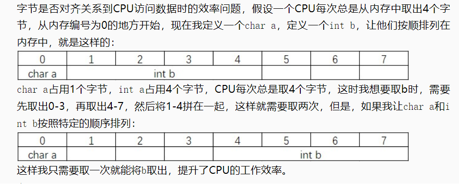

<!--
 * @Author: JohnJeep
 * @Date: 2019-09-16 20:47:29
 * @LastEditTime: 2021-01-25 11:04:04
 * @LastEditors: Please set LastEditors
 * @Description: C语言结构体
--> 

## 结构体定义（3种）
- 声明结构体包括两步
  - 定义结构体
  - 声明相应结构体类型的变量（结构体能包含C语言允许的所有类型变量）
- 法一：在定义结构体类型的同时说明结构体变量
```
struct 结构体标识符
{
    成员变量列表;
}变量名列表;
```
- 法二:直接说明结构体变量
```
struct
{
    成员变量列表;
}变量名列表;
```
- 法三：先定义结构体，再说明结构体变量
```
struct 结构体标识符
{
    成员变量列表;
};
struct 结构体标识符 变量名列表;
```


## 调用结构体：
- 普通结构体
<font color=red> . 成员变量的引用 </font> `结构体变量名.成员名`
- 结构体指针两种表示
    - `(* 变量名).成员字段名` :点操作(.)比取值操作符(*)有更高的优先级，所以要加括号
    - <font color=red> -> 指针成员变量引用 </font> `结构体指针变量名字->成员名`


## 初始化结构体(两种方法)
- <font color="red">在声明结构体类型时，不能指直接赋值，而是要定义结构体变量后才可以赋值。结构体是一种类型，而不是一个变量。</font>
- 声明结构体变量后，单独初始化每个成员
- 通过集合符号对结构体变量进行初始化，使用花括号。变量之间用逗号隔开，成员字段按指定顺序查值并初始化。
- 使用结构体指针之前，必须对其进行初始化 
- <font color="red">结构体只是一种 `类型`，不是变量。 </font>


## 结构体嵌套
- 一个结构体成员列表中嵌套另外一种数据类型的结构体，并声明该结构体类型的变量
```C
struct Student{
    char name[20];
    char sex;
    int age;
    struct Teacher{
                    int num;
                    char subject[20];
                    char address[30];
                }teacher;
            }Stu;

```
- 定义一个结构体数据类型时候，成员列表中可以定义若干个其他数据类型的结构体，并同时声明该类型的结构体变量
```C
struct Student{
                char name[20];
                char sex;
                int age;
                struct Teacher{
                                int num;
                                char subject[20];
                                char address[30];
                                struct unit{
                                            char company[30];
                                            char company_addr[30];
                                           }units;
                              }teacher;
              }Stu;
```


## 结构体填充与数据对齐
- 参考
  - [C语言#pragma预处理](http://c.biancheng.net/cpp/html/469.html)
  - [百度百科字长解释](https://baike.baidu.com/item/%E5%AD%97%E9%95%BF)
  - [C语言字节对齐](https://www.lagou.com/lgeduarticle/96362.html)


- 结构变量的大小等于它包含所有变量的总大小。
- 结构体填充：是编译器用来对齐内存偏移数据。
- 字段填充：为了提高性能，编译器在结构体中利用结构体填充方法进行数据对齐。
- 数据对齐：当CPU读写内存时，它都在小块内（字长或4个字节）进行。这种安排增加了系统的性能，有效地将数据存放在字长整数倍的偏移地址。
  -  结构体中每个数据类型都要对齐
  -  联合体中按照最大长度的数据类型对齐
  -  按照基本数据类型对齐


- 为什么要字节对齐？
  - 现代计算机中内存的存储理论上都是按照 `byte` 大小来存储的，但实际上是按照 `字长（word size）` 为单位存储的。
  - 是减少CPU访问内存的次数，加大CPU访问内存的吞吐量。比如同样读取8个字节的数据，一次读取4个字节那么只需要读取2次。
    <p align="center"> </p>


- 字节对齐方法
  - C编译器中采用`#pragma`指令`#pragma pack(n)` 编译器将按照 `n` 个字节对齐
  - `_packed`: 按照一字节对齐。packed一般会以降低运行性能为代价，由于大多数cpu处理数据在合适的字节边界数的情况下会更有效，packed的使用会破坏这种自然的边界数。
  - GCC编译器中采用 `attribute((aligned (n)))`方式对齐。
    > 让所作用的结构成员对齐在 `n` 字节自然边界上。如果结构体中有成员的长度大于 `n`，则按照最大成员的长度来对齐。
  - GCC编译器中采用`attribute ((packed))` 取消结构在编译过程中的优化对齐，按照实际占用字节数进行对齐。


- 结构体字节对齐的细节和具体编译器实现相关，但一般而言满足三个准则
   - 结构体变量的首地址能够被其最宽基本类型成员的大小所整除；
   - 结构体每个成员相对结构体首地址的偏移量(offset)都是成员大小的整数倍，如有需要编译器会在成员之间加上填充字节(internal adding)；
   - 结构体的总大小为结构体最宽基本类型成员大小的整数倍，如有需要编译器会在最末一个成员之后加上填充字节{trailing padding}。


## 传递结构体指针变量
- 为什么要用？
> 结构体中数据成员变量的数据非常大，采用结构体指针变量比传递值得效率要高，花费的时间少。
