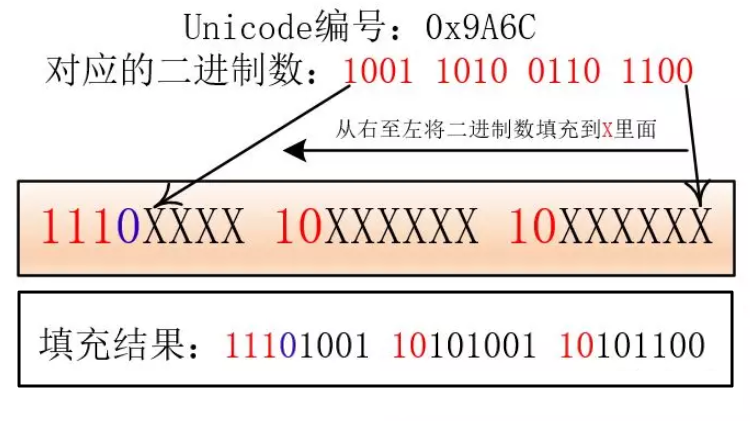
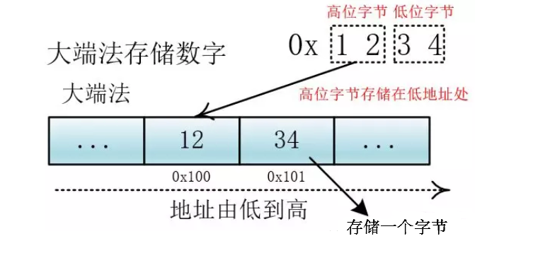

<!--
 * @Author: JohnJeep
 * @Date: 2019-08-23 11:58:29
 * @LastEditTime: 2021-01-25 11:02:31
 * @LastEditors: Please set LastEditors
 * @Description: 编码规范笔记
--> 

<!-- TOC -->

- [1. 编码规范](#1-编码规范)
  - [1.1. 参考](#11-参考)
  - [1.2. 基本概念](#12-基本概念)
  - [1.3. 乱码怎样产生的？](#13-乱码怎样产生的)
  - [1.4. 字节序](#14-字节序)

<!-- /TOC -->

# 1. 编码规范
## 1.1. 参考
  - [参考一](https://blog.csdn.net/Deft_MKJing/article/details/79460485)
  - [阮一峰 字符编码笔记：ASCII，Unicode和UTF-8](http://www.ruanyifeng.com/blog/2007/10/ascii_unicode_and_utf-8.html)
  - [百度解释Unicode](https://baike.baidu.com/item/Unicode)
  - [详细讲解了 Unicode与UTF-8的区别](https://blog.csdn.net/qq_36761831/article/details/82291166)

## 1.2. 基本概念
- 字符集：二进制编码到字符的映射
- ASCII: (American Standard Code for Information Interchange，美国标准信息交换码）
  - 规定了128个字符的编码
  - 只占用了一个字节的后面7位，最前面的一位统一规定为0
  - 在计算机的存储单元中，一个ASCII码值==占一个字节==(8个二进制位)，其最高位(b7)用作奇偶校验位。
- ISO: 国际标准化组织（International Organization for Standardization）
- ANSI: 美国国家标准协会(American National Standards Institute)
- Unicode
  - 通用多八位编码字符集(Universal Multiple-Octet Coded Character Set) ：简称UCS
  -  Unicode是一个字符集，Unicode是为了解决传统的字符编码方案的局限而产生的，它为每种语言中的每个字符设定了统一并且唯一的二进制编码，以满足跨语言、跨平台进行文本转换、处理的要求。
  -  采用==两个字节==来表示一个字符，是一种16 位编码方式
  -  在表示一个Unicode的字符时，通常会用“U+”然后紧接着一组十六进制的数字来表示这一个字符
  -  在Unicode 3.0里使用“U-”然后紧接着八位数，而“U+”则必须随后紧接着四位数
  

  

- 中文编码: GB2312
  - 采用两个字节表示一个汉字
  - 理论上最多可以表示 256 x 256 = 65536 个符号，收录了6763个汉字
- UTF-8 (Unicode Transformation Format 8)
  - 以字节为单位对Unicode进行编码
  - 它是一种变长的编码方式,它可以使==用1~6个字节==表示一个符号，根据不同的符号而变化字节长度
  - 编码规则
    - 如果一个字节的第一位是0，则这个字节单独就是一个字符
    - 如果第一位是1，则连续有多少个1，就表示当前字符占用多少个字节
  

- UTF-16：编码以16位无符号整数为单位
   - 对于编号在U+0000到U+FFFF的字符（常用字符集），直接用两个字节表示。 
  - 编号在 U+10000到U+10FFFF之间的字符，需要用四个字节表示。 
- UFT-32：编码以32位(4字节)无符号整数为单位
  - 每字符直接转化为对应的整数二进制，
- BOM(Byte Order Mark: 字节序标记)
  - BOM是用来判断文本文件是哪一种Unicode编码的标记，其本身是一个Unicode字符（"\uFEFF"），位于文本文件头部。
  - 不同的Unicode中，对应BOM不同的二进制字节
    - UTF-8编码的文件中，BOM占三个字节(EF BB BF UTF8)。UTF-8不需要BOM来表明字节顺序，用来表明编码方式。
    - FE FF UTF16BE(大端)
    - FF FE UTF16LE(小端)

## 1.3. 乱码怎样产生的？
  - 编码与解码的方式不一致
  - 在传输过程中，编码不一致，导致字节丢失。

## 1.4. 字节序
-  大头(Big endian)、小头(Little endian)编码方式
  - Unicode 规范定义，每一个文件的最前面分别加入一个表示编码顺序的字符，这个字符的名字叫做"零宽度非换行空格"（zero width no-break space），用FEFF表示。这正好是两个字
    节，而且FF比FE大1
  - 如果一个文本文件的头两个字节是FEFF，就表示该文件采用大头方式；如果头两个字节是FF FE，就表示该文件采用小头方式。
- 大小端是针对大于一个字节的数的存储问题而言的
  - 大端法：低地址存储高字节
  - 小端法：低地址存储低字节
  

