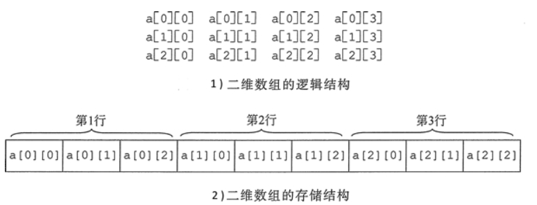

<!--
 * @Author: JohnJeep
 * @Date: 2020-01-16 11:20:34
 * @LastEditTime: 2020-07-29 19:54:19
 * @LastEditors: Please set LastEditors
 * @Description: 指针、数组、字符串综合
--> 
<!-- TOC -->

- [1. 数组](#1-数组)
  - [1.1. 一维数组](#11-一维数组)
  - [1.2. 二维数组](#12-二维数组)
  - [1.3. 数组指针](#13-数组指针)
- [2. 字符串](#2-字符串)
- [3. 二级指针](#3-二级指针)
- [4. 参考](#4-参考)

<!-- /TOC -->

# 1. 数组
## 1.1. 一维数组
- 数组`int a[10];`
  - a: 表示数组首元素的地址。步长为：4
  - &a: 表示整个数组的地址，步长为：4*10=40


## 1.2. 二维数组
- 二维数组名为首对象或首行的地址。 
- 二维数组名加 1 表示跳过一行的空间大小，为下一行的首 地址。
- 行下标、列下标均从 0 开始。
- 称第几个时，习惯上是从第 1 个开始，第 2 个，第 3 个，…，而不从第 0 个开始。
 ```C
  a[0][0]; //为0行0列元素
  a[2][1]; //为2行1列元素
  a[1][1+2]; //为1行3列元素
 ``` 
 - 初始化
  - 分行给出初始化数据，且每行的初始化数据个数等于列数，每行的数据之间使用 `,(逗号)`分隔开。 `int a[2][3]={{1,2,3},{4,5,6}};` 
  - 初始化数据没有分行。`int a[2][3]={l,2,3,4,5,6};`

- 二维数组的存储: 存储结构在计算机内部是线性的。



## 1.3. 数组指针
定义：数组指针是一个指向整个数组的指针。 

1. `typedef int a[10]; A *p = NULL;` 
2. 先定义数组指针类型，再定义变量。`typedef int (*p)[10];  p arr;`
    > [] 和 () 的优先级一样，从左往右结合，指针数组arr是一个数组指针类型。注意与指针数组区分
3. 直接定义数组指针变量。`int (*p)[10]`  ，指针数组p是一个数组指针变量

- 指针数组：是数组，其中每个元素都是指针。例如：`char *argv[]`
- 数组 `p[i]` 与指针 `*(p+i)` 等价。


# 2. 字符串
- 字符串是一种特殊的 char 类型的数组，指向 char 类型数组的指针。
- 字符串与char数组的区别在于长度，字符会自动在尾部加上一个长度‘\0’，而char型数组的长度就是其字符的个数。
- `int *p[]` p与[]先结合，是一个指针数组，数组的数据元素是int型指针，而不是int型数据
- `sizeof()` 遍历字符串，遇到 `\0` 就终止，返回的结果是第一个`\0`前字符元素的个数。`指针声明` 的字符串不能使用 `sizeof()` 方式求字符串的长度。
- `strlen()` 求变量占用内存空间的大小，返回的是存储字符串的变量所占用的内存空间大小，可以用来求字符串的长度。

# 3. 二级指针
- 二级指针是指向一级指针的指针，一级指针是取一次地址，二级指针是取两次地址。即：n 级指针是指向 n-1 级指针的指针，n 级指针是取 n 次地址。
- 二维数组是连续存放的。取了一次地址之后，所有元素的地址就全部知道了，只需要指针的移动就可以遍历所有的元素了，不需要再取一次地址了。


# 4. 参考
- [C语言 输出数组中的全部元素的三种方法](https://blog.csdn.net/qq_26974599/article/details/81296970)


