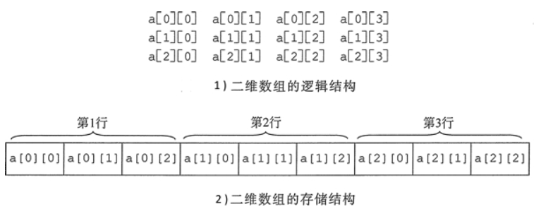

<!--
 * @Author: JohnJeep
 * @Date: 2020-01-16 11:20:34
 * @LastEditTime: 2020-07-09 21:35:27
 * @LastEditors: Please set LastEditors
 * @Description: 数组相关问题
 * @FilePath: /C/24-数组.md
--> 

<!-- TOC -->

- [0.1. 一维数组](#01-一维数组)
- [0.2. 数组指针](#02-数组指针)
- [0.3. 二维数组](#03-二维数组)

<!-- /TOC -->

## 0.1. 一维数组
- 数组`int a[10];`
  - a: 表示数组首元素的地址。步长为：4
  - &a: 表示整个数组的地址，步长为：4*10=40


## 0.2. 数组指针
- 定义：是指针，它指向整个数组的指针。
  1. `typedef int a[10]; A *p = NULL;` 
  2. 先定义数组指针类型，再定义变量。`typedef int (*p)[10];  p arr;`
      > [] 和 () 的优先级一样，从左往右结合，指针数组arr是一个数组指针类型。注意与指针数组区分
  3. 直接定义数组指针变量。`int (*p)[10]`  ，指针数组p是一个数组指针变量
- 指针数组：是数组，其中每个元素都是指针。例如：`char *argv[]`


## 0.3. 二维数组
- 二维数组名为首对象或首行的地址。 
- 二维数组名加 1 表示跳过一行的空间大小，为下一行的首 地址。
- 行下标、列下标均从 0 开始。
- 称第几个时，习惯上是从第 1 个开始，第 2 个，第 3 个，…，而不从第 0 个开始。
 ```
  a[0][0]; //为0行0列元素
  a[2][1]; //为2行1列元素
  a[1][1+2]; //为1行3列元素
 ``` 
 - 初始化
  - 分行给出初始化数据，且每行的初始化数据个数等于列数，每行的数据之间使用 `,(逗号)`分隔开。 `int a[2][3]={{1,2,3},{4,5,6}};` 
  - 初始化数据没有分行。`int a[2][3]={l,2,3,4,5,6};`

- 二维数组的存储: 存储结构在计算机内部是线性的。



