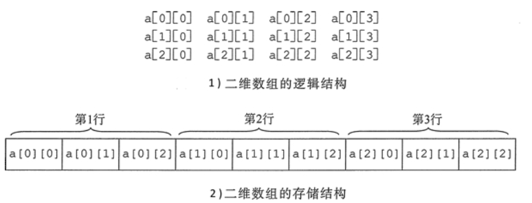

<!--
 * @Author: JohnJeep
 * @Date: 2020-01-16 11:20:34
 * @LastEditTime: 2020-07-29 19:54:19
 * @LastEditors: Please set LastEditors
 * @Description: 指针、数组、字符串综合
--> 
<!-- TOC -->

- [1. 数组](#1-数组)
  - [1.1. 一维数组](#11-一维数组)
  - [1.2. 二维数组](#12-二维数组)
  - [1.3. 数组指针](#13-数组指针)
  - [1.4. 指针数组](#14-指针数组)
- [2. 二级指针](#2-二级指针)
- [3. 参考](#3-参考)

<!-- /TOC -->

# 1. 数组
## 1.1. 一维数组
- 一维数组`int a[10];`
  - `a` : 表示数组首元素的地址。32 位操作系统下，`int` 类型的大小为 4，即 `a+1` 表示数组每次后移一个位置的步长为：4 byte。
  - `&a` : 表示整个数组的地址，步长为：4*10=40 bytes。

- 一维数组 `p[i]` 与指针 `*(p+i)` 这样表示是等价的。


## 1.2. 二维数组
- 二维数组名是首对象或首行的地址。 
- 二维数组名加 1 表示跳过一行的空间大小，为下一行的首 地址。
- 行下标、列下标均从 0 开始。
- 称第几个时，习惯上是从第 1 个开始，第 2 个，第 3 个，…，而不从第 0 个开始。
    ```C
    a[0][0]; //为0行0列元素
    a[2][1]; //为2行1列元素
    a[1][1+2]; //为1行3列元素
    ``` 

 - 初始化
   - 分行出初始化数据，且每行初始化数据的个数等于列数，每行数据之间使用 `,(逗号)`分隔开。 `int a[2][3]={{1,2,3}, {4,5,6}};` 
   - 初始化数据没有分行。`int a[2][3]={l, 2, 3, 4, 5, 6};`

- 二维数组的存储: 存储结构在计算机内部是线性的。



## 1.3. 数组指针
数组指针表示指针指向整个数组的首地址，其本质是一个指针。 

- `int (*ptr)[n]` 表示是一个数组指针，指向一个整型的一维数组的首地址，这个一维数组的长度是 `n`，也可以说是 `ptr` 的步长为 `n`，即当执行 `ptr+1` 时，`ptr` 指针要跨过 `n` 个 int 类型数据的长度。

> 注意： [] 和 () 都位于第一优先级。当优先级一样时，再看运算符的结合性，第一优先级的结合方向是从左往右结合，因此先执行 `()` 中内容后再执行 `[]`。其中`*` 位于第二级优先级，第二优先级的结合方向是从右往左结合。


## 1.4. 指针数组
指针数组表明数组中的每个元素都是指针，其本质是个数组。

- `int *p[n]` 
  > 表示是一个指针数组，`[]` 运算符优先级高与 `*` 运算符， 因此 p 先与 [] 先结合，然后再把它们结合后的值与 `*` 进行结合，最后得到一个 int 类型的指针数组，这个指针数组中有 `n` 个指针类型的数组元素。


# 2. 二级指针
- 二级指针是指向一级指针的指针，一级指针是取一次地址，二级指针是取两次地址。即：n 级指针是指向 n-1 级指针的指针，n 级指针是取 n 次地址。

- 二维数组是连续存放的。取了一次地址之后，所有元素的地址就全部知道了，只需要指针的移动就可以遍历所有的元素了，不需要再取一次地址了。


# 3. 参考
- [C语言 输出数组中的全部元素的三种方法](https://blog.csdn.net/qq_26974599/article/details/81296970)
- [Pointer to an Array | Array Pointer](https://www.geeksforgeeks.org/pointer-array-array-pointer/)
- [百度百科：运算符优先级](https://baike.baidu.com/item/%E8%BF%90%E7%AE%97%E7%AC%A6%E4%BC%98%E5%85%88%E7%BA%A7)

