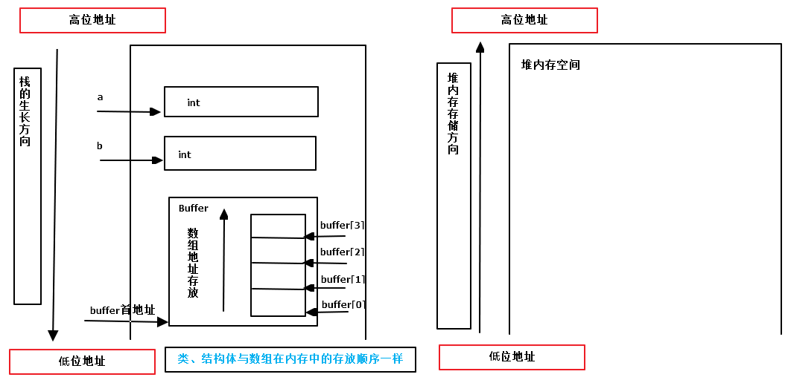

<!--
 * @Author: JohnJeep
 * @Date: 2019-09-06 09:49:29
 * @LastEditTime: 2020-07-31 08:58:56
 * @LastEditors: Please set LastEditors
 * @Description: 内存存放顺序笔记
 * @FilePath: /3-内存存放顺序.md
--> 
## 参考
- [大端小端（Big- Endian和Little-Endian）](https://my.oschina.net/alphajay/blog/5478)
- [详解大端模式和小端模式](https://blog.csdn.net/ce123_zhouwei/article/details/6971544)

## 原则
- 整数类型内部
  - 低地址存储低位，高地址存储高位
- 栈
  - 存放局部变量
  - 先定义高地址，后定义低地址
- 类、结构体或数组的元素
  - 先定义低地址，后定义高地址
  - 数组内存地址分配的公式：`base_address + index * data_size`

