<!--
 * @Author: JohnJeep
 * @Date: 2019-07-17 14:34:30
 * @LastEditTime: 2020-06-01 20:31:56
 * @LastEditors: JohnJeep
 * @Description: C语言中内存、实时内存、虚拟内存相关问题
--> 

<!-- TOC -->

- [内存概念](#内存概念)
- [编译](#编译)
- [代码存储过程](#代码存储过程)
- [分页，分段，逻辑地址，物理地址](#分页分段逻辑地址物理地址)

<!-- /TOC -->

### 内存概念
参考：[汇编语言入门教程](http://www.ruanyifeng.com/blog/2018/01/assembly-language-primer.html)

- 内存：用于存储指令和数据序列，是一组以二进制存储信息的单元，存储容量取决于底层硬件、体系结构、位长(1、2、4、8、16、32、64、128)
  - 永久存储
  - 临时存储
    - 寄存器：位于处理器连接的芯片上
      - 段寄存器：支持段分区和多线程
      - 系统寄存器：主要对系统的初始化和控制进行处理
      - CPU 优先读写寄存器，再由寄存器跟内存交换数据
      - 寄存器不依靠地址区分数据，而依靠名称，每一个寄存器都有自己的名称，要哪个数据CPU直接去哪个寄存器取数据
      - 容量：与CPU类型有关
      - 速度：<10ns
  - cache(缓存)：临时存储数据的高速内存（经常访问的数据）
    - L1cache：较快，距离CPU较近，容量小
    - L2cache：较慢，距离CPU较远，容量大
    - SRAM用作高速cache存储，比DRAM块。
    - 专用指令cache
    - 数据cache
    - 容量：KB
    - 速度：10~50ns
  - RAM(主存)，也叫物理内存
    - 存储待执行的所有数据和指令 
    - 主存的容量直接关系系统处理软件的能力
    - 容量：MB、GB
    - 速度：50~100ns

内存层次排列

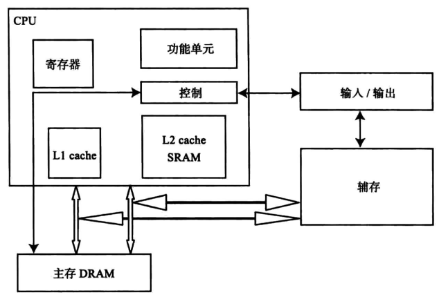

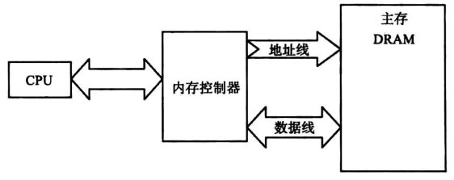

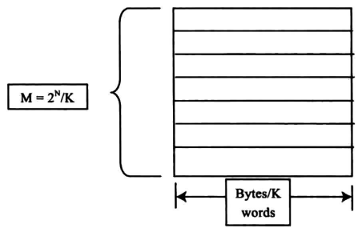

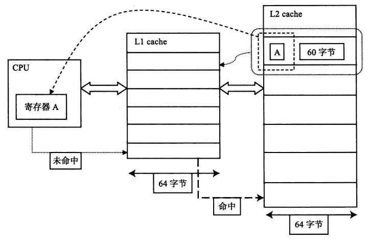

### 编译
- 编译过程
参考文章：[编译器的工作过程](http://www.ruanyifeng.com/blog/2014/11/compiler.html)

- 源代码→预处理→编译→汇编→目标文件→链接→可执行文件
- 预处理
- 编译
- 汇编
- 目标文件
- 链接
  - Windows中启动程序由CRT、DLL提供，Linux中由glibc(libs-start.c)提供。
- 可执行文件
  - 加载器
    - 运行程序时，加载器首先加载程序到内存中， 被加载程序称为进程 ，并由操作系统加载。
    - 主要作用：
      - 验证
      - 从硬盘复制可执行文件到主存中
      - 配置栈
      - 配置寄存器
      - 跳转到程序入口点(_start)
    - 加载器加载可执行文件时，操作系统使用的步骤
      1. 加载器请求操作系统创建一个新进程
      2. 操作系统为新进程建立页表
      3. 用无效入口标记页表
      4. 开始执行程序，生成即时页面错误异常

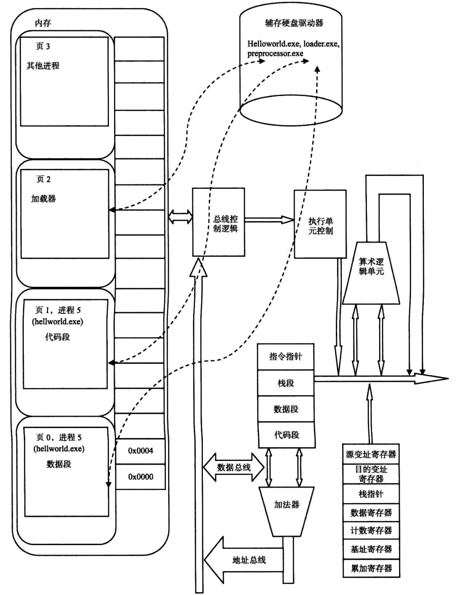

### 代码存储过程
参考文章
- [内存管理（详细版）](https://www.cnblogs.com/yif1991/p/5049638.html)

源代码编译后被分成五个主要部分：代码段、数据段、BSS段、栈区、堆区。
- 代码区（Code Area）
  - 程序加载到内存的时候由操作系统分配，程序结束时由操作系统释放。
  - 所有的可执行代码（程序代码指令、常量字符串等）都加载到代码区，这块内存在程序运行期间是不变的。只能读，不可以写。
  - 代码区是平行的，里面装的是一堆指令，在程序运行期间是不能改变的。
  - 函数也是代码的一部分，故函数都被放在代码区，包括main函数。 

- 数据区
  - 存放程序中所有的全局变量、静态变量和非零值初始化变量。
  - 分配优先于main函数，生存期与程序共存亡。
  - 程序一开始就分配了，直到结束才释放。
  - 可读可写。

- 栈区（stack）
  - 栈（stack）是一种先进后出的内存结构，存储局部变量、函数形参和返回地址。
  - 栈是从高地址向低地址方向增长
  - 在C语言中，函数参数的入栈顺序是从右到左
  - C语言中形参和实参之间是值传递
  - 每个线程都有自己专属的栈；
  - 栈的最大尺寸固定，超出则引起栈溢出；
  - 变量离开作用域后，栈上的内存会由系统自动释放，释放速度很快。
  - 栈分配与释放消耗CPU资源，只能存储少量的数据。

- 堆区（heap）
  - 堆区由操作系统分配给每个进程，动态内存从堆中获取，调用malloc()、calloc()、realloc()函数分配动态内存。
  - 堆区分配的内存仅能通过指针访问。 
  - 调用free()函数将内存还给堆。
  - 堆内存用完不释放，可能会导致内存泄漏。
  - `malloc` 和 `free` 函数底层函数是采用全局指针实现的。

- BSS段(以符号开始的块)
  - 包括所有未初始化的全局变量、用static关键字声明且未初始化的静态全局变量
  - 运行所需空间记录在目标文件中，不在目标文件中占用实际空间
  - 程序启动过程中需要初始化的任意变量都可以存放在BSS段中。

- 什么时候用堆和栈？
  - 如果明确知道数据占用多少内存，那么数据量较小时用栈，较大时用堆 
  - 如果不知道数据量大小（可能需要占用较大内存），最好用堆（因为这样保险些）
  - 如果需要动态创建数组，则用堆

### 分页，分段，逻辑地址，物理地址
参考：
- [内存管理笔记](https://www.cnblogs.com/felixfang/p/3420462.html)
- [Linux的内存分页管理](https://www.cnblogs.com/vamei/p/9329278.html)

- 内存模型分类
  - 内存模型为进程建立物理内存映射，便于CPU访问内
  1. 实地址内存模型
     - 分段：在实模式下通过偏移一个段寄存器的4位再加上16位偏移量，形成一个20位的物理地址
  2. 扁平内存模型
     - 内存空间是连续的
  3. 分段内存模型
     - 将线性地址空间分割为段的小部分，代码、数据、栈被放置在不同的段中
     - 进程团通过逻辑地址从任意段访问数据
     - 处理器将逻辑地址转换成线性地址，并使用线性地址访问内存

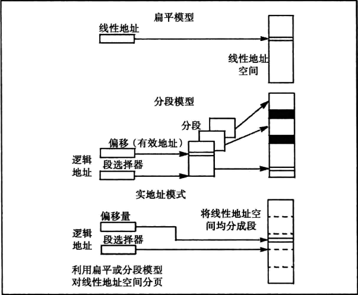

- 物理地址(Physical Address)
  - 定义：在存储器里以字节为单位存储信息，为正确地存放或取得信息，每一个字节单元给以一个唯一的存储器地址；也叫绝对地址，是数据在内存中的实际位置。
  - 用于内存芯片级的单元寻址，与处理器和CPU连接的地址总线相对应。
  - 在地址总线上，以电子形式存在的，使得数据总线可以访问主存的某个特定存储单元的内存地址。
  - 物理地址也叫实地址、二进制地址。

- 逻辑地址(由CPU产生的地址)
  - 定义：从应用程序角度看到的内存单元（memory cell）、存储单元（storage element）、网络主机（network host）的地址。即由程序产生的与段相关的偏移地址部分。
  - (另外一种解释)与当前数据在内存中的物理分配地址无关的一个地址，在执行对内存的访问之前，需要把它转换为物理地址。
  - 逻辑区块地址(Logical Block Address, LBA)：指某个数据区块的地址或是某个地址所指向的数据区块
  - 通过地址翻译器（address translator）或映射函数可以把逻辑地址转化为物理地址。
  - 逻辑地址包括：页号、在该页中的偏移量

- 相对地址：是逻辑地址的一个特例，它是相对于某些已知点的存储单元。（系统采用运行时动态加载的方法把使用相对地址的程序加载到内存中）

- 虚拟地址(Virtual address space)
  - 标识一个虚拟（非物理地址）的实体地址

- 线性地址（Linear Address） 
  - 是逻辑地址到物理地址变换之间的中间层。

- IP(Internet protocol：互联网协议)
  - 由数据体头部和数据体数据区两部分组成。
  - 数据体头部包括IP源地址和IP目标地址，以及其它信息
  - 数据体的数据区包括用户数据协议（UDP），传输控制协议（TCP），还有数据包的其他信息。

- 随机存储：存储器的读取时间和数据所在位置无关

- 内存：存储进程的相关数据；进程不能直接访问内存。

- 虚拟内存：进程能访问的地址，操作系统会把虚拟内存地址翻译成真实的内存地址
  - 两个进程空间可以有相同的虚拟内存地址
  - 虚拟内存地址与物理内存地址一一对应
  - 应用程序只能通过虚拟内存地址进行数据的读写
  - C语言中表达式的地址，都是虚拟地址
  - 进程对物理内存的访问，必须经过操作系统的审查。
  - 借助虚拟内存地址，操作系统可以保障进程空间的独立性。
  - 操作系统可以把同一物理内存区域对应到多个进程空间。这样，不需要任何的数据复制，多个进程就可以看到相同的数据。
  - 所有进程共享一套内核数据：每个进程空间中，最初一部分的虚拟内存地址，都对应到物理内存中预留给内核的空间
  

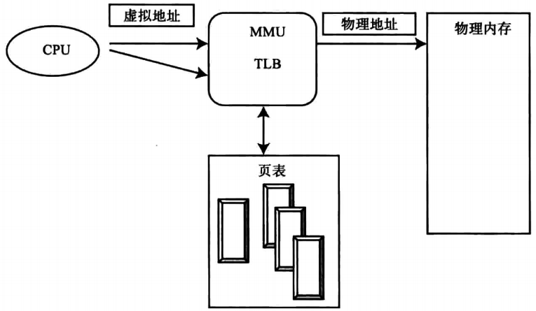

从内核中查看虚拟内存：

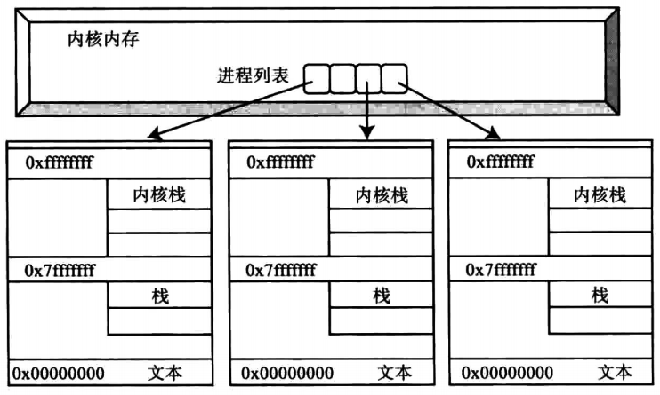

虚拟地址组成：虚拟页号和页偏移字段 

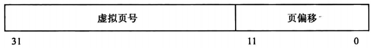

虚拟地址转换成物理地址 

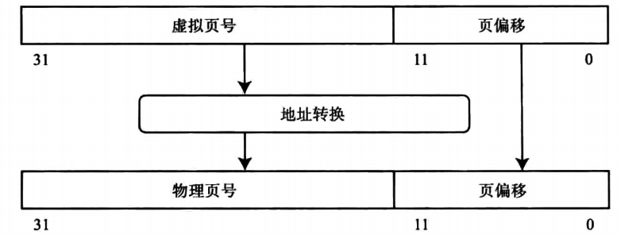

- 帧：将物理内存分为固定大小的块，物理内存使用的单元。(在计算机网络中的定义)
  - 由帧头和帧数据两部分组成。
  - 帧头包括接收方主机物理地址的定位以及其它网络信息。
  - 帧数据区含有一个数据体
- 页：将逻辑内存分为同样大小的块，虚拟内存使用的单元。
- 页框：把可用的物理内存也划分为同样大小的连续的部分，称为块或页框。内核以页框为基本单位管理物理内存
- 内存分页：以更大尺寸的单位页（page）来管理内存。便于管理进程空间和物理页的对应关系
- 地址空间管理：负责分配和管理进程的地址空间
- 地址转换：在专用硬件的MMU(memory management unit)上完成。
- MMU功能
  - 设置CPU的访问级别
  - 处理物理内存与虚拟内存之间的映射。

分页
- 解决分区技术存在的缺陷；将内存分成许多大小相等且很小的页框，每个进程分成许多同样大小固定的页。

分段
- 进程可以划分为许多的段，段的大小无须相等；调入另一个进程时，所有段都装入内存的可用区，并建立一个段表。

内存共享

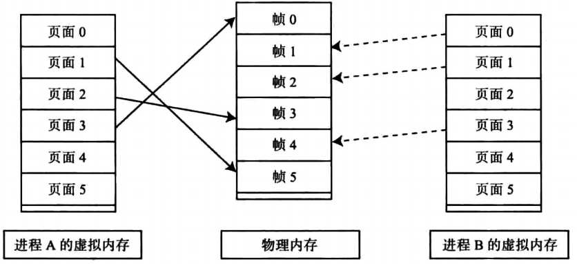

- 页表：页表是一种特殊的数据结构，放在系统空间的页表区，存放逻辑页与物理页帧的对应关系。
  - 每一个进程都拥有一个自己的页表

地址转换到内存物理地址时引用的一个页表

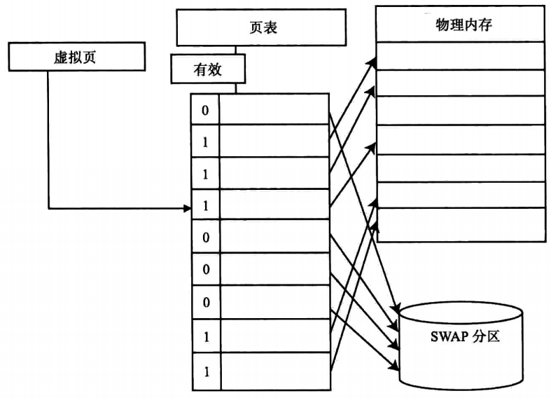

操作系统管理内存时，最小单元为内存页而不是字节。
  - 32位操作系统的内存页一般是4K
  - 比如，初次申请1K内存，操作系统会分配1个内存页，也就是4K内存。
  - 4K是一个折中的选择，因为：内存页越大，内存浪费越多，但操作系统内存调度效率高，不用频繁分配和释放内存；内存页越小，内存浪费越少，但操作系统内存调度效率低，需要频繁分配和释放内存。
  - 嵌入式系统的内存内存资源很稀缺，其内存页会更小，因此在嵌入式开发当中需要特别注意。

- 动态分区采用的三种放置算法
  - 最佳适配(Best fit): 选择与要求大小最接近的块
  - 首次适配(First fit): 从头扫描内存，选择大小足够的第一个可用块
  - 下次适配(Next fit): 从上一次放置的位置开始扫描内存，选择下一个大小足够的可用块 
- 伙伴系统：在并行系统有很多的应用，为并行程序分配和释放内存。

