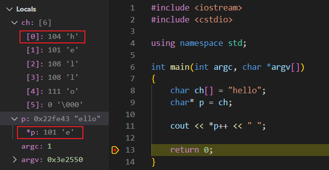
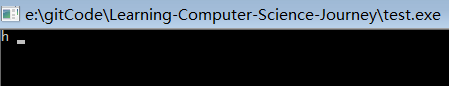

<!--
 * @Author: JohnJeep
 * @Date: 2021-02-26 10:15:21
 * @LastEditTime: 2021-02-26 11:48:27
 * @LastEditors: Please set LastEditors
 * @Description: 探究*和++优先级
-->

## 在项目中遇见了 `*p++` 这种操作，但不明白在 `*p++`中 `++` 和 `*` 是怎样执行的？现在我们来一一剖析它的运算过程。


- C语言中取值运算符 `*` 与前置自增运算符`++`、后置自增运算符`++`都属于单目运算符，运算符的优先级顺序同为第2级，结合方向为 `右到左`。其中，`*` 使用形式为：`*p`，用于指针变量，前置自增使用形式为 `++i`，后置自增使用形式为 `++i`。

- 注意
  - 同一优先级的运算符，运算次序由结合方向所决定。
  - 简单记就是：！ > 算术运算符 > 关系运算符 > && > || > 赋值运算符


用一段代码来说明
```c++
#include <iostream>
#include <cstdio>

using namespace std;

int main(int argc, char *argv[])
{
    char ch[] = "hello";
    char* p = ch;

    cout << *p++ << " ";
    
    return 0;
}
```
运行调试过程：执行 `cout << *p++ << " ";` 这条语句时（不考虑标准库中cout的调用过程），开始时指针p指向字符串 `hello` 的首地址，即图中的 `ch[0]:104 'h'`。执行 `*p++`时，根据两者的优先级顺序在同一级，从右向左的结合性原则，先执行 `++`，后执行 `*` 操作。`p++` 是先执行当前的操作，然后再执行 `++` 操作。 这条语句执行完成后，指针p指向字符串的下一个位置 `ch[1] 101 'e'`。因此我们在终端看到的输出结果为字符 `h`，而程序中 `*p` 的值为 `e`。

运行结果：




- 参考
  - [百度百科解释运算符优先级](https://baike.baidu.com/item/%E8%BF%90%E7%AE%97%E7%AC%A6%E4%BC%98%E5%85%88%E7%BA%A7/4752611?fr=aladdin)  