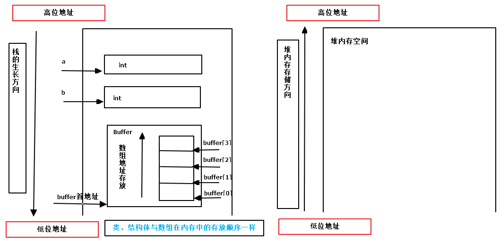

<!--
 * @Author: JohnJeep
 * @Date: 2019-09-06 09:49:29
 * @LastEditTime: 2026-05-31 18:17:26
 * @LastEditors: JohnJeep
 * @Description: Byte Order Notes
 * Copyright (c) 2025 by John Jeep, All Rights Reserved. 
-->

## 原则

- 整数类型内部
  - 低地址存储低位，高地址存储高位
- 栈
  - 存放局部变量
  - 先定义高地址，后定义低地址
- 类、结构体或数组的元素
  - 先定义低地址，后定义高地址
  - 数组内存地址分配的公式：`base_address + index * data_size`

## References

- [大端小端（Big- Endian 和 Little-Endian）](https://my.oschina.net/alphajay/blog/5478)
- [详解大端模式和小端模式](https://blog.csdn.net/ce123_zhouwei/article/details/6971544)

