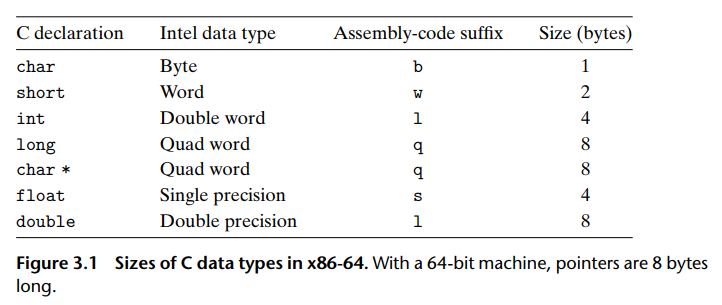

<!--
 * @Author: JohnJeep
 * @Date: 2019-08-22 11:28:29
 * @LastEditTime: 2020-09-23 15:33:13
 * @LastEditors: Please set LastEditors
 * @Description: 变量与数据类型
--> 
# 1. 变量与数据类型
## 1.1. 参考
- [c语言变量的初始化和赋值的区别](https://blog.csdn.net/Com_ma/article/details/78546846)

## 1.2. 术语（Terminology）
- 何为声明（declaration）？
  - 告诉编译器某个东西的类型和名称，即不提供存储的位置和具体实现的细节。 

- 何为定义（definition）？
  - 编译器给变量分配内存空间，即提供存储的位置和具体实现的细节。 

- 注意：在程序中变量可以有`多次声明`，但只能 `定义一次`。

## 1.3. 变量与数据类型的作用和本质
- 类型的本质：固定内存大小的别名
- 数据类型的作用：编译器预算对象(变量)分配的内存空间大小
- 变量的本质：一段连续内存空间的别名
- 变量三要素
  - 名称
  - 大小
  - 作用域
- 变量生命周期

## 1.4. 变量关键点
- 若没有变量，不会得到内存，也就没有变量内存首地址

## 1.5. 数据类型

 - 空类型  void
  - 指针类型
  - 构造类型
    - 数组    array
    - 结构体  struct
    - 联合体  union
    - 枚举类型 enum
  - 基本类型
    - 浮点型
      - 单精度 float  
        - 占 4 byte
        - 精确到小数点后 6 位
      - 双精度 double 
        - 占 8 byte
        - 精确到小数点后 15 位
      - long double  
        - 占 12 byte
        - 精确到小数点后 18 位
    - 整型
      - 短整型 short  
        - 占 2 byte
        - short  -32768~32768 
        - unsigned short     0~65536 
      - 整型   int    
        - 占 4 byte
        - int                   -2^31 ~ 2^31-1
        - unsigned int          0 ~ 2^32
      - 长整型 long   
        - 占 4 byte
        - int                   -2^31 ~ 2^31-1
        - unsigned int          0 ~ 2^32
      - long long int 
        - 占 8 byte
        - long long            -2^63 ~ 2^63-1
        - unsigned long long   0 ~ 2^64

    - 字符类型 char   占 1 byte    
      - char    -128~127
      - unsignedchar      0~256

## 1.6. 数据转换
- int类型的数据强制转化为char类型的数据，只保留其最低8位，高位部分舍弃。
- char强制转换为int类型，则在前面的三个字节补符号位。负数的符号位为1，即补上0xffffff（char的首位为1），正数的符号位为0，因此补上0x000000（char的首位为0）。
- 一个ASCII码为1个字节，2位数。

## 1.7. 预编译
- define宏定义
  - #define 标识符 字符串
  > #define x 12   定义标识符x的值为12
- 避免头文件内容重复定义：采用条件编译
  - #ifndef
  - #define
  - #endif
- exten 
  - 可以置于变量或者函数前，表示变量或者函数的定义在别的文件中，提示编译器遇到此变量和函数时在其他模块中寻找定义
  - extern申明变量可以多次，但定义只有一次

## 1.8. 运算符
- `|`: 位或  0|0=0,0|1=1,1|0=1,1|1=1   一真则真
- `&`: 位与  0&0=0,0&1=0,1&0=0,1&1=1   一假则假
- `~`: 按位取反
- `^`: 异或  0 ^ 0=0,0 ^ 1=1,1 ^ 0=1,1 ^ 1=0     相同为0，不同为1
- 算术移位指令适用于带符号数的运算。逻辑移位指令适用于无符号数的运算。 
- `<<` 左移运算符：丢弃最高位,0补最低位
  - 逻辑左移，右边的空位用零补足；
  - 算术左移，右边的空位用符号位补足
  - `0110<<1` 得到 `1110`
- `>>`:右移运算符
  - 逻辑右移（没有符号的），左边的空位用零补足；
  - 算术右移（有符号的），左边的空位用符号位补足。有符号整数来说，比如int类型，右移会保持符号位不变，符号位向右移动后，正数的话补0，负数补1。
    > 负数 `10100110 >>5` (假设字长为8位)，则得到的是 `11111101` 

- 求两个数的平均值 `(a&b) + ((a^b) >> 1)` 右移一位 `>>1` 相当于除以 `2`；左移一位 `<<1` 相当于扩大 2 倍。

