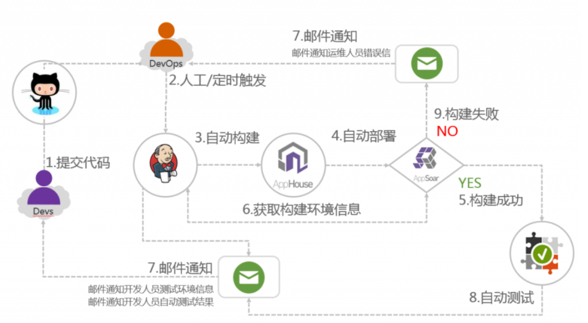
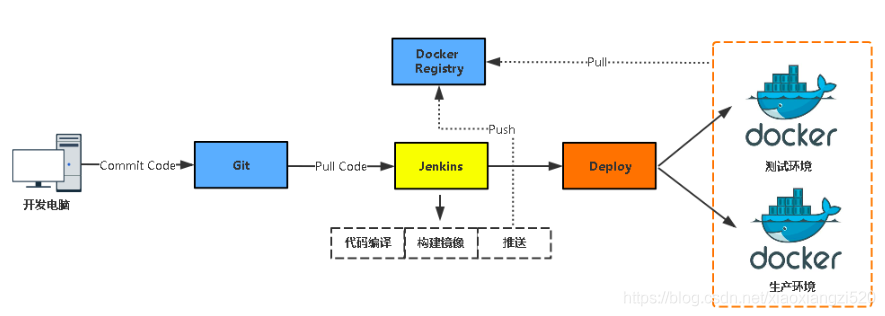

<!--
 * @Author: JohnJeep
 * @Date: 2024-01-06 15:19:42
 * @LastEditors: JohnJeep
 * @LastEditTime: 2024-01-06 17:29:55
 * @Description:  Jenkins 学习
 * Copyright (c) 2024 by John Jeep, All Rights Reserved. 
-->

# Jenkins 

Jenkins是一款开源 CI&CD 软件，用于自动化各种任务，包括构建、测试和部署软件。

## CI/CD

持续集成、自动部署流程

开发人员将代码push到gitlab中，触发jenkins的自动pull拉取代码，通过maven编译、打包，然后通过执行shell脚本使docker构建镜像并push到私服（或者阿里云）仓库，此操作完成后jenkins服务器上再执行SSH命令登录到部署服务器，docker从仓库（私服）拉取镜像，启动容器。整个操作流程完成。

# References
- 【Linux】Docker 搭建 Jenkins: https://open.alipay.com/portal/forum/post/125401045
- https://www.cnblogs.com/kevinwan/p/16007379.html
- 微服务从代码到k8s部署应有尽有大结局(k8s部署)：https://www.cnblogs.com/kevinwan/p/16007379.html

