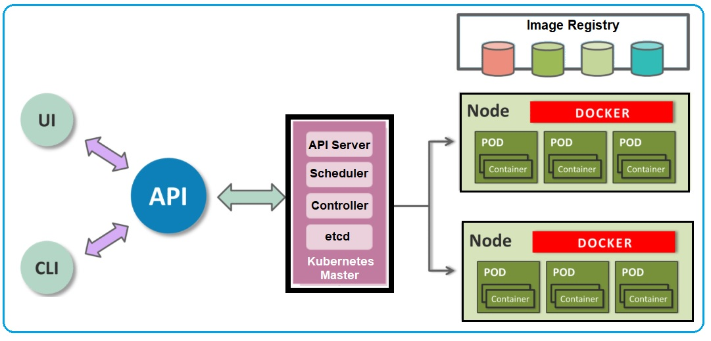

<!--
 * @Author: your name
 * @Date: 2022-04-15 20:18:46
 * @LastEditTime: 2022-04-26 23:51:06
 * @LastEditors: JohnJeep
 * @Description: Kubernetes 学习
 * @FilePath: 
-->
# 1. 简介

Kubernetes 最初是由Google内部项目 Borg 演化而来的，刚开始研发的时候仅仅只有 3 个人，后来得到 Google 高层的批准，将项目开源，吸引跟多的人参与进来。

# 2. 思考

国外的工程师的创造力是非常、非常的强，产生的想发都是源自于解决当前生产所面临的问题。他们产生了一个不错的想法，有平台和技术做支撑，能快速的去实现，并推广给大众，让全世界的人都能去用。（2022/4/8 9:30 Kubernetes 纪录片思考）

Kubernets 管理 docker 流程

参考：[Docker Containers and Kubernetes: An Architectural Perspective](https://dzone.com/articles/docker-containers-and-kubernetes-an-architectural)

# 3. Reference

- 官方英文文档: https://kubernetes.io/
- 官方中文文档: https://kubernetes.io/zh/docs/home/
- Making the Kubernetes Service Abstraction Scale using eBPF, [译] 利用 eBPF 支撑大规模 K8s Service (LPC, 2019)：https://linuxplumbersconf.org/event/4/contributions/458/
- 基于 BPF/XDP 实现 K8s Service 负载均衡 (LPC, 2020)https://linuxplumbersconf.org/event/7/contributions/674/
- 深入理解 Kubernetes 网络模型：自己实现 Kube-Proxy 的功能: https://cloudnative.to/blog/k8s-node-proxy/

