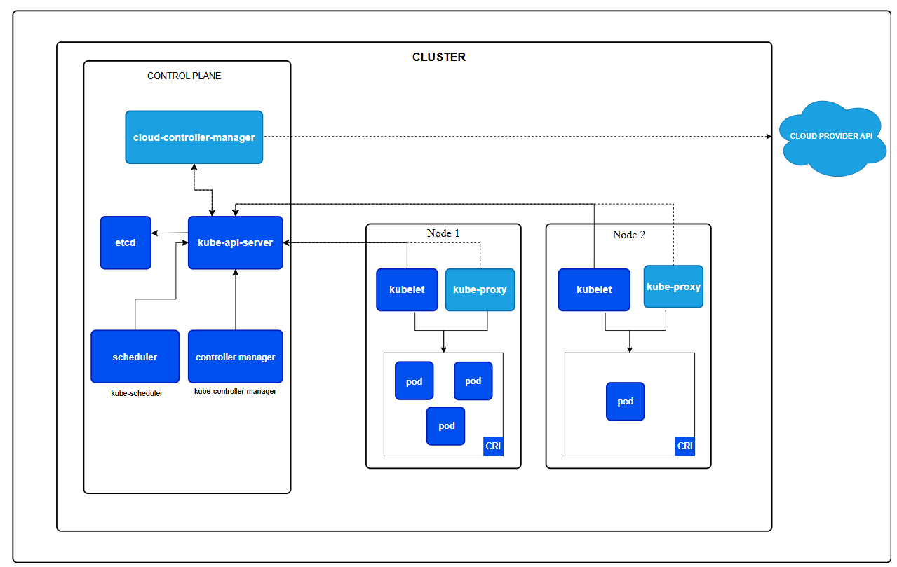

<!--
 * @Author: JohnJeep
 * @Date: 2022-04-15 20:18:46
 * @LastEditTime: 2025-03-21 14:55:36
 * @LastEditors: JohnJeep
 * @Description: Kubernetes 学习
-->
# 1. 简介

Kubernetes 最初是由Google内部项目 Borg 演化而来的，刚开始研发的时候仅仅只有 3 个人，后来得到 Google 高层的批准，将项目开源，吸引跟多的人参与进来。

# 2. 思考

国外的工程师的创造力是非常、非常的强，产生的想发都是源自于解决当前生产所面临的问题。他们产生了一个不错的想法，有平台和技术做支撑，能快速的去实现，并推广给大众，让全世界的人都能去用。（2022/4/8 9:30 Kubernetes 纪录片思考）

# 3. Core

Kubernets 管理 docker 流程

# 4. kubernets cluster architecture

Kubernetes cluster 由一个 control plane 和一组运行容器化应用程序(applications)的工作机器（称为 nodes）组成。每个 cluster 至少需要一个 worker node 才能运行 Pod。

worker nodes 托管作为应用程序工作负载组件的 Pod。 control plane 管理集群中的 worker node 和 Pod。在生产环境中， control plane 通常跨多台计算机运行，一个集群通常运行多个 nodes，从而提供容错和高可用性。

## 4.1. Control plane components

control plane 的组件对集群做出全局决策（例如，调度），以及检测和响应集群事件（例如，当 Deployment 的 replicas 字段不满足时启动新的 pod）。

Control plane 组件可以在集群中的任何计算机上运行。但是，为简单起见，设置脚本通常在同一台机器上启动所有 control plane 组件，并且不会在此机器上运行用户容器。有关跨多台计算机运行的控制平面设置示例。

- API Server:

  集群统一入口，以 Restful 方式交给 etcd 存储，暴露 Kubernetes HTTP API 的核心组件服务器。

- Scheduler

  查找尚未绑定到节点的 Pod，并将每个 Pod 分配给合适的节点。

- etcd

  为所有 API 服务器数据提供一致且高度可用的 key value store。

- Controller

  运行 controller 以实现 Kubernetes API 行为。

### 4.1.1. Controller

- 确保预期的 Pod副本数量
- 确保所有的 node 运行同一个 Pod
- 可部署一次性任务和定时任务
- 可部署 stateless, stateful

controller types
- Node controller: 负责在节点宕机时进行通知和响应。
- Job controller: 监视代表一次性任务的 Job objects，然后创建 Pod 来运行这些任务直到完成。
- EndpointSlice controller: 填充 EndpointSlice 对象（以提供 Service 和 Pod 之间的链接）。
- ServiceAccount controller: 为新命名空间创建默认 ServiceAccount。

## 4.2. Node components

Node 组件在每个节点上运行，维护正在运行的 Pods 并提供 Kubernetes runtime environment。

- kubelet:

  在 cluster 中的每个 node 上运行的代理(agent)，它确保 containers 在 Pod 中运行。kubelet 采用一组通过各种机制提供的 PodSpec，并确保这些 PodSpec 中描述的 containers 正在运行且健康(running and healthy)。kubelet 不管理不是由 Kubernetes 创建的(create)container。

- kube-proxy(optional)

  kube-proxy 是一个网络代理，它在集群中的每个 node 上运行，实现了 Kubernetes Service 概念的一部分。
  
  kube-proxy 维护节点上的网络规则。这些网络规则(network rules )允许从集群内部或外部的网络 session 到 Pod 进行网络通信。
  
  kube-proxy 使用 operating system packet filtering layer，如果有并且可用 。否则，kube-proxy 会转发流量本身(forwards the traffic itself)。
  
  如果你使用一个网络插件，它自己实现 Service 的数据包转发(packet forwarding )，并提供与 kube-proxy 等效的行为，那么你不需要在集群中的 node 上运行 kube-proxy。
  
- Container runtime

  Container runtime 是 Kubernetes 能够高效的运行容器的一个基本组件。它负责管理 Kubernetes 环境中 container 的执行和生命周期(execution and lifecycle)。

  Kubernetes 支持的容器运行时有： containerd、CRI-O 以及其它实现了 Kubernetes CRI（[Container Runtime Interface](https://github.com/kubernetes/community/blob/master/contributors/devel/sig-node/container-runtime-interface.md)）的组件。

## 4.3. Pod
- 最小的部署单元
- 一组 container 的集合
- 一个容器中的 Pod 是共享网络的
- 短暂的生命周期，重启后资源被销毁

## 4.4. Service

> service：定义一组 Pod 访问的规则。

- 每个 Service 对应一个集群内有效的虚拟 IP，集群内部通过虚拟IP访问服务。
- Replica Set、Replica Controller 和 Deployment 只是保证了支撑服务的微服务 Pod 的数量，但是没有解决如何访问这些服务的问题。

### 4.4.1. Headless Service

Kubernetes 的 Headless Service 是一种特殊类型的服务，它允许直接访问 Pod 而不需要通过 Service 进行负载均衡。

通常情况下，Kubernetes 中的 Service 会为一组 Pod 提供一个虚拟的稳定的网络终点，通过负载均衡将请求分发给这组 Pod中的任意一个。但是有时候，我们可能需要直接访问每个 Pod，而不需要负载均衡。

Headless Service 可以通过设置 ClusterIP 为 "None" 来创建。创建 Headless Service 后，Kubernetes 将不会为该 Service 分配一个虚拟的 ClusterIP，而是为每个 Pod 分配一个 DNS 条目。这样，我们就可以通过 Pod 的 DNS 名称直接访问每个Pod，而不需要经过 Service 的负载均衡。

Headless Service 对于一些特定的使用场景非常有用，比如数据库集群或者分布式系统，因为这些系统通常需要直接访问每个Pod，并且不需要负载均衡。

使用场景

- 不需要负载均衡和 service IP。
- 用于服务发现机制的项目或者中间件，如 kafka 和 zookeeper 之间进行 leader 选举，采用的是实例之间的实例 IP 通讯。因为 ZK 集群的 Pod 之间需要相互识别后，进行选举状态才会变为就绪，使用无头服务完美的解决这个问题。
- 发现所有的 Pod，包括未就绪的 Pod。

## 4.5. Addons(插件)

## 4.6. Application

### 4.6.1. Deployment

部署是一个比 ReplicaSet 更广的 API 对象，可以是创建一个新的服务，更新一个新的服务，也可以是滚动升级一个服务。

### 4.6.2. StatefulSet

- 用来控制有状态服务，StatefulSet 中的每个 Pod 的名字都是事先确定的，不能更改。
- StatefulSet 中 Pod 的名字的作用：是关联与该Pod对应的状态。
- StatefulSet 做的只是将确定的 Pod 与确定的存储关联起来保证状态的连续性。
- 每个 Pod 挂载自己独立的存储，如果一个 Pod 出现故障，从其他节点启动一个同样名字的 Pod，要挂载上原来 Pod 的存储继续以它的状态提供服务。
  	

适用场景： 
1. MySQL 、PostgreSQL数据库服务
2. ZooKeeper、etcd 集群化管理服务
3. 作为一种比普通容器更稳定可靠的模拟虚拟机的机制

### 4.6.3. Stateless(无状态)

- 所控制的 Pod 的名字是随机设置的，一个 Pod 出故障了就被丢弃掉，在另一个地方重启一个新的 Pod，名字变了。名字和启动在哪儿都不重要，重要的只是 Pod 总数。
- 一般不挂载存储或者挂载共享存储，保存的是所有 Pod 共享的状态。

### 4.6.4. DaemonSet

### 4.6.5. ReplicaSet

### 4.6.6. Job

# 5. References

- 官方英文文档: https://kubernetes.io
- 官方中文文档: https://kubernetes.io/zh/docs/home
- Making the Kubernetes Service Abstraction Scale using eBPF, [译] 利用 eBPF 支撑大规模 K8s Service (LPC, 2019)：https://linuxplumbersconf.org/event/4/contributions/458
- 基于 BPF/XDP 实现 K8s Service 负载均衡 (LPC, 2020)https://linuxplumbersconf.org/event/7/contributions/674
- 深入理解 Kubernetes 网络模型：自己实现 Kube-Proxy 的功能: https://cloudnative.to/blog/k8s-node-proxy
- Containerd 使用教程：https://icloudnative.io/posts/getting-started-with-containerd
- Kubernetes 的层级命名空间介绍：https://icloudnative.io/posts/introducing-hierarchical-namespaces
- Kubernetes 的设计理念：https://jimmysong.io/kubernetes-handbook/concepts/concepts.html
- Kubernetes 部署教程：https://zhuanlan.zhihu.com/p/641521752
- Docker Containers and Kubernetes: An Architectural Perspective: https://dzone.com/articles/docker-containers-and-kubernetes-an-architectural

