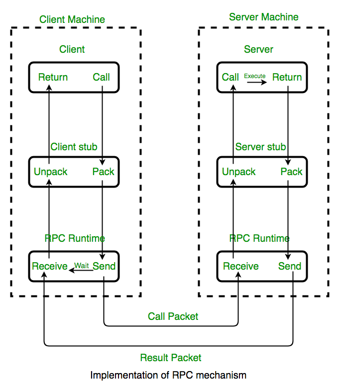

<!--
 * @Author: johnjeep
 * @Date: 2022-11-02 21:34:24
 * @LastEditors: johnjeep
 * @LastEditTime: 2023-04-25 01:06:43
 * @Description: gRPC 用法
 * Copyright (c) 2022 by johnjeep, All Rights Reserved. 
-->

<!-- TOC -->

- [1. RPC(remote produce call)](#1-rpcremote-produce-call)
  - [1.1. 什么是 RPC](#11-什么是-rpc)
- [2. gRPC](#2-grpc)
  - [2.1. 如何学习 gRPC?](#21-如何学习-grpc)
  - [2.2. 概念](#22-概念)
    - [2.2.1. Channel](#221-channel)
    - [2.2.2. Stub](#222-stub)
    - [2.2.3. Metadata](#223-metadata)
  - [1.2. gRPC 特点](#12-grpc-特点)
  - [1.3. Service definition](#13-service-definition)
    - [1.3.1. 流的结束](#131-流的结束)
  - [1.2. proto 文件](#12-proto-文件)
  - [1.3. gRPC 服务端](#13-grpc-服务端)
  - [1.4. gRPC 客户端](#14-grpc-客户端)
    - [1.4.1. 同步（Synchronous）](#141-同步synchronous)
  - [1.2. 同步RPC缺点](#12-同步rpc缺点)
    - [1.2.1. 异步（Asynchronous）](#121-异步asynchronous)
      - [1.2.1.1. 实现 C++ gRPC 异步双向流注意事项](#1211-实现-c-grpc-异步双向流注意事项)
      - [1.2.1.2. API接口](#1212-api接口)
      - [1.2.1.3. 多线程](#1213-多线程)
  - [1.2. gRPC 处理流程](#12-grpc-处理流程)
  - [1.3. gRPC基于HTTP/2的优缺点](#13-grpc基于http2的优缺点)
  - [1.4. gRPC 强大的功能](#14-grpc-强大的功能)
    - [1.4.1. 服务治理](#141-服务治理)
- [2. Performance](#2-performance)
- [3. References](#3-references)

<!-- /TOC -->


# 1. RPC(remote produce call)

## 1.1. 什么是 RPC

RPC简称远程过程调用，是一个用于构建基于Client和Server分布式应用程序的技术。目前业界已经有了很多的框架能够用来构建基于RPC的分布式应用，例如SpringBoot，Dubbo和gRPC。

RPC 标准最早是由Bruce Jay Nelson 写的论文 [Implementing Remote Procedure Calls](http://www.cs.cmu.edu/~dga/15-712/F07/papers/birrell842.pdf)中提出的，后期的所有的RPC框架都是在这个标准模式的基础上构建出来的。



具体的执行过程就是下面这个样子

- 客户端发起一个远程调用,它实际上是调用本地的Client Stub
- Client Stub 将接受到的参数进行按照约定的协议规范进行编码，并封装到即将发送的Message中。
- Client Stub 将消息发送给RPC Runtime，然后通过网络将包 发送给Server端
- 服务器端的 RPCRuntime 收到请求后，交给提供方 Stub 进行解码，然后调用服务端的方法， 服务端执行方法，返回结果
- 服务端的处理结果 同样再经过Server Stub 打包，然后传递给RPC Runtime。
- 服务端的RPC Runtime再把数据通过网络发送给Client端。
- Client 端接收到消息，然后进行 Unpack 处理。


参考：https://www.selinux.tech/golang/grpc/what-grpc


# 2. gRPC

## 2.1. 如何学习 gRPC?

总结一下，学习 RPC 时，我们先要了解其基本原理以及关键的网络通信部分，不要一味依赖现成的框架；之后我们再学习 RPC 的重点和难点，了解 RPC 框架中的治理功能以及集群管理功能等；这个时候你已经很厉害了，但这还不是终点，我们要对 RPC 活学活用，学会提升 RPC 的性能以及它在分布式环境下如何定位问题等等。

1. 掌握 grpc 基础理论
2. 会用 grpc API 去做一些简单的 server、client
3. 掌握 grpc 功能
4. 阅读源码
5. 深刻理解 grpc 功能，成为一个高手

## 2.2. 概念

[gRPC](http://www.grpc.io/) 是一个由 Google 开发的高性能开源通用 RPC 框架。在 gRPC 中，客户端应用可以直接调用其他机器上的服务器应用中的方法，如同调用本地对象一样，从而让您更轻松地创建分布式应用和服务。

使用 gRPC 的主要优势之一是用于生成文档；您可以使用服务配置和 API 接口定义文件来生成 API 的参考文档。

### 2.2.1. Channel

- channel 是一个连接。在指定的 host 和 IP 上与 gRPC server 建立的连接。只在当创建一个客户端的 stub时候会被用到。
- Clients 可以指定 channel 的参数，去修改gRPC 的默认行为，例如：开启或关闭消息压缩的开关。
- 一个 channel 是具有状态的，包括 `idle` 和 `connected`。

### 2.2.2. Stub 

- 客户端（client）有一个称为 stub 的本地对象（ local object ）（对于某些语言，用的术语是 client） ，它实现了与服务端（service）相同的方法。然后，客户端（client）可以在本地对象上调用这些方法，这些方法将调用的参数包装为合适的协议缓冲消息类型，将请求发送到服务器，并返回服务器的协议缓冲区的响应（protocol buffer responses）。

- *On the client side, the client has a local object known as stub (for some languages, the preferred term is client) that implements the same methods as the service. The client can then just call those methods on the local object, and the methods wrap the parameters for the call in the appropriate protocol buffer message type, send the requests to the server, and return the server’s protocol buffer responses.*

### 2.2.3. Metadata

元数据一般是键值对的形式，表示特定的RPC调用信息。key 一般是 strings，value一般也是string，有时可能是二进制数据。元数据对gRPC本身是不透明的 - 它允许客户端提供与服务器调用相关的信息，反之亦然。

Metadata is information about a particular RPC call (such as [authentication details](https://grpc.io/docs/guides/auth/)) in the form of a list of key-value pairs, where the keys are strings and the values are typically strings, but can be binary data.

Keys are case insensitive and consist of ASCII letters, digits, and special characters `-`, `_`, `.` and must not start with `grpc-` (which is reserved for gRPC itself). Binary-valued keys end in `-bin` while ASCII-valued keys do not.

User-defined metadata is not used by gRPC, which allows the client to provide information associated with the call to the server and vice versa.


## 1.2. gRPC 特点

1. 语言中立，支持多种语言；
2. 基于 IDL 文件定义服务，通过 proto3 工具生成指定语言的数据结构、服务端接口以及客户端 Stub；
3. 通信协议基于标准的 HTTP/2 设计，支持双向流、消息头压缩、单 TCP 的多路复用、服务端推送等特性，这些特性使得 gRPC 在移动端设备上更加省电和节省网络流量；
4. 序列化支持 PB（Protocol Buffer）和 JSON，PB 是一种语言无关的高性能序列化框架，基于 HTTP/2 + PB, 保障了 RPC 调用的高性能。

在一次RPC调用中，负责为客户端代理的节点（gRPC中称之为Stub）会将请求和参数传到服务端，并由Service进行实际的处理，然后将结果返回给Stub，最终返回到客户端中。


## 1.3. Service definition

gRPC 有 4  种请求和响应模式。

1. Unary（一元 RPC）

   一元RPC模式也称为简单RPC模式。客户端发送单个请求到服务端，等待服务端的响应。

   

   缺点：

   - 数据包过大造成的瞬时压力

   - 接收数据包时，需要所有数据包都接受成功且正确后，才能够回调响应，进行业务处理（无法客户端边发送，服务端边处理）

2. server-side streaming（服务端流式RPC）

   当数据量大或者需要不断传输数据时候，我们应该使用流式RPC，它允许我们边处理边传输数据。

   服务端流式RPC：客户端向服务端发送单个请求，服务端收到客户端的请求后，处理多个响应，这种多个响应所组成的序列被称为”流（stream）“。客户端读来自服务端返回的 stream，直到没有消息为止。

   

   

3. client-side-streaming（客户端流式RPC）

   在客户端流 RPC 模式中，客户端发送（write）多个请求给服务器端，而不再是单个请求，一旦客户端完成了发送消息，它等服务端去读（read）完一个序列的消息，由服务端返回一个响应 （response）。

   

4. Bidirectional Streaming （ 双向流式RPC）

   双向流式RPC 模式：client 发送一定消息序列的请求（request）给 server，而 server 给 client 回的响应也是一定消息序列的响应。双方使用读写流（a read-write stream）去发送一个消息序列，**两个流独立操作**，双方可以同时发送和同时接收。

   

   注意点：

   - 避免 **race condition** 或 **deadlocks**。


### 1.3.1. 流的结束

- Client 发送流：通过 `Writer->WritesDone()` 结束流
- Server 发送流：通过结束 rpc 调用并返回状态码`status code`的方式来结束流
- 读取流：通过 `Reader->Read()` 返回的 bool 型状态，来判断流是否结束


## 1.2. proto 文件

gRPC 默认采用 protocol buffers 数据传输格式。protocol buffers 是google开发的一种能够将结构数据序列化的数据描述语言。

使用protocol buffers的第一步是要在扩展名为.proto的proto文件中定义序列化的数据的结构。 Protocol buffer 数据会被结构化成一个 `message`,而这个 `message` 其实就是一条包含了一些属性（name-value对）的记录。

hello.proto

```protobuf
// proto buffer 语法版本
syntax = "proto3";

// 只对Java语言有效
option java_multiple_files = true;
option java_package = "io.grpc.examples.helloworld";
option java_outer_classname = "HelloWorldProto";
option objc_class_prefix = "HLW";

// 包名：用来防止协议消息类型之间发生命名的冲突；C++叫命名空间，Java中叫包名
package helloworld;

// 定义gRPC服务的接口
service Greeter {
  // 远程调用方法；HelloRequest为函数参数，HelloReply为函数返回值
  rpc SayHello (HelloRequest) returns (HelloReply) {}
}

// 定义请求的消息格式和类型 
message HelloRequest {
  string name = 1;  // 唯一字段编号，用于二进制消息格式中识别该字段
}

// 定义响应的消息格式和类型 
message HelloReply {
  string message = 1;
}

```

生成 `pb.cc`、`pb.h` 、`grpc.cc`、`grpc.pb.h` 文件。

```shell
protoc --grpc_out=. --plugin=protoc-gen-grpc=`which grpc_cpp_plugin`         ./server_stream.proto

protoc --cpp_out=. ./server_stream.proto 
```


## 1.3. gRPC 服务端


## 1.4. gRPC 客户端

gRPC 支持两种类型的 client stub。

### 1.4.1. 同步（Synchronous）

同步rpc调用调用完后，client 不立即=返回，而是等（wait）server 返回的响应。


## 1.2. 同步RPC缺点

1. 线程利用率低：线程资源是系统中非常重要的资源，在一个进程中线程总数是有限制的，提升线程使用率就能够有效提升系统的吞吐量，在同步 RPC 调用中，如果服务端没有返回响应，客户端业务线程就会一直阻塞，无法处理其它业务消息。
2. 纠结的超时时间：RPC 调用的超时时间配置是个比较棘手的问题。如果配置的过大，一旦服务端返回响应慢，就容易把客户端挂死。如果配置的过小，则超时失败率会增加。即便参考测试环境的平均和最大时延来设置，由于生产环境数据、硬件等与测试环境的差异，也很难一次设置的比较合理。另外，考虑到客户端流量的变化、服务端依赖的数据库、缓存、第三方系统等的性能波动，这都会导致服务调用时延发生变化，因此，依靠超时时间来保障系统的可靠性，难度很大。
3. 雪崩效应：在一个同步调用链中，只要下游某个服务返回响应慢，会导致故障沿着调用链向上游蔓延，最终把整个系统都拖垮，引起雪崩


### 1.2.1. 异步（Asynchronous）

概念：client 采用非阻塞式（non-blocking）的去调用 server 端返回的响应。异步API 会阻塞线程，直到一个接收或发送一个消息（message）。

C++ gRPC 异步的操作是采用 **CompletionQueue** 来实现的。**CompletionQueue** 是一个 `event queue`。任何异步操作的完成都是完成队列中的一个事件。

异步调用是从 CompletionQueue 中取得响应返回的结果。

- 在异步客户端中，通过`gRPC` `stub` 的异步方法调用，获取`ClientAsyncResponseReader`的实例。
- 在异步客户端中，`ClientAsyncResponseReader` 的Finish方法向 `CompletionQueue`注册了响应消息处理器和响应消息体的存储容器。
- 当服务器响应消息到来时，响应消息体被填充到注册的容器中，而响应消息处理器则被push到`CompletionQueue`中。
- 从`CompletionQueue`中获取到响应消息处理器，对响应消息进行处理。

调用基本的流程：

- 绑定一个 `CompletionQueue` 到一个 RPC 调用
- 利用唯一的 `void*` Tag 进行读写
- 调用 `CompletionQueue::Next()` 等待操作完成，完成后通过唯一的 Tag 来判断对应什么请求/返回进行后续操作。tag：根据`CompletionQueue`返回的 tag 知道是哪个对象产生了事件。

#### 1.2.1.1. 实现 C++ gRPC 异步双向流注意事项

1. 使用异步 API：使用 C++ gRPC 提供的异步 API，如 `AsyncReaderWriter`，而不是同步 API。异步 API 能够在单线程内处理多个客户端请求，提高程序的并发性能。
2. 线程安全：C++ gRPC 是线程安全的，但需要保证在使用 gRPC API 时，线程安全性不受影响。需要注意避免多个线程同时访问同一资源导致的竞态条件问题。
3. 序列化和反序列化：需要将请求和响应数据序列化和反序列化。C++ gRPC 默认使用 Protocol Buffers 作为序列化格式，需要定义好请求和响应消息的格式。
4. 错误处理：在处理异步双向流时，需要注意错误处理。例如，当客户端断开连接时，需要正确处理该事件，避免导致程序异常退出。
5. 流控制：需要合理地使用流控制机制，避免客户端和服务端之间的数据流量过大导致程序崩溃或者性能下降。
6. 代码清晰度：异步编程需要编写更复杂的代码，需要保证代码结构清晰易读，便于维护和修改。


#### 1.2.1.2. API接口

- `StartCall`：开始异步RPC调用。
- `Finish`：等待服务器的响应。
- `Next`：一旦服务器的响应到达，调用`cq.Next`方法来获取响应，并检查状态是否OK。
- `PrepareAsyncYourMethod`：准备一个异步的RPC调用。


#### 1.2.1.3. 多线程

对于如何在多线程中使用异步 RPC API 完成队列，官方的的文档说明是：Right now, the best performance trade-off is having numcpu's threads and one completion queue per thread.

当前，最好的权衡性能的方法是使用创建 cpu 个数的线程数，并在每个线程中都使用一个完成队列。


## 1.2. gRPC 处理流程

当调用 gRPC 服务时，客户端的 gRPC 库会使用 protocol buffers，将 RPC 的请求**编排（masrshal）**为 protocol buffers 格式，然后通过 HTTP/2 进行发送。在服务端，请求会被**解排（unmasrshal）**。而响应也遵循类似的执行流，从服务端发送到客户端。

- 编排：将参数和远程函数打包的过程。
- 解排：解包消息到对应的方法调用的过程。

## 1.3. gRPC基于HTTP/2的优缺点

**优点**

- HTTP/2是一个经过实践检验的公开的标准
- 天然支持手机、物联网、浏览器
- 多语言实现容易，每种流行的编程语言都有自己的HTTP/2 Client
- HTTP/2支持Stream和流控
- 基于HTTP/2 在Gateway/Proxy很容易支持
- HTTP/2 安全性有保证
- HTTP/2 鉴权成熟

**缺点**

- RPC 的元数据的传输不够高效
- HTTP/2 里一次 gRPC 调用需要解码两次,一次是HEADERS frame，一次是DATA frame
- HTTP/2 标准本身是只有一个TCP连接，但是实际在 gRPC 里是会有多个TCP连接，使用时需要注意。


## 1.4. gRPC 强大的功能

- 治理功能。比如连接管理、健康检测、负载均衡、优雅启停机、异常重试、业务分组以及熔断限流。
- 集群管理功能。

### 1.4.1. 服务治理

每个服务启动的时候，会将自身的服务和IP注册到注册中心，其他服务调用的时候，只需要向注册中心申请地址即可。


# 2. Performance


# 3. References

- [gRPC 英文官方文档](https://grpc.io/)
- [gRPC 中文文档](http://doc.oschina.net/grpc?t=61534)：与英文版本不同步，不是最新版本。
- [What is gRPC? Protocol Buffers, Streaming, and Architecture Explained](https://www.freecodecamp.org/news/what-is-grpc-protocol-buffers-stream-architecture/)
- [Introduction to gRPC Part1](https://www.polarsparc.com/xhtml/gRPC-1.html)
- [Introduction to gRPC Part2](https://www.polarsparc.com/xhtml/gRPC-2.html)
- [Introduction to gRPC Part3](https://www.polarsparc.com/xhtml/gRPC-3.html)
- [Introduction to gRPC Part4](https://www.polarsparc.com/xhtml/gRPC-4.html)
- [gRPC 代码使用的 C/C++ 技巧](https://panzhongxian.cn/cn/2021/09/grpc-cpp-tricks/)
- gRPC 博客归档：https://panzhongxian.cn/tags/grpc/
- C++ gRPC 异步 API 实例与优势
  - https://juejin.cn/post/6998554231837818917
  - https://stackoverflow.com/questions/68767309/difference-between-sync-and-async-grpc
  - https://stackoverflow.com/questions/64639004/grpc-c-async-helloworld-client-example-doesnt-do-anything-asynchronously
- **grpc学习**：https://qiankunli.github.io/2020/02/28/grpc.html
- gRPC博客学习归档：https://www.cnblogs.com/FireworksEasyCool/category/1693727.html
- [grpc使用记录(三)简单异步服务实例](https://www.cnblogs.com/oloroso/p/11345266.html)：C++ 实现
- [聊一下 gRPC 的 C++ 异步编程](https://www.luozhiyun.com/archives/671)
- [C++ gRPC 异步 API 实例与优势](https://blog.miigon.net/posts/cn-so-difference-between-sync-and-async-grpc/)
- [Lessons learnt from writing asynchronous streaming gRPC services in C++](https://www.gresearch.co.uk/blog/article/lessons-learnt-from-writing-asynchronous-streaming-grpc-services-in-c/) ：grpc 异步服务端流模式例子。
- **Github awesome-grpc:** https://github.com/grpc-ecosystem/awesome-grpc

可选

- 微服务治理框架(C++版)详细设计：https://github.com/grpc-nebula/grpc-nebula-c/tree/master/docs
- gRPC Load Balancing：https://grpc.io/blog/grpc-load-balancing/

gRPC Issues

- C++ Asynchronous Streaming RPC example #10013: https://github.com/grpc/grpc/issues/10013
- C++ Async bidi streaming sample #8934: https://github.com/grpc/grpc/pull/8934
- Provide a simple event-processing loop for C++ async API #7352: https://github.com/grpc/grpc/issues/7352

其它应对方案

- Tradias/[asio-grpc: https://github.com/Tradias/asio-grpc
- agrpc: https://github.com/npuichigo/agrpc


- 思考gRPC ：为什么是HTTP/2：https://blog.csdn.net/hengyunabc/article/details/81120904

- 从实践到原理，带你参透 gRPC：https://segmentfault.com/a/1190000019608421 文章写的很详细，值得参考。

