<!--
 * @Author: JohnJeep
 * @Date: 2020-04-04 21:22:08
 * @LastEditTime: 2021-07-06 16:19:50
 * @LastEditors: Please set LastEditors
 * @Description: 网络数据相关协议学习
-->

<!-- TOC -->

- [1. Principles and Terminology](#1-principles-and-terminology)
	- [1.1. OSI七层模型](#11-osi七层模型)
	- [1.2. TCP/IP五层模型](#12-tcpip五层模型)
	- [1.3. 最基本协议端口号](#13-最基本协议端口号)
	- [1.4. 常见的网络协议](#14-常见的网络协议)
	- [1.5. Terminology(术语)](#15-terminology术语)
- [2. Application Layer](#2-application-layer)
	- [2.1. DNS](#21-dns)
- [3. Transport Layer (传输层)](#3-transport-layer-传输层)
	- [3.1. TCP(Transmission Control Protocol))](#31-tcptransmission-control-protocol)
		- [3.1.1. TCP的建立与终止](#311-tcp的建立与终止)
			- [3.1.1.1. 建立](#3111-建立)
			- [3.1.1.2. 断开](#3112-断开)
		- [3.1.2. TCP交互数据流](#312-tcp交互数据流)
		- [3.1.3. TCP成块数据流](#313-tcp成块数据流)
		- [3.1.4. TCP Timeout or Retransmit](#314-tcp-timeout-or-retransmit)
		- [3.1.5. TCP坚持定时器](#315-tcp坚持定时器)
		- [3.1.6. TCP保活定时器](#316-tcp保活定时器)
		- [3.1.7. Reliable Data Transfer (可靠数据传输)](#317-reliable-data-transfer-可靠数据传输)
		- [3.1.8. Flow Control(流量控制)](#318-flow-control流量控制)
		- [3.1.9. Congestion Control(拥塞控制)](#319-congestion-control拥塞控制)
			- [3.1.9.1. 网络拥塞产生的缺点](#3191-网络拥塞产生的缺点)
			- [3.1.9.2. 拥塞控制方法 (Approaches to Congestion Control)](#3192-拥塞控制方法-approaches-to-congestion-control)
			- [3.1.9.3. TCP拥塞控制算法 (TCP congestion-control algorithm)](#3193-tcp拥塞控制算法-tcp-congestion-control-algorithm)
			- [3.1.9.4. TCP Over High-Bandwidth Paths (越过高带宽的TCP路径)](#3194-tcp-over-high-bandwidth-paths-越过高带宽的tcp路径)
			- [3.1.9.5. Fairness (公平性)](#3195-fairness-公平性)
			- [3.1.9.6. Explicit Congestion Notification (ECN):Network-assisted Congestion Control](#3196-explicit-congestion-notification-ecnnetwork-assisted-congestion-control)
	- [3.2. UDP(User Datagram Protocol)](#32-udpuser-datagram-protocol)
		- [3.2.1. DCCP](#321-dccp)
		- [3.2.2. QUIC](#322-quic)
	- [3.3. 广播多播](#33-广播多播)
- [4. Network layer(网络层)](#4-network-layer网络层)
	- [4.1. Data plane](#41-data-plane)
	- [4.2. Control plane](#42-control-plane)
	- [4.3. 路由选择算法](#43-路由选择算法)
	- [4.4. 路由选择协议](#44-路由选择协议)
	- [4.5. Complement (补码)](#45-complement-补码)
	- [4.6. Subnet mask(子网掩码)](#46-subnet-mask子网掩码)
	- [4.7. default route (默认路由)](#47-default-route-默认路由)
	- [4.8. IP( Internet Protocol)](#48-ip-internet-protocol)
		- [4.8.1. IP记录路由选项](#481-ip记录路由选项)
		- [4.8.2. IP源站选路选项](#482-ip源站选路选项)
		- [4.8.3. IP选路](#483-ip选路)
	- [4.9. ARP地址解析协议](#49-arp地址解析协议)
	- [4.10. RARP逆地址解析协议](#410-rarp逆地址解析协议)
	- [4.11. ICMP(Internet控制报文协议)](#411-icmpinternet控制报文协议)
	- [4.12. ping](#412-ping)
	- [4.13. Traceroute](#413-traceroute)
- [5. Link Layer(数据链路层)](#5-link-layer数据链路层)
	- [5.1. 以太网帧格式](#51-以太网帧格式)
	- [5.2. PPP (点对点协议)](#52-ppp-点对点协议)
	- [5.3. Loopback Interface (环回接口)](#53-loopback-interface-环回接口)
	- [5.4. IGMP (Internet组管理协议)](#54-igmp-internet组管理协议)
- [6. socket编程](#6-socket编程)
	- [6.1. 套接字地址结构](#61-套接字地址结构)
	- [6.2. 网络套接字API](#62-网络套接字api)
- [7. 高并发](#7-高并发)
	- [7.1. 多进程并发服务器](#71-多进程并发服务器)
	- [7.2. 多线程并发服务器](#72-多线程并发服务器)
	- [7.3. 多路IO转接模型](#73-多路io转接模型)
		- [7.3.1. select](#731-select)
		- [7.3.2. poll](#732-poll)
		- [7.3.3. epoll](#733-epoll)
- [8. 常用网络命令](#8-常用网络命令)
- [9. 参考](#9-参考)

<!-- /TOC -->
# 1. Principles and Terminology
掌握基本的原理 (principles)、网络术语 (terminology)。

## 1.1. OSI七层模型
- 物理层(Physical Layer)
- 数据链路层(Data Link Layer)
- 网络层(Network Layer)
- 传输层(Transport Layer)
- 会话层(Session Layer)
- 表示层(Presentation Layer)
- 应用层(Application Layer)


## 1.2. TCP/IP五层模型
- 物理层(Physical Layer)
- 数据链路层(Data Link Layer) : 处理与电缆接口的物理细节
- 网络层(Network Layer)
  - 也称作互联网层，处理 packet 在网络中的活动。
  - ARP
  - IP
  - ICMP
- 传输层(Transport Layer) ：为两台主机上的应用程序提供端到端的通讯。
  - TCP：把应用程序交给它的数据分成合适的小块交给下面的网络层，确认收到的 packet ，设置发送，最后确认 packet 的超时时间。TCP为两台主机提供可靠的数据通信。
  - UDP：只是把数据报的 packet 从一台主机发送到另一台主机，但并不保证该数据报能安全无误的抵达到另一端。
- 应用层(Application Layer)
  - 负责处理特定的应用程序细节。 
  - 常见的通用应用程序
    - Telnet 远程登录。
    - FTP 文件传输协议。
    - SMTP 简单邮件传送协议。
    - SNMP 简单网络管理协议。
<p align="center"></p>


## 1.3. 最基本协议端口号
- port (端口号) 
  - TCP和UDP采用 `16  bit` 的端口号来识别应用程序
  - 端口号用来标识互相通信的应用程序。
  - 服务器使用的是知名端口号，一般小于1024。
  - 客户端的端口号叫 `临时端口号`，范围在 `1024~5000`之间。
- 以太网协议号
  - IP：0800
  - ARP：0806
  - PPPOE：8863、8864
  - IPV6：86DD
- IP协议号
  - ICMP：1
  - TCP：6
  - UDP：17
  - GRE：47
  - ESP：50
  - AH：51
- 端口号
  - SSH：22
  - Telnet：23
  - TACACS：49
  - IKE：500
  - Radius：1645、1646、1812、1813
  - Web：80
  - 邮件(mailto)：25
  -  Windows 文件服务器使用的端口：139
  - TCP
    - FTP：20、21
    - SMTP：25
    - HTTP：80
    - HTTPS：443
  - UDP
    - DNS
    - TFTP: 69
    - RIP: 520
    - DHCP: 547, 546
    - SNMP: 162、161
    - NFS: 2049


## 1.4. 常见的网络协议
- HTTP (Web),
- streaming video
- TCP
- IP
- WiFi
- 4G
- Ethernet

## 1.5. Terminology(术语)
- 数据包进入网络中之前需要进行封装，封装过程是操作系统处理的，而不是用户处理的。
- TCP传输过程中，数据包只会寻找一次的传输路径，并将其记下，下次的传输会使用以保存的传输路径，因此传输数据比较稳定。而UDP在网路传输过程中，每次传输的路径都不一样，每次传输需要重新寻找路径，因此传输数据没有TCP稳定。
- 寻路：寻找下一个路由节点。
-  packet 交换(也叫蓄积交换)：让连接到通信电路中的计算机，将要发送的数据包分成多个数据包，按照一定的顺序排列之后分别发送。
- 吞吐量：主机之间实际的传输速率，其单位与带宽相同，都是bps( bits Per Second)。
- 网桥：是在链路层上对网络进行互连，网桥使得多个局域网(LAN)组合在一起。
- 路由器：是在网络层上对网络进行互连。
- 数据报：是指从发送方传输到接收方的一个信息单元。
- TCP报文段(TCP segment)：TCP传给IP的数据单元。
-  packet ：在IP层和数据链路层之间传送的数据单元。
- 默认网关：通向外部网路的第一跳路由器。


- Internet standards
  - RFC: Request for Comments
  - IETF: Internet Engineering Task Force


# 2. Application Layer
## 2.1. DNS
- DNS是指：域名服务器(Domain Name Server)。在Internet上域名与IP地址之间是一一对应的，域名虽然便于人们记忆，但机器之间只能互相认识IP地址，它们之间的转换工作称为域名解析，域名解析需要由专门的域名解析服务器来完成，DNS就是进行域名解析的服务器。
- 把域名翻译成IP地址的软件称为域名系统，即DNS。它保存了一张域名(domain name)和与之相对应的IP地址 (IP address)的表，以解析消息的域名。
- 域名是由一串用点分隔的名字组成的，通常包含组织名，而且始终包括两到三个字母的后缀，以指明组织的类型或该域所在的国家或地区。
- 工作方式：DNS 服务器用来将域名转换成 IP 地址。当 DNS 服务器收到一条请求后，它会检查它有没有该请求需要的转换信息。如果没有这条转换信息，那么 DNS 服务器会把这条请求转发给其他的 DNS 服务器。通过这种方式，就完成了从域名到 IP 地址的转换。转换结果随后会发回到发出请求的计算机。

- 它提供主机名字和 IP地址之间的转换及有关电子邮件的选路信息。
- 从应用的角度上看，对 DNS的访问是通过一个地址解析器( resolution)来完成的。
- DNS报文格式
  - 报文 (message) 由 `12字节长` 的首部和 `4个长度可变` 的字段组成。 
  - DNS报文中最后的三个字段，`回答字段、授权字段和附加信息字段`，均采用一种称为资源记录 `RR( Resource Record)`的相同格式。
  <p align="center">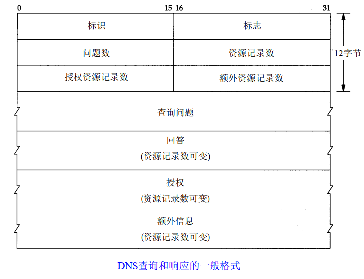</p>


- DNS报文首部中的标志字段
  <p align="center">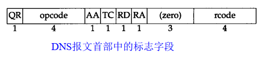</p>

  - QR 是 `1 bit` 字段： 0表示查询报文， 1表示响应报文。
  - opcode是一个`4 bit` 字段：通常值为0(标准查询)，其他值为1(反向查询)和2(服务器状态请求)。
  - AA 是 `1 bit` 标志，表示“授权回答 (authoritative answer)”。该名字服务器是授权于该域的。
  - TC是 `1 bit`字段，表示“可截断的 (truncated)”。使用UDP时，它表示当应答的总长度超过512字节时，只返回前512个字节。
  - RD是 `1 bit` 字段表示“期望递归(recursion desired)”。该比特能在一个查询中设置，并在响应中返回。这个标志告诉名字服务器必须处理这个查询，也称为一个递归查询。如果该位为 0，且被请求的名字服务器没有一个授权回答，它就返回一个能解答该查询的其他名字服务器列表，这称为迭代查询。在后面的例子中，我们将看到这两种类型查询的例子。
  - RA是 `1 bit` 字段，表示“可用递归”。如果名字服务器支持递归查询，则在响应中将该比特设置为 1。在后面的例子中可看到大多数名字服务器都提供递归查询，除了某些根服务器。
  - 随后的 `3 bit` 字段必须为0。
  - rcode是一个 `4 bit` 的返回码字段。通常的值为 0(没有差错)和 3(名字差错)。名字差错只有从一个授权名字服务器上返回，它表示在查询中制定的域名不存在。


- 指针查询：给定一个IP地址，返回与该地址对应的域名。 

- 资源记录(RR: resource record)
  - `A`: 记录了一个IP地址，存储32 bit的二进制数
  - `PTR`: 用于指针查询。
  - `CNAME`: 规范名字 (canonical name)，表示一个域名。
  - `HINFO`: 表示主机信息：包括说明主机 CPU和操作系统的两个字符串。
  - `MX`:  邮件交换记录，用于以下一些场合。
    - 一个没有连到Internet的站点能将一个连到Internet的站点作为它的邮件交换器。这两个站点能够用一种交替的方式交换到达的邮件，而通常使用的协议是UUCP协议。 
    - MX记录提供了一种将无法到达其目的主机的邮件传送到一个替代主机的方式。 
    - MX记录允许机构提供供他人发送邮件的虚拟主机
    - 防火墙网关能使用MX记录来限制外界与内部系统的连接。 


# 3. Transport Layer (传输层)
## 3.1. TCP(Transmission Control Protocol))
<div style="color: red"> TCP 的特点：提供一种面向连接的、可靠的字节流传输。</div>

- 工作流程
  > TCP将用户的数据打包成报文段 (segment)，发送报文后将启动一个定时器 (timer)，另一端对收到的数据进行确定，对失序的数据进行重新排序，丢弃数据，TCP提供端到端的流量控制 (flow control)，并计算和验证一个强制性的端到端校验和(checksum)。

- TCP包的长度最大可达 `60 bytes`，最小为 `20 bytes`。 
- TCP能在两个方向上进行传输，属于全双工传输。


- 序号(Sequence number)
  - 占32  bits。
  - 传输层的每个 segment 都包含一个序列号，该序列号是该段 (segment) 中第一个数据字节的字节流编号。用来标识从TCP源端向目的端发送的字节流，发起方发送数据时对此进行标记。
  - 一条TCP连接的双方均可随机地选择初始序号。

- 确认号(acknowledge number)
  - 占32  bits。
  - 只有ACK标志位为1时，确认序号字段才有效，Ack=Seq+1。
  - 注意：不要将 `确认序号Ack` 与 `标志位中的ACK` 搞混了。 

- TCP的首部 (head)
  - TCP数据在IP数据报中的封装
  <p align="center">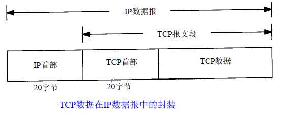</p>
  
  - TCP包的首部数据格式
  <p align="center">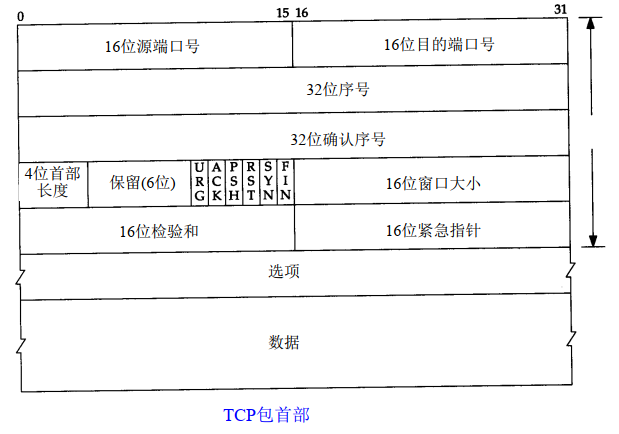</p>


  - TCP首部中的 `6个 bit标志位`
    - `URG(urgent)` 紧急指针(urgent pointer)，是一个正的偏移量。
    - `ACK(acknowledgement)` 确认序号。
    - `PSH(push)` 接收方应该尽快将这个报文段交给应用层。
    - `RST(reset)` 重建连接。
    - `SYN(synchronous)` 同步序号用来发起一个连接。
    - `FIN(finish)` 发送方完成数据发送 

- TCP流量控制：由连接的每一方通过窗口大小来确认。 窗口大小是一个 `16 bit` 的字节数。


- 校验和：覆盖了整个TCP的报文段，包括TCP首部和TCP数据，是一个强制性的字段。一定是发送端进行校验和计算，接收端进行校验和 `验证`。


### 3.1.1. TCP的建立与终止
为什要使用TCP的三次握手和四次挥手这种机制？
- 因为IP是在网络层，与底层的硬件接触比较紧密，导致传输不稳定。传输层中TCP是面向连接可靠的字节流传输完全弥补了这种问题，而UDP是无连接不可靠的报文传输弥补了部分的这种问题。


#### 3.1.1.1. 建立
- 需要三次握手，即连接必须是一方主动打开，另一方被动打开的。
  <p align="center"></p>

> `SYN_RECV` 状态：服务端被动打开后,接收到了客户端的SYN并且发送了ACK时的状态。再进一步接收到客户端的ACK就进入ESTABLISHED状态。


- 第一次握手：Client将标志位 `SYN` 置为 `1`，随机产生一个值 `seq=x`，并将该数据包发送给Server，Client进入 `SYN_SENT` 状态，等待Server确认。
  - 标记位为 `SYN`，表示 `请求建立新连接`
  - 序号为 `seq=X`
  - 客户端进入 `SYN-SENT阶段`

- 第二次握手：Server收到数据包后由标志位 `SYN=1` 知道Client请求建立连接，Server将标志位 `SYN` 和`ACK` 都置为 `1`，`ack=x+1`，随机产生一个值 `seq=y`，并将该数据包发送给Client以确认连接请求，Server进入 `SYN_RCVD` 状态。
  - 标志位为 SYN和ACK，表示 确认客户端的报文Seq序号有效，服务器能正常接收客户端发送的数据，并同意创建新连接(即告诉客户端，服务器收到了你的数据) 
  - 序号为 `seq=y`
  - 确认号为 `ack=x+1`，表示收到客户端的序号 `seq` 并将其值加1作为自己确认号 `ack` 的值；随后服务器端进入`SYN-RCVD` 阶段。

- 第三次握手：Client收到来自server端的确认收到数据的TCP报文后，检查 `ack` 是否为 `x+1`，`ACK`是否为 `1`，如果正确则将标志位 `ACK` 置为 `1`，`ack=y+1`，并将该数据包发送给Server，Server检查 `ack`  是否为 `y+1`，`ACK` 是否为 `1`，如果正确则连接建立成功，Client和Server结束 `SYN-SENT` 阶段，进入 `ESTABLISHED` 状态，完成三次握手，随后Client与Server之间可以开始传输数据了。
  - 标志位为 `ACK`，表示“确认收到服务器端同意连接的信号”(即告诉服务器，我知道你收到我发的数据了)
  - 序号为 `seq=x+1`，表示收到服务器端的确认号 `ack`，并将其值作为自己的序号值；
  - 确认号为 `ack=y+1`，表示收到服务器端序号 `seq`，并将其值加 `1` 作为自己的确认号 `ack` 的值；
  - 客户端进入 `ESTABLISHED` 阶段。


- 为什么要进行第三次握手？
  - 为了防止服务器端开启一些无用的连接增加服务器开销
  - 防止已失效的连接请求报文段突然又传送到了服务端，因而产生错误。
  > 也可以这样理解：“第三次握手”是客户端向服务器端发送数据，这个数据就是要告诉服务器，客户端有没有收到服务器“第二次握手”时传过去的数据。若发送的这个数据是“收到了”的信息，接收后服务器就正常建立TCP连接，否则建立TCP连接失败，服务器关闭连接端口。由此减少服务器开销和接收到失效请求发生的错误。


#### 3.1.1.2. 断开
- 需要四次挥手。由于TCP的半关闭造成的。必须是一方主动释放，另一方被动释放。
  <p align="center"></p>

> 四次握手的简单过程描述：假设客户端准备中断连接，首先向服务器端发送一个FIN的请求关闭包(FIN=final)，然后由established状态过渡到FIN-WAIT1状态。服务器收到FIN包以后会发送一个ACK，然后自己由established状态进入CLOSE-WAIT状态。此时通信进入半双工状态，即留给服务器一个机会将剩余数据传递给客户端，传递完后服务器发送一个FIN+ACK的包，表示我已经发送完数据可以断开连接了，就这便进入LAST_ACK阶段。客户端收到以后，发送一个ACK表示收到并同意请求，接着由FIN-WAIT2进入TIME-WAIT阶段。服务器收到ACK，结束连接。客户端发送完ACK包之后，客户端还要等待2MSL(MSL=maxinum segment lifetime最长报文生存时间，2MSL就是两倍的MSL)才能真正的关闭连接。

- 第一次挥手：client想要释放连接，向server发送一段TCP报文。
  - 标记位为 `FIN`，表示“请求释放连接“；
  - 序号为 `seq=U`；
  - 随后客户端进入 `FIN-WAIT-1` 阶段，即半关闭阶段。并且停止在客户端到服务器端方向上发送数据，但是客户端仍然能接收从服务器端传输过来的数据。


- 第二次挥手：server接收到从client发出的TCP报文后，确认了client想要释放连接，随后server结束 `ESTABLISHED` 阶段，进入 `CLOSE-WAIT阶段(半关闭状态)`并返回一段TCP报文，client收到从server发出的TCP报文后，确认sever收到了client发出的释放连接的请求，随后client结束 `FIN-WAIT-1` 阶段，进入 `FIN-WAIT-2` 阶段
  - 标记位为 `ACK`，表示“接收到客户端发送的释放连接的请求”；
  - 序号为 `seq=V`；
  - 确认号为 `ack=U+1`，表示是在收到客户端报文的基础上，将其序号 `seq` 值加 `1` 作为本段报文确认号`ack` 的值； 
  - 随后服务器端开始准备释放服务器端到客户端方向上的连接。
>  前"两次挥手"既让服务器端知道了客户端想要释放连接，也让客户端知道了服务器端了解了自己想要释放连接的请求。于是，可以确认关闭客户端到服务器端方向上的连接了


- 第三次挥手：server自从发出 `ACK` 确认报文之后，经过 `CLOSED-WAIT` 阶段，做好了释放server到client方向上的连接准备，再次向client发出一段TCP报文，随后server结束 `CLOSED-WAIT` 阶段，进入 `LAST-ACK` 阶段，并且停止从server到client方向上发送数据，但是server任然能够接受从client传输过来的数据。
  - 标记位为`FIN，ACK`，表示“已经准备好释放连接了”。注意：这里的ACK并不是确认收到服务器端报文的确认报文。
  - 序号为 `seq=W`；
  - 确认号为 `ack=U+1`；表示是在收到客户端报文的基础上，将其序号 `seq` 值加 `1` 作为本段报文确认号`ack` 的值。

- 第四次挥手：client结束从server发出的TCP报文，确认了server已经做好释放连接的准备了，则结束 `FIN-WAIT-2` 阶段，进入 `TIME_WAIT` 阶段，并向server发送一段报文，随后client开始在 `TIME-WAIT` 阶段等待 `2MSL`。server收到client发出的TCP报文后，则结束 `LAST_ACK` 阶段，进入 `CLOSE` 阶段，即正式确认关闭server到client方向上的连接。client等待完 `2MSL` 之后，结束 `TIME-WAIT` 阶段，进入 `CLOSED` 阶段，由此完成“四次挥手”。

> 后“两次挥手”既让客户端知道了服务器端准备好释放连接了，也让服务器端知道了客户端了解了自己准备好释放连接了。于是，可以确认关闭服务器端到客户端方向上的连接了，由此完成“四次挥手”。

- 为什么“握手”是三次，“挥手”却要四次？
  - TCP建立连接时之所以只需要"三次握手"，是因为在第二次"握手"过程中，服务器端发送给客户端的TCP报文是以SYN与ACK作为标志位的。`SYN` 是请求连接标志，表示服务器端同意建立连接；ACK是确认报文，表示告诉客户端，服务器端收到了它的请求报文。即SYN建立连接报文与ACK确认接收报文是在同一次"握手"当中传输的，所以"三次握手"不多也不少，正好让双方明确彼此信息互通。
  - TCP释放连接时之所以需要“四次挥手”,是因为FIN释放连接报文与ACK确认接收报文是分别由第二次和第三次"握手"传输的。为何建立连接时一起传输，释放连接时却要分开传输？
    - 建立连接时，被动方服务器端结束CLOSED阶段进入“握手”阶段并不需要任何准备，可以直接返回SYN和ACK报文，开始建立连接。
    - 释放连接时，被动方服务器，突然收到主动方客户端释放连接的请求时并不能立即释放连接，因为还有必要的数据需要处理，所以服务器先返回ACK确认收到报文，经过CLOSE-WAIT阶段准备好释放连接之后，才能返回FIN释放连接报文。


- 为什么客户端在TIME-WAIT阶段要等2MSL?
  - 当客户端发出最后的ACK确认报文时，并不能确定服务器端能够收到该段报文。所以客户端在发送完ACK确认报文之后，会设置一个时长为2MSL的计时器。MSL指的是Maximum Segment Lifetime：一段TCP报文在传输过程中的最大生命周期。2MSL即是服务器端发出为FIN报文和客户端发出的ACK确认报文所能保持有效的最大时长。
  - 服务器端在1MSL内没有收到客户端发出的ACK确认报文，就会再次向客户端发出FIN报文；
    - 如果客户端在2MSL内，再次收到了来自服务器端的FIN报文，说明服务器端由于各种原因没有接收到客户端发出的ACK确认报文。客户端再次向服务器端发出ACK确认报文，计时器重置，重新开始2MSL的计时；
    - 否则客户端在2MSL内没有再次收到来自服务器端的FIN报文，说明服务器端正常接收了ACK确认报文，客户端可以进入CLOSED阶段，完成“四次挥手”。
  -  所以，客户端要经历时长为2SML的TIME-WAIT阶段；这也是为什么客户端比服务器端晚进入CLOSED阶段的原因


- 如果已经建立了连接，但是客户端突然出现故障了怎么办？
  - 答：TCP还设有一个保活计时器，显然，客户端如果出现故障，服务器不能一直等下去，白白浪费资源。服务器每收到一次客户端的请求后都会重新复位这个计时器，时间通常是设置为2小时，若两小时还没有收到客户端的任何数据，服务器就会发送一个探测报文段，以后每隔75分钟发送一次。若一连发送10个探测报文仍然没反应，服务器就认为客户端出了故障，接着就关闭连接。


- 为什么不能用两次握手进行连接？
  - 答：3次握手完成两个重要的功能，既要双方做好发送数据的准备工作(双方都知道彼此已准备好)，也要允许双方就初始序列号进行协商，这个序列号在握手过程中被发送和确认。

	现在把三次握手改成仅需要两次握手，死锁是可能发生的。作为例子，考虑计算机S和C之间的通信，假定C给S发送一个连接请求 packet ，S收到了这个 packet ，并发送了确认应答 packet 。按照两次握手的协定，S认为连接已经成功地建立了，可以开始发送数据 packet 。可是，C在S的应答 packet 在传输中被丢失的情况下，将不知道S 是否已准备好，不知道S建立什么样的序列号，C甚至怀疑S是否收到自己的连接请求 packet 。在这种情况下，C认为连接还未建立成功，将忽略S发来的任何数据 packet ，只等待连接确认应答 packet 。而S在发出的 packet 超时后，重复发送同样的 packet 。这样就形成了死锁。 


- TCP半关闭
  - 概念：客户端以结束向服务器端发送数据后，还能接收服务器端数据的能力。  
  - rsh工作原理
  - 将标准输入(datafile)复制给TCP连接，将结果从TCP连接中复制给标准输出。
  <p align="center"></p>


- TCP状态变迁
  <p align="center">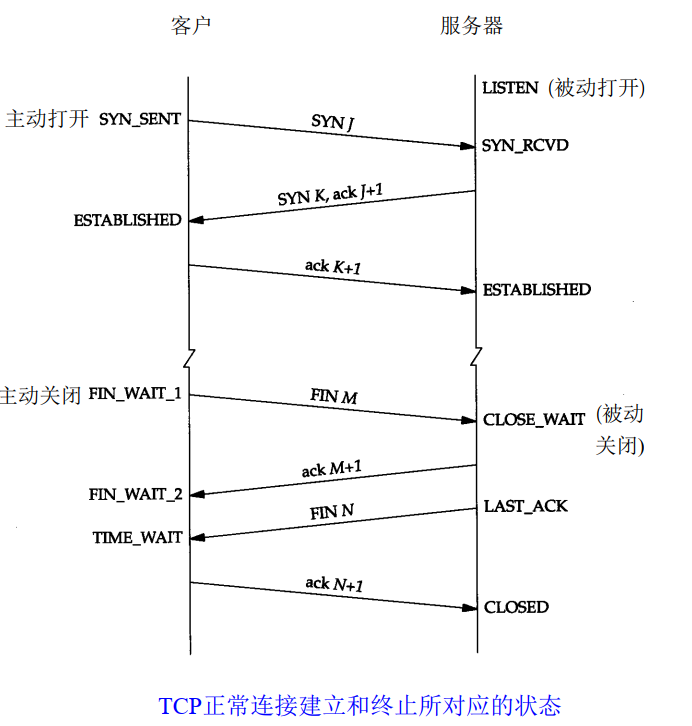</p>

- `TIME_WAIT` 状态也称为 `2 MSL 等待状态`。
  - 最大生存时间(Maximum Segment Lifetime)
    - 处理的原理：当 TCP执行一个主动关闭，并发回最后一个 ACK，该连接必须在 `TIME _ WAIT` 状态停留时间为 2倍的MSL。
    - 在连接处于 `2MSL` 等待时，任何迟到的报文将被丢弃。

- 平静时间(quit time)：TCP在重启后的MSL时间内都不能建立任何的连接。

- 异常终止一个连接
  - 正常终止一个连接的方式是发送一个 `FIN`
  - 异常终止一个连接的优点
    - 丢弃任何待发的数据，立即发送复位报文段。
    - RST的接收方会区分另一端执行的是异常关闭还是正常关闭。

- 半打开(half-open)：一端正常关闭或异常终止连接而另一方却还不知道。
- 同时打开：两个应用程序同时执行主动打开，每一方必须发送 `SYN`，这些 `SYN` 必须发送给对方。
  <p align="center">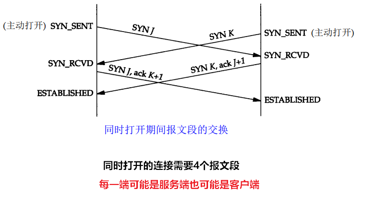</p>


- TCP选项 
  <p align="center">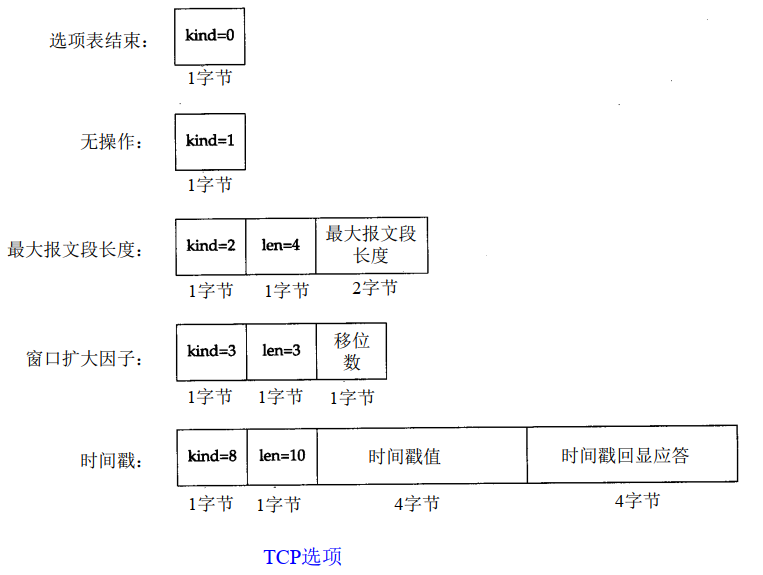</p>


### 3.1.2. TCP交互数据流
- 交互数据总是以小于最大报文段长度的 packet 发送。
- 小 packet (tinygram)：20字节IP头部，20字节TCP头部，1字节数据

- Nagle算法: 
  - 要求： 一个TCP连接上只能有一个未被确认的未完成的 packet 
  - 为了解决在广域网上由于小 packet 而导致网络拥塞的问题。
  - 优点：它是自适应的，确认到达的越快，数据也就发送的越快，减少了小包发送的数量。
  - 缺点：增加了时延 


### 3.1.3. TCP成块数据流
- 滑动窗口机制
  - TCP滑动窗口的可视化表示
  <p align="center">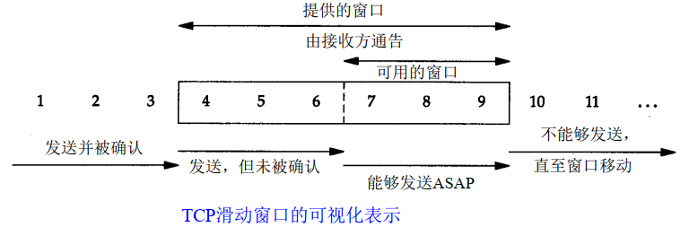</p>

- PUSH标志
  - 发送方使用该标志位：通知接收方将接受到的数据全部提交给接收进程。 


- 慢启动：通过观察到新 packet 进入网络的速率应该与另一端返回确认的速率相同而进行工作。


- 发送一个packet的时间
  - 传播时延
  - 发送时延(取决于带宽) 


- URG标志
  - TCP的一端告诉TCP的另一端数据流中有紧急数据报需要处理。


### 3.1.4. TCP Timeout or Retransmit
- TCP管理4个定时器
  - 重传定时器(Retransmission Timer)：希望收到另一端的确认
  - 坚持定时器(Persistent Timer)：使窗口大小信息保持不断流动，即使另一端关闭了接收窗口。
  - 保活定时器(Keeplive Timer)：检测到一个空闲连接的另一端何时崩溃或重启。
  - 时间等待定时器(Timer Wait Timer) ：测量一个连接处于 `TIME_ WAIT` 状态的时间。
    > Linux下查看2MSL的时间 `/proc/sys/net/ipv4/tcp_fin_timeout`


### 3.1.5. TCP坚持定时器
- 接收方等待接收数据(因为它已经向发送方通告了一个非 0的窗口) ，而发送方在等待允许它继续发送数据的窗口更新。为防止这种死锁情况的发生，发送方使用一个坚持定时器 (persist timer)来周期性地向接收方查询，以便发现窗口是否已增大。

- 连接的一方需要发送数据但对方已通告窗口大小为0时，就需要设置TCP的坚持定时器。


### 3.1.6. TCP保活定时器
- 保活定时器的例子
  - 一端崩溃
  - 另一端崩溃并重新启动、
  - 另一端不可达


### 3.1.7. Reliable Data Transfer (可靠数据传输)
- TCP 在 IP 不可靠的尽力而为服务之上创建了一种可靠数据传输服务 (reliable data transfer service)。TCP 的可靠数据传输服务确保一个进程从接收缓存中读出的数据流 (data stream) 是无损坏、 无间隙、 非冗余和按序的数据流 (uncorrupted, without gaps, without duplication, and in sequence)； 即该字节流与连接的另一方端系统发送出的字节流是完全相同。 

- TCP 怎样保证数据的可靠性传输？
  > 通过使用流量控制 (flow control)、 序号 (sequence numbers)、 确认 (acknowledgments) 和定时器 (timers)来实现。


单个重传定时器 (a single retransmission timer)， 即使有多个已发送但还未被确认的报文段 (multiple transmitted but not yet acknowledged segments)。

- TCP 发送方使用重传定时器实现的流程
    ```c++
    /* Assume sender is not constrained by TCP flow or congestion control, that data from above is less
    than MSS in size, and that data transfer is in one direction only. (假设发送方不受TCP流量和拥塞控制的限制， 来自上层数据的长度小于MSS,且数据传送只在一个方向进行)*/

    NextSeqNum=InitialSeqNumber  // 下一个要发送字节的序号
    SendBase=InitialSeqNumber    // 已发送过但未被确认字节的最小序号

    loop (forever) {
        switch(event)

            event: data received from application above
                create TCP segment with sequence number NextSeqNum
                if (timer currently not running)
                    start timer
                pass segment to IP
                NextSeqNum=NextSeqNum+length(data)
                break;

            event: timer timeout
                retransmit not-yet-acknowledged segment with
                    smallest sequence number
                start timer
                break;

            event: ACK received, with ACK field value of y
                if (y > SendBase) {
                    SendBase=y
                if (there are currently any not-yet-acknowledged segments)
                    start timer
        }
        break;

    } /* end of loop forever */
    ```
  - Doubling the Timeout Interval(双倍超时间隔)
    > 每当超时事件发生时，TCP 重传带有有最小序号并还未被确认的报文段 (segments)。只是每次 TCP 重传时都会将下一次的超时间隔设为先前值的两倍， 而不是用从 EstimatedRTT 和 DevRTT 推算出的值。例如，假设当定时器第一次过期时，与最早的未被确认的 segment 相关联的 Timeoutinterval 是 0. 75 秒， TCP 就会重传该segment，并把新的过期时间设置为1.5秒。如果 1.5 秒后定时器又过期了，则TCP将再次重传该 segment，并把过期时间设置为 3.0 秒。因此，超时间隔在每次重传后会呈指数型增长。 然而，每当定时器在另两个事件（即收到上层应用的数据和收到ACK）中的任意一个启动时， Timeoutinterval 由最近的 EstimatedRTT 值与 DevRTT 值推算得到。
    
  - 定时器过期很可能是由网络拥塞引起的，即太多的 packet 到达源与目的地之间路径上的一台（或多台） 路由器的队列中，造成 packet 丢失或长时间的排队时延。在拥塞的时候，如果来源端持续重传 packet，会使拥塞更加严重。相反，TCP 使用更文雅的方式，每个发送方的重传都是经过越来越长的时间间隔后进行的。 


- Fast Retransmit(快速重传)
  - 超时重传存在的问题：超时的周期相对较长。当一个报文段丢失时，这种长超时周期迫使发送方延迟重传丢失的 packet， 因而增加了端到端时延。可以在发送方通过冗余ACK (duplicate ACK) 来检测丢包的情况。
  - Duplicate ACK (重复 ACK): 是重新确认发送方已经收到较早确认报文段的 ACK。
  - 发送方经常一个接一个地发送大量的报文段，如果一个报文段丢失，就很可能引起许多一个接一个冗余的ACK。如果 TCP 发送方接收到对相同数据的3个冗余ACK，它把这当作一种指示，说明跟在这个已被确认过 3 次的报文段之后的报文段已经丢失。一旦收到 3 个冗余 ACK, TCP就执行快速重传（fast retransmit） [RFC 5681]，即在该报文段的定时器过期之前重传丢失的报文段。

  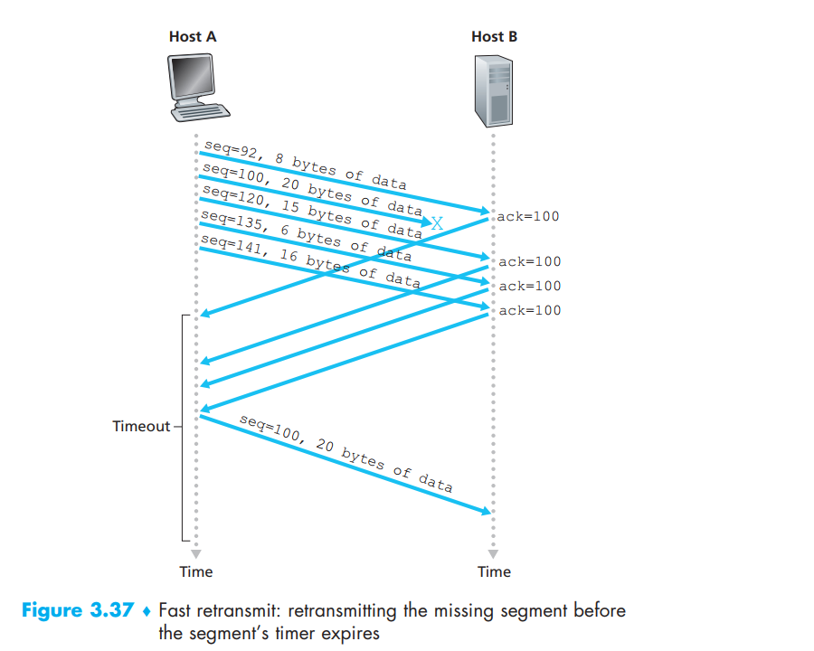


  - 采用快速重传的 TCP 中 ACK 接受事件的执行流程。
    ```c++
    event: ACK received, with ACK field value of y
        if (y > SendBase) {
            SendBase=y
        if (there are currently any not yet acknowledged segments) {
            start timer
            }
        }
        else {/* a duplicate ACK for already ACKed segment */
            increment number of duplicate ACKs
            received for y
        if (number of duplicate ACKS received for y==3) {
            /* TCP fast retransmit */
            resend segment with sequence number y
            }
        }
        break;
    ```

- 对 TCP 提岀的一种修改意见是所谓的选择确认 (selective acknowledgment) [RFC 2018]，它允许 TCP 接收方有选择地确认乱序的报文段，而不是累积地确认最后一个正确接收的有序报文段。当将该机制与选择重传机制结合起来使用时(即跳过重传那些已被接收方选择性地确认过的报文段)，TCP 看起来就很像我们通常的 SR协议。因此，TCP 的差错恢复机制 ( error-recovery mechanism) 也许最好被分类为 GBN 协议与 SR 协议的混合体。


### 3.1.8. Flow Control(流量控制)
TCP 为它的应用程序提供了流量控制服务 (flow control service) 以消除发送方使接收方缓存溢岀的可能性。流量控制因此是一个速度匹配服务，即发送方的发送速率与接收方应用程序的读取速率相匹配。 


### 3.1.9. Congestion Control(拥塞控制)
- TCP 拥塞控制防止任何一条 TCP 连接用过多流量 (traffic) 来淹没通信主机之间的链路和交换设备 (links and routes)。 TCP 力求为每个通过一条拥塞网络链路的连接平等地共享网络链路带宽。这可以通过调节 TCP 连接的发送端发送进网络的流量速率来做到。在另一方面，UDP 流量是不可调节的。使用 UDP 传输的应用程序可以根据其需要以其愿意的任何速率发送数据

TCP 的拥塞控制是：每个 RTT 内 cwnd 线性（加性）增加 1 个 MSS，然后出现 3 个冗余 ACK 事件时 cwnd 减半（乘性减）。因此，TCP 拥塞控制常常被称为加性增、乘性减 (additive-increase, multiplicativedecrease : AIMD) 拥塞控制方式。


#### 3.1.9.1. 网络拥塞产生的缺点
- 当 packet 的到达速率 (arrive rate) 接近链路容量 (link capacity) 时，packet 会经历很大的排队时延 (queuing delays)。
- 发送方必须执行重传 (retransmission) 以补偿因为缓存溢出 ( buffer overflow) 而丢失的 packet。
- 发送方在面对大延迟时，不需要的重传可能会造成路由器使用其链路带宽 (link bandwidth) 来转发不需要的数据包副本 (copies of a packet.)。 
- 当一个 packet 沿一条路径被丢弃时，在每个上游路由器 (upstream links) 用于转发 (forward) 该 packet，到该 packet 被丢弃而使用的传输容量 (transmission capacity) 是被浪费掉了。


#### 3.1.9.2. 拥塞控制方法 (Approaches to Congestion Control)
- 端到端拥寒控制 (End-to-end congestion control)。
  > 在端到端拥塞控制方法中， 网络层没有为传输层拥塞控制提供显式支持。即使网络中存在拥塞，端系统也必须通过对网络行为的观察 (如packet loss and delay) 来推断。TCP 采用端到端的方法解决拥塞控制，因为 IP 层不会向端系统提供有关网络拥塞的反馈信息。TCP segment 的丢失（通过超时或收到 3 次冗余确认 (timeout or the receipt of three duplicate acknowledgments) 而得知） 被认为是网络拥塞的一个迹象，TCP 会相应地减小其窗口长度。我们还将看到关于TCP拥塞控制的一些最新建议，即使用增加的往返时延值作为网络拥塞程度增加的指示 (uses increasing round-trip segment delay as an indicator of increased network congestion)。

- 网络辅助的拥塞控制 (Network-assisted congestion control)。
  > 在网络辅助的拥塞控制中，路由器向发送方提供关于网络中拥塞状态的显式反馈信息 (routers provide explicit feedback to the sender and/or receiver regarding the congestion state of the network)。这种反馈可以简单地用一个比特 ( bit) 来指示链路中的拥塞情况。

  > 默认因特网版本的 IP 和 TCP 采用端到端拥塞控制方法。然而，最近 IP 和 TCP 也能够选择性网络辅助拥塞控制来实现。

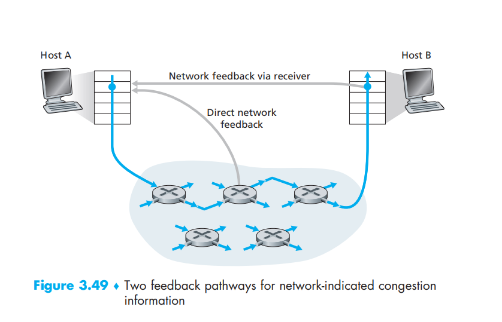

TCP必须使用端到端拥塞控制而不是使网络辅助的拥塞控制， 因为IP层不向端系统提供显式的网络拥塞反馈。

- TCP 所采用的方法是让每一个发送方根据所感知到的网络拥塞程度来限制其能向连接发送流量的速率。 如果一个TCP发送方感知从它到目的地之间的路径上没什么拥塞， 则 TCP 发送方增加其发送速率； 如果发送方感知沿着该路径有拥塞， 则发送方就会降低其发送速率。 但是这种方法提出了三个问题。 
  - 第一， TCP 发送方如何限制与它相连接的流量 (traffic) 速率？
  - 第二， 一个 TCP 发送方如何知道它与目的地之间的路径上存在拥塞呢？
  - 第三， 当发送方感知到端到端的拥塞时，采用何种算法来改变它的发送速率呢？

对于第一个问题：
- TCP 连接的每一端都是由一个接收缓存 (receive buffer)、 一个发送缓存 (send buffer) 和几个变量(LastByteRead、rwncl等) 组成。运行在发送方的 TCP 拥塞控制机制跟踪一个额外的变量， 即拥塞窗口(congestion window)。拥塞窗口表示为 cwnd，它对一个 TCP 发送方能向网络中发送流量的速率进行了限制。 特别是， 在一个发送方中未被确认的数据量不会超过 cwnd 与 nvnd 中的最小值， 即
$$LastByteSent – LastByteAcked \leq mim \{ cwnd, rwnd \} $$

- 结论： 该发送方的发送速率大概是 cwnd/RTT byte/sec。 通过调节 cwnd 的值，发送方因此能调整它向连接发送数据的速率。
 
对于第二个问题
- 当出现过度的拥塞时， 在沿着这条路径上的一台（或多台） 路由器的缓存 (routes buffer) 会溢出， 引起一个数据报 (datagram) (包含一个 TCP segment) 被丢弃。 丢弃的 datagram 接着会引起发送方的丢包事件(要么超时或收到 3 个冗余 ACK)，发送方就认为在发送方到接收方的路径上出现了拥塞的指示。
> TCP使用确认 (acknowledgments) 来触发（或计时） 增大它的拥塞窗口长度， TCP被说成是自计时（self-clocking）的。

对于第三个问题
- TCP 发送方怎样确定它应当发送的速率呢？ 如果众多 TCP 发送方总体上发送太快，它们能够拥塞网络，导致拥塞崩溃。如果 TCP 发送方过于谨慎，发送太慢，它们不能充分利用网络的带宽；这就是说，TCP 发送方能够以更高的速率发送而不会使网络拥塞。那么 TCP 发送方如何确定它们的发送速率，既使得网络不会拥塞，与此同时又能充分利用所有可用的带宽？TCP 发送方是显式地协作，或存在一种分布式方法使TCP发送方能够仅基于本地信息设置它们的发送速率？ 
- 实现的方法
  - 一个丢失的 segment 表意味着拥塞，因此当一个 segment 丢失时应当降低 TCP 发送方的速率。 
  - 一个 acknowledged segment 表示该网络正在向接收方传递发送方的 segment， 因此，当 ACK 到达之前有未确认的段 (unacknowledged segment) 时，可以增加发送方的速率。即报文段 (segments) 正从发送方成功地传递给接收方，因此该网络不拥塞。可以增加拥塞窗口的长度。
  - 宽带探测 (Bandwidth probing)。给定 ACK 指示源到目的地路径无拥塞， 而丢包事件指示路径拥塞， TCP 调节其传输速率的策略是增加其速率以响应到达的 ACK，除非岀现丢包事件， 此时才减小传输速率。 
  >  注意到网络中没有明确的拥塞状态信令，即 ACK 和丢包事件充当了隐式信号，每个 TCP 发送方都异步地处理来自其他 TCP 发送方的本地信息。


#### 3.1.9.3. TCP拥塞控制算法 (TCP congestion-control algorithm)
- 慢启动 (Slow Start)。
- 拥塞避免 (Congestion Avoidance)。
- 快速恢复 (Fast Recovery)。

> 慢启动和拥塞避免是 TCP 的强制部分， 两者的差异在于：对收到的 ACK 做出反应时增加 cwnd 长度的方式。慢启动比拥塞避免能更快地增加cwnd的长度。快速恢复是推荐部分， 对TCP发送方并非是必需的。
 
一、 慢启动过程

- 当一条TCP连接开始时，cwnd 的初始值通常始置为一个 MSS 中较小值，这就使得初始发送速率大约为 MSS/RTT。例如， 如果 MSS = 500 bytes，且 RIT = 200ms，则得到的初始发送速率大约只有 20kbps。对 TCP 发送方而言， 可用带宽可能比 MSS/RTT 大得多，TCP 发送方希望迅速找到可用带宽的数量。 因此，在慢启动 (slow-start) 状态，当 第一个确认号 (first acknowledged) 到达时，将 cwnd 开始值为 1 个 MSS 的报文段 (segment) 增加 1 个MSS。 TCP 向网络发送第一个报文段并等待一个确认。 当该确认 (acknowledgement) 到达时，TCP 发送方将拥塞窗口增加一个 MSS，并发送出两个最大长度的 segment。 当这两个报文段都被发送端确认时，则发送方将每个确认报文段的拥塞窗口增加一个 MSS，使得拥塞窗口变为 4 个 MSS，并这样一直下去。 这一过程每过一个 RTT，发送速率就翻倍。因此，TCP 发送速率起始慢，但在慢启动阶段以指数增长。


- 什么时候结束这种指数增长？
  - 如果存在一个由超时指示的丢包事件（即拥塞），TCP 发送方将 cwnd 设置为 1 并重新开始慢启动过程。 
  - 将第二个状态变量的值 ssthresh (慢启动阈值: slow start threshold) 设置为 cwnd/2，即当检测到拥塞时将 ssthresh 置为拥塞窗口值的一半。 当 cwnd 的值等于 ssthresh 时，结束慢启动并且 TC P转移到拥塞避免模式。
  - 检测到 3 个冗余 (duplicate) ACK，这时 TCP 执行一种快速重传并进入快速恢复状态，来结束慢启动过程。


 
二、 拥塞避免

- 一旦进入拥塞避免状态， cwnd 的值大约是上次遇到拥塞时的值的一半，即距离拥塞可能并不遥远！因此，TCP 无法每过一个 RTT 再将 cwnd 的值翻倍，而是采用了一种较为保守的方法，每个 RTT 只将 cwnd 的值增加一个 MSS。通用的方法： TCP 发送方在新的确认 (acknowledgment) 到达时将 cwnd 增加 MSS 字节 (MSS/cwnd)。

- 何时应当结束拥塞避免的线性增长（每 RTT 1 MSS）？
  - 当出现超时时， TCP 的拥塞避免算法行为与慢启动的情况一样，cwnd 的值被设置为 1 个 MSS，当丢包事件出现时，ssthresh 的值被更新为 cwnd 值的一半。
  - 由三个冗余 (triple duplicate) ACK事件触发丢包事件时，TCP 将 cwnd 的值减半并且当收到 3 个冗余的 ACK ，将 ssthresh 的值记录为 cwnd 的值的一半。 接下来进入快速恢复状态。


三、 快速恢复

- 在快速恢复中， 导致 TCP 进入快速恢复状态的缺失报文段 (missing segment)，收到每个冗余的 (duplicate) ACK 时, cwnd 的值就增加一个 MSS。最终，当丢失报文段 (segment) 的一个 ACK 到达时，TCP在降低 cwnd后进入拥塞避免状态。如果出现超时事件，快速恢复执行的步骤同慢启动和拥塞避免中的动作一样，然后迁移到慢启动状态。当丢包事件发生时，cwnd 的值设置为 1 个 MSS，且 ssthresh 的值设置为 cwnd 值的一半。


优化云服务器性能：TCP splitting (TCP 分岔)。

- 若果终端系统距离数据中心很远，导致 RTT 很大，这是因为慢启动会导致响应时间性能很差。那么如何提高云服务器的性能？
- 通常， 服务器在慢启动期间交付响应要求三个TCP窗口。所以从某端系统发起一条 TCP 连接到它收到该响应的最后一个分组的时间粗略是 4 * RTT （用于建立TCP连接的一个RTT加上用于3个数据窗口的3个RTT）,再加上在数据中心中处理的时间。 对于一个相当小的查询来说， 这些RTT时延导致其返回搜索结果中显而易见的时延。 此外， 在接入网中可能有较大的丢包， 导致TCP重传甚至较大的时延。
- 缓解这个问题和改善用户感受到的性能的一个途径是：①部署邻近用户的前端服务器；②在该前端服务器利用TCP分岔（TCP splitting）来分裂 TCP 连接。 借助于TCP分岔， 客户向邻近前端连接一条TCP连接， 并且该前端以非常大的窗口向数据中心维护一条TCP连接。使用这种方法， 响应时间大致变为 4 * RTT^ + RTTbe +处理时间，其中 RTT^ 是客户与前端服务器之间的往返时间，RTTbe 是前端服务器与数据中心（后端服务器） 之间的往返时间。 如果前端服务器邻近客户， 则该响应时间大约变为RTTbe加上处理时间， 因为 RTTre 小得微不足道并且RTTbe约为RTT。总而言之， TCP分岔大约能够将网络时延从4*RTT减少到RTT,极大地改善用户感受的性能， 对于远离最近数据中心的用户更是如此。 TCP分岔也有助于减少因接入网丢包引起的TCP重传时延。 


- TCP 拥塞控制算法演进
  - 早期版本：the Tahoe algorithm 
  - 较新版本：the Reno algorithm
  - 现代版本：the Vegas algorithm
    > 实现原理：①在 packet 丢失发生之前，在来源端与目的地之间检测路由器中的拥塞； ②当检测出快要发生的 packet 丢失时，线性地降低发送速率。快要发生的 packet 丢失是通过观察 RTT 来预测的。packet 的 RTT 越长，路由器中的拥塞越严重。  
 
#### 3.1.9.4. TCP Over High-Bandwidth Paths (越过高带宽的TCP路径)

不考虑丢包的情况下，一条 TCP 连接的平均吞吐量：
$$ average throughput of a connection = \frac{0.75 * W}{RTT} $$
> W 表示丢包事件发生时，拥塞窗口的长度，单位为 byte。


一条 TCP 连接的吞吐量公式， 该公式作为丢包率 (L) 、 往返时间 (RTT) 和最大报文段长度 (MSS) 的函数关系：
$$ average throughput of a connection = \frac{1.22 * MSS}{RTT \sqrt{L}}$$

#### 3.1.9.5. Fairness (公平性)
当 K 条TCP连接，每条都有不同的端到端路径，但是都经过一段传输速率为 R bps的瓶颈链路时。链路之间得到资源的公平性如何？ 
- 当多条连接共享一个共同的瓶颈链路时，那些具有较小 RTT 的连接能够在链路空闲时更快地抢到可用带宽（即较快地打开其拥塞窗口），因而将比那些具有较大 RTT 的连接享用更高的吞吐量。


#### 3.1.9.6. Explicit Congestion Notification (ECN):Network-assisted Congestion Control
早期时，一个 TCP 发送方不会收到来自网络层的明确拥塞指示， 而是通过观察 packet 丢失来推断拥塞。 最近， 对于 IP 和 TCP 的扩展方案［RFC 3168］已经提出并已经实现和部署，该方案允许网络明确向 TCP 发送方和接收方发出拥塞信号。这种形式的网络辅助拥塞控制称为明确拥塞通告 (Explicit Congestion Notification, ECN)。
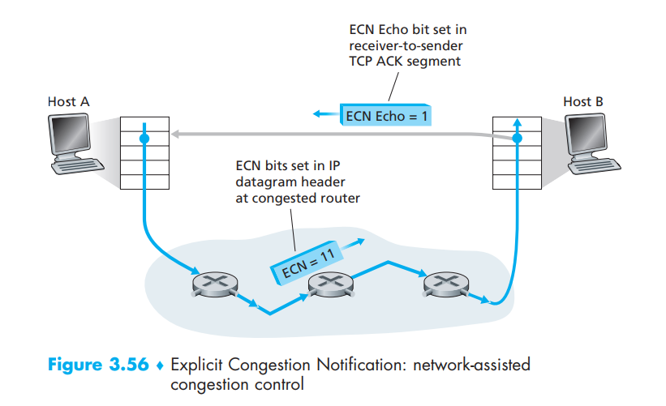 

在网络层， IP 数据报 (datagram) 首部的服务类型字段中的两个比特被用于 ECN。路由器所使用的一种 ECN 比特设置表示该路由器正在历经拥塞。该拥塞表示则由被标记的 IP 数据报所携带，送给目的主机，再由目的主机通知发送主机， RFC 3168没有提供路由器拥塞时的定义； 该判断是由路由器厂商所做的配置选择，并且由网络操作员决定。然而，RFC 3168 推荐仅当拥塞持续不断存在时才设置ECN比特。发送主机所使用的另一种 ECN 比特设置通知路由器发送方和接收方是 ECN 使能的，因此能够对于 ECN 指示的网络拥塞采取行动。

如上图所示， 当接收主机中的 TCP 通过一个接收到的数据报 (datagram) 收到了一个 ECN 拥塞指示时， 接收主机中的 TCP 通过在接收方到发送方的 TCP ACK 报文段 (segment) 中设置 ECE （明确拥塞通告回显: Explicit
Congestion Notification Echo） 比特，通知发送主机中的 TCP 收到拥塞指示。接下来，TCP 发送方通过减半拥塞窗口对一个具有 ECE 拥塞指示的 AC K做出反应，就像它对丢失报文段使用快速重传做出反应一样，并且在下一个传输的 TCP 发送方到接收方的报文段首部中对 CWR (拥塞窗口缩减: Congestion Window Reduced) 比特进行设置。


拥塞控制的必要性：拥塞控制对于网络良好运行是必不可少的。没有拥塞控制,网络很容易出现死锁，使得端到端之间很少或没有数据能被传输。


## 3.2. UDP(User Datagram Protocol)
- User Datagram Protocol (用户数据报协议) UDP 是一种简洁、轻量级的传输协议，提供最少的服务。UDP是无连接的 (connectionless)，在两个进程通信前没有握手过程。 UDP 协议提供一种不可靠数据传输服务，也就是说，当一个进程发送由一个报文 (message) 进 UDP 套接字时，UDP 协议并不保证该 message 会到达接收进程。不仅如此，到达接收进程的报文也可能是乱序到达的。
  > UDP数据报：UDP传给IP的信息单元称作(UDP datagram)。

- UDP没有包括拥塞控制机制，所以 UDP 的发送端可以用它选定的任何速率向其下层（网络层） 注入数据。（然而，值得注意的是实际端到端吞吐量可能小于该速率，这可能是因为中间链路的带宽受限或因为拥塞而造成的。）

- UDP 传输特点
  - Finer application-level control over what data is sent, and when. (关于发送什么数据以及何时发送的应用层控制更为精细) 
  - No connection establishment. 
  - No connection state. 
  - Small packet header overhead. 每个TCP报文段都有 20  bytes 的头部开销，UDP 仅有8 bytes 的头部开销。


UDP数据封装格式
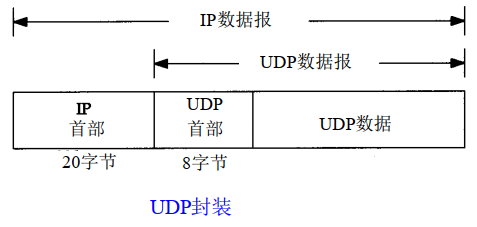

UDP首部: 长度为 `8 bytes`。
- port: 通过端口号可以使目的主机 ( destination host) 将应用数据传递给运行在目的端系统中相应的进程（即执行分解功能） 。
- length: 指定了 UDP 报文中的字节数量 (header + data)。因为从一个 UDP 字段到下一个 UDP 字段，数据字段的值可能不同，因此需要显示指定 length 字段。
 
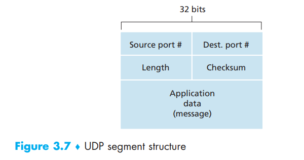


- 校验和
  - UDP的校验和会覆盖UDP的首部和UDP的数据。
  - IP的检验和只覆盖IP的首部。
  - UDP的检验和时可选的，而TCP的检验和是必须的。
  - UDP数据报和TCP段都包含一个 `12字节的伪首部`，是为了检验和而设置的。伪首部包含IP首部的一些字段，让UDP两次检查数据是否已经到达目的地。
  - 发送的数据报和收到的数据报具有相同的 `校验和`值。
  
  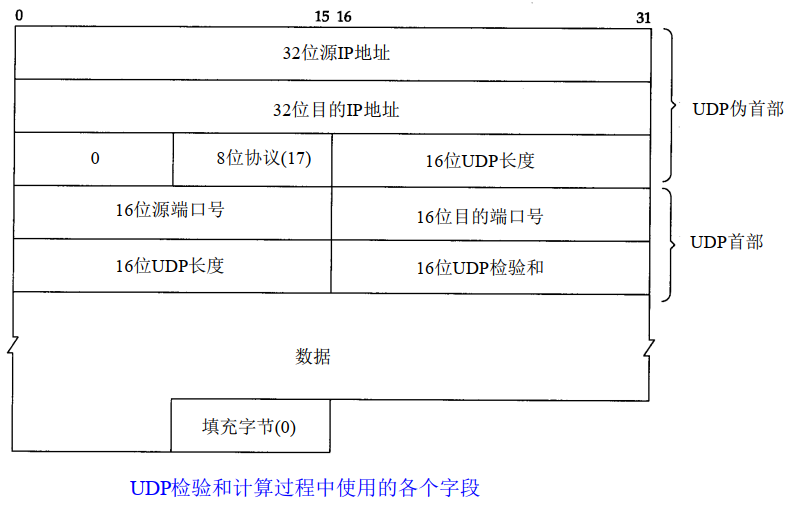


- UDP应用场景
  - 查询类：如 DNS
  - 数据传输：TFTP、SNMP、HTTP/3
  - 多媒体流应用。


### 3.2.1. DCCP
数据报拥塞控制协议 (Datagram Congestion Control Protocol, DCCP) [ RFC 4340] 提供了一种低开销 (low overhead)、 面向报文 ( message-oriented)、 类似于 UDP 的不可靠服务， 但是具有应用程序可选择的拥塞控制形式，该机制与 TCP 相兼容。如果某应用程序需要可靠的或半可靠的数据传输， 则这将在应用程序自身中执行。DCCP 被设想用于诸如流媒体等应用程序中，DCCP 能够利用数据传递的预定时间和可靠性之间的折中， 但是要对网络拥塞做出响应。


### 3.2.2. QUIC
在谷歌的 Chromium 浏览器中实现了 QUIC (Quick UDP Internet Connections) 协议，该协议通过重传 (retransmission) 以及差错检测 (error correction)、 快速连接建立 (fast-connection setup) 和基于速率的拥塞控制算法提供可靠性，而基于速率的拥塞控制算法是以 TCP 友好特性为目标，这些机制都是在 UDP 之上作为应用层协议实现的。 2015年年初， 谷歌报告从 Chrome 浏览器到谷歌服务器的大约一半请求运行在 QUIC之上。


## 3.3. 广播多播
TCP肯定是单播的。广播和多播适用于UDP

广播：将数据报发送到网络中的所有主机。有四种类型
- 受限的广播，通常只在系统初始启动时才会用到。
  - 受限的广播地址是 `255.255.255.255`。该地址用于主机配置过程中 IP数据报的目的地址，此时，主机可能还不知道它所在网络的网络掩码，甚至连它的 I P地址也不知道。
  - 在任何情况下，路由器都不转发目的地址为受限的广播地址的数据报，这样的数据报仅出现在本地网络中。   
- 指向网络的广播
- 指向子网的广播，最常用。
- 指向所有子网的广播。


多播：将数据报发送到网络中的一个主机组。
- 向多个目的地址传送数据。
- 客户对服务器的请求。 

`D类IP地址` 被称为多播组地址。


# 4. Network layer(网络层)
网络中的每一台主机 (hosts) 和路由器 (routes) 中都有一个网络层。

网络层的功能
- forwarding: 移动 packets 从一个路由器的输入链路到合适的路由器输出链路。
- routing: 确定 packets 从源到目的地所采用的路由 (route)。这个过程需要用到路由算法。


网络层被分为两个相互作用的部分，即数据平面 (data plane) 和控制平面 (control plane)。

routers 功能
- 在所有的 IP datagrams 传递经过路由器时，检测 header fields。
- 移动 datagram 从输入端口到输出端口，沿着端到端路径传输数据报。


## 4.1. Data plane
网络层中 data plane 的功能
- 决定怎样将到达路由器输入链路的数据报（即网络层数据包）转发到该路由器的输出链路。
- 是局部的 (local)，网络层中每个路由器都有的功能。


## 4.2. Control plane
网络层中 control plane 的功能
- 是一种网络范围的逻辑。
- 在路由器之间控制一个 datagram 是怎样沿着从源主机传输到目标主机的端到端路径。

两种 control panel 的方法
- 传统路由算法：在路由器上实现。
- 软件定义网络 (Software-Defined Networking, SDN) ：在远程 server 上实现。
  > 通过将这些控制平面功能作为一种单独服务，明确地分离数据平面和控制平面，控制平面功能通常置于一台远程“控制器” 中。 


## 4.3. 路由选择算法
## 4.4. 路由选择协议
- OSPF
- BGP 

## 4.5. Complement (补码)
- 概念：用二进制表示有符号数的一种方法。正数的符号位为 0，负数的符号位为 1。
- 计算：
  - 正数和0的补码就是该数字本身。负数的补码则是将其对应正数按位取反再加1，符号位不变。 
  - 例子： 
    ```
    1、求数字-5的补码？
    二进制：1000 0101 (-5)
    取反：  1111 1010
    +1：    1111 1011 (251)

    2、知道补码求原码：补码为 130
    二进制：1000 0010
    取反：  1111 1101
    +1：    1111 1110  (-126)
    ```


## 4.6. Subnet mask(子网掩码)
- IPV4的子网掩码由 32  bit 组成，由一系列的1 和 0组成。1 表示该位用作网络前缀，0 表示该位用作Host identifier。 
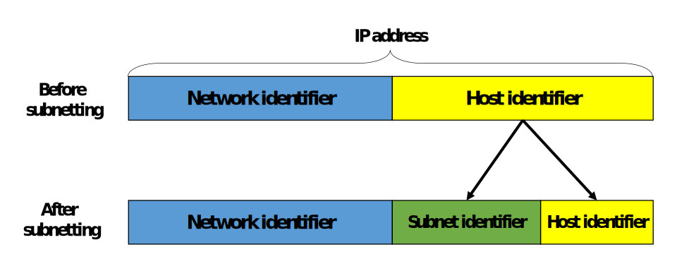
- Network prefix(网络地址)是IP地址与子网掩码做 `AND` 操作后的结果。 
- Host identifier(主机地址)是 IP地址与子网掩码的补码 做 `AND` 操作后的结果。 
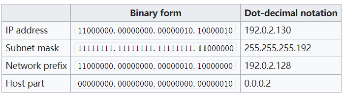


参考
  - [维基百科解释什么子网？](https://en.wikipedia.org/wiki/Subnetwork) 


## 4.7. default route (默认路由)
- 概念：默认路由是IP数据包的目的地址找不到存在的其它路由时，路由器所选的路由。
- 内容：目的地不在路由器的路由表里时，路由表里的所有数据包都会使用默认路由。这条路由 一般会连去另一个路由器，而这个路由器也同样处理数据包: 如果知道应该怎么路由这个数据包，则数据包会被转发到已知的路由；否则，数据包会被转发到默认路由，从而到达另一个路由器。每次转发，路由都增加了一跳的距离。
- 默认网关：主机里的默认路由通常被称作默认网关。默认网关通常会是一个有过滤功能的设备，如防火墙和代理服务器。


参考
  - [维基百科解释什么是默认路由？](https://zh.wikipedia.org/wiki/%E9%BB%98%E8%AE%A4%E8%B7%AF%E7%94%B1) 


## 4.8. IP( Internet Protocol)
因特网的网络层服务（IP服务） 是不可靠的。 IP 为主机 (host) 之间提供了逻辑通信。 IP 服务模型是尽最大的努力传递服务 (best-effort delivery service)。 这意味着 IP 尽它“最大的努力” 在通信的主机之间传递 报文段 (segments)， 但它并不做任何确保。 IP不保证数据报 (datagram) 的传递，不保证数据报的按顺序传递，也不保证 datagram 中数据的完整性。对于IP服务，datagram 能够溢出路由器缓存而永远不能到达目的地，datagram 也可能是乱序到达，而且 datagram 中的  bit 可能损坏 (由0变为1或者相反)。由于传输层 segment 是被IP数据报 (datagram) 携带着在网络中传输的， 所以传输层的 segment 也会遇到这些问题。


- IP地址=网络地址+主机地址，(又称：主机号和网络号组成)。ip地址通常用更直观的，以圆点分隔号的四个十进制数字表示，每个数字从0到255，如某一台主机的ip地址为：128.20.4.1在局域网里，同样也需要ip地址，一般内网的ip地址是以192.168开头的，这样很容易区分公网和内网的ip地址。


- IP数据报(IP datagram): IP传给网络接口层的数据单元。
- `TTL` 字段的目的是防止数据报在选路时无休止地在网络中流动。每次经过一个路由器，其值减一。
- IP提供不可靠、无连接的数据报传送服务。
- IP首部为 `20个字节`，若有选项字节，其最大不超过 `40字节`
<p align="center">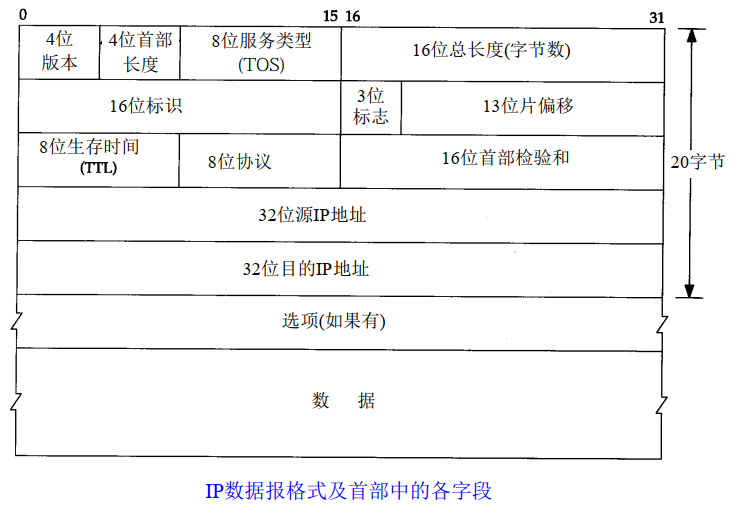</p>

- 五类通用的互联网地址
<p align="center"></p>

- 各类IP地址的范围
<p align="center"></p>

- 特殊的IP地址
  - 主机号和网络号全为 0，为 `DHCP`

- IP在首部中存入一个长度为 `8 bit` 的数值，称作 `协议域`。 
  - 1: ICMP协议
  - 2: IGMP协议
  - 6: TCP协议
  - 17: UDP协议

- 路由表中的每一项包含的信息
  - 目的IP地址。既可以是一个完整的主机地址，也可以是一个网络地址，由该表目中的标志字段来指定。
  - 下一站(下一跳)路由器的IP地址。
  - 标志位。一个标志指明目的 IP地址是网络地址还是主机地址，另一个标志指明下一站路由器是否为真正的下一站路由器，还是一个直接相连的接口。
  - 为数据报的传输指定一个网络接口。

- 网络传输过程中地址的变化
  - 源IP和目的IP地址通常情况下始终保持不变，除做NET地址映射转换以外。
  - 源MAC地址和目的MAC地址始终在变化，路由器每跳一次，数据链路层的MAC地址都会随之改变。


- IP分片 
  - 分片可以发生在原始发送端主机上，也可以发生在中间路由器上。
  - 把一份IP数据报分片后，只有到达目的地才进行重新组装。
  - 重新组装由目的端的IP层完成。目的是：使分片和重新组装的过程对传输层是透明的。
  - 已经分片的数据报可能会进行再次分片。

- IP分片注意事项
  - 分片时，除最后一片外，其它每一片中的数据都是 `8字节` 的整数倍数 。
  - 端口号在UDP首部中，只能在第一片中出现。

### 4.8.1. IP记录路由选项
- 路径记录选项：记下一个路由器的进和出的IP地址。
- IP路由是动态的：每个路由器都要判断数据报将转发到哪个路由器。应用程序对此不进行控制，而且通常也并不关心路由。


### 4.8.2. IP源站选路选项
- 发送端指明IP数据报所必须采用的确切路由。
- 发送端指明了一个数据报经过的 IP地址清单，但是数据报在清单上指明的任意两个地址之间可以通过其他路由器。
- IP首部源站路由选项的通用格式
  <p align="center">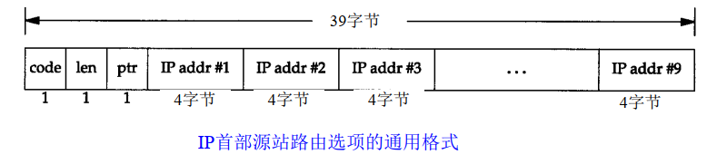</p>

- 严格源站：路由的每一跳之间必须是直连。
- 宽松源站


### 4.8.3. IP选路
- 选路原则
  - 匹配主机地址
  - 匹配网络地址
  - 匹配默认表项

- 标志位flags
  - `G标志` 区分了是直接路由还是间接路由。
  - `H标志` 目的地址是一个完整的主机地址。没有设置 `H标志`说明目的地址是一个网络地址(主机号部分为 0)。
  - `U标志` 该路由可以使用。
  - `D标志` 该路由是由重定向报文创建的。
  - `M标志` 该路由已被重定向报文修改。


- ICMP重定向差错
  - 当IP数据报被发送到另一个路由器时，收到数据报的路由器发送 ICMP重定向差错报文给IP数据报的发送端。
  - 只有在主机可以选择路由器发送 packet 的情况下，才可能看到ICMP发送重定向报文。
  - 重定向一般用来让具有很少选路信息的主机逐渐建立更完善的路由表。
  - 重定向报文只能由路由器生成，而不能由主机生成。
- 四种不同类型的重定向报文
  - 0 网络重定向
  - 1 主机重定向
  - 2 服务类型和网络重定向
  - 3 服务类型和主机重定向


- 路由表选项内容
  - `5  bit` 标志位
  - 目的IP地址
  - 下一站路由器的IP地址或本地接口的IP地址
  - 指向本地接口的指针 


## 4.9. ARP地址解析协议
- 作用：获取下一跳(下一个路由)的MAC地址。 即为IP地址与其对应的硬件地址之间提供动态映射。
- 物理地址大小为 `6 byte(即48  bit)` 

- ARP的 packet 格式
  <p align="center">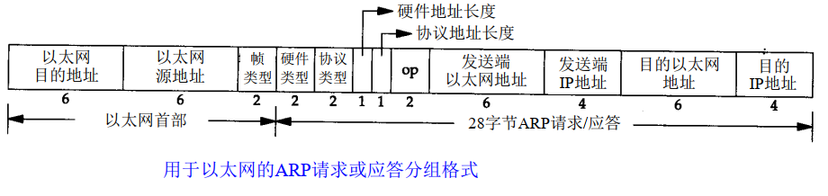</p>

- 2字节以太网帧类型，对ARP请求或应答来说，该字段的值为 `0x0806`
- 操作字段的四种操作类型
  - ARP请求：值为1
  - ARP应答：值为 2
  - RARP请求：值为3
  - RARP应答：值为4

  
- 代理arp
  - 概念：如果ARP请求是从一个网络的主机发往另一个网络上的主机，那么连接这两个网络的路由器就可以回答该请求。
- 免费arp
  - 概念：主机发送arp请求查询自己的IP地址。通常发送在系统引导期间进行接口配置的时候。
  - 作用
    - 一个主机可以用它来确认另外一个主机是否配置了相同的IP地址。
    - 若果发送免费arp的主机物理地址发生了改变，那么这个 packet 就可以使其它主机上旧的硬件地址进行更新。


## 4.10. RARP逆地址解析协议
- 作用：通过MAC地址寻找对应的IP地址。
-  packet 格式
  - RARP请求或应答的帧类型代码为 `0x8035`，而且RARP请求的操作代码为 `3`，应答操作代码为 `4`
  - RARP请求以广播方式传送，应答以单播方式传送。
  
  
## 4.11. ICMP(Internet控制报文协议)
- 作用：测试网络，反映网络中包出现的错误信息。
- ICMP封装在IP数据报内部的结构
  <p align="center">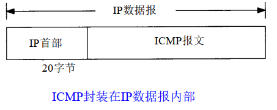</p>

- ICMP报文格式
  - 当发送差错一份ICMP报文时，差错报文包含税IP的头部和产生ICMP差错报文的IP数据报的前8个字节数据。这样，接收ICMP差错报文的模块就会把它与某个特定的协议(根据IP数据报首部中的协议字段来判断)和用户进程(根据包含在IP数据报前8个字节中的TCP或UDP报文首部中的TCP或UDP端口号来判断)联系起来。
  <p align="center">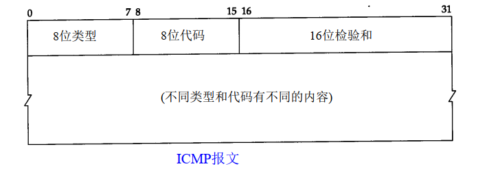<p>


- ICMP报文的类型
  <p align="center">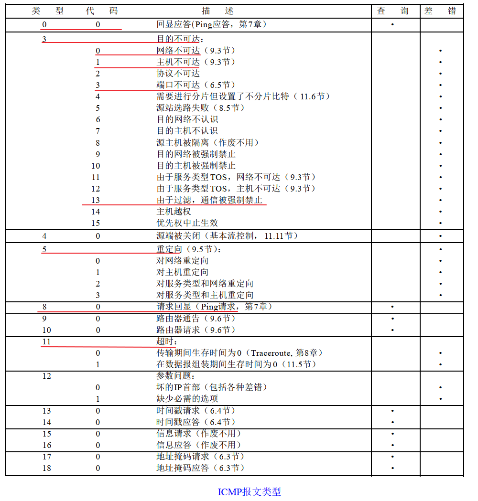</p>

- ICMP不可达差错
  - 发生的情况：路由器收到一份需要分片的数据报，而IP首部又设置了不分片的标志位。


- 什么情况下不会产生差错报文。
  - 差错报文自己不会差错报文。
  - 目的地址是广播或多播地址的IP数据报。
  - 链路层广播数据报。 
  - 不是IP分片的第一片，因为没有包含端口号。
  - 源地址不能是零地址、环回地址、单播地址、多播地址。

- ICMP地址掩码请求与应答
  - 数据报格式
  - ICMP地址掩码 `应答` 必须是收到请求接口的子网掩码。
  <p align="center">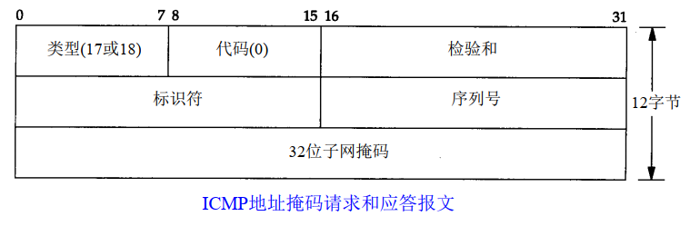</p>

- ICMP时间戳请求与应答
  - 时间戳：记录穿过所有设备的时间。 
  - ICMP时间戳请求允许系统向另一个系统查询当前的时间。 
  - 时间戳请求与应答数据报格式
  <p align="center"></p>


## 4.12. ping
- 作用：测试程序问题出现在哪里？测试这台主机的往返时间。
- 概念：该程序发送一份回显请求报文给主机，并等待返回ICMP回显应答。
- ping程序中ICMP请求和响应的数据报格式
  - unix中标识符为进程的ID。TTL计算方法：记下发送包当前的时间，将这个时间直接拷贝到 `选项数据`中，响应数据包时记下响应时间，用响应时间减去开始时间，即为TTL时间。
  - Windows下不管开多少个窗口，ping的标识符都是 `相同的`，每增加一个ping，包的序列号增加 `1`。发包时间和回显时间是在windows操作系统内部计算的，不是他通过ping直接计算。
  <p align="center"></p>


## 4.13. Traceroute
- 为什么要使用这个？
  - 并不是所有的路由选项都支持记录路由选项。
  - IP首部中留下记录选项的空间有限。
  - 记录路由选项一般是单向的，这样使得记录下来的IP地址翻了一倍。

- 操作过程
  > 开始时发送一个TTL字段为 `1` 的UDP数据报，然后将TTL字段每次加 1，以确定路径中的每个路由器。每个路由器在丢弃 UDP数据报时都返回一个 ICMP超时报文 `2`，而最终目的主机则产生一个 `ICMP端口不可达` 的报文。
- 注意点
  - Traceroute程序使用的是 ICMP报文和IP首部中的TTL字段。
  - TTL是一个跳站的路由器，每次经过路由器其值减一。
  - 当路由器收到一份IP数据报时，TTL字段是0或1时，路由器不转发该数据报，会将该数据报丢弃，并给源机发送一份 `ICMP超时信息`。
  - 当traceroute程序发送一份 `UDP` 数据报给目的主机时，它会选择一个不可能的值作为UDP端口号，使目的主机的任何一个应用程序都不可能使用该端口号。因为该数据报文到达时，目的主机将产生 `端口不可达错误`。


# 5. Link Layer(数据链路层)
- 数据链路层也称网络接口层，通常包括操作系统中的设备驱动程序和计算机中对应的网络接口卡。
- 作用
  - 为IP模块发送和接收IP数据报；
  - 为ARP模块发送ARP请求和接收ARP应答；
  - 为RARP发送RARP请求和接收RARP应答。 

 
## 5.1. 以太网帧格式
- 以太网和IEEE 802封装格式
  <p align="center">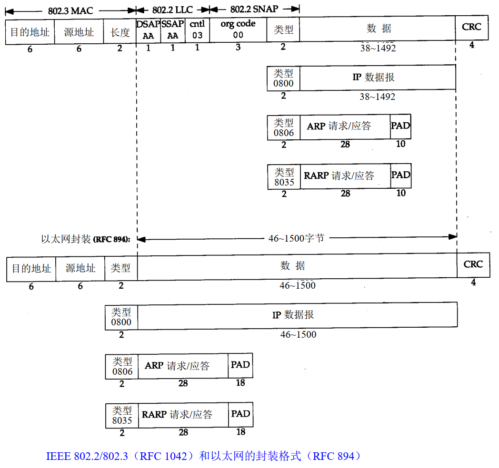</p>

- 帧(Frame): 通过以太网传输的比特流。
  - 长度必须在 46～1500字节之间。 

- 网络数据包 
  <p align="center">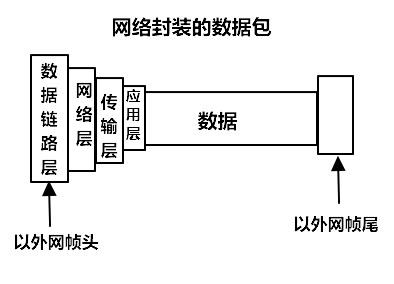</p>

- 数据进入协议栈时的封装过程 
  <p align="center">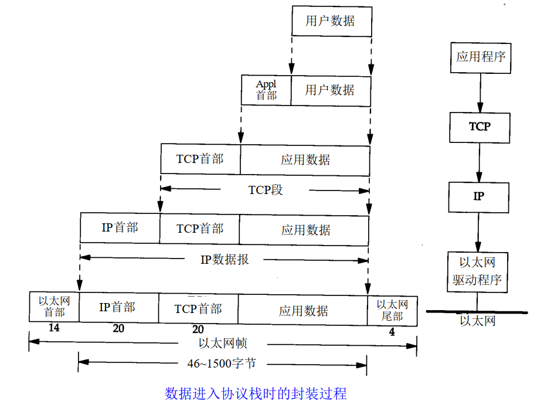</p>


## 5.2. PPP (点对点协议)
- 数据帧格式
  <p align="center"></p>

- 主要内容
  - 在串行链路上封装IP数据报
  - 建立、配置及测试数据链路的链路控制协议(LCP： Link Control Protocol)。它允许通信双方进行协商，以确定不同的选项。
  - 针对不同网络层协议的网络控制协议(NCP： Network Control Protocol)。
- 优点
  - PPP支持在单根串行线路上运行多种协议，不只是IP协议；
  - 每一帧都有循环冗余检验； 
  - 通信双方可以进行 IP地址的动态协商(使用IP网络控制协议)；
  - 与CSLIP类似，对TCP和IP报文首部进行压缩； 
  - 链路控制协议可以对多个数据链路选项进行设置。


## 5.3. Loopback Interface (环回接口)
  - 它允许运行在同一台主机上的客户程序和服务器程序通过 TCP / IP进行通信。 
  - A类网络号127就是为环回接口预留的。根据惯例，大多数系统把 IP地址 `127.0.0.1` 分配给这个接口，并命名为 `localhost`。一个传给环回接口的 IP数据报不能在任何网络上出现
  - 注意点
    - 传给环回地址(一般是127.0.0.1)的任何数据均作为 IP输入。   
    - 传给广播地址或多播地址的数据报复制一份传给环回接口，然后送到以太网上。
    - 任何传给主机IP地址的数据均送到环回接口。


## 5.4. IGMP (Internet组管理协议)
让一个网络上的所以系统都知道当前主机所在的多播组。

- IGMP报文封装在IP数据报中
  <p align="center"></p>

- 多播路由器使用 `IGMP报文` 来记录与该路由器相连网络中组成员的变化情况。


  
  
  
# 6. socket编程
- NAT映射
  - 作用对象
    - 公网---私网
    - 私网---公网

- 打洞机制
  - 作用对象
    - 私网---私网

- 大端法(Big-Endians)：高地址存低字节数据，低地址存储高字节数据
- 小端法(Small-Endins)：高地址存高字节数据，低地址存储低字节数据


- `inet_pton`和`inet_ntop`函数
  - `inet_pton()` 将点分十进制字符串类型的IP地址转化为网络二进制字节序
  - `inet_ntop()` 将网络二进制字节序转化为点分十进制字符串类型的IP地址
  > 注意缩写：`p` presentation：表达式； `n` numeric：数值


- `htons、ntohs、htonl和ntohl`函数
  - 主机字节序(本地)与网络字节序之间相互转换的几组API函数，本地套接字一般按照 `小端法` 存储，网络字节序一般按照 `大端法` 存储。 
  - 注意缩写：`h`：host，`n`：net，`l`：long，`s`：short
    ```c
    #include <netinet/in.h>
    uint16_t htons(uint16_t host16 bitvalue);
    uint32_t htonl(uint32_t host32 bitvalue);
    uint16_t ntohs(uint16_t net16 bitvalue);
    uint32_t ntohl(uint32_t net32 bitvalue);
    ```

## 6.1. 套接字地址结构
 ```c
 struct in_addr {
     in_addr_t  s_addr;           // 32- bit IPv4 address
                                  // network byte ordered
 }
 struct sockaddr_in {
     sa_family_t  sin_family;     // AF_INET
     in_port_t    sin_port;       // 16- bit TCP or UDP port nummber, network byte ordered
     struct in_addr    sin_addr;  // 32- bit IPv4 address, network byte ordered
     char     sin_zero[8];        // unused
 }

 struct sockaddr {
   sa_family_t  sa_family;        // address family: AF_XXX value
   char        sa_data[14];       // protocol-specific address
 }
 ```

- `struct sockaddr_in` 
  - 是网络套接字地址结构，大小为 `16字节`，定义在<netinet/in>头文件中，可用 `man 7 ip` 命令查看位置。
  - 一般我们在程序中是使用该结构体时，作为参数传递给套接字函数时需要强转为 `sockaddr` 类型，注意该结构体中 `port`和 `addr` 成员是网络序的(大端结构)。即定义时需要定义为 `struct sockaddr_in `;在调用时，需要强制转化为 `(struct sockaddr *)` 结构体类型
- `struct sockaddr`
  - 是套接字地址结构，当作为参数传递给套接字函数时，套接字地址结构总是以指针方式来使用，比如bind/accept/connect函数等。


- 套接字(socket)
  - 网络中成对出现
  - 一个文件描述符指向两个内核缓冲区(一个读、一个写)
  - 包含一个IP地址和一个端口号，指定IP和端口号


## 6.2. 网络套接字API
- `socket()` 
  - 作用：创建一个套接字
  - 参数
    - `domain`: 对于IPv4，`domain` 设置为 `AF_IENT`
    - `type`: 对于TCP，面向数据流的传输协议，应设置为 `SOCK_STREAM`；对于UDP，面向报文传输的协议，应设置为 `SOCK_DGRAM`
    - `protocol`: 根据情况而定，一般设置为 `0`
  - 返回值
    - 成功: 返回指向新创建socket的文件描述符
    - 失败：返回 `-1`

- `bind()` 服务器调用 `bind` 绑定固定的网络地址和端口号 
- `listen()` 服务器允许客户端同一时间可以建立多少连接，即最多允许有多少个客户端处于连接等待状态。
- `accept()` 服务器端的套接字上接受一个连接请求。
  - 返回值
    - 成功：返回一个全新的socket文件描述符，用于和客户端通信。
    - 失败：返回 `-1`
- `connect()` 客户端调用 `connect` 与服务器建立连接


- `read()`
  - 返回值大于 `0` 时，返回实际读到的字节数。
  - 返回值等你 `0` 时，`read()` 函数数据才读完。
  - 返回值等于 `-1` 时，出现异常
    - `errno == EINTR` 时，read函数被信号中断，则需要重启或退出(quit)。
    - `errno == EAGAIN` 时，以非阻塞(EWOULDBLOCK)的方式去读，但是读到的没有数据。 
    - 出现其它的值时，则执行 `perror()` 函数显示错误提示。


- `readline()` 读取一行的内容，遇到 `\n` 则结束

> 注意点：在使用套接字函数时，需要对函数做错误检查，保证代码的鲁棒性，可以把错误检查的代码封装在一起。

- `shutdown(int sockfd, int how)` 在应用程序中执行一个半关闭的状态 
  - 参数 how 
    - `SHUT_RD` 关闭sockfd套接字上的读共能 
    - `SHUT_WR` 关闭sockfd套接字上的写共能 
    - `SHUT_RDWR` 关闭sockfd套接字上的读写共能，相当于两次调用 `shutdown()`, 第一次以 `SHUT_RD`调用，第二次以 `SHUT_WR` 调用。
  - 注意点
    - `shutdown`函数不考虑文件描述符的引用计数，直接关闭文件描述符。而 `close()`函数每次关闭一次，文件描述符的个数就减一，直到计数为 0 时，所有的进程都调用了 `close()`，套接字才全被释放。
    - 在多进程的通信中，若一个进程调用了 `shutdown(sfd, SHUT_RDWR)`，则其它的进程不能进行通信；若一个进程调用了 `close(sfd)`，将不会影响其它进程的通信。


# 7. 高并发
## 7.1. 多进程并发服务器
实现的思想：用父子进程(fork)和信号捕捉(signal()或sigaction)去实现。父进程关闭客户端的文件描述符，并进行信号的捕捉，回收子进程，来处理僵尸进程；子进程关闭服务端的文件描述符，进行信号的注册。


## 7.2. 多线程并发服务器
- 实现的思想：设置线程的属性和线程的分离 `pthread_detach`
- 无路是采用多进程并发服务器还是多线程并发服务器，对服务器的产生的开销都比较大，一般只用一些比较小的场合，像大型的网络一般不适用，需要用到多路IO转接模型来实现。


## 7.3. 多路IO转接模型
UDP 和 TCP 最基本的责任是: 将两个端系统间 IP 的传递服务扩展为运行在端系统上的两个进程之间的传递服务。将主机间传递扩展到进程间传递被称为传输层的多路复用 (transport-layer multiplexing) 与多路分解 (demultiplexing) 

- 多路IO转接模型原理：不再由应用程序(服务器)直接监听客户端，而是通过内核替代应用程序进行监听文件。
- 查看一个进程可以打开sock文件描述符的上限值 `cat /proc/sys/fs/file-max`
- 端口复用函数
  - `setsockopt()` :一般插入在 `socket()` 函数与 `bind()` 函数之间。


### 7.3.1. select
- 监听所有文件描述符中最大的文件描述符
- 数据请求事件
  - read
  - write
  - error
- 返回值：返回监听的文件描述符总数。
- 缺点
  - Linux中select监听文件描述符的的最大值为 1024 
  - 需要自定一个数据结构(数组)去遍历哪些文件描述符满足条件。
  - 每次进行操作的时候，需要将监听的集合和满足条件监听的集合进行保存，因为每次的操作会修改原有集合的值。
- 四个辅助函数
  - `void FD_ZERO(fd_set *set)` 将set清0
  - `void FD_CLR(int fd, fd_set *set)` 将fd从set中清除出去
  - `void FD_SET(int fd, fd_set *set)` 将fd设置到set集合中去
  - `int FD_ISSET(int fd, fd_set *set)` 判断fd是否在set集合中 


### 7.3.2. poll
- 函数原型：`int poll(struct pollfd *fds, nfds_t nfds, int timeout);` 
- 参数
  - `fds` 数组的首地址  
  - `nfds` 数组中元素的个数
  - `timeout` 超时时间(单位为ms级别)
    - `-1` 阻塞等待
    - `0`  立即返回，不阻塞等待
    - `>0` 等待指定的时间长度
- 优点
  - 监听文件描述符的返回值可以超过 1024
  - 实现了监听集合与返回集合的分离
  - 仅在数组中搜索，范围变小了，但是效率还是比较低


### 7.3.3. epoll
- 函数
  - `epoll_create(int size);`   创建一个epoll，返回值指向Linux内核中的平衡二叉树(红黑树)的树根。
  - `epoll_ctl(int epfd, in op, in fd, struct epoll_event *event);` 控制某个epoll监听的文件描符上的事件：注册、删除、修改。
    - `op`: EPOLL_CTL_ADD/ EPOLL_CTL_MOD/ EPOLL_CTL_DEL
    - `event`: EPOLL_IN/ EPOLL_OUT / EPOLL_ERR
  - `epoll_wait(int epfd, struct epoll_event *event, int maxevents, int timeout);` 等待所有监控文件描述符上事件的产生，即监听epoll红黑树上事件的发生。
    - `struct epoll_event *event` event为传出参数，是一个数组。
    - `int maxevents` 数组的最大值  

- 三种触发模式
  - `epoll ET` 边沿触发
    - 只有client发送数据时，才会触发。
    - 调用：`event = EPOLLIN | EPOLLET`
    - client将大量的数据存到epoll的缓冲区中时，server只从epoll中读取一部分的数据，这部分的数据概括了缓冲区中所有数据的信息，缓冲区中剩余的数据根据需求来进行取舍。
  
  - `epoll LT` 水平触发  
    - 系统不做任何的声明，一般默认是水平触发。
    - 一次性对 `read()` 函数进行操作，只有 `read()` 函数执行完后，才会进行水平触发。

  - 非阻塞IO方式
    - 优点：减少 `epoll_wait` 函数调用的次数，提高效率。
    - `open()` 函数，在socket套接字中不适用。
    - 结合 `fcntl()` 函数和 `readn()` 函数一起使用。 `readn()` 一次性读取 `n` 个字节后才返回。
    - 如何使用？
      - 使用边沿触发方式 
      - 执行过程中使用 `while(read())`
      - 调用 `fcntl(0_NOBLOCK)`

- epoll应用场景：不仅可以用于socket套接字 ，还可以用于管道和文件中。

- epoll反应堆模型
  - 核心思想：调用了 `libevent` 库
  - 使用 `libevent` 库优点：库的底层大量采用了回调的思想，即函数指针的使用，同时也是跨平台的。


# 8. 常用网络命令
- mtr 网络侦测工具
- traceroute 
- tcpdump
- ip rout
- curl/wget
- netstat
  - `-a` 查看所有的信息
  - `-at`  查看TCP包相关的信息
  - `-au`  查看UDP包相关的信息
  - `-tnl` 查看监听的程序
  - `-ano`显示套接字
  - `- r` 或 `route print` 查看路由表
  - `-an` 查看当前网络的连接会话
- `arp -a` 查看apr缓存
- `arp -d` 清除apr缓存
- `ifconfig或ipconfig`
  - `ipconfig /all` 显示完整配置信息 
- `nc(netcat)` 
  - 作用：从命令行跨网络读取和写入数据。 
  - 用途
    - 侦听任意端口，以TCP/UDP 方式
    - 端口扫描
    - 传输文件
    - 测速  

# 9. 参考
- [TCP/IP协议.卷一](https://www.kancloud.cn/lifei6671/tcp-ip/139758)
- [TCP超时与重传机制](https://www.cnblogs.com/duan2/p/9180861.html) 
- [详解 TCP 连接的“ 三次握手 ”与“ 四次挥手 ”](https://baijiahao.baidu.com/s?id=1654225744653405133&wfr=spider&for=pc)
- [TCP/IP三次握手四次挥手常见面试题](https://www.jianshu.com/p/b8a3dde775cd)
- [理解TCP/IP三次握手与四次挥手的正确姿势](https://www.cnblogs.com/lms0755/p/9053119.html)
- [简述TCP的三次握手过程](https://blog.csdn.net/sssnmnmjmf/article/details/68486261)
- [TCP/IP三次握手详解](https://blog.csdn.net/metasearch/article/details/2147213)
- [深入理解基本套接字编程](https://www.cnblogs.com/luoxn28/p/5819798.html)


