<!--
 * @Author: JohnJeep
 * @Date: 2019-12-27 21:05:38
 * @LastEditTime: 2020-07-05 21:41:32
 * @LastEditors: Please set LastEditors
 * @Description: 读网络是怎样连接的笔记
 * @FilePath: /ComputerNetwork/1.网络是怎样连接的.md
--> 
<!-- TOC -->

- [0.1. 常用术语缩写](#01-常用术语缩写)
- [0.2. 常用命令](#02-常用命令)
- [0.3. 常见端口号](#03-常见端口号)
- [0.4. 浏览器生成消息的步骤](#04-浏览器生成消息的步骤)
- [0.5. 协议栈（操作系统中的网络控制软件）工作流程](#05-协议栈操作系统中的网络控制软件工作流程)
- [0.6. 交换机( switching hub)、路由器(router)、集线器(repeater hub)](#06-交换机-switching-hub路由器router集线器repeater-hub)
- [0.7. 通过接入网进入互联网内部](#07-通过接入网进入互联网内部)
- [0.8. 服务器端的局域网](#08-服务器端的局域网)
- [0.9. 请求到达Web服务器，响应返回浏览器](#09-请求到达web服务器响应返回浏览器)

<!-- /TOC -->

## 0.1. 常用术语缩写
- URL：统一资源定位符(Uniform Resource Locator)
- DNS: 域名系统(Domain Name System)
- ADSL：非对称数字用户线路(Asymmetric Digital Subscriber Line) 。它是一种
利用架设在电线杆上的金属电话线来进行高速通信的技术，它的上行方向（用户到互联网）和下行方向（互联网到用户）的通信速率是不对称的。
- FTTH: 光纤到户(Fibre To The Home)
- IX：互联网交换(Internet eXchange)
- FTP：文件传输协议(File Transfer Protocol)
- HTTP：超文本传送协议(Hyper Text Transfer Protocol)
- 协议：通信操作的规则定义称为协议（ protocol）
- URI：统一资源标识符(Uniform Resource Identifier)
- ARP: 地址解析协议(Address Resolution Protocol) 根据已知 IP 地址查询出相应的以太网 MAC 地址 
- RARP: 逆地址解析协议(Reverse Address Resolution Protocol) 允许局域网的物理机器从网关服务器的 ARP 表或者缓存上请求其 IP 地址。
- TCP：传输控制协议(Transmission Control Protocol)
- UDP：用户数据报协议(User Datagram Protocol)
- IP：网络协议(Internet Protocol)
- ICMP：网络控制消息协议(Internet Control Message Protocol)  用于告知网络包传送过程中产生的错误以及各种控制消息，
- DNS服务器：根据 Web 服务器的域名来查询 IP 地址
- IP地址：用来识别连接在互联网上的计算机和服务器的地址
- MIME: 多用途因特网邮件扩充(Multipurpose Internet Mail Extensions)
- 协议栈：操作系统内部的网络控制软件，也叫“协议驱动”“TCP/IP 驱动”等。
- IANA: 互联网编号管理局(Internet Assigned Number Authority)。统一分配端口号（1~1023）的机构。
- PID: 进程标识符(Process IDentification) 操作系统为了标识程序而分配的编号 
- MTU: 最大传输单元(Maximum Transmission Unit)。一个网络包的最大长度，以太网中一般为1500字节。
- MSS：最大分段大小(Maximum Segment Size)。TCP传往另一端的最大块数据的长度。除去头部后，一个网络包所能容纳的TCP数据的最大长度。TCP 和 IP 的头部加起来一般是 40 字节。
- 以太网数据帧：分为以太网头部(14字节)、IP头部、TCP头部、应用数据、以太网尾部(4字节)。长度在46~1500字节之间。
- SFD: 起始帧分界符(Start Frame Delimiter)
- FCS: 帧校验序列(Frame Check Sequence)
- 集线器：在子网中将网络包传输到下一个路由器，按照以太网规则传输包的设备
- 路由器：根据目标地址判断下一个路由器的位置，按照IP规则传输包的设备。
- MAC：媒体存取控制位地址(Media Access Control)，也叫以外网地址或物理地址
- MAU: 介质连接单元(Medium Attachment Unit)，低速方式的信号收发模块
- PHY: 物理层装置(Physical Layer Device)， 100 Mbit/s 以上的以太网中信号收发模块
- MDI: 媒体相关接口(Media Dependent Interface)
- MDI-X：交叉接线(Media Dependent Interface Crossover)
- TTL：生存时间(Time To Live), 表示包的有效期。设置了数据报可以经过的最多路由器数。
- PPPoE: 以太网上的点对点协议(Point-to-Point Protocol Over Ethernet)
- PPP：点到点协议(Point-to-Point Protocol)
- BAS: 宽带接入服务器(Broadband Access Server)。负责将 ATM 信元还原成网络包并转发到互联网内部
- ATM：异步传输(Asynchronous Transfer Mode)。以信元为单位传输
- IDF: 中间配线盘(Intermediate Distribution Frame)
- MDF: 主配线盘(Main Distribution Frame)
- DSLAM: 数字用户线接入复用设备(Digital Subscriber Line Access Multiplexer)
- ONU：光网络单元(Optical Network Unit)
- OLT: 光线路终端(Optical Line Terminal)
- RADIUS: 远程认证拨号用户服务(Remote Authentication Dial-in User Service)
- RAS: 远程访问服务器(Remote Access Server)
- HDLC：高级数据联接控制(High-level Data Link Control)
- CHAP: 挑战握手认证协议(Challenge Handshake Authentication Protocol)
- PAP: 密码验证协议(Password Authentication Protocol)
- DHCP：动态主机配置协议(Dynamic Host Configuration Protocol)
- POP: 接入点(Point Of Presense)
- NOC：网络运营中心(Network Operation Center)
- BGP：边界网关协议(Broder Gateway Protocol)
- WAN：广域网(Wide Area Network)
- LAN：局域网(Local Area Network)
- CIDR: 无类别域间路由(Classless inter-domain routing) 
- ICANN: 互联网名称与数字地址分配机构(The Internet Corporation for Assigned Names and Numbers)
- CNNIC: 中国互联网络信息中心（China Internet Network Information Center)
- InterNIC: 互联网络信息中心(Internet Network Information Centre)。 只分配网络号，主机号的分配由系统管理员来负责。
- NAT: 网络地址转换(Network Address Translation)。在同个公司、家庭、教室内的主机对外部通信时，把私有 IP 地址转换成公有 IP 地址。
- NAPT：网络端口地址转换(Network Address Port Translation)
- IGMP：Internet 组管理协议(Internet Group Management Protocol)。作用在主机（组播成员）和最后一跳路由之间，用来把一个UDP数据报多播到多个主机。
- RFC：请求意见稿(Request For Comment)
- SNAP: 子网接入协议(Sub-network Access Protocol)
- DSAP: 目的服务访问点(Destination Service Access Point)
- SSAP: 源服务访问点(Source Service Access Point) 
- 令牌环网（Token-ring network）
- RTT: 往返时延(Round-Trip Time)。它的值是收到应答时的时间值减去发送请求时的时间值。
- MSL：最大段生命时间(Maximum Segment Lifetime)。是任何的报文在被丢弃前，网络中的最长时间。
- ISN: 初始序号(Initial Sequence Number) 
- FIN: TCP首部中的结束标志(FINish) 
- ACK: TCP首部中的确认标志(ACKnowledgment) 
- RIP: 路由信息协议(Routing Information Protocol)

## 0.2. 常用命令
- `route print`显示路由表
- ` netstat -ano`显示套接字
- `arp -a` 显示ARP缓存

## 0.3. 常见端口号
- Web：80
- 邮件(mailto)：25
-  Windows 文件服务器使用的端口：139

## 0.4. 浏览器生成消息的步骤
1. 生成HTTP请求消息
- 对URL进行解析(URL开头表示：访问方法)
- IP地址
  - IP地址=网络号+主机号
  - 是一串32bit的数字，按照 8 比特（ 1 字节） 为一组分成 4 组，分别用十进制表示然后再用圆点隔开。 
- 子网掩码：用来指明一个IP地址的哪些位标识的是主机所在的子网，以及哪些位标识的是主机的位掩码，即用来指定网络号和主机号比特数的值。
  - 不能单独存在，必须与IP地址一起使用
  - 是一个32位的地址
  - 子网掩码为 1 的部分表示网络号， 子网掩码为 0 的部分表示主机号。
  - 主机号部分比特全为0，代表整个子网而不是子网中的某台设备。`10.11.12.0/24`
  - 主机号部分全部为 1， 代表这个地址向子网上所有设备发送包，即广播。`10.11.12.255/24`

2. 向DNS服务器查询Web服务器的IP地址
- DNS服务器
  - 基本工作：接收来自客户端的查询消息，然后根据消息的内容返回响应。
  - 客户端的三种查询消息
    - 域名
    - Class：用来识别网络的信息（互联网的值为：IN）
    - 记录类型：表示域名对应何种类型的记录。(A: Address; MX: Mail eXchange 邮件交换)
- DNS 服务器会从域名与 IP 地址的对照表中查找相应的记录，并
返回 IP 地址。

3. 委托操作系统内部的协议栈将消息发送给Web服务器
- Socket库：用于调用网络功能的程序组件集合。
- 解析器(resolver)在操作系统的Socket库中。
- 向操作系统内部的协议栈发出委托时，需要按照指定的顺序来调
用 Socket 库中的程序组件。
- Socket库收发数据流程
  - 创建套接字
  - 将管道连接到服务器端的套接字上
  - 发送数据
  - 断开管道并删除套接字(根据应用种类不同，客户端和服务器哪一方先执行 close 都有可能)
- 描述符：应用程序用来识别套接字的机制
- IP 地址和端口号：客户端和服务器之间用来识别对方套接字的机制  

## 0.5. 协议栈（操作系统中的网络控制软件）工作流程
 TCP操作的整体流程 

1. 创建套接字
  - 套接字的实体：通信控制信息
  - 协议栈是根据套接字中记录的控制信息来工作的
  - 套接字的作用：套接字中记录了用于控制通信操作的各种控制信息，协议栈需要根据这些信息判断下一步的行动

2. 连接服务器
  - 连接的实质：通信双方交换控制信息
  - 头部(网络包头部)：用来记录和交换控制信息
  - 两类控制信息
    - 客户端和服务器相互联络时交换的控制信息，即头部记录的信息。(整个通信过程都需要)
    - 保存在套接字中，用来控制协议栈操作的信息，即套接字(协议栈中的内存空间)中记录的信息。
3. 收发数据
  - 通过“序号”和“ACK 号”可以确认接收方是否收到了网络包。通过这一机制，可以采取相应的错误补偿机制。
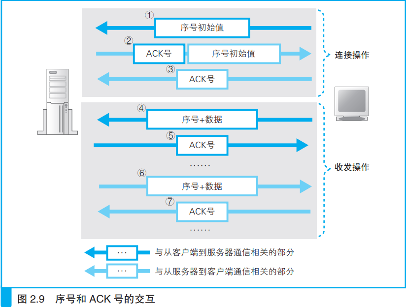

- 根据网络包平均往返时间调整 ACK 号等待时间。TCP采用动态调整等待时间的方法。这个等待时间是根据 ACK 号返回所需的时间来判断的。

 - 采用滑动窗口方式来有效管理ACK号。
    - 滑动窗口：在发送一个包之后， 不等待 ACK 号返回， 而是直接发送后续的一系列包。 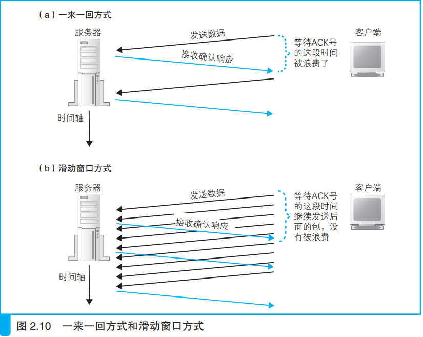
    - 采用滑动窗口的方式，将数据存储到缓存区。首先， 接收方需要告诉发送方自己最多能接收多少数据，
然后发送方根据这个值对数据发送操作进行控制。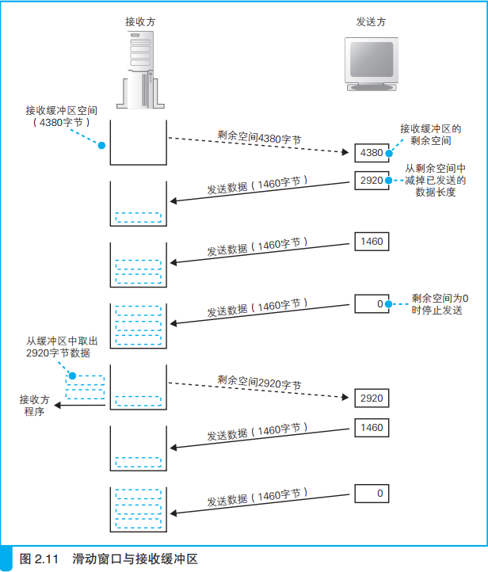

 - 更新窗口大小时机：接收方从缓冲区中取出数据传递给应用程序的时候，导致接收缓冲区剩余容量增加时，需要要告知给发送方。
  - ACK号：当接收方收到数据时，如果确认内容没有问题，应该向发送方返回ACK号。
-  注意： 
需要连续发送ACK号和连续发生窗口更新时，只需要发送最终的结果，可以提高效率。

4. 从服务器断开连接并删除套接字
- 数据发送完数据后断开连接。例如：服务一方先发送断开连接。
  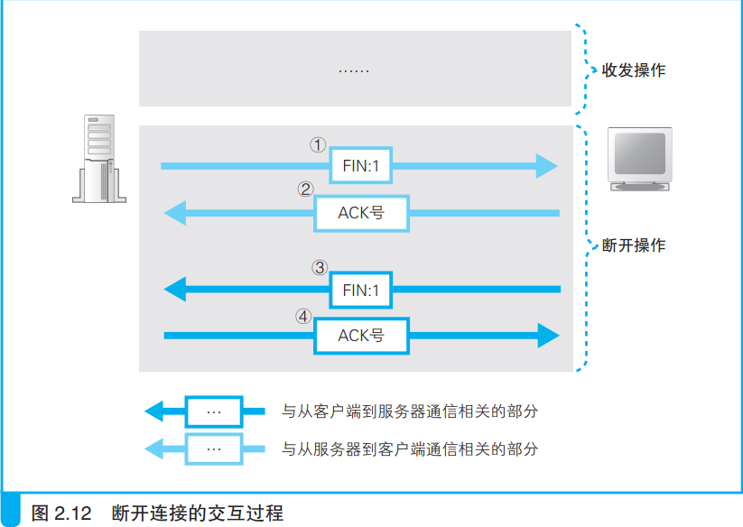
- 删除套接字
  - 套接字并不会立即被删除， 而是会等待一段时间之后再被删除。
  - `等待这段时间` 是为了防止误操作， 

5. IP 与以太网的包收发操作
- 包：由头部和数据两部分构成。头部记录了各种控制信息
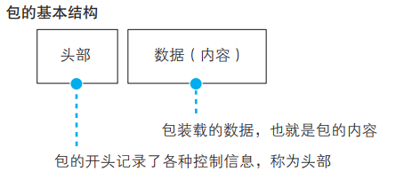
- TCP/IP包
  - MAC头部：用于以太网协议 
  - IP头部：用于IP协议
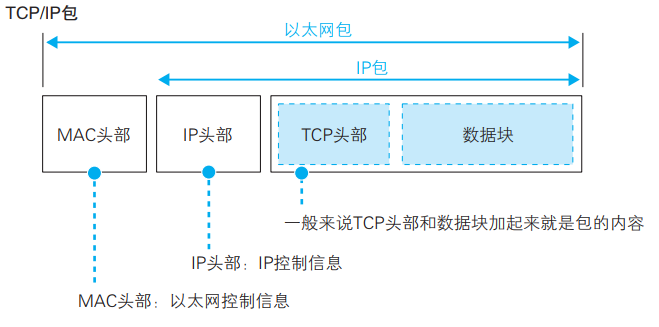
  - 两个头部的作用：
    - 将要访问的服务器的 IP 地址写入 IP 头部中，然后，IP 协议会委托以太网协议将包传输过去。 这时， IP 协议会查找下一个路由器的以太网地址（ MAC 地址），并将这个地址写入 MAC 头部中。
- 网络包在传输过程中经过集线器。集线器里有一张表（ 用于以太网协议的表）， 可根据以太网头部中记录的目的地信息查出相应的传输方向。 
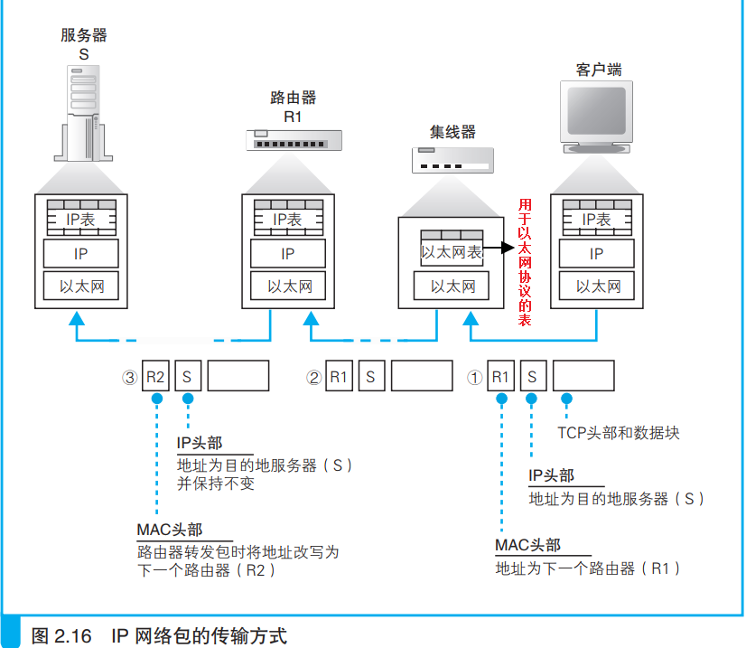

- 转发设备中有一张记录了什么地址要往哪里发送的表。按照头部里记录的目的地址在表里进行查询， 并根据查到的信息判断接下来应该发往哪个方向。
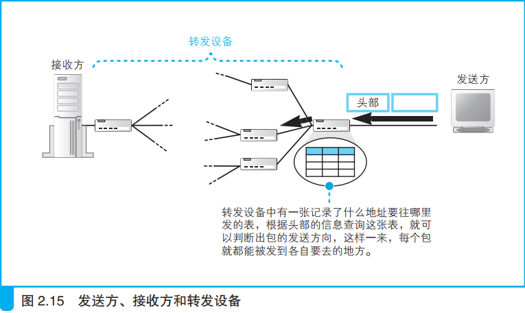

- IP模块负责的功能
  - (1)添加MAC 头部：以太网用的头部，包含 MAC 地址
  - (2)添加IP 头部：IP 用的头部，包含 IP 地址 
- IP 模块根据路由表 Gateway 栏的内容判断应该把包发送给谁。

- IP地址长度：32比特，即4字节
- MAC地址长度：48比特，即6字节
- MAC头部字段(14 byte)
  - 接收方MAC地址48比特
  - 发送方MAC地址48比特
  - 以太网类型16比特

- 以太网三个基本性质
  - 将包发送到 MAC 头部的接收方
  - 用发送方 MAC地址识别发送方
  - 用以太类型识别包的内容

-  网卡结构  
- 

- 网卡中保存的 MAC 地址会由网卡驱动程序读取并分配给 MAC模块。
- 用 UDP 协议收发数据的操作
- 应用场景
  - 发送音频和视频数据 
  - 不需要重发的数据，例如：用DNS 查询等交换控制信息
- UDP可发送的数据最大长度等于IP包最大长度减去IP头部和UDP头部

## 0.6. 交换机( switching hub)、路由器(router)、集线器(repeater hub)
- 交换机端口的 MAC 模块不具有 MAC 地址。（内置用于实现管理等功能的处理器的交换机除外）
- 交换机根据 MAC 地址表查找 MAC 地址，然后将信号发送到相应的端口。
- 交换机的全双工模式可以同时发送和接收信号

- 路由器是基于 IP 设计的， 而交换机是基于以太网设计的 
- 路由器工作原理：主要有两部分模块
  -  转发模块：负责判断包的转发目的地
  -  端口模块：负责包的收发操作
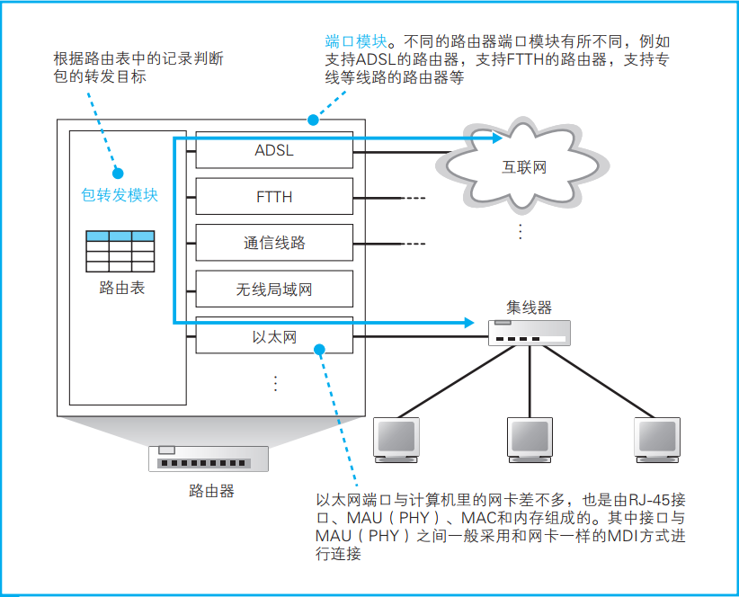
- 路由器的各个端口都具有 MAC 地址和 IP 地址
- 交换机是通过 MAC 头部中的接收方 MAC 地址来判断转发目标， 而路由器则是根据 IP 头部中的 IP 地址来判断。 
- 路由器会忽略主机号，只匹配网络号。
- 路由器的端口都具有 MAC 地址，只接收与自身地址匹配的包，遇到不匹配的包则直接丢弃
- 通过路由器转发的网络包，其接收方 MAC 地址为路由器端口的MAC 地址。

- 交换机与路由器之间关系
- IP（ 路由器） 负责将包发送给通信对象这一整体过程， 而其中将包传输到下一
个路由器的过程则是由以太网（ 交换机） 来负责的。

- 地址转换：转发网络包时对 IP 头部中的 IP 地址和端口号 进行改写。
  > 用于区分公有IP地址和私有IP地址的分界线
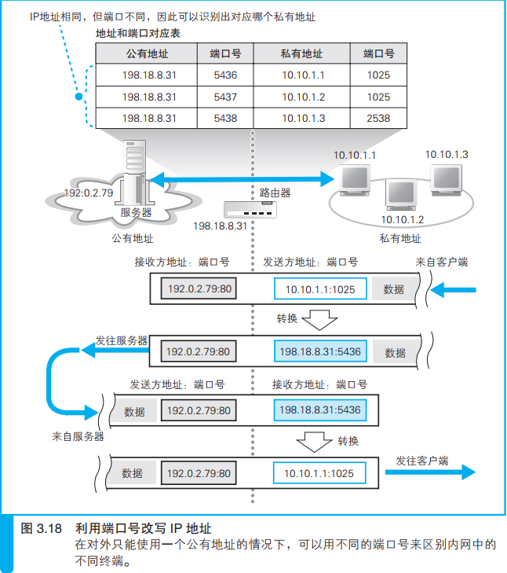
- 改写端口号的目的：提高公有地址的利用率，不需要私有地址和公有地址必须一一对应。

- 路由器包过滤：根据MAC头部、IP头部、TCP头部的内容 ，按照
事先设置好的规则决定是转发这个包， 还是丢弃这个包。

## 0.7. 通过接入网进入互联网内部
- 互联网接入路由器会在网络包前面加上 MAC 头部、PPPoE 头部、PPP 头 部 总 共 3 种 头 部， 然 后 发 送 给 ADSL Modem（PPPoE 方式下）。
- 分离器的作用：过滤高频信号，防止ADSL对电话产生干扰，还防止电话对ADSL产生干扰。
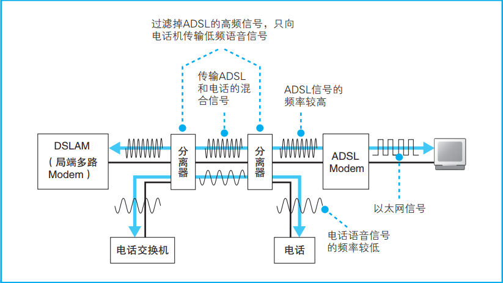

-  网络包进入互联网流程  
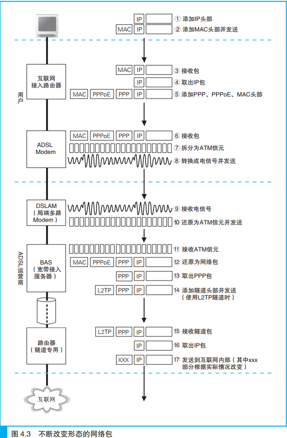

- PPPoE 是将 PPP 消息装入以太网包进行传输的方式
-互联网接入路由器通过 PPPoE 的发现机制查询 BAS 的 MAC 地址。
- BAS 在收到用户路由器发送的网络包之后，会去掉 MAC 头部和
PPPoE 头部，然后用隧道机制将包发送给网络运营商的路由器。
- PPoE方式的ADSL接入网：先将 PPP 消息装入以太网包中， 然后再将以太网包拆分并装入信元

- DHCP原理
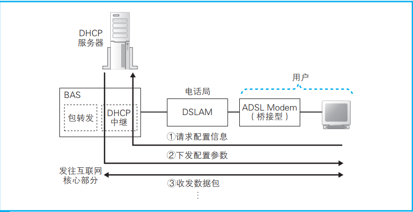

- 互联网内部使用 BGP 机制在运营商之间交换路由信息。

## 0.8. 服务器端的局域网
- 防火墙
  - 包过滤方式的防火墙可根据接收方 IP 地址、发送方 IP 地址、接收方端口号、发送方端口号、控制位等信息来判断是否允许某个包通过。

- 通过将请求平均分配给多台服务器来平衡负载，提高服务器的性能。
-  对多台 Web 服务器分配访问的负载均衡器   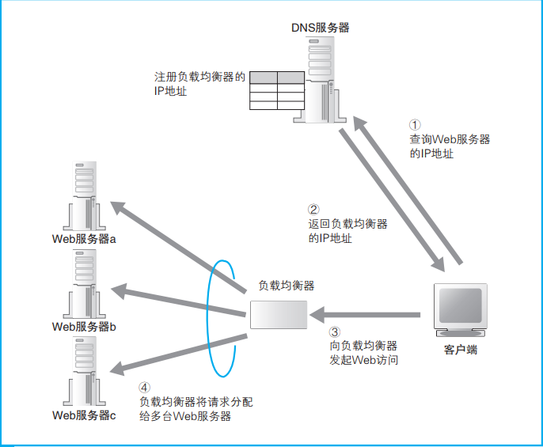

- 采用缓存服务器的方法实现分担负载。
  - 缓存服务器是一台通过代理机制对数据进行缓存的服务器。 
- 缓存服务工作流程图  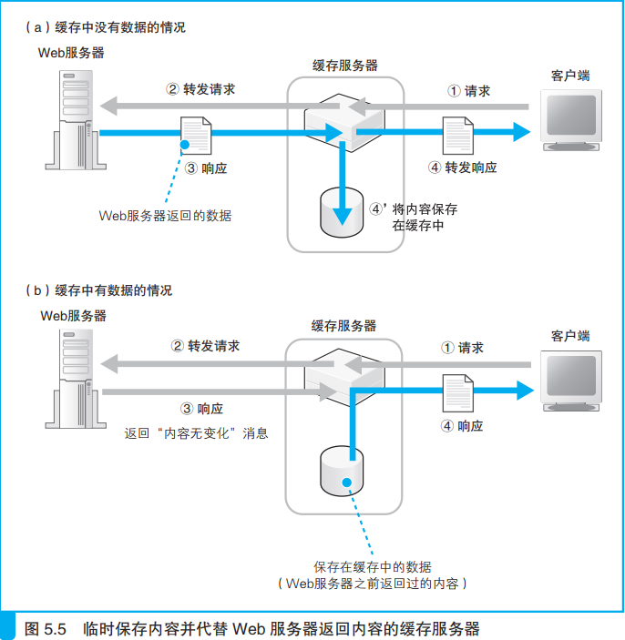

- 缓存服务器的3种部署方式
  - 将缓存服务器部署在Web服务器之前：降低Web服务器的负载，但是无法减少网络流量。
  - 部署在客户端：减少网络流量较好，但Web服务器运营者无法控制位于客户端的缓存服务器
  - 部署在互联网的边缘：降低网络流量，而且网络运营者也可以控制缓存服务器。

- DNS服务器的工作流程 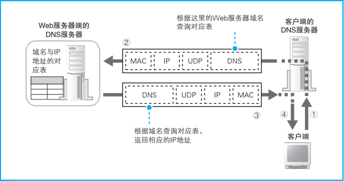

## 0.9. 请求到达Web服务器，响应返回浏览器
- 网卡的 MAC 模块将网络包从信号还原为数字信息，校验 FCS并存入缓冲区。
- 网卡驱动会根据 MAC 头部判断协议类型，并将包交给相应的协议栈。 
- 协议栈的 IP 模块会检查 IP 头部
  - (1)判断是不是发给自己的；
  - (2)判断网络包是否经过分片;
  - (3)将包转交给 TCP 模块或 UDP模块

- TCP模块收到是发起连接的包，如何处理？
  - (1)确认 TCP 头部的控制位 SYN
  - (2)检查接收方端口号
  - (3)为相应的等待连接套接字复制一个新的副本
  - (4)记录发送方 IP 地址和端口号等信息。

- TCP模块收到数据包时，如何处理？
  - (1)根据收到的包的发送方 IP 地址、发送方端口号、接收方 IP 地址、接收方端口号找到相对应的套接字
  - (2)将数据块拼合起来并保存在接收缓冲区中；
  - (3)向客户端返回 ACK
