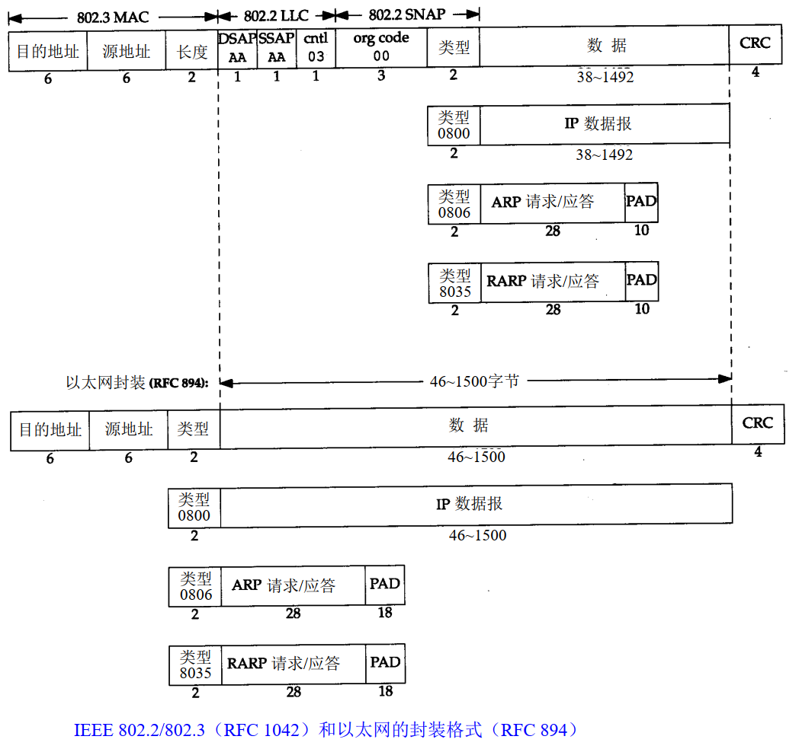
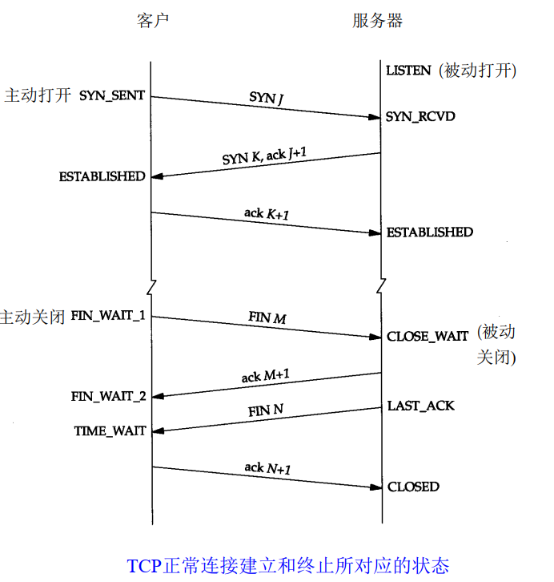

<!--
 * @Author: JohnJeep
 * @Date: 2019-12-27 22:32:08
 * @LastEditTime: 2020-07-05 14:39:12
 * @LastEditors: Please set LastEditors
 * @Description: 网络数据相关协议学习
 * @FilePath: /ComputerNetwork/2.tcp-ip协议.md
--> 

<!-- TOC -->

- [0.1. 参考](#01-参考)
- [0.2. 基础概念](#02-基础概念)
- [0.3. 数据链路层](#03-数据链路层)
  - [0.3.1. 以太网帧格式](#031-以太网帧格式)
  - [0.3.2. PPP（点对点协议）](#032-ppp点对点协议)
  - [0.3.3. 环回接口（Loopback Interface）](#033-环回接口loopback-interface)
- [0.4. IP(网络层)](#04-ip网络层)
- [0.5. ARP地址解析协议](#05-arp地址解析协议)
  - [0.5.1. RARP逆地址解析协议](#051-rarp逆地址解析协议)
- [0.6. ICMP(Internet控制报文协议)](#06-icmpinternet控制报文协议)
  - [0.6.1. ping程序](#061-ping程序)
  - [0.6.2. IP记录路由选项](#062-ip记录路由选项)
  - [0.6.3. Traceroute程序](#063-traceroute程序)
  - [0.6.4. IP源站选路选项](#064-ip源站选路选项)
- [0.7. IP选路](#07-ip选路)
- [0.8. UDP（用户数据报协议）](#08-udp用户数据报协议)
- [0.9. 广播多播](#09-广播多播)
- [0.10. IGMP（Internet组管理协议）](#010-igmpinternet组管理协议)
- [0.11. 域名系统DNS](#011-域名系统dns)
- [0.12. TCP](#012-tcp)
  - [0.12.1. TCP的建立与终止](#0121-tcp的建立与终止)
  - [0.12.2. TCP交互数据流](#0122-tcp交互数据流)
  - [0.12.3. TCP成块数据流](#0123-tcp成块数据流)
  - [0.12.4. TCP的超时和重传](#0124-tcp的超时和重传)
  - [0.12.5. TCP坚持定时器](#0125-tcp坚持定时器)
  - [0.12.6. TCP保活定时器](#0126-tcp保活定时器)
- [0.13. 常用网络命令](#013-常用网络命令)

<!-- /TOC -->

## 0.1. 参考
- [TCP/IP协议.卷一](https://www.kancloud.cn/lifei6671/tcp-ip/139758)

## 0.2. 基础概念
- OSI七层模型
  - 物理层(Physical Layer)
  - 数据链路层(Data Link Layer)
  - 网络层(Network Layer)
  - 传输层(Transport Layer)
  - 会话层(Session Layer)
  - 表示层(Presentation Layer)
  - 应用层(Application Layer)

- TCP/IP五层模型
  - 物理层(Physical Layer)
  - 数据链路层(Data Link Layer) : 处理与电缆接口的物理细节
  - 网络层(Network Layer)
    - 也称作互联网层，处理分组在网络中的活动。
    - ARP
    - IP
    - ICMP
  - 传输层(Transport Layer) ：为两台主机上的应用程序提供端到端的通讯。
    - TCP：把应用程序交给它的数据分成合适的小块交给下面的网络层，确认收到的分组，设置发送，最后确认分组的超时时间。TCP为两台主机提供可靠的数据通信。
    - UDP：只是把数据报的分组从一台主机发送到另一台主机，但并不保证该数据报能安全无误的抵达到另一端。
  - 应用层(Application Layer)
    - 负责处理特定的应用程序细节。 
    - 常见的通用应用程序
      - Telnet 远程登录。
      - FTP 文件传输协议。
      - SMTP 简单邮件传送协议。
      - SNMP 简单网络管理协议。

- 最基本协议端口号
  - 以太网协议号
    - IP：0800
    - ARP：0806
    - PPPOE：8863、8864
    - IPV6：86DD
  - IP协议号
    - ICMP：1
    - TCP：6
    - UDP：17
    - GRE：47
    - ESP：50
    - AH：51
  - 端口号
    - SSH：22
    - Telnet：23
    - TACACS：49
    - IKE：500
    - Radius：1645、1646、1812、1813
    - TCP
      - FTP：20、21
      - SMTP：25
      - HTTP：80
      - HTTPS：443
    - UDP
      - DNS
      - TFTP: 69
      - RIP: 520
      - DHCP: 547, 546
      - SNMP: 162、161
      - NFS: 2049
  - 端口号
    - TCP和UDP采用 `16bit` 的端口号来识别应用程序
    - 端口号用来标识互相通信的应用程序。
    - 服务器使用的是知名端口号。一般小于1024。
    - 客户端的端口号叫 `临时端口号`，范围在 `1024~5000`之间。

- 数据包进入网络中之前需要进行封装，封装过程是操作系统处理的，而不是用户处理的。
- 寻路：寻找下一个路由节点。
- TCP传输过程中，数据包只会寻找一次的传输路径，并将其记下，下次的传输会使用以保存的传输路径，因此传输数据比较稳定。而UDP在网路传输过程中，每次传输的路径都不一样，每次传输需要重新寻找路径，因此传输数据没有TCP稳定。
- 分组交换（也叫蓄积交换）：让连接到通信电路中的计算机，将要发送的数据包分成多个数据包，按照一定的顺序排列之后分别发送。
- 吞吐量：主机之间实际的传输速率，其单位与带宽相同，都是bps(Bits Per Second)。
- 网桥：是在链路层上对网络进行互连，网桥使得多个局域网（LAN）组合在一起。
- 路由器：是在网络层上对网络进行互连。
- 数据报：是指从发送方传输到接收方的一个信息单元。
- TCP报文段(TCP segment)：TCP传给IP的数据单元。
- 分组：在IP层和数据链路层之间传送的数据单元。
- 默认网关：通向外部网路的第一跳路由器。

## 0.3. 数据链路层
- 数据链路层也称网络接口层，通常包括操作系统中的设备驱动程序和计算机中对应的网络接口卡。
- 作用
  - 为IP模块发送和接收IP数据报；
  - 为ARP模块发送ARP请求和接收ARP应答；
  - 为RARP发送RARP请求和接收RARP应答。 

 
### 0.3.1. 以太网帧格式
- 以太网和IEEE 802封装格式
  
- 帧(Frame): 通过以太网传输的比特流。
  - 长度必须在 46～1500字节之间。 

- 网络数据包 
  
  

- 数据进入协议栈时的封装过程 

### 0.3.2. PPP（点对点协议）
- 数据帧格式
  

- 主要内容
  - 在串行链路上封装IP数据报
  - 建立、配置及测试数据链路的链路控制协议(LCP： Link Control Protocol)。它允许通信双方进行协商，以确定不同的选项。
  - 针对不同网络层协议的网络控制协议(NCP： Network Control Protocol)。
- 优点
  - PPP支持在单根串行线路上运行多种协议，不只是IP协议；
  - 每一帧都有循环冗余检验； 
  - 通信双方可以进行 IP地址的动态协商(使用IP网络控制协议)；
  - 与CSLIP类似，对TCP和IP报文首部进行压缩； 
  - 链路控制协议可以对多个数据链路选项进行设置。

### 0.3.3. 环回接口（Loopback Interface）
  - 它允许运行在同一台主机上的客户程序和服务器程序通过 TCP / IP进行通信。 
  - A类网络号127就是为环回接口预留的。根据惯例，大多数系统把 IP地址 `127.0.0.1` 分配给这个接口，并命名为 `localhost`。一个传给环回接口的 IP数据报不能在任何网络上出现
  - 注意点
    - 传给环回地址（一般是127.0.0.1）的任何数据均作为 IP输入。   
    - 传给广播地址或多播地址的数据报复制一份传给环回接口，然后送到以太网上。
    - 任何传给主机IP地址的数据均送到环回接口。

## 0.4. IP(网络层)
- IP数据报(IP datagram): IP传给网络接口层的数据单元。
- `TTL` 字段的目的是防止数据报在选路时无休止地在网络中流动。每次经过一个路由器，其值减一。
- IP提供不可靠、无连接的数据报传送服务。
- IP首部为 `20个字节`，若有选项字节，其最大不超过 `40字节`

- 五类通用的互联网地址

- 各类IP地址的范围
  
  

- 特殊的IP地址
  - 主机号和网络号全为 0，为 `DHCP`

- IP在首部中存入一个长度为 `8bit` 的数值，称作 `协议域`。 
  - 1: ICMP协议
  - 2: IGMP协议
  - 6: TCP协议
  - 17: UDP协议

- 路由表中的每一项包含的信息
  - 目的IP地址。既可以是一个完整的主机地址，也可以是一个网络地址，由该表目中的标志字段来指定。
  - 下一站（下一跳）路由器的IP地址。
  - 标志位。一个标志指明目的 IP地址是网络地址还是主机地址，另一个标志指明下一站路由器是否为真正的下一站路由器，还是一个直接相连的接口。
  - 为数据报的传输指定一个网络接口。

- 网络传输过程中地址的变化
  - 源IP和目的IP地址通常情况下始终保持不变，除做NET地址映射转换以外。
  - 源MAC地址和目的MAC地址始终在变化，路由器每跳一次，数据链路层的MAC地址都会随之改变。

- 两个常见的命令
  - `ifconfig或ipconfig`
    - `ipconfig /all` 显示完整配置信息 
  - `netstat`
    - `netstat - r` 或 `route print` 查看路由表
    - `netstat -an` 查看当前网络的连接会话

## 0.5. ARP地址解析协议
- 作用：获取下一跳（下一个路由）的MAC地址。 即为IP地址与其对应的硬件地址之间提供动态映射。
- 物理地址大小为 `6 byte(即48 bit)` 

- ARP的分组格式
  
- 2字节以太网帧类型，对ARP请求或应答来说，该字段的值为 `0x0806`
- 操作字段的四种操作类型
  - ARP请求：值为1
  - ARP应答：值为 2
  - RARP请求：值为3
  - RARP应答：值为4

- 命令
  - `arp -a` 查看apr缓存
  - `arp -d` 清除apr缓存
  
- 代理arp
  - 概念：如果ARP请求是从一个网络的主机发往另一个网络上的主机，那么连接这两个网络的路由器就可以回答该请求。
- 免费arp
  - 概念：主机发送arp请求查询自己的IP地址。通常发送在系统引导期间进行接口配置的时候。
  - 作用
    - 一个主机可以用它来确认另外一个主机是否配置了相同的IP地址。
    - 若果发送免费arp的主机物理地址发生了改变，那么这个分组就可以使其它主机上旧的硬件地址进行更新。

### 0.5.1. RARP逆地址解析协议
- 作用：通过MAC地址寻找对应的IP地址。
- 分组格式
  - RARP请求或应答的帧类型代码为 `0x8035`，而且RARP请求的操作代码为 `3`，应答操作代码为 `4`
  - RARP请求以广播方式传送，应答以单播方式传送。
  
  

## 0.6. ICMP(Internet控制报文协议)
- 作用：测试网络，反映网络中包出现的错误信息。
- ICMP封装在IP数据报内部的结构
  
  

- ICMP报文格式

  
  - 当发送差错一份ICMP报文时，差错报文包含税IP的头部和产生ICMP差错报文的IP数据报的前8个字节数据。这样，接收ICMP差错报文的模块就会把它与某个特定的协议（根据IP数据报首部中的协议字段来判断）和用户进程（根据包含在IP数据报前8个字节中的TCP或UDP报文首
部中的TCP或UDP端口号来判断）联系起来。

- ICMP报文的类型

- 什么情况下不会产生差错报文。
  - 差错报文自己不会差错报文。
  - 目的地址是广播或多播地址的IP数据报。
  - 链路层广播数据报。 
  - 不是IP分片的第一片，因为没有包含端口号。
  - 源地址不能是零地址、环回地址、单播地址、多播地址。

- ICMP地址掩码请求与应答
  - 数据报格式
    
  - ICMP地址掩码 `应答` 必须是收到请求接口的子网掩码。

- ICMP时间戳请求与应答
  - 时间戳：记录穿过所有设备的时间。 
  - ICMP时间戳请求允许系统向另一个系统查询当前的时间。 
  - 时间戳请求与应答数据报格式
  

### 0.6.1. ping程序
- 作用：测试程序问题出现在哪里？测试这台主机的往返时间。
- 概念：该程序发送一份回显请求报文给主机，并等待返回ICMP回显应答。
- ping程序中ICMP请求和响应的数据报格式

  - unix中标识符为进程的ID。TTL计算方法：记下发送包当前的时间，将这个时间直接拷贝到 `选项数据`中，响应数据包时记下响应时间，用响应时间减去开始时间，即为TTL时间。
  - Windows下不管开多少个窗口，ping的标识符都是 `相同的`，每增加一个ping，包的序列号增加 `1`。发包时间和回显时间是在windows操作系统内部计算的，不是他通过ping直接计算。

### 0.6.2. IP记录路由选项
- 路径记录选项：记下一个路由器的进和出的IP地址。
- IP路由是动态的：每个路由器都要判断数据报将转发到哪个路由器。应用程序对此不进行控制，而且通常也并不关心路由。

### 0.6.3. Traceroute程序
- 为什么要使用这个？
  - 并不是所有的路由选项都支持记录路由选项。
  - IP首部中留下记录选项的空间有限。
  - 记录路由选项一般是单向的，这样使得记录下来的IP地址翻了一倍。

- 操作过程
  > 开始时发送一个TTL字段为 `1` 的UDP数据报，然后将TTL字段每次加 1，以确定路径中的每个路由器。每个路由器在丢弃 UDP数据报时都返回一个 ICMP超时报文 `2`，而最终目的主机则产生一个 `ICMP端口不可达` 的报文。
- 注意点
  - Traceroute程序使用的是 ICMP报文和IP首部中的TTL字段。
  - TTL是一个跳站的路由器，每次经过路由器其值减一。
  - 当路由器收到一份IP数据报时，TTL字段是0或1时，路由器不转发该数据报，会将该数据报丢弃，并给源机发送一份 `ICMP超时信息`。
  - 当traceroute程序发送一份 `UDP` 数据报给目的主机时，它会选择一个不可能的值作为UDP端口号，使目的主机的任何一个应用程序都不可能使用该端口号。因为该数据报文到达时，目的主机将产生 `端口不可达错误`。

### 0.6.4. IP源站选路选项
- 发送端指明IP数据报所必须采用的确切路由。
- 发送端指明了一个数据报经过的 IP地址清单，但是数据报在清单上指明的任意两个地址之间可以通过其他路由器。
- IP首部源站路由选项的通用格式

- 严格源站：路由的每一跳之间必须是直连。
- 宽松源站

## 0.7. IP选路
- 选路原则
  - 匹配主机地址
  - 匹配网络地址
  - 匹配默认表项

- 标志位flags
  - `G标志` 区分了是直接路由还是间接路由。
  - `H标志` 目的地址是一个完整的主机地址。没有设置 `H标志`说明目的地址是一个网络地址（主机号部分为 0）。
  - `U标志` 该路由可以使用。
  - `D标志` 该路由是由重定向报文创建的。
  - `M标志` 该路由已被重定向报文修改。

- ICMP重定向差错
  - 当IP数据报被发送到另一个路由器时，收到数据报的路由器发送 ICMP重定向差错报文给IP数据报的发送端。
  - 只有在主机可以选择路由器发送分组的情况下，才可能看到ICMP发送重定向报文。
  - 重定向一般用来让具有很少选路信息的主机逐渐建立更完善的路由表。
  - 重定向报文只能由路由器生成，而不能由主机生成。
- 四种不同类型的重定向报文
  - 0 网络重定向
  - 1 主机重定向
  - 2 服务类型和网络重定向
  - 3 服务类型和主机重定向

- 路由表选项内容
  - `5 bit` 标志位
  - 目的IP地址
  - 下一站路由器的IP地址或本地接口的IP地址
  - 指向本地接口的指针 

## 0.8. UDP（用户数据报协议）
- UDP数据报：UDP传给IP的信息单元称作(UDP datagram)，而且UDP的首部长为 `8字节`。
- UDP数据封装格式

  

- UDP首部

  

- 校验和

  
  - UDP的校验和会覆盖UDP的首部和UDP的数据。
  - IP的检验和只覆盖IP的首部。
  - UDP的检验和时可选的，而TCP的检验和是必须的。
  - UDP数据报和TCP段都包含一个 `12字节的伪首部`，是为了检验和而设置的。伪首部包含IP首部的一些字段，让UDP两次检查数据是否已经到达目的地。
  - 发送的数据报和收到的数据报具有相同的 `校验和`值。

- UDP应用场景
  - 查询类：如DNS
  - 数据传输：TFTP
  - 语音视频流。支持广播和组播。

- IP分片 
  - 分片可以发生在原始发送端主机上，也可以发生在中间路由器上。
  - 把一份IP数据报分片后，只有到达目的地才进行重新组装。
  - 重新组装由目的端的IP层完成。目的是：使分片和重新组装的过程对传输层是透明的。
  - 已经分片的数据报可能会进行再次分片。

- IP分片注意事项
  - 分片时，除最后一片外，其它每一片中的数据都是 `8字节` 的整数倍数 。
  - 端口号在UDP首部中，只能在第一片中出现。

- ICMP不可达差错
  - 发生的情况：路由器收到一份需要分片的数据报，而IP首部又设置了不分片的标志位。

## 0.9. 广播多播
- TCP肯定是单播的。广播和多播适用于UDP
- 广播：将数据报发送到网络中的所有主机。
  - 四种类型
    - 受限的广播，通常只在系统初始启动时才会用到。
      - 受限的广播地址是 `255.255.255.255`。该地址用于主机配置过程中 IP数据报的目的地址，此时，主机可能还不知道它所在网络的网络掩码，甚至连它的 I P地址也不知道。
      - 在任何情况下，路由器都不转发目的地址为受限的广播地址的数据报，这样的数据报仅出现在本地网络中。   
    - 指向网络的广播
    - 指向子网的广播，最常用。
    - 指向所有子网的广播。

- 多播：将数据报发送到网络中的一个主机组。
  - 向多个目的地址传送数据。
  - 客户对服务器的请求。 
- `D类IP地址` 被称为多播组地址。

## 0.10. IGMP（Internet组管理协议）
- 让一个网络上的所以系统都知道当前主机所在的多播组。

- IGMP报文封装在IP数据报中
  
  

- 多播路由器使用 `IGMP报文` 来记录与该路由器相连网络中组成员的变化情况。

## 0.11. 域名系统DNS
- 它提供主机名字和 IP地址之间的转换及有关电子邮件的选路信息。
- 从应用的角度上看，对 DNS的访问是通过一个地址解析器（ resolution）来完成的。
- DNS报文格式
  - 报文由 `12字节长` 的首部和 `4个长度可变` 的字段组成。 
  - DNS报文中最后的三个字段，`回答字段、授权字段和附加信息字段`，均采用一种称为资源记录 `RR（ Resource Record）`的相同格式。
  
  

- DNS报文首部中的标志字段

  

  - QR 是 `1bit` 字段： 0表示查询报文， 1表示响应报文。
  - opcode是一个`4bit` 字段：通常值为0（标准查询），其他值为1（反向查询）和2（服务器状态请求）。
  - AA 是 `1bit` 标志，表示“授权回答 (authoritative answer)”。该名字服务器是授权于该域的。
  - TC是 `1bit`字段，表示“可截断的 (truncated)”。使用UDP时，它表示当应答的总长度超过512字节时，只返回前512个字节。
  - RD是 `1bit` 字段表示“期望递归（recursion desired）”。该比特能在一个查询中设置，并在响应中返回。这个标志告诉名字服务器必须处理这个查询，也称为一个递归查询。如果该位为 0，且被请求的名字服务器没有一个授权回答，它就返回一个能解答该查询的其他名字服务器列表，这称为迭代查询。在后面的例子中，我们将看到这两种类型查询的例子。
  - RA是 `1bit` 字段，表示“可用递归”。如果名字服务器支持递归查询，则在响应中将该比特设置为 1。在后面的例子中可看到大多数名字服务器都提供递归查询，除了某些根服务器。
  - 随后的 `3bit` 字段必须为0。
  - rcode是一个 `4bit` 的返回码字段。通常的值为 0（没有差错）和 3（名字差错）。名字差错只有从一个授权名字服务器上返回，它表示在查询中制定的域名不存在。

- 指针查询：给定一个IP地址，返回与该地址对应的域名。 

- 资源记录（RR: resource record）
  - `A`: 记录了一个IP地址，存储32bit的二进制数
  - `PTR`: 用于指针查询。
  - `CNAME`: 规范名字 (canonical name)，表示一个域名。
  - `HINFO`: 表示主机信息：包括说明主机 CPU和操作系统的两个字符串。
  - `MX`:  邮件交换记录，用于以下一些场合。
    - 一个没有连到Internet的站点能将一个连到Internet的站点作为它的邮件交换器。这两个站点能够用一种交替的方式交换到达的邮件，而通常使用的协议是UUCP协议。 
    - MX记录提供了一种将无法到达其目的主机的邮件传送到一个替代主机的方式。 
    - MX记录允许机构提供供他人发送邮件的虚拟主机
    - 防火墙网关能使用MX记录来限制外界与内部系统的连接。 

## 0.12. TCP 

 TCP提供一种面向连接的、可靠的字节流服务。

- 工作流程
  > TCP将用户的数据打包成报文段，发送报文后将启动一个定时器，另一端对收到的数据进行确定，对失序的数据进行重新排序，丢弃数据，TCP提供端到端的流量控制，并计算和验证一个强制性的端到端校验和。

- TCP包的长度最大可达 `60字节`，最小为 `20字节`。 
- TCP能在两个方向上进行传输，属于全双工传输。
- TCP传递给IP的信息称为报文段。
- TCP的首部
  - TCP数据在IP数据报中的封装
  
     
  
  
  - TCP包的首部数据格式
  
    

  - TCP首部中的 `6个bit标志位`
    - `URG` 紧急指针(urgent pointer)，是一个正的偏移量。
    - `ACK` 确认序号。
    - `PSH` 接收方应该尽快将这个报文段交给应用层。
    - `RST` 重建连接。
    - `SYN` 同步序号用来发起一个连接。
    - `FIN(FINish)` 发送方完成数据发送 

- TCP流量控制：由连接的每一方通过窗口大小来确认。 窗口大小是一个 `16bit` 的字节数。
- 校验和：覆盖了整个TCP的报文段，包括TCP首部和TCP数据，是一个强制性的字段。一定是发送端进行校验和计算，接收端进行校验和 `验证`。

### 0.12.1. TCP的建立与终止
- 建立：需要三次握手
  1. 请求端（客户端）发送一个 `SYN` 字段指明客户端要连接的服务器的端口和初始值序号。
  2. 服务器发回包含 ACK号和序列号初始值。
  3. 客户端将确认序号设置为服务器的 ISN加1以对服务器的 SYN报文段进行确认。（ISN值随时间变化，每个连接都有不同的ISN）

- 断开：需要四次握手。由于TCP的半关闭造成的。

- TCP半关闭
  - 概念：客户端以结束向服务器端发送数据后，还能接收服务器端数据的能力。  
  - rsh工作原理
  - 将标准输入（datafile）复制给TCP连接，将结果从TCP连接中复制给标准输出。
  

- TCP状态变迁
- 

- `TIME_WAIT` 状态也称为 `2MSL等待状态`。
  - 最大生存时间（Maximum Segment Lifetime）
    - 处理的原理：当 TCP执行一个主动关闭，并发回最后一个 ACK，该连接必须在 `TIME _ WAIT` 状态停留时间为 2倍的MSL。
    - 在连接处于 `2MSL` 等待时，任何迟到的报文将被丢弃。

- 平静时间（quit time）：TCP在重启后的MSL时间内都不能建立任何的连接。

- 异常终止一个连接
  - 正常终止一个连接的方式是发送一个 `FIN`
  - 异常终止一个连接的优点
    - 丢弃任何待发的数据，立即发送复位报文段。
    - RST的接收方会区分另一端执行的是异常关闭还是正常关闭。

- 半打开（half-open）：一端正常关闭或异常终止连接而另一方却还不知道。
- 同时打开：两个应用程序同时执行主动打开，每一方必须发送 `SYN`，这些 `SYN` 必须发送给对方。

- TCP选项 
- 

### 0.12.2. TCP交互数据流
- 交互数据总是以小于最大报文段长度的分组发送。
- 小分组（tinygram）：20字节IP头部，20字节TCP头部，1字节数据

- Nagle算法: 
  - 要求： 一个TCP连接上只能有一个未被确认的未完成的分组
  - 为了解决在广域网上由于小分组而导致网络拥塞的问题。
  - 优点：它是自适应的，确认到达的越快，数据也就发送的越快，减少了小包发送的数量。
  - 缺点：增加了时延 

### 0.12.3. TCP成块数据流
- 滑动窗口机制
  - TCP滑动窗口的可视化表示
  -  

- PUSH标志
  - 发送方使用该标志位：通知接收方将接受到的数据全部提交给接收进程。 

- 慢启动：通过观察到新分组进入网络的速率应该与另一端返回确认的速率相同而进行工作。

- 发送一个分组的时间
  - 传播时延
  - 发送时延（取决于带宽） 

- URG标志
  - TCP的一端告诉TCP的另一端数据流中有紧急数据报需要处理。

### 0.12.4. TCP的超时和重传
- TCP管理4个定时器
  - 重传定时器：希望收到另一端的确认
  - 坚持（persist）定时器：使窗口大小信息保持不断流动，即使另一端关闭了接收窗口。
  - 保活（keepalive）定时器：检测到一个空闲连接的另一端何时崩溃或重启。
  - 2MSL定会器 ：测量一个连接处于 `TIME_ WAIT` 状态的时间。

- 采用的算法处理
  - 慢启动
  - 拥塞避免
  - 快速重传
  - 快速恢复

### 0.12.5. TCP坚持定时器
- 接收方等待接收数据（因为它已经向发送方通告了一个非 0的窗口） ，而发送方在等待允许它继续发送数据的窗口更新。为防止这种死锁情况的发生，发送方使用一个坚持定时器 (persist timer)来周期性地向接收方查询，以便发现窗口是否已增大。

- 连接的一方需要发送数据但对方已通告窗口大小为0时，就需要设置TCP的坚持定时器。

### 0.12.6. TCP保活定时器
- 保活定时器的例子
  - 一端崩溃
  - 另一端崩溃并重新启动、
  - 另一端不可达

## 0.13. 常用网络命令
- mtr 网络侦测工具
- traceroute 
- tcpdump
- ip rout
- curl/wget
- netstat
  - `-a` 查看所有的信息
  - `-at`  查看TCP包相关的信息
  - `-au`  查看UDP包相关的信息
  - `-tnl` 查看监听的程序
  - `-r` 查看路由表相关信息

NAT映射
- 作用对象
  - 公网---私网
  - 私网---公网

打洞机制
- 作用对象
  - 私网---私网

- 套接字（socket）
  - 网络中成对出现
  - 一个文件描述符指向两个内核缓冲区（一个读、一个写）
  - 包含一个IP地址和一个端口号，指定IP和端口号

网络数据流采用的是大端法存储数据。

- `inet_pton()` 将点分十进制的IP地址转化为网络字节序
- `inet_ntop()` 将网络字节序转化为点分十进制的IP地址
- `inet_htonl()` 将点分十进制以字符串类型的IP地址转化为网络字节序

