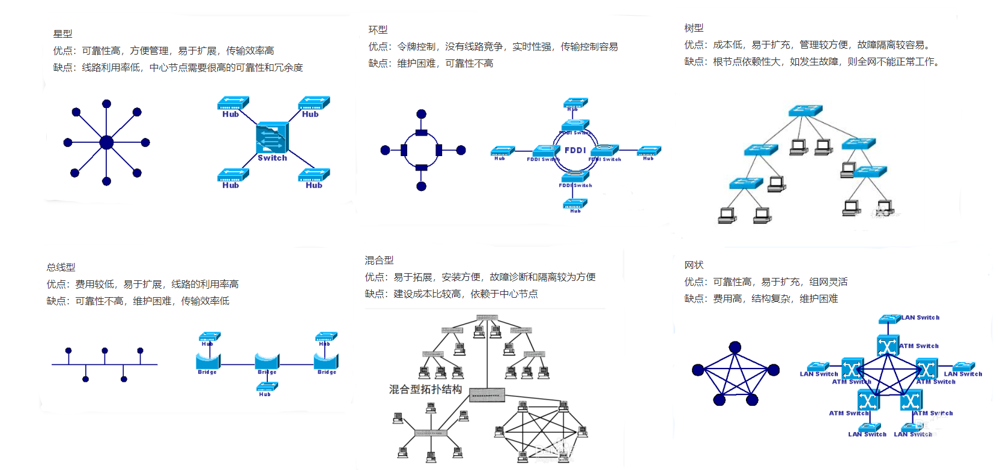

<!--
 * @Author: JohnJeep
 * @Date: 2020-07-06 22:22:11
 * @LastEditTime: 2020-08-21 09:25:44
 * @LastEditors: Please set LastEditors
 * @Description: In User Settings Edit
--> 

## http协议
- http协议下cookie是明文传递的，https协议下cookie是密文传递的。
- 总线拓扑结构采用一个信道作为传输媒体,所有站点都通过相应的硬件接口直接连到这一公共传输媒体上,该公共传输媒体即称为总线。任何一个站发送的信号都沿着传输媒体传播,而且能被所有其它站所接收。

## GET和POST的区别
- 1、概括
  > 对于GET方式的请求，浏览器会把http header和data一并发送出去，服务器响应200（返回数据）；而对于POST，浏览器先发送header，服务器响应100 continue，浏览器再发送data，服务器响应200 ok（返回数据）

- 2、区别：
  - 1、get参数通过url传递，post放在request body中。
  - 2、get请求在url中传递的参数是有长度限制的，而post没有。
  - 3、get比post更不安全，因为参数直接暴露在url中，所以不能用来传递敏感信息。
  - 4、get请求只能进行url编码，而post支持多种编码方式。
  - 5、get请求会浏览器主动***，而post支持多种编码方式。
  - 6、get请求参数会被完整保留在浏览历史记录里，而post中的参数不会被保留。
  - 7、GET和POST本质上就是TCP链接，并无差别。但是由于HTTP的规定和浏览器/服务器的限制，导致他们在应用过程中体现出一些不同。
  - 8、GET产生一个TCP数据包；POST产生两个TCP数据包。

## cookie 和session 的区别：
   - 1、cookie数据存放在客户的浏览器上，session数据放在服务器上。
   - 2、cookie不是很安全，别人可以分析存放在本地的COOKIE并进行COOKIE欺骗，考虑到安全应当使用session。
   - 3、session会在一定时间内保存在服务器上。当访问增多，会比较占用你服务器的性能，考虑到减轻服务器性能方面，应当使用COOKIE。
   - 4、单个cookie保存的数据不能超过4K，很多浏览器都限制一个站点最多保存20个cookie。
   - 5、所以个人建议：
    - 将登陆信息等重要信息存放为SESSION
      - 其他信息如果需要保留，可以放在COOKIE中
   - 6、cookie依赖于session