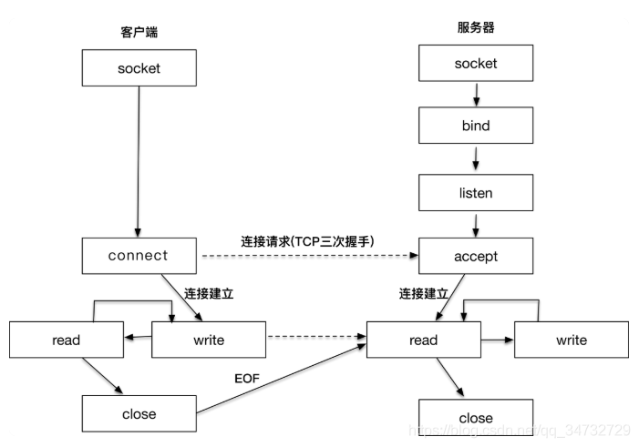

# TCP
## 服务端

客户端与服务端实现流程图

服务器端程序实现步骤

-  创建套接字（socket）
- 将套接字绑定到一个本地地址和端口上（bind）:目的是为了告诉客户端，服务器准备在哪个ip地址哪个端口接受请求。
- 将套接字设置为监听模式，准备接收客户端请求（listen）
- 等待客户端请求到来；当请求到来后，接受连接请求，返回一个新的对应于此次连接的套接字（accept）。接收客户端请求后，就保存了客户端的IP和端口号。
- 用返回的套接字 ，与客户端进行通信（send/recv）
- 当不需要的时候，关闭套接字（closesocket）

客户端程序实现步骤

- 创建套接字（socket）
- 向服务器发出连接请求（connect）
- 和服务器端进行通信（send/recv）
- 关闭套接字（closesocket）

## UDP

基于UDP（面向无连接）的socket编程
服务器端（接收端）程序：

- 创建套接字（socket）
- 将套接字绑定到一个本地地址和端口上（bind）：告诉客户端，服务器端在哪个端口哪个IP上等待数据。
- 等待接收数据（recvfrom/sendto）
- 关闭套接字（closescoket）

客户端（发送端）程序：

- 创建套接字（socket）
- 向服务器发送数据（sendto/recvfrom）
- 关闭套接字（closesocket）

# 参考
- https://blog.csdn.net/qq_44443986/article/details/115613417： 网络 UDP协议(C++|代码通过udp协议实现客户端与服务端之间的通信)
- https://blog.csdn.net/qq_44443986/article/details/115678954： 网络 TCP协议(C++代码|通过tcp协议实现客户端与服务端之间的通信)
- https://blog.csdn.net/weixin_37895339/article/details/72716774： linux下C++实现UDP通信
