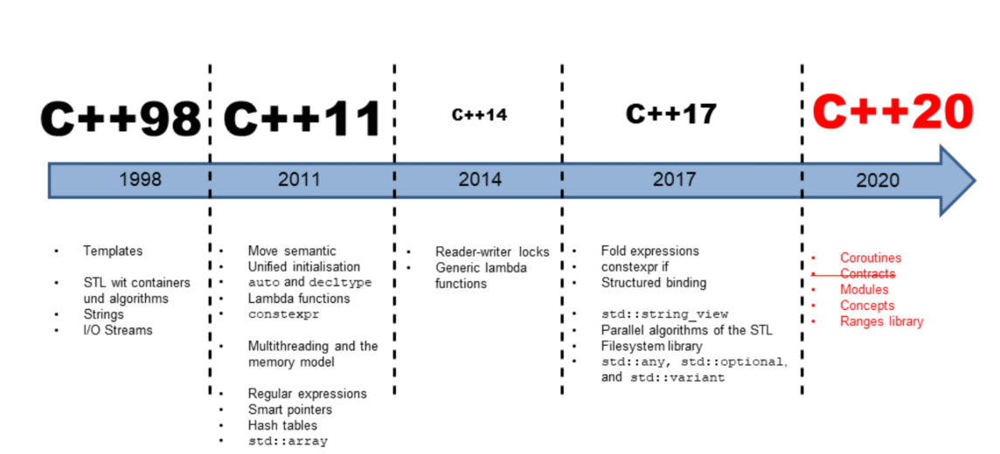
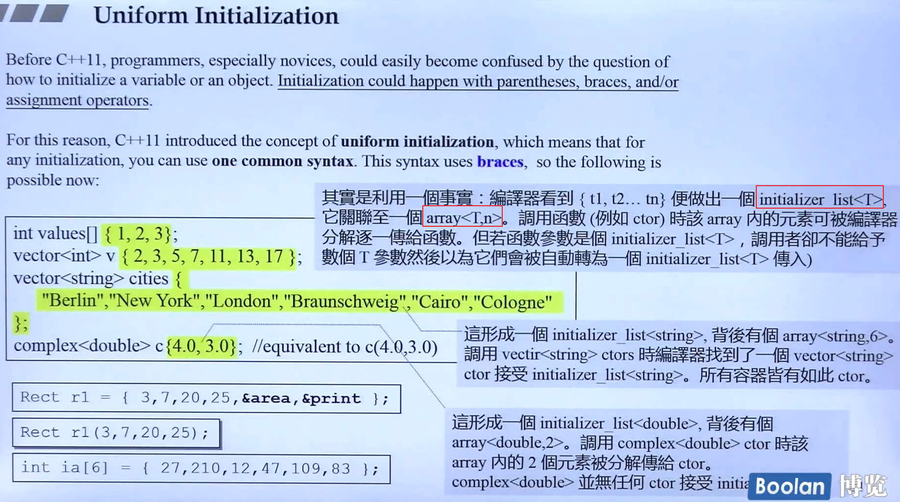
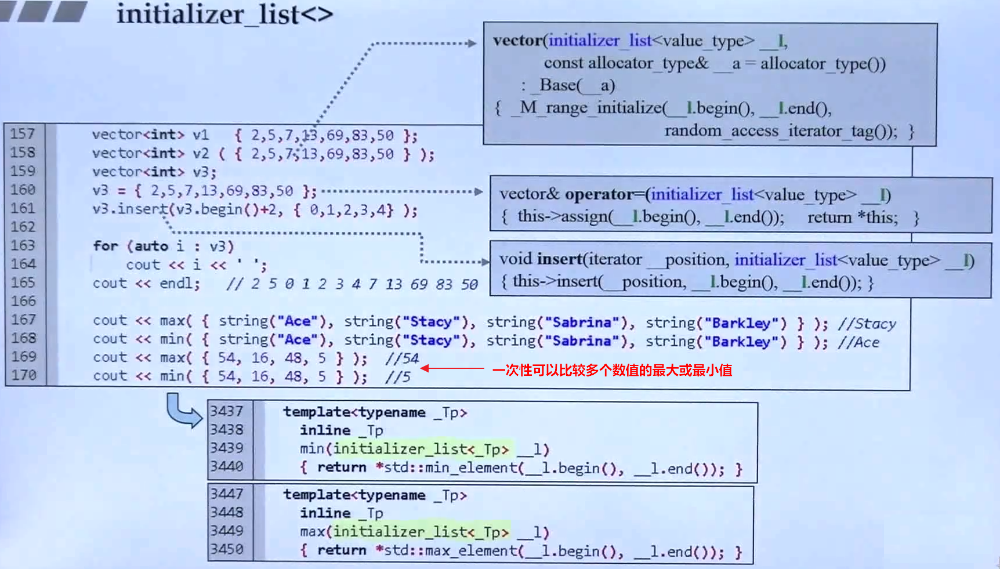
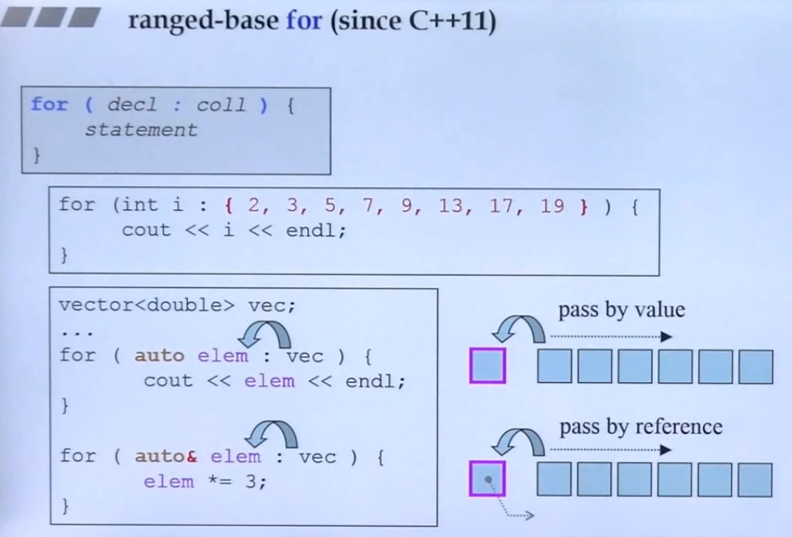
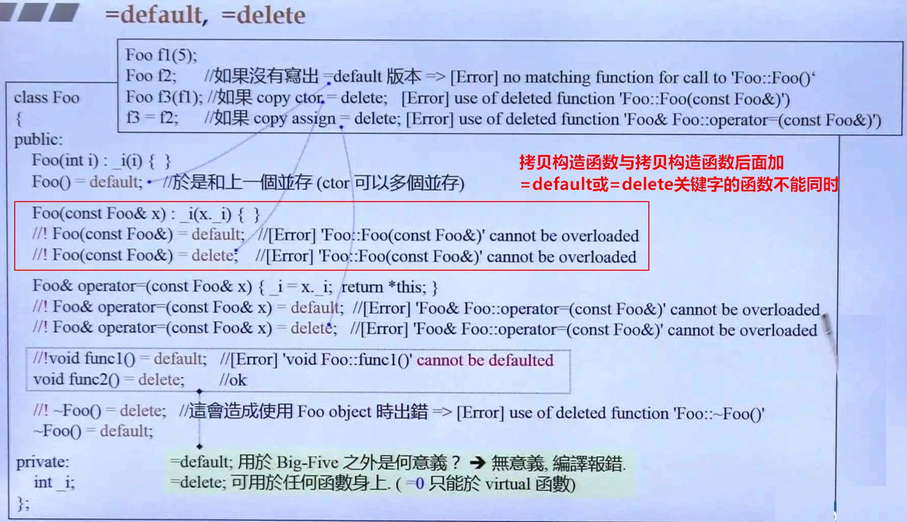
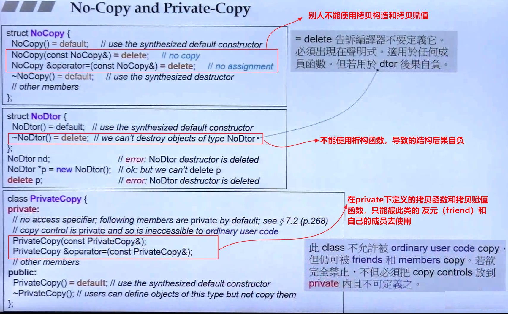

<!--
 * @Author: JohnJeep
 * @Date: 2021-01-10 18:21:43
 * @LastEditors: JohnJeep
 * @LastEditTime: 2026-04-08 00:53:05
 * @Description: C++11 新特性
 * Copyright (c) 2022 by JohnJeep, All Rights Reserved.
-->

C++ 新特性演化整体概览。



C++11 新特性
- [1. Template of  Space](#1-template-of--space)
- [2. Initializer lists](#2-initializer-lists)
- [3. 1.3 nullptr](#3-13-nullptr)
  - [3.1. 背景与问题：为什么需要 nullptr？](#31-背景与问题为什么需要-nullptr)
    - [3.1.1. C++98/03 的问题：NULL 的缺陷](#311-c9803-的问题null-的缺陷)
    - [3.1.2. 问题 1：类型不明确](#312-问题-1类型不明确)
    - [3.1.3. 问题 2：函数重载歧义](#313-问题-2函数重载歧义)
    - [3.1.4. 问题 3：模板推导问题](#314-问题-3模板推导问题)
  - [3.2. nullptr 的基本特性](#32-nullptr-的基本特性)
    - [3.2.1. 2.1 定义与类型](#321-21-定义与类型)
    - [3.2.1.1. 2.2 基本用法](#3211-22-基本用法)
  - [3.3. 解决历史问题](#33-解决历史问题)
    - [3.3.1. 3.1 解决函数重载歧义](#331-31-解决函数重载歧义)
    - [3.3.2. 3.2 解决模板推导问题](#332-32-解决模板推导问题)
  - [3.4. 高级用法与特性](#34-高级用法与特性)
    - [3.4.1. 4.1 类型安全的比较](#341-41-类型安全的比较)
    - [3.4.2. 4.2 在标准库中的应用](#342-42-在标准库中的应用)
    - [3.4.3. 4.3 用户定义类型的 nullptr 支持](#343-43-用户定义类型的-nullptr-支持)
  - [3.5. 最佳实践](#35-最佳实践)
    - [3.5.1. 5.1 始终使用 nullptr](#351-51-始终使用-nullptr)
    - [3.5.2. 5.2 在函数接口中明确使用](#352-52-在函数接口中明确使用)
    - [3.5.3. 5.3 模板编程中的使用](#353-53-模板编程中的使用)
  - [3.6. 注意事项](#36-注意事项)
    - [3.6.1. 6.1 与旧代码的兼容性](#361-61-与旧代码的兼容性)
    - [3.6.1.1. 6.2 不能用于非指针上下文](#3611-62-不能用于非指针上下文)
  - [3.7. 总结](#37-总结)
- [4. range based for statement](#4-range-based-for-statement)
- [5. lambda](#5-lambda)
  - [5.1. 基本语法](#51-基本语法)
  - [5.2. 示例](#52-示例)
  - [5.3. 返回类型推导](#53-返回类型推导)
  - [5.4. 悬空 this 指针](#54-悬空-this-指针)
  - [5.5. 注意](#55-注意)
  - [5.6. mutable](#56-mutable)
- [6. functor](#6-functor)
    - [6.0.1. 什么是仿函数](#601-什么是仿函数)
  - [6.1. 基本用法](#61-基本用法)
  - [6.2. 作为回调函数使用](#62-作为回调函数使用)
  - [6.3. 注意事项](#63-注意事项)
  - [6.4. 特点](#64-特点)
- [7. Function Adapter and Binder](#7-function-adapter-and-binder)
  - [7.1. 基本用法](#71-基本用法)
  - [7.2. 注意事项](#72-注意事项)
  - [7.3. 三者结合使用](#73-三者结合使用)
- [8. decltype](#8-decltype)
- [9. explicit](#9-explicit)
- [10. auto](#10-auto)
- [11. noexcept](#11-noexcept)
  - [11.1. 基本语法](#111-基本语法)
  - [11.2. 注意事项](#112-注意事项)
- [12. constexpr](#12-constexpr)
  - [12.1. 为什么要使用 constexpr](#121-为什么要使用-constexpr)
  - [12.2. const 与 constexpr 的区别](#122-const-与-constexpr-的区别)
  - [12.3. 基本语法](#123-基本语法)
  - [12.4. 注意事项](#124-注意事项)
- [13. override](#13-override)
  - [13.1. 基本语法](#131-基本语法)
  - [13.2. 注意事项](#132-注意事项)
- [14. final](#14-final)
  - [14.1. 基本语法](#141-基本语法)
  - [14.2. 注意事项](#142-注意事项)
- [15. New Function Declaration Syntax](#15-new-function-declaration-syntax)
  - [15.1. 基本语法](#151-基本语法)
  - [15.2. 使用示例](#152-使用示例)
  - [15.3. 注意事项](#153-注意事项)
- [16. Scoped Enumerations](#16-scoped-enumerations)
  - [16.1. 基本语法](#161-基本语法)
  - [16.2. 使用示例](#162-使用示例)
  - [16.3. 注意事项](#163-注意事项)
- [17. New Template Features](#17-new-template-features)
  - [17.1. variadic templates](#171-variadic-templates)
    - [17.1.1. 基本语法](#1711-基本语法)
    - [17.1.2. 使用 variadic templates 的好处](#1712-使用-variadic-templates-的好处)
    - [17.1.3. 注意事项](#1713-注意事项)
  - [17.2. Alias Templates (Template Typedef)](#172-alias-templates-template-typedef)
    - [17.2.1. 基本用法](#1721-基本用法)
    - [17.2.2. 使用 alias templates 的好处](#1722-使用-alias-templates-的好处)
    - [17.2.3. 注意事项](#1723-注意事项)
  - [17.3. template template parameter](#173-template-template-parameter)
    - [17.3.1. 基本用法](#1731-基本用法)
    - [17.3.2. 为什么要使用 template template  parameter](#1732-为什么要使用-template-template--parameter)
    - [17.3.3. 注意事项](#1733-注意事项)
  - [17.4. Type Alias](#174-type-alias)
    - [17.4.1. 基本用法](#1741-基本用法)
    - [17.4.2. 注意事项](#1742-注意事项)
- [18. using](#18-using)
  - [18.1. 基本用法](#181-基本用法)
  - [18.2. 注意事项](#182-注意事项)
- [19. Move Semantics and Rvalue References](#19-move-semantics-and-rvalue-references)
- [20. =delete \&\& =default](#20-delete--default)
  - [20.1. 基本用法](#201-基本用法)
  - [20.2. 注意事项](#202-注意事项)
- [21. Chrono](#21-chrono)
  - [21.1. duration](#211-duration)
  - [21.2. timepoint](#212-timepoint)
  - [21.3. clock](#213-clock)
- [22. future](#22-future)
  - [22.1. 基本用法](#221-基本用法)
  - [22.2. 注意事项](#222-注意事项)
- [23. references](#23-references)


# 1. Template of  Space

在 C++11 之后，对一些语法做了一些优化（Important Minor Syntax Cleanups）。比如，优化了 template（模板）中的尖括号的问题，中间是否需要加空格。

```cpp
vector<list<int> > ;  // C+11 之前版本，必须要加一个空格，否则编译器会报错
vector<list<int>> ;   // C++11 之后，不用加空格，语法得到了优化
```


# 2. Initializer lists

C++11 引入了初值列 (initializer list) 和一致性初始化 (Uniform Initialization)。即采用 `{}` 去初始化需要初始化的参数，引入新特的同时也兼容原版本的 `()` 初始化操作。




`initializer list` 的底层是采用 `initializer_list<T>` 这个类模板实现的，其中这个类模板下层采用 `array<T, n>` 的方式去实现的。


` 初值列 ` 赋值是在对象创建成功之前完成的，而 ` 函数体内赋值 ` 是你的对象成员都已经创建好后再对成员进行赋值。` 初值列 ` 是在带参构造函数的函数体外面，第一行进行初始化。

- 初值列初始化语法
  ```cpp
  //  将成员变量设置为 m_re=re, m_im=im
  class Stu(int re, int im)
    : m_re(re), m_im(im)
  {
  public:
        ...
  private:
    int m_re;
    int m_im;
  };
  ```
- 这种初始化并不是必须的，但是在以下几种情况时是必须进行初始化的
  - 成员是 `const` 类型。
  - 成员是 ` 引用类型 `。
  - 有一个成员是类型的对象（不是默认的构造函数）。
> 初始化列表的顺序并不限定初始化的执行顺序，成员的初始化顺序是与类中定义的顺序保持一致。最好让构造函数初始值的顺序与成员声明的顺序保持一致。


# 3. 1.3 nullptr

好的，作为专业的 C++ 工程师，我将系统地为您讲解 C++11 中 `nullptr` 的使用。这是一个看似简单但极其重要的特性，彻底改善了 C++ 中空指针的表达方式。

## 3.1. 背景与问题：为什么需要 nullptr？

### 3.1.1. C++98/03 的问题：NULL 的缺陷

在 C++11 之前，我们主要使用 `NULL` 或字面量 `0` 来表示空指针：

```cpp
// C++98/03 方式
int* ptr1 = NULL;     // 通常定义为 #define NULL 0
int* ptr2 = 0;        // 直接使用 0
```

**这带来了几个严重问题：**

### 3.1.2. 问题 1：类型不明确

`NULL` 通常是一个宏定义，本质上是整数 0：

```cpp
#define NULL 0
// 或者
#define NULL ((void*)0)  // 在某些编译器中
```

### 3.1.3. 问题 2：函数重载歧义

```cpp
#include <iostream>

void func(int x) {
    std::cout << "func(int) called" << std::endl;
}

void func(char* ptr) {
    std::cout << "func(char*) called" << std::endl;
}

int main() {
    func(NULL);    // 歧义！可能调用 func(int) 而不是 func(char*)
    func(0);       // 明确调用 func(int)
    // func(nullptr); // C++11 解决方案
    return 0;
}
```

### 3.1.4. 问题 3：模板推导问题

```cpp
template<typename T>
void process(T* ptr) {
    if (ptr) {
        // 处理指针
    }
}

template<typename T>
void process(T value) {
    // 处理值
}

int main() {
    process(0);     // 调用 process(T value)，T 被推导为 int
    process(NULL);  // 同样的问题！
    // 我们原本想调用指针版本，但编译器选择了值版本
}
```

## 3.2. nullptr 的基本特性

### 3.2.1. 2.1 定义与类型

`nullptr` 是 C++11 引入的关键字，具有以下特性：

```cpp
// nullptr 的类型是 std::nullptr_t
decltype(nullptr) nptr;  // nptr 的类型是 std::nullptr_t

// std::nullptr_t 定义在 <cstddef> 中
#include <cstddef>
std::nullptr_t null_value;
```

### 3.2.1.1. 2.2 基本用法

```cpp
int main() {
    // 初始化各种指针类型
    int* int_ptr = nullptr;
    double* double_ptr = nullptr;
    char* char_ptr = nullptr;
    
    // 类对象指针
    class MyClass {};
    MyClass* obj_ptr = nullptr;
    
    // 函数指针
    void (*func_ptr)() = nullptr;
    
    return 0;
}
```

## 3.3. 解决历史问题

### 3.3.1. 3.1 解决函数重载歧义

```cpp
#include <iostream>

void func(int x) {
    std::cout << "func(int) called with: " << x << std::endl;
}

void func(char* ptr) {
    std::cout << "func(char*) called" << std::endl;
}

void func(std::nullptr_t) {
    std::cout << "func(nullptr_t) called" << std::endl;
}

int main() {
    func(0);        // 调用 func(int)
    func(nullptr);  // 明确调用 func(char*) 或 func(nullptr_t)
    
    // 如果有多个指针版本的重载，nullptr 会优先匹配最合适的指针类型
    return 0;
}
```

### 3.3.2. 3.2 解决模板推导问题

```cpp
#include <iostream>
#include <type_traits>

template<typename T>
void process(T* ptr) {
    std::cout << "Pointer version called" << std::endl;
}

template<typename T>
void process(T value) {
    std::cout << "Value version called" << std::endl;
}

// 专门处理 nullptr 的版本
template<>
void process<std::nullptr_t>(std::nullptr_t) {
    std::cout << "nullptr specialized version called" << std::endl;
}

int main() {
    process(0);         // 调用值版本，T = int
    process(nullptr);   // 调用指针版本或特化版本
    
    int x = 10;
    process(&x);        // 调用指针版本
    return 0;
}
```

## 3.4. 高级用法与特性

### 3.4.1. 4.1 类型安全的比较

```cpp
#include <iostream>
#include <type_traits>

int main() {
    int* ptr = nullptr;
    int x = 0;
    
    // 类型安全的比较
    if (ptr == nullptr) {  // 正确：指针与 nullptr 比较
        std::cout << "Pointer is null" << std::endl;
    }
    
    // if (x == nullptr) {  // 错误！不能比较 int 与 nullptr
    //     // 编译错误
    // }
    
    // 但可以与 bool 上下文一起使用
    if (!ptr) {  // 正确：nullptr 在布尔上下文中为 false
        std::cout << "Pointer is null" << std::endl;
    }
    
    return 0;
}
```

### 3.4.2. 4.2 在标准库中的应用

```cpp
#include <memory>
#include <functional>
#include <iostream>

int main() {
    // 智能指针
    std::unique_ptr<int> uptr = nullptr;
    std::shared_ptr<int> sptr = nullptr;
    
    // 函数对象
    std::function<void()> func = nullptr;
    
    // 检查智能指针是否为空
    if (uptr == nullptr) {
        std::cout << "unique_ptr is null" << std::endl;
    }
    
    // 重置为 nullptr
    uptr.reset();
    if (!uptr) {  // 等同于 uptr == nullptr
        std::cout << "unique_ptr is null after reset" << std::endl;
    }
    
    return 0;
}
```

### 3.4.3. 4.3 用户定义类型的 nullptr 支持

```cpp
#include <iostream>

class SmartPointer {
private:
    int* data;
public:
    // 构造函数
    SmartPointer(int* ptr = nullptr) : data(ptr) {}
    
    // 支持与 nullptr 比较
    bool operator==(std::nullptr_t) const {
        return data == nullptr;
    }
    
    bool operator!=(std::nullptr_t) const {
        return data != nullptr;
    }
    
    // 支持从 nullptr 赋值
    SmartPointer& operator=(std::nullptr_t) {
        delete data;
        data = nullptr;
        return *this;
    }
    
    // 布尔转换（用于 if 语句）
    explicit operator bool() const {
        return data != nullptr;
    }
    
    ~SmartPointer() {
        delete data;
    }
};

int main() {
    SmartPointer sp1(new int(42));
    SmartPointer sp2(nullptr);
    
    if (sp1 != nullptr) {
        std::cout << "sp1 is not null" << std::endl;
    }
    
    if (sp2 == nullptr) {
        std::cout << "sp2 is null" << std::endl;
    }
    
    sp1 = nullptr;  // 调用 operator=(nullptr_t)
    
    if (!sp1) {     // 使用 operator bool()
        std::cout << "sp1 is now null" << std::endl;
    }
    
    return 0;
}
```

## 3.5. 最佳实践

### 3.5.1. 5.1 始终使用 nullptr

```cpp
// 好的实践
int* ptr = nullptr;
if (ptr == nullptr) { /* ... */ }

// 避免使用
int* bad_ptr = NULL;  // 不要使用
int* worse_ptr = 0;   // 更不要使用
```

### 3.5.2. 5.2 在函数接口中明确使用

```cpp
class Database {
public:
    // 使用 nullptr 作为默认参数
    Connection* connect(const char* host = nullptr, 
                       const char* user = nullptr) {
        if (host == nullptr) {
            host = "localhost";
        }
        // ... 连接逻辑
        return nullptr;  // 返回 nullptr 表示失败
    }
};
```

### 3.5.3. 5.3 模板编程中的使用

```cpp
template<typename T>
class Container {
private:
    T* data = nullptr;  // 使用 nullptr 初始化成员指针
    
public:
    Container() = default;
    
    explicit Container(T* ptr) : data(ptr) {}
    
    // 移动构造函数
    Container(Container&& other) noexcept 
        : data(other.data) {
        other.data = nullptr;  // 使用 nullptr 重置
    }
    
    // 移动赋值运算符
    Container& operator=(Container&& other) noexcept {
        if (this != &other) {
            delete data;
            data = other.data;
            other.data = nullptr;  // 使用 nullptr 重置
        }
        return *this;
    }
    
    ~Container() {
        delete data;
    }
};
```

## 3.6. 注意事项

### 3.6.1. 6.1 与旧代码的兼容性

```cpp
// 在混合新旧代码时要注意
void legacy_function(char* ptr);

// 这样调用是安全的
legacy_function(nullptr);

// 但要注意某些旧的 API 可能不期望接收 nullptr
```

### 3.6.1.1. 6.2 不能用于非指针上下文

```cpp
int main() {
    int x = 10;
    
    // 以下都是错误的
    // int y = nullptr;      // 错误
    // x + nullptr;          // 错误  
    // bool b = nullptr;     // 错误（需要显式转换）
    bool b = static_cast<bool>(nullptr);  // 正确，但总是 false
    
    return 0;
}
```

## 3.7. 总结

`nullptr` 是 C++11 中一个看似简单但极其重要的改进：

1. **类型安全**：具有明确的 `std::nullptr_t` 类型
2. **解决歧义**：彻底解决了函数重载和模板推导中的歧义问题
3. **代码清晰**：明确表达"空指针"的意图
4. **现代 C++ 的基础**：为智能指针、移动语义等现代特性提供支持

作为专业的 C++ 工程师，应该在所有新代码中完全使用 `nullptr` 替代 `NULL` 和 `0`，这会让代码更安全、更清晰、更现代化。


# 4. range based for statement

C++11 引入了一种崭新的 `for` 循环：逐一迭代给定的某个区间、数组、集合、表达式、初始值列表内的每一个元素。

```cpp
for (auto& i : {1, 3, 5, 7})   // 注意: {} 表示是一个容器，初始值列表
{
    cout << i << endl;
}
```




# 5. lambda

Lambda表达式是C++11引入的一种匿名函数对象的方式，它可以在需要函数对象的地方快速定义一个函数对象。**同时 lambda 也是一中隐式的(implicitly)预定义函数对象(function object)。**

lambda 是一份功能性的定义，定义在语句（statement）和表达式（expression）中，可以使用 lambda 作为内联函数。

## 5.1. 基本语法

```cpp
[capture] (parameters) opt -> return_type { function_body }
```

- **capture**：捕获列表，用于捕获外部变量，可以是值捕获、引用捕获或隐式捕获。
- **parameters**：参数列表，和普通函数的参数列表类似。如果没有参数，参数列表可以省略不写。
- **opt**： 是函数选项。**不需要可以省略**，可选项可以是下面的值：
  1. mutable: 可以修改按值传递进来的拷贝（注意是能修改拷贝，而不是值本身）
  2. exception: 指定函数抛出的异常，如抛出整数类型的异常，可以使用 `throw()`
- **return_type**：返回类型，可以省略，编译器会根据函数体中的返回语句自动推导。
  ```cpp
  // 完整的lambda表达式定义
  auto f = [](int a) -> int {
      return a+10;  
  };
  
  // 忽略返回值的lambda表达式定义
  auto f = [](int a) {
      return a+10;  
  };
  ```
- **function_body**：函数体，和普通函数一样。这部分不能省略，但函数体可以为空。

## 5.2. 示例

```cpp
#include <iostream>
#include <vector>
#include <algorithm>

int main() {
    std::vector<int> v = {1, 2, 3, 4, 5};
    // 使用lambda表达式，按值捕获外部变量，这里没有捕获任何变量
    std::for_each(v.begin(), v.end(), [](int x) {
        std::cout << x << " ";
    });
    // 输出：1 2 3 4 5
    std::cout << std::endl;

    // 使用lambda表达式，捕获外部变量
    int a = 10;
    std::for_each(v.begin(), v.end(), [a](int x) {
        std::cout << x + a << " ";
    });
    // 输出：11 12 13 14 15
    std::cout << std::endl;

    // 使用引用捕获，修改外部变量
    int sum = 0;
    std::for_each(v.begin(), v.end(), [&sum](int x) {
        sum += x;
    });
    std::cout << "sum = " << sum << std::endl; // 输出：15

    // 隐式捕获：使用[=]按值捕获所有外部变量，使用[&]按引用捕获所有外部变量
    int b = 20;
    std::for_each(v.begin(), v.end(), [=](int x) {
        std::cout << x + a + b << " "; // a和b都是按值捕获
    });
    // 输出：31 32 33 34 35
    std::cout << std::endl;

    // 混合捕获：按值捕获a，按引用捕获b
    std::for_each(v.begin(), v.end(), [a, &b](int x) {
        b = 100; // 修改b，因为b是按引用捕获
        std::cout << x + a + b << " ";
    });
    // 输出：101 102 103 104 105
    std::cout << "b = " << b << std::endl; // b被修改为100

    return 0;
}
```

根据传递的行为，捕获列表（capture list）也分为以下几种：

1. []：不捕获任何外部变量。
2. `[=]`: 以传值的方式，隐式捕获外部作用域之外的所有变量。若 lambda 中有被定义的内容时，不能修改外部作用域中的数据，只有 read 的权限。
3. `[&]`: 以传引用的方式，隐式捕获外部作用域之外的所有变量。若 lambda 中有被定义的内容时，可以修改外部作用域中的数据，具有 write 的权限。
4. [this]：捕获当前类的 this 指针。**通常用于访问当前对象的成员变量和成员函数。**
   1. 让lambda表达式拥有和当前类成员函数同样的访问权限。
   2. 如果已经使用了 & 或者 =，默认就有 this。

```cpp
class MyClass {
private:
    int x = 10;
    int y = 20;
public:
    void testCaptures() {
        // 方式1：显式捕获 this
        auto lambda1 = [this]() {
            return x + y;  // 访问成员
        };
        
        // 方式2：隐式捕获（捕获所有）
        auto lambda2 = [=]() {
            return x + y;  // this 被隐式捕获
        };
        
        // 方式3：隐式捕获所有（引用方式）
        auto lambda3 = [&]() {
            x = 30;  // 可以修改成员
            return y;
        };
    }
};
```

## 5.3. 返回类型推导

```cpp
// 自动推导返回类型
auto lambda8 = [](int a, int b) { return a + b; };

// 显式指定返回类型
auto lambda9 = [](int a, int b) -> double {
    return static_cast<double>(a) / b;
};
```

泛型 lambda(C++14)

```cpp
// 使用auto参数（模板参数推导）
auto generic_lambda = [](auto x, auto y) {
    return x + y;
};

// 相当于
struct {
    template<typename T, typename U>
    auto operator()(T x, U y) const {
        return x + y;
    }
} generic_lambda;
```


## 5.4. 悬空 this 指针

```cpp
class MyClass {
public:
    std::function<void()> getLambda() {
        // 返回捕获了 this 的 lambda
        return [this]() {
            // 如果 MyClass 对象已被销毁，这里会发生未定义行为！
            std::cout << "Lambda called" << std::endl;
        };
    }
};

int main() {
    std::function<void()> func;
    {
        MyClass obj;
        func = obj.getLambda();  // lambda 捕获了 obj 的 this
    }  // obj 被销毁
    
    func();  // 危险！悬空 this 指针！
    return 0;
}
```

**为了避免悬空指针问题，建议使用智能指针：**

```cpp
#include <memory>

class MyClass : public std::enable_shared_from_this<MyClass> {
public:
    std::function<void()> getSafeLambda() {
        // 捕获 shared_ptr
        auto self = shared_from_this();
        return [self]() {
            // 安全：self 保持对象存活
            self->doSomething();
        };
    }
    
    void doSomething() {
        std::cout << "Safe!" << std::endl;
    }
};

int main() {
    std::function<void()> func;
    {
        auto obj = std::make_shared<MyClass>();
        func = obj->getSafeLambda();
    }  // obj 引用计数为 1（lambda 持有），不会被销毁
    
    func();  // 安全！
    return 0;
}
```

## 5.5. 注意

1. **谨慎捕获 this**：确保 lambda 的生命周期不会超过对象
2. **异步操作时要特别小心**：异步回调中很容易出现悬空指针，用同步执行。
3. **优先使用值捕获**：如果能复制数据，优先捕获值而非 this
4. **使用智能指针**：对于需要延长生命周期的场景
5. **明确捕获列表**：避免使用 `[=]` 或 `[&]`，而是明确写出 `[this]`
6. 需要访问或修改多个成员变量
7. 需要调用成员函数
8. 确保对象在 lambda 执行期间一直存在。当 lambda 可能比对象生命周期更长时（如存储到容器、异步执行），应该避免直接捕获 `this`，而是使用智能指针或其他生命周期管理机制。
9. C++ 编译器对 lambda 的优化效果高于普通的函数。
10. 根据 C++ 语言规定，lambda 没有默认的构造和赋值操作函数(`default constructor` 和 `assignment operator`)。
11. 捕获变量中没有加 `=` 或 `&` 时，编译器默认按照是值传递 `=`；在捕获变量时，一般建议使用 **传引用，而非传值**。


## 5.6. mutable

当 lambda 中有 `mutable` 关键字修饰时，表明在 lambda 中可以改变捕获的值。

使用lambda表达式捕获列表捕获外部变量，如果希望去修改按值捕获的外部变量，那么应该如何处理呢？

>  使用 mutable 关键修饰的匿名类，编译器底层是去掉了函数或变量的 `const` 权限。

```cpp
int count = 0;
auto lambda7 = [count]() mutable {
    count++;  // 可以修改按值捕获的变量
    return count;
};

cout << lambda7();  // 输出：1
cout << lambda7();  // 输出：2
cout << count;      // 输出：0（原始变量未改变）
```
上面的代码中，`count` 是按值捕获的，因此在 lambda 内部修改 `count` 不会影响外部的 `count` 变量。通过 `mutable` 关键字，我们允许在 lambda 内部修改捕获的变量，但这只是修改了 lambda 内部的副本，而不是外部的原始变量。


# 6. functor

functor 是 function object 的简称，**它是一个重载了 `operator()` 的类**，因此它的对象可以像函数一样被调用。

### 6.0.1. 什么是仿函数

行为像 pointer 的对象，我们称之为 smart pointer；同理可知，行为像 function 的对象，我们称之为 smart function，因为它们的能力超过了 `operator()`。

仿函数也叫函数对象(function object)，一个 class 类中重载了 `operator()`，任何一个东西能接受 `()` 操作运算符，这个东西就叫 `像函数` 或者叫 `仿函数`。

`std::function `是一个通用的函数封装器，它可以存储、复制和调用任何可调用对象（如函数、lambda 表达式、函数对象、以及 bind 表达式等）。

它封装了不同类型的可调用对象，使得它们可以通过统一的接口进行调用，极大地提高了代码的灵活性和可维护性。有了 `std::function`，我们可以轻松地将函数作为参数传递、存储在容器中，或者动态地选择要调用的函数。

分为以下几种类型：
1. 普通函数（Function Pointer），一般占 用 4 或 8 个字节。
2. 函数对象（Function Object）
3. 非静态成员函数（Non-static Member Function）：一般占用 16 bytes，有 this 指针和虚函数表指针。
4. Lambda 表达式（Lambda Expression）
5. 绑定表达式（Bind Expression）
6. 成员函数指针（Member Function Pointer）
7. 成员变量指针（Member Variable Pointer）
8. 智能指针（Smart Pointer）
9. 函数适配器（Function Adapter）
10. 函数绑定器（Function Binder）
11. 回调函数（Callback Function）
12. 事件处理器（Event Handler）

`std::function` 占用 32 bytes， 若存储的可调用对象较大，可能会进行动态内存分配。若存储的可调用对象 小于 16 bytes，则不会进行动态内存分配，直接在栈上分配。


**注意点：**
> std::function 有类型擦除开销（通常比虚函数还慢），因此在性能敏感的代码中，建议使用模板或直接使用函数指针。


## 6.1. 基本用法

```cpp
#include <iostream>
#include <functional>

// 普通函数
int add(int a, int b) {
    return a + b;
}

// 函数对象
struct Multiply {
    int operator()(int a, int b) {
        return a * b;
    }
};

int main() {
    // 封装普通函数
    std::function<int(int, int)> func1 = add;
    std::cout << func1(2, 3) << std::endl; // 输出：5

    // 封装lambda表达式
    std::function<int(int, int)> func2 = [](int a, int b) {
        return a - b;
    };
    std::cout << func2(5, 3) << std::endl; // 输出：2

    // 封装函数对象
    Multiply mul;
    std::function<int(int, int)> func3 = mul;
    std::cout << func3(4, 5) << std::endl; // 输出：20

    // 也可以存储成员函数和成员变量，但需要注意调用方式
    return 0;
}
```

## 6.2. 作为回调函数使用

```cpp
class Button {
public:
    using Callback = std::function<void()>;
    
    void setOnClick(Callback callback) {
        onClick_ = std::move(callback);
    }
    
    void click() {
        if (onClick_) {
            onClick_();
        }
    }
    
private:
    Callback onClick_;
};

// 使用示例
Button button;
button.setOnClick([]() {
    std::cout << "Button clicked!" << std::endl;
});
button.click();
```


## 6.3. 注意事项

- `std::function`可以为空，调用空的`std::function`会抛出`std::bad_function_call`异常。
- `std::function`的模板参数是函数类型，例如`std::function<int(int, int)>`表示接受两个int参数，返回int的函数。


## 6.4. 特点

1. function object 通常比 function pointer 、普通函数执行速度更快。
2. function object 是一种带状态的函数。可以拥有成员变量和成员函数。
3. 可在运行期间初始化。
4. function object 定义的每一个函数行为都有自己的类型。

<font color=red>思考：</font>

- 为什么 C++ 中要把 class 设计成 smart pointer(智能指针)和 function(仿函数)？
  > - 因为 class 是 C++ 中的核心概念，设计成 smart pointer 和 function 可以让 class 更加灵活和强大。智能指针提供了自动内存管理功能，避免了内存泄漏和悬空指针的问题；而函数对象则允许我们将函数作为对象来使用，可以存储状态、传递参数等，使得代码更加简洁和易于维护。


# 7. Function Adapter and Binder

function adapter 是指能够将不同的 function object 结合起来的东西，它自身也是个 function object。

`std::bind`用于将参数绑定到可调用对象(callable object)，生成一个新的可调用对象。它可以绑定普通函数、函数对象、成员函数等，并且可以重新排列参数顺序，以及设置部分参数。


## 7.1. 基本用法

```cpp
#include <iostream>
#include <functional>

int add(int a, int b) {
    return a + b;
}

struct Multiply {
    int operator()(int a, int b) {
        return a * b;
    }
};

class MyClass {
public:
    int add(int a, int b) {
        return a + b;
    }
    static int static_add(int a, int b) {
        return a + b;
    }
};

int main() {
    // 绑定普通函数，并固定第一个参数为10
    auto bound_add = std::bind(add, 10, std::placeholders::_1);
    std::cout << bound_add(5) << std::endl; // 输出：15，相当于add(10,5)

    // 绑定lambda表达式
    auto lambda = [](int a, int b) { return a - b; };
    auto bound_lambda = std::bind(lambda, std::placeholders::_1, 5);
    std::cout << bound_lambda(10) << std::endl; // 输出：5，相当于lambda(10,5)

    // 绑定函数对象
    Multiply mul;
    auto bound_mul = std::bind(mul, std::placeholders::_1, 10);
    std::cout << bound_mul(5) << std::endl; // 输出：50，相当于mul(5,10)

    // 绑定成员函数
    MyClass obj;
    // 注意：成员函数需要传入对象指针或引用，以及参数
    auto bound_member = std::bind(&MyClass::add, &obj, 
                                  std::placeholders::_1, 
                                  std::placeholders::_2);
    std::cout << bound_member(10, 20) << std::endl; // 输出：30

    // 绑定静态成员函数和普通函数类似
    auto bound_static = std::bind(&MyClass::static_add, 
                                  std::placeholders::_1, 
                                  std::placeholders::_2);
    std::cout << bound_static(10, 20) << std::endl; // 输出：30

    // 重新排列参数顺序
    auto rearrange = std::bind(add, 
                               std::placeholders::_2, 
                               std::placeholders::_1);
    std::cout << rearrange(5, 10) << std::endl; // 输出：15，相当于add(10,5)

    return 0;
}
```

## 7.2. 注意事项

- `std::placeholders::_1`、`std::placeholders::_2`等**占位符**表示新生成的可调用对象的参数位置。
- 绑定成员函数时，第一个参数必须是该成员函数**所属类的对象指针或引用（可以是智能指针）**。
- 绑定静态成员函数和绑定普通函数一样。
- `std::bind`可以绑定多个参数，并且可以混合占位符和固定值。

## 7.3. 三者结合使用

在实际编程中，这三者常常结合使用，以实现更灵活的函数封装和调用。

```cpp
#include <iostream>
#include <functional>
#include <vector>
#include <algorithm>

// 假设我们有一个函数，它接受一个std::function作为参数
void process(const std::vector<int>& vec, std::function<void(int)> func) {
    for (int x : vec) {
        func(x);
    }
}

int main() {
    std::vector<int> v = {1, 2, 3, 4, 5};

    // 使用lambda表达式
    process(v, [](int x) {
        std::cout << x << " ";
    });
    std::cout << std::endl;

    // 使用std::bind绑定一个函数，并固定部分参数
    void print_add(int a, int b) {
        std::cout << a + b << " ";
    }

    // 绑定第一个参数为10，第二个参数由process中的func调用时传入
    auto bound_print_add = std::bind(print_add, 10, std::placeholders::_1);
    process(v, bound_print_add); // 输出：11 12 13 14 15
    std::cout << std::endl;

    // 使用std::function存储lambda表达式
    std::function<void(int)> func = [](int x) {
        std::cout << x * 2 << " ";
    };
    process(v, func); // 输出：2 4 6 8 10
    std::cout << std::endl;

    return 0;
}
```

- **lambda表达式**：用于快速定义匿名函数对象，可以捕获外部变量，语法灵活。
- **std::function**：通用的函数封装器，可以存储任意可调用对象，提供统一的调用接口。
- **std::bind**：用于绑定可调用对象的参数，生成新的可调用对象，可以重新排列参数顺序和固定部分参数。

这三者都是现代C++中函数式编程的重要工具，它们使得函数可以作为参数传递、作为返回值返回，并且可以方便地组合和复用。掌握它们对于编写高效、现代的C++代码非常重要。


# 8. decltype

decltype 是 C++11 增加的一个关键字，作为类型推导，操作过程是在编译时进行的。

decltype 通常有以下几种用法：
- 常常与 `typdef/using` 关键字结合起来使用。
- 可以处理匿名的类型。比如：`union`, `struct ` 结构中出现的匿名数据，可以使用这个来解决。
- **最重要的一个作用：推导函数的返回类型 (used to declare return types)。**
  ```cpp
  template<typename T1, typename T2>
  auto add(T1 + T2)->decltype(x + y);   // 自动推导 x + y 结果的返回类型
  ```
- 元编程中使用 (use it in metaprogramming)
  ```cpp
  template<typename T1, typename T2>
  struct common_type<T1, T2> {
  typedef decltype(true ? declval<T1>() : declval<T2>()) type;
  };
  ```
- lambda 表达式作为类型参数传入 (use to pass the type of the a lambda)
  ```cpp
  class Person {
  ...
  };
  
  auto cmp = [](const Person1&, const Person2) {
      ...
  };
  std::set<Person, decltype(cmp)> p(cmp);
  ```


# 9. explicit

explicit 是 C++ 中的一个关键字，主要用于修饰构造函数和模板，以防止隐式类型转换。

大部分情况下 `explicit` 关键字用在构造函数中，只有少部分用在模板中。注意：被 `explicit` 关键字修饰的构造函数，不能进行自动地进行隐式 (implicit) 类型转换，只能显式 (explicit) 地进行类型转换。

- 当类的声明和定义分别在两个文件中时，`explicit` 只能写在在声明 (`declaration`) 中，不能写在定义 (`definition`) 中。
- 被声明为 `explicit` 的构造函数通常比它的兄弟 `non-explicit` 更受欢迎，因为它们禁止编译器执行非预期（往往也不被期望）的类型转换。除非我有一个好的理由允许构造函数被用于隐式类型转换，否则我会把它声明为 `explicit` 。我鼓励你遵循相同的政策。


# 10. auto

C++11 中新增的一个关键字，让编译器通过初始值去分析所属类的类型。`auto` 关键字会完成类型自动推导 (Automatic Type Deduction with auto)：
根据初始值自动推导变量的类型，因此，在使用这个关键字之前，必须需要将变量初始化。

- `auto` 一般会忽略掉顶层的 const，但底层的 const 会保留下来。从变量声明的初始化表达式处获得变量的类型。
  ```cpp
  const int ci = i;
  const auto f = ci;  // ci 的推演类型是 int，f 是 const int
  ```


# 11. noexcept

C++11 引入了该关键字 `noexcept`。该关键字告诉编译器，指定的某个函数不会抛出异常。通常有两种不同的方式来使用这个关键字。


## 11.1. 基本语法

- 第一种方式，简单地将 `noexcept` 关键字放在函数声明的后面，这样该函数便会被标记为不会抛出异常。
  ```cpp
  void add(int) noexcept;   // 表明 add() 函数不会抛出异常
  ```
- 第二种方式：为 `noexcept` 关键字额外提供一个常量表达式作为其参数，若这个常量表达式的值为 “true”，那么函数就会被标记为不会抛出异常，反之亦然。
  ```cpp
  constexpr bool suppressExcept = true;
  void excpt_func() noexcept (suppressExcept);
  ```

## 11.2. 注意事项

1. 若当前函数抛出来的异常没有被立即处理，则一直通过 throw 关键往上抛，直到被标准库中的 `std::terminal()` 捕获，再去处理，其中 `std::terminal()` 内部默认调用的是 `std::abort()`。
2. C++ 中的异常处理是在程序运行时检测，而不是编译时检测的。为了实现运行时检测，编译器会创建额外的代码，然而这会妨碍程序优化。
3. 函数指针的声明和定义中可以指定 `noexcept`
4. `typedef 或类型的别名 ` 中不能使用 `noexcept`
5. 成员函数中，`noexcept` 需要跟在 `const 或引用 ` 限定符之后，但是跟在 `final、override 或虚函数 = 0` 这些限定符之前。
6. 移动构造函数 (move constructor)：在对象进行 `copy` 时，直接拷贝对象所保有的一些资源。比如，已经在原对象中分配的堆内存、文件描述符，以及 IO 流等。
7. 移动分配函数 (move assignment)
8. 析构函数 (destructor)。在新版本的编译器中，析构函数是默认加上关键字 `noexcept` 的。


# 12. constexpr

常量表达式 (const expression)：表示值不会改变，并且在编译过程中就能得到计算的结果的表达式。

## 12.1. 为什么要使用 constexpr

提高程序的执行效率，允许一些计算发生在编译时，而不是在运行的时候，因而采用常量表达式。`constexpr` 关键字在 C++11 中引入，而在 C++14 中得到改善，使用更加灵活。`constexpr` 表示允许将变量声明为 `constexpr` 类型，让编译器来验证变量的值是否是一个常数表达式。

  
## 12.2. const 与 constexpr 的区别

- const 变量的初始化可以延迟到程序运行时
- constexpr 变量的初始化必须在编译时进行，但不能作为函数的参数。
- constexpr 指针：限定符 constexpr 仅对指针有效，与指针所指向的对象无关。
```cpp
const int* p = nullptr;      // p 是一个指向整型常量的指针
constexpr int* q = nullptr;   // q 是一个指向整数的常量指针
```

## 12.3. 基本语法

```cpp
constexpr type variable_name = value;
```

利用 constexpr 可以修饰函数。修饰的函数可是：普通成员函数、构造函数、模板函数。

- 修饰函数时，函数体必须要有返回值，且返回的表达式必须是常量表达式，非常量表达式就编译报错。
  ```cpp
  constexpr int func()
  {
    return 100;
  }
  ```
- 整个函数的函数体中不能出现非常量表达式之外的语句，例如 `for` 循环。但 using 语句，typedef 语句，static_assert 断言以及 return 语句等这些语句除外。
- constexpr 修饰构造函数时，类中的变量初始化必须放在初始值列表，且构造函数中必须是空的。
  ```cpp
  class Animal
  {
    Animal(int id) : m_id(id)
    {
    }
  private:
    int m_id;
  };
  ```
- C++11 语法中，constexpr 可以修饰函数模板，但由于模板中类型的不确定性，因此函数模板实例化后的模板函数是否符合常量表达式函数的要求也是不确定的。如果 constexpr 修饰的模板函数实例化结果不满足常量表达式函数的要求，则 constexpr 会被自动忽略，即该函数就等同于一个普通函数。
  ```cpp
  // initializer list 中的一段源码
  template<class _Tp>
    constexpr const _Tp*
    begin(initializer_list<_Tp> __ils) noexcept
    {return __ils.begin(); }
  ```

> 在编译时，被 `constexpr` 修饰的函数会隐式的被指定为内联函数。其中内联函数一般定义在头文件中。


## 12.4. 注意事项

- `constexpr` 函数必须满足以下条件：
  1. 函数体必须只有一个 return 语句。
  2. 函数参数和返回类型必须是字面类型（literal type）。
  3. 函数体中不能包含任何非常量表达式。
- `constexpr` 变量必须在定义时进行初始化，并且初始化表达式必须是常量表达式。
- `constexpr` 可以修饰构造函数，使得对象可以在编译时进行初始化。
- `constexpr` 函数和变量可以在编译时被求值，从而提高程序的性能。
- `constexpr` 关键字在 C++14 中得到了增强，允许更复杂的函数体和更多的语句类型，使得`constexpr` 的使用更加灵活和广泛。


# 13. override

override 是 C++11 引进的一个说明符，翻译为 ` 覆盖、重写 ` 的意思。C++11 中的 override 关键字，可以显式的在派生类（子类）中声明，看哪些成员函数需要被重写。

## 13.1. 基本语法

```cpp
class Base {
public:
    virtual void func();
};

class Derived : public Base {
public:
    void func() override;
};
```

## 13.2. 注意事项

- `override` 关键字只能用于虚函数，不能用于普通函数。
- 当一个函数被声明为 `override` 时，编译器会检查该函数是否确实重写了基类中的虚函数。如果没有正确重写（例如函数签名不匹配），编译器会报错。
- `override` 关键字可以与 `final` 关键字一起使用，表示该函数既是一个重写函数，又是一个最终函数。
- 使用 `override` 可以提高代码的安全性和可维护性，防止不小心重写了不应该重写的函数，或者防止不小心重写了基类中的函数而没有正确匹配函数签名的情况。
- `override` 关键字是一个编译时检查机制，它不会改变函数的行为，只是为了帮助开发者发现潜在的错误。


# 14. final

final 是 C++11 引进的一个说明符，翻译为 `最终的` 的意思。C++11 中的 final 关键字，可以显式的在派生类（子类）中声明，看哪些成员函数需要被重写。

- 第一种：用在 `class` 类名之后，表示当前的类是一个类的最终继承者，不能再被额外的类继承了。若还有子类继承自用 `final` 关键字修饰的父类，编译器则会报错。
- 第二种：虚函数中用于修饰函数。若父类中有用 `final` 关键字修饰的虚函数，则表明该虚函数不能再被其子类重写了，即它是一个最终的虚函数；否则编译器会报错。


## 14.1. 基本语法

```cpp
// 用于修饰类，表示该类不能被继承
class FinalClass final {
    // class body
};
```

```cpp
// 用于修饰虚函数，表示该函数不能被重写
class Base {
public:
    virtual void func() final; // func 是一个最终的虚函数，不能被重写
};

```

## 14.2. 注意事项

- `final` 关键字只能用于类和虚函数，不能用于普通函数。
- 当一个类被声明为 `final` 时，任何试图继承该类的行为都会导致编译错误。
- 当一个虚函数被声明为 `final` 时，任何试图在派生类中重写该函数的行为都会导致编译错误。
- `final` 关键字可以与 `override` 关键字一起使用，表示该函数既是一个重写函数，又是一个最终函数。
- 使用 `final` 可以提高代码的安全性和可维护性，防止不小心重写了不应该重写的函数，或者防止不小心继承了不应该继承的类。


# 15. New Function Declaration Syntax

New Function Declaration Syntax 是 C++11 引入的一种新的函数声明语法，主要用于支持返回类型推导和 lambda 表达式等新特性。

## 15.1. 基本语法

```cpp
auto function_name(parameters) -> return_type {
    // function body
}
```

## 15.2. 使用示例

```cpp
#include <iostream>

int main() {
    auto add = [](int a, int b) -> int {
        return a + b;
    };

    std::cout << add(3, 4) << std::endl;

    return 0;
}
```

## 15.3. 注意事项

- 这种新的函数声明语法主要用于 lambda 表达式和函数模板中，普通函数通常不使用这种语法。
- 在使用这种语法时，返回类型必须放在 `->` 符号之后，参数列表必须放在 `auto` 之后。
- 这种语法可以使得函数的返回类型更加清晰，特别是在复杂的函数模板中，可以提高代码的可读性。


# 16. Scoped Enumerations

Scoped Enumerations 是 C++11 引入的一种新的枚举类型，使用 `enum class` 关键字定义。与传统的枚举类型相比，Scoped Enumerations 提供了更强的类型安全性和作用域控制。

## 16.1. 基本语法

```cpp
enum class EnumName {
    Enumerator1,
    Enumerator2,
    // ...
};
```

## 16.2. 使用示例

```cpp
#include <iostream>

enum class Color {
    Red,
    Green,
    Blue
};

int main() {
    Color color = Color::Red;

    if (color == Color::Red) {
        std::cout << "The color is red." << std::endl;
    }

    return 0;
}
```

## 16.3. 注意事项

- 使用 `enum class` 定义的枚举类型具有自己的作用域，枚举成员必须通过枚举类型名进行访问，例如 `Color::Red`。
- `enum class` 定义的枚举类型默认使用 `int` 作为底层类型，但可以通过指定底层类型来改变，例如 `enum class Color : char { Red, Green, Blue };`。
- `enum class` 定义的枚举类型不允许隐式转换为整数类型，这提高了类型安全性，避免了传统枚举类型中可能出现的错误。
- `enum class` 定义的枚举类型可以使用 `static_cast` 进行显式转换，例如 `static_cast<int>(Color::Red)` 来获取枚举成员的整数值。


# 17. New Template Features

C++11 引入了许多新的模板特性，主要包括 variadic templates、alias templates 和 type alias 等。这些特性极大地增强了 C++ 模板的功能和灵活性，使得编写更复杂和通用的代码变得更加容易。

## 17.1. variadic templates

variadic templates 是 C++11 引入的一种新的模板特性，允许模板接受可变数量的参数。它使用 `template<typename... Args>` 的语法来定义一个接受任意数量参数的模板。

### 17.1.1. 基本语法

```cpp
#include <iostream>
#include <bitset>

using namespace std;

/**
 * @description: 当包 ... 中 的个数等于 0 时就会执行下面这个空的函数
 * @param {*}
 * @return {*}
 */
void my_print()
{
}

template<typename T, typename... Types>
void my_print(const T& firstAgs, const Types&... args)
{
    cout << firstAgs << endl;
    my_print(args...);
}

int main(int argc, char *argv[])
{
    my_print(100, "hello", bitset<16>(377), 50);

    return 0;
}
```
上面的代码中，`my_print` 函数模板接受一个参数 `firstAgs` 和一个参数包 `args`，在函数体内先输出 `firstAgs` 的值，然后递归调用 `my_print(args...)` 来展开参数包，直到参数包为空时调用空的 `my_print()` 函数。


### 17.1.2. 使用 variadic templates 的好处

- 可以编写更通用的代码，支持任意数量和类型的参数。
- 可以实现更复杂的功能，例如实现一个通用的打印函数，或者实现一个通用的容器类。
- 可以与其他模板特性（如 alias templates 和 type alias）结合使用，以实现更复杂的功能。


### 17.1.3. 注意事项

- variadic templates 需要递归地展开参数包，直到参数包为空为止。
- 在递归展开参数包时，必须要有一个基例（base case）来终止递归，否则会导致编译错误。
- variadic templates 可以与其他模板特性（如 alias templates 和 type alias）结合使用，以实现更复杂的功能。


## 17.2. Alias Templates (Template Typedef)

Alias Templates 是 C++11 引入的一种新的模板特性，允许我们为一个模板定义一个别名。它使用 `using` 关键字来定义一个模板别名。


### 17.2.1. 基本用法

```cpp
template <class CharT>
using mystring = std::basic_string<CharT, std::char_traits<CharT>>;
```

上面的代码中，`mystring` 是一个模板别名，它是 `std::basic_string` 模板的一个别名，接受一个类型参数 `CharT`，并将其传递给 `std::basic_string` 模板。


### 17.2.2. 使用 alias templates 的好处

- 可以简化代码，减少冗长的模板定义。
- 可以提高代码的可读性，使得代码更易于理解。
- 可以与其他模板特性（如 variadic templates 和 type alias）结合使用，以实现更复杂的功能。

function template + iterator + traits 可以使用 alias template 来简化代码，例如：

```cpp
template <class _InputIterator, class _Distance>
void __advance(_InputIterator& __i, _Distance __n, input_iterator_tag)
{
  while (__n--)
    ++__i;
}
```


### 17.2.3. 注意事项

- alias template 不能用作偏特化或全特化。
- alias template 只能定义一个模板别名，不能定义多个别名。
- alias template 不能定义一个模板别名来替代一个非模板类型。


## 17.3. template template parameter

template template  parameter 是 C++11 引入的一种新的模板特性，允许我们将一个模板作为另一个模板的参数。
它使用 `template <template <typename...> class TemplateName>` 的语法来定义一个模板参数，该参数接受一个模板作为其值。


### 17.3.1. 基本用法

```cpp
template<
    template<typename> class Container,  // 模板模板参数
    typename T
>
class MyClass {
    Container<T> container;  // 使用传入的模板实例化
};
```
上面的代码中，`MyClass` 是一个类模板，它接受一个模板模板参数 `Container` 和一个类型参数 `T`。在类的定义中，我们使用传入的模板 `Container` 来实例化一个容器对象 `container`，该容器存储类型为 `T` 的元素。


### 17.3.2. 为什么要使用 template template  parameter

- 可以实现更通用的代码，支持任意类型的容器。
- 可以与其他模板特性（如 variadic templates 和 alias templates）结合使用，以实现更复杂的功能。
- 可以提高代码的可读性，使得代码更易于理解。


### 17.3.3. 注意事项

- template template  parameter 只能接受模板作为参数，不能接受普通类型。
- template template  parameter 只能接受模板参数列表中没有默认参数的模板。
- template template  parameter 不能接受模板参数列表中有非类型参数的模板。
- template template  parameter 不能接受模板参数列表中有模板参数的模板。


## 17.4. Type Alias

Type Alias 是 C++11 引入的一种新的类型别名定义方式，使用 `using` 关键字来定义一个类型别名。与传统的 `typedef` 不同，`using` 定义的类型别名可以更灵活地使用，并且在某些情况下比 `typedef` 更加清晰和易于理解。


### 17.4.1. 基本用法

第一种用法与 `typedef` 的用法是一样的。
```cpp
typedef void(*func)(int, int);
using func = void(*)(int, int);  // 两者实现的用法是等同的

void example(int, int) {}
func f = example;
```

第二种用法：type alias 用在 `member typedef name(成员类型名字)`
```cpp
template<typename T>
struct Container {
  using value_type = T;  // 等同于 typedef T value_type;
};

// 泛型编程中使用
template<typename Cntr>
void f2(const Cntr& ct)
{
  typename Cntr::value_type n;
}
```

### 17.4.2. 注意事项

- type alias 不能用作偏特化或全特化。
- type alias 只能定义一个类型别名，不能定义多个别名。
- type alias 不能定义一个类型别名来替代一个非类型。


# 18. using

`using` 关键字在 C++11 中引入，具有多种用途，主要用于命名空间、类成员声明以及类型别名等方面。

## 18.1. 基本用法

哪些地方会用到 using 关键字
- 第一种： namespace 用在命令空间中： `using namespace std;`
- 第二种：为类成员做声明 (using-declarations for class members)。可用于子类继承于父类的成员或函数。
  ```cpp
  // vector 容器中的一段源码
  protected:
    using _Base::_M_allocate;
    using _Base::_M_deallocate;
    using _Base::_M_impl;
  ```
  > 有一篇博客写得很好可以值得参考：[委托构造和继承构造函数](https://subingwen.cn/cpp/construct/)，可以看我自己用代码实现的例子：[using 用法](./code/c11/using.cpp)
- 第三中：C++11 起引入了 `type alias` 和 `alias template`，可使用 `using` 关键字作为类型或模板的别名。
  类模板中使用
  ```cpp
  template<typename T>
  struct Container {
  
    // 类型别名
    using value_type = T;  // 等同于 typedef T value_type;
  };
  
  // 模板别名
  template <class CharT>
  using mystring = std::basic_string<CharT, std::char_traits<CharT>>;
  ```
  
  普通类型中使用
  ```cpp
  // 函数指针中使用，给类型起个别名
  typedef int(func1*)(int, string);  // 法一：使用 typedef
  using func2 = int(*)(int, string);  // 法二：使用 using
  ```

> using 关键字的代码实现可参考：[using 用法](./code/c11/using.cpp)


## 18.2. 注意事项

- `using` 关键字在命名空间中使用时，会引入整个命名空间的所有成员，这可能会导致命名冲突，因此在使用时需要谨慎。
- 在类成员声明中使用 `using` 关键字时，可以引入父类的成员，但如果子类中有同名成员，则会隐藏父类的成员，因此需要注意命名冲突。
- 在类型别名和模板别名中使用 `using` 关键字时，可以简化代码，但也可能会导致代码的可读性降低，因此在使用时需要权衡利弊，确保代码的清晰和易读。


# 19. Move Semantics and Rvalue References

Move Semantics and Rvalue References 是 C++11 引入的两个重要特性，主要用于优化资源管理和提高程序性能。它们允许我们在不进行昂贵的复制操作的情况下，转移资源的所有权，从而实现更高效的代码。

具体用法请见 [Move Semantics用法](./MoveSemantics.md)


# 20. =delete && =default

`=delete` 和 `=default` 是 C++11 引入的两个特殊的函数定义方式，用于控制类的特殊成员函数（如构造函数、拷贝构造函数、移动构造函数、拷贝赋值运算符、移动赋值运算符和析构函数）的生成和行为。

构造函数后面加上 `=default` 关键字，告诉编译器要显式的将哪个作为默认构造函数，而不去调用空类型参数的构造函数。比如：下面的类中，将拷贝赋值函数作为默认的构造函数，而不是 `Pro()` 这个构造函数。


## 20.1. 基本用法

```cpp
class Pro
{
public:
  Pro();                                  // constructor
  Pro(const Pro&) = delete;               // copy constructor
  Pro(Pro&&) = default;                   // move constructor
  Pro& operator= (const Pro&) = default;  // copy assignment
  Pro& operator= (const Pro&&) = delete;  // move assignment
  virtual ~Pro();                         // deconstructor
};
```

## 20.2. 注意事项

- 类中有拷贝构造函数或拷贝赋值函数后，不能再在拷贝构造函数或拷贝赋值函数后面加 `=default` 或 `=delete` 关键字修饰了。
- `=delete` 关键字会禁止编译器生成对应的特殊成员函数，如果程序中尝试使用被删除的函数，编译器会报错。
- `=default` 关键字会告诉编译器生成一个默认的特殊成员函数，如果程序中没有定义该函数，编译器会自动生成一个默认的实现。






# 21. Chrono

C++11 引入了 `<chrono>` 头文件，提供了一套用于处理时间和日期的库。这个库主要包含三个核心概念：
- `duration` 时间段：指的是在某时间单位时间上的一个明确的 tick（片刻数）。
- `timepoint`（时间点）：表示某个特定的时间点，是一个 duration 和 epoch 的组合。关联至某个 clock 的某个正值或负值 duration。
- `epoch`（时间段的起点）。1970 年 1 月 1 日是 UNIX 和 POSIX 系统时钟（system clock）的起点。


## 21.1. duration

duration 是一个模板类，表示一个时间段。它由两个模板参数组成：`Rep` 和 `Period`。
- `Rep` 表示 duration 中存储的滴答数（tick count）的类型，通常是一个整数类型。
- `Period` 表示 duration 的单位类型，通常是一个 `std::ratio` 类型，表示时间单位的分数。例如，`std::ratio<1, 1000>` 表示毫秒，`std::ratio<1, 1>` 表示秒，`std::ratio<60, 1>` 表示分钟。

class duration 类 API 接口
- `d.count()` 返回 duration 中存储的 **滴答数**（tick count）。具体单位取决于 `duration` 类型
  ```cpp
  std::chrono::seconds sec(90);     // 90 秒
  auto val1 = sec.count();          // 返回 90（int64_t）
  
  std::chrono::minutes min(2);      // 2 分钟  
  auto val2 = min.count();          // 返回 2（int64_t）
  ```

- `duration::zero()` 获得一个长度为 0 的时间段（duration）。
- `duration::min()` 和 `duration::max()` 则分别获得一个 duration 所拥有的最小和最大值。
- `duration::rep` 获得 ticks 的类型。
- `duration::period` 获得 unit type 的类型。

## 21.2. timepoint

timepoint 是一个模板类，表示一个特定的时间点。它由两个模板参数组成：`Clock` 和 `Duration`。
- `Clock` 表示 timepoint 关联的时钟类型，通常是 `std::chrono::system_clock`、`std::chrono::steady_clock` 或 `std::chrono::high_resolution_clock`。
- `Duration` 表示 timepoint 的时间段类型，通常是一个 `std::chrono::duration` 类型，表示 timepoint 的时间单位。

class timepoint 类 API 接口
- `timepoint::time_since_epoch()` 返回 timepoint 与 epoch 之间的 duration。
- `timepoint::min()` 和 `timepoint::max()` 则分别获得一个 timepoint 所拥有的最小和最大值。
- `timepoint::clock` 获得 timepoint 关联的时钟类型。
- `timepoint::duration` 获得 timepoint 的时间段类型。


## 21.3. clock

C++11 提供了三种时钟类型：`std::chrono::system_clock`、`std::chrono::steady_clock` 和 `std::chrono::high_resolution_clock`。
- `std::chrono::system_clock`：表示系统时钟，通常用于获取当前时间和日期。它的 epoch 是 1970 年 1 月 1 日。
- `std::chrono::steady_clock`：表示一个单调递增的时钟，通常用于测量时间间隔。它的 epoch 是一个不确定的时间点，但保证在程序运行期间不会回退。
- `std::chrono::high_resolution_clock`：表示一个高精度的时钟，通常用于需要高精度时间测量的场景。

一般来说，`std::chrono::steady_clock` 是最适合用于测量时间间隔的时钟，因为它保证了单调递增的特性，而 `std::chrono::system_clock` 则更适合用于获取当前时间和日期。

基本用法：
```cpp
#include <iostream>
#include <chrono>
#include <thread>
int main() {
    // 获取当前时间点
    auto start = std::chrono::steady_clock::now();

    // 模拟一些工作
    std::this_thread::sleep_for(std::chrono::seconds(2));

    // 获取结束时间点
    auto end = std::chrono::steady_clock::now();

    // 计算时间间隔
    auto duration = std::chrono::duration_cast<std::chrono::milliseconds>(end - start);
    std::cout << "Duration: " << duration.count() << " milliseconds" << std::endl;

    return 0;
}
```


# 22. future

`std::future` 是在 C++11 标准中引入的。具体来说，它是随着 C++11 的并发支持库一起加入标准库的，位于 `<future>` 头文件中。

主要用于表示一个异步操作的结果，可以通过 `std::future` 来获取异步操作的结果或者检查异步操作的状态。

主要时间节点：
- **C++11 (2011年)** - 首次引入 `std::future`, `std::promise`, `std::packaged_task`, `std::async` 等异步操作工具
- **C++14 (2014年)** - 对 `std::future` 进行了一些小的改进
- **C++17 (2017年)** - 引入了 `std::future::then()` 等相关扩展（但后来有些被推迟）

## 22.1. 基本用法

```cpp
#include <iostream>
#include <future>
#include <thread>

int main() {
    // 使用 async 启动异步任务
    auto future = std::async(std::launch::async, []() {
        return 42;
    });
    
    // 获取结果（会阻塞直到结果可用）
    int result = future.get();
    std::cout << "Result: " << result << std::endl;
    
    return 0;
}
```

## 22.2. 注意事项
- `std::future` 的 `get()` 方法会阻塞调用线程，直到异步操作完成并返回结果。
- `std::future` 不能被复制，但可以被移动。
- `std::future` 可以与 `std::promise` 结合使用，`std::promise` 用于设置异步操作的结果，而 `std::future` 用于获取结果。
- `std::async` 可以指定不同的启动策略，如 `std::launch::async`（强制异步执行）和 `std::launch::deferred`（延迟执行，直到调用 `get()` 时才执行）。
- 使用 `std::future` 时需要注意异常处理，如果异步操作抛出异常，调用 `get()` 时会重新抛出该异常，因此需要适当的异常处理机制来捕获和处理这些异常。


# 23. references

- C++ standard: https://isocpp.org/std/the-standard <br>
  标准委员会官方站点，近期的会议、行程、活动、计划等等都会发布在这里。这里也会推荐一些比较好的文章、教程、书籍等等内容，供C++程序员阅读。
- modern C++ 讲解：http://www.modernescpp.com/index.php
