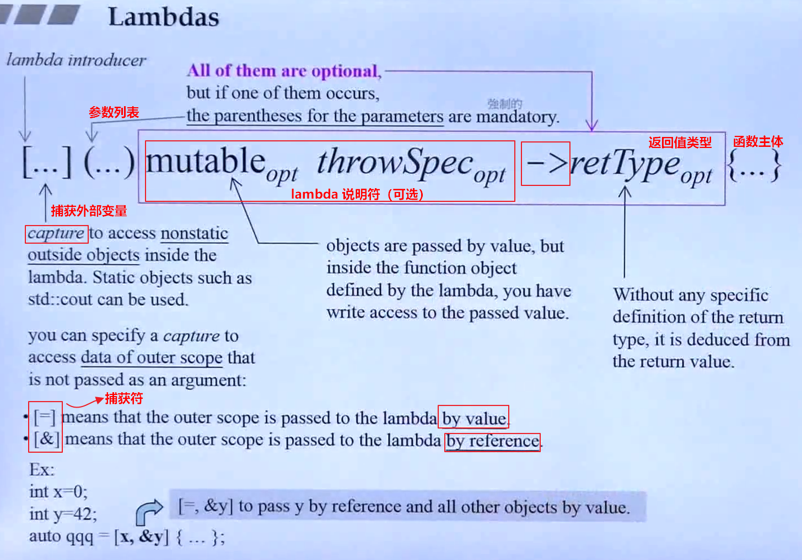

<!--
 * @Author: JohnJeep
 * @Date: 2021-01-10 18:21:43
 * @LastEditors: JohnJeep
 * @LastEditTime: 2025-11-20 11:26:57
 * @Description: C++11 新特性
 * Copyright (c) 2022 by JohnJeep, All Rights Reserved.
-->

C++ 新特性演化整体概览。


C++11 新特性
- [1. Template of  Space](#1-template-of--space)
- [2. Initializer lists](#2-initializer-lists)
- [3. 1.3 nullptr](#3-13-nullptr)
  - [3.1. 背景与问题：为什么需要 nullptr？](#31-背景与问题为什么需要-nullptr)
    - [3.1.1. 1.1 C++98/03 的问题：NULL 的缺陷](#311-11-c9803-的问题null-的缺陷)
      - [3.1.1.1. 问题 1：类型不明确](#3111-问题-1类型不明确)
      - [3.1.1.2. 问题 2：函数重载歧义](#3112-问题-2函数重载歧义)
      - [3.1.1.3. 问题 3：模板推导问题](#3113-问题-3模板推导问题)
  - [3.2. nullptr 的基本特性](#32-nullptr-的基本特性)
    - [3.2.1. 2.1 定义与类型](#321-21-定义与类型)
    - [3.2.2. 2.2 基本用法](#322-22-基本用法)
  - [3.3. 解决历史问题](#33-解决历史问题)
    - [3.3.1. 3.1 解决函数重载歧义](#331-31-解决函数重载歧义)
    - [3.3.2. 3.2 解决模板推导问题](#332-32-解决模板推导问题)
  - [3.4. 高级用法与特性](#34-高级用法与特性)
    - [3.4.1. 4.1 类型安全的比较](#341-41-类型安全的比较)
    - [3.4.2. 4.2 在标准库中的应用](#342-42-在标准库中的应用)
    - [3.4.3. 4.3 用户定义类型的 nullptr 支持](#343-43-用户定义类型的-nullptr-支持)
  - [3.5. 最佳实践](#35-最佳实践)
    - [3.5.1. 5.1 始终使用 nullptr](#351-51-始终使用-nullptr)
    - [3.5.2. 5.2 在函数接口中明确使用](#352-52-在函数接口中明确使用)
    - [3.5.3. 5.3 模板编程中的使用](#353-53-模板编程中的使用)
  - [3.6. 注意事项](#36-注意事项)
    - [3.6.1. 6.1 与旧代码的兼容性](#361-61-与旧代码的兼容性)
    - [3.6.2. 6.2 不能用于非指针上下文](#362-62-不能用于非指针上下文)
  - [3.7. 总结](#37-总结)
- [4. range based for statement](#4-range-based-for-statement)
- [5. Lambda](#5-lambda)
- [6. decltype](#6-decltype)
- [7. explicit](#7-explicit)
- [8. auto](#8-auto)
- [9. noexcept](#9-noexcept)
- [10. constexpr](#10-constexpr)
- [11. override](#11-override)
- [12. final](#12-final)
- [13. New Function Declaration Syntax](#13-new-function-declaration-syntax)
- [14. Scoped Enumerations](#14-scoped-enumerations)
- [15. New Template Features](#15-new-template-features)
  - [15.1. **variadic templates**](#151-variadic-templates)
  - [15.2. Alias Templates (Template Typedef)](#152-alias-templates-template-typedef)
  - [15.3. Type Alias](#153-type-alias)
  - [15.4. Function template](#154-function-template)
- [16. using](#16-using)
- [17. Move Semantics and Rvalue References](#17-move-semantics-and-rvalue-references)
- [18. =delete \&\& =default](#18-delete--default)
- [19. Chrono](#19-chrono)
  - [19.1. duration](#191-duration)
  - [19.2. timepoint and clock](#192-timepoint-and-clock)
- [20. future](#20-future)
- [21. References](#21-references)


## 1. Template of  Space
在 C++11 之后，对一些语法做了一些优化（Important Minor Syntax Cleanups）。比如，优化了 template（模板）中的尖括号的问题，中间是否需要加空格。

```cpp
vector<list<int> > ;  // C+11 之前版本，必须要加一个空格，否则编译器会报错
vector<list<int>> ;   // C++11 之后，不用加空格，语法得到了优化
```


## 2. Initializer lists
C++11 引入了初值列 (initializer list) 和一致性初始化 (Uniform Initialization)。即采用 `{}` 去初始化需要初始化的参数，引入新特的同时也兼容原版本的 `()` 初始化操作。


`initializer list` 的底层是采用 `initializer_list<T>` 这个类模板实现的，其中这个类模板下层采用 `array<T, n>` 的方式去实现的。


` 初值列 ` 赋值是在对象创建成功之前完成的，而 ` 函数体内赋值 ` 是你的对象成员都已经创建好后再对成员进行赋值。` 初值列 ` 是在带参构造函数的函数体外面，第一行进行初始化。

- 初值列初始化语法
  ```cpp
  //  将成员变量设置为 m_re=re, m_im=im
  class Stu(int re, int im)
    : m_re(re), m_im(im)
  {
  public:
        ...
  private:
    int m_re;
    int m_im;
  };
  ```
- 这种初始化并不是必须的，但是在以下几种情况时是必须进行初始化的
  - 成员是 `const` 类型。
  - 成员是 ` 引用类型 `。
  - 有一个成员是类型的对象（不是默认的构造函数）。
> 初始化列表的顺序并不限定初始化的执行顺序，成员的初始化顺序是与类中定义的顺序保持一致。最好让构造函数初始值的顺序与成员声明的顺序保持一致。

## 3. 1.3 nullptr

好的，作为专业的C++工程师，我将系统地为您讲解 C++11 中 `nullptr` 的使用。这是一个看似简单但极其重要的特性，彻底改善了 C++ 中空指针的表达方式。

### 3.1. 背景与问题：为什么需要 nullptr？

#### 3.1.1. 1.1 C++98/03 的问题：NULL 的缺陷

在 C++11 之前，我们主要使用 `NULL` 或字面量 `0` 来表示空指针：

```cpp
// C++98/03 方式
int* ptr1 = NULL;     // 通常定义为 #define NULL 0
int* ptr2 = 0;        // 直接使用 0
```

**这带来了几个严重问题：**

##### 3.1.1.1. 问题 1：类型不明确

`NULL` 通常是一个宏定义，本质上是整数 0：

```cpp
#define NULL 0
// 或者
#define NULL ((void*)0)  // 在某些编译器中
```

##### 3.1.1.2. 问题 2：函数重载歧义

```cpp
#include <iostream>

void func(int x) {
    std::cout << "func(int) called" << std::endl;
}

void func(char* ptr) {
    std::cout << "func(char*) called" << std::endl;
}

int main() {
    func(NULL);    // 歧义！可能调用 func(int) 而不是 func(char*)
    func(0);       // 明确调用 func(int)
    // func(nullptr); // C++11 解决方案
    return 0;
}
```

##### 3.1.1.3. 问题 3：模板推导问题

```cpp
template<typename T>
void process(T* ptr) {
    if (ptr) {
        // 处理指针
    }
}

template<typename T>
void process(T value) {
    // 处理值
}

int main() {
    process(0);     // 调用 process(T value)，T 被推导为 int
    process(NULL);  // 同样的问题！
    // 我们原本想调用指针版本，但编译器选择了值版本
}
```

### 3.2. nullptr 的基本特性

#### 3.2.1. 2.1 定义与类型

`nullptr` 是 C++11 引入的关键字，具有以下特性：

```cpp
// nullptr 的类型是 std::nullptr_t
decltype(nullptr) nptr;  // nptr 的类型是 std::nullptr_t

// std::nullptr_t 定义在 <cstddef> 中
#include <cstddef>
std::nullptr_t null_value;
```

#### 3.2.2. 2.2 基本用法

```cpp
int main() {
    // 初始化各种指针类型
    int* int_ptr = nullptr;
    double* double_ptr = nullptr;
    char* char_ptr = nullptr;
    
    // 类对象指针
    class MyClass {};
    MyClass* obj_ptr = nullptr;
    
    // 函数指针
    void (*func_ptr)() = nullptr;
    
    return 0;
}
```

### 3.3. 解决历史问题

#### 3.3.1. 3.1 解决函数重载歧义

```cpp
#include <iostream>

void func(int x) {
    std::cout << "func(int) called with: " << x << std::endl;
}

void func(char* ptr) {
    std::cout << "func(char*) called" << std::endl;
}

void func(std::nullptr_t) {
    std::cout << "func(nullptr_t) called" << std::endl;
}

int main() {
    func(0);        // 调用 func(int)
    func(nullptr);  // 明确调用 func(char*) 或 func(nullptr_t)
    
    // 如果有多个指针版本的重载，nullptr 会优先匹配最合适的指针类型
    return 0;
}
```

#### 3.3.2. 3.2 解决模板推导问题

```cpp
#include <iostream>
#include <type_traits>

template<typename T>
void process(T* ptr) {
    std::cout << "Pointer version called" << std::endl;
}

template<typename T>
void process(T value) {
    std::cout << "Value version called" << std::endl;
}

// 专门处理 nullptr 的版本
template<>
void process<std::nullptr_t>(std::nullptr_t) {
    std::cout << "nullptr specialized version called" << std::endl;
}

int main() {
    process(0);         // 调用值版本，T = int
    process(nullptr);   // 调用指针版本或特化版本
    
    int x = 10;
    process(&x);        // 调用指针版本
    return 0;
}
```

### 3.4. 高级用法与特性

#### 3.4.1. 4.1 类型安全的比较

```cpp
#include <iostream>
#include <type_traits>

int main() {
    int* ptr = nullptr;
    int x = 0;
    
    // 类型安全的比较
    if (ptr == nullptr) {  // 正确：指针与 nullptr 比较
        std::cout << "Pointer is null" << std::endl;
    }
    
    // if (x == nullptr) {  // 错误！不能比较 int 与 nullptr
    //     // 编译错误
    // }
    
    // 但可以与 bool 上下文一起使用
    if (!ptr) {  // 正确：nullptr 在布尔上下文中为 false
        std::cout << "Pointer is null" << std::endl;
    }
    
    return 0;
}
```

#### 3.4.2. 4.2 在标准库中的应用

```cpp
#include <memory>
#include <functional>
#include <iostream>

int main() {
    // 智能指针
    std::unique_ptr<int> uptr = nullptr;
    std::shared_ptr<int> sptr = nullptr;
    
    // 函数对象
    std::function<void()> func = nullptr;
    
    // 检查智能指针是否为空
    if (uptr == nullptr) {
        std::cout << "unique_ptr is null" << std::endl;
    }
    
    // 重置为 nullptr
    uptr.reset();
    if (!uptr) {  // 等同于 uptr == nullptr
        std::cout << "unique_ptr is null after reset" << std::endl;
    }
    
    return 0;
}
```

#### 3.4.3. 4.3 用户定义类型的 nullptr 支持

```cpp
#include <iostream>

class SmartPointer {
private:
    int* data;
public:
    // 构造函数
    SmartPointer(int* ptr = nullptr) : data(ptr) {}
    
    // 支持与 nullptr 比较
    bool operator==(std::nullptr_t) const {
        return data == nullptr;
    }
    
    bool operator!=(std::nullptr_t) const {
        return data != nullptr;
    }
    
    // 支持从 nullptr 赋值
    SmartPointer& operator=(std::nullptr_t) {
        delete data;
        data = nullptr;
        return *this;
    }
    
    // 布尔转换（用于 if 语句）
    explicit operator bool() const {
        return data != nullptr;
    }
    
    ~SmartPointer() {
        delete data;
    }
};

int main() {
    SmartPointer sp1(new int(42));
    SmartPointer sp2(nullptr);
    
    if (sp1 != nullptr) {
        std::cout << "sp1 is not null" << std::endl;
    }
    
    if (sp2 == nullptr) {
        std::cout << "sp2 is null" << std::endl;
    }
    
    sp1 = nullptr;  // 调用 operator=(nullptr_t)
    
    if (!sp1) {     // 使用 operator bool()
        std::cout << "sp1 is now null" << std::endl;
    }
    
    return 0;
}
```

### 3.5. 最佳实践

#### 3.5.1. 5.1 始终使用 nullptr

```cpp
// 好的实践
int* ptr = nullptr;
if (ptr == nullptr) { /* ... */ }

// 避免使用
int* bad_ptr = NULL;  // 不要使用
int* worse_ptr = 0;   // 更不要使用
```

#### 3.5.2. 5.2 在函数接口中明确使用

```cpp
class Database {
public:
    // 使用 nullptr 作为默认参数
    Connection* connect(const char* host = nullptr, 
                       const char* user = nullptr) {
        if (host == nullptr) {
            host = "localhost";
        }
        // ... 连接逻辑
        return nullptr;  // 返回 nullptr 表示失败
    }
};
```

#### 3.5.3. 5.3 模板编程中的使用

```cpp
template<typename T>
class Container {
private:
    T* data = nullptr;  // 使用 nullptr 初始化成员指针
    
public:
    Container() = default;
    
    explicit Container(T* ptr) : data(ptr) {}
    
    // 移动构造函数
    Container(Container&& other) noexcept 
        : data(other.data) {
        other.data = nullptr;  // 使用 nullptr 重置
    }
    
    // 移动赋值运算符
    Container& operator=(Container&& other) noexcept {
        if (this != &other) {
            delete data;
            data = other.data;
            other.data = nullptr;  // 使用 nullptr 重置
        }
        return *this;
    }
    
    ~Container() {
        delete data;
    }
};
```

### 3.6. 注意事项

#### 3.6.1. 6.1 与旧代码的兼容性

```cpp
// 在混合新旧代码时要注意
void legacy_function(char* ptr);

// 这样调用是安全的
legacy_function(nullptr);

// 但要注意某些旧的 API 可能不期望接收 nullptr
```

#### 3.6.2. 6.2 不能用于非指针上下文

```cpp
int main() {
    int x = 10;
    
    // 以下都是错误的
    // int y = nullptr;      // 错误
    // x + nullptr;          // 错误  
    // bool b = nullptr;     // 错误（需要显式转换）
    bool b = static_cast<bool>(nullptr);  // 正确，但总是 false
    
    return 0;
}
```

### 3.7. 总结

`nullptr` 是 C++11 中一个看似简单但极其重要的改进：

1. **类型安全**：具有明确的 `std::nullptr_t` 类型
2. **解决歧义**：彻底解决了函数重载和模板推导中的歧义问题
3. **代码清晰**：明确表达"空指针"的意图
4. **现代 C++ 的基础**：为智能指针、移动语义等现代特性提供支持

作为专业的 C++ 工程师，应该在所有新代码中完全使用 `nullptr` 替代 `NULL` 和 `0`，这会让代码更安全、更清晰、更现代化。


## 4. range based for statement

引入了一种崭新的 `for` 循环：逐一迭代给定的某个区间、数组、集合、表达式、初始值列表内的每一个元素。

```cpp
for (auto& i : {1, 3, 5, 7})   // 注意: {} 表示是一个容器，初始值列表
{
    cout << i << endl;
}
```


## 5. Lambda

lambda 表达式是 C++11 新引进的一种新特性，允许内联函数的定义（inline functionality）作为 `parameter（参数）` 或者 `local object（局部对象）`，它改变了 C++ 标准库使用的方式。

Lambda 表达式，实际上就是提供了一个类似匿名函数的特性， 而匿名函数则是在需要一个函数，但是又不想费力去命名一个函数的情况下去使用的。这样的场景其实有很多很多， 所以匿名函数几乎是现代编程语言的标配。

lambda 是一份功能性的定义，定义在语句（statement）和表达式（expression）中，可以使用 lambda 作为内联函数。

基本语法
```cpp
[捕获列表](参数列表) mutable(可选) 异常属性 -> 返回类型 {
// 函数体
}
```



上面的语法规则除了 `[捕获列表]` 内的东西外，其他部分都很好理解，只是一般函数的函数名被略去， 返回值使用了一个 `->` 的形式进行。

所谓捕获列表，其实可以理解为参数的一种类型，lambda 表达式内部函数体在默认情况下是不能够使用函数体外部的变量的， 这时候捕获列表可以起到传递外部数据的作用。

根据传递的行为，捕获列表（capture list）也分为以下几种：

1. []：不捕获任何外部变量。
2. `[=]`: 以传值的方式，隐式捕获外部作用域之外的所有变量。若 lambda 中有被定义的内容时，不能修改外部作用域中的数据，只有 read 的权限。
3. `[&]`: 以传引用的方式，隐式捕获外部作用域之外的所有变量。若 lambda 中有被定义的内容时，可以修改外部作用域中的数据，具有 write 的权限。
4. [this]：捕获 this 指针。通常用于访问当前对象的成员变量和成员函数。

```cpp
class MyClass {
private:
    int x = 10;
    int y = 20;
public:
    void testCaptures() {
        // 方式1：显式捕获 this
        auto lambda1 = [this]() {
            return x + y;  // 访问成员
        };
        
        // 方式2：隐式捕获（捕获所有）
        auto lambda2 = [=]() {
            return x + y;  // this 被隐式捕获
        };
        
        // 方式3：隐式捕获所有（引用方式）
        auto lambda3 = [&]() {
            x = 30;  // 可以修改成员
            return y;
        };
    }
};
```

### 危险情况：悬空 this 指针

```cpp
class MyClass {
public:
    std::function<void()> getLambda() {
        // 返回捕获了 this 的 lambda
        return [this]() {
            // 如果 MyClass 对象已被销毁，这里会发生未定义行为！
            std::cout << "Lambda called" << std::endl;
        };
    }
};

int main() {
    std::function<void()> func;
    {
        MyClass obj;
        func = obj.getLambda();  // lambda 捕获了 obj 的 this
    }  // obj 被销毁
    
    func();  // 危险！悬空 this 指针！
    return 0;
}
```

为了避免悬空指针问题，建议使用智能指针：

```cpp
#include <memory>

class MyClass : public std::enable_shared_from_this<MyClass> {
public:
    std::function<void()> getSafeLambda() {
        // 捕获 shared_ptr
        auto self = shared_from_this();
        return [self]() {
            // 安全：self 保持对象存活
            self->doSomething();
        };
    }
    
    void doSomething() {
        std::cout << "Safe!" << std::endl;
    }
};

int main() {
    std::function<void()> func;
    {
        auto obj = std::make_shared<MyClass>();
        func = obj->getSafeLambda();
    }  // obj 引用计数为 1（lambda 持有），不会被销毁
    
    func();  // 安全！
    return 0;
}
```

### 注意

1. **谨慎捕获 this**：确保 lambda 的生命周期不会超过对象
2. **异步操作时要特别小心**：异步回调中很容易出现悬空指针，用同步执行。
3. **优先使用值捕获**：如果能复制数据，优先捕获值而非 this
4. **使用智能指针**：对于需要延长生命周期的场景
5. **明确捕获列表**：避免使用 `[=]` 或 `[&]`，而是明确写出 `[this]`
6. 需要访问或修改多个成员变量
7. 需要调用成员函数
8. 确保对象在 lambda 执行期间一直存在。当 lambda 可能比对象生命周期更长时（如存储到容器、异步执行），应该避免直接捕获 `this`，而是使用智能指针或其他生命周期管理机制。
9. C++ 编译器对 lambda 的优化效果高于普通的函数。
10. 根据 C++ 语言规定，lambda 没有默认的构造和赋值操作函数(`default constructor` 和 `assignment operator`)。
11. 捕获变量中没有加 `=` 或 `&` 时，编译器默认按照是值传递 `=`；在捕获变量时，一般建议使用 **传引用，而非传值**。

### mutable

当 lambda 中有 `mutable` 关键字修饰时，表明在 lambda 中可以改变捕获的值。


上图中的第一个案例表明，开始时捕获的 `id=0`, 当运行至 `id=42` 这一行时，由于是按照 值传递，且 lambda 还没有执行，因此，lambda 中的 id 捕获的还是为 0 ，当执行 lambda 后，id 值每次 ++，改变了 lambda 表达式中捕获的内容。


## 6. decltype

decltype 是 C++11 增加的一个关键字，作为类型推导，操作过程是在编译时进行的。

decltype 通常有以下几种用法：

- 常常与 `typdef/using` 关键字结合起来使用。
- 可以处理匿名的类型。比如：`union`, `struct ` 结构中出现的匿名数据，可以使用这个来解决。
- **最重要的一个作用：推导函数的返回类型 (used to declare return types)。**
  ```cpp
  template<typename T1, typename T2>
  auto add(T1 + T2)->decltype(x + y);   // 自动推导 x + y 结果的返回类型
  ```
- 元编程中使用 (use it in metaprogramming)
  ```cpp
  template<typename T1, typename T2>
  struct common_type<T1, T2> {
  typedef decltype(true ? declval<T1>() : declval<T2>()) type;
  };
  ```
- lambda 表达式作为类型参数传入 (use to pass the type of the a lambda)
  ```cpp
  class Person {
  ...
  };
  
  auto cmp = [](const Person1&, const Person2) {
      ...
  };
  std::set<Person, decltype(cmp)> p(cmp);
  ```


## 7. explicit
大部分情况下 `explicit` 关键字用在构造函数中，只有少部分用在模板中。注意：被 `explicit` 关键字修饰的构造函数，不能进行自动地进行隐式 (implicit) 类型转换，只能显式 (explicit) 地进行类型转换。

- 当类的声明和定义分别在两个文件中时，`explicit` 只能写在在声明 (`declaration`) 中，不能写在定义 (`definition`) 中。
- 被声明为 `explicit` 的构造函数通常比它的兄弟 `non-explicit` 更受欢迎，因为它们禁止编译器执行非预期（往往也不被期望）的类型转换。除非我有一个好的理由允许构造函数被用于隐式类型转换，否则我会把它声明为 `explicit` 。我鼓励你遵循相同的政策。


## 8. auto
C++11 中新增的一个关键字，让编译器通过初始值去分析所属类的类型。`auto` 关键字会完成类型自动推导 (Automatic Type Deduction with auto)：根据初始值自动推导变量的类型，因此，在使用这个关键字之前，必须需要将变量初始化。

- `auto` 一般会忽略掉顶层的 const，但底层的 const 会保留下来。从变量声明的初始化表达式处获得变量的类型。
  ```cpp
  const int ci = i;
  const auto f = ci;  // ci 的推演类型是 int，f 是 const int
  ```


## 9. noexcept
C++11 引入了该关键字 `noexcept`。该关键字告诉编译器，指定的某个函数不会抛出异常。通常有两种不同的方式来使用这个关键字。

- 第一种方式，简单地将 `noexcept` 关键字放在函数声明的后面，这样该函数便会被标记为不会抛出异常。
  ```cpp
  void add(int) noexcept;   // 表明 add() 函数不会抛出异常
  ```
- 第二种方式：为 `noexcept` 关键字额外提供一个常量表达式作为其参数，若这个常量表达式的值为 “true”，那么函数就会被标记为不会抛出异常，反之亦然。
  ```cpp
  constexpr bool suppressExcept = true;
  void excpt_func() noexcept (suppressExcept);
  ```

<font color=red>
注意：
</font>

- 若当前函数抛出来的异常没有被立即处理，则一直通过 throw 关键往上抛，直到被标准库中的 `std::terminal()` 捕获，再去处理，其中 `std::terminal()` 内部默认调用的是 `std::abort()`。
- C++ 中的异常处理是在程序运行时检测，而不是编译时检测的。为了实现运行时检测，编译器会创建额外的代码，然而这会妨碍程序优化。
- 函数指针的声明和定义中可以指定 `noexcept`
- `typedef 或类型的别名 ` 中不能使用 `noexcept`
- 成员函数中，`noexcept` 需要跟在 `const 或引用 ` 限定符之后，但是跟在 `final、override 或虚函数 = 0` 这些限定符之前。
- 移动构造函数 (move constructor)：在对象进行 `copy` 时，直接拷贝对象所保有的一些资源。比如，已经在原对象中分配的堆内存、文件描述符，以及 IO 流等。
- 移动分配函数 (move assignment)
- 析构函数 (destructor)。在新版本的编译器中，析构函数是默认加上关键字 `noexcept` 的。

参考
- [C++ 中的移动构造与 noexcept](https://www.yhspy.com/2019/11/22/C-%E4%B8%AD%E7%9A%84%E7%A7%BB%E5%8A%A8%E6%9E%84%E9%80%A0%E4%B8%8E-noexcept/)


## 10. constexpr
常量表达式 (const expression)：表示值不会改变，并且在编译过程中就能得到计算的结果的表达式。

- 为什么要使用 constexpr？
  
  > 提高程序的执行效率，允许一些计算发生在编译时，而不是在运行的时候，因而采用常量表达式。`constexpr` 关键字在 C++11 中引入，而在 C++14 中得到改善，使用更加灵活。`constexpr` 表示允许将变量声明为 `constexpr` 类型，让编译器来验证变量的值是否是一个常数表达式。
  
- const 与 constexpr 的区别：
  - const 变量的初始化可以延迟到程序运行时
  - constexpr 变量的初始化必须在编译时进行，但不能作为函数的参数。
  - constexpr 指针：限定符 constexpr 仅对指针有效，与指针所指向的对象无关。
    ```cpp
    const int* p = nullpter;      // p 是一个指向整型常量的指针
    constexpr int* q = nullptr;   // q 是一个指向整数的常量指针
    ```

利用 constexpr 可以修饰函数。修饰的函数可是：普通成员函数、构造函数、模板函数。

- 修饰函数时，函数体必须要有返回值，且返回的表达式必须是常量表达式，非常量表达式就编译报错。
  ```cpp
  constexpr int func()
  {
    return 100;
  }
  ```
- 整个函数的函数体中不能出现非常量表达式之外的语句，例如 `for` 循环。但 using 语句，typedef 语句，static_assert 断言以及 return 语句等这些语句除外。
- constexpr 修饰构造函数时，类中的变量初始化必须放在初始值列表，且构造函数中必须是空的。
  ```cpp
  class Animal
  {
    Animal(int id) : m_id(id)
    {
    }
  private:
    int m_id;
  };
  ```
- C++11 语法中，constexpr 可以修饰函数模板，但由于模板中类型的不确定性，因此函数模板实例化后的模板函数是否符合常量表达式函数的要求也是不确定的。如果 constexpr 修饰的模板函数实例化结果不满足常量表达式函数的要求，则 constexpr 会被自动忽略，即该函数就等同于一个普通函数。
  ```cpp
  // initializer list 中的一段源码
  template<class _Tp>
    constexpr const _Tp*
    begin(initializer_list<_Tp> __ils) noexcept
    {return __ils.begin(); }
  ```

> 在编译时，被 `constexpr` 修饰的函数会隐式的被指定为内联函数。其中内联函数一般定义在头文件中。

参考: https://subingwen.cn/cpp/constexpr/#2-1-%E4%BF%AE%E9%A5%B0%E5%87%BD%E6%95%B0


## 11. override
override 是 C++11 引进的一个说明符，翻译为 ` 覆盖、重写 ` 的意思。C++11 中的 override 关键字，可以显式的在派生类（子类）中声明，看哪些成员函数需要被重写。

- override 有什么用?
  - 一般在继承中，涉及到虚函数时，需要在子类中重新改写函数的内容，去实现父类的方法，这时 `override` 关键字就派上用场了。
- 注意事项
  - 在派生类的成员函数中使用 override 时，如果基类中无此函数或基类中的函数并不是虚函数，编译器会给出相关错误信息。
    

## 12. final

final 是 C++11 引进的一个说明符，有两种使用方式。

- 第一种：用在 `class` 类名之后，表示当前的类是一个类的最终继承者，不能再被额外的类继承了。若还有子类继承自用 `final` 关键字修饰的父类，编译器则会报错。
- 第二种：虚函数中用于修饰函数。若父类中有用 `final` 关键字修饰的虚函数，则表明该虚函数不能再被其子类重写了，即它是一个最终的虚函数；否则编译器会报错。
  


## 13. New Function Declaration Syntax
New Function Declaration Syntax 是新的函数声明语法。


## 14. Scoped Enumerations
Scoped Enumerations 英文可翻译为带作用域的枚举。


## 15. New Template Features


### 15.1. **variadic templates**
variadic templates(参数数量不定的模板) 是 C++ 新增的一个非常重要的特性。


- 代码部分
  ```cpp
  #include <iostream>
  #include <bitset>
  
  using namespace std;
  
  /**
   * @description: 当包 ... 中 的个数等于 0 时就会执行下面这个空的函数
   * @param {*}
   * @return {*}
   */
  void my_print()
  {
  }
  
  template<typename T, typename... Types>
  void my_print(const T& firstAgs, const Types&... args)
  {
      cout << firstAgs << endl;
      my_print(args...);
  }
  
  int main(int argc, char *argv[])
  {
      my_print(100, "hello", bitset<16>(377), 50);
  
      return 0;
  }
  ```


使用这个的好处是帮助我们解决递归。递归的过程就是把不定参数的个数一一分解出来。


### 15.2. Alias Templates (Template Typedef)
Alias Templates 是一个别名模板。

- 简单用法
  ```cpp
  // declaration
  template<typename T>
  using Vec = std::Vector<T, MyAlloc<T>>;
  
  // call
  Vec<int> coll;
  ```

- 上面的代码等价于
  ```cpp
  std::vector<int, MyAlloc<int>> coll;
  ```


<font color=red>
alias template 不可能用作 偏特化 或 全特化。

从上面的代码看，`using` 使用的效果与 `#define` 或 `typedef` 的用法似乎是一样的，其实并不是一样的，反而使用 `#define` 或 `typedef` 不能实现 `alias template` 所达到的效果。
</font>


### 15.3. Type Alias
Type Alias 是一个类型别名。

- 第一种用法与 `typedef` 的用法是一样的。
  ```cpp
  typedef void(*func)(int, int);
  using func = void(*)(int, int);  // 两者实现的用法是等同的
  
  void example(int, int) {}
  func f = example;
  ```
- 第二种用法：type alias 用在 `member typedef name(成员类型名字)`。
  ```cpp
  template<typename T>
  struct Container {
    using value_type = T;  // 等同于 typedef T value_type;
  };
  
  // 泛型编程中使用
  template<typename Cntr>
  void f2(const Cntr& ct)
  {
    typename Cntr::value_type n;
  }
  ```


### 15.4. Function template


## 16. using
哪些地方会用到 using 关键字？

- 第一种： namespace 用在命令空间中： `using namespace std;`
- 第二种：为类成员做声明 (using-declarations for class members)。可用于子类继承于父类的成员或函数。
  ```cpp
  // vector 容器中的一段源码
  protected:
    using _Base::_M_allocate;
    using _Base::_M_deallocate;
    using _Base::_M_impl;
  ```
  > 有一篇博客写得很好可以值得参考：[委托构造和继承构造函数](https://subingwen.cn/cpp/construct/)，可以看我自己用代码实现的例子：[using 用法](./code/c11/using.cpp)
- 第三中：C++11 起引入了 `type alias` 和 `alias template`，可使用 `using` 关键字作为类型或模板的别名。
  类模板中使用
  ```cpp
  template<typename T>
  struct Container {
  
    // 类型别名
    using value_type = T;  // 等同于 typedef T value_type;
  };
  
  // 模板别名
  template <class CharT> using mystring = std::basic_string<CharT, std::char_traits<CharT>>;
  ```

  普通类型中使用
  ```cpp
  // 函数指针中使用，给类型起个别名
  typedef int(func1*)(int, string);  // 法一：使用 typedef
  using func2 = int(*)(int, string);  // 法二：使用 using
  ```

> using 关键字的代码实现可参考：[using 用法](./code/c11/using.cpp)


## 17. Move Semantics and Rvalue References
Rvalue 只能出现在左边。常见的右值：` 临时对象 (temp object)`。

STL 中更好的解决 `perfect forward` 问题的的源码部分。

```cpp
  /**
   *  @addtogroup utilities
   *  @{
   */

  /**
   *  @brief  Forward an lvalue.
   *  @return The parameter cast to the specified type.
   *
   *  This function is used to implement "perfect forwarding".
   */
  template<typename _Tp>
    constexpr _Tp&&
    forward(typename std::remove_reference<_Tp>::type& __t) noexcept
    {return static_cast<_Tp&&>(__t); }

  /**
   *  @brief  Forward an rvalue.
   *  @return The parameter cast to the specified type.
   *
   *  This function is used to implement "perfect forwarding".
   */
  template<typename _Tp>
    constexpr _Tp&&
    forward(typename std::remove_reference<_Tp>::type&& __t) noexcept
    {
      static_assert(!std::is_lvalue_reference<_Tp>::value, "template argument"
            "substituting _Tp is an lvalue reference type");
      return static_cast<_Tp&&>(__t);
    }

  /**
   *  @brief  Convert a value to an rvalue.
   *  @param  __t  A thing of arbitrary type.
   *  @return The parameter cast to an rvalue-reference to allow moving it.
  */
  template<typename _Tp>
    constexpr typename std::remove_reference<_Tp>::type&&
    move(_Tp&& __t) noexcept
    {return static_cast<typename std::remove_reference<_Tp>::type&&>(__t); }
```

## 18. =delete && =default
构造函数后面加上 `=default` 关键字，告诉编译器要显式的将哪个作为默认构造函数，而不去调用空类型参数的构造函数。比如：下面的类中，将拷贝赋值函数作为默认的构造函数，而不是 `Pro()` 这个构造函数。

```cpp
class Pro
{
public:
  Pro();                                  // constructor
  Pro(const pro&) = delete;               // copy constructor
  Pro(Pro&&) = default;                   // move constructor
  Pro& operator= (const Pro&) = default;  // copy assignment
  Pro& operator= (const Pro&&) = delete;  // move assignment
  virtual ~Pro();                         // deconstructor
};
```

类中有拷贝构造函数或拷贝赋值函数后，不能再在拷贝构造函数或拷贝赋值函数后面加 `=default` 或 `=delete` 关键字修饰了。


## 19. Chrono

通用术语

- `duration` 时间段：指的是在某时间单位时间上的一个明确的 tick（片刻数）。
- `timepoint`（时间点）：表示某个特定的时间点，是一个 duration 和 epoch 的组合。关联至某个 clock 的某个正值或负值 duration。
- `epoch`（时间段的起点）。1970 年 1 月 1 日是 UNIX 和 POSIX 系统时钟（system clock）的起点。


### 19.1. duration
class duration 类 API 接口
- `d.count()` 返回 duration d 的 tick 数量，即打印 tick 数。
- `duration::zero()` 获得一个长度为 0 的时间段（duration）。
- `duration::min()` 和 `duration::max()` 则分别获得一个 duration 所拥有的最小和最大值。
- `duration::rep` 获得 ticks 的类型。
- `duration::period` 获得 unit type 的类型。

### 19.2. timepoint and clock

## 20. future

`std::future` 是在 **C++11** 标准中引入的。具体来说，它是随着 C++11 的并发支持库一起加入标准库的，位于 `<future>` 头文件中。

主要时间节点：

- **C++11 (2011年)** - 首次引入 `std::future`, `std::promise`, `std::packaged_task`, `std::async` 等异步操作工具
- **C++14 (2014年)** - 对 `std::future` 进行了一些小的改进
- **C++17 (2017年)** - 引入了 `std::future::then()` 等相关扩展（但后来有些被推迟）

基本用法示例：

```cpp
#include <iostream>
#include <future>
#include <thread>

int main() {
    // 使用 async 启动异步任务
    auto future = std::async(std::launch::async, []() {
        return 42;
    });
    
    // 获取结果（会阻塞直到结果可用）
    int result = future.get();
    std::cout << "Result: " << result << std::endl;
    
    return 0;
}
```

## 21. References

- C++ standard: https://isocpp.org/std/the-standard <br>
  标准委员会官方站点，近期的会议、行程、活动、计划等等都会发布在这里。这里也会推荐一些比较好的文章、教程、书籍等等内容，供C++程序员阅读。
- modern C++ 讲解：http://www.modernescpp.com/index.php