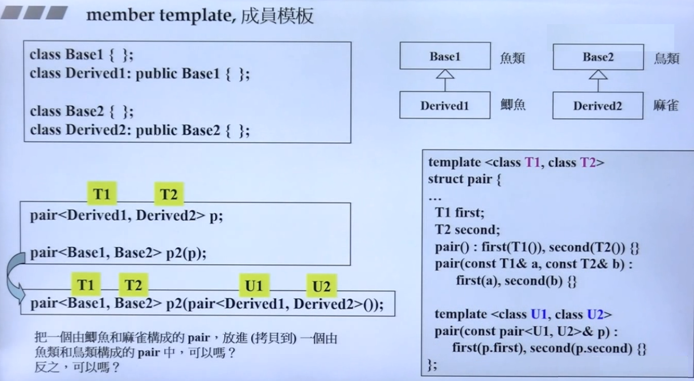
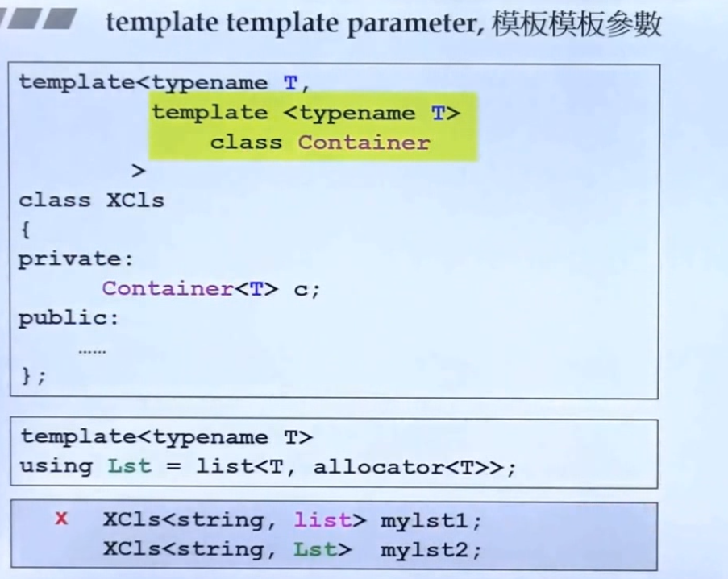
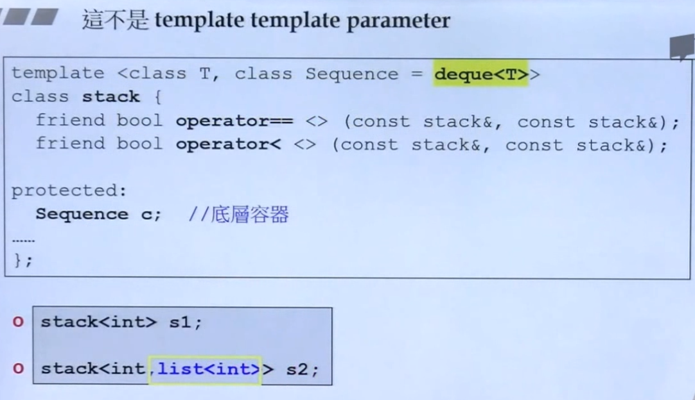

<!--
 * @Author: JohnJeep
 * @Date: 2025-11-12 11:26:18
 * @LastEditors: JohnJeep
 * @LastEditTime: 2025-11-20 11:46:29
 * @Description: 泛型编程
 * Copyright (c) 2025 by John Jeep, All Rights Reserved. 
-->

- [1. Generic Programming(泛型编程)](#1-generic-programming泛型编程)
- [2. Parameterized Type(参数化类型)](#2-parameterized-type参数化类型)
- [3. 模板编译](#3-模板编译)
- [4. Function Template(函数模板)](#4-function-template函数模板)
- [5. Class Template(类模板)](#5-class-template类模板)
  - [5.1. Specialization(模板特化)](#51-specialization模板特化)
  - [5.2. Class Partial Specialization(类模板偏特化)](#52-class-partial-specialization类模板偏特化)
- [6. Member Template(成员模板)](#6-member-template成员模板)
- [7. template template parameter](#7-template-template-parameter)
- [8. References](#8-references)


## 1. Generic Programming(泛型编程)

Generic Programming(泛型编程): 操作(operations)使用相同的接口，但是其类型(type)不相同，即使用模板(template)将泛型操作公式化。其中STL是泛型编程(GP)最成功的一个作品。

泛型编程在程序编译时就能获知其类型。而面向对象编程处理的类型在程序运行之前都是未知的情况。

模板是泛型编程的基础。C++语言既有类模板（class template），也有函数模板（function template），只有对C++语言有了相当深入的理解后才能写出模板。**模板本身不是类或函数，可以将模板看作是：编译器为生成类或函数编写的一份说明，或认为一个模板就是为创建类或函数的公式。** 编译器根据模板创建类或函数的过程称为实例化（Instantiation），当使用模板时，编译器需要明确应该吧类或函数实例化成何种类型。

**面向对象编程与泛型编程的区别？**

> OOP是将类中的data与methods组合在一起的，而泛型编程(GP)则是将类中的data与methods分开来的。采用泛型编程可以实现容器(Containers)与算法(Algorithms)的各自分离与实现。

## 2. Parameterized Type(参数化类型)

参数化类型（parameterized type）也就是泛型编程（generic）和模板（templates）。

## 3. 模板编译

当编译器遇到一个模板定义时，它并不生成代码。只有当我们实例化出模板的一个特定版本时，编译器才会生成代码。当我们使用（而不是定义）模板时，编译器才生成代码，这一特性影响了我们如何去组织代码以及错误何时被检测到。

通常，当我们调用一个函数时，编译器只需要掌握函数的声明。类似的，当我们使用一个类类型的对象时，类定义必须是可用的，但成员函数的定义不必己经出现。因此，我们将类定义和函数声明放在头文件中，而普通函数和类的成员函数的定义放在源文件中。

模板则不同：为了生成一个实例化版本，编译器需要掌握函数模板或类模板成员函数的定义。因此，与非模板代码不同，模板的头文件通常既包括声明也包括定义。

## 4. Function Template(函数模板)

模板函数语法

实例一：

```cpp
template <typename T> 
  void Show(T arrNum[], int len);
```

实例二：

```c++
// 声明
template <typename T>
void func(T a, T b)

// 调用
func<int>(x, y);      // 显示调用
func(x, y);           // 调用时自动类型推导，不需要写出具体的函数类型 int，编译器会对
                      // function template 进行实参推导
```

- 两种方式调用

  - 显示类型调用
  - 自动类型推导

- 函数模板与函数重载

  - 函数模板的调用严格按照类型进行匹配，不会进行类型的自动转换。
  - `普通函数` 的调用可以进行 `隐式` 的类型转换。
  - 调用规则
    - 函数模板与普通函数都符合调用时，C++编译器优先考虑普通函数
    - 函数模板可以像普通函数一样被重载。
    - 若函数模板可以产生一个更好的匹配，那么选择模板
    - 通过空模板 `<>` 实参数列表的语法限定编译器只通过模板匹配。

- 函数模板调用的机制

  - 编译器并不是把函数模板处理成能够匹配任意类型的函数，而是根据函数模板中的具体类型产生不同的函数。
  - 编译器会对 `函数模板进行两次编译`。`第一次在声明` 的地方对模板进行编译，`第二次在实际调用` 的地方将参数替换后，再对代码进行编译。

- 函数模板当函数参数与函数指针当函数参数的情况类似。 

## 5. Class Template(类模板)

对类模板来说，我们通过提供一些额外信息来指定模板到底实例化成什么样的类，需要提供哪些信息由模板决定。在模板名字后面跟一对尖括号，尖括号内放上需要提供的信息。

与函数模板不同之处是，编译器不能自动为类模板推断模板参数类型，需要显示的指定传入的参数类型。

为什么要使用类模板？

- 让 `算法` 和 `数据类型` 进行各自的分离。 

代码示例：

```cpp
// 定义类模板
template <typename T>
class Complex
{
public:
  Complex(T r = 0, T i = 0)
    : re(r), im(i)
    {}
  Complex& operator += (const Complex&);
  T real() const {retuen re;}
  T image() const {return im;}

private:
  T re;
  T im;
}

{
  // 具体使用类模板
  Complex<double> c1(5.5, 10.8);
  Complex<int> c2(4, 6);

}
```

> 要实现不同类型的复数类进行加、减、乘的运算，其中进行运算的规则都是一样的，只是传入的类型不同而已，这时类模板就很好的解决了这个问题。

- 单个类中的类模板

  - 模板类型参数化  

- 继承中的类模板

  - 从模板类派生普通的类时，需要具体化模板类（即指定类的参数类型），C++编译器需要知道父类的数据类型具体是怎样的。 
  - 类模板可以派生 `类模板`

- 注意

  - 一个类模板的每个实例都形成一个独立的类。 

### 5.1. Specialization(模板特化)

什么是模板特化？

> 模板特化也叫模板全特化。使用时，给类模板指定具体的参数类型，这样使用类模板的方式就叫模板特化。


### 5.2. Class Partial Specialization(类模板偏特化)

类模板偏特化也叫类模板局部特化。只指定一个类模板中的部分参数，不全部在类模板调用时传入，对某个 template 参数进行特化工作。

所谓 partial specialization 的意思是提供另一份 template 定义，而其本身仍然为 templatized。例如，假设有一个类模板：

```cpp
template <typename T, typename U, typename T>
  class test{ };
```

针对模板参数类型 T 做一个偏特化版本

```cpp
template <typename T>
  class test<T*>{ };
```

类模板偏特化按照模板参数的个数和参数类型的范围，分为模板**个数偏特化**和模板**范围偏特化**。

**1. 模板个数的偏特化**

> 只指定类模板中部分的参数个数
> 

**2. 类模板范围的偏特化**

下图中类模板传入的是一种通用的 T 类型，而另外一个相同的类模板，传入的参数 是 `T*` 类型，类模板的类型从 T 缩小为 `T*` 类型，这种的方式的类模板就是类模板范围的偏特化。


## 6. Member Template(成员模板)

为什么要使用 `member template`?

- STL 标准库中很多的构造函数都使用了，为了让模板类更加有弹性，支持更多的数据类型。

  
  


## 7. template template parameter

什么是模板参数模板？

- 模板参数列表里面可以存在模板，称之为模板参数模板。






## 8. References
- [【C++】template template argument 模板参数模板](https://www.cnblogs.com/visayafan/archive/2011/11/29/2268041.html) 