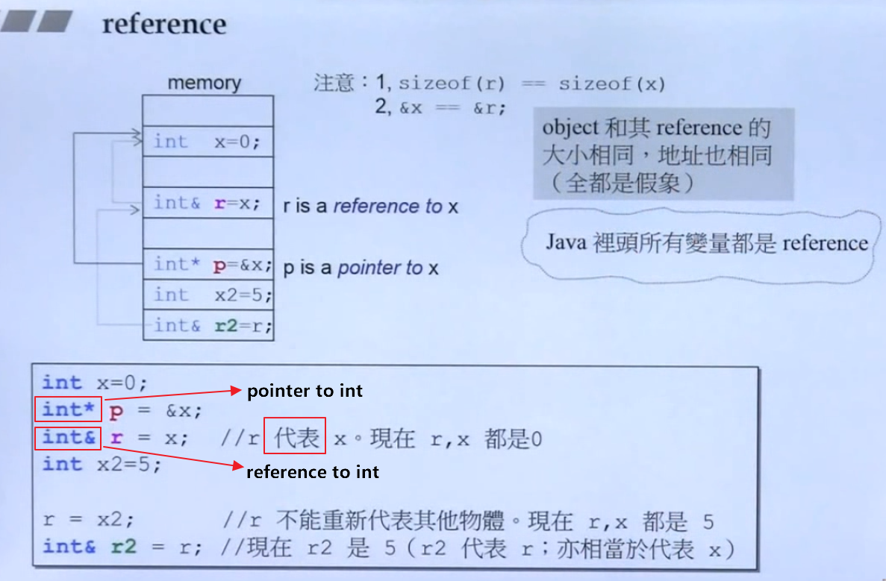
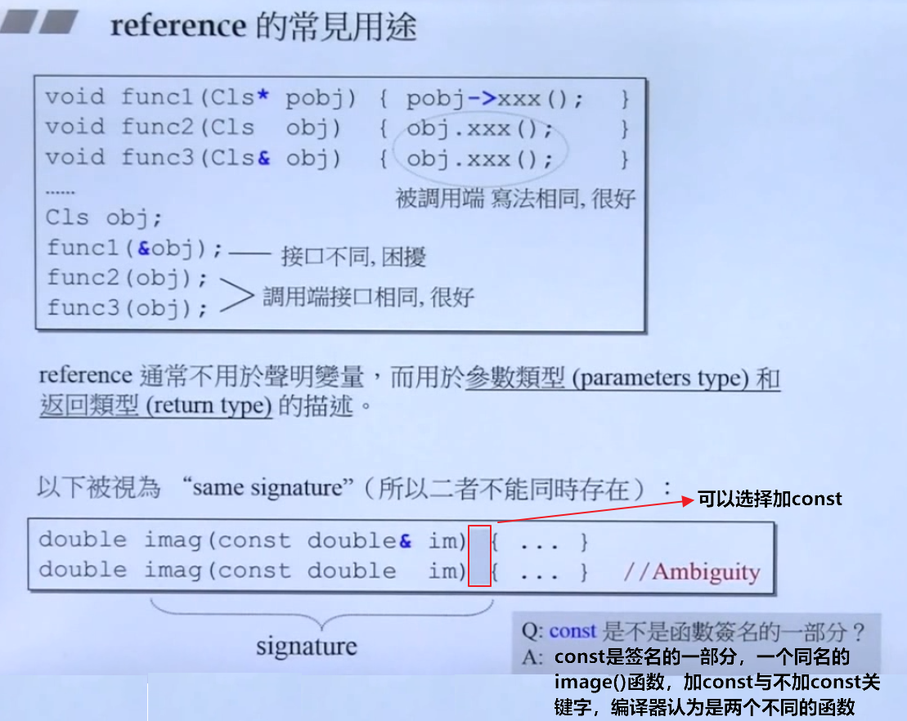
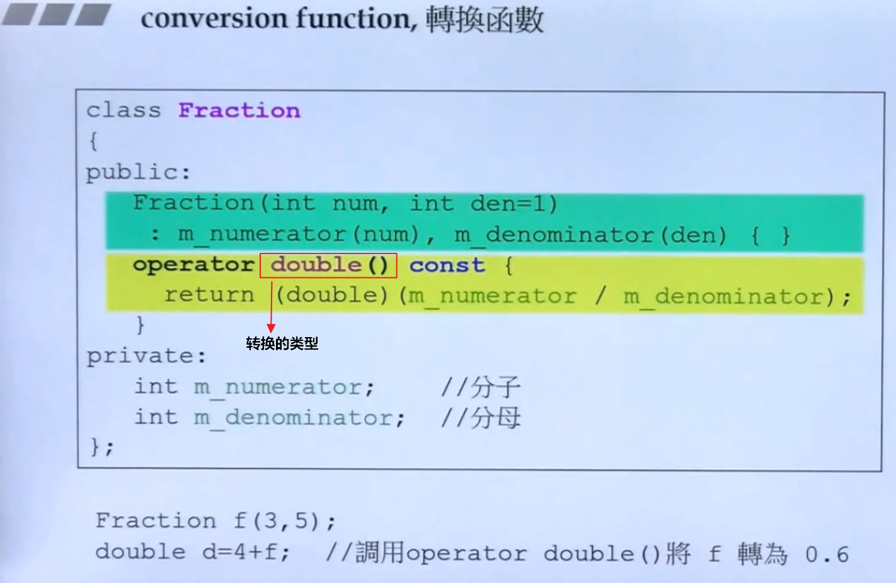
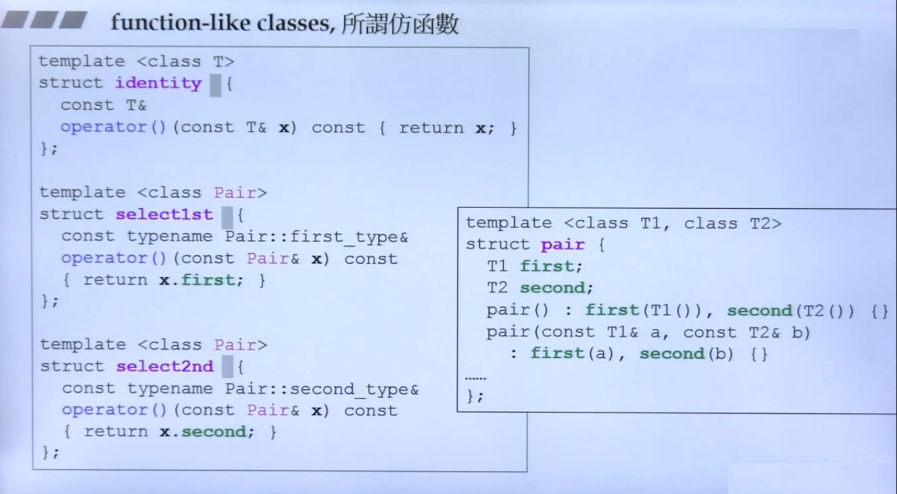
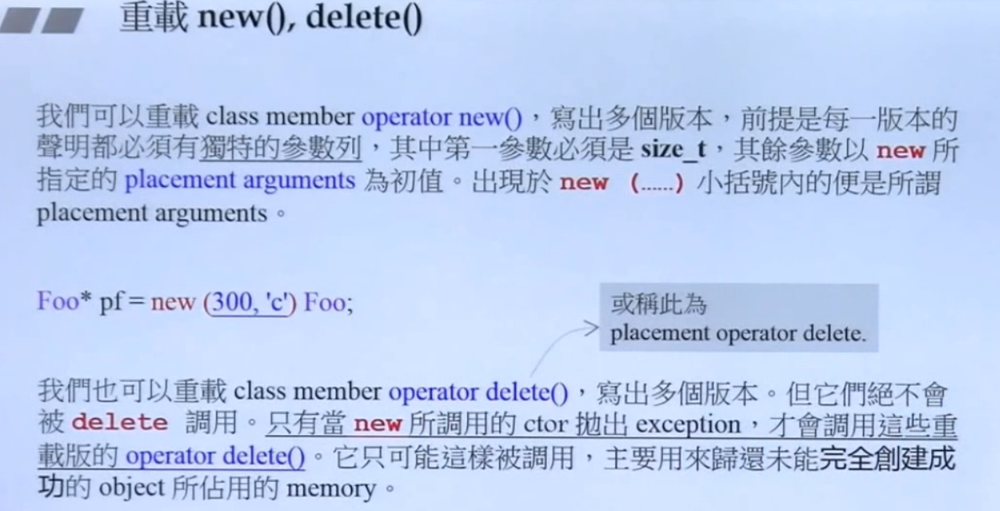
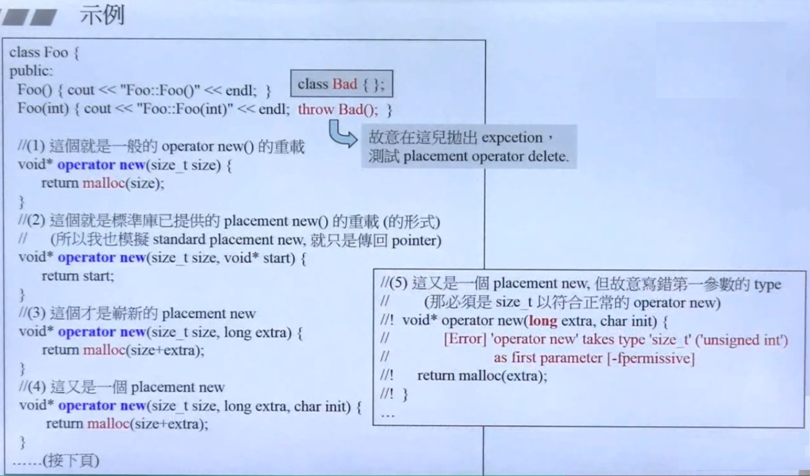
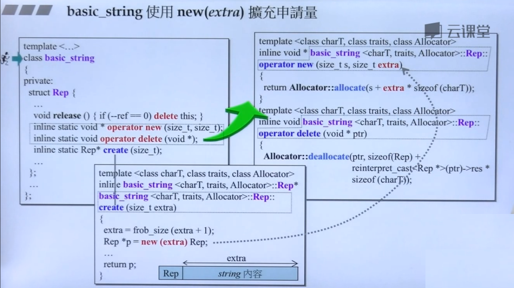
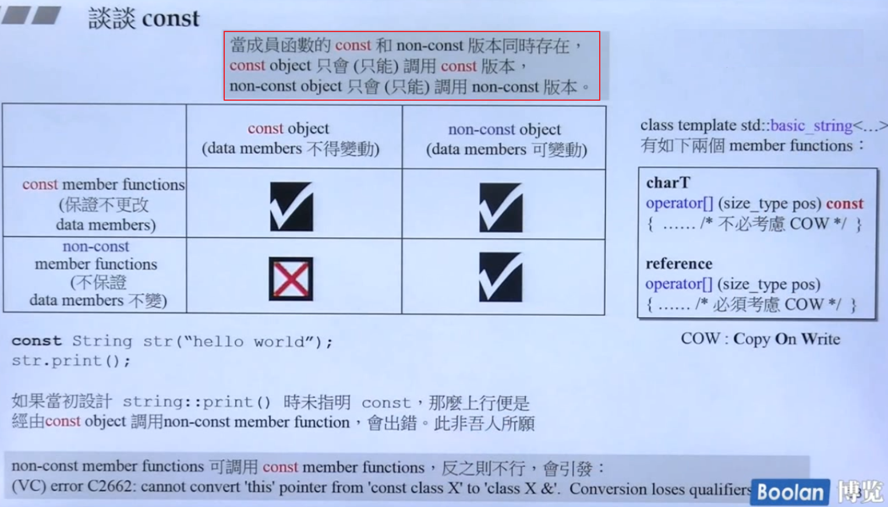
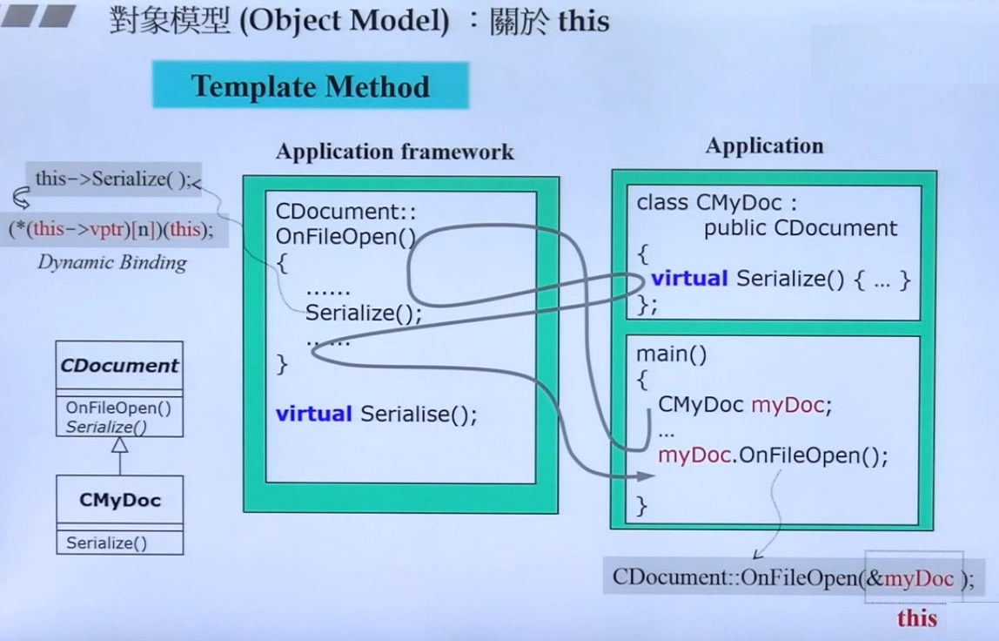
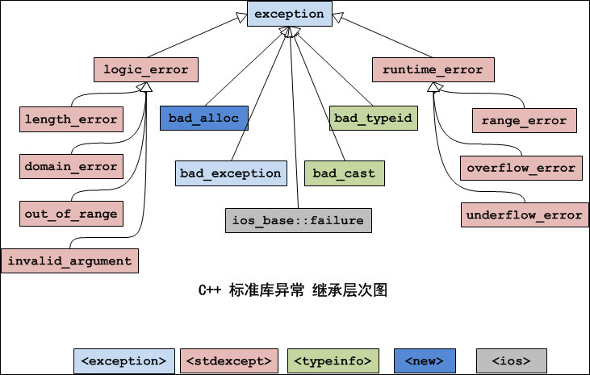

<!--
 * @Author: JohnJeep
 * @Date: 2020-05-27 10:12:26
 * @LastEditors: JohnJeep
 * @LastEditTime: 2025-11-13 20:31:43
 * @Description: C++ 基础
 * Copyright (c) 2022 by johnjeep, All Rights Reserved. 
-->

# 1. concept(概念)

c++ 是一种倾向于系统编程的通用编程语言，在 C 语言的基础上发展起来的，支持的特性。
- supports data abstraction
- supports object-oriented programming
- supports generic programming  
- Compile-Time (constexpr and template metaprogramming)  


# 2. c++ basics(C++基础)

- C 语言中，表达式的返回值是一个数值。C++ 中，表达式的返回值是变量的本身，可以作为左值，作为左值需要开辟一个内存空间。
- `endl` 与 `\n` 区别
  - `endl`：换行和清除缓冲区到输出屏幕上
  - `\n`：仅仅只是换行
- `float`：有效数字是 6~7 位
- `double`：有效数字是 15 位
- `char`：8 个 bit，占一个字节（byte）空间
- 取模场景
  - 取一个数的个位数
  - 多少天是一个月的第几天 
- `<<` 左移运算符：右侧空位补 0
- `>>` 右移运算符：左侧空位补符号位，符号位正数部 0，符号位为负数补 1。
- `switch` 语句后的表达式只能为整型或字符类型。`break` 语句：执行循环体后，调出循环。可用于 `switch` 结构或者循环结构。
  ```cpp
  switch (expression)
  {
  case /* constant-expression */:
      /* code */
      break;
  
  default:
      break;
  } 
  ```
- continue：只能用于循环结构，调出循环。
- 计算数组大小：对基本类型（不包括 `String` 类型）
  ```cpp
  sizeof(array_var) / sizeof(array_type)
  
  sizeof(nums) / sizeof(int) 
  ```

- 指针
  - 所有的指针都要初始化
  - `int *ptr`  整型指针，结果是一个值
  - `int *ptr  int*`：指向整型的指针，结果是一个地址
  - `void* ` 指针存放的是一个内存地址，地址的内容是什么类型不能确定 


# 3. namespace(命名空间)

C 中的命名空间
- 只有一个全局的作用域，所有的全局标识符共用一个作用域。同名的标识符之间会发生冲突。

C++的命名空间
- 将全局的作用域分成不同的部分，不同命名空间的标识符可以同名而不会发生冲突。
  ```cpp
  // 使用标准库中封装的内容。标准库中定义的所有名字都在命名空间 std 中
  using namespace std
  {
    .....
  }
  ```
- 全局作用域也叫默认命名空间。
- 命名空间之间可以相互嵌套。
- `::` 叫作用域运算符。<br>
  `std::out` 从标准库中输出读取的内容，即编译器从操作符左侧名字的作用域中去寻找右侧的名字。
- 一般有三种方式去实现命名空间
  - 全部打开标准库中的内容。`using namespace std;`
  - 只打开标准库的部分内容。
    ```cpp
    using std::cout;
    
    int main()
    {
      cout << ...;
      std::cin >> ...;
    
      return 0;
    }
    ```
  - 在使用的时候根据需要打开
    ```cpp
    int main()
    {
      std::cout << ...;
      std::cin  >> ...;
    
      return 0;
    }
    ```
- 使用 `using` 定义别名与 `typedef` 的用法一样。
  ```cpp
  using uint64 = unsigned long long;
  ```
  

C++编译器不支持使用 `typedef` 关键词为**模板类**设置别名，但是使用 `using` 的方式声明一个关键词却是允许的，只是这个是 C++11 标准才有的，如果在编译时不加上 `--std=c++11` 使用新的标准的话，编译器一样会报错。

- 优美的命名空间名积累
  - internal
  - metal


# 4. header file(头文件)

头文件采用防御式声明 

```cpp
#ifndef __TEST_H
#define __TEST_H
  ...

#endif
```

头文件名包含在尖括号 `<>` 中，则 C++ 编译器将在存储标准头文件的主机系统的文件系统中查找；但如果文件名包含在双引号 `""` 中，则编译器将首先查找当前的工作目录或源代码目录（或其他目录，这取决于编译器）。

类的声明和实现时分开的。通常 `.h` 文件只作类的声明，`.cpp` 文件进行类的实现。


# 5. Reference(引用)

## 5.1. Ordinary Reference(普通引用)

在 C++ 中采用 `&` 符号表示引用，引用在**语义上**是一个对象的别名，在**底层实现上**通常是一个**常量指针**（`T* const`）。

更准确地说，引用在底层是通过指针来实现的，但它被编译器施加了严格的语法限制，使其用起来像一个“别名”，从而更安全、更方便。

```cpp
// 例子
int num = 10;
int& ref = num; // 语言层面：ref是num的别名
ref = 20;       // 感觉上直接操作了num

// 编译器可能将上面的代码理解为类似这样的东西：
int num = 10;
int* const __ref = &num; // 一个指向num的常量指针
*__ref = 20;             // 通过指针解引用赋值
```

- 当引用作为**局部变量**或**类的成员变量**时，它通常需要占用内存（大小与指针相同），用于存储其绑定对象的地址。

  ```cpp
  #include <iostream>
  using namespace std;
  
  int main() {
      int x = 10;
      int& ref = x;
  
      cout << "x的地址: " << &x << endl;
      cout << "ref的地址: " << &ref << endl; // 输出和x一样，因为&ref被解释为&(*__ref)，即&x
      cout << "引用变量ref本身的地址: " << (void*)&ref << endl; // 错误！不能这样做
  
      // 正确的方法：通过观察编译器生成的汇编代码，或者将其放入一个结构体中来观察大小
      struct Test {
          int& r;
      };
      cout << "包含引用的结构体大小: " << sizeof(Test) << endl; // 在64位系统上，很可能输出8（一个指针的大小）
      return 0;
  }
  ```

- 当引用作为**函数参数**、**返回值**或在可能的情况下，编译器会努力优化，使其不占用额外的存储空间。

  ```cpp
  // 这两个函数在底层的汇编代码可能非常相似
  void func_by_ref(int& a) { a = 100; }
  void func_by_ptr(int* const a) { *a = 100; } // 注意是指向非常量的常量指针
  ```

  

### 5.1.1. 引用初始化

1. 引用被创建的同时必须被初始化，而指针则可以在任何时候被初始化。 一旦引用被初始化，就不能改变引用的关系，而指针则可以随时改变所指的对象。
2. 单独定义引用时，必须要 **初始化**。
3. 引用作为函数的参数声明时，不需要进行初始化。
4. 不能有 `NULL` 引用，引用必须与合法的存储单元关联，而指针则可以是 `NULL`。

### 5.1.2. 引用使用时注意点

- 传引用的效率比指针高，传递的直接是对象，而不是把对象复制。
- 函数内部的引用参数值可能会改变，一般需要加 `const` 解决。
- 不要返回局部变量的引用，全局变量和静态变量可以作为返回值的引用。 
- C++编译器在编译时使用一个常量指针作为引用的内部实现。因此，引用占用的内存空间大小与指针占用空间大小相同。`type& name <==> type* const name`





## 5.2. const reference(常量引用)

让变量的引用拥有只读 (read-only) 的属性。

```cpp
int x = 10;
const int &y = x;   // 不能通过y去修改x的值 
```

初始化
- 用变量初始化常引用。`int x = 10; const int &y = x;`
- 用自变量初始化常引用。`const int &a = 100;` 
- 使用常量引用进行初始化时，C++ 编译器会为常量值分配空间，并将引用名作为当前分配空间的别名。

## 5.3. 指针的引用(reference to pointer)

语法：`T*&`，表示一个对指针的引用。

```cpp
int* ptr = nullptr;    // ptr是一个指向int的指针
int*& ref_ptr = ptr;   // ref_ptr是指针ptr的引用（别名）
```

### 5.3.1. 主要用途

#### 5.3.1.1. 在函数中修改指针本身

这是最常见的用途。当你想在函数内部改变一个指针的指向时，就需要传递指针的引用。

**错误示范（只传递指针）：**

```cpp
void allocateMemory(int* p) {
    p = new int(100); // 这里只修改了局部副本，外部的ptr不受影响
}

int main() {
    int* ptr = nullptr;
    allocateMemory(ptr);
    // ptr仍然是nullptr！内存泄漏了！
    delete ptr;
}
```

**正确做法（传递指针的引用）：**

```cpp
void allocateMemory(int*& p) {
    p = new int(100); // 直接修改外部指针的指向
}

int main() {
    int* ptr = nullptr;
    allocateMemory(ptr);
    cout << *ptr << endl; // 输出100
    delete ptr;
}
```

#### 5.3.1.2. 动态数据结构操作

在链表、树等数据结构中经常使用：

```cpp
struct ListNode {
    int data;
    ListNode* next;
    ListNode(int val) : data(val), next(nullptr) {}
};

// 在链表头部插入新节点
void insertAtHead(ListNode*& head, int value) {
    ListNode* newNode = new ListNode(value);
    newNode->next = head;  // 新节点指向原头节点
    head = newNode;        // 修改头指针指向新节点
}

int main() {
    ListNode* head = nullptr;
    insertAtHead(head, 1);  // head从nullptr变为指向新节点
    insertAtHead(head, 2);  // head再次被更新
    // 现在链表：2 -> 1 -> nullptr
}
```

#### 5.3.1.3. 实现指针的交换

```cpp
void swapPointers(int*& p1, int*& p2) {
    int* temp = p1;
    p1 = p2;
    p2 = temp;
}

int main() {
    int a = 10, b = 20;
    int* ptr1 = &a;
    int* ptr2 = &b;
    
    swapPointers(ptr1, ptr2);
    // 现在ptr1指向b，ptr2指向a
}
```

#### 5.3.1.4. 多级指针的替代方案

指针的引用可以替代多级指针，让代码更清晰：

**使用二级指针：**

```cpp
void createArray(int** arr, int size) {
    *arr = new int[size];
}

int main() {
    int* myArray;
    createArray(&myArray, 10);
    delete[] myArray;
}
```

**使用指针的引用（更清晰）：**

```cpp
void createArray(int*& arr, int size) {
    arr = new int[size];
}

int main() {
    int* myArray;
    createArray(myArray, 10); // 不需要取地址，更直观
    delete[] myArray;
}
```

#### 5.3.1.5. 在面向对象编程中的应用

```cpp
class ResourceManager {
private:
    Resource* resource;
public:
    // 获取资源指针的引用，允许外部修改
    Resource*& getResourceRef() {
        return resource;
    }
    
    // 安全的资源替换
    void replaceResource(Resource*& oldResource, Resource* newRes) {
        delete oldResource;      // 删除旧资源
        oldResource = newRes;    // 指向新资源
    }
};
```

### 5.3.2. 与普通指针参数的区别

| 参数类型  | 能否修改指针指向 | 代码清晰度 | 使用场景                 |
| :-------- | :--------------- | :--------- | :----------------------- |
| `int* p`  | 不能             | 一般       | 只需要访问指针指向的内容 |
| `int*& p` | 能               | 较好       | 需要修改指针本身的指向   |


### 5.3.3. 总结

指针的引用主要用于：

1. **修改外部指针的指向**
2. **动态数据结构的操作**
3. **替代多级指针**，提高代码可读性
4. **资源管理和所有权转移**

# 6. pass by value && pass by reference

参数传递与返回值传递的区别

1. 传值(pass by value)是将整个的数据传递给调用者
2. 传引用(pass by reference)本质是 `传指针`。
   - 采用一个 `&` 符号表示。
   - 希望调用者对传递的数据不能进行修改，在数据前加 `const` 限制。
3. 参数传递时：在能使用传reference的前提下，一般优先使用 `传引用` 而尽量少使用传值，并不是必须的。`传引用` 的速度比 `传值` 速度快。
4. 函数返回 `值传递` 时：在能使用传reference的前提下，一般优先使用 `传引用` 而尽量少使用传值，并不是必须的。 
5. 什么情况下不能使用 `引用传递（reference）`？
   - 当一个函数参数的变量为局部变量时，不能使用传引用。因为变量在函数结束时，变量就被销毁了，不存在，若再传递引用，调用者则不能得到值，会出错。

# 7. function(函数)

C++ 对函数的检查更严格。C++ 支持 bool 类型：C++中的 `bool`，只占 1 个字节。


## 7.1. inline(内联函数)
函数定义时，加 `inline` 关键字，例如 `inline void func(){}`。内联函数的关键字 `inline` 与函数体的实现在一起，不需额外的声明。 


实现机制：C++编译器直接将函数体插入函数调用的地方。


什么时候可以用 `inline`？
- 函数体不能过大。
- 函数声明必须在调用之前声明。
- 不能对函数进行取值地址操作。 
- 不能存在任何形式的循环语句（for、while）。
- 内联函数省去了普通函数调用时的压栈、跳转、返回操作。


## 7.2. function parameter(函数参数)


默认参数
- 函数的参数有一个默认的值。
- 函数带有参数列表，参数列表的右边必须有默认的值，左边可以不给默认参数赋值。

占位参数
- 只有函数类型声明，没有函数变量声明。`int func(int a, int b, int)`


## 7.3. template function(模板函数)
什么是模板函数？

函数定义时不指定具体的数据类型，建立一个通用函数。函数调用时，根据实际的参数反推数据类型，即类型的参数化。


## 7.4. conversion function(转换函数)
函数没有返回值，没有参数，函数的类型为需要转换的类型。通常转换函数中的内容都是不应该改变的，可以设置为 `const`。



## 7.5. functor(仿函数)

什么是仿函数？

一个 class 类中重载了函数调用操作运算符 `()`，任何一个东西能接受 `()` 操作运算符，这个东西就叫 `像函数` 或者叫 `仿函数`。



<font color=red>思考：</font>为什么 C++ 中要把 class 设计成 pointer(智能指针)和 function(仿函数)？

# 8. operator overloading(操作运算符重载)

为什么要操作符重载？

普通的运算规则不能满足复杂的数据类型，像类`（class）`数据类型，需要编程人员自定义运算规则去实现。操作运算符重载的本质是个 `函数`。


操作符重载有两种实现的方式

- 非成员函数方式，即全局函数（全域）的方式。
  - 通常与 `friend` 友元函数结合在一起使用。
  - 应用场景：重载不同类之间的操作符。例如，重载 `<<` 和 `>>`，编程人员自定义的类与C++编译器中 `ostream` 或 `istream` 类中的数据进行操作符重载。
- 成员函数方式。
  - 函数的参数有一个隐藏的 `this` 指针，可以在函数里面去调用。


分析重载的步骤？

1. 确定函数名称
2. 确定函数参数
3. 根据业务，确定函数的返回值类型（是返回引用还是返回值？）以及函数体的实现。  

`=` 赋值操作符重载。`=` 赋值操作只是将成员变量的值相应复制。若对象内包含指针，将造成不良后果：指针的值被丢弃了，但指针指向的内容并未释放。 

# 9. Special member function (特别成员函数)

## 9.1. Constructor(构造函数)

### 9.1.1. 为什么要用构造函数

- 被用来初始化类的对象。  
- 类对象被创建时，编译器为对象(object)分配内存空间，并自动调用构造函数，完成成员的初始化 

### 9.1.2. 构造函数特征

- 构造函数的 `函数名称` 与 `类的名称` 一样。
- **函数没有返回值**
- 函数参数值
  - 创建的对象有默认值时，应传入创建对象的默认值。
  - 创建的对象没有默认值时，编译器传入的默认值为 `0`

```cpp
class Stu
{
public:
    Stu() {}  // constructor
    ~Stu() {}
private:
    string name;
};

```

### 9.1.3. 构造函数注意点

1. 构造函数是一个 `成员函数`，函数内有一个 `this` 指针。
2. 构造函数的访问属性可以放在 `private` 中。在单例模式（singleton）中就采用这种用法。
3. `构造函数` 与 `析构函数` 在类中声明了 ，必须要通过类的方法去实现，即声明了必须要用，否则编译时会报错。
4. 多线程编程中，构造函数不能保证线程的安全。

### 9.1.4. 类中默认的构造函数

- 默认无参数构造：当类中没有定义构造函数时，C++ 编译器会默认提供一个无参数构造函数，构造函数的函数体为空。
- 默认拷贝构造：当类中没有定义拷贝构造函数时，C++编译器会默认提供一个拷贝构造函数（浅拷贝），简单的进行成员变量的值拷贝操作。

### 9.1.5. 构造函数分类

1. 默认构造(Default Constructor)：不接受任何参数的构造函数。一般为**栈内存空间**，自动释放内存空间。调用时不用 `加括号`。

2. 带参数构造(Parameterized Constructor)：重载了构造函数。

     - 一般为堆内存空间，需要使用delete释放内存空间；使用 `new` 关键字创建空间
     - 一般需要初始化构造的参数
     - 有默认值参数的构造函数，需要在类的声明中指定默认参数值，一般只能指定一次，在构造函数实现时不需要再给出默认值，否则会报错。

     ```cpp
     class Stu
     {
     public:
         Stu() {} // default constructor
         Stu(string name) {this->name = name;} // parameterized constructor
         Stu(const Stu& other) {this->name = other.name;} // copy constructor
         Stu(Stu&& other) noexcept // move constructor
         {
             this->name = std::move(other.name);
         }
         ~Stu() {} // destructor
         virtual int add(int x, int y) = 0; // pure virtual function
         virtual void setName(string name) { this->name = name; }
     
     private:
         string name;
     };
     
     ```


3. 拷贝构造(Copy Constructor)

   用同类型的另一个对象来初始化新对象。

   ```cpp
   class MyClass {
   public:
       MyClass(const MyClass& other) {  // 拷贝构造函数
           value = other.value;
       }
   private:
       int value;
   };
   ```

4. 移动构造函数 (Move Constructor) (C++11)

   用于将资源从一个对象转移到另一个对象。

   ```cpp
   class MyClass {
   public:
       MyClass(MyClass&& other) noexcept {  // 移动构造函数
           value = other.value;
           other.value = 0;  // 置空原对象
       }
   private:
       int value;
   };
   ```

5. 委托构造函数 (Delegating Constructor) (C++11)

   一个构造函数可以调用同一个类的另一个构造函数。

   ```cpp
   class MyClass {
   public:
       MyClass() : MyClass(0) {}  // 委托给下面的构造函数
       
       MyClass(int v) : value(v) {}
   private:
       int value;
   };
   ```

6. 继承构造函数 (Inheriting Constructor) (C++11)

   构造函数与父类的其它成员(成员变量和成员方法)不同，它不能被子类继承。因此，在创建子类对象时，为了初始化从父类中继承来的成员变量，编译器需要调用其父类的构造函数。如果子类的构造函数没有显示地调用父类的构造函数，则默认调用父类的无参构造函数。 

1. 子类与父类均没有声明构造函数时，C++编译器会默认生成构造函数去调用。 

   ```cpp
   #include <iostream>
   using namespace std;
   
   class Parent {
   public:
       // 没有声明任何构造函数
       void show() { cout << "Parent class" << endl; }
   };
   
   class Child : public Parent {
   public:
       // 没有声明任何构造函数
       void display() { cout << "Child class" << endl; }
   };
   
   int main() {
       Child obj;  // 编译器自动生成默认构造函数
       obj.show();    // 输出: Parent class
       obj.display(); // 输出: Child class
       return 0;
   }
   ```

2. 子类继承父类的方法，默认会调用父类的无参数构造函数，再调用子类的无参或有参构造函数。

   ```cpp
   #include <iostream>
   using namespace std;
   
   class Parent {
   public:
       Parent() {
           cout << "Parent无参构造函数被调用" << endl;
       }
       
       void show() { 
           cout << "Parent方法" << endl; 
       }
   };
   
   class Child : public Parent {
   public:
       // 子类无参构造函数
       Child() {
           cout << "Child无参构造函数被调用" << endl;
       }
       
       // 子类有参构造函数
       Child(int x) {
           cout << "Child有参构造函数被调用，参数: " << x << endl;
       }
       
       void display() { 
           cout << "Child方法" << endl; 
       }
   };
   
   int main() {
       cout << "创建无参子类对象:" << endl;
       Child obj1;  // 自动调用Parent() → Child()
       
       cout << "\n创建有参子类对象:" << endl;
       Child obj2(10);  // 自动调用Parent() → Child(10)
       
       return 0;
   }
   ```

3. 当父类为有参构造函数时

   1. 父类的有参构造函数有默认的值时，子类中不需要显式地调用父类的构造，C++编译器会默认的调用父类的有参构造函数。

   ```cpp
   #include <iostream>
   using namespace std;
   
   class Parent {
   public:
       // 有参构造函数，但有默认值
       Parent(int x = 100, string str = "默认文本") {
           cout << "Parent有参构造函数: x=" << x << ", str=" << str << endl;
       }
   };
   
   class Child : public Parent {
   public:
       // 不需要显式调用父类构造函数
       Child() {
           cout << "Child无参构造函数" << endl;
       }
       
       Child(int y) {
           cout << "Child有参构造函数: y=" << y << endl;
       }
   };
   
   int main() {
       cout << "创建子类对象:" << endl;
       Child obj1;      // 自动调用Parent(100, "默认文本")
       Child obj2(50);  // 自动调用Parent(100, "默认文本")
       return 0;
   }
   ```

   2. 父类的有参构造函数没有默认的值时，子类中需要显式地调用父类的构造

   ~~~cpp
   ```cpp
   #include <iostream>
   using namespace std;
   
   class Parent {
   public:
       // 有参构造函数，没有默认值
       Parent(int x, string str) {
           cout << "Parent有参构造函数: x=" << x << ", str=" << str << endl;
       }
   };
   
   class Child : public Parent {
   public:
       // 必须显式调用父类构造函数
       Child() : Parent(0, "默认") {
           cout << "Child无参构造函数" << endl;
       }
       
       Child(int y, string msg) : Parent(y * 2, msg + "_parent") {
           cout << "Child有参构造函数: y=" << y << ", msg=" << msg << endl;
       }
   };
   
   int main() {
       cout << "创建子类对象:" << endl;
       Child obj1;              // 显式调用Parent(0, "默认")
       Child obj2(25, "测试");  // 显式调用Parent(50, "测试_parent")
       return 0;
   }
   ```
   ~~~

   3. 父类中既有无参默认构造又有带参默认构造函数时，子类继承父类时，需要子类显示的指定到底该调用哪一个构造函数。

   ```cpp
   #include <iostream>
   using namespace std;
   
   class Parent {
   public:
       // 无参构造函数
       Parent() {
           cout << "Parent无参构造函数" << endl;
       }
       
       // 有参构造函数
       Parent(int x) {
           cout << "Parent有参构造函数: x=" << x << endl;
       }
       
       Parent(string str) {
           cout << "Parent字符串构造函数: str=" << str << endl;
       }
   };
   
   class Child : public Parent {
   public:
       // 必须显式指定调用哪个父类构造函数
       Child() : Parent() {  // 显式调用无参构造函数
           cout << "Child无参构造函数" << endl;
       }
       
       Child(int x) : Parent(x) {  // 显式调用有参构造函数
           cout << "Child有参构造函数: x=" << x << endl;
       }
       
       Child(string str) : Parent(str) {  // 显式调用字符串构造函数
           cout << "Child字符串构造函数: str=" << str << endl;
       }
       
       // 调用不同的父类构造函数
       Child(int x, string str) : Parent(str) {
           cout << "Child混合构造函数: x=" << x << ", str=" << str << endl;
       }
   };
   
   int main() {
       cout << "测试不同情况:" << endl;
       Child obj1;              // 调用Parent()
       Child obj2(100);         // 调用Parent(100)
       Child obj3("Hello");     // 调用Parent("Hello")
       Child obj4(200, "World");// 调用Parent("World")
       
       return 0;
   }
   ```

7. 显式构造函数 (Explicit Constructor)

   防止隐式转换

   ```cpp
   class MyClass {
   public:
       explicit MyClass(int v) {  // 显式构造函数
           value = v;
       }
   private:
       int value;
   };
   
   // MyClass obj = 5;  // 错误：不能隐式转换
   MyClass obj(5);      // 正确：显式调用
   ```

8。 constexpr 构造函数 (C++11)

在编译时求值的构造函数

```cpp
class MyClass {
public:
    constexpr MyClass(int v) : value(v) {}
private:
    int value;
};

constexpr MyClass obj(10);  // 编译时常量
```

  

总结

  1. **默认构造**：当没有声明任何构造函数时，编译器会自动生成
  2. **继承调用顺序**：总是先调用父类构造函数，再调用子类构造函数
  3. **有默认值的参数**：编译器可以自动调用，不需要显式指定
  4. **无默认值的参数**：必须在子类构造函数初始化列表中显式调用
  5. **多个构造函数**：必须显式指定要调用哪个父类构造函数

  

### 9.1.6. Initialization(初始化)

  类中成员的初始化

```cpp
// 没有初始化
struct Widget
{
    int a;        // 没有初始化，获得一个任意的值
    string s;     // 默认初始化为 empty string
    int* ptr;     // 没有初始化，指向任意的地址
};

int main(int argc, char *argv[]) {
    Widget w;
    return 0;
}
```

```cpp
struct Widget
{
    int a;        // 初始化为 0
    string s;     // 默认初始化为 empty string
    int* ptr;     // 初始化为 n
};

int main(int argc, char *argv[]) {
    Widget w{};
    return 0;
}
```

```cpp
// 构造函数中初始化
struct Widget
{
    Widget()
    {
        // 下面是 赋值操作 assignment operator
        a = 10;
        s = "hello";
        ptr = nullptr;
    }
    int a;        
    string s;     
    int* ptr;     
};
```


## 9.2. Copy Constructor(拷贝构造)

- 拷贝构造函数是由普通构造函数和赋值操作符共同实现的。
- 拷贝构造函数必须以 `引用(reference)`的形式传递(参数为引用值)。
- 拷贝构造函数使程序更有效率，因为它不用再构造一个对象的时候，改变构造函数的参数列表
- 当某对象是按值传递时（无论是类的对象作为函数参数，还是作为函数返回值），编译器都会先建立一个此对象的临时拷贝，而在建立临时拷贝时就会调用类的拷贝构造函数。

### 9.2.1. Shallow Copy(浅拷贝)

定义：拷贝对象时，**只复制对象的成员变量本身**（包括指针变量的「地址值」），不复制指针指向的数据。

- 浅拷贝只复制对象的成员变量的值，如果对象中有指针成员，那么复制的是指针的值（即地址），而不是指针所指向的数据。
- 两个对象中的指针成员将指向同一块内存区域。这会导致一个问题：当其中一个对象修改了指针所指向的数据，另一个对象也会受到影响。更严重的是，当其中一个对象被销毁，它可能会释放这块内存，导致另一个对象的指针成为悬空指针（dangling pointer），再次使用该指针将导致未定义行为。

```cpp
class String {
private:
    char* str;
public:
    String(const char* s = "") {
        str = new char[strlen(s) + 1];
        strcpy(str, s);
    }

    // 默认拷贝构造函数（浅拷贝）
    String(const String& other)  {
        str = other.str; // 危险：两个对象共享同一块内存，仅仅 copy 的是指针
    }

    ~String() {
        delete[] str; // 如果两个对象共享同一块内存，会导致重复释放
    }
};
```

### 9.2.2. Deep Copy(深拷贝)

定义：拷贝对象时，**不仅复制对象的成员变量本身**，还会为指针成员**重新分配一块独立的堆内存**，并将原指针指向的数据完整复制到新内存。

- 深拷贝不仅复制对象的成员变量，还会为指针成员分配新的内存空间，并将原指针所指向的数据复制到新的内存空间中。这样，两个对象的指针成员将指向不同的内存区域，互不影响。
- 深拷贝通常需要自定义拷贝构造函数和赋值操作符(operator=)，以确保正确地分配和复制数据。

```cpp
class String {
private:
    char* str;
public:
    String(const char* s = "") {
        str = new char[strlen(s) + 1];
        strcpy(str, s);
    }

    // 自定义拷贝构造函数（深拷贝）
    String(const String& other) {
        str = new char[strlen(other.str) + 1];
        strcpy(str, other.str);
    }

    // 赋值操作符也应该重载以实现深拷贝
    String& operator=(const String& other) {
        if (this != &other) { // 防止自赋值
            delete[] str; // 释放原有内存
            str = new char[strlen(other.str) + 1];
            strcpy(str, other.str);
        }
        return *this;
    }

    ~String() {
        delete[] str;
    }
};
```

### 9.2.3. 什么时候用深拷贝和浅拷贝？

1. 类中没有自定义拷贝构造函数时，**编译器会默认调用浅拷贝，完成成员的复制**。
2. 当类的成员中没有指针时，浅拷贝是可行的。
3. 当类的成员中有指针时，如果采用简单的浅拷贝，类中的两个指针将指向同一个地址，当对象快结束时，会调用两次析构函数，而导致指针悬挂现象，因此必须要用深拷贝。

## 9.3. Copy Assignment Operator(拷贝赋值运算)

```cpp
// 将对象s1拷贝赋值给对象s2，内部处理过程分3步：

class MyString
{
private:
    char* m_data;
public:
    MyString(const char* cstr = 0) {}             // 带有初始值的构造函数
    MyString(const MyString& str) {}              // 深拷贝构造
    MyString& operator=(const MyString& str);     // 操作符重载，拷贝赋值
    ~MyString() {}
    char* getStr() const {return m_data;}
};

MyString& MyString::operator=(const MyString& str) 
{
  if (this == &str)   // 进行自我赋值检测
  {
    return *this;
  }
  delete[] m_data;                           // 1、释放原先数据m_data的内存空间
  m_data = new char[strlen(str.m_data) + 1]; // 2、重新给m_data 分配内存空间
  strcpy(m_data, str.m_data);                // 3、执行拷贝操作
  return *this;
}
// 在拷贝之前需要进行自我赋值检测。即自己把值赋给自己，保证在执行第二步操作时，指针有指向的位置。
// 若不进行自我检测步骤，先释放原先数据m_data的内存空间后，此时指针m_data没有一个确定的指向，
// 不能重新分配内存空间，导致程序出错。
```


## 9.4. Destructor(析构函数)

析构函数就是一个函数，只不过这个函数的函数名称与类名一样，在函数名之前还多了一个波浪号 `~`。例如：`string::~string()`，就是 `string` 类的析构函数。

析构函数作用：类的对象离开作用域后释放对象使用的资源，在类死亡之前的前一刻调用，用于清除类中的资源（比如：释放内存）。

析构函数注意点

1. 一个类只能有一个析构函数，若有多个类则有多个析构函数。如果没有显式的定义析构函数，编译器会自动生成一个默认的析构函数。
2. 析构函数不能 `重载(overload)`。每有一次构造函数的调用就会有一次析构函数的调用。
3. 只有当一切的构造动作都完成时，析构函数才有可能会被调用。因为在构造函数中可能会抛出异常从而导致程序结束。

什么时候析构函数被调用？

1. 对象生命周期结束，对象被销毁时，编译器自动调用析构函数。
2. 手动去释放内存，用 `delete` 关键字时，先执行 delete，释放掉在堆上申请的内存后，再调用析构析构函数。


# 10. empty class

若 C++ 中一个 class 中什么也没有写，就是一个空的类（empty class），形如 `class Stu {};` 这样。程序编译时，C++ 编译器会给这个 `empty class` 提供默认构造函数（constructor）、析构函数（destructor）、拷贝构造函数（copy constructor）、拷贝赋值函数（copy assignment），并且这些函数的默认属性都是 `public` 且内联（ `inline`）。

思考：为什么 C++ 中一个空类的大小为 `1byte` ？
> 空类中没有函数和数据成员，但可以实例化类；一个类能被实例化，编译器就要给他分配空间，来指示类实例化的地址，通常编译器分配为 1 个字节（char类型），这样分配同时也保证了 空类占用的空间最小。

通常情况下，编译器生成一些函数

```cpp
class Widget
{
  public:
     Widget();                                  // Default constructor
     Widget(Widget const&);                     // copy constructor
      Widget& operator= (Widget const&);         // Copy assignment operator
     Widget(Widget&& ) noexcept;                // Move constructor
     Widget& operator= (Widget&&) noexcpet;     // Move asignment operator
     ~Widget();                                 // destructor
};
```


# 11. class object && class pointer
类对象与类指针的区别

```cpp
// 定义一个类
class Stu
{
private:

public:
}
```

类对象
- 格式：`Stu s1;`
- 定义之后就已经为 `s1` 这个对象在栈上分配了内存

类指针
- 格式：`Stu *s2 = new Stu;`
- 定义 `*s2` 的时候没有分配内存，只有执行 `new` 后才会在堆上分配内存，是个永久的变量，需要用 `delete` 关键字手动去释放它。


# 12. new && delete

windows 下内存显示总是 `16` 的倍数，若果不是 16 的倍数，则填充为最靠近 16 的倍数的大小。 

`new` 动态分配内存 

- 先分配 memory，再调用构造函数 

- new 创建一维动态数据
  
  ```cpp
  // 普通类型
  根据哪种数据类型来分配内存？根据数据类型来确定分配多少内存？找到这样的内存，并返回其地址。
  格式：typeName* pointer_name = new typeName 
  例如：int *p = new int;
  
  指针 p 指向的内存没有名称，那么要如何称呼它呢？我们说指针 p 指向一个数据对象， 这里的“对象”不是“面向对象编程”中的对象， 而是一种“东西”，它指的是为数据项分配的内存块。 
  数据对象：可以是复杂的结构类型，也可以是基本类型。
  
  // 一维数组
  typeName* pointer_name = new typeName[num_elements];
  例如：int *p = new int[10];
  注意：将数组的元素类型和元素数目告诉new即可。 必须在类型名后加上方括号， 其中包含元素数目。new运算符返回第一个元素的地址。
  ```

- 创建二维数组
  
  ```cpp
  格式：typeName (*ptr)[col_num] = new typeName[row_num][col_num];
  例子：int (*ptr)[2] = new int[4][2];
  ```
- 创建对象
  ```cpp
  class Airplane
  {
    ...
  }
  
  Airplane *ap = new Airplane;
  ```

`delete` 释放内存，与 new 配对使用。

- 先调用析构函数，再释放 memory  
- 注意
  - 不要使用 delete 释放同一个内存块两次。
  - 不是用 new 分配的动态内存空间，不能用 delete 释放
  - 对空指针使用 delete 是安全的。
  - 采用 `array new` 的方式创建一块内存空间，则一定要采用 ` array delete` 方式去释放内存，否则在涉及指针的时候可能会导致内存泄漏。泄漏的并不是整个分配的内存空间，而是分配的空间中数组没有被释放的部分。
  - 不配对地使用 new 和 delete，将发生内存泄漏(memory leak)，被分配的内存再也无法使用了，如果内存泄漏严重，则程序将由于不断寻找更多内存而终止。

---

- class member operator new()
  
  
  
  

  
  
- 标准库中使用 `placement arguments new` 的例子 <br>
  

# 13. overload(重载)

定义：函数重载是指在同一作用域内，函数名相同，参数表列个数或顺序、类型不同的函数。

注意：不能靠函数返回类型来判断，因为函数的返回值不是判断函数重载的标准。

1. **函数重载的条件**：
   - 函数名相同
   - 参数列表不同（类型、个数、顺序）
   - 在同一个作用域中
2. **不能构成重载的情况**：
   - 仅返回值类型不同
   - 参数列表完全相同
3. **继承中的注意事项**：
   - **子类无法重载父类的函数，会发生名称隐藏。如果子类中定义了与父类同名的函数，会隐藏所有父类中同名的重载函数**。隐藏不是覆盖，只是子类中看不见，但在父类中还存在。
   - 需要使用作用域解析符 `::` 来访问被隐藏（Name Hiding）的父类函数
4. **virtual关键字**：
   - virtual关键字不影响函数重载
   - 虚函数也可以重载，重写虚函数时使用 override 关键字

**函数重载底层实现原理**：编译器在编译时，根据函数的参数列表进行重命名。

```cpp
#include <iostream>
#include <string>
using namespace std;

// 示例1：参数类型不同的重载
class Calculator {
public:
    // 整数相加
    int add(int a, int b) {
        cout << "调用 add(int, int): ";
        return a + b;
    }
    
    // 浮点数相加
    double add(double a, double b) {
        cout << "调用 add(double, double): ";
        return a + b;
    }
    
    // 三个整数相加
    int add(int a, int b, int c) {
        cout << "调用 add(int, int, int): ";
        return a + b + c;
    }
    
    // 字符串连接
    string add(const string& a, const string& b) {
        cout << "调用 add(string, string): ";
        return a + b;
    }
};

// 示例2：参数顺序不同的重载
class Printer {
public:
    void print(int a, double b) {
        cout << "整数: " << a << ", 浮点数: " << b << endl;
    }
    
    void print(double a, int b) {
        cout << "浮点数: " << a << ", 整数: " << b << endl;
    }
};

// 示例3：构造函数重载
class Person {
private:
    string name;
    int age;
    string occupation;
    
public:
    // 默认构造函数
    Person() {
        name = "未知";
        age = 0;
        occupation = "无";
        cout << "调用默认构造函数" << endl;
    }
    
    // 带参数的构造函数
    Person(string n, int a) {
        name = n;
        age = a;
        occupation = "无";
        cout << "调用 Person(string, int) 构造函数" << endl;
    }
    
    // 三个参数的构造函数
    Person(string n, int a, string o) {
        name = n;
        age = a;
        occupation = o;
        cout << "调用 Person(string, int, string) 构造函数" << endl;
    }
    
    void display() {
        cout << "姓名: " << name << ", 年龄: " << age << ", 职业: " << occupation << endl;
    }
};

// 示例4：带有virtual关键字的函数重载
class Base {
public:
    virtual void show(int x) {
        cout << "Base::show(int): " << x << endl;
    }
    
    virtual void show(double x) {
        cout << "Base::show(double): " << x << endl;
    }
    
    void display(string msg) {
        cout << "Base::display(string): " << msg << endl;
    }
    
    // 注意：仅返回值不同不能构成重载
    // int display(string msg) { return 0; } // 错误！编译不通过
};

class Derived : public Base {
public:
    // 子类重写父类的虚函数
    virtual void show(int x) override {
        cout << "Derived::show(int): " << x << endl;
    }
    
    // 注意：子类无法重载父类的函数，会发生名称隐藏
    void display(int x) {
        cout << "Derived::display(int): " << x << endl;
    }
    
    // 如果想要在子类中访问父类的被覆盖函数，需要使用作用域解析符
    void callBaseDisplay(string msg) {
        Base::display(msg);  // 明确调用父类的display函数
    }
};

// 示例5：返回值不同的情况（但参数必须不同）
class Converter {
public:
    int toNumber(string str) {
        cout << "调用 toNumber(string): ";
        return stoi(str);
    }
    
    double toNumber(double str) {  // 参数类型不同，可以重载
        cout << "调用 toNumber(double): ";
        return str;
    }
};

int main() {
    cout << "=== 函数重载示例演示 ===" << endl << endl;
    
    // 1. 参数类型不同的重载演示
    cout << "1. 参数类型不同的重载:" << endl;
    Calculator calc;
    cout << calc.add(5, 3) << endl;
    cout << calc.add(5.5, 3.3) << endl;
    cout << calc.add(1, 2, 3) << endl;
    cout << calc.add("Hello", " World") << endl;
    cout << endl;
    
    // 2. 参数顺序不同的重载演示
    cout << "2. 参数顺序不同的重载:" << endl;
    Printer printer;
    printer.print(10, 20.5);
    printer.print(20.5, 10);
    cout << endl;
    
    // 3. 构造函数重载演示
    cout << "3. 构造函数重载:" << endl;
    Person p1;                    // 调用默认构造函数
    Person p2("张三", 25);        // 调用两个参数的构造函数
    Person p3("李四", 30, "工程师"); // 调用三个参数的构造函数
    
    p1.display();
    p2.display();
    p3.display();
    cout << endl;
    
    // 4. 继承中的函数重载演示
    cout << "4. 继承中的函数重载:" << endl;
    Base base;
    Derived derived;
    
    cout << "Base对象调用:" << endl;
    base.show(10);
    base.show(10.5);
    base.display("Hello Base");
    
    cout << "Derived对象调用:" << endl;
    derived.show(20);           // 调用子类重写的函数
    derived.show(20.5);         // 调用父类的函数（子类没有重写）
    // derived.display("Hello"); // 错误！子类的display(int)覆盖了父类的display(string)
    derived.display(100);       // 调用子类的display函数
    derived.callBaseDisplay("Hello from Derived"); // 通过辅助函数调用父类函数
    
    cout << "通过Base指针调用:" << endl;
    Base* ptr = &derived;
    ptr->show(30);             // 多态：调用子类的函数
    ptr->show(30.5);           // 调用父类的函数，父类有 double
    ptr->display("Hello from Base pointer"); // 不是虚函数，则调用的是父类。非虚函数在编译时根据指针的静态类型（Base*）决定调用哪个函数。 
    
    // 5. 返回值不同的重载演示
    cout << endl << "5. 返回值不同但参数不同的重载:" << endl;
    Converter conv;
    cout << conv.toNumber("123") << endl;
    cout << conv.toNumber(45.67) << endl;
    
    return 0;
}
```

# 14. override(重写)

重写（也称为覆盖 override）是指派生类重新定义基类的虚函数。

**必须发生在子类与父类之间，并且父类与子类的函数具有完全相同的原型。**使用 `virtual` 关键字声明后，能够产生多态，没有使用 `virtual` 关键字，只能叫重定义，不叫虚函数重写。

- 不在同一个作用域，分别位于派生类与基类。
- 函数名字相同。
- 参数相同。
- 基类函数**必须有 `virtual` 关键字，不能有 `static`。**
- 返回值相同，否则会报错。
- 重写函数的访问修饰符可以不同。若基类中函数的修饰符是 `private`，派生类中重写的函数可以是 `public`，`protected`。

`override` 关键字明确表示要重写基类的虚函数，提供编译时检查。

`final` 关键字（C++11）防止进一步重写。

```cpp
#include <iostream>
#include <string>

using namespace std;

// 基类
class Animal {
private:
    string name;

public:
    Animal(const string& n) : name(n) {}
    
    // 虚函数 - 将在派生类中被重写
    virtual void makeSound() const {
        cout << name << " makes a generic animal sound." << endl;
    }
    
    // 私有虚函数 - 仍然可以在派生类中被重写
    virtual void privateBehavior() const {
        cout << name << " has private animal behavior." << endl;
    }
    
    // 非虚函数 - 不能被重写，只能被重定义
    void eat() const {
        cout << name << " is eating." << endl;
    }
    
    // 通过公有函数访问私有虚函数
    void showPrivateBehavior() const {
        privateBehavior();
    }
    
    virtual ~Animal() = default;  // 虚析构函数
};

// 派生类 Dog
class Dog : public Animal {
public:
    Dog(const string& n) : Animal(n) {}
    
    // 重写基类的虚函数 - 函数原型完全相同
    void makeSound() const override {  // C++11 引入的 override 关键字
        cout << "Woof! Woof!" << endl;
    }
    
    // 重写基类的私有虚函数 - 访问修饰符可以不同
    void privateBehavior() const override {
        cout << "Dog is wagging its tail happily!" << endl;
    }
    
    // 重定义基类的非虚函数 - 这不是重写
    void eat() const {
        cout << "Dog is eating dog food." << endl;
    }
};

// 派生类 Cat
class Cat : public Animal {
public:
    Cat(const string& n) : Animal(n) {}
    
    // 重写基类的虚函数
    void makeSound() const override {
        cout << "Meow! Meow!" << endl;
    }
    
    // 重写基类的私有虚函数 - 使用 public 访问修饰符
    void privateBehavior() const override {
        cout << "Cat is purring softly." << endl;
    }
    
    // 注意：这里没有重定义 eat() 函数
};

// 演示多态性的函数
void demonstratePolymorphism(Animal* animal) {
    animal->makeSound();           // 多态调用
    animal->showPrivateBehavior(); // 间接调用私有虚函数
    animal->eat();                 // 非虚函数调用 - 静态绑定
    cout << "-------------------" << endl;
}

int main() {
    // 创建对象
    Animal genericAnimal("Generic Animal");
    Dog dog("Buddy");
    Cat cat("Whiskers");
    
    cout << "=== 直接调用 ===" << endl;
    genericAnimal.makeSound();
    dog.makeSound();
    cat.makeSound();
    cout << "-------------------" << endl;
    
    cout << "\n=== 多态演示 ===" << endl;
    // 使用基类指针指向不同对象
    Animal* animals[] = {&genericAnimal, &dog, &cat};
    
    for (Animal* animal : animals) {
        demonstratePolymorphism(animal);
    }
    
    cout << "\n=== 重定义演示 ===" << endl;
    // 演示重定义（非虚函数）的行为
    Animal* animalPtr = &dog;
    animalPtr->eat();  // 调用基类的 eat() - 静态绑定
    dog.eat();         // 调用派生类的 eat() - 重定义
    
    return 0;
}
```

override 是 C++ 面向对象编程的核心特性，它使得程序能够根据对象的实际类型来调用相应的函数，实现了真正的多态行为。

<p>
<font color=red> 
    重载与重写的区别</br>
1. 作用域不同：overload 是在同一作用域，子类无法重载父类，父类同名函数的将被覆盖，override 是在父类与子类之间。</br>
2. overload 是静态多态性，在编译期间确定执行的函数或运算符。</br>
3. override 是动态多态性，运行期间确定执行的函数，根据对象的实际类型调用相应的函数。</br>
</font>
</p>

# 15. const

- C 语言中，`const` 是只读的变量，有自己的存储空间。
- C++ 中，`const` 可能分配存储空间，也可能不分配存储空间。
  - 当 `const` 作为全局变量，并在其它的文件中到调用时，会分配存储空间。
  - 采用 `&` 地址运算符去取 `const` 变量的地址时，会分配存储空间。
- 加 `const` 后，不会改变数据的内容，不加`const`，则会改变数据的内容，一般数据的内容定义在 `private`中。

`const` 放在函数声明前表明函数的 `返回值是 const 类型`，不能修改。

```cpp
const int add(int x, int y)
{
  return x+y;
}
```

定义 `const` 成员函数时，把 `const` 关键字放在函数的参数表和函数体之间作用：表用该函数的数据成员不能被改变，`const` 修饰的是 `this` 指针指向的内存空间。如果在编写 `const` 成员函数时，不慎修改了数据成员，或者调用了其它非 `const` 成员函数，编译器则将报错。

```cpp
class Complex
{
public:
  double real(int a, int b) {
    return re;
  }

  // 不加const时，C++编译器简单编译等价为，不允许我们手动去改变this指针，否则会编译器会报错
  double real(Complex* const this, int a, int b) {
    return re;
  }

  double real(int a, int b) const {
    return re;
  }

  // 在编写代码时，隐藏了this指针，不用书写；但实际上C++编译器已经帮我们做好了this指针的处理，加const后，上面的成员函数等价于下面的函数
  double real(const Complex* const this, int a, int b) {
    return re;
  }

};
```

<font color="red"> 
注意：void test() const {}; 这样定义的函数只能作为类的成员函数，不能作为一个全局的函数，即非类的外部这样使用，编译器会报错。
</font>

在类中采用 `const`修饰函数，需要在类调用时必须加 `const`

```cpp
// definition
const class complex
{

};

// 调用：
const complex fx(1, 2);
```

- `const` 对象只能调用 `const` 成员函数，`const` 类对象成员的数据在类对象的生命周期内不能改变。
- `const` 成员函数是对 `const` 对象的限制；`const` 成员函数只能读类对象成员的数据，不能修改类对象成员的数据。



Tips：`const` 常量与 `宏定义` 用法比较

（1）编译器处理方式不同。

`宏定义（#define）` 是在 `预处理` 阶段展开的，仅仅只是单纯的文本替换，不做计算，不做表达式求解，不能对宏定义进行调试，生命周期结束在编译时期；而 `const常量` 是在程序运行阶使用的，类似于一个只读的数据。

（2）类型和安全检查不同。

 `const常量` 有具体的数据类型，在编译阶段提供作用域检查和类型检查；而 `宏定义` 没有类型，不做任何类型检查，仅仅是展开。

（3）定义域不同。

- 宏定义可以通过 `#undef` 来使之前的宏定义失效
- const 常量定义后将在定义域内永久有效。const 不能重定义，而 `#define` 可以通过 `#undef` 取消某个符号的定义，再重新定义。

（4）存储方式不同。

`宏定义` 仅仅是展开，有多少地方使用，就展开多少次，**不会分配内存**；`const常量` 可以在堆或栈中分配内存。

（5）`const`  可以节省空间，避免不必要的内存分配。

const定义常量从汇编的角度来看，只是给出了对应的内存地址，而不是象 `#define` 一样给出的是立即数，所以，`const` 定义的常量在程序运行过程中只有一份拷贝（因为是全局的只读变量，存在静态区），而 `#define`定 义的常量在内存中有若干个拷贝，每使用一次宏就拷贝一次。

```cpp
#define PI 3.14159       // 常量宏，作用域为全局
const doulbe Pi=3.14159; // 此时并未将Pi放入ROM中
double i=Pi;             // 调用 const 常量，此时为Pi分配内存，以后不再分配 
double I=PI;             // 调用宏，编译期间进行宏替换，分配内存 
double j=Pi;             // 调用 const 常量，没有内存分配 
double J=PI;             // 调用宏，再进行宏替换，又一次分配内存
```

（6） 提高了效率。 

编译器通常不为普通 `const常量` 分配存储空间，而是将它们保存在符号表中，这使得它成为一个编译期间的常量，没有了存储与读内存的操作，使得它的效率也很高。


# 16. static
`static` 成员定义

- 一个 `static` 数据成员只能被定义一次。`static` 数据成员类似于全局变量，定义在任何的函数之外，一旦被定义，就一直存在与程序的**整个生命周期内**。
- 既可以在类的外部定义又可以在类的内部定义 `static` 成员，但是在类的外部定义时，不能重复 `static` 关键字，`static` 只出现在类的内部。

`static` 成员初始化

- 若在类的内部提供了一个初始值，则在成员的定义时，不能再赋初值了。
- 不能在类的内部初始化静态成员，必须在类的外部初始化每个静态成员。
- 不能在构造函数或初始化列表中初始化静态成员。

<font color=red>
static 修饰的成员函数是属于 class 本身，在类加载的时候就会分配内存，可以通过类名直接去访问；而非 static 修饰的成员函数是属于 类的对象，只有在类的对象产生（创建类的实例）时才会分配内存，然后通过类的对象（实例）去访问。
</font>

非静态成员初始化

- `const` 类型的成员变量只能在初始化列表中初始化。
- 非 `const` 类型的成员变量可以在构造函数或初始化列表中初始化。

继承中的 `static`

- 需要在类的外部进行初始化，并且C++编译器在外部初始化的同时还给变量分配内存空间，只有在使用时才分配内存空间，不调用不分配内存空间。

类模板中的 `static`

- 每个类模板中都有自己的类模板 `static` 数据成员副本。
- 与非类模板的 `static` 数据成员一样，类模板中的 `static` 数据成员也需要进行**定义**和**初始化**。

`static` 成员与非 `static` 成员的区别?

- 一个类的成员变量为 `static` 成员变量时，这个类中无论有多少个对象被创建，这些对象都共享这个 `static` 成员；即**静态成员独立于任何的对象**。
- 静态成员可以作为默认的参数，而非静态成员不能作为默认的参数，因为它本身的值属于对象的一部分。


**为什么要用 static 成员函数？**

1. 由于没有 `this` 指针，可以把某些系统 API 的回调函数以静态函数的形式封装到类的内部。因为系统 API 的回调函数通常都是那种非成员函数，没有 `this` 指针的。比如你可以在类的内部写一个线程函数供 CreateThread 创建线程用，如果没有静态函数，那么这种回调函数就必须定义成 全局函数（非静态成员函数指针无法转换成全局函数指针），从而影响了OOP的“封装性”。
2. 封装某些算法，比如数学函数，如 ln，sin，tan等等，这些函数本就没必要属于任何一个对象，所以从类上调用感觉更好，比如定义一个数学函数类Math，调用Math::sin(3.14);如果非要用非静态函数，那就必须：`Math math;math.sin(3.14); `行是行，只是不爽：就为了一个根本无状态存储可言的数学函数还要引入一次对象的构造和一次对象的析构，当然不爽。而且既然有了对象，说不得你还得小心翼翼的定义拷贝构造函数、拷贝赋值运算符等等，对于一些纯算法的东西显然是不合适的。

静态对象（static object）：在作用域（scope）结束后，生命周期还存在，即没有结束，一直到整个程序结束了，它的生命周期也就结束了。

- 静态的函数没有 `this` pointer，只能去处理静态的数据
  ```cpp
  如何去调用？ 
  
  1、使用 object 调用。Account a.state(10);
  2、通过 class name 来调用。Account::state(10);
  ```

全局对象（global object）：整个程序结束了，它的生命周期也就结束了。


# 17. this
- C++中的成员函数和成员变量是分开存储的。
- 什么叫成员函数：在类（class）中声明的函数。
- 什么叫非成员函数：没有在类（class）中声明的函数，非成员函数也叫全局函数。

什么是 `this`?

`this` 是C++中的一个关键字，是一个指针（pointer）。在面向对象中，哪个对象调用非静态成员函数，`this` 指针就指向哪个对象。静态成员函数中不包含 `this` 指针，非静态成员函数中包含 `this` 指针。


成员函数中 `const` 修饰的是谁？

```cpp
class TT
{
private:
  ......
public:
  void func(int a, int b) const
  {}
}

// 由C++面向对象模型知，上面的函数等价于
void func(TT *this, int a, int b) const
{}

// const 修饰的是this指针指向的内存空间。
```

类名后直接加括号，表示是一个临时对象(local object)。

```cpp
//声明类
class Complex
{
public:
    // 主要放置函数
    ........

private:
    // 定义数据
    ........
}

// 调用临时对象
Complex();
```

匿名对象什么时候留下？什么时候被析构？
- 用匿名对象初始化一个同类型的对象，则匿名对象转化为有名字的对象。
- 用匿名对象赋值给另外一个对象，则匿名对象被析构。


# 18. mutable


## 18.1. mutable是什么？
mutable的中文译为 “可变的，易变的”，是 constant（即 C++ 中的 const ）的反义词。C++ 中为了突破 const 的限制而采用的，被 mutable 修饰的变量将永远处于可变的状态。

## 18.2. 为什么要用 mutable？

- 我们知道，如果类的成员函数不会改变对象的状态，那么这个成员函数一般会声明成 const 的。但是，有些时候，我们需要在 const 的函数里面修改一些跟类状态无关的数据成员，那么这个数据成员就应该被 mutable 来修饰。
- mutable 常用于指定不影响类的外部可观察状态的成员（通常用于互斥体[mutexes]、记忆缓存 [memo caches]、惰性求值 [lazy evaluation]和访问指令 [access instrumentation] 等）。

```cpp
class ThreadsafeCounter {
mutable std::mutex m; // mutable 和 mutex 用在一起情况
int data = 0;
public:
int get() const {
    std::lock_guard<std::mutex> lk(m);
    return data;
}
void inc() {
    std::lock_guard<std::mutex> lk(m);
    ++data;
}
};
```


## 18.3. 使用 mutable 的注意事项
mutable只能作用于类的非静态和非常量数据成员。mutable不能修饰static数据成员，因为static数据成员存储在Data段或BSS段，属于类，不属于类对象，因此类的static数据成员不需要 mutable 的修饰。但常对象和常函数可以对其任意地修改，对于常对象的数据成员一般不可以被修改，若想修改，则需要 mutable 的修饰。

在一个类中，应尽量或者不用 mutable，大量使用 mutable表示程序设计存在缺陷。

```cpp
class Student
{
string name;
mutable int getNum;             // ok
mutable const int test;         // 编译出错
//mutable static int static1;   // 编译出错
}
```


## 18.4. 常函数
- 什么是常函数？   
  常函数就是带 `const` 修饰的函数。
- 为什么要有常函数这个概念？   
  为了封装的良好性，有时我们用到的一些函数并不需要我们去改变类中的参数和成员变量，仅仅只是为了显示和输出的作用，因此才引进常函数。


参考
- cpp reference官网解释mutable关键字: https://en.cppreference.com/w/cpp/language/cv
- C++ mutable 的用法: https://blog.csdn.net/K346K346/article/details/48030597
- [C++中的mutable关键字](https://blog.csdn.net/starlee/article/details/1430387?utm_medium=distribute.pc_relevant_t0.none-task-blog-BlogCommendFromBaidu-1.control&depth_1-utm_source=distribute.pc_relevant_t0.none-task-blog-BlogCommendFromBaidu-1.control)

# 19. friend(友元)

友元函数是C++中的一种特殊函数，它可以访问类的私有（private）和保护（protected）成员，尽管它不是类的成员函数。友元函数在类中声明，但在类外定义。声明时需要在函数前加上关键字`friend`。

### 19.0.1. 主要特性：

1. 友元函数不是类的成员函数，因此它没有`this`指针。
2. 友元函数可以访问类的所有成员，包括私有和保护成员。
3. 友元函数不能继承，即基类的友元函数不能访问派生类的私有和保护成员。
4. 友元关系不具有传递性，即A是B的友元，B是C的友元，并不意味着A是C的友元。
5. 友元函数可以是普通函数，也可以是其他类的成员函数。

### 19.0.2. 主要用法：

1. 在类中声明友元函数，使用`friend`关键字。
2. 在类外定义友元函数，不需要使用`friend`关键字，也不需要类名限定。

### 19.0.3. 使用场景：

1. 当两个类需要共享数据，但又不想通过公有接口暴露所有数据时，可以使用友元函数。
2. 重载运算符时，特别是当运算符的左操作数不是该类对象时，常常需要将运算符重载为友元函数。
3. 某些全局函数需要访问类的私有成员时，可以将该全局函数声明为友元。

----

友元函数

- 在一个类中使用 `friend` 关键字时，不是当前类的成员函数可以去访问当前类的私有成员或 protect成员 数据。
- 重载运算符 `<<` 和 `>>` 一般使用友元函数，其它的函数一般定义为 `类的成员函数`。
- `类模板` 中一般不要滥用友元函数，使用会很复杂，若将 `.h` 文件与 `.cpp` 文件分开实现，将会更加的复杂。

同一个 class 中的各个对象(object) 互为友元。

```cpp
// 函数定义：
int func(const complex& param)
{
    return param.value;
}

// 声明对象:
complex c1;
complex c2;
c2.func(c1);   // 采用友元的方式实现，通过对象参数访问私有成员数据
```

友元类
- 若B类是A类的友元类，则B类的所有成员函数都是A类的友元函数。
- 通常是为设计一种数据操作或类之间传递消息的辅助类。


采用友元的优缺点
- 优点
  - 可以灵活地实现需要访问若干类的私有或受保护的成员才能完成的任务；
  - 便于与其他不支持类概念的语言(如C语言、汇编等)进行混合编程；
  - 通过使用友元函数重载可以更自然地使用C++语言的IO流库。
- 缺点
  - 一个类将对其非公有成员的访问权限授予其他函数或者类，会破坏该类的封装性，降低该类的可靠性和可维护性。


# 20. typename


## 20.1. 概念
从属名称(dependent names)：类模板中出现的名称依赖于某个参数。

```cpp
template<typename T>
void show(const T& var)
{
    T::const_iterator iter(var.begin());  // T::const_iterator 为从属名称
}
```

嵌套从属名称(nested depended name)：从属名称在 class 内嵌套。


## 20.2. 为什么要用 typename ?
`typename` 是C++中的一个关键字。当类模板中使用指针类型去定义变量时，编译并不知道 `T::const_iterator*` 是个类型还是一个变量，编译的时候会产生歧义，撰写C++解析的人员必须要考虑到所有可能出现的问题，因此引入了 `typename` 关键字。

```cpp
template<typename T>
void show(const T& var)
{
    T::const_iterator* x;
}
```

在类模板中 `class` 关键字与 `typename` 关键字的用法一样，都是定义一个类。

```cpp
// 两者声明的效果一样

template<typename T> class Stu{};
template<class T> class Stu{};
```

`typename` 用于嵌套从属名称(nested depended name)。

- 任何时候你要在 `template` 模板类中使用一个嵌套从属类型名称，就必须在它的前边放置 `typename` 关键字。
- C++编译器有个解析的规则：如果解析器在 `template` 中遇到一个嵌套从属名称，它便假设这个名称不是类型，除非你要告诉编译器，这是一个类型。

```cpp
// 未使用typename，可能在编译时出现问题
template<typename T>
void show(const T& var)
{
  if (var.size() >= 2){
    // 默认情况下编译器认为 T::const_iterator 这个不是类型名，可能是个变量
    T::const_iterator iter(var.begin());    
  }
}

// 改进情况
template<typename T>
void show(const T& var)
{
  if (var.size() >= 2){
    typename T::const_iterator iter(var.begin());    
  }
}
```


## 20.3. 注意点
`typename` 不可以出现在 `base classes list` 内的嵌套从属名称之前，也不可以在 `member initialization list(成员初值列)` 中作为 `base class` 修饰符。例如：

```cpp
template<typename T>
class Derived : public Base<T>::Nested {  // base class list 中不允许 typename
    public:
    explicit Derived (int x)
        : Base<T>::Nested(x)                    // mem.init.list中不允许typename
        {
            // 嵌套从属类型名称既不在base class list 中也不在 mem.init.list 中，
            // 作为一个 base class 修饰符则需要加上 typename
            typename Base<T>::Nested temp;       
            ...

        }
};
```


# 21. explicit conversions(显示类型转换)
C++中的类型转换有4种。


## 21.1. static_cast<>()
`static_cast` 是一种静态类型转换。编译时，编译器会做类型转换。C 语言中能使用隐式转换的类型均可以用 `static_cast` 类型转换。

```cpp
static_cast<>()，
例如：
double a1 = 12.0;
int a2 = static_cast<int>(a1);  
```


## 21.2. reinterpret_cast<>()
`reinterpret_cast<>()` 是一种重新解释类型转换。


## 21.3. dynamic_cast<>()
`dynamic_cast<>()` 是一种动态类型转换，用于父类与子类之间的多态类型转换。


## 21.4. const_cast<>()
`const_cast<>()` 是一种 const 类型转换，去除类型的只读属性。常常用于有函数重载的上下文中。


# 22. exception(异常处理)
C++ 中使用 `throw` 抛出异常，`try...catch` 等关键字来捕获异常。

```cpp
// 语法
try {
    program-statements
}
catch (exception-declaration) {
    handler-statements
}
catch (exception-declaration) {
    handler-statements
}

// throw语法
throw 需要处理的表达式;
```

注意：空的 `throw` 语句只能出现在 `catch` 语句或者被 `catch` 语句调用的函数体内，如果空的 `throw` 语句出现在处理代码以外，则编译器将执行 `terminate`。


异常的特性
- 异常严格按照类型进行匹配，不会进行隐式的类型转换。
- C++的异常处理机制使 `异常的检测` 与 `异常的处理` 不必在同一个函数中，很好的实现了软件的分层机制。
- 异常是一种 `跨越函数` 的机制。
- 栈解旋：类中的抛出异常会执行析构函数。


## 22.1. 异常变量的生命周期
- 异常接收时的变量是元素，且为 `类的类型` 时，则执行的是拷贝构造。
- 异常接收时的变量为 `类的引用` 时，使用 throw 去抛那个对象。
- 指针和引用或元素可以同时执行 `catch` 捕获，但引用和元素不能同时执行 `catch` 捕获。


## 22.2. 异常的层次结构
标准库中常常在继承中处理。按照 `引用` 传递异常，在异常中使用虚函数。

标准程序库中所有基类的异常为 `Exception()` 




## 22.3. 异常的优缺点
- 优点
  - 函数的返回值可以忽略，但异常不可忽略。如果程序出现异常，但是没有被捕获，程序就会终止，这多少会促使程序员开发出来的程序更健壮一点。而如果使用C语言的error宏或者函数返回值，调用者都有可能忘记检查，从而没有对错误进行处理，结果造成程序莫名其面的终止或出现错误。
  - 整型返回值没有任何语义信息，而异常却包含语义信息，有时你从类名就能够体现出来。整型返回值缺乏相关的上下文信息。异常作为一个类，可以拥有自己的成员，这些成员就可以传递足够的信息。
  - 异常处理可以在调用时跳级。这是一个代码编写时的问题：假设在有多个函数的调用栈中出现了某个错误，使用整型返回码要求你在每一级函数中都要进行处理。而使用异常处理的栈展开机制，只需要在一处进行处理就可以了，不需要每级函数都处理。

- 缺点
  - C++没有垃圾回收机制，资源需要自己管理。C++中异常经常会导致资源泄漏的问题，比如在new和delete中抛出了异常，导致内存泄漏，在lock和unlock之间抛出了异常导致死锁。
  - 异常会在程序运行出错时抛出异常，程序会乱跳，导致调试程序比较困难。
  - 异常会有一些性能的开销。 
  - 构造函数中不能抛异常，抛异常可能导致对象定义不完整。析构函数不能抛异常，可能导致内存泄漏。


## 22.4. 构造函数中的异常
处理构造函数中初始值异常的唯一方法：将构造函数写成 `try函数语句块`

# 23. Meaningful aphorisms (隽永警句)

- 编程----写出大家风范。
- 吾道一以惯之。---> 出自孔子的《论语》
- 胸中自有丘壑。---> 出自叶圣陶的《苏州园林》
- 勿在浮沙筑高楼。
- 山高月小，水落石出。---> 出自宋代苏轼的《后赤壁赋》
- 当你发现自己的才华撑不起野心时，就请安静下来学习吧！
- Don't reinvent the wheel.


---

**StyleGuide(规范)**

- 每个独立的类应单独放在一个文件里
- 变量一般声明为 private，采用间接访问

---

# 24. References by websites
1. [cppreference](https://en.cppreference.com/w/): 新版C++标准官方参考文档。
2. [cplusplus](https://www.cplusplus.com/): 旧版的C++学习参考文档
3. [GCC, the GNU Compiler Collection](http://gcc.gnu.org/): GCC编译器的官网
4. [C++ Core Guidelines](https://isocpp.github.io/CppCoreGuidelines/CppCoreGuidelines): Bjarne Stroustrup 与 Herb Sutter 联合编写的 C++ 教程。Github 地址：https://github.com/isocpp/CppCoreGuidelines
5. [open-std.org](http://www.open-std.org/jtc1/sc22/wg21/docs/papers/): C++标准委员会列出的C++中某项技术如何被采纳到标准中？
6. [isocpp.org](https://isocpp.org/): 标准委员会官方站点，近期的会议、行程、活动、计划等等都会发布在这里。这里也会推荐一些比较好的文章、教程、书籍等等内容，供C++程序员阅读。
7. [C++ FAQ](https://www.stroustrup.com/C++11FAQ.html): 指出了C++编程中可能出现的一些问题，值得推荐阅读，中文网址 [C++11 FAQ](https://www.stroustrup.com/C++11FAQ.html)。
8. [cpprocks.com](https://cpprocks.com/c11-compiler-support-shootout-visual-studio-gcc-clang-intel/)：查看C++11支持哪些编译，里面还有许多优质的东西，值得挖掘。
9. [stroustrup.com](https://www.stroustrup.com/index.html): C++之父的主页，确定不来看看吗？好东西贼多。
10. http://scottmeyers.blogspot.com/：Scott Meyers 个人博客网址，长期更新，从 1999 年开始，每年都有文章更新，一直坚持到现在。
11. [Microsoft C++ 语言文档](https://docs.microsoft.com/zh-cn/cpp/cpp/?view=msvc-160): 微软官方写的C++参考技术文档，用于Visual Studio 中。
12. [microsoft cppblog](https://devblogs.microsoft.com/cppblog/): 微软C++团队的博客，没事的话也可以看看。 
13. [geeksforgeeks.org](https://www.geeksforgeeks.org/the-c-standard-template-library-stl/): GeeksforGeeks 是一个主要专注于计算机科学的网站。 它有大量的算法，解决方案和编程问题。
14. [reddit cpp版块](https://www.reddit.com/r/cpp): reddit的cpp版块也不错，可以了解最新的C++消息，也可以提问题，也有人在这里写一些文章教程。
15. [herbsutter.com](https://herbsutter.com/): Herb Sutter的博客，Herb Sutter是C++核心人物之一，早期The Free Lunch Is Over这篇文章就出自他手，他还写过Exceptional系列C++图书.
16. [stepanovpapers.com](http://stepanovpapers.com/): 收录了泛型编程的祖师Alex Stepanov的论文网站，STL便是其杰作。可以说没人比他更懂泛型编程，而且这位大牛中的大牛竟然还仿照欧几里得的《几何原本》写了本《编程原本》，试图以公理化方法演绎编程。
17. [modernescpp.com](https://www.modernescpp.com/index.php): 一个开发者个人的网站，网站上的文章质量很高。值得一读。
18. [Preshing on Programming](https://preshing.com/): 自由开发者撰写的博客，内容质量很不错。
19. [arne-mertz.de](https://arne-mertz.de/): 同样是自由开发者撰写的博客，内容质量很不错。
20. [learncpp](https://www.learncpp.com/): 该网站主要是叫你如何使用C++，成为一个master。
21. [TutorialsPoint](https://www.tutorialspoint.com/index.htm): 网站上有许多关于编程语言学习的教程，可以看看。
22. [C++ shell](http://cpp.sh/): 在线的C++编译器，在线编辑代码。
23. [herbsutter](https://herbsutter.com/): ISO C++标准委员会主席，C++/CLI首席架构师 的个人主页。
24. [cppreference 列出的 C++ compiler support](https://en.cppreference.com/w/cpp/compiler_support) 
25. [官方在线 The GNU C++ Library 文档](https://gcc.gnu.org/onlinedocs/libstdc++/)
26. [open source C++ libraries](https://en.cppreference.com/w/cpp/links/libs)：cppreference 官方列出的一些开源的 C++ 库。
27. https://www.fluentcpp.com：博客作者Jonathan Boccara 是C++软件工程负责人、博客作者和作家，专注于如何使代码具有表现力，顶级C++高手。

