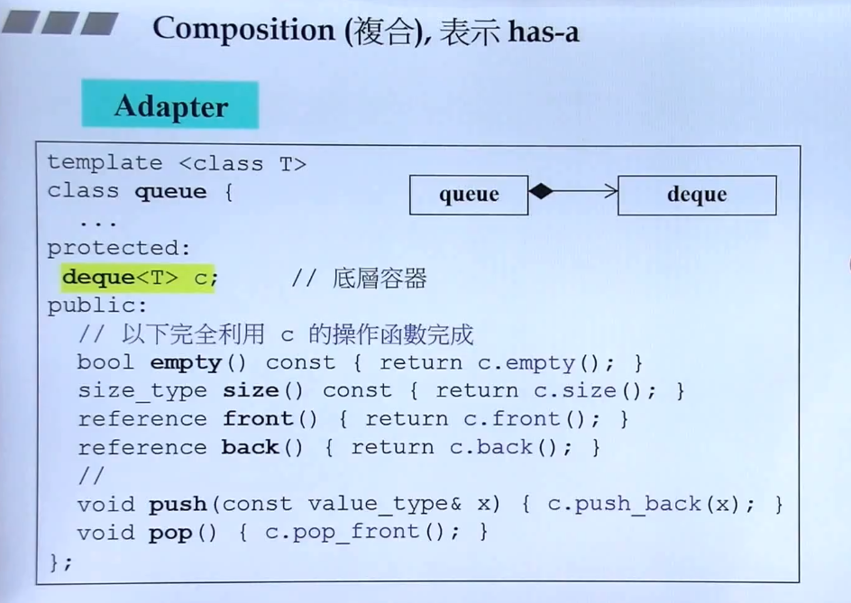
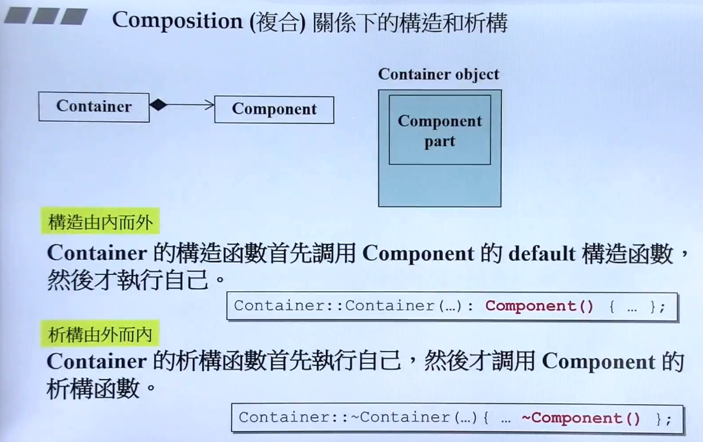
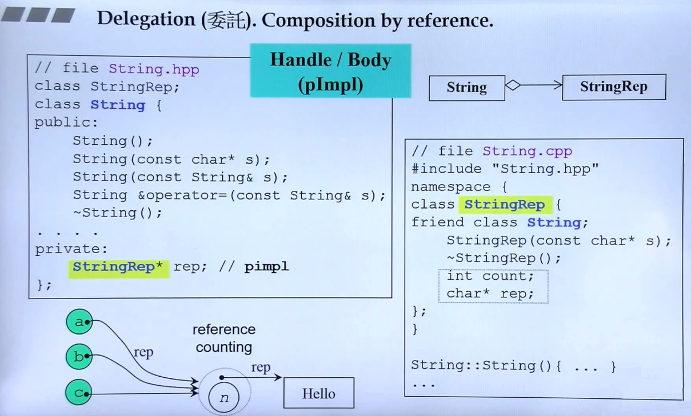
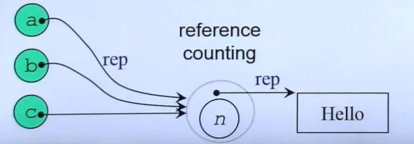
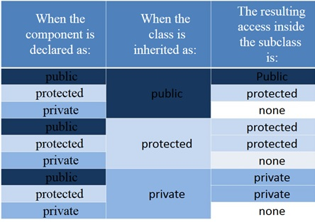
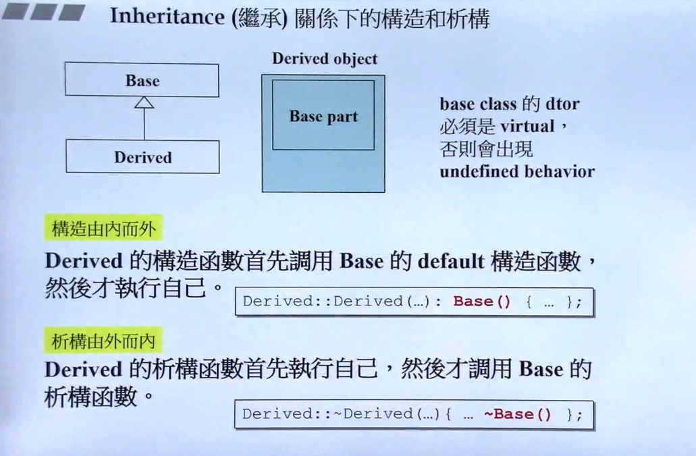
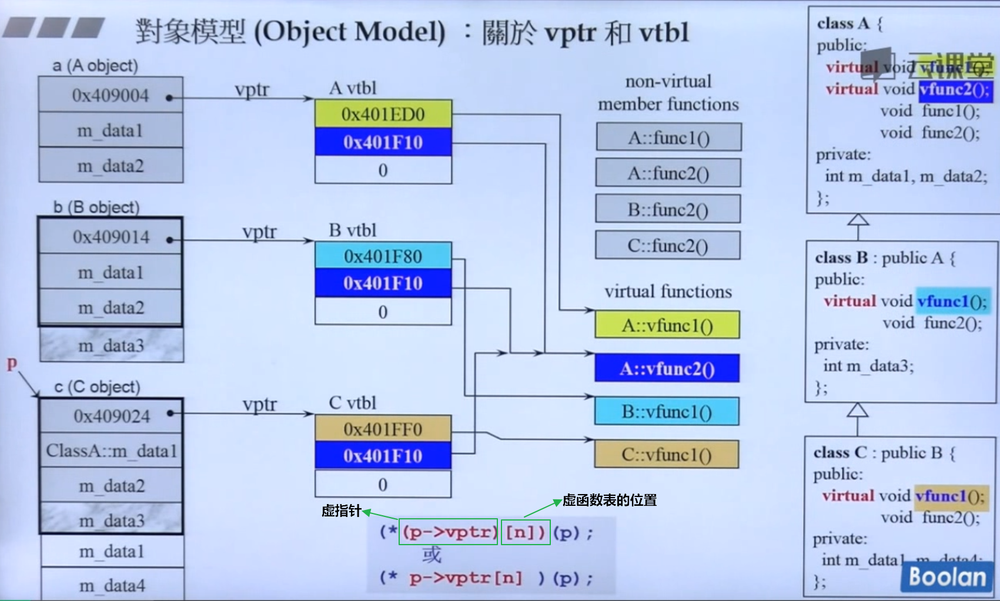
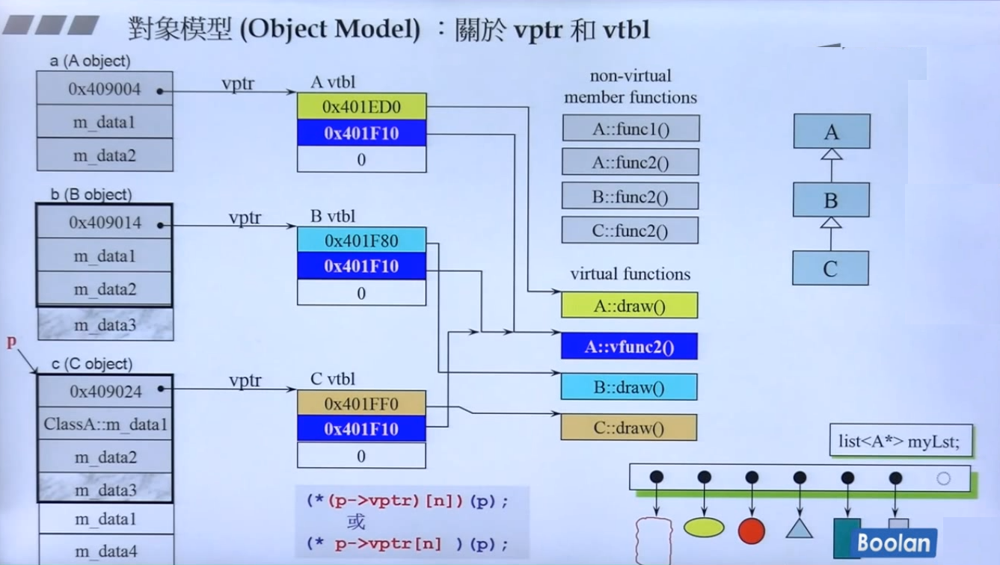
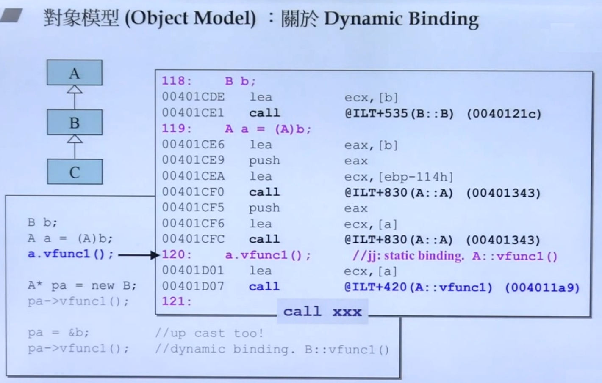
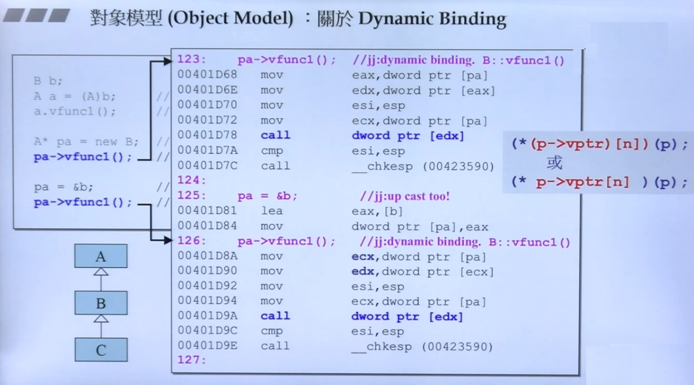

<!--

 * @Author: JohnJeep
 * @Date: 2020-06-15 08:48:16
 * @LastEditors: JohnJeep
 * @LastEditTime: 2025-04-04 19:25:54
 * @Description: C++ 高级
 * Copyright (c) 2022 by johnjeep, All Rights Reserved. 
-->

# 1. Object Oriented Programming(面向对象编程)

Object Oriented Programming(OOP)叫面向对象编程。

- class without pointer members：类中的成员不带有指针。
- class with pointer members：类中的成员带有指针。

## 1.1. Encapsulation(封装)

封装这个术语用来描述在过程接口后面隐藏实现细节的概念。

C++ 中对类的设计时，封装了属性和方法。若直接访问类的数据成员就违反了封装原则。设计原则应保持数据成员的私有性。

访问限定符

- `public`  修饰类的成员变量和函数，既能在 类的内部 使用又能在 类的外部 使用
- `private` 修饰类的成员变量和函数，只能在 类的内部 使用，不能在 类的外部 使用
- `protect` 修饰类的成员变量和函数，只能在 类的内部 使用，不能在 类的外部 使用，可以在 继承的子类 中使用。    

C++ 中类与类之间的关系主要归为三大类：复合、委托、继承。

## 1.2. Composition(复合)

什么是复合？

> 每当一个类的对象作为另一个类的成员变量时，就实现了复合。当一个类中包含(`has-a`)另一个类时，将其它类的对象作为当前类的成员使用，当前类的成员变量不再是简单的基础类型，而是变为复杂的其它类的对象。

<p></p>
```cpp
// queue类中包含deque类
Template <class T>
class queue {
  ...

  protected:
    deque<T> C;

  public:
    ...
};
```

内存角度理解复合中的构造与析构

- 构造（由内而外）：编译器默认先调用当前类中包含的类的默认构造函数，然后再调用当前类的构造函数。

- 析构（由外而内）：编译器默认先调用调用当前类的析构函数，然后再调用当前类中包含的类的析构函数。
  
  <p>
  
  </p>

> 类与类之间的生命周期两者是同步的。

## 1.3. Delegation(委托)

什么是delegation？

> 委托(delegation)也叫Composition by reference。两个类之间通过指针相连。

<p>
  
</p>

```cpp
// MyString类指向Stu类
class MyString
{
private:
    Stu* st;       // 采用委托的方式
public:
    MyString(/* args */) {}
    ~MyString() {}
};

class Stu
{
private:
    char* m_data;
    int n;
public:
    Stu(/* args */) {}
    ~Stu() {}
};
```

> 类与类之间的生命周期两者是不同步的。

### 1.3.1. copy on write

> MyString类对象的三个实例a，b, c 同时共享Stu类中的整数 `n`，指针 `rep` 指向数据 `hello`。如果实例 `a` 想要修改 `hello` 这个数据，则需要先拷贝一份，然后再修改拷贝的数据，这种实现的方法称为 `copy on write(写时复制)`

<p>
  
</p>

### 1.3.2. pImpl Idiom

PImpl（Pointer to implementation，指向实现的指针，也叫`handle/body`或者叫防火墙编译）是一种常用来对**类的接口与实现**进行解耦的方法。《Effective Modern C++》第四章 Iterm 22 条的对 `Pimpl Idiom` 的用法做了非常详细的解释说明。

这个技巧可以避免在头文件中暴露私有细节，是促进 API 接口与实现保持完全分离的重要机制。但是 `pImpl` 并不是严格意义上的设计模式（它是受制于 C++ 特定限制的变通方案），这种惯用法可以看作桥接设计模式的一种特例。

- 优点
  - 降低耦合。
  - 信息隐藏。
  - 降低编译依赖，提高编译速度。采用 Pimpl 风格，通过减少类的声明与实现之间的依赖关系来减少编译的时间。
  - 接口与实现分离。

《Effective Modern C++》中对  Pimpl Idiom 使用做出的建议：

- The Pimpl Idiom decreases build times by reducing compilation dependencies between class clients and class implementations.
- For std::unique_ptr pImpl pointers, declare special member functions in the class header, but implement them in the implementation file. Do this even if the default function implementations are acceptable. 
- The above advice applies to std::unique_ptr, but not to std::shared_ptr.

## 1.4. Inheritance(继承)

什么是Inheritance？

继承(inheritance)是面向对象软件技术当中的一个概念。如果一个类 B “继承自”另一个类 A，就把这个 B 称为 “ A 的子类”，而把 A 称为 “B的父类” 也可以称 “A是B的超类”。继承可以使得子类具有父类别的各种属性和方法，而不需要再次编写相同的代码。在令子类别继承父类别的同时，可以重新定义某些属性，并重写某些方法，即覆盖父类别的原有属性和方法，使其获得与父类别不同的功能。另外，为子类追加新的属性和方法也是常见的做法。 一般静态的面向对象编程语言，继承属于静态的，意即在子类的行为在编译期就已经决定，无法在运行期扩展。

C++中常见的三种继承方式：public、private、protected。也支持多继承的方式。

`public继承`  

- 父类成员在子类中保持原有的访问级别。
- 类的对象的公共数据成员可以使用直接成员访问运算符 `.` 来访问；但私有的成员和受保护的成员不能使用直接成员访问运算符 `.` 来直接访问。

`protected继承` 

- 父类中为 `public` 成员属性，在子类中变为 `protected`
- 父类中为 `protected` 成员属性，在子类中仍为 `protected`
- 父类中为 `private` 成员属性，在子类中仍为 `private`

`private继承` 

- 父类成员在子类中的访问级别都变为 `private`
  
  > 子类无法访问父类中 private 属性的成员。

public、protect、private 三个关键字的访问范围

- public: 能被类成员函数、子类函数、友元、类的对象访问。

- protected: 只能被类成员函数、子类函数及友元访问，不能被其它任何的数据访问，本身的类对象也没有访问权限。  
  
  - 为什么要引入 protected 访问权限？
    
    > 引入 protected 成员的理由：基类的成员本来就是派生类的成员，对于那些隐藏的、不宜设为公有的，但又确实需要在派生类的成员函数中经常访问的基类成员，则将它们设置为 protected 成员，既能起到 隐藏 的目的，又避免了派生类成员函数要访问它们时只能间接访问所带来的麻烦。 
  
  - 子类（派生类）的成员函数只能访问所作用的那个对象（即 this 指针指向的对象）的基类 protected 成员，不能访问其他基类对象的父类 protected 成员。  
    
    > 类的对象只能调用其 public 部分的成员，而不能调用 protected 和 private 部分的成员。

- private: 只能被类成员函数及友元访问，不能被其它任何的数据访问，本身的类对象也没有访问权限。

三种继承之间的关系用一张表来清楚的表示



子类（派生类）可以从父类（基类）继承哪些方法和成员?

- 数据：子类继承的是父类内存中的数据。
- 函数：从内存的角度去看待，子类函数继承的是父类的调用权，而不是父类的内存大小。
- 子类不能继承父类中以下几种的数据
  - 基类的构造函数、析构函数和拷贝构造函数。
  - 基类的重载运算符。
  - 基类的友元函数。

如何判断继承中的访问控制权限

- 看类的调用语句，是在类的内部还是在类的外部？
- 看子类如何从父类中继承？
- 看父类的访问级别？ 

### 1.4.1. 父类与子类的关系

- 子类是特殊的父类。

- 基类(base)的指针或引用 `直接指向` 子类(derived)的对象。
  
  - 指针做函数参数
    
    ```cpp
    class Parent
    {}
    
    class Child
    {}
    
    Parent *p1 = NUll;
    Child c1;
    p = &c1;     // 父类的指针直接指向子类的对象
    ```
  
  - 引用做函数参数

- 子类对象直接`初始化` 父类对象。

- 子类对象直接 `赋值` 给父类对象。

- 子类对象可以 `当做父类对象使用`。

### 1.4.2. 继承中的构造与析构调用原则

<font color=red>
内存角度探讨调用原则
</font>

- 构造：由内而外。先调用 base (父类)的默认构造函数，然后才执行自己。
- 析构：由外而内。先执行自己，然后再调用 base(父类)的析构函数。



### 1.4.3. 继承中同名成员变量处理方法

子类与父类中的成员变量和成员函数有相同的名称时，采用作用域的方式调用。

```cpp
class Parent
{
public:
    int m;
    void shoe();
}

class child
{
public:
    int m;
    void shoe();
}

Parent p1;
Child c1;

// 调用
p1.Parent::m = 100;
c1.Child::m = 200;
p1.Parent::shoe();
c1.Child::shoe();
```

### 1.4.4. Composite, Inheritance, Delegation 对比

- 继承
  
  - 类继承允许你根据其他类的实现来定义一个类的实现。在继承方式中，父类的内部细节对子类可见。
  - 类继承是在编译时刻静态定义的，且可直接使用，因为程序设计语言直接支持类继承。类继承可以较方便地改变被复用的实现。当一个子类重定义一些而不是全部操作时，它也能影响它所继承的操作，只要在这些操作中调用了被重定义的操作。
  - 类继承也有一些不足之处。首先，因为继承在编译时刻就定义了，所以无法在运行时刻改变从父类继承的实现。更糟的是，父类通常至少定义了部分子类的具体表示。因为继承对子类揭示了其父类的实现细节，所以继承常被认为“破坏了封装性”。子类中的实现与它的父类有如此紧密的依赖关系，以至于父类实现中的任何变化必然会导致子类发生变化。
  - 使用继承时，被继承的操作总能引用接受请求的对象，C++ 中通过 this 成员变量。委托方式为了得到同样的效果，接受请求的对象将自己传给被委托者（代理人），使被委托的操作可以引用接受请求的对象。

- 组合
  
  - 对象组合要求被组合 的对象具有良好定义的接口，对象的内部细节是不可见的。  
  - 对象组合是通过获得对其他对象的引用而在运行时刻动态定义的。组合要求对象遵守彼此的接口约定，进而要求更仔细地定义接口，而这些接口并不妨碍你将一个对象和其他对象一起使用。这还会产生良好的结果：因为对象只能通过接口访问，所以我们并不破坏封装性；只要类型一致，运行时刻还可以用一个对象来替代另一个对象；更进一步，因为对象的实现是基于接口写的，所以实现上存在较少的依赖关系。
  - 优先使用对象组合有助于你保持每个类被封装，并被集中在单个任务上。这样类和类继承层次会保持较小规模，并且不太可能增长为不可控制的庞然大物。另一方面，基于对象组合的设计会有更多的对象 (而有较少的类)，且系统的行为将依赖于对象间的关系而不是被定义在某个类中。

- 委托
  
  - 委托(delegation)是一种组合方法，它使组合具有与继承同样的复用能力。在委托方式下，有两个对象参与处理一个请求，接受请求的对象将操作委托给它的代理者(delegate)。类似于子类将请求交给它的父类处理。
  - 优缺点
    - 优点：便于运行时刻组合对象操作以及改变这些操作的组合方式。
    - 缺点： 动态的、高度参数化的软件比静态软件更难于理解。还有运行低效问题，不过从长远来看人的低效才是更主要的。只有当委托使设计比较简单而不是更复杂时，它才是好的选择。要给出一个能确切告诉你什么时候可以使用委托的规则是很困难的。因为委托可以得到的效率是与上下文有关的，并且还依赖于你的经验。

### 1.4.5. Inheritance and virtual function

在 C++ 中，在基类的成员函数声明前加上关键字 virtual 即可让该函数成为 虚函数，派生类中对此函数的不同实现都会继承这一修饰符，允许后续派生类覆盖，达到迟绑定的效果。

为什么会有虚继承

- 解决多个继承可能产生的二义性。 
- 二义性：若果一个派生类（子类）由多个基类（父类）继承，这些基类都有一个共同的基类，则在对该基类中声明的变量进行访问时，可能会出现二义性。

为什么要用虚函数

- 相同的接口，实现不同的功能。
- 有了虚函数，程序能够调用编译期还不存在的函数。
- 虚函数是动态生成的，普通成员函数是静态生成的。  

几种混淆的 virtual function

- non-virtual: 不希望子类（derived）重写。
- virtual: 希望子类重写（override）父类，父类已有默认值。
- pure-virtual: 子类（derived）中必须重写(override)父类，父类没有默认值。

## 1.5. Polymorphism(多态)

多态(polymorphism)指为不同数据类型的实体提供统一的接口。

实现多态的三个条件

1. 要有继承
2. 子类中有虚函数重写
3. 父类指针或引用指向子类的对象。

多态实现的效果：同一种调用语句，有多种表现形态。

链编(bind)：一个程序模块，代码之间相互关联的过程。

- 静态链编：程序的匹配、链接的过程在编译阶段中实现。重载函数使用的是静态链编。
- 动态链编：程序的匹配、链接的过程在运行时实现。switch、if 语句都是采用的动态链编。

多态的内部原理探究

- 当类中声明虚函数时，编译器自动创建了一个虚函数表，每个类的对象都有一个虚函数表。
- 虚函数表：存储多个虚函数的开始地址。虚函数表由编译器自动创建和维护。
- 有 `virtual` 关键字的成员函数会被编译器放入虚函数表中。
- 存在虚函数时，用类实例化一个对象的过程中，C++编译器会在类的对象中添加一个 `vptr` 指针，每个对象中都有一个指向虚函数表的 `vptr` 指针。
- 通过虚函数表的虚指针 `vptr` 调用重写函数是在程序运行时进行的，需要通过寻址操作才能确定调用的是哪个函数。
- 虚函数的效率比普通成员的效率要低。因为函数所有的调用都是动态绑定的，只有在运行的时候，才知道具体调用哪个。

### 1.5.1. 虚函数

虚函数注意点

- 静态函数没有虚函数，内联函数不可能是虚函数，构造函数不能是虚函数。
- 抽象类不能实例化对象，可以声明抽象类的指针。
- 抽象类不能作为函数的参数类型。 `void fg(People)  // error, People为抽象类`
- 抽象类不能作为函数返回的类型。`People eat();  // error，People为抽象类`
- 抽象类可以声明类的引用。`People& run(People&); // People为抽象类`

继承与虚函数在工程中的应用

- 由于多继承的二义性，很少使用多继承，一般采用单继承。
- C++ 中没有真正的类似Java中接口的方法，但可以使用虚继承来模拟接口的方法。
- 虚继承中可以使用多继承的方式，来实现复杂的业务。

### 1.5.2. 纯虚函数

```cpp
// 语法
virtual int func() = 0;
```

含有纯虚函数的类叫抽象类。在父类中只定义一套通用的接口，在子类中去实现。

```cpp
// 抽象类
class People
{
private:
  ....
public: 
  ....

virtual int func(int a) = 0;
}
```

### 1.5.3. 虚析构函数

为什么要虚析构函数？

通过父类指针将子类的所有资源都释放，即把子类的所有析构函数都执行一遍。

```cpp
// 函数格式
virtual ~People()
{
}
```

### 1.5.4. vptr(虚指针)和vtbl(虚函数表)

**虚表指针（vptr）**：每个含有虚函数的类（或者从含有虚函数的类派生）的对象都会有一个虚表指针，该指针指向该类的虚函数表。存在于每个对象的内存布局中。

**虚函数表（vtable）**：每个类（而不是每个对象）有一个虚函数表，该表是一个函数指针数组，存放该类中所有虚函数的地址。如果子类重写了虚函数，则子类的虚函数表中对应位置会替换为子类的函数地址。

```cpp
class Base {
public:
    virtual void func1() { cout << "Base::func1" << endl; }
    virtual void func2() { cout << "Base::func2" << endl; }
    int data;
};

// 内存布局示意：
// 对象内存: [vptr] [data]
//           ↓
//           vtable: [&Base::func1] [&Base::func2]
```

vtable 注意点

1. 虚表是属于类的，而不是属于某个具体的对象。
2. **一个类只有一张虚表，同一个类的所有对象都共享同一张虚表。**
3. 当一个类被实例化为多个对象时，每个对象都会有自己的虚表指针（vptr），但是这些虚表指针都指向同一个虚函数表（vtable）。
4. **虚表是一个指针数组，每个元素对应一个虚函数的函数指针。存储该类所有虚函数的函数指针**
5. 在编译时生成，存在于程序的只读数据段。





构造函数中调用虚函数


函数的静态绑定



函数的动态绑定




普通的函数不是虚函数，其调用并不需要经过虚表，所以**虚表的元素并不包括普通函数的函数指针。虚函数指针的赋值发生在编译器的编译阶段，即代码在编译阶段，虚表就构造出来了。**

 虚函数调用需要额外的指针间接寻址，需要一定的性能开销。

结论：多态是实现框架的基础。在使用框架结构去设计程序的时候，常常结合 `Template Method` 和其它的设计模式去实现。C++通过虚函数表，实现了虚函数与对象的动态绑定，从而构建了C++面向对象程序设计的基石。


## 1.6. 耦合与解耦

- C++中采用抽象类，提前布局 `vptr` 指针，虚函数表，调用动态链编，实现与第三方产品的解耦合。
- 动态库-----函数的首地址----调用函数指针----调用函数
- 常常采用函数指针将任务的调用者与任务的实现者进行分开，两者互不依赖。  

## 1.7. Aggregation: 聚合

聚合意味着一个对象拥有另一个对象或对另一个对象负责。一般我们称一个对象包含另一个对象或者是另一个对象的一部分。聚合意味着聚合对象和其所有者具有相同的生命周期。

C++中，聚合可以通过定义表示真正实例的成员变量来实现，但更通常的是将这些成员变量定义为实例指针或引用。

## 1.8. Acquaintance: 相识

相识意味着一个对象仅仅知道另一个对象。有时相识也被称为“关联”或“引用”关系。相识的对象可能请求彼此的操作，但是它们不为对方负责。相识是一种比聚合要弱的关系，它只标识了对象间较松散的耦合关系。

通过指针或引用来实现。 

聚合关系使用较少且比相识关系更持久；而相识关系则出现频率较高，但有时只存在于一个操作期间，相识也更具动态性，使得它在源代码中更难被辨别出来。

## 1.9. References

- [Stack Overflow: Difference between private, public, and protected inheritance](https://stackoverflow.com/questions/860339/difference-between-private-public-and-protected-inheritance)
- [Public, Protected and Private Inheritance in C++ Programming](https://www.programiz.com/cpp-programming/public-protected-private-inheritance)
- [C++：继承访问属性（public/protected/private）](https://www.cnblogs.com/duwenxing/p/7476469.html) 


