<!--
 * @Author: JohnJeep
 * @Date: 2021-01-10 18:25:09
 * @LastEditors: JohnJeep
 * @LastEditTime: 2025-04-15 18:18:19
 * @Description: cpp STL learning
 * Copyright (c) 2025 by John Jeep, All Rights Reserved. 
-->

# 1. Thinking(思考)

---------------------------

使用它是一件很愉快的事。

使用一个东西，却不明白它的道理，不高明！---林语堂

源码之前了无秘密。

天下大事，必作于细。

高屋建瓴，细致入微。

所谓剖析源码，其目的在于明理、解惑，提高自身水平，并不是要穷经皓首，倒背如流。

---------------------------

STL学习境界：会用，明理，能扩展。

- 会用：熟练使用 STL 的各种 API 接口。
- 明理：明白 STL 设计的思想，各种 API 的底层实现原理。
- 能扩展：对 STL 添加自己实现的各种接口，扩充 STL 的功能。 

---------------------------

目标

Level 0: 使用C++标准库

Level 1: 深入认识C++标准库(胸中自有丘壑)

Level 2: 良好使用C++标准库

Level 3: 扩充C++标准库

---------------------------

源码版本：GNU 2.91, GNU 4.9

---------------------------

# 2. History(历史)

C++创始人：比尼亚·斯特鲁斯特鲁普（Bjarne Stroustrup）

STL创始人：Alexander Stepanov(亚历山大·斯蒂芬诺夫)

GPL(General Public licence): 广泛开放授权。使用者可以自由阅读与修改GPL软件的源代码，但如果使用者要传播借助GPL软件而完成的软件，他们必须也同意GPL规范。这种精神主要是强迫人们分享并回馈他们对GPL软件的改善。得之于人，舍于人。

# 3. STL(Standard Template Library)标准模板库

Generic Programming(泛型编程): 操作(operations)使用相同的接口，但是其类型(type)不相同，即使用模板(template)将泛型操作公式化。其中STL是泛型编程(GP)最成功的一个作品。

- STL所实现的是依据泛型思维架设起来的概念结构。STL的核心思想：算法和数据结构的实现是分离的。

- STL六大部件
  
  - 算法 (Algorithm)
  - 容器 (Container）
  - 迭代器 (Iterator)
  - 仿函数 (Functor)
  - 适配器 (Adaptor)
  - 分配器 (Alloctor)

从语言实现的层面分析，Algorithm 采用 function template 实现的，而 Container、Iterator、Functor、Adaptor、Alloctor 都是采用 class template 实现的。

- **六大部件之间的关系**
  
  - Container 通过 Allocator 取得数据存储的空间；
  
  - Algorithm 通过 Iterator 访问 Container 中的内容，Container 与 Algorithm 之间不能直接访问，需要借助 iterator，可以把 Iterator 看做是算法与容器之间沟通的桥梁；
  
  - Functor 协助 Algorithm 完成不同的策略变化；
  
  - Adaptor 修饰或套接 Functor；
    
    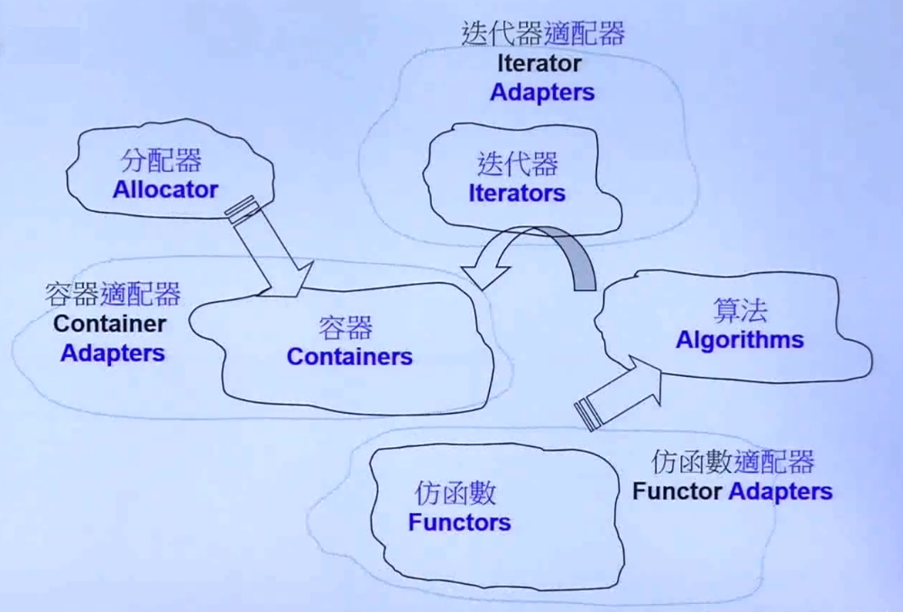

使用六大部件的例子

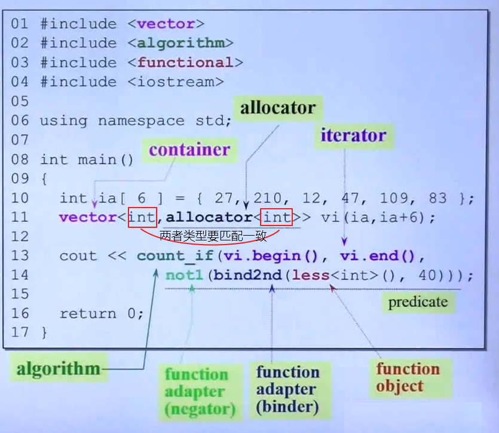

常用的容器

- Vector(向量)
- Deque(双队列)
- List(链表)
- Map/Multimap(映射/多重映射)
- Set/Multiset(集合/多重集合)


# 4. Container(容器)

容器是一个一个的类模板 (class template)，里面放的是元素。

STL标准库中 **容器**** 内存储的元素都必须能够拷贝，而 C++ 编译器默认提供的是浅拷贝，程序在执行时，则会出现问题。因此需要 **重写构造函数** 和重载 **=** 操作运算符，执行深拷贝。

## 4.1. Sequence containers(有序容器)

### 4.1.1. Array(数组)

Array 是 C++11 标准之后新增的一个容器，表示固定数量的元素(fixed number of elements)。为了模拟数组的相关特性。

其内部结构如下图所示

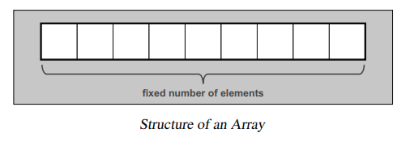

Array会把元素复制到其内部的 static C-style array中。这些元素总是拥有一个明确次序。因此 array 是一种有序(ordered)集合。Array允许随机访问，也就是你可以在常量时间内直接访问任何元素，前提是你知道元素位置。Array的迭代器属于随机访问（random-access)迭代器，所以你可以对它运用任何 STL 算法。

如果你需要一个有固定元素量的序列，`classarray<>` 将带来最效能，因为内存被分配下stack中（如果可能的话），绝不会被重分配(reallocation)，而且你拥有随机访问能力。

**注意点：**STL 源码中实现，没有构造和析构函数。

#### 4.1.1.1. 优点

支持 `[]` 和 `at()` 操作。`at()` 函数带范围检查，超出范围，就会抛出 `range-error`异常；而 `[]` 操作是不做范围检查的。 

#### 4.1.1.2. 缺点

- 不能扩容。
- Array 不允许你指定分配器(Allocator)。

#### 4.1.1.3. 源码分析

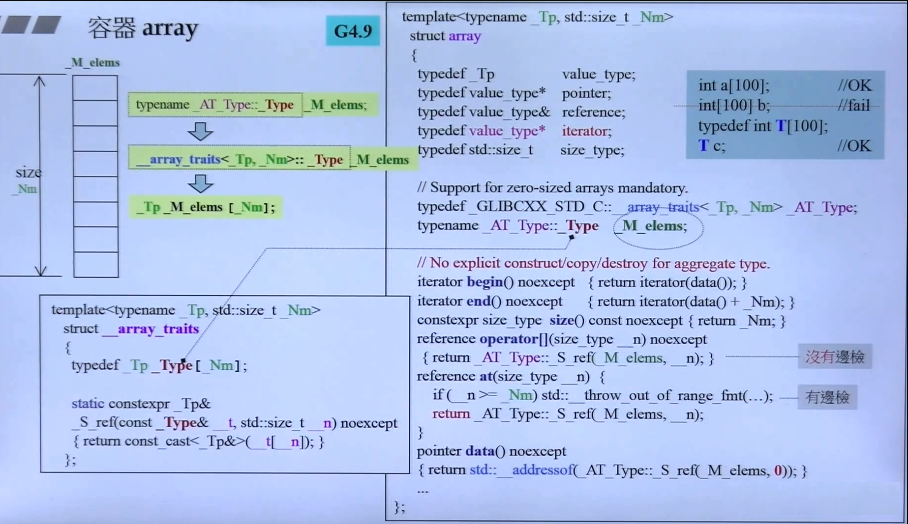

### 4.1.2. vector(单端的动态数组)

vector 是 C++ 标准模板库中的部分内容，它是一个多功能的，能够操作多种数据结构和算法的模板类和函数库。vector 之所以被认为是一个容器，是因为它能够像容器一样存放各种类型的对象，简单地说 vector 是一个能够存放任意类型的动态数组，能够增加和压缩数据。

动态数组实现机制：

> 先为数组开辟较小的空间，然后往数组里面添加数据，当数组中元素的数量超过数组的容量时，重新分配一块更大的空间（STL 中 `vector` 每次扩容时，新的容量都是前一次的两倍），再把之前的数据复制到新的数组中，再把之前的内存释放。


发生内存的重分配（realloc）操作通常有 4 个步骤

1. 分配一个新的内存块，它是容器当前容量的一些倍数，常常为 2 倍。
2. 将容器旧内存中的所有元素复制到新内存中。
3. 销毁旧内存中的对象（object）。
4. 销毁（Deallocate）旧内存。

<font color=red> 注意：</font>

- 使用动态数组时，尽量减少改变数组容量大小的次数，可以减少时间性能的消耗。 一般每次扩容为原来的  2 倍。
- 当 vector 扩容时，会调用 `move constructor` 和 `move destructor`，并且移动构造和移动析构函数在执行期间不会抛出异常，是用 `noexcept` 关键字修饰。因为它不能确保异常发生后，移动构造和移动析构函数还能满足标准库的要求，所以是禁止抛异常的。
- <font color=red> 标准库中成长型的容器（需要发生 memory reallocation）有：`vector` 、`deque`、`string`。</font>

内部结构图

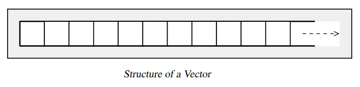


#### 4.1.2.1. API接口

- `size()`: 返回容器中元素的个数
- `get(r)`: 获取索引为 r 的元素
- `put(r, e)`: 用 e 替换索引为 r 元素的数值
- `insert(r, e)`: 向索引为 r 的元素处插入数值 e，后面元素依次后移
- `remove(r)`: 移除索引为 r 的元素，返回全元素中原存放的对象
- `disordered()`: 判断所有元素是否已按升序序排列
- `sort()`: 调整各元素癿位置，使按照升序序排列
- `deduplicate()`: 删除重复元素   ---向量
- `uniquify()`: 删除重复元素 ---有序向量
- `traverse()`: 遍历向量幵统一处理所有元素，处理斱法由函数对象指定
- `empty()`: 判断容器是否为空
- `at(index)`: 返回索引为 index 的元素
- `erase(p)`: 删除指针p指向位置的数据，返回下指向下一个数据位置的指针（迭代器）
- `erase(beg, end)`:删除区间`[beg, end)`的数据
- `pop_back()`: 删除最后一个元素
- `push_back()`: 在容器末尾插入一个元素
- `back()`: 获取尾部元素
- `front()`: 获取首部元素
- `begin(), end()`: 返回容器首尾元素的迭代器
- `clear()`: 移除容器中所有的元素
- `swap()`: 交换两个容器的内容，交换两个 vector 的内容后，两者的容量也交换了，**这是一个间接缩短 vector的小窍门。**
- `shrink_to_fit()`: 缩短 vector 的大小到合适的空间，为实现特定的优化保留了回旋的余地。
- `resize(size_t n)`: 强制容器将其容纳的元素数更改为 n。
  - 若 n 小于当前容器的 size，原容器里超过 n 后面的值被销毁。
  - 若 n 大于当前容器的 size，容器里超过 size 后面的内容，编译器将默认构造函数中的数据写入到容器里面。
  - 若 n 大于当前容器的 capacity ，向容器中增加元素之前会发生 `reallocation`。
- `reserve(size_t n)`: 强制将容器的容量重新设置为 n。
  - 若 n 大于当前容器的 capacity，发生 `reallocation`。
  - 若 n 小于当前容器的 capacity，`vector` 忽略调用，什么也不会做；string 会将其容量减少到 `size ()`和 n 的最大值，但 string 的大小（size）肯定保持不变。

#### 4.1.2.2. 优点

- 不指定一块内存大小的数组的连续存储，即可以像数组一样操作，但可以对此数组进行动态操作，运行阶段执行。
- 随机访问快，支持随机迭代访问器。即支持 `[]` 操作符和 `at()`操作。
- 节省空间。

#### 4.1.2.3. 缺点

- 向容器中插入元素时，内部的元素必须能够执行 `拷贝（必须提供拷贝构造）` 操作。
- 在内部进行插入删除操作效率低。
- 只能在vector的最后进行push和pop，不能在vector的头进行push和pop。
- 当动态添加的数据超过vector默认分配的大小时要进行整体的重新分配、拷贝与释放。

#### 4.1.2.4. 源码分析

GNU 2.9版源码UML图

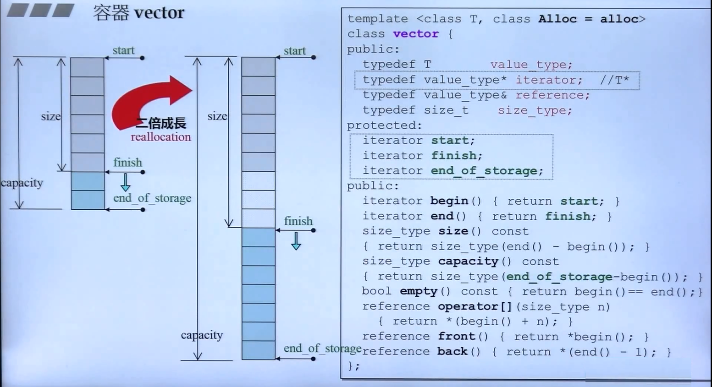

GNU 4.9版源码UML图

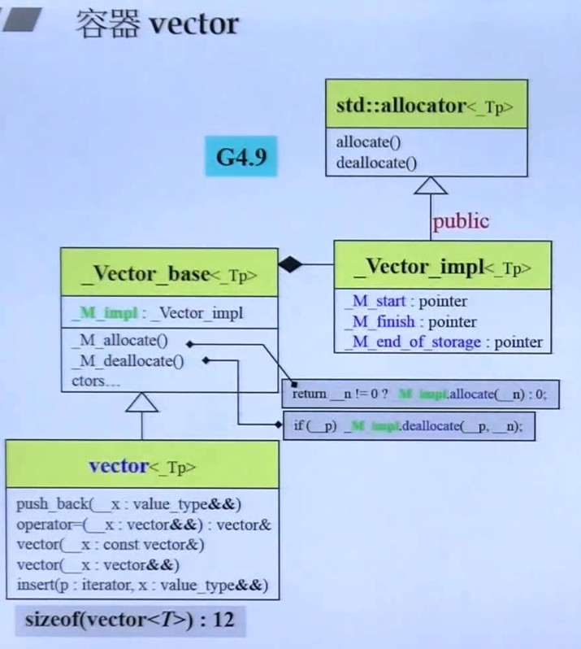

**Vector类与其基类之间的关系**

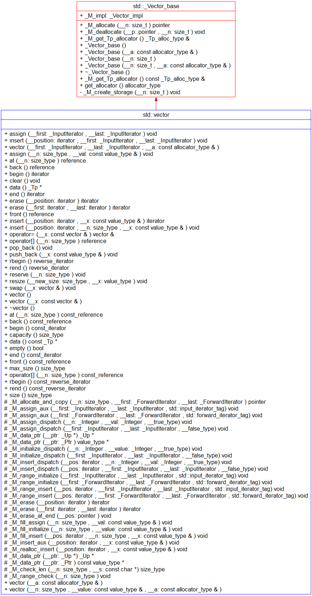

**Vector_base内部类与其它类之间的关系**

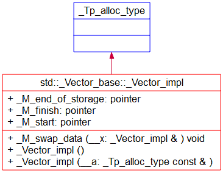

**迭代器之间的关系**

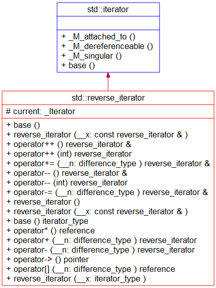

### 4.1.3. deque(双端数组)

deque 是在功能上合并了 vector 和 list。与 `vector` 容器类似，但是可以在 `Deque` 的两端进行操作。

deque 的内部结构图如下

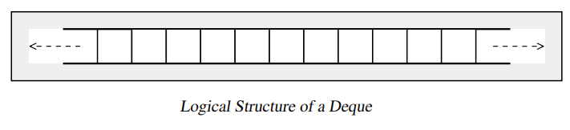

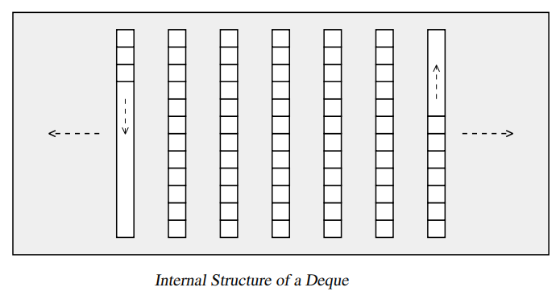

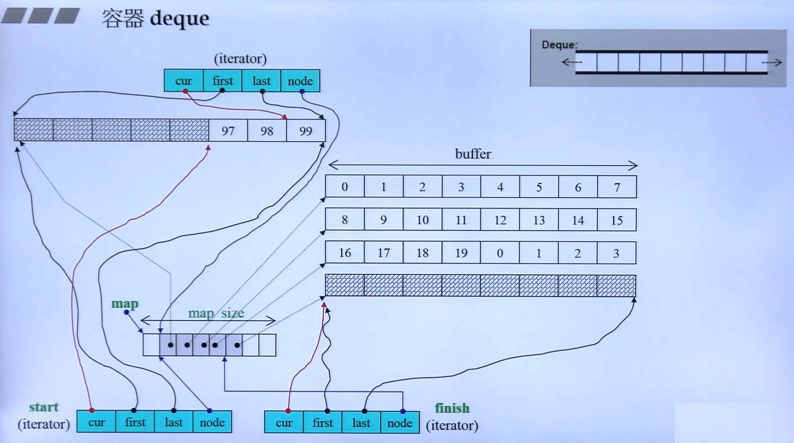

#### 4.1.3.1. API接口

- `push_back()`: 在容器末尾插入一个元素
- `push_front()` 容器头部插入一个元素
- `pop_front()`: 容器头部删除一个元素
- `pop_back()`: 删除最后一个元素

#### 4.1.3.2. 优点

- 支持随机访问，即支持 `[]`操作符和 `at()`。
- 在内部方便的进行插入和删除操作。
- 可在两端进行 push、pop。

#### 4.1.3.3. 缺点

- 每次扩容的大小为一个 buffer。
- 占用内存多，采用多个内存区块来存储元素。

### 4.1.4. list(双向链表)

list是一个双向链表的容器，可以高效的进行 **插入** 和 **删除** 元素。每一个结点都包括一个信息快 Info、一个前驱指针 Pre、一个后驱指针 Post。可以不分配固定的内存大小，方便的进行添加和删除操作，使用的是非连续的内存空间进行存储。

#### 4.1.4.1. list insert

链表的插入操作：在 pos 位置插入新的节点，新插入的数据存放在 pos 位置之前。

#### 4.1.4.2. list delete

- `clear()` 移除容器中所有的数据
- `erase(begin, end)` 删除区间 `[begin, end)` 的数据，返回下一个元素的位置。
- `erase(pos)` 删除指定 pos 位置的数据，返回下一个元素的位置。
- `remove(element)` 删除容器中所有与 element 值匹配的数据。 

#### 4.1.4.3. 内部结构图

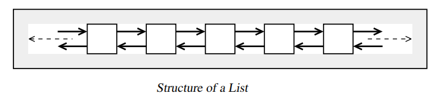

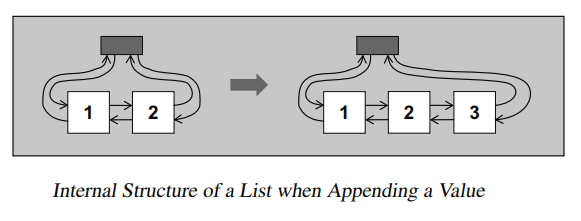

#### 4.1.4.4. 优点

- 不使用连续内存完成动态操作。
- 在内部方便的进行插入和删除操作
- 可在两端进行push、pop

#### 4.1.4.5. 缺点

- 每次只能扩充一个结点，效率低，但空间浪费是最小的。
- 不能进行内部的随机访问，即不支持 `at.(pos)` 函数和 `[]` 操作符。
- 相对于verctor占用内存多。

#### 4.1.4.6. API接口

#### 4.1.4.7. 源码分析

```cpp
    _Self&
    operator++() _GLIBCXX_NOEXCEPT      // 前置++
    {
_M_node = _M_node->_M_next;             // 移动结点
return *this;
    }

    _Self
    operator++(int) _GLIBCXX_NOEXCEPT   // 后置++
    {
_Self __tmp = *this;                    // 记录原值
_M_node = _M_node->_M_next;             // 执行操作
return __tmp;                           // 返回原值，执行的是拷贝构造
    }
```

通过两者传入的参数值不同来区分是前置++还是后置++。

**```_M_node = _M_node->_M_next;``` 这一行为++操作的具体实现过程：**

> 移动结点。过程：将当前结点next域的值取出来赋给_M_node，而_M_node本身指向当前的结点，_M_node->_M_next 指到下一个结点的prev域。此时_M_node 与_M_node->_M_next指向的内容是一样的，所以把_M_node移动到 _M_node->_M_next 指向的位置，这一过程就是结点的++操作。

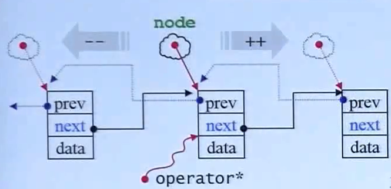

**思考：为什么前置++与后置++两者的返回值是不一样的？**

> 为了与整数的 ++ 操作保持一致，操作运算符重载持有的操作应该向整数的操作看起，拥有类似的功，保证不能进行两次的 ++ 运算操作。

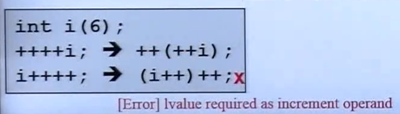

源码中list的UML图分析

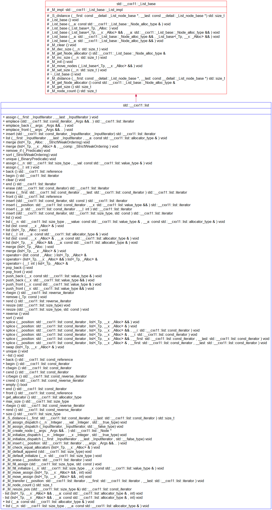

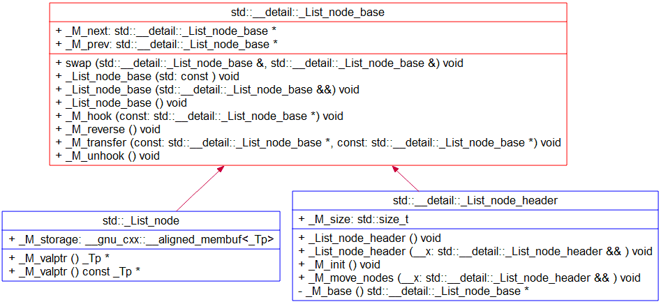

### 4.1.5. forword list(单向链表)

`forword list` 链表是 C++11 新加的功能，比 `list` 的效率要快，是单向的链表。

使用 `forword_list`，必须添加头文件 `#include <forword_list>`。头文件中 forward list 是命名空间 std 内的 `class template` 。

```cpp
namespace std {
    template <typename T,
              typename Allocator = allocator<T> >
    class forward_list;
}
```


#### 4.1.5.1. 内部结构图

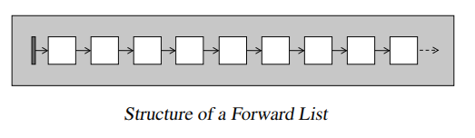

#### 4.1.5.2. API 接口

- `insert()`
- `front()` 返回容器中的第一个元素，但并不检查是否存在第一元素。

#### 4.1.5.3. 优缺点

1. 优点
   - 内存占用量比 list 少，运行速度（runtime）略快。
2. 缺点
   - 扩容是时，只能扩充一个结点。

#### 4.1.5.4. 注意点

forword list 不提供 `size()`操作。原因是不可能在固定的时间内存储或计算当前元素的数量。同时也反应出 `size()` 是一个费时间的操作。若必须要计算元素的个数，可用 `distance()` 函数。

```cpp
$include <iostream>
#include <forward_list>
#include <iterator>
    
int main () 
{
    std::forward_list<int> l;

    std::cout << "l.size(): " << std::distance(l.begin(),l.end())
    << std::endl;
}
```


#### 4.1.5.5. 源码分析

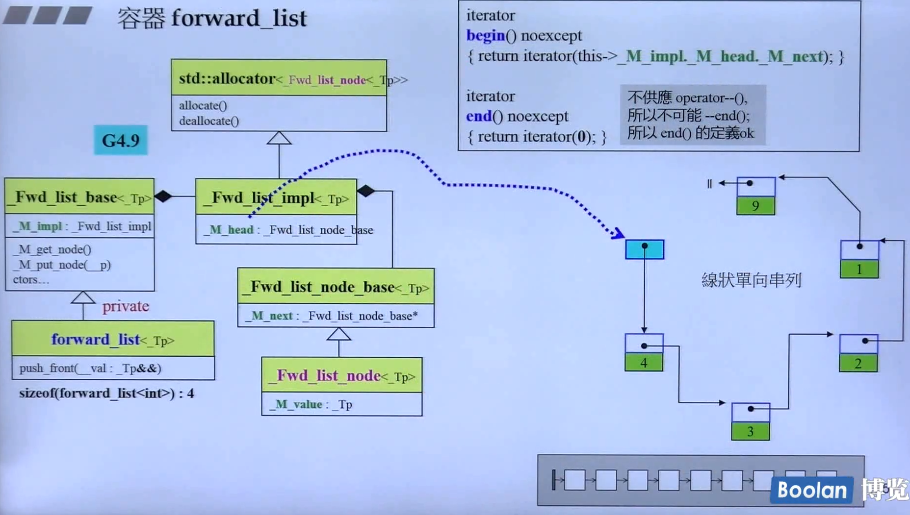

## 4.2. Associative containers(关联性容器)

关联式容器并不提供元素的直接访问，需要依靠迭代器访问。map 是个例外，提供了subscript(下标)操作符，支持元素的直接访问。

### 4.2.1. set

set 是一个 `集合` 容器，包含的元素是唯一的，集合中的元素按照一定的顺序排列，不能随意指定位置插入元素。

#### 4.2.1.1. 内部结构图

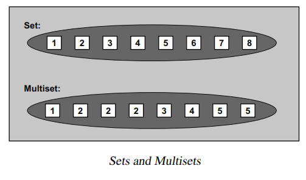

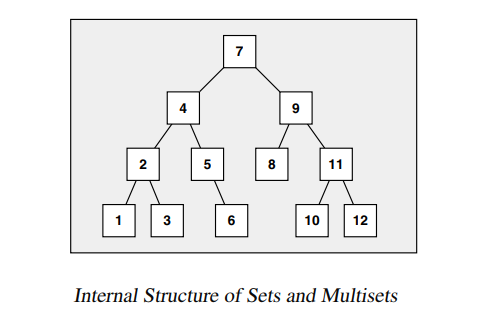

#### 4.2.1.2. API 接口

- `insert()` 函数的返回值类型为 `pair<iterator, bool>`，结果是一对数据类型。
  
  ```cpp
  pair<T1, T2> 存放两个不同类型的数值
  ```

- set 查找接口
  
  - `find()` 返回查找元素的迭代器，查找的元素默认是区分大小写的。
  - `count()` 返回容器中查找元素的个数
  - `upper_bound` 返回容器中大于查找元素的迭代器位置
  - `lower_bound` 返回容器中小于查找元素的迭代器位置
  - `equal_range(ele)`返回容器中等于查找元素的两个上下限的迭代器位置（第一个：大于等于ele元素的位置，第二个：大于 ele元素的位置）

#### 4.2.1.3. 优点

#### 4.2.1.4. 缺点

### 4.2.2. multiset

multiset 也是一个容器集合，但它支持容器中的 key 可以重复。

### 4.2.3. set 与 multiset 对比

- set 与 multiset 底层都是采用红黑树的数据结构实现的。
- set 支持唯一的键值，容器里面的元素值只能出现一次，而 `multiset` 集合容器中同一个元素值可以出现多次。
- 不可以直接修改 set 和 multiset 集合容器中元素的值，因为集合容器是自动排序的。修改集合容器中元素的值，必须先删除原先元素的值，再插入新元素的值。

### 4.2.4. map

map 是关联式容器，一个 map 就是一个键值对。map 中的 `key` 值唯一，容器中的元素按照一定的顺序排列，不能在任意指定的位置插入元素。

#### 4.2.4.1. map与multimap内部结构图

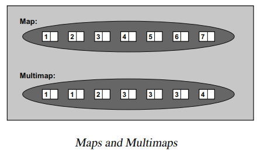

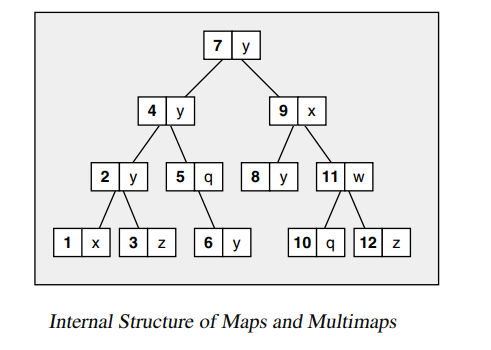

#### 4.2.4.2. map insert

```cpp
// 四种map容器的插入方法
map<int, string> mp;
mp.insert(pair<int, string>(101, "赵云"));                   // 法一
mp.insert(make_pair<int, string>(102, "关羽"));              // 法二
mp.insert(map<int, string>::value_type(103, "曹操"));        // 法三
mp[104] = "张飞";                                            // 法四

// 方法一到方法三向容器中插入相同的键值时，不会插入成功。
// 采用法四向容器中插入相同的键值时，会覆盖原先相同键值的数据。
```

<font color=red>注意:</font> 

- map的查找操作需要做异常判断处理
- key 与 value 两个值必须是可拷贝的(copyable)和可移动的(movable)。
- 指定的排序准则下，key 必须是可比较的(comparable)。

#### 4.2.4.3. at() && []

- `at()` 函数会根据它收到的 `key` 得到元素的 `value`，如果不存在这样的元素，则抛出 `out_of_range` 异常。
- `operator []`
  - `operator []` 的索引就是 `key`，其类型可能属于任何的类型，不一定是整数。
  - 如果你选择某 `key` 作为索引，容器内没有相应的元素，那么 map 会自动安插一个新元素，其 value 将被其类型的 default 构造函数初始化。因此你不可以指定一个 `不具 default 构造函数的 value 类型`。一般基础类型都有一个 `default 构造函数`，设初值为 `0`。

#### 4.2.4.4. 优点

插入键值的元素不允许重复，只对元素的键值进行比较，元素的各项数据可以通过 key 值进行检索。 

#### 4.2.4.5. 缺点

### 4.2.5. mutimap

multimap (collection of key-value pairs, sorted by keys.)

### 4.2.6. map 与 multimap 对比

- map 的底层原理是按照平衡二叉树的数据结构来实现的，在插入和删除的操作上比 `vector` 容器快。
- map 支持唯一的键值，每个 `key` 只能出现一次，支持 `[]` 操作，形如：`map[key] = value`。 `multimap` 不支持唯一的键值，容器中的每个 `key` 可以出现相同的多次，不支持 `[]` 操作。
- map 和 multimap 会根据元素的 `key` 自动对元素排序。这么一来，根据已知的 `key` 查找某个元素时就能够有很好的效率，而根据己知 `value` 查找元素时，效率就很糟糕。“自动排序"这一性质使得 map 和 multimap 本身有了一条重要限制：你不可以直接改变元素的 `key`。因为这样做会损坏正确的次序。想要修改元素的 `key` ，必须先移除拥有该 `key` 的元素，然后插人拥有新 `key/value` 的元素。从迭代器的视角看，元素的 `key` 是常量。然而直接修改元素的 `value` 是可能的，提供的值的类型不能是 `constant`。

### 4.2.7. 与其它容器对比

set 和 map 中的 key 不能重复，而 multiset 和 multimap 中的 key 却能重复的原因：set 和 map 底层调用的是红黑树的 `insert_unique()`，而 multiset 和 multimap 底层调用的是红黑树中的 `insert_equal()` 去进行 `insert` 操作的。

## 4.3. Unordered associative containers(无序关联容器)

### 4.3.1. unordered_set

`unordered_set` 是一种无序的容器集合。底层采用哈希表实现的。

STL无序容器存储状态，hash 表存储结构图

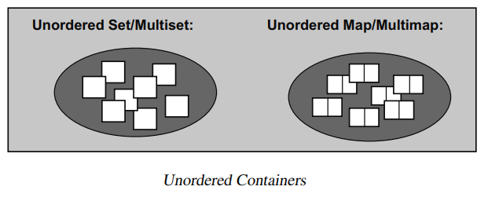

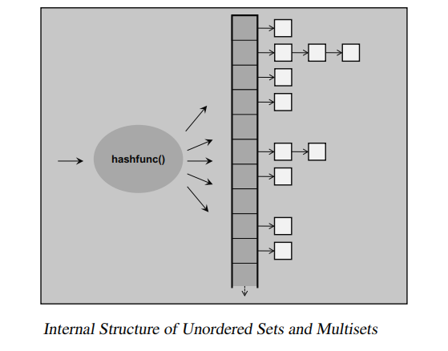

`unordered_set` 模板类中的定义

```cpp
template<typename _Value,                        // 容器中存储元素的类型
        typename _Hash = hash<_Value>,           // 确定元素存储位置的哈希函数
        typename _Pred = std::equal_to<_Value>,  // 判断各个元素是否相等
        typename _Alloc = std::allocator<_Value>, // 指定分配器对象的类型
        typename _Tr = __uset_traits<__cache_default<_Value, _Hash>::value>>
```

- 注意：此容器模板类中没有重载 `[]` 运算符，也没有提供 `at()` 成员方法，`unordered_set` 容器内部存储的元素值不能被修改，可以使用迭代器遍历容器中的数，但不能修改容器中元素的值。

### 4.3.2. unordered_multiset

### 4.3.3. unordered_map

unordered_map 内部是用 hash table 实现的，其内部结构图如下：

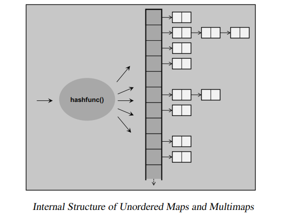

hashtable 原理请看：[hashtable 实现章节](./Hashtable.md)


### 4.3.4. API 接口

- `count(key)` : 对 multimap 而言，返回 key 在 multimap 中出现的次数；对 map 而言，返回结果为：当前key在map中，返回结果为 1，没在返回结果就为 0；

### 4.3.5. unordered_multimap

## 4.4. Containers Difference(容器之间的差异性)

和其他所有关联式容器一样，`map/multimap` 底层是以平衡二叉树完成的。C++ standard 并未明定这一点，但是从 `map` 和 `multimap` 各项操作的复杂度自然可以得出这一结念。

通常 `set`、`multiset`、`map` 和 `multimp` 都使用相同的内部结构，因此，你可以把 `set` 和 `multiset` 视为特殊的 `map` 和 `multimp`，只不过 `set` 元素的 **value 和 key 是同一对象**。因此，`map` 和 `multimap` 拥有 `set` 和 `multiset` 的所有能力和所有操作。当然，某些细微差异还是有的：首先，它们的元素是 key/value pair，其次，`map` 可作为关联式数组(associative array)来使用。

容器如何选择？

- Array 和 vector 的区别在于容器的长度是否固定。若要随机访问，且容器的长度固定，则用 `array`，反之用 `vector`。
- `List` 和 `vector` 最主要的区别在于 `vector` 是使用连续内存存储的，它支持 `[]` 运算符，而 `list` 底层用链表数据结构实现的，不支持 `[]` 。
- `Vector` 内部结构简单，对元素随机访问的速度很快，但是在头部插入元素速度很慢，在尾部插入速度很快。所以数据的访问十分灵活方便，数据的处理也很快。
- `List` 对于随机访问速度慢得多，因为需要遍历整个链表才能做到，但是对元素的插入就快的多了，不需要拷贝和移动数据，只需要改变指针的指向就可以了。
- `Map`、`Set` 属于关联性容器，底层是采用红黑树实现的，它的插入、删除效率比其他序列容器高，因为它不需要做内存拷贝和内存移动，而是改变指向节点的指针。
- `Set` 和 `Vector` 的区别在于 `Set` 容器不包含重复的数据。Set 和 Map 的区别在于 Set 只含有 Key，而 Map有一个 Key 和 Key 所对应的 Value 两个元素。
- `Map` 和 `HashMap` 的区别是 `HashMap` 使用了 Hash 算法来加快查找过程，但是需要更多的内存来存放这些 Hash 桶元素，因此可以算得上是采用空间来换取时间策略。

简单选择容器的准则

1. 若需要高效的随机存取，而不在乎插入和删除的效率，使用 `vector`。 
2. 经常需要元素大量的插入、删除和移动，而不关心随机存取，则应使用 `list`。
3. 若需要随机存取，而且经常在两端对数据进行插入和删除，则应使用 `deque`；若希望元素从容器中被移除时，容器能自动缩减内部的内存用量，那么也用 `deque`。
4. 若需要字典结构或者处理 key/value 这样的键值对时，应采用 `unordered map(multimap)`；若元素的顺序很重要，则用 `map(multimap)`。
5. 经常根据某个准则去查找元素，则应根据该准则进行 hash 的 `unordered_set` 或 `unordered_multiset`；若元素的顺序很重要，则用 `set` 或 `multiset`。

## 4.5. Container adaptors(容器适配器)

容器适配器为有序的容器提供了不同的接口。queue 和 stack 底层完全借助 deque 实现的。

### 4.5.1. stack

#### 4.5.1.1. 内部结构图

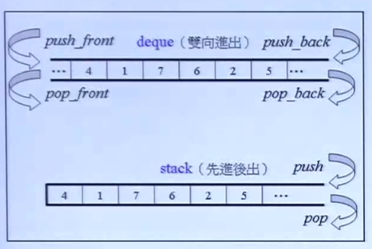

#### 4.5.1.2. API 接口

- `push()` 入栈
- `pop()` 出栈
- `top()` 获取栈顶元素
- `size()` 获取栈大小
- `empty()` 栈为空

### 4.5.2. queue

#### 4.5.2.1. 内部结构图

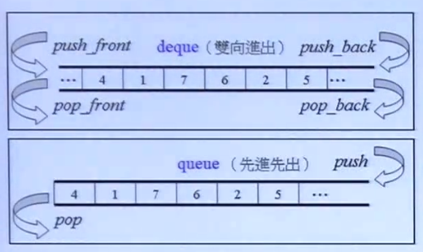

#### 4.5.2.2. API 接口

- `push()` 入队列
- `pop()` 出队列
- `empty()` 对列为空
- `front()` 队列头部元素

### 4.5.3. priority_queue(优先级队列)

#### 4.5.3.1. 什么是优先级队列

#### 4.5.3.2. 标准库接口

```cpp
// 最大或最小优先级队列变量的声明 

priority_queue<int> g_priq;                            // 默认为最大值优先队列
priority_queue<int, vector<int>, greater<int>> l_priq; // 最小值优先队列
```

# 5. String

String 类是 C++ 标准库接对 `char*` 字符串一系列操作的封装，位于头文件 `#include <string>` 中。


## 5.1. string 与 char* 转换

1、const char* 与 string 之间的转换。

`char*` 是 C 语言形式的字符串，`string` 类是 C++ 的字符串，C++ 为了要兼容 C 语言的字符串，两者之间需要进行转换。`string` 转 `const char*`，直接调用 string 类的 `c_str()` 接口。

```cpp
string str = “abc”;
const char* c_str = str.c_str();
```

2、`const char*` 转 `string`，直接赋值即可。

```cpp
const char* c_str = “abc”;
string str(c_str);
```

3、`string` 转 `char*`

```cpp
char* c = “abc”;
string s(c);
const int len = s.length();
c = new char[len+1];
strcpy(c,s.c_str());
```

4、char* 转 string，直接赋值即可。

```cpp
char* c = “abc”;
string s(c);
```

5、 `const char*` 转 `char*`

```cpp
const char* cpc = “abc”;
char* pc = new char[strlen(cpc)+1];
strcpy(pc,cpc);
```

6、`char*` 转 `const char*`，直接赋值即可

```cpp
char* pc = “abc”;
const char* cpc = pc;
```

## 5.2. API 接口

string 是一个随机存储容器。

- `constructors`: 构造函数。Create or copy a string
- `destructor`: 析构函数。Destroys a string
- `=` : 对 string 赋一个新值，新值可以是 string，C-string 形式的字符或单一字符。
-  `assign()`: 给 string 赋单个或多个值。
- `swap()`: 交换两个 string 内容。
- `+=`, `append()`, `push_back()`: 追加字符。
- `insert()`：插入字符。
- `erase()`, `pop_back()`: 删除字符。`pop_back()` 自 C++ 开始。
- `clear()`: 移除所有字符。
- `resize()`: 改变字符数量，在尾部删除或添加字符。
- `replace()`: 替换字符
- `data()`, `c_str()`: 将 string 字符串中内容作为字符数组（C-string形式）返回 。C++11 之前，`data()` 不是一个有效的 C-string，返回的结果中不包含 `\0`，C++11 之后，两者的方式是相同的。
- `size()`, `length()`: 返回 string 中当前的字符数量。
- `empty()`: 检查 string 中的字符数量是否为 0。检查 string 是否为空时，C++ STL 中建议用 `empty()` 替代 `size()`、`length()`，因为 `empty()` 比较快。
- `max_size()`: 返回一个 string 中包含的最大字符数量。若操作 string 时，它的长度 `length` 大于 `max_szie`，后，STL 会抛出 `length_error`异常。
-  `capacity`() : 未重新分配 string 内部内存之前，返回 string 包含的最大字符数量。
  - 重新分配后，所有字符串字符指向的 reference、pointer、Iterator 均无效了。
  - 重新分配是很耗费时间的。
- `reverse():` 避免重新分配，保留一定容量，确保该容量用尽之前，reference 一直有效。
- `getline()`: 逐行读取所有字符，包括开头的空白字符，直到遇到指定的分行符或 `end of file` 结束，默认情况下分行符为 换行符。

## 5.3. 底层实现

Scott Meyers 在《Effective STL》第 15 条中提到 `std::string` 底层实现有多种方式，归纳起来有 3 类。

- eager copy（无特殊处理）。采用类似 `std::vector` 的数据结构，现在很少采用这种形式。
- Copy-on-Write（COW，写时复制）。
- Small String Optimization（SSO，短字符串优化）。利用 string 对象的本身空间来存储短字符串。

C++ GCC `std::string` 在 C++11 之前与之后实现是完全不同的。c++11 之前实现的是 **COW** string。C++11之后实现的就是**实时拷贝**，因为 **C++11 标准规定：不允许 [] 导致之前的迭代器失效**，这就使得 COW 的string 不再符合C++规范了。

**重要区别**：COW 的 `basic_string` 有一个 `RefCnt` 变量，用于引用计数；而自 C++11开始，采用引用计数（reference counted）实现的 `basic_string`  不在被允许。因为让 string 的内部缓冲区共享被共享（ share internal buffers），在多线程环境中是行不通的。


### 5.3.1. 空 string 大小

源码

```cpp
// C++11 及其以上

static const size_type	npos = static_cast<size_type>(-1);
size_type		_M_string_length;

enum { _S_local_capacity = 15 / sizeof(_CharT) };

union
{
    _CharT           _M_local_buf[_S_local_capacity + 1];
    size_type        _M_allocated_capacity;
};

```

`size_type` 由机器决定。

### 5.3.2. 数据类型( Type Definitions and Static Values)

1. `string::traits_type`
2. `string::value_type`
3. `string::size_type`
4. `string::difference_type`
5. `string::reference`
6. `string::const_reference`
7. `string::pointer`
8. `string::const_pointer`
9. `string::iterator`
10. `string::const_iterator`
11. `string::reverse_iterator`
12. `string::const_reverse_iterator`
13. `static const size_type string::npos`
14. `string::allocator_type`


# 6. Functor(仿函数)

## 6.1. 什么是仿函数？

仿函数(Functor)也叫函数对象(Function object)或者叫伪函数。它是在 `struct` 结构体中定义一种新的函数，它只为算法 (Algorithms) 服务。从实现的角度看，仿函数是一种重载了 `operator()` 的 `class` 或 `class template`，让对象也具有像函数一样的功能。一般函数指针可视为狭义的仿函数。 

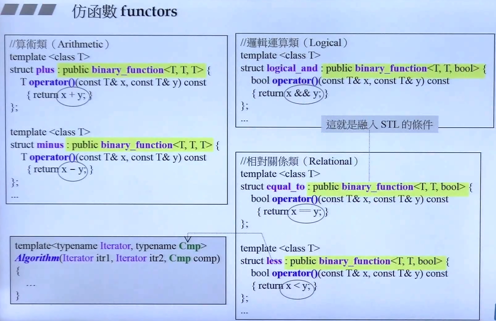

## 6.2. 分类

按操作数个数划分

- 一元运算 (unary_function)
- 二元运算 (binary_function)

按功能划分

- 算术运算 (Arithmetic)
  
  - 加：plus<T>
  
  - 减: minus<T>
  
  - 乘: multiplies<T>
  
  - 除: divides<T>
  
  - 取模: modulus<T>  
  
  - 否定: negate<T> 
    
    > negate 属于一元运算，其余的都属于二元运算。

- 关系运算 (Ratioanl)
  
  - 等于: equal_to<T> 
  
  - 不等于: not_equal_to<T>
  
  - 大于: greater<T>
  
  - 大于等于: greater_equal<T>
  
  - 小于: less<T>
  
  - 小于等于: less_equal<T>
    
    > 六种都属于二元运算。 

- 逻辑运算 (Logical)
  
  - 逻辑 And: logical_and<T> 
  
  - 逻辑 Or: logical_or<T>
  
  - 逻辑 Not: logical_not<T>
    
    > And, Or 属于二元运算，Not 属于一元运算。 

## 6.3. 可调用对象

哪些可以是可调用对象？

- 函数指针 (function pointer)
- 带有成员函数 `operator()` 创建的 object。
- 带有转换函数，可将自己转换为函数指针的 类 所创建的 object。
- lambda 表达式。

## 6.4. 函数对象调用

- 函数对象可以做函数参数。 

- 函数对象可以做返回值。 

- 函数对象的调用与 `回调函数` 的调用类似。 
  
  ```cpp
  class Stu
  {
    private:
    public:
      void operator() (Stu& T) {}
  }
  ```

## 6.5. 可调用对象包装器

包含头文件：`#include <functional>`

语法

```cpp
std::function<返回值类型(参数列表)> obj_name = 可调用对象
```

包装器可包装哪些东西？

- 包装类的普通成员函数
- 包装类的静态函数
- 包装仿函数
- 包装转化为函数指针的函数对象

类的成员函数不能直接使用可调用对象包装器，还需要结合绑定器一起使用。

## 6.6. 可调用对象绑定器

std::bind()

绑定器作用

- 将可调用对象与其参数一起绑定成为仿函数。
- 将多元可调用转化为一元可调用对象

两种方式

- 绑定非类的成员变量。
- 绑定类的成员变量或成员函数。

## 6.7. Predefined Function Objects (预定义函数对象)

标准STL模板库中提前预定义了很多的函数对象。任何应用程序想要使用 STL 内建的仿函数，都必须包含标准库预定义函数对象的头文件 `<functional>`。

仿函数的主要作用就是为了搭配 STL 算法，在算法中进行使用。

## 6.8. 其它

- 证同函数(identity_function): 任何数值通过此函数后，不会有任何改变。标准库 `stl_function.h` 中用 `identity` 来指定 RB-tree 所需的 KeyOfValue。

- 选择函数(selection_function)，标准库 `stl_function.h` 中用 `select1st` 和 `select2nd` 来指定 RB-tree 所需的 KeyOfValue。
  
  - select1st: 接受一个pair，传回它的第一个元素。
  - select2nd: 接受一个pair，传回它的第二个元素。

- 投射函数
  
  - project1st: 传回第一参数，忽略第二参数。
  - project2nd: 传回第二参数，忽略第1参数。


# 7. Algorithm

从实现的角度来看，STL算法是一种 `function template`。**而所有的 Algorithms 内部最本质的操作无非就是比大小。**

标准库中大约封装了有 80 多种算法。

STL算法的核心思想

- STL通过类模板技术，实现了数据类型与容器模型的分离。
- 通过函数对象实现了自定义数据类型与底层算法的分离。
- 通过迭代器的方式统一的去遍历容器，向容器中读数据和写数据。

## 7.1. Heap(堆)

heap（堆）的 STL 库中函数

- `make_heap(first, last, comp);` 建立一个空堆；
- `push_heap(first, last, comp);` 向堆中插入一个新元素；
- `top_heap(first, last, comp); ` 获取当前堆顶元素的值；
- `sort_heap(first, last, comp);` 对当前堆进行排序；

## 7.2. API 接口

- `std::for_each()` 遍历容器中的所有元素。

- `std::transform()` 将容器中的数据进行某种转换的运算。
  
  > 两个算法的区别
  > 
  > - `std::for_each()` 使用的函数对象可以没有 `返回值`，参数一般传 `reference`，因此速度较快，不是很灵活。
  > - `std::transform()` 使用的函数对象必须要有 `返回值`，参数一般传 `value`，因此速度较慢，但是很灵活。

- `std::adjacent()` 查找一对相邻位置重复的元素，找到则返回指向这对元素的第一个元素的迭代器值。

- `std::distance()` 返回两个迭代器之间的距离，两个迭代器必须指向同一个容器。

- `std::binary_search()` 采用二分法在有序序列中查找 value，找到则返回 true。在无序的序列中不能使用。

- `std::count()` 计数容器中指定元素的个数。

- `std::count_if()` 使用 `谓词` 计数容器中指定条件元素的个数。

- `std::find()` 

- `std::find_if()` 

- `std::merge()`  合并两个有序的序列，并存放到另一个序列中。

- `std::sort()` 默认按照升序的方式重新排列指定范围内元素的元素。

- `std::random_shuffle()` 对指定范围内的元素随机进行排序。

- `std::reverse()` 对指定范围内的元素进行倒叙排序。

- `std::copy()` 将一个容器中的元素值拷贝到另一个容器中

- `std::replace()` 将指定范围内的 `oldValue` 替换为 `newValue`

- `std::replace_if()` 将指定范围内的 `oldValue` 替换为 `newValue`，需要指定 `函数对象`（是自定义的函数对象或STL预定义的函数对象）。

- `std::swap()`  交换两个容器

- `std::accumulate()` 累加遍历容器中指定范围内的元素，并在结果上加一个指定的值。

- `std::stable_partition()`

- `std::upper_bound()` 

- `std::lower_bound()` 

- `std::floor()` 和 `std::ceil()`都是对变量进行四舍五入，只不过四舍五入的方向不同。 
  
  - `std::floor()` -->向下取整数。`5.88   std::floor(5.88) = 5;`
  - `std::ceil()` -->向上取整数。`std::ceil(5.88)   = 6;`

- `std::rotate()`

- `std::max()`

- `std::min()`

- `std::sample`

# 8. Adaptor(适配器)

## 8.1. 什么是适配器

适配器是一种用来修饰容器(containers)或仿函数(functor)或迭代器(iterators)接口的东西。改变 `functor` 接口者，称为 `function adaptor`；改变 `container` 接口者，称为 `container adaptor`；改变 `iterator` 接口者，称为 `iterator adaptor`。

## 8.2. 分类

### 8.2.1. function adaptor(函数适配器)


### 8.2.2. bind adaptor(绑定适配器)


### 8.2.3. composite adaptor(组合适配器)


### 8.2.4. pointer adaptor(指针适配器)


### 8.2.5. member function adaptor(成员函数适配器)

predicate: 判断这个条件是真还是假


# 9. Traits(萃取机)

trait 中文译为：特点、特征、特性。

`Traits` 有很多的类型。

## 9.1. iterator_traits

 `iterator_traits` 即为迭代器的特征。这个有点不好理解，可以把它理解成一个 `萃取机`，用来区分传入迭代器中的类型是 **class iterators** 还是 **non class iterators，即 native pointer**。可以利用**类模板中的 partial specialization**可以得到目标。

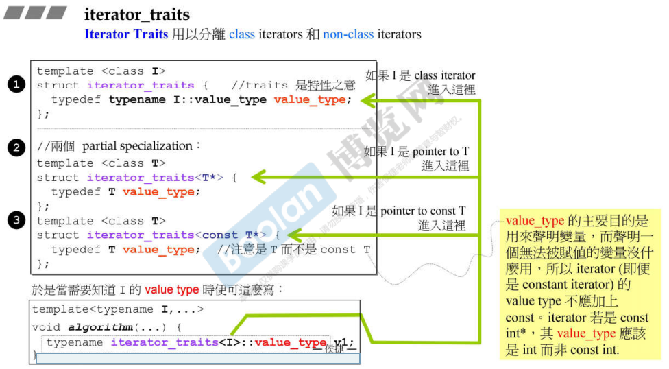

根据经验，最常用到的迭代器相应型别有五种：`value type`，`difference type`，`pointer`，`reference`，`iterator_category`。如果你希望你所开发的容器能与 STL 水乳交融，一定要为你的容器中的迭代器定义这五种相应类型。“特性萃取机” traits 会很忠实地将原汁原味榨取出来：

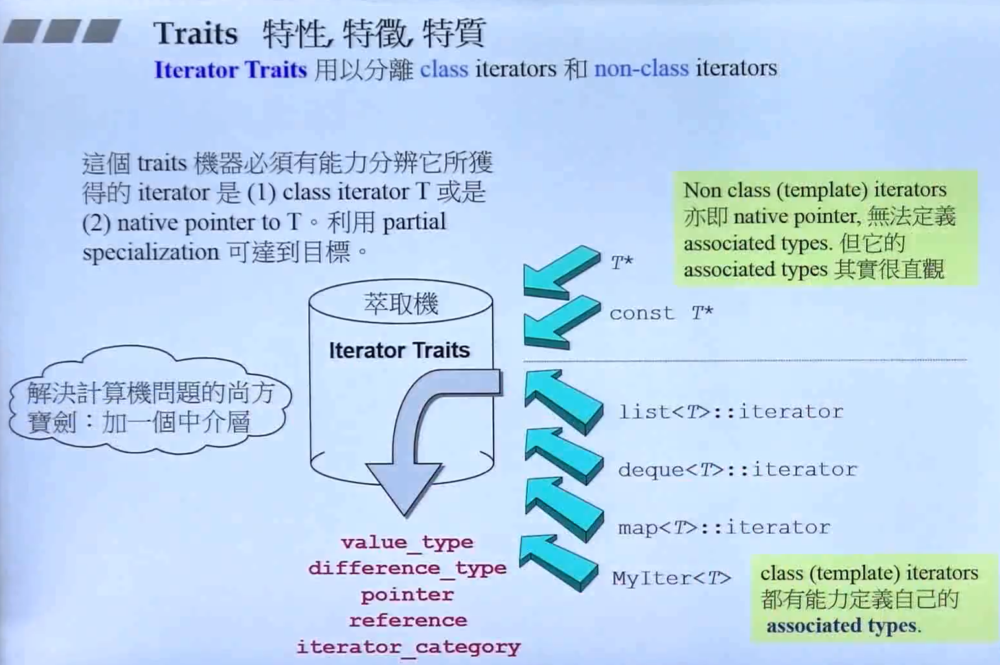

其中，`iterator_traits` 位于 `../C++/bits/stl_iterators.h>` 头文件里。

```cpp
public:
  typedef _Iterator					                iterator_type;

  typedef typename __traits_type::iterator_category iterator_category;
  typedef typename __traits_type::value_type  	    value_type;
  typedef typename __traits_type::difference_type 	difference_type;
  typedef typename __traits_type::reference 	    reference;
  typedef typename __traits_type::pointer   	    pointer;
```

- value_type: 迭代器所指对象的类型。
- difference_type: 两个迭代器之间的距离。也可以用来表示一个容器的最大容量，因为对于连续空间的容器而言，最大容量就是头尾之间的距离。
- reference: 迭代器所指向的内容是否允许改变。
- pointer: 迭代器指向的内容为指针。
- iterator_category: 迭代器的类别。查看 *迭代器章节的分类部分*。

## 9.2. type traits

位于 `../C++/type_traits.h>` 头文件中。

## 9.3. char traits

位于 `../C++/bits/char_traits.h>` 头文件中。

## 9.4. allocator traits

位于 `../C++/bits/alloc_traits.h>` 头文件中。

## 9.5. pointer traits

位于 `../C++/bits/ptr_traits.h>` 头文件中。

## 9.6. array traits

位于 `../C++/array>` 头文件中。


# 10. Iterators(迭代器)

## 10.1. 什么是迭代器

表示元素在容器中的位置，这种对象的概念就称为迭代器。（STL标准库中的解释：we need a concept of an object that represents positions of elements in a container. This concept exists. Objects that fulfill this concept are called iterators.）

迭代器就是一种泛化的指针，是一个可遍历 STL 容器中全部或部分元素的对象。从实现的角度看，迭代器是一种将 `operator*`, `operator->`, `operator++`, `operator--` 等指针操作给予重载的 `class template`。

## 10.2. 迭代器设计思维

不论是泛型思维或 STL 的实际运用，迭代器（iterators）都扮演着重要的角色。STL 的中心思想在于：将数据容器（containers）和算法（algorithms）分开，彼此独立设计，最后再以一帖胶着剂将它们撮合在一起。容器和算法的泛型化，从技术角度来看并不困难，C++ 的 class templates 和 function templates 可分别达成目标。如何设计出两者之间的良好胶着剂，才是大难题。

## 10.3. 基本操作

- `operator *`: 返回当前位置上元素的值。
- `operator ++ 或 operator --`: 让迭代器指向下一个或上一个元素。
- `operator == 或 operator !=`: 判断两个迭代器是否指向同一个位置。
- `operator =`: 赋值给迭代器  

不同的迭代器也许是 `smart pointers`，具有遍历复杂数据结构的能力，其内部运作机制取决于所遍历的数据结构。每一种容器都必须提供自己的迭代器。事实上每一种容器的确都将其迭代器以嵌套方式定义与 class 内部，因此各种迭代器的接口（interface）虽然相同，但类型（type）却是各不相同。

## 10.4. 迭代运算

迭代器的区间是一个前闭后开区间（half-open range）。

- begin: 返回一个迭代器，指向容器中第一个元素的位置。
- end: 返回一个迭代器，指向容器的终点，终点位于最后一个元素的下一个位置。

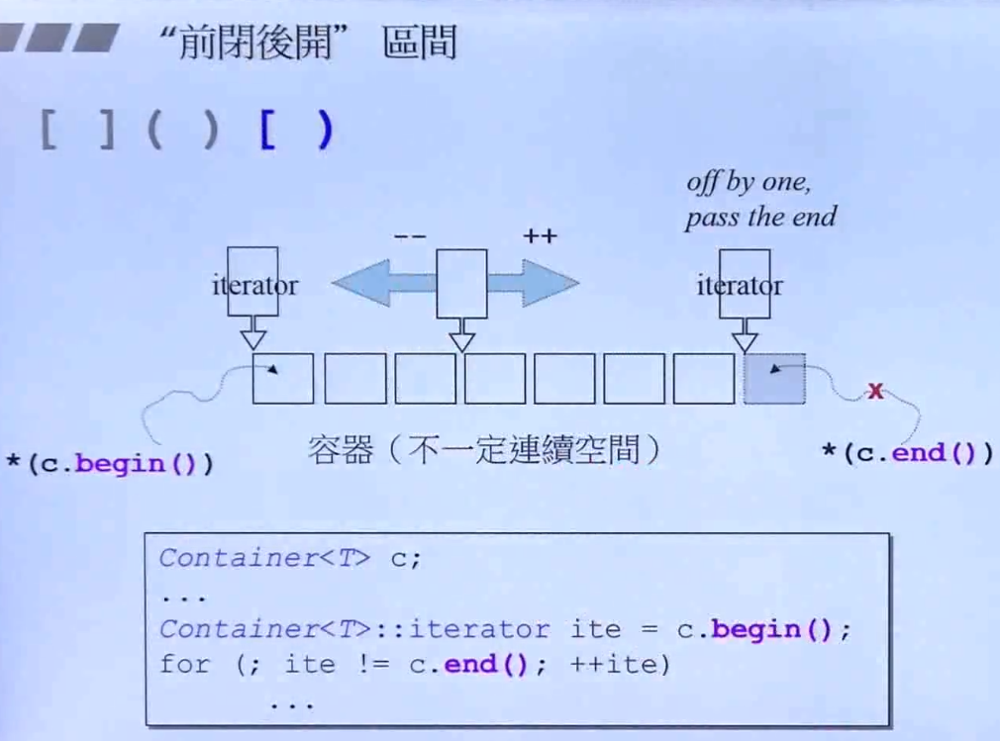

采用半开区间的优点？

- 给遍历元素时，循环（loop）结束的时候，提供一个简单的判断依据。只要尚未达 `end()`，loop就继续执行。
- 避免对空区间（empty ranges）采取特殊的处理。对于 `empty ranges` 而言，`begin()` 就等于 `end()`。

## 10.5. iterator遵循的原则

iterator 是算法（Algorithms）与容器 （containers）之间的桥梁。

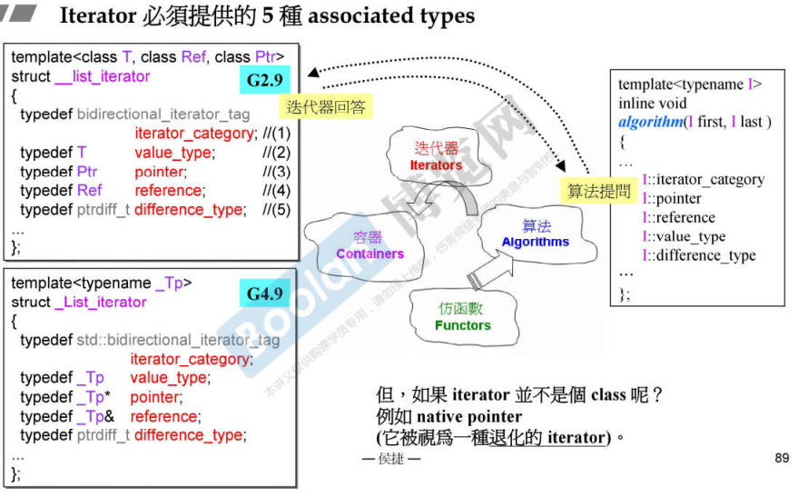

## 10.6. Iterator 分类

根据移动特性和施行特性，迭代器分为五类：

- input iterator: 这种迭代器所指的对象，不允许外界去改变，属于只读的。
- output iterator: 属于只能写的迭代器。
- forward iterator: 允许”写入型“算法（例如：`replace()`）在此迭代器所形成的区间上进行读写操作。l
- bidirectional iterator: 双向移动迭代器。
- random access iterator: 随机访问迭代器，涵盖所有指针运算的能力。

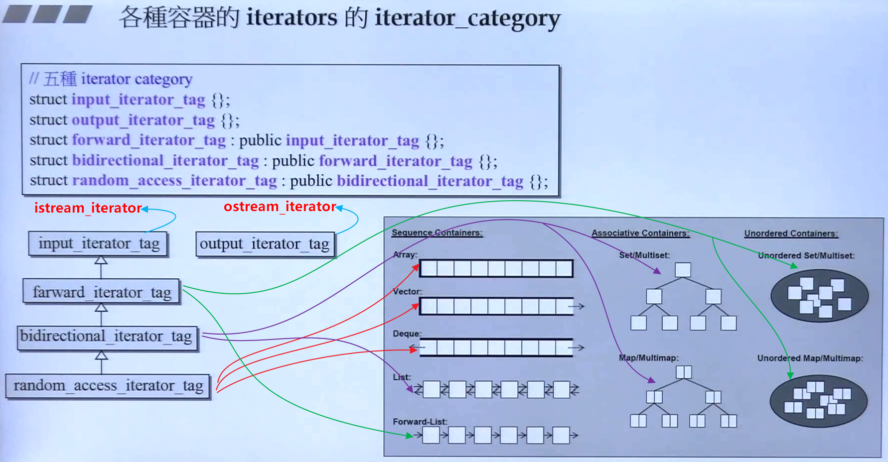

源码位于标准库的 `stl_iterator_base_types.h` 文件中。

```cpp
// stl_iterator_base_types.h
/**
   *  @defgroup iterator_tags Iterator Tags
   *  These are empty types, used to distinguish different iterators.  The
   *  distinction is not made by what they contain, but simply by what they
   *  are.  Different underlying algorithms can then be used based on the
   *  different operations supported by different iterator types.
  */

///  Marking input iterators.
struct input_iterator_tag { };

///  Marking output iterators.
struct output_iterator_tag { };

/// Forward iterators support a superset of input iterator operations.
struct forward_iterator_tag : public input_iterator_tag { };

/// Bidirectional iterators support a superset of forward iterator
/// operations.
struct bidirectional_iterator_tag : public forward_iterator_tag { };

/// Random-access iterators support a superset of bidirectional
/// iterator operations.
struct random_access_iterator_tag : public bidirectional_iterator_tag { };
```

`istream_iterator` 的 iterator_category
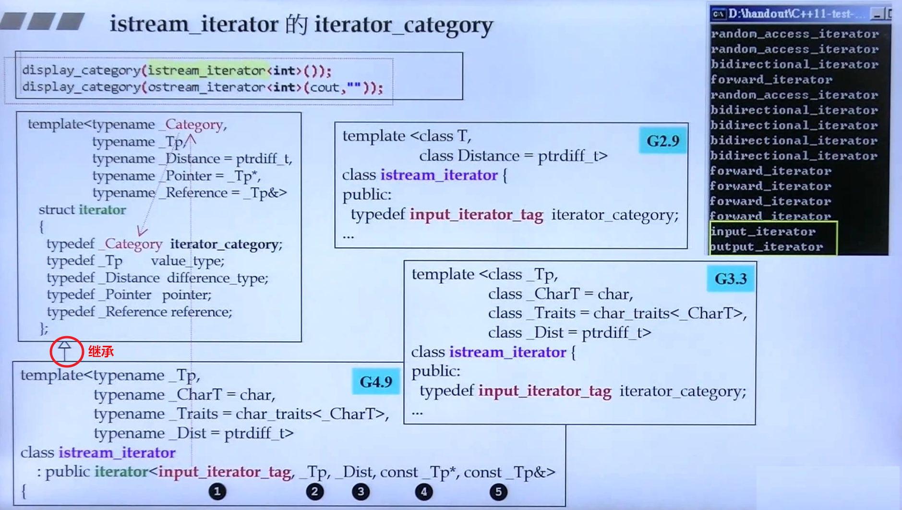

`ostream_iterator` 的 iterator_category
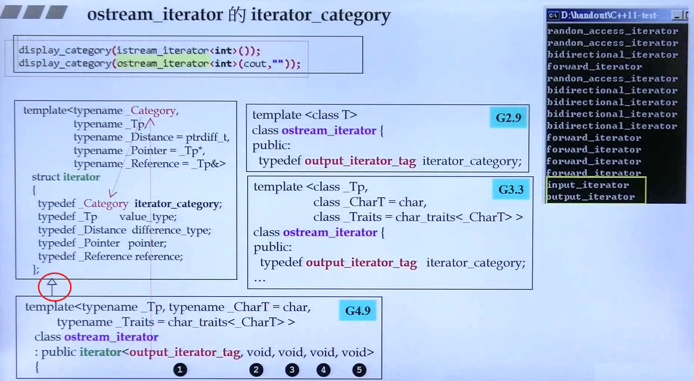

父类中没有data 和 function，子类继承于父类的 typedef。

**Iterator分类对算法的影响**

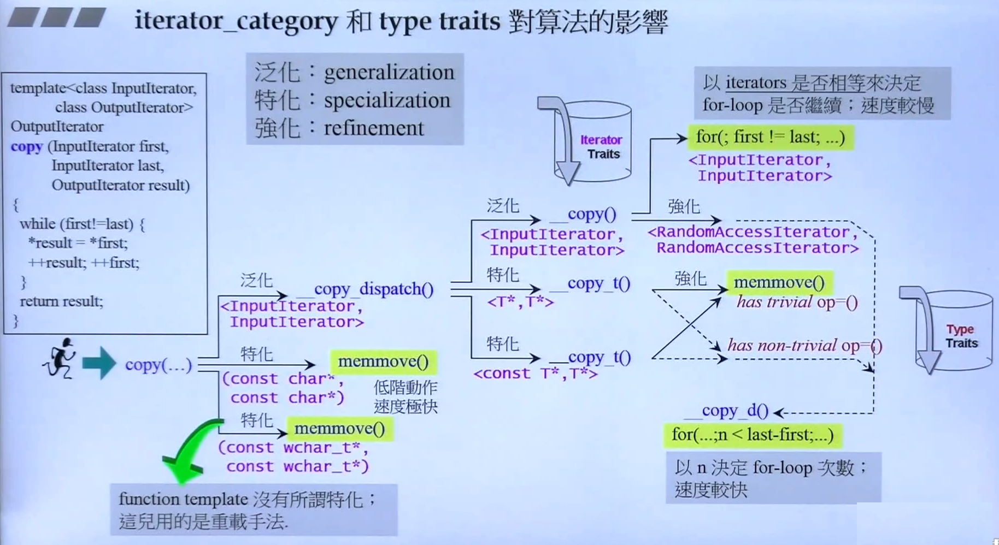

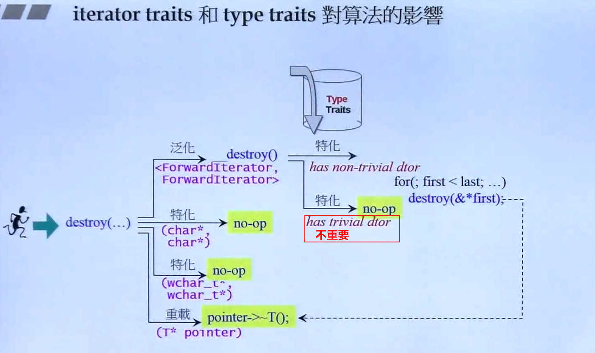

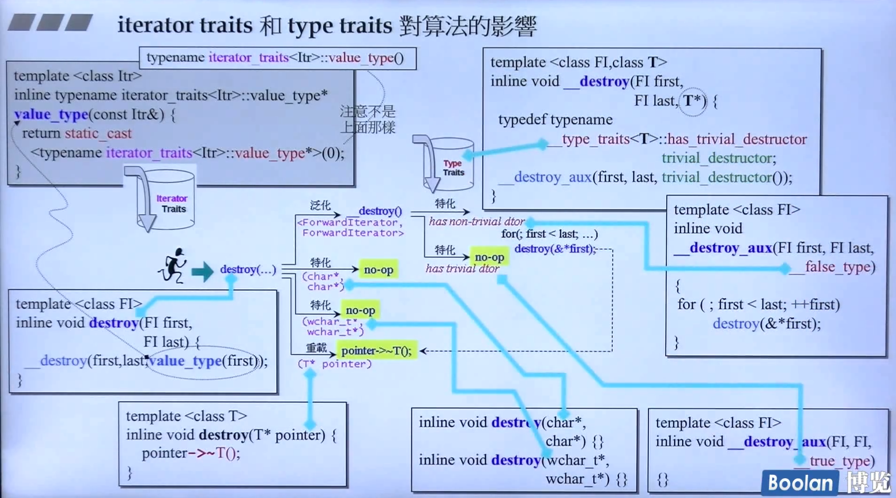


## 10.7. 迭代器失效

- 为什么迭代器会失效？
  
  STL 容器中元素整体“迁移”导致存放原容器元素的空间不再有效，使原本指向某元素的迭代器不再指向希望指向的元素，从而使得指向原空间的迭代器失效。 

- 对于序列式容器，比如vector，删除当前的iterator会使后面所有元素的iterator都失效。因为序列式容器中内存是连续分配的（分配一个数组作为内存），删除一个元素导致后面所有的元素会向前移动一个位置。删除了一个元素，该元素后面的所有元素都要挪位置，所以，删除一个数据后，其他数据的地址发生了变化，之前获取的迭代器根据原有的信息就访问不到正确的数据。

- 数组型数据结构的元素是分配在连续的内存中，`insert` 和 `erase` 操作，会使删除点和插入点之后的元素挪位置。所以，插入点和删除掉之后的迭代器全部失效，也就是说 `insert(*iter)(或erase(*iter))`，然后再 `iter++`，是没有意义的。
  
  - 解决方法：`erase(*iter)`的返回值是下一个有效迭代器的值 `iter =cont.erase(iter);`

- list型的数据结构，使用了不连续分配的内存，删除运算使指向删除位置的迭代器失效，但是不会失效其他迭代器。
  
  - 解决办法两种，`erase(*iter)` 会返回下一个有效迭代器的值，或者`erase(iter++)`。

- 红黑树存储的数据，插入操作不会使任何迭代器失效；删除操作使指向删除位置的迭代器失效，但不会失效其他迭代器。`erase` 迭代器只是被删元素的迭代器失效，但是返回值为 `void`，所以要采用 `erase(iter++)`的方式删除迭代器。

<font color=red>注意：</font>  经过 `erase(iter)` 之后的迭代器完全失效，该迭代器 `iter` 不能参与任何运算，包括 `iter++和*ite`。

参考

- [迭代器失效的几种情况总结](https://blog.csdn.net/lujiandong1/article/details/49872763) 
- [聊聊map和vector的迭代器失效问题](https://blog.csdn.net/stpeace/article/details/46507451?utm_medium=distribute.pc_relevant_t0.none-task-blog-BlogCommendFromMachineLearnPai2-1.control&dist_request_id=2cff67d7-d841-4421-bbca-7f85ba6e0330&depth_1-utm_source=distribute.pc_relevant_t0.none-task-blog-BlogCommendFromMachineLearnPai2-1.control)
- [C++ STL 迭代器失效问题](https://www.cnblogs.com/qiaoconglovelife/p/5370396.html)

# 11. Allocators(分配器)

## 11.1. 什么是分配器

分配器（Allocator）负责内存空间的分配与管理。分配器是一个实现了动态空间配置、空间管理、空间释放的 `class template`。分配器我们一般不直接使用它，它是给容器使用的。容器的内存分配是通过分配器来管理的。

C++ 标准库在许多地方使用特殊的对象（objects）处理内存的分配（allocation）和归还（deallocation），像这样的对象（objects）就称为分配器`allocators`。

**Allocator 代表的是一种特殊内存模型（memorymodel），并提供一种抽象的概念，将需要使用的内存（need to use memory）转变为对内存的直接调用（raw call for memory）。** 如果在相同的时间使用不同的分配器（allocato）对象，允许你在程序中使用不同的内存模型（memory models）。

最初，allocator 只是作为 STL 的一部分而引人的，用来处理像 PC 上不同类型的指针（例如near、far、huge指针）这一类乱七八艚的问题；现在则是作为“运用某种内存模型”技术方案的基础，使得像共享内存（shared memory）、垃圾回收（garbagecollection）、面向对象数据库（object-oriented database）等解决方案能保特一致接。

## 11.2. 默认分配器

C++标准定了一个 default allocator 如下：

```cpp
namespace std {
  template < typename T>
  class allocator;
}
```

这个默认分配器（default allocator）可在 **allocator 得以被当作实参**使用的任何地方允许当默认值，它会执行内存分配和回收。也是说，它会调用 new 和 delete 操作符。但 C++ 并没有对**在什么时候以什么方式调用这些操作符**给予明确规定。因此，default allocator 甚至可能在内部对分配内存采用缓存（cache）的手法。

绝人多数程序都使用 default allocator，但有时其它程序库也可能提供些 allocator 满足特定需求。这种情况下只需简单地将它们当做实参即可。只有少数情况下才需要自行写一个 allocator，现实中最常使用的还是 default allocator。

allocator 底层的操作都是采用 `malloc()` 和 `free()`来分配和释放内存。`malloc` 分配内存时，会有额外的外开销（overhead），使程序变慢。若要提高内存分配的效率，需要减少 `cookie（用以记录内存的大小）` 的开销

## 11.3. Allocator 标准接口

1. `allocator::value_type` 
   - The type of the elements. 
   - It is usually equivalent to T for an `allocator<T>`，传递一个模板参数类型。
2. `allocator::size_type`
3. `allocator::difference_type`
   - 有符号整数值的类型，它可以表示分配模型中任意两个指针之间的差异。
4. `allocator::pointer`
5. `allocator::const_pointer`
6. `allocator::void_pointer`
7. `allocator::const_void_pointer`
8. `allocator::reference`
9. `allocator::const_reference`
10. `allocator::rebind`
11. `allocator::propagate_on_container_copy_assignment`
12. `allocator::propagate_on_container_move_assignment`
13. `allocator::propagate_on_container_swap`
14. `allocator::allocator ()`
15. `allocator::allocator (const allocator& a)`
16. `allocator::allocator (allocator&& a)`
17. `allocator::˜allocator ()`
18. `pointer allocator::address (reference value)` 
19. `const_pointer allocator::address (const_reference value)`
20. `size_type allocator::max_size ()`
21. `pointer allocator::allocate (size_type num)` 
22. `pointer allocator::allocate (size_type num, allocator::const_pointer hint)`
23. `void allocator::deallocate (pointer p, size_type num)`
24. `void allocator::construct (U* p, Args&&... args)`
25. `void allocator::destroy (U* p)`
26. `bool operator == (const allocator& a1, const allocator& a2)`
27. `bool operator != (const allocator& a1, const allocator& a2)`
28. `allocator select_on_container_copy_construction ()`


# 12. Reference

- [c++ list, vector, map, set 区别与用法比较](https://cloud.tencent.com/developer/article/1052125)