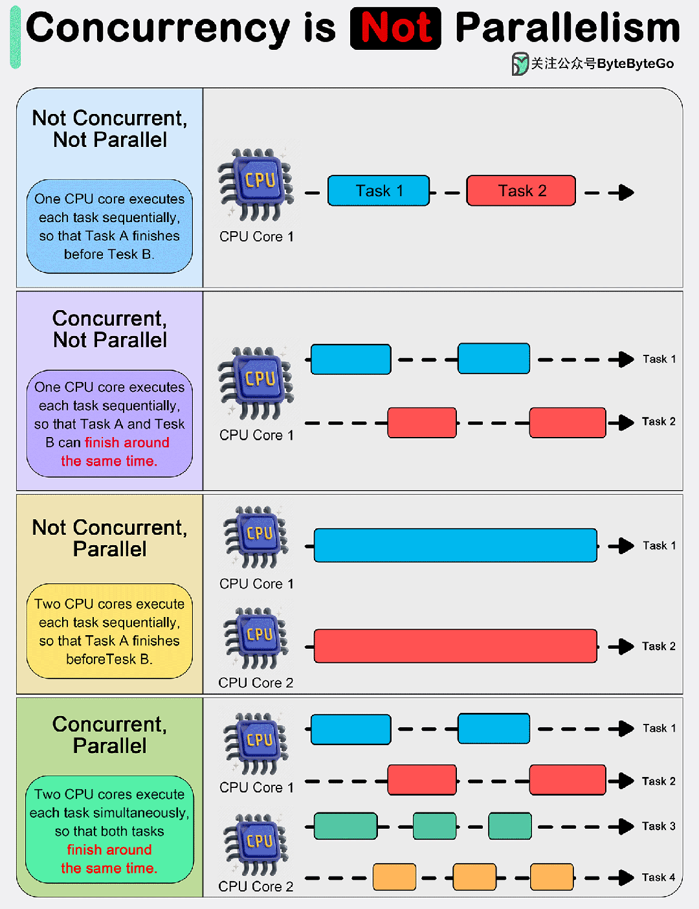

<!--
 * @Author: JohnJeep
 * @Date: 2021-08-08 01:18:00
 * @LastEditTime: 2025-11-20 11:47:49
 * @LastEditors: JohnJeep
 * @Description: 多线程并发
-->

- [1. 阻塞](#1-阻塞)
- [2. 非阻塞](#2-非阻塞)
- [3. 异步](#3-异步)
- [4. 同步](#4-同步)
- [5. 并行](#5-并行)
- [6. 并发](#6-并发)
- [7. 高并发](#7-高并发)
- [8. API](#8-api)
  - [8.1. async](#81-async)
  - [8.2. future](#82-future)
  - [8.3. Condition Variable](#83-condition-variable)

## 1. 阻塞

阻塞是指当前执行的线程调用一个方法，在该方法没有返回值之前，当前执行的线程会被挂起，无法继续进行其他操作。

## 2. 非阻塞

非阻塞是指当前执行的线程调用一个方法，当前执行的线程不受该方法的影响，可以继续进行其他操作。

## 3. 异步

异步是执行或调用方法时，不需要等待上一次执行的结果，继续执行下一条。

异步模型中，允许同一时间发生（处理）多个事件。

在异步编程中，通常会针对比较耗时的功能提供一个函数，函数的参数中包含一个额外的参数，用于回调。而这个函数往往称作回调函数。当比较耗时的功能执行完毕时，通过回调函数将结果返回。

多线程或单线程都实现异步。

## 4. 同步

同步是执行或调用一个方法时，每次都需要拿到对应的结果才会继续往后执行

## 5. 并行

当系统有一个以上CPU时，则线程的操作有可能非并发。当一个 CPU 执行一个线程时，另一个 CPU 可以执行另一个线程，两个线程互不抢占 CPU 资源，可以同时进行，这种方式我们称之为并行（Parallel）。

## 6. 并发

## 7. 高并发

场景

- 电商的高并发
- 抖音的高并发
- 12306卖火车票的高并发
- 基金交易系统的高并发
- 海量数据处理的高并发

区别

多线程都是关于功能的并发执行。而异步编程是关于函数之间的非阻塞执行，我们可以将异步应用于单线程或多线程当中。

Data race (数据竞争): 两个线程并发操作同一块数据导致不可预期的行为。

Waiting and Polling (等待和轮训)

## 8. API 

### 8.1. async

- `async()` 提供一个接口，让一段功能或一个可调用对象在后台运行，成为一个独立的线程。
- `async_wait()`

### 8.2. future
- `Class future<>` 允许你等待线程结束并获取其结果。
- `std::shared_future<>`允许你在多个地点等待和处理线程结束。

###  8.3. Condition Variable

条件变量接口 API

- `wait(ul)`: 使用 `unique_lock` 锁来等待通知
- `wait(ul, pred)`: 使用 `unique_lock`锁来等待通知，直到 pred 在一次苏醒之后结果为 true。
- `wait_for(ul, duration)`: 使用 `unique_lock`锁来等待通知，等带期限是一个时间段 duration。
- `wait_for(ul, duration, pred)`: 使用 `unique_lock`锁来等待通知，等带期限是一个时间段 duration 或直到 pred 在一次苏醒之后结果为 true。
- `wait_until(ul, timepoint)`: 使用 `unique_lock`锁来等待通知，直到某个时间点 time point。
- `wait_until(ul, timepoint, pred)`: 使用 `unique_lock`锁来等待通知，直到某个时间点 time point 或直到 pred 在一次苏醒之后结果为 true。
- `notify_one()`: 唤醒一个等待者（线程）。
- `notify_all()`: 唤醒所有的等待者（线程）。