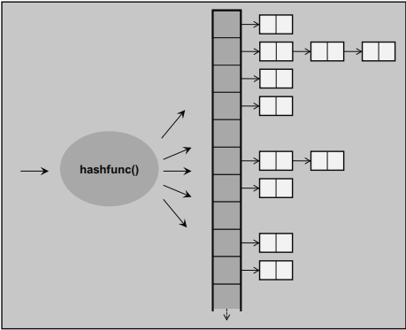
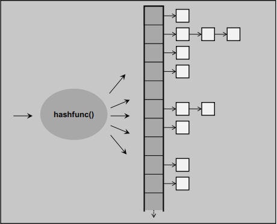

<!--
 * @Author: JohnJeep
 * @Date: 2021-04-07 09:11:52
 * @LastEditTime: 2021-04-07 11:02:35
 * @LastEditors: Please set LastEditors
 * @Description: hashtable的理论 
-->

## 什么是hashtable？
哈希表（hashtable）又叫散列表，是一种根据设定的映射函数f(key)将一组关键字映射到一个有限且连续的地址区间上，通过哈希函数把key转成哈希值来定位数据存储位置的一种数据结构。这个映射过程称为哈希造表或者散列，这个映射函数f(key)即为哈希函数也叫散列函数，通过哈希函数得到的存储位置称为哈希地址或散列地址

简单来说哈希表就是通过一个映射函数f(key)将一组数据散列存储在数组中的一种数据结构。

哈希集合（hashset），也是一种通过哈希值来定位存储位置的数据结构，只是它不是键-值对结构，而是储存key本身，相当于只有哈希表（hashtable）中的key部分，即用key算出的哈希值来定位存储位置，在该位置上存储内容为key本身。 简单来说就是，hashset是不能存储重复元素的数据结构（集合），而哈希表（hashtable）是存储键-值对（key-value），其中键key不能重复。

用一张图来说明hashtble的数据结构

用一张图来说明hashset的数据数据

在哈希表中，每一个元素的key和key所对应的value值都存在一个映射函数f(key)与它们一一相对应，通过这个映射函数f(key)，我们可以快速的查找到这个元素在表中所对应的位置。

## 为什么要用hashtable?
如何在一个无序的线性表中查找一个数据元素？

注意，这是一个无序的线性表，也就是说要查找的这个元素在线性表中的位置是随机的。

对于这样的情况，想要找到这个元素就必须对这个线性表进行遍历，然后与要查找的这个元素进行比较。 这就意味着查找这个元素的时间复杂度为o(n)。

对于o(n)的时间复杂度，在查找海量数据的时候也是一个非常消耗性能的操作。那么有没有一种数据结构，这个数据结构中的元素与它所在的位置存在一个对应关系，这样的话我们就可以通过这个元素直接找到它所在的位置，而此时查找这个元素的时间复杂度就变成了o(1),可以大大节省程序的查找效率。

## 什么是哈希冲突？
对于不同的key，可能得到同一个哈希地址，即key1≠key2,而 f(key1)=f(key2)，对于这种现象我们称之为哈希冲突，也叫哈希碰撞。

一般情况下，哈希冲突只能尽可能的减少，但不可能完全避免。

因为哈希函数是从key集合到地址value集合的映射，通常来说key集合比较大，它的元素理论上包括所有可能的key，而地址value集合的元素仅为哈希表中的地址值。

这就导致了哈希冲突的必然性。

## 如何解决哈希冲突？
常用的构造哈希函数的方法有以下几种：

（1）除留取余法

这个方法我们在上边已经有接触过了。取关键字被某个不大于哈希表长m的数p除后所得余数为哈希地址。即：f(key)=key % p, p≤m;

（2）直接定址法

直接定址法是指取关键字或关键字的某个线性函数值为哈希地址。即：f(key)=key 或者 f(key)=a*key+b、

（3）数字分析法

假设关键字是以为基的数（如以10为基的十进制数），并且哈希表中可能出现的关键字都是事先知道的，则可以选取关键字的若干位数组成哈希表。

虽然我们可以通过选取好的哈希函数来减少哈希冲突，但是哈希冲突终究是避免不了的。那么，碰到哈希冲突应该怎么处理呢？接下来我们来介绍几种处理哈希冲突的方法。

### 链地址法
链地址法是指在碰到哈希冲突的时候，将冲突的元素以链表的形式进行存储。也就是凡是哈希地址为i的元素都插入到同一个链表中，元素插入的位置可以是表头（头插法），也可以是表尾（尾插法）。

是一中比较常用的方法。比如Java中的HashMap就是基于链地址法的哈希表结构。虽然链地址法是一种很好的处理哈希冲突的方法，但是在一些极端情况下链地址法也会出现问题。

### 开发定址法
开放定址法是指当发生地址冲突时，按照某种方法继续探测哈希表中的其他存储单元，直到找到空位置为止。

## 在哈希法
再哈希法即选取若干个不同的哈希函数，在产生哈希冲突的时候计算另一个哈希函数，直到不再发生冲突为止。

## 建立公共溢出区
专门维护一个溢出表，当发生哈希冲突时，将值填入溢出表。

## 优缺点
## 优点
- 无论数据有多少，处理起来都特别的快
- 能够快速地进行 插入修改元素 、删除元素 、查找元素 等操作
- 代码简单，只需要把哈希函数写好，之后的代码就很简单了。

## 缺点
- 哈希表中的数据是没有顺序的
- 数据不允许重复

## 参考
[面试官：哈希表都不知道，你是怎么看懂HashMap的？ ](https://www.sohu.com/a/434917653_611601)