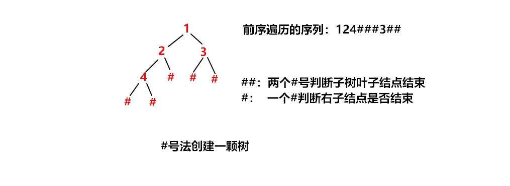
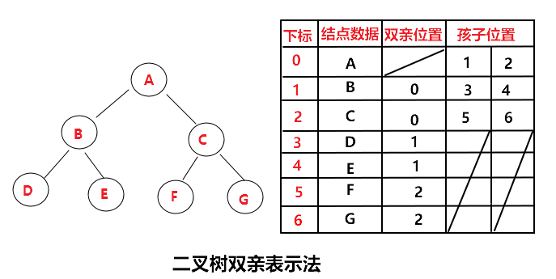
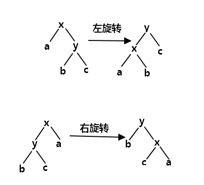
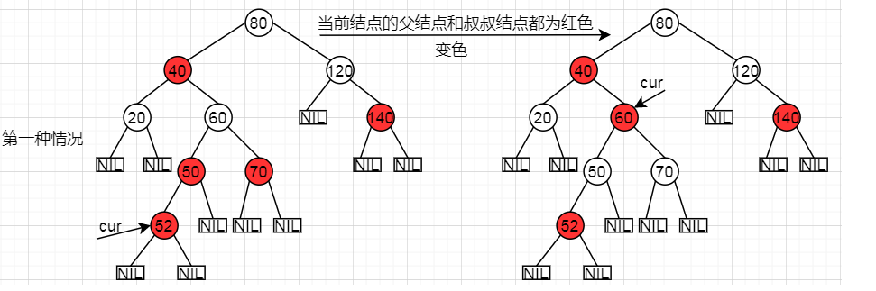

<!--
 * @Author: JohnJeep
 * @Date: 2018-09-20 19:59:50
 * @LastEditTime: 2020-09-03 16:09:23
 * @LastEditors: Please set LastEditors
 * @Description: 数据结构与算法学习笔记
 * @FilePath: /数据结构与算法.md
--> 

<!-- TOC -->

- [0.1. 参考资源](#01-参考资源)
- [0.2. 编写程序需要思考的问题](#02-编写程序需要思考的问题)
- [0.3. 概念](#03-概念)
- [0.4. 代码的规范性](#04-代码的规范性)
- [0.5. 结构体定义（3种）](#05-结构体定义3种)
- [0.6. 链表](#06-链表)
  - [0.6.1. 线性表](#061-线性表)
  - [0.6.2. 循环链表](#062-循环链表)
- [0.7. 栈](#07-栈)
- [0.8. 队列](#08-队列)
- [0.9. 树](#09-树)
  - [0.9.1. 树的存储](#091-树的存储)
  - [0.9.2. 树的创建](#092-树的创建)
  - [0.9.3. 二叉树（binary tree）](#093-二叉树binary-tree)
  - [0.9.4. 遍历二叉树（traverse binary tree）](#094-遍历二叉树traverse-binary-tree)
  - [0.9.5. 二叉搜索树(binary search tree)](#095-二叉搜索树binary-search-tree)
  - [0.9.6. 平衡二叉树（AVL树）](#096-平衡二叉树avl树)
  - [0.9.7. 红黑树（Red black tree）](#097-红黑树red-black-tree)
    - [0.9.7.1. 概念](#0971-概念)
    - [0.9.7.2. 红黑树特点](#0972-红黑树特点)
    - [0.9.7.3. 旋转](#0973-旋转)
    - [0.9.7.4. 插入](#0974-插入)
    - [0.9.7.5. 删除](#0975-删除)
  - [0.9.8. 字典数（trie树）](#098-字典数trie树)
  - [0.9.9. 堆树](#099-堆树)
- [0.10. 算法](#010-算法)
  - [0.10.1. 桶排序](#0101-桶排序)
  - [0.10.2. 堆排序](#0102-堆排序)
  - [0.10.3. 递归](#0103-递归)
  - [0.10.4. 动态规划](#0104-动态规划)
  - [0.10.5. KMP(字符串查找)](#0105-kmp字符串查找)

<!-- /TOC -->

## 0.1. 参考资源
- [visualgo](https://visualgo.net/en/sorting) 是一款可视化学习算法的工具，从简单的排序算法到复杂的图形数据结构和算法都有 
- [Data Structure Visualizations](https://www.cs.usfca.edu/~galles/visualization/Algorithms.html) San Francisco大学计算机学院提供一个可视化的教学资源 
- [algorithm-visualizer](https://algorithm-visualizer.org/) 支持的语言有：Java，C++，JS 等，还有控制台也会输出整个执行的过程，能帮你更好的理解算法。
- [LeetCode上的经典算法解题实战，在实验楼实现](https://www.shiyanlou.com/courses/492)
- [LeetCode 网址](https://leetcode.com/)


## 0.2. 编写程序需要思考的问题 
- 它容易读懂吗？
- 它有完善的文档吗？
- 它容易修改吗？
- 它在运行时需要多大内存？
- 它的运行时间有多长？
- 它的通用性如何？能不能不加修改就可以用它来解决更大范围的问题？
- 它可以在多种机器上编译和运行吗？或者说需要经过修改才能在不同的机器上运行吗？ 


## 0.3. 概念
- 算法：处理问题的策略。
- 数据结构：描述问题的数据模型。
- 程序：计算机按照处理问题的策略，处理问题信息的一组指令集。
- 计算机处理问题的过程（按流程图走向）
  - 具体问题
  - 抽象
  - 问题模型
  - 数据分析
  - 数据结构
  - 算法分析
  - 算法
  - 程序设计
  - 程序
  - 测试通过
  - 问题得以解决
- 程序解题步骤
  - 建模型：给定的条件是什么，得到的结果是什么
  - 设计
    - 数据结构设计：分析数据对象、时间对象间的联系、确定数据对象的存储方式、确定要对数据对象进行的操作
    - 软件结构设计：用“自顶向下，逐步求精”法，把问题分解成规模适中且便于处理的若干模块
    - 算法设计：为每个模块完成的功能进行具体的描述，把功能描述转化为精确到、结构化的过程描述
  - 编程
  - 验证
    - 测试
    - 纠错
- 数据结构的三要素：
  - 逻辑结构（Logic Structure）
    - 集合：结点间无关系
    - 线性结构：结点间一对一关系
    - 树形结构：结点间一对多关系
    - 图形结构：结点间多对多关系
  - 物理结构（Physical Structure）
    - 顺序存储
    - 链式存储
    - 索引存储
    - 散列存储
  - 数据的运算
- 用空间换时间思想：将计算的中间结果缓存下来，从缓存中找出目标结果，以牺牲内存空间来提高时间效率。
- 用时间换空间思想: 对于一些对内存要求比较严格时，需要牺牲时间的执行效率，来换取空间的利用率。


## 0.4. 代码的规范性
- 正确性
- 完整性
- 鲁棒性：程序在执行的时候，可能会出现访问空指针的问题，会导致程序崩溃。


## 0.5. 结构体定义（3种）
- 法一：在定义结构体类型的同时说明结构体变量
  ```
  struct 结构名
  {
      成员表列;
  }变量名表列;
  ```

- 法二:直接说明结构体变量
  ```
  struct
  {
      成员表列;
  }变量名表列;
  ```

- 法三：先定义结构体，在说明结构体变量
  ```
  struct 结构名
  {
      成员表列;
  };
  struct 结构名 变量名表列;
  ```

- 结构体调用
  - <font color=red> . 成员选择结构 </font> `结构体变量名.成员名`
  - <font color=red> -> 成员选择指针 </font> `结构指针->结构成员`


## 0.6. 链表
- 参考
  - [数组、单链表和双链表介绍 以及 双向链表的C/C++/Java实现](https://www.cnblogs.com/skywang12345/p/3561803.html) 


- 链表是一种动态的数据结构，每添加一个结点分配一次内存，占用的内存是连续的，没有闲置的内存
- 数组的内存是一次性分配内存
<p align="center"></p>


### 0.6.1. 线性表
- 同一个线性表中所有的结点都必须是 **相同的数据类型**
- 主要操作
  - 创建
  - 求长度
  - 取元素
  - 定位
  - 插入
  - 删除
  - 遍历

- 链表结点结构
  - `data`：存放结点的值，即为数据域
  - `next`：存放结点的直接后继地址，即为指针域或链域
 - 单链表中的每个结点的存储地址是存放在 **前驱结点next域**中，开始结点无 `前驱`
 - 终端结点无 `后继`，终端结点的 `指针域` 为空
 - 头指针 `head` 指向开始结点
  

结点信息 | 相邻结点地址
---|---
data | next


- 链表操作的精髓：先改变指针指向，再移动指针。

### 0.6.2. 循环链表
- 建立循环链表时，必须使最后一个结点的指针指向表头结点
- 判断是否到表尾时，判断该结点链域的值是否是表头结点，当链域值等于表头指针，说明已到达表尾


## 0.7. 栈
- 栈（stack）是一种特殊的线性表，所有的插入和删除都限制在表的同一端进行。进行插入、删除操作的一端为栈顶（top）,另一端为栈底，栈中没有元素时为空栈。
- 特点：先入后出
- 栈的主要操作
  - 创建：建立一个空栈S
  - 判断栈空：判断栈是否为空
  - 进栈：在栈S中插入元素X，使其成为新的栈顶元素
  - 出栈：删除栈S的栈顶元素
  - 取栈顶元素的值，不改变栈顶的指针
  - 求栈的长度
- 顺序栈：采用一个数组和整型变量实现
  - 数组：顺序存储栈中的元素
  - 整型变量：存储栈元素的下标位置
  - 缺点：栈满后就不能再进栈了。
  - 分类 
    - 静态顺序栈：不能根据需要增大栈的存储空间。
    - 动态顺序栈：根据需要可以增大栈的存储空间。


- 链式栈：采用链表的方式实现栈操作，插入和删除只能在表头进行。


## 0.8. 队列
- 定义
  - 只允许在一端（队尾）进行插入操作，在另一端（队头）进行删除操作的线性表
- 特点： `先入先出` 方式管理的线性表，一般用于数据的缓存。
- 分类
  - 顺序队列：队列的顺序存储结构
  - 循环队列：顺序队列的空间是以循环的方式使用
- 队列规则
  - 排列顺序：结点排成一队，后来的排在队尾
  - 处理过程：在队头处理事件；队列中有元素则一直处理，直到队空或者发生中断事件
- 结论
  - 顺序队列中已经出队的元素不需要删除
  - 顺序队列的存储空间是循环使用
  - 循环队列中头尾指针的计算规则
    - 尾指针：`rear = （rear+1） % 表长(QUEUE_SIZE)`
    - 头指针：`front = （front+1）%表长(QUEUE_SIZE)`
  - 队满状态：`rear+1 = front`
  - 队空状态：`rear = front`
  - 队列中少用一个元素的空间，达到使队满和队空的条件不一样
<p align="center"></p>


- 链队列
  - 用链表的方式实现的队列，仅允许在表头删除和表尾插入的单链表。


## 0.9. 树
- 定义
  > 树是包含n（n≥0）个结点的有限集。在任意一棵非空树中，有且仅有一个称为根的结点；其余结点分为m（m≥0）个互不相交的子集，每个子集又是一棵树，称为根的子树
- 特点
  - 每个结点有零个或多个子结点，无子结点的结点称为 **叶子结点**
  - 没有父结点的结点称为 **根结点**
  - 每一个非根结点有且只有一个父结点
  - 树是非线性结构 
- 树的术语
  - 结点层：规定： 树中根结点的层定义为 1，其余结点的层等于其双亲结点的层加1；根的孩子为第二层结点。
  - **结点的度（degree）**：一个结点拥有的子树个数。作用对象是 结结点`。
  - **树的度**：树中结点度的最大值，即拥有子树个数的最大值。
  - **树的深度（depth）**：也叫数的高度，树中结点的最大层数值
  - 分支结点：也叫非终端结点，度大于 0 的结点
  - 叶子结点：也叫终端结点，是度为 0 的结点
  - 孩子：结点子树的根称为该结点的孩子
  - 双亲：孩子的直接前驱结点称为该结点的双亲
  - 兄弟：同一个双亲的结点互称为兄弟
  - 子孙：以某结点为根的各个子树上的所有结点称为该结点的子孙
  - 祖先：从树根到该结点所经过的所有分支结点称为该结点的祖先
  - 森林（forest）：m（m≥0）个树的集合


### 0.9.1. 树的存储
- 利用数组的下标将离散的树结点的编号一一对应起来。
- 存储原则
  - 存数值、存联系
  - 存的进、取得出
- 存储方式
  - 顺序连续存储
  - 链式离散存储：
    - 二叉链表结点： 一个数据域，两个分别指向左右子结点的指针域。内部数据的指针指向采用长兄为父的思想。
      Lchild | data |Rchild
      ---|---|--- 
    - 三叉链表结点： 一个数据域，两个分别指向左右子结点的指针域，还有一个父结点。
      Lchild | data | parent | Rchild 
      ---|---|---|--- 
    - 双亲结点表示法：在子结点中存储双亲结点的位置。
- 树如何存储在数据库中？
  > 建立两张表，一张存储树结点的表，另一张存储结点与结点之间关系的表。


### 0.9.2. 树的创建
- 利用 `#号法` 进行树的创建。`#号法` 的先序遍历能确定一颗树。
<p align="center"></p>
<p align="center"></p>


### 0.9.3. 二叉树（binary tree）
- 定义：二叉树的定义是递归的，是n(n≥0)个结点的有限集。该集合为空或者由一个根加上两棵互不相交的、分别称为左子树和右子树的二叉树组成。
- 二叉树的双亲表示法
<p align="center"></p>

- 二叉树的操作
  - 创建：建立一棵二叉树，初始化
  - 查找：查找根结点、双亲结点、孩子结点、叶子结点
  - 插入：在指定位置差结点
  - 删除：在指定位置删除结点
  - 遍历：沿着某条搜索线路，依次对二叉树中每个结点均做依次且仅做一次访问
  - 求深度：计算二叉树的高度


- 性质
  - 在二叉树的第 `i` 层上至多有 $2^{i-1}$ 个结点
  - 深度为 `k` 的二叉树上至多有 $2^{k}-1$ 个结点，$k{\geq}1$
  - 设二叉树中有 $n_2$ 个度为 `2` 的结点，$n_1$ 个度为 `1` 的结点，$n_0$ 个度为 `0` 的结点，则有：$n_0 = n_2 + 1$，分支总数 = $n_1 + 2n_2$，结点总数 = $n_0 + n_1 + n_2$
  - 具有 `n` 个结点的完全二叉树的深度为 $k=[log_2 n] + 1$
  

- 完全二叉树（complete binary tree）
  - 定义：
    - 第一种：每一棵树除最下层外，每一层的结点数均达到最大值，在最下层只缺少右边的若干结点。
    - 第二种：先给满树编号，根结点编号为 `1`，从根结点开始自上而下，自左向右进行编号，若去掉树中的若干结点后，树的编号依然连续，则是完全二叉树。
  - 特点
    - 前 `k－1` 层是满的，第 `k` 层可以不满，但第 `k` 层结点集中在 `左侧`。
    - 完全二叉树是满二叉树的一部分，而满二叉树是完全二叉树的特例。
    - `n` 个结点的完全二叉树的树深度为 $[log_2 n]+1$，其中$[log_2 n]$ 向下取整数。


- 满二叉树（full binary tree）
  - 定义：除了叶子结点以外每一个结点都有左右子树且叶子结点都处在最底层上。
  - 特点
    - 每一层上的结点数总是达到最大的结点数。
    - 所有分支结点都有左、右子树。
    - 深度为 `k` 的满二叉树，结点总数为： $2^{k} - 1$ 
    - 第 `i` 层上的结点数为 $2^{i-1}$
    - 一个层数为 `i` 的满二叉树的叶子结点个数（也就是最后一层）为 $2^{i-1}$


### 0.9.4. 遍历二叉树（traverse binary tree）
- 先序遍历（inorder tree walk）：（根-->左-->右）
    1. 访问根结点 
    2. 先序遍历左子树 
    3. 先序遍历右子树 
- 中序遍历（preorder tree walk）：（左-->根-->右） 
    1. 中序遍历左子树 
    2. 访问根结点 
    3. 中序遍历右子树 
- 后序遍历（postorder tree walk）：（左-->右-->根）  
    1. 后序遍历左子树 
    2. 后序遍历右子树 
    3. 最后访问根结点


- 无论是采用先序遍历、中序遍历还是后序遍历，算法遍历的过程是一样的，只是访问树结点的时机不一样。
- 前序遍历和中序遍历不采用非递归的方法时，采用栈的思想，因为先经过的结点后访问。后序遍历采用堆的思想实现。
- 非递归中序遍历步骤
  - 步骤一：若结点有左子树，则该结点入栈；若结点没有左子树，则访问该结点。
  - 步骤二：若结点有右子树，则重复步骤 1；若结点没有右子树，则结点访问结束，根据栈顶指示，访问栈顶元素，进行出栈。
  - 步骤三：若栈为空，则遍历结束。


- 如何确定一棵树？ 
  - 通过先序遍历和中序遍历可以确定一棵树。
    - 步骤一：根据`先序遍历` 的序列得到根结点的位置，再由根结点在 `中序遍历` 中的位置得到左右子树的集合；
    - 步骤二：在左子树集合中根据先序遍历得到左子树集合的根结点，重复步骤一；
    - 步骤三：在右子树集合中根据先序遍历得到右子树集合的根结点，重复步骤一；
  - 通过 `中序遍历` 和 `后序遍历` 可以确定一棵树。
  - 通过 `先序遍历` 和 `后序遍历` 不能确定一棵树。


[DFS与BFS对比](https://www.cnblogs.com/wzl19981116/p/9397203.html)

- `DFS(Deep First Search)` 深度优先搜索

- `BFS(Breath First Search)` 广度优先搜索


### 0.9.5. 二叉搜索树(binary search tree)
- 什么是二叉搜索树？
  > 二叉搜索树是一种特殊的二叉树，实现更快速的查找。一棵树用链表数据结构表示，每个结点就是一个对象。
- 性质
  - 树中的任意一个结点都大于等于它左子树中的结点，小于等于它右子树中的结点。 
  - 在一棵高度为 h 的二叉搜索树上，动态集合上的操作 Search、Minimum、Maximum、Successor、Predecessor可以在 `O(h)` 时间内完成。
  - 在一棵高度为 h 的二叉搜索树上，动态集合操作Insertion、Deletion的运行时间均为 `O(h)` 或 `lg(n)`


- 查找
  * 如果二叉查找树为空，则返回空；
  * 如果二叉查找树不为空
    * 先查找取根结点，如果结点 X 等于根结点，则返回；
    * 如果结点小于根结点，则递归查找左子树；
    * 如果结点大于根结点，则递归查找右子树。

- 查找最大、最小结点
  * 若二叉搜索树为空，则返回空。
  * 若二叉搜索树不为空
    * 判断是否只有一个结点（即只有根结点），如果是则返回根结点，否则就到右子树中递归查找，找到最大结点。
    * 同理，查找最小结点类似，只是到左子树中查找而已。 

- 插入
  * 若树为空，则直接插入新结点。
  * 若树不为空时
    * 如果要插入的结点比根结点大，则到右子树中插入新数据。如果右子树为空，则将新数据直接插入到右子结点的位置；如果右子树不为空，则继续遍历右子树，查找插入位置。
    * 如果要插入的结点比根结点小，则到左子树中插入新数据。如果左子树为空，则将新数据直接插入到左子结点的位置；如果左子树不为空，则继续遍历左子树，查找插入位置。

- 删除
  * 要删除的结点没有子结点时，删除结点并修改它的父结点，用NULL作为孩子来替换要删除的结点。
  * 要删除的结点只有一个结点，即只有左子结点或右子结点时，用左结结点或右子结点来替换要删除的结点，并修改要删除结点的父结点。
  * 要删除的结点有两个子树结点
    * 先查找要删除结点的后继结点，若这个后继结点没有左孩子且位于要删除结点的右子树中，则用这个后继结点来替换树中要删除的结点。
    * 若要删除结点的后继结点位于要删除结点的右子树中，但不是要删除结点的直系右孩子，则需要先用要删除结点的后继结点的右孩子去替换要删除结点的后继结点，再用要删除结点的后继结点去替换需要删除的结点。


### 0.9.6. 平衡二叉树（AVL树）
- 参考
  - [维基百科解释AVL树](https://zh.wikipedia.org/wiki/AVL%E6%A0%91)  


- 概念：平衡二叉树是一颗空树或者左右两个子树的高度差的绝对值不超过 1，并且左右两个子树都是一颗平衡二叉树。


### 0.9.7. 红黑树（Red black tree）
- 参考
  - [Github详解：教你透彻了解红黑树](https://github.com/julycoding/The-Art-Of-Programming-By-July/blob/master/ebook/zh/03.01.md)
  - [维基百科解释红黑树](https://zh.wikipedia.org/wiki/%E7%BA%A2%E9%BB%91%E6%A0%91)
  - [漫画：什么是红黑树？](https://zhuanlan.zhihu.com/p/31805309)
  - [红黑树(一)之 原理和算法详细介绍](https://www.cnblogs.com/skywang12345/p/3245399.html)


#### 0.9.7.1. 概念
- 什么是红黑树？
  > 红黑树是一颗二叉搜索树，它在每个结点上增加了一个存储位来表示结点的颜色，结点的颜色为红色或黑色。通过对任何一条从根结点到叶子结点路径上各个结点的颜色进行约束，确保红黑树上没有一条路径会比其它的路径长出 2 倍，使红黑树近似是平衡的。


#### 0.9.7.2. 红黑树特点
1. 每个结点是红色或黑色。
2. 根结点是黑色。
3. 所有叶子都是黑色（叶子是指针为空的的结点）。
4. 如果一个结点是红色的，则它的两个子结点是黑色。（每个叶子到根的所有路径上不能有两个连续的红色结点。）
5. 任意一结点到每个叶子结点的路径都包含数量相同的黑结点。（红黑树黑色结点的高度等于它根结点的黑色结点高度。）
6. 如果一个结点存在黑子结点，那么该结点肯定有两个子结点
<p align="center"></p>

- 注意点
  - 红黑树是平衡二叉查找树的一种变体。
  - 红黑树的时间复杂度：$lg(n)$
  - 一颗有 `n` 个结点的红黑树的高度最多为 $2*lg(n+1)$

- 应用场景
  - 红黑树主要用来存储有序的数据。
  - 适合排序，查找的场景。
  - 容器的基本组成，如Java中的HashMap/TreeMap，STL中的set、map等。
  - Linux内核的完全公平调度器和Linux的虚拟内存管理
  - Linux中epoll机制的实现


#### 0.9.7.3. 旋转
- 为什么红黑树要旋转？
  > 添加或删除红黑树中的结点之后，红黑树的结构发生了变化，可能不满足红黑树的5条性质，也就不再是一颗红黑树了，而是一颗普通的树。通过旋转，可以使这颗树重新成为红黑树。为了维护这些特性，必须要改变树中某些结点的颜色和指针结构。

- 左旋：逆时针旋转红黑树的结点，使被旋转结点的右孩子成为被旋转结点的父结点，被旋转的结点成为新树的左孩子，被旋转结点的右孩子的左结点成为被旋转结点的右孩子。
- 右旋：顺时针旋转红黑树的结点，使被旋转结点的左孩子成为被旋转结点的父结点，被旋转的结点成为新树的右孩子，被旋转结点的左孩子的右结点成为被旋转结点的左孩子。
<p align="center"></p>

- 变色：结点变化后的红黑树必须重新满足红黑树的性质，则需要把红色结点变为黑色，或者把黑色结点变为红色。

> 红黑树旋转和变色的核心思想：将红色结点移动到根结点，再将根结点设置为黑色。


#### 0.9.7.4. 插入
- 为什么红黑树中新插入的结点必须是红色？
> 一颗正常的红黑树中新插入的结点不是红色时，否则就违反了红黑树的性质 4：每个叶子结点到根结点的所有路径上不能有两个连续的红色结点。
- 插入前需要找到结点插入的位置，如果插入结点小于当前遍历到的结点，则到当前结点的左子树中继续查找；如果插入结点大于当前结点，则到当前结点的右子树中继续查找。

- 新插入的结点为红色结点时，分为以下几种情况
  1. 若被插入的结点是根结点，直接把此结点涂为黑色。
  2. 若被插入的结点的父结点是黑色，结点被插入后，没有违反红黑树的性质，仍然是红黑树。
  3. 若被插入的结点的父结点是红色，违反了红黑树的特性，需要做旋转和变色处理。
    - 若当前结点的父结点和叔叔结点为红色时
      1. 将父结点和叔叔结点设置为黑色，     
      2. 如果此时祖父结点是根结点，则则直接将祖父结点设置为黑色。
      3. 如果此时祖父结点不是根结点，则将祖父结点（父结点的父结点）设置为红色，并将祖父结点更新为新的当前结点，然后再对祖父结点进行后续的操作。     
      <p align="center"></p>

      - 若新的当前结点的父结点为红色，叔叔结点为黑色，且新的当前结点是其父结点的右孩子 
        1. 将父结点重新作为新的当前结点
        2. 以新的当前结点为支点进行左旋。此时新的当前结点满足左旋的特点，因此要用左旋来改变红黑树的结构。
        3. 如果原来的当前结点经过旋转后变为根结点，则直接将其设置为黑色。
        4. 如果原来的当前结点经过旋转后不是根结点，则需要将原来当前结点的父结点设置为新的当前结点。
        <p align="center"></p>

      - 若新的当前结点的父结点为红色，叔叔结点为黑色，且新的当前结点是其父结点的左孩子
        - 将父结点设置为黑色，祖父结点设置为红色
        - 以祖父结点为支点进行右旋  
        <p align="center"></p>


#### 0.9.7.5. 删除
- 将红黑树当作一颗二叉查找树，待删除的结点按照儿子的个数，删除时分为3种情况。
  1. 被删除结点没有儿子，即为叶子结点。那么，直接将该结点删除就OK了 
  2. 若果被删除结点只有一个儿子，那么直接删除该结点，并用该结点的唯一子结点顶替它的位置。
  3. 删除的结点有两个儿子。先找到要删除结点的后继结点，然后把它后继结点内的值复制给当前要删除的结点，再删除它的后继结点。巧妙地利用了删除后继结点达到删除当前结点的目的。
    > 当被删除结点有两个非空子结点的情况时，该结点的后继结点要么没有儿子，要么 只有一个儿子；若只有没有儿子，则按第一种情况处理，若只有一个儿子，则按第二种情况处理。


- 如果删除的是红色结点，那么原红黑树的性质依旧保持，此时不用做修正操作；如果删除的结点是黑色结点，原红黑树的性质可能会被改变，我们要对其做修正操作。
  - 结点删除时，红黑树的哪些特性会发生变化？
    - 如果删除的结点不是树唯一结点，那么删除结点的那一个支到各叶结点的黑色结点数会发生变化，此时性质5被破坏。
    - 如果被删结点的唯一非空子结点是红色，而被删结点的父结点也是红色，那么性质4被破坏。
    - 如果被删结点是根结点，而它的唯一非空子结点是红色，则删除后新根结点将变成红色，违背性质2。


- 如何进行删除分析？


### 0.9.8. 字典数（trie树）
- 是一种专门处理字符串匹配的数据结构，用来解决在一组字符串集合中快速查找某个字符串的问题
- 特点
  - 根结点不包含字符，除根结点外的每一个子结点都包含一个字符。
  - 从根结点到某一结点，路径上经过的字符连接起来，就是该结点对应的字符  串。
  - 每个字符串的公共前缀作为一个字符结点保存。

- 缺点
  - 构造Trie树需要很大的内存空间。因为父子字符结点之间用 指针关联。如果用数组保存这些指针，这意味着子结点的数组需要穷举出每一种可能。

- 应用场景
  - 关键词匹配，提示，纠错。
  - 最长公共前缀匹配。
  - 命令自动补全，如zsh.
  - 网址浏览历史记录。
  - 手机号码簿查询


### 0.9.9. 堆树
- 参考
  - [堆树（最大堆、最小堆）详解](https://blog.csdn.net/guoweimelon/article/details/50904346)
  - [彻底弄懂最大堆的四种操作(图解+程序)（JAVA）](https://www.iteye.com/blog/128kj-1728555)
  - [堆排序](https://www.cnblogs.com/dolphin0520/archive/2011/10/06/2199741.html)
  - [算法】堆，最大堆（大顶堆）及最小堆（小顶堆）的实现](https://blog.csdn.net/cdnight/article/details/11650983?utm_medium=distribute.pc_relevant_t0.none-task-blog-BlogCommendFromMachineLearnPai2-1.nonecase&depth_1-utm_source=distribute.pc_relevant_t0.none-task-blog-BlogCommendFromMachineLearnPai2-1.nonecase)


- 堆是一种特殊的二叉树。
- 当树根值为最大值，则为最大堆；
    - 一颗完全二叉树中，任意一个结点的值总是小于等于根结点的值。
- 当树根值为最小值，则为最小堆；
    - 一颗完全二叉树中，任意一个结点的值总是大于等于根结点的值。

- 当前结点（根结点除外）与父结点和子结点地址、数据值之间的关系
  - 父结点的索引值等于当前结点的索引值的 `1/2 `
  - 左子结点的索引值等于当前结点的索引值的 `2倍`
  - 右子结点的索引值等于当前结点的索引值的 `2倍加1`
   <p align="center"></p>

- 结点的插入、删除操作
  - 添加新元素的时候，先存放到数组的尾部，然后在通过自下向上重新排序，使加添新元素后的二叉树，满足为堆数据结构的特性。
   - 删除元素时，一般默认删除第一个根结点，将数组的最后一个元素放到根结点的位置，之后通过自上而下重排序，使删除元素后的二叉树也满足堆数据结构的特性。


## 0.10. 算法
- 参考
  - [排序算法时间复杂度、空间复杂度、稳定性比较](https://blog.csdn.net/yushiyi6453/article/details/76407640) 


排序算法时间复杂度、空间复杂度、稳定性比较
<p align="center"></p>


### 0.10.1. 桶排序
- 参考
  - [桶排序详解](https://www.cnblogs.com/skywang12345/p/3602737.html) 


### 0.10.2. 堆排序
- 参考
  - [堆排序详解 ](https://www.cnblogs.com/skywang12345/p/3602162.html)


### 0.10.3. 递归
- 函数自己调用自己。
- 缺点：
  - 需要消耗时间和空间：每一次函数调用，都需要在栈上分配空间来保存参数、返回地址和临时变量，而且往栈里面压入数据和弹出数据都需要时间的。 
  - 可能会导致栈溢出。
  - 递归分解的子问题中存在大量重复的计算，导致效率较低。


### 0.10.4. 动态规划
- 求一个问题的最优解，通常是最大值或最小值，而且问题可以分解为若干个子问题，并且子问题之间还有重叠的更小的子问题。 
- 从上往下分析问题，从下往上求解问题。 


### 0.10.5. KMP(字符串查找)
- 参考
  - [从头到尾彻底理解KMP（2014年8月22日版）](https://blog.csdn.net/v_JULY_v/article/details/7041827) 