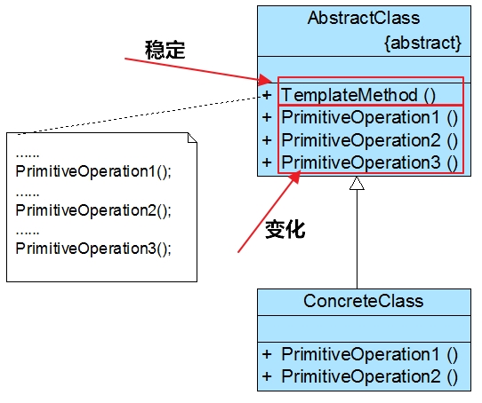
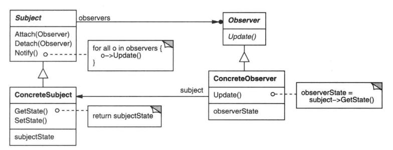
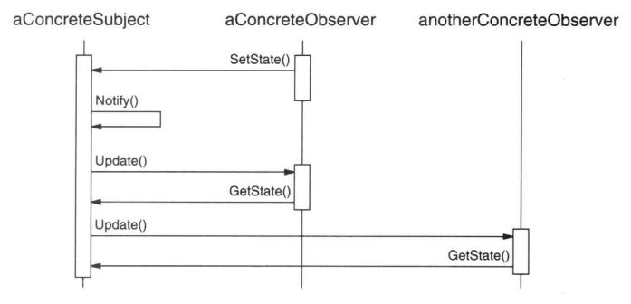
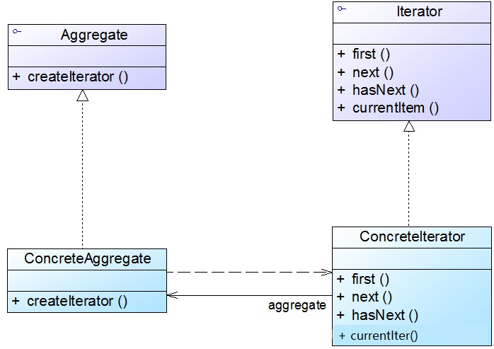
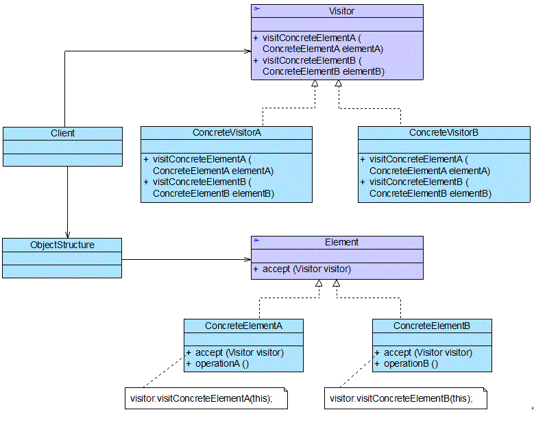

<!--
 * @Author: JohnJeep
 * @Date: 2020-08-06 22:20:12
 * @LastEditTime: 2021-01-19 23:26:40
 * @LastEditors: Please set LastEditors
 * @Description: 设计模式学习
-->
<!-- TOC -->

- [0.1. 参考](#01-参考)
- [## 0.2. 思考](#-02-思考)
- [0.3. 设计模式概括](#03-设计模式概括)
- [0.4. 设计模式原则](#04-设计模式原则)
- [0.5. 创建型模式](#05-创建型模式)
  - [0.5.1. **单例模式(Singleton)**](#051-单例模式singleton)
  - [0.5.2. **工厂模式(Factory Method)**](#052-工厂模式factory-method)
  - [0.5.3. **抽象工厂模式(Abstract Factory)**](#053-抽象工厂模式abstract-factory)
  - [0.5.4. **建造者模式(Builder)**](#054-建造者模式builder)
  - [0.5.5. 原型模式(Prototype)](#055-原型模式prototype)
- [0.6. 结构型模式](#06-结构型模式)
  - [0.6.1. 组合模式(Composite)](#061-组合模式composite)
  - [0.6.2. **代理模式(Proxy)**](#062-代理模式proxy)
  - [0.6.3. **装饰模式(Decorator)**](#063-装饰模式decorator)
  - [0.6.4. **适配器(Adapter)**](#064-适配器adapter)
  - [0.6.5. **桥接模式(Bridge)**](#065-桥接模式bridge)
  - [0.6.6. 外观模式(Facade)](#066-外观模式facade)
  - [0.6.7. 享元模式(Flyweight)](#067-享元模式flyweight)
- [0.7. 行为型模式](#07-行为型模式)
  - [0.7.1. **模板方法模式(Template Method)**](#071-模板方法模式template-method)
  - [0.7.2. **命令模式(command)**](#072-命令模式command)
  - [0.7.3. **策略模式(strategy)**](#073-策略模式strategy)
  - [0.7.4. **中介者模式(mediator)**](#074-中介者模式mediator)
  - [0.7.5. **观察者模式(observer)**](#075-观察者模式observer)
    - [0.7.5.1. 什么是Observer？](#0751-什么是observer)
    - [0.7.5.2. 为什么要用observer？](#0752-为什么要用observer)
    - [0.7.5.3. 怎样去使用observer？](#0753-怎样去使用observer)
    - [0.7.5.4. 优缺点](#0754-优缺点)
    - [0.7.5.5. 使用时注意事项？](#0755-使用时注意事项)
    - [0.7.5.6. Relations with Other Patterns](#0756-relations-with-other-patterns)
  - [0.7.6. **迭代模式(iterator)**](#076-迭代模式iterator)
  - [0.7.7. **访问者模式(visitor)**](#077-访问者模式visitor)
  - [0.7.8. 责任链模式(chain of responsibility)](#078-责任链模式chain-of-responsibility)
  - [0.7.9. 备忘录模式(memento)](#079-备忘录模式memento)
  - [0.7.10. 状态模式(state)](#0710-状态模式state)
  - [0.7.11. 解释模式(interpreter)](#0711-解释模式interpreter)

<!-- /TOC -->

## 0.1. 参考
- [Wiki解释设计模式](https://en.wikipedia.org/wiki/Software_design_pattern)：具有权威性和系统性。
- [设计模式：可复用面向对象软件的基础](https://en.wikipedia.org/wiki/Design_Patterns)：Wiki中关于GOF这本设计模式数据的描述，很有权威性。
- [GoF Design Patterns reference](http://w3sdesign.com/index0100.php): Learning Object-Oriented Design & Programming。
- [Design Patterns](https://refactoring.guru/design-patterns): 这是一本关于设计模式及其背后原则的电子书籍。比较详细的介绍了设计模式的用法，很通俗易懂。
- [史上最全设计模式导学目录（完整版）](https://blog.csdn.net/lovelion/article/details/17517213)：推荐指数五颗星；刘伟老师力作，讲的非常好，通俗易懂，而且举例的应用场景也非常恰当。
- [图说设计模式](https://design-patterns.readthedocs.io/zh_CN/latest/#) 推荐指数四颗星；利用许多的图例去描述每一种设计模式的过程，值得参考学习。
- [Github: 学习并理解 23 种设计模式](https://github.com/xietao3/Study-Plan/tree/master/DesignPatterns) 推荐指数四颗星；Github上笔者记录自己学习设计模式的笔记。
- [Trip-to-iOS-Design-Patterns](https://github.com/skyming/Trip-to-iOS-Design-Patterns)：推荐指数三颗星；Github上笔者从设计模式、架构、实践三个方面梳理了 iOS 架构的设计，推荐了许多不错的学习设计模式的书籍和诸多实战的项目。
- [JAVA设计模式总结之23种设计模式](https://www.cnblogs.com/pony1223/p/7608955.html)
- [JAVA设计模式总结之六大设计原则](https://www.cnblogs.com/pony1223/p/7594803.html)


## 0.2. 思考
---------------
* Elements of Reusable Object-Oriented Software(可复用面向对象软件)
* 只有理解了模式，你才能清楚代码中的运行时刻结构。
* 建立一套思维和一套模型
* 设计模式：在变化和稳定中寻找一个平衡点。
* 设计模式之间应该相互配合，共同解决问题。
* 《The Timeless Way of Building》 Christopher Alexander著作
* 层次：分析、设计实现。

---------------


1. 设计模式是做什么的？
2. 它的基本原理和意图是什么？
3. 它解决的是什么样的特定设计问题？
4. 什么时候、什么地方去使用该设计模式？
5. 该设计模式可用来改良哪些不良的设计？
6. 你怎样识别这些情况？
7. 参与者：设计模式中的类或对象以及它们各自的职责？
8. 模式的参与者怎样协作以及实现它们的职责？
9. 模式怎样支持它们的目标？
10. 使用设计模式的效果和所需做的权衡取舍？系统结构的哪些方面可以独立改变？
11. 实现设计模式时需要知道的提示、技术要点及应避免的缺陷？以及是否存在某些特定于实现语言的问题。
12. 与这个模式紧密相关的模式有哪些？其间重要的不同之处是什么？这个应与其它的哪些模式一起使用？


## 0.3. 设计模式概括
三大类型设计模式，共23种。按照目的准则可将设计模式分为下面三大类。
- 创建型模式(Creational patterns)：共5种；
  > 提供对象创建机制，以提高灵活性和现有代码的重用性，在系统的某个地方实例化具体的类。通过抽象对象的创建过程，创建型模式提供不同的方式在实例化时建立接口和实现的透明连接。创建型模式确保你的系统是针对接口的方式书写的，而不是针对实现而书写的。
  - 工厂方法模式（factory method pattern）
  - 抽象工厂模式（abstract factory pattern）
  - 建造者模式（builder pattern）
  - 单例模式（singleton pattern）
  - 原型模式（prototype pattern） 


- 结构型模式(Structural patterns)：如何将对象和类组装为更大的结构，同时保持结构的灵活性和效率，共7种。
  - 代理模式（proxy pattern）  
  - 装饰者模式（decorator pattern）
  - 适配器模式（adapter pattern）
  - 桥接模式（bridge pattern）
  - 组合模式（composite pattern）
  - 外观模式（facade pattern）
  - 享元模式（flyweight pattern）


- 行为型模式(Behavioural patterns)：对类或对象怎样交互和怎样分配职责，共11种。
  - 模板方法模式（template method pattern） 
  - 命令模式（command pattern）
  - 责任链模式（chain of responsibility pattern）
  - 策略模式（strategy pattern）
  - 中介者模式（mediator pattern）
  - 观察者模式（observer pattern）
  - 备忘录模式（memento pattern）
  - 访问者模式（visitor pattern）
  - 状态模式（state pattern）
  - 解释模式（interpreter pattern）
  - 迭代模式（iterator pattern）


## 0.4. 设计模式原则
- 使用设计模式的最终目的：高内聚，低耦合。
- 8种基本原则
  - 依赖倒置原则（DIP: dependence inversion principle）：依赖于抽象接口，不要依赖于具体的类，即针对接口编程。
  - 开放封闭原则（OCP）：类的改动是通过增加代码来进行的，而不是修改源代码。
  - 迪米特原则（LOD：low of demeter）：一个对象应该对其它的对象尽可能少的了解，从而降低各个对象之间的耦合，提高系统的可维护性。
    > 例如：在一个程序中，各个模块之间相互调用时，通常会提供一个统一的接口来实现，使其它的模块不需要了解另一个模块的内部实现，这样当一个模块发生改变时，其它的模块不会受到影响。
  - 单一责任原则（SRP）：一个类应该仅有一个引起它变化的原因，变化的方向隐含着类的责任。
  - 替换原则（LSP）：子类必须能够替换它们的基类。
  - 接口隔离原则（ISP）：不应该强迫客户程序依赖它们不用的方法。
  - 优先使用对象组合而不是类继承：继承在某种程度上破坏了封装性，子类父类耦合度高；对象组合则只要求被组合的对象具有良好定义的接口，耦合度较低。
  - 封装变化点：使用封装来创建对象之间的分界层，让设计者可以在分界层的一侧进行修改，而不会对另一侧产生不良的影响，从而实现层次间的松耦合。
  - 针对接口编程，而不是针对实现编程。
    * 不将变量类型声明为某个特定的具体类，而是声明为某个接口。
    * 客户程序无需获知对象的具体类型，只需要知道对象所具有的接口。
    * 减少系统中各部分的依赖关系，从而实现“高内聚、松耦合”的类型设计方案。


## 0.5. 创建型模式

**简单工厂模式**
> 简单工厂模式(Simple Factory Pattern)：专门定义一个类（工厂类）来负责创建其他类的实例。可以根据创建方法的参数来返回不同类的实例，被创建的实例通常都具有共同的父类。

- 举例：
  简单工厂模式像一个代工厂，一个工厂可以生产多种产品。举个例子，一个饮料加工厂同时帮百事可乐和可口可乐生产，加工厂根据输入参数``Type``来生产不同的产品。

- 优点
   * 使用者只需要给工厂类传入一个正确的约定好的参数，就可以获取你所需要的对象，而不需要知道其创建细节，一定程度上减少系统的耦合。
  * 客户端无须知道所创建的具体产品类的类名，只需要知道具体产品类所对应的参数即可，减少开发者的记忆成本。
  
- 缺点
  * 如果业务上添加新产品的话，就需要修改工厂类原有的判断逻辑，这其实是违背了开闭原则的。
  * 在产品类型较多时，有可能造成工厂逻辑过于复杂。所以简单工厂模式比较适合产品种类比较少而且增多的概率很低的情况。


### 0.5.1. **单例模式(Singleton)**
- 参考
  - [java单例模式](https://blog.csdn.net/czqqqqq/article/details/80451880)
  - [设计模式之单例模式](https://segmentfault.com/a/1190000015950693)：segmentfault上面使用C++实现的单例模式。


- 定义：保证一个类只能生成一个唯一的实例对象，同时提供该实例访问的全局方法。
- 实现的步骤
  - 构造函数私有化，禁止他人创建
  - 提供一个全局的静态方法
  - 在类中定义一个静态指针，指向该类变量的静态变量指针
- 单例模式优点
  - 在内存中只有一个对象，节省内存空间；
  - 避免频繁的创建销毁对象，可以提高性能；
  - 避免对共享资源的多重占用，简化访问；
  - 为整个系统提供一个全局访问点。
- 注意事项
  - 在使用单例模式时，我们必须使用单例类提供的公有工厂方法得到单例对象，而不应该使用反射来创建，否则将会实例化一个新对象。此外，在多线程环境下使用单例模式时，应特别注意线程安全问题
  - 想要实现高效率的多线程安全的单例模式，应注意
    - 尽量减少同步块的作用域；
    - 尽量使用细粒度的锁


- 单线程下实现单例模式
  - 懒汉式：等到真正使用的时候才去创建实例，不用时不去主动创建
  - 饿汉式：在类加载初始化的时候就主动创建实例


- 多线程下实现单例模式
  - 多线程下，懒汉式的实现时不安全的，饿汉式方法实现是安全的。
  - Java中如何解决线程不安全的问题？
    - Java中使用 `synchronized方法`
      ```
      // 线程安全的懒汉式单例
      public class Singleton2 {
          private static Singleton2 singleton2;
          private Singleton2(){}
          // 使用 synchronized 修饰，临界资源的同步互斥访问
          public static synchronized Singleton2 getSingleton2(){
              if (singleton2 == null) {
                  singleton2 = new Singleton2();
              }
              return singleton2;
          }
      }

      // 优缺点
         1、运行效率低，因为同步块的作用域很大，锁的粒度有点粗
         2、保证了对临界资源的同步访问
      ```
    - Java中使用 `synchronized块`
      ```
      // 线程安全的懒汉式单例
      public class Singleton2 {
          private static Singleton2 singleton2;
          private Singleton2(){}
          public static Singleton2 getSingleton2(){
              synchronized(Singleton2.class){  // 使用 synchronized 块，临界资源的同步互斥访问
                  if (singleton2 == null) { 
                      singleton2 = new Singleton2();
                  }
              }
              return singleton2;
          }
      }

      // 行效率仍然比较低，事实上，和使用synchronized方法的版本相比，基本没有任何效率上的提高。
      ```
    - 使用 `内部类的懒汉式`
      ```
      // 线程安全的懒汉式单例
      public class Singleton5 {
          // 私有内部类，按需加载，用时加载，也就是延迟加载
          private static class Holder {
              private static Singleton5 singleton5 = new Singleton5();
          }
          private Singleton5() {
      
          }
          public static Singleton5 getSingleton5() {
              return Holder.singleton5;
          }

        // 效率比较高
      ```
    - 使用 `双重检测机制`
    ```
      // 线程安全的懒汉式单例
      public class Singleton3 {
      
          //使用volatile关键字防止重排序，因为 new Instance()是一个非原子操作，可能创建一个不完整的实例
          private static volatile Singleton3 singleton3;
      
          private Singleton3() {
          }
      
          public static Singleton3 getSingleton3() {
              // Double-Check idiom
              if (singleton3 == null) {
                  synchronized (Singleton3.class) {       // 1
                      // 只需在第一次创建实例时才同步
                      if (singleton3 == null) {       // 2
                          singleton3 = new Singleton3();      // 3
                      }
                  }
              }
              return singleton3;
          }
      }

      // 保证了单例，提高了效率
      // 必须使用volatile关键字修饰单例引用。目的：解决指令重排序的问题
    ``` 
  - 借助 ` ThreadLocal`
    ```
    // 线程安全的懒汉式单例
    public class Singleton4 {
    
      // ThreadLocal 线程局部变量
      private static ThreadLocal<Singleton4> threadLocal = new ThreadLocal<Singleton4>();
      private static Singleton4 singleton4 = null;

      private Singleton4(){}

      public static Singleton4 getSingleton4(){
          if (threadLocal.get() == null) {        // 第一次检查：该线程是否第一次访问
              createSingleton4();
          }
          return singleton4;
      }

      public static void createSingleton4(){
          synchronized (Singleton4.class) {
              if (singleton4 == null) {          // 第二次检查：该单例是否被创建
                  singleton4 = new Singleton4();   // 只执行一次
              }
          }
          threadLocal.set(singleton4);      // 将单例放入当前线程的局部变量中 
      }
    }

    // 作用：将临界资源线程局部化
    // 使用ThreadLocal的实现在效率上还不如双重检查锁定。
    ``` 

  几种方式实现单例模式的对比
  单例模式  | 是否线程安全 | 是否懒加载  | 是否防止反射构建
  --- | --- | --- | ---
  双重锁检测 | 是 | 是 | 否
  静态内部类 | 是 | 是 | 否
  枚举       | 是 | 否 | 是


### 0.5.2. **工厂模式(Factory Method)**
- 什么是 Factory Method ？
  > 工厂方法模式(Factory Method Pattern)又称为工厂模式，工厂父类负责定义创建产品对象的公共接口，而工厂子类则负责生成具体的产品对象，即通过不同的工厂子类来创建不同的产品对象。Factory Method使一个类的实例化延迟到其子类。

- 举例子：工厂方法和简单工厂有一些区别，简单工厂是由一个代工厂生产不同的产品，而工厂方法是对工厂进行抽象化，不同产品都由专门的具体工厂来生产。可口可乐工厂专门生产可口可乐，百事可乐工厂专门生产百事可乐。

- 优点
  * 用户只需要关心其所需产品对应的具体工厂是哪一个即可，不需要关心产品的创建细节，也不需要知道具体产品类的类名。
  * 当系统中加入新产品时，不需要修改抽象工厂和抽象产品提供的接口，也无须修改客户端和其他的具体工厂和具体产品，而只要添加一个具体工厂和与其对应的具体产品就可以了，符合了开闭原则。

- 缺点
  * 当系统中加入新产品时，除了需要提供新的产品类之外，还要提供与其对应的具体工厂类。因此系统中类的个数将成对增加，增加了系统的复杂度。


### 0.5.3. **抽象工厂模式(Abstract Factory)**
> 抽象工厂模式(Abstract Factory Pattern)：提供一个创建一系列相关或相互依赖对象的接口，而无须指定它们具体的类。

- 举例子：抽象工厂和工厂方法不同的地方在于，生产产品的工厂是抽象的。举例，可口可乐公司生产可乐的同时，也需要生产装可乐的瓶子和箱子，瓶子和箱子也是可口可乐专属定制的，同样百事可乐公司也会有这个需求。这个时候我们的工厂不仅仅是生产可乐饮料的工厂，还必须同时生产同一主题的瓶子和箱子，所以它是一个抽象的主题工厂，专门生产同一主题的不同商品。

- UML图


- 优点
  * 具体产品在应用层代码隔离，不需要关心产品细节。只需要知道自己需要的产品是属于哪个工厂的即可 当一个产品族中的多个对象被设计成一起工作时，它能够保证客户端始终只使用同一个产品族中的对象。这对一些需要根据当前环境来决定其行为的软件系统来说，是一种非常实用的设计模式。
  
- 缺点
  * 规定了所有可能被创建的产品集合，产品族中扩展新的产品困难，需要修改抽象工厂的接口。

- 工厂模式与抽象工厂模式的区别
  >工厂模式只能生产一个产品；而抽象工厂模式可以产生一列的产品。


### 0.5.4. **建造者模式(Builder)**
- 什么是 Builder Pattern?
  > 建造者模式(Builder Pattern)将一个复杂对象的构建与它的表示进行分离，使得同样的构建过程可以创建不同的表示。


- 适用性
  - 创建复杂对象的算法应该独立于该对象的组成部分以及它们的装配方式。
  - 构造过程必须允许被构造的对象有不同的表示


- UML图


- 优点
  * 客户端不必知道产品内部组成的细节，将产品本身与产品的创建过程解耦，使得相同的创建过程可以创建不同的产品对象。
  * 每一个具体建造者都相对独立，而与其他的具体建造者无关，因此可以很方便地替换具体建造者或增加新的具体建造者， 用户使用不同的具体建造者即可得到不同的产品对象 。
  * 增加新的具体建造者无须修改原有类库的代码，指挥者类针对抽象建造者类编程，系统扩展方便，符合“开闭原则”。
  * 可以更加精细地控制产品的创建过程 。将复杂产品的创建步骤分解在不同的方法中，使得创建过程更加清晰，也更方便使用程序来控制创建过程。

- 缺点
  * 建造者模式所创建的产品一般具有较多的共同点，其组成部分相似，如果产品之间的差异性很大，则不适合使用建造者模式，因此其使用范围受到一定的限制。
  * 如果产品的内部变化复杂，可能会导致需要定义很多具体建造者类来实现这种变化，导致系统变得很庞大。


### 0.5.5. 原型模式(Prototype)
- 什么是 Prototype？
  > 用原型实例指定待创建对象的种类，并且通过拷贝这个原型来创建新的对象。原型模式为每个对象提供一个接口，让一个复杂的对象具有自我复制的功能，统一一套接口。举例子：原型模式就像复印技术，根据原对象复印出一个新对象，并根据需求对新对象进行微调。


- 优点
  * 可以利用原型模式简化对象的创建过程，尤其是对一些创建过程繁琐，包含对象层级比较多的对象来说，使用原型模式可以节约系统资源，提高对象生成的效率。
  * 可以很方便得通过改变值来生成新的对象：有些对象之间的差别可能只在于某些值的不同；用原型模式可以快速复制出新的对象并手动修改值即可。

- 缺点
  * 对象包含的所有对象都需要配备一个克隆的方法，这就使得在对象层级比较多的情况下，代码量会很大，也更加复杂。


## 0.6. 结构型模式 

### 0.6.1. 组合模式(Composite)
- 什么是Composite？
  > 将对象组合成树形结构以表示“部分-整体”的层次结构。 Composite使得客户对单个对象和复合对象的使用具有一致性。


### 0.6.2. **代理模式(Proxy)**
> 代理模式(Proxy Pattern) ：为某个对象提供一个代理，并由这个代理对象控制对原对象的访问。

- 举例子：代理模式像一个房屋中介，买家只能通过中介来买房，代理具备被代理类的所有功能，就像房东有卖房功能，中介也具有卖房功能。此外代理实例还可以帮助被代理实例进行一些额外处理，比如中介可以帮助房东筛选优质买家的功能，帮助房东pass掉一些不符合条件的买家。还有消息队列也是该模式。

- 优点
  * 降低系统的耦合度：代理模式能够协调调用者和被调用者，在一定程度上降低了系 统的耦合度。
  * 不同类型的代理可以对客户端对目标对象的访问进行不同的控制：
    * 远程代理,使得客户端可以访问在远程机器上的对象，远程机器 可能具有更好的计算性能与处理速度，可以快速响应并处理客户端请求。
    * 虚拟代理通过使用一个小对象来代表一个大对象，可以减少系统资源的消耗，对系统进行优化并提高运行速度。
    * 保护代理可以控制客户端对真实对象的使用权限。

- 缺点
  * 由于在客户端和被代理对象之间增加了代理对象，因此可能会让客户端请求的速度变慢。


### 0.6.3. **装饰模式(Decorator)**
- 什么是Decorator？
  > 动态地给一个对象添加一些额外的职责。就扩展功能而言， Decorator模式比生成子类方式更为灵活。


### 0.6.4. **适配器(Adapter)**
- 是什么 Adapter？
  > 将一个类的接口转换成客户希望的另外一个接口。 Adapter模式使得原本由于接口不兼容而不能一起工作的那些类可以一起工作。


### 0.6.5. **桥接模式(Bridge)**
- 什么是 Bridge？
  > 将抽象部分与它的实现部分进行分离，使它们都可以独立地变化。


### 0.6.6. 外观模式(Facade)
- 什么是Facade？
  > 外观模式是一种结构设计模式，为复杂的类、库或框架系统提供一个的简化（但受限制）的接口。


- Facade模式概述 
  - Facade模式描述了怎样用对象表示完整的子系统。
  - 定义了一个高层接口，为子系统中的一组接口提供一个统一的接口。
  - 外观模式提供了简单明确的接口，将内部众多子系统功能进行整合。像图片缓存，内部包含了涉及到其他子系统的如缓存、下载等处理，外观模式将这些复杂的逻辑都隐藏了。


- 优点
  - 实现了客户端与子系统间的解耦：客户端无需知道子系统的接口，简化了客户端调用子系统的调用过程，使得子系统使用起来更加容易。同时便于子系统的扩展和维护。
  - 符合迪米特法则（最少知道原则）：子系统只需要将需要外部调用的接口暴露给外观类即可，而且他的接口则可以隐藏起来。

- 缺点
  - 违背了开闭原则：在不引入抽象外观类的情况下，增加新的子系统可能需要修改外观类或客户端的代码。


### 0.6.7. 享元模式(Flyweight)
- 什么是 Flyweight？
  > Flyweight模式描述了如何支持大量的最小粒度的对象。运用共享技术复用大量细粒度的对象,降低程序内存的占用,提高程序的性能。享元模式保证共享内部状态，而外部状态根据不同需求定制如各种访问权限，使用中不能去改变内部状态，以达到共享的目的。


- 例子
  > 音乐服务根据收费划分出免费用户和会员用户，免费用户只能听部分免费音乐，会员用户可以听全部的音乐，并且可以下载。虽然权限上二者间有一些区别，但是他们所享受的音乐来是自于同一个音乐库，这样所有的音乐都只需要保存一份就可以了。另外如果出现音乐库里没有的音乐时，则需要新增该音乐，然后其他服务也可以享受新增的音乐，相当于享元池或缓存池的功能。
  

- 优点
  - 使用享元模可以减少内存中对象的数量，使得相同对象或相似对象在内存中只保存一份，降低系统的使用内存，也可以提性能。
  - 享元模式的外部状态相对独立，而且不会影响其内部状态，从而使得享元对象可以在不同的环境中被共享。
- 缺点
  - 使用享元模式需要分离出内部状态和外部状态，这使得程序的逻辑复杂化。
  - 对象在缓冲池中的复用需要考虑线程问题。


## 0.7. 行为型模式
### 0.7.1. **模板方法模式(Template Method)**
- 参考
  - [Six common uses of the Template Design Pattern: Design Pattern series](https://www.codeproject.com/Articles/307452/common-use-of-Template-Design-pattern-Design-pat)


- 模板模式概述
  >  模板方法模式是最简单的行为型设计模式，在其结构中只存在父类与子类之间的继承关系。通过使用模板方法模式，可以将一些复杂流程的实现步骤封装在一系列基本方法中，在抽象父类中提供一个称之为模板方法的方法来定义这些基本方法的执行次序，而通过其子类来覆盖某些步骤，从而使得相同的算法框架可以有不同的执行结果。模板方法模式提供了一个模板方法来定义算法框架，而某些具体步骤的实现可以在其子类中完成。

- 什么是 Template Method？
  > 定义一个操作中算法的框架，而将一些步骤延迟到子类中。模板方法模式使得子类可以不改变一个算法的结构即可重定义（override: 重写）该算法的某些特定步骤。延迟：子类实现父类的虚函数


- UML图
  <p></p>


- 优点
  - (1) 在父类中形式化地定义一个算法，而由它的子类来实现细节的处理，在子类实现详细的处理算法时并不会改变算法中步骤的执行次序。
  - (2) 模板方法模式是一种代码复用技术，它在类库设计中尤为重要，它提取了类库中的公共行为，将公共行为放在父类中，而通过其子类来实现不同的行为，它鼓励我们恰当使用继承来实现代码复用。
  - (3) 可实现一种反向控制结构，通过子类覆盖父类的钩子方法来决定某一特定步骤是否需要执行。
  - (4) 在模板方法模式中可以通过子类来覆盖父类的基本方法，不同的子类可以提供基本方法的不同实现，更换和增加新的子类很方便，符合单一职责原则和开闭原则。

- 缺点
  - 需要为每一个基本方法的不同实现提供一个子类，如果父类中可变的基本方法太多，将会导致类的个数增加，系统更加庞大，设计也更加抽象，此时，可结合桥接模式来进行设计。


- 应用场景
  - (1) 对一些复杂的算法进行分割，将其算法中固定不变的部分设计为模板方法和父类具体方法，而一些可以改变的细节由其子类来实现。即：一次性实现一个算法的不变部分，并将可变的行为留给子类来实现。
  - (2) 各子类中公共的行为应被提取出来并集中到一个公共父类中以避免代码重复。
  - (3) 需要通过子类来决定父类算法中某个步骤是否执行，实现子类对父类的反向控制。


### 0.7.2. **命令模式(command)**
- 命令行模式概述
  > 在软件开发中，我们经常需要向某些对象发送请求（调用其中的某个或某些方法），但是并不知道请求的接收者是谁，也不知道被请求的操作是哪个，此时，我们特别希望能够以一种松耦合的方式来设计软件，使得请求发送者与请求接收者能够消除彼此之间的耦合，让对象之间的调用关系更加灵活，可以灵活地指定请求接收者以及被请求的操作。命令模式为此类问题提供了一个较为完美的解决方案。

- 什么是命令模式？
  > 将一个请求封装为一个对象，从而让我们可用不同的请求对客户进行参数化；对请求排队或者记录请求日志，以及支持可撤销的操作。命令模式是一种对象行为型模式，其别名为动作(Action)模式或事务(Transaction)模式。

  > 命令模式可以将请求发送者和接收者完全解耦，发送者与接收者之间没有直接引用关系，发送请求的对象只需要知道如何发送请求，而不必知道如何完成请求。命令模式的本质是对命令进行封装，将发出命令的责任和执行命令的责任分割开。例如遥控器是一个调用者，不同按钮代表不同的命令，而电视是接收者。


- UML图
  <p></p>


- 优点
  - 降低系统的耦合度。由于请求者与接收者之间不存在直接引用，因此请求者与接收者之间实现完全解耦，相同的请求者可以对应不同的接收者，同样，相同的接收者也可以供不同的请求者使用，两者之间具有良好的独立性。
  - 新的命令可以很容易地加入到系统中。由于增加新的具体命令类不会影响到其他类，因此增加新的具体命令类很容易，无须修改原有系统源代码，甚至客户类代码，满足“开闭原则”的要求。
  - 可以比较容易地设计一个命令队列或宏命令（组合命令）。
  - 为请求的撤销(Undo)和恢复(Redo)操作提供了一种设计和实现方案。

- 缺点
  - 使用命令模式可能会导致某些系统有过多的具体命令类。因为针对每一个对请求接收者的调用操作都需要设计一个具体命令类，因此在某些系统中可能需要提供大量的具体命令类，这将影响命令模式的使用。

- 应用场景
  - (1) 系统需要将请求调用者和请求接收者解耦，使得调用者和接收者不直接交互。请求调用者无须知道接收者的存在，也无须知道接收者是谁，接收者也无须关心何时被调用。
  - (2) 系统需要在不同的时间指定请求、将请求排队和执行请求。一个命令对象和请求的初始调用者可以有不同的生命期，换言之，最初的请求发出者可能已经不在了，而命令对象本身仍然是活动的，可以通过该命令对象去调用请求接收者，而无须关心请求调用者的存在性，可以通过请求日志文件等机制来具体实现。
  - (3) 系统需要支持命令的撤销(Undo)操作和恢复(Redo)操作。
  - (4) 系统需要将一组操作组合在一起形成宏命令。


### 0.7.3. **策略模式(strategy)**
- 什么是 Strategy？
  > 定义一系列的算法，把它们一个个封装起来, 并且使它们可相互替换。本模式使得算法的变化可独立于使用它的客户。


### 0.7.4. **中介者模式(mediator)**
- 什么是 mediator？
  > 用一个中介对象来封装一系列的对象交互。中介者使各对象不需要显式地相互引用，从而使其耦合松散，而且可以独立地改变它们之间的交互。


### 0.7.5. **观察者模式(observer)**
#### 0.7.5.1. 什么是Observer？
- 定义对象之间的一种一对多的依赖关系，以便每当一个对象状态发生改变时，所有依赖于它的对象都得到通知并自动刷新。观察者模式也叫发布-订阅（Publish/Subscribe）模式、模型-视图（Model/View）模式、源-监听器（Source/Listener）模式或从属者（Dependents）模式。观察者模式是一种对象行为型模式。

- 在观察者模式中，发生改变的对象称为观察目标(Subject)，而被通知的对象称为观察者(Observer)，一个 Subject 可以对应无数个 Observer，而且这些 Observer 相互之间可以没有的任何联系，一旦 Subject 的状态发生改变 , 所有的Observer 都得到通知。作为对这个通知的响应，每个观察者都将查询观察目标，使其状态与目标的状态同步。
  
  <p> 使用一个图来简单说明 <br>
  
  </p>


#### 0.7.5.2. 为什么要用observer？
- 一般的设计是将一个系统分割成一系列相互协作的类，这样做有一个常见的副作用：需要维护相关对象间的一致性。但是我们不希望为了维持这种一致性而使各个类紧密耦合，这样做降低了它们的可重用性。

- 可以根据需要增加和删除观察者，使得系统更易于扩展。


#### 0.7.5.3. 怎样去使用observer？
- 当一个抽象模型有两个方面 , 其中一个方面依赖于另一方面。将这二者封装在独立的对象中，使它们可以各自独立地改变和复用。
- 当对一个对象的改变需要同时改变其它的对象, 但是不知道具体有多少对象要被改变。
- 当一个对象必须通知其它对象时，而它又不能假定其它对象是谁。换言之 , 你不希望这些对象之间是紧密耦合的。

- UML图
  <p></p>

- Subject(观察目标)
  - 观察目标知道它的观察者，可以有任意多个观察者观察同一个目标。
  - 提供注册和删除观察者对象的接口。
- Observe(观察者)
  - 为那些在观察目标发生改变时需获得通知的对象定义一个更新接口。
- ConcreteSubject(具体的观察目标)
  - 将有关状态存入各个 ConcreteObserver 对象。
  - 当它的状态发生改变时, 向它的各个观察者发出通知。
- ConcreteObserver(具体的观察者)
  - 维护一个指向 ConcreteSubject 对象的引用。
  - 存储有关状态，这些状态应与观察目标的状态保持一致。
  - 实现 Observer 更新接口以使自身状态与观察目标的状态保持一致。


- 执行步骤
  - 当 ConcreteSubject 发生任何可能导致其观察者与其本身状态不一致的改变时，它将通知它的各个观察者。
  - 在得到一个具体观察目标的改变通知后, ConcreteObserver 对象可向观察目标对象查询信息。ConcreteObserver 使用这些信息让它的状态与观察目标对象的状态一致。
   
  > 注意发出改变请求的 Observer 对象并不立即更新 ,而是将其推迟到它从目标得到一个通知之后。Notify 不总是由目标对象调用。它也可被一个观察者或其它对象调用。

#### 0.7.5.4. 优缺点
> Observer 模式允许你独立的改变目标和观察者。你可以单独复用目标对象而无需同时复用其观察者, 反之亦然。它也使你可以在不改动目标和其他的观察者的前提下增加观察者。

- 优点
  - 观察目标和观察者间的抽象耦合。一个观察目标所知道的仅仅是它有一系列观察者, 每个都符合抽象 Observer 类的简单接口，观察目标并不知道任何一个观察者是属于哪一个具体的类，这样观察目标和观察者之间的耦合是抽象的、也是最小的。
    > 因为观察目标和观察者不是紧密耦合的, 它们属于一个系统中的不同抽象层次。一个处于较低层次的观察目标对象可与一个处于较高层次的观察者通信并通知它, 这样就保持了系统层次的完整性。如果观察目标和观察者混在一块 , 那么得到的对象要么横贯两个层次 (违反了层次性), 要么必须放在这两层的某一层中(这可能会损害层次抽象)。


  - 支持广播通信。不像通常的请求, 观察目标发送的通知不需指定它的接收者，通知被自动广播给所有已向该观察目标对象登记的有关对象。观察目标对象并不关心到底有多少对象对自己有用，它唯一的责任就是通知它的各个观察者。这给了你在任何时刻增加和删除观察者的自由，处理还是忽略一个通知取决于观察者。


- 缺点
  - 意外的更新。一个观察者并不知道还有其它的观察者存在, 它可能对改变观察目标的最终代价一无所知。在观察目标上一个看似无害的的操作可能会引起一系列对观察者以及依赖于这些观察者的那些对象的更新。如果依赖准则的定义或维护不当，常常会引起错误的更新, 这种错误通常很难捕捉。 
  - 如果一个观察目标对象有很多直接和间接观察者，将所有的观察者都通知到会花费很多时间。
  - 如果在观察者和观察目标之间存在循环依赖，观察目标会触发它们之间进行循环调用，可能导致系统崩溃。
  - 观察者模式没有相应的机制让观察者知道所观察的目标对象是怎么发生变化的，而仅仅只是知道观察目标发生了变化。

#### 0.7.5.5. 使用时注意事项？
1) 创建观察目标到其观察者之间的映射。一个观察目标对象跟踪它应通知的观察者的最简单的方法是显式地在观察目标中保存对它们的引用。然而, 当观察目标很多而观察者较少时, 这样存储可能代价太高。一个解决办法是用时间换空间, 用一个关联查找机制 (例如一个 hash 表)来维护观察目标到观察者的映射。这样一个没有观察者的观察目标就不产生存储开销。但另一方面, 这一方法增加了访问观察者的开销。

2) 观察多个观察目标。在某些情况下, 一个观察者依赖于多个观察目标可能是有意义的。例如, 一个表格对象可能依赖于多个数据源。在这种情况下, 必须扩展 Update 接口以使观察者知道是哪一个观察目标送来的通知。观察目标对象可以简单地将自己作为 Update 操作的一个参数, 让观察者知道应去检查哪一个观察目标。

3) 谁触发更新。 观察目标和它的观察者依赖于通知机制来保持一致。但到底哪一个对象调用 Notify 来触发更新? 此时有两个选择:
  <br>a) 由观察目标对象的状态设定操作在改变观察目标对象的状态后自动调用 Notify。这种方法的优点是客户不需要记住要在观察目标对象上调用 Notify，缺点是多个连续的操作会产生多次连续的更新, 可能效率较低。
  <br>b) 让客户负责在适当的时候调用 Notify。这样做的优点是客户可以在一系列的状态改变完成后再一次性地触发更新，避免了不必要的中间更新。缺点是给客户增加了触发更新的责任。由于客户可能会忘记调用 Notify，这种方式较易出错。

4) 对已删除观察目标的悬挂引用。 删除一个观察目标时应注意不要在其观察者中遗留对该观察目标的悬挂引用。一种避免悬挂引用的方法是：当一个目标被删除时，让它通知它的观察者将对该观察目标的引用复位。一般来说, 不能简单地删除观察者, 因为其他的对象可能会引用它们 , 或者也可能它们还在观察其他的观察目标。
   
5) 在发出通知前确保观察目标的状态自身是一致的。在发出通知前确保状态自身一致这一点很重要, 因为观察者在更新其状态的过程中需要查询观察目标的当前状态。

6) 避免特定于观察者的更新协议：推/拉模型。观察者模式的实现经常需要让观察目标广播关于其改变的其他一些信息。观察目标将这些信息作为 Update 操作一个参数传递出去。这些信息的量可能很小，也可能很大。
  <br>a) 一个极端情况是，观察目标向观察者发送关于改变的详细信息, 而不管它们需要与否，我们称之为推模型(push model)。另一个极端是拉模型(pull model)： 观察目标除最小通知外什么也不送出 ,而在此之后由观察者显式地向目标询问细节。
  <br>b) 拉模型强调的是观察目标不知道它的观察者 , 而推模型假定观察目标知道一些观察者的需要的信息。推模型可能使得观察者相对难以复用，因为观察目标对观察者的假定可能并不总是正确的。另一方面，拉模型可能效率较差, 因为观察者对象需在没有观察目标对象帮助的情况下确定什么改变了。

7) 显式地指定感兴趣的改变。 你可以扩展目标的注册接口 ,让各观察者注册为仅对特定事件感兴趣，以提高更新的效率。当一个事件发生时, 观察目标仅通知那些已注册为对该事件感兴趣的观察者。支持这种做法一种途径是，对使用目标对象的方面（aspects）的概念。可用如下代码将观察者对象注册为对观察目标对象的某特定事件感兴趣：
  ```void Subject::Attach(Observer*, Aspect& interest);```  
  此处 interests 指定感兴趣的事件。在通知的时刻, 观察目标将这方面的改变作为 Update 操作的一个参数提供给它的观察者，例如 :
```void Observer::Update(Subject*, Aspect& interest);```

8) 封装复杂的更新语义。当观察目标和观察者间的依赖关系特别复杂时, 可能需要一个维护这些关系的对象，我们称这样的对象为更改管理器（ChangeManager）。它的目的是尽量减少观察者反映其观察目标的状态变化所需的工作量。例如, 如果一个操作涉及到对几个相互依赖的目标进行改动, 就必须保证仅在所有的观察目标都已更改完毕后，才一次性地通知它们的观察者 ,而不是每个观察目标都通知观察者。ChangeManager有三个责任:
  <br>a) 它将一个观察目标映射到它的观察者并提供一个接口来维护这个映射。这就不需要由观察目标来维护对其观察者的引用, 反之亦然。
  <br>b) 它定义一个特定的更新策略。
  <br>c) 根据一个观察目标的请求, 它更新所有依赖于这个目标的观察者。

9) 结合观察目标类和观察者类。用不支持多重继承的语言(如Smalltalk)书写的类库通常不单独定义 Subject 和 Observer 类, 而是将它们的接口结合到一个类中。这就允许你定义一个既是一个观察目标又是一个观察者的对象，而不需要多重继承。


#### 0.7.5.6. Relations with Other Patterns
- Chain of Responsibility(责任链模式)、 Command(命令模式)、 Mediator(中介者模式)和 Observer(观察者模式)用于处理请求发送者和接收者之间的不同连接方式：
  - 责任链按照顺序将请求动态传递给一系列的潜在接收者， 直至其中一名接收者对请求进行处理。
  - 命令在发送者和请求者之间建立单向连接。
  - 中介者清除了发送者和请求者之间的直接连接， 强制它们通过一个中介对象进行间接沟通。
  - 观察者允许接收者动态地订阅或取消接收请求。


- 中介者和观察者之间的区别往往很难记住。 在大部分情况下， 你可以使用其中一种模式， 而有时可以同时使用。 让我们来看看如何做到这一点。
  - 中介者的主要目标是消除一系列系统组件之间的相互依赖。 这些组件将依赖于同一个中介者对象。 观察者的目标是在对象之间建立动态的单向连接， 使得部分对象可作为其他对象的附属发挥作用。

  - 有一种流行的中介者模式实现方式依赖于观察者。 中介者对象担当发布者的角色， 其他组件则作为订阅者， 可以订阅中介者的事件或取消订阅。 当中介者以这种方式实现时， 它可能看上去与观察者非常相似。

  - 当你感到疑惑时， 记住可以采用其他方式来实现中介者。 例如， 你可永久性地将所有组件链接到同一个中介者对象。 这种实现方式和观察者并不相同， 但这仍是一种中介者模式。

  - 假设有一个程序， 其所有的组件都变成了发布者， 它们之间可以相互建立动态连接。 这样程序中就没有中心化的中介者对象， 而只有一些分布式的观察者。


### 0.7.6. **迭代模式(iterator)**
- 迭代模式概述
  > 在软件开发中，我们经常需要使用聚合对象来存储一系列数据。聚合对象拥有两个职责：一是存储数据；二是遍历数据。从依赖性来看，前者是聚合对象的基本职责；而后者既是可变化的，又是可分离的。因此，可以将遍历数据的行为从聚合对象中分离出来，封装在一个被称之为“迭代器”的对象中，由迭代器来提供遍历聚合对象内部数据的行为，这将简化聚合对象的设计，更符合“单一职责原则”的要求。

- 什么是迭代器模式？
  > 提供一种方法来顺序遍历聚合对象中的各个元素，而不用暴露这个对象的内部结构。


- UML图
  <p></p>

- 优点
  - 通过引入迭代器可以将数据的遍历功能从聚合对象中分离出来，聚合对象只负责存储数据，而遍历数据由迭代器来完成。
  - 在迭代器模式中，由于引入了抽象层，增加新的聚合类和迭代器类都很方便，无须修改原有代码，满足“开闭原则”的要求。
- 缺点
  - 由于迭代器模式将存储数据和遍历数据的职责分离，增加新的聚合类需要对应增加新的迭代器类，类的个数成对增加，这在一定程度上增加了系统的复杂性。
  - 抽象迭代器的设计难度较大，需要充分考虑到系统将来的扩展。

- 应用场景
  - (1) 访问一个聚合对象的内容而无须暴露它的内部表示。将聚合对象的访问与内部数据的存储分离，使得访问聚合对象时无须了解其内部实现细节。
  - (2) 需要为一个聚合对象提供多种遍历方式。
  - (3) 为遍历不同的聚合结构提供一个统一的接口，在该接口的实现类中为不同的聚合结构提供不同的遍历方式，而客户端可以一致性地操作该接口。


### 0.7.7. **访问者模式(visitor)**
- 访问者模式概述
  > 访问者模式是一种较为复杂的行为型设计模式，它包含访问者和被访问元素两个主要组成部分，这些被访问的元素通常具有不同的类型，且不同的访问者可以对它们进行不同的访问操作。例如处方单中的各种药品信息就是被访问的元素，而划价人员和药房工作人员就是访问者。访问者模式使得用户可以在不修改现有系统的情况下扩展系统的功能，为这些不同类型的元素增加新的操作。

  > 在使用访问者模式时，被访问元素通常不是单独存在的，它们存储在一个集合中，这个集合被称为“对象结构”，访问者通过遍历对象结构实现对其中存储的元素的逐个操作。


- 什么是 Visitor ？
  > 封装一些施加于某种数据结构元素之上的操作。一旦这些操作需要修改，接受这个操作的数据结构可以保持不变。访问者模式适用于数据结构相对未定的系统，它把数据结构和作用于结构上的操作之间的耦合解脱开，使得操作集合可以相对自由的演化。提供一个作用于某对象结构中的各元素的操作表示，它使我们可以在不改变各元素的类的前提下定义作用于这些元素的新操作。访问者模式是一种对象行为型模式。


- 注意：Visitor接口必须反映出visitor能访问的对象的所有类。


- UML图
  <p></p

- 优点
  - (1) 增加新的访问操作很方便。使用访问者模式，增加新的访问操作就意味着增加一个新的具体访问者类，实现简单，无须修改源代码，符合“开闭原则”。
  - (2) 将有关元素对象的访问行为集中到一个访问者对象中，而不是分散在一个个的元素类中。类的职责更加清晰，有利于对象结构中元素对象的复用，相同的对象结构可以供多个不同的访问者访问。
  - (3) 让用户能够在不修改现有元素类层次结构的情况下，定义作用于该层次结构的操作。

- 缺点
  - (1) 增加新的元素类很困难。在访问者模式中，每增加一个新的元素类都意味着要在抽象访问者角色中增加一个新的抽象操作，并在每一个具体访问者类中增加相应的具体操作，这违背了“开闭原则”的要求。
  - (2) 破坏封装。访问者模式要求访问者对象访问并调用每一个元素对象的操作，这意味着元素对象有时候必须暴露一些自己的内部操作和内部状态，否则无法供访问者访问。

- 应用场景
  - (1) 一个对象结构包含多个类型的对象，希望对这些对象实施一些依赖其具体类型的操作。在访问者中针对每一种具体的类型都提供了一个访问操作，不同类型的对象可以有不同的访问操作。
  - (2) 需要对一个对象结构中的对象进行很多不同的并且不相关的操作，而需要避免让这些操作“污染”这些对象的类，也不希望在增加新操作时修改这些类。访问者模式使得我们可以将相关的访问操作集中起来定义在访问者类中，对象结构可以被多个不同的访问者类所使用，将对象本身与对象的访问操作分离。
  - (3) 对象结构中对象对应的类很少改变，但经常需要在此对象结构上定义新的操作。


### 0.7.8. 责任链模式(chain of responsibility)
- 什么是 chain of responsibility？
  > 为解除请求的发送者和接收者之间耦合，而使多个对象都有机会处理这个请求。将这些对象连成一条链，并沿着这条链传递该请求，直到有一个对象处理它。


### 0.7.9. 备忘录模式(memento)
- 什么是备忘录模式？
  > 描述了怎样封装和保存对象内部的状态，以便一段时间后对象能恢复到这一状态。它规定了Memento对象必须定义两个接口：一个是允许客户保持和复制Memento的限制接口；另一个是只有原对象才能使用的用来存储和提取Memento中状态的特权接口。


### 0.7.10. 状态模式(state)
- 什么是 State ？
  > 允许一个对象在其内部状态改变时改变它的行为。对象看起来似乎修改了它所属的类。


### 0.7.11. 解释模式(interpreter)
- 什么是 interpreter？
  > 使用一种语言 , 使用它的语法来定义一个解释器，该解释器使用这种表示去解释不同语言中的句子。
