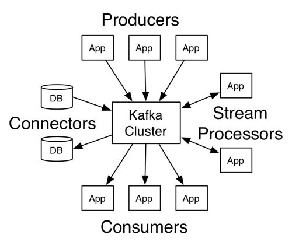

<!-- TOC -->

- [1. 思考](#1-%E6%80%9D%E8%80%83)
- [2. 优缺点](#2-%E4%BC%98%E7%BC%BA%E7%82%B9)
- [3. Kafka 是什么？](#3-kafka-%E6%98%AF%E4%BB%80%E4%B9%88)
    - [3.1. 诞生的目的的](#31-%E8%AF%9E%E7%94%9F%E7%9A%84%E7%9B%AE%E7%9A%84%E7%9A%84)
    - [3.2. Kafka 在这当中充当了怎样的角色？](#32-kafka-%E5%9C%A8%E8%BF%99%E5%BD%93%E4%B8%AD%E5%85%85%E5%BD%93%E4%BA%86%E6%80%8E%E6%A0%B7%E7%9A%84%E8%A7%92%E8%89%B2)
    - [3.3. 它与现有的系统比较有什么区别？](#33-%E5%AE%83%E4%B8%8E%E7%8E%B0%E6%9C%89%E7%9A%84%E7%B3%BB%E7%BB%9F%E6%AF%94%E8%BE%83%E6%9C%89%E4%BB%80%E4%B9%88%E5%8C%BA%E5%88%AB)
- [4. 消息队列](#4-%E6%B6%88%E6%81%AF%E9%98%9F%E5%88%97)
- [5. Kafka 架构](#5-kafka-%E6%9E%B6%E6%9E%84)
- [6. 工作流程](#6-%E5%B7%A5%E4%BD%9C%E6%B5%81%E7%A8%8B)
- [7. 生产者](#7-%E7%94%9F%E4%BA%A7%E8%80%85)
    - [7.1. 分区策略](#71-%E5%88%86%E5%8C%BA%E7%AD%96%E7%95%A5)
    - [7.2. 数据可靠性保证](#72-%E6%95%B0%E6%8D%AE%E5%8F%AF%E9%9D%A0%E6%80%A7%E4%BF%9D%E8%AF%81)
- [8. 消费者](#8-%E6%B6%88%E8%B4%B9%E8%80%85)
- [9. 参考](#9-%E5%8F%82%E8%80%83)

<!-- /TOC -->

# 1. 思考

● 了解发布和订阅消息模型以及该模型如何被应用在大数据生态系统中
● 学习使用Kafka生产者和消费者来生成消息和读取消息
● 了解Kafka保证可靠性数据传递的模式和场景需求
● 使用Kafka构建数据管道和应用程序的最佳实践
● 在生产环境中管理Kafka，包括监控、调优和维护
● 了解Kafka的关键度量指标
● 探索Kafka如何成为流式处理利器

-----------------------

# 2. 优缺点

- 使用文件系统，大量依赖操作系统中的 page cache，而非应用内 cache，这样可以内存充分利用，而且更加稳定（防止 GC）因为是 OS 维护 page cache，所以故障之后容易恢复，不用重建OS 会比较激进的把内存用作 page cache。
- 因为访问模式固定，使用 Persistent Queue 作为数据结构
- 使用 zero-copy optimization，不用频繁的跟 user space 交互因为大部分在操作在内存中进行，而且使用了 zero-copy，所以性能瓶颈可能只会出现下网络上
- 选用 pull 模型，从而避免了 push 模型中 push 速度与消费速度不一致，导致 consumer 压力过大的问题
- 采用了 ISR（ in-sync replicas ） 来保证备份中数据是一致的，ISR 的集合维护在 ZooKeeper 中（0.9版本之前，而0.9版本之后数据（offset）存储在kafka本地）。 
- 没有采用一般的多数票选举的方法。
- 因为为了性能没有使用 fsync，所以可能导致数据不能完整恢复
- 提供大量的可配置空间，方便使用者在 Consistency 与 Availability 中选择

# 3. Kafka 是什么？

**Kafka**是由[Apache软件基金会](https://zh.wikipedia.org/wiki/Apache软件基金会)开发的一个[开源](https://zh.wikipedia.org/wiki/开源)[流处理](https://zh.wikipedia.org/wiki/流处理)平台，由 [Scala](https://zh.wikipedia.org/wiki/Scala) 和 [Java ](https://zh.wikipedia.org/wiki/Java)编写。该项目的目标是为处理实时数据提供一个统一、高吞吐、低延迟的平台。

Kafka 有点像消息系统，允许发布和订阅消息流。从这点来看，它类似于 ActiveMQ 、RabbitMQ 或 IBM 的 MQSeries 等产品。尽管看上去有些相似，但 Kafka 与这些传统的消息系统仍然存在很多重要的不同点，这些差异使它完全不同于消息系统。有三个不同的点：第一，作为一个现代的分布式系统， Kafka 以集群（cluster）的方式运行，可以自由伸缩，处理公司的所有应用程序。 Kafka 集群并不是一组独立运行的 broker，而是一个可以灵活伸缩的中心平台，可以处理整个公司所有的数据流。第二， Kafka 是一个真正的存储系统，可以存储数据，只要您愿意，保存多久都可以 。作为数据连接层（connecting layer）， Kafka 提供了数据传递保证可复制（replicated）、持久化（persistent），保留多长时间完全可以由你来决定。第三，流式处理将数据处理的层次提升到了新高度 。 消息系统（Messaging systems）只会传递消息，而 Kafka 的流式处理能力让你只用很少的代码就能够动态地处理派生流和数据集。Kafka 的这些独到之处足以让你刮目相看，它不只是“另一个消息队列” 。  

另外一种角度看 Kafka：认为它是一种实时版的（real-time） Hadoop，这也是设计和构建 Kafka 的原始动机之一。Hadoop 让你存储和定期处理大量的数据文件，而 Kafka 让你存储和持续处理大规模的数据流。从技术角度来看，它们有着惊人的相似之处，很多人将新兴的流式处理看成批处理（batch processing）的超集。它们之间的最大不同体现在：**持续的低延迟处理（low-latency processing）和批处理之间的差异上**。Hadoop 和大数据主要应用在数据分析上，而 Kafka 因其低延迟的特点更适合用在核心的业务应用（core applications）上。业务事时刻在发生，Kafka 能够及时对这些事件作出响应，基于Kafka 构建的服务直接为业务运营提供支撑，提升用户体验。  

Kafka 是一个分布式的基于发布-订阅模式的消息队列（Message Queue），主要应用于大数据实时处理领域。

# 3.1. 诞生的目的

开始是 Linkedin 内部建立的一个基础设施系统，虽然有很多数据库和系统可以用来存储数据，但是他们发现在他们当前的架构中缺少一种东西来帮助处理连续不断的数据流（handle the continuous flow of data）。在开发 Kafka 之前，他们实验了各种现成的解决方案，从消息系统（messaging systems ）到日志聚合系统（log aggregation），再到 ETL 工具，但这些都无法满足他们的需求。 

因此，他们想从零开始开发一个系统。他们的想法是替换掉专注于大量处理的数据，像关系型数据库（relational databases ）、键值对存储（key-value stores）、索引搜索（search indexes）或缓存（caches），而是专注于处理数据的持续变化和不断增长的流，基于这样的想法去构建一个数据系统，事实上，是一个数据架构（data architecture ）。

这个想法实现后比他们最初期望适用性更广泛。尽管 Kafka 一开始被用在社交网络的实时应用和数据流当中，而现在已经成为下一代数据架构的基础。大型零售商正在基于持续数据流改造他们的基础业务流程，汽车公司正在从互联网汽车那里收集和处理实时数据流，银行也在重新思考基于 Kafka 改造他们的基础流程和系统。  

## 3.2. Kafka 在这当中充当了怎样的角色？

Kafka 是一个流平台（streaming platform  ），在这个平台上 让你发布和订阅数据流，去存储它们、处理它们，这就是构建 Kafka 的初衷。  以这种方式来看待数据确实与人们习惯的想法有所不同，但它确实在构建应用和架构方面表现出了强大的抽象能力。  

Kafka 常常会被拿来与现有的技术作比较：企业级消息系统（enterprise messaging systems,）、大数据系统（如 Hadoop）和数据集成（data integration）或 ETL工具。与它们每一个比较都有一定的有效性，但也有一些不足。  

## 3.3. 它与现有的系统比较有什么区别？  

Kafka 和 ETL 工具或其他数据集等这些工具都擅长移动数据，但它们最大的不同在于 Kafka 颠覆了传统的思维 。 Kafka 并非只是把数据从一个系统拆解出来再塞进另一个系统，它其实是一个面向实时数据流的平台（a platform oriented around real-time streams of events）。也就是说，它不仅可以将现有的应用程序和数据系统连接起来，它还能用于加强这些触发相同数据流的应用。  

# 发展历程

1. 0.7版本：只有基础消息队列功能，无副本；

2. 0.8版本：增加了副本机制，新的producer API；至此kafka成为一个真正意义上的分布式高可靠消息队列解决方案；

3. 0.9版本：增加权限和认证，新的consumer API，Kafka Connect功能；

4. 0.10版本：引入Kafka Streams功能，bug修复；

5. 0.11版本：增加producer API幂等，事物API，消息格式重构；

6. 1.0和2.0版本：Kafka Streams改进；

   

# 4. 消息队列

好处

- 解耦
- 削峰

两种模式

1. 点对点模式（一对一）
2. 发布-订阅模式（一对多，消费）
   - 消费者的消息由消费者自己来决定，消费者主动拉取数据。缺点：一直在轮询，看消息队列中是否有数据。
   - 生产者主动 push 数据。

# 5. Kafka 架构

## 关键术语

- Topic（主题）：将数据分类，主题中有分区有副本。kafka 中的数据主要存储在 topic 中。

- Partition（分区）：提高 topic 的负载均衡，同时也提高了并发能力。
- broker（消息中心）：负责接收和处理消息的服务器。
- Follower：相当于备份的作用。

注意：同一个分区（partition）中的数据（topic）只能被同一个消费组中的一个消费者（consumer）消费。

Zookeeper 作用

- 帮助 kafka 存储信息
- 存储消费者消费的位置信息。

kafka 消息存储在磁盘。

# 6. 工作流程

*Seek 直接找数据的位置*

保证 partition 有序，不能保证全局有序。

定位 index 采用 二分查找，

offset + dataSzie

# 7. 生产者

## 7.1. 分区策略

## 7.2. 数据可靠性保证

ISR(In-sync replica set)：同步副本；作用：leader 挂了以后去选择一个新的 leader。

- 保留了时间参数：0.9版本之前，超过数目参数的最大值后，频繁的要访问内存和Zookeeper，降低了效率，因此删除了。

acks 参数配置

- 0：
- 1：

ack 解决的是数据丢失和数据重复问题。

HW 解决的是消费一致性和存储一致性问题。

# 8. 消费者

# 9. 参考

- Kafka 官网：https://kafka.apache.org/
- 《Kafka: The Definitive Guide: Real-Time Data and Stream Processing at Scale》
- 《Kafka 权威指南》
- [The Apache Kafka C/C++ client library API](https://docs.confluent.io/platform/current/clients/librdkafka/html/index.html)
- [51CTO 天山老妖S-kafka系列](https://blog.51cto.com/u_9291927/category33.html)

