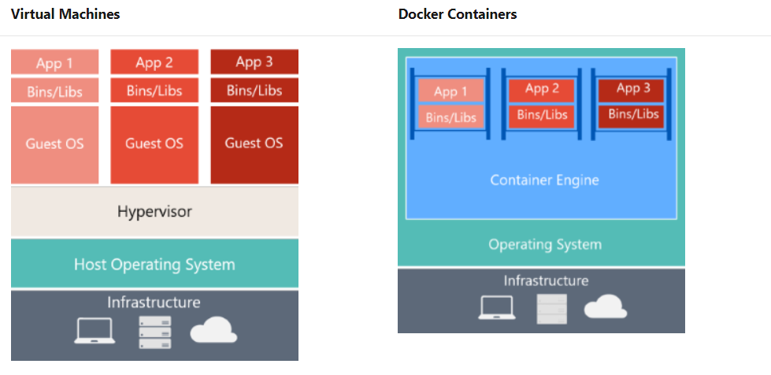
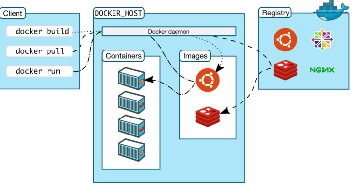
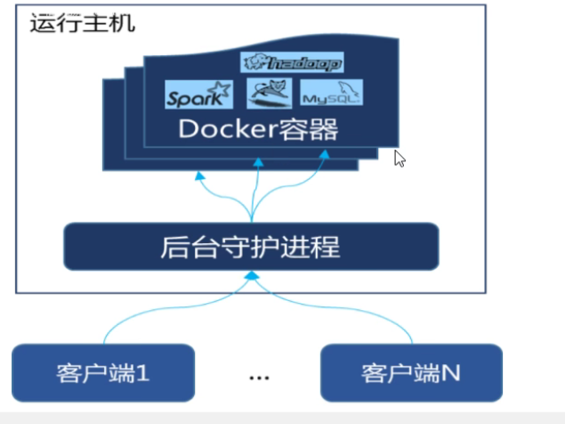
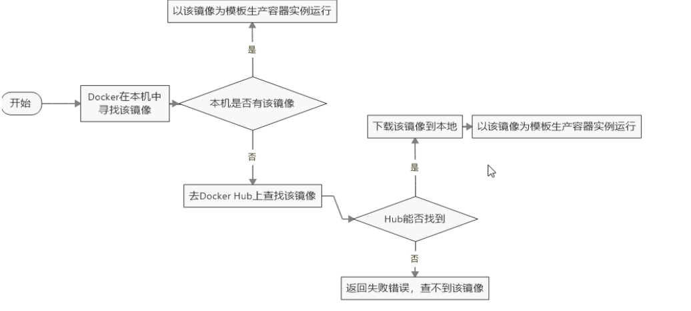

<!-- TOC -->

- [1. 为什么会出现 Docker？](#1-为什么会出现-docker)
- [2. Docker 是什么](#2-docker-是什么)
- [3. Docker 与传统虚拟机有什么不同？](#3-docker-与传统虚拟机有什么不同)
- [4. 为什么 Docker 比虚拟机快？](#4-为什么-docker-比虚拟机快)
- [5. Docker 安装](#5-docker-安装)
  - [5.1. CenOS7 下安装 Docker](#51-cenos7-下安装-docker)
  - [5.2. Windows 下安装 Docker](#52-windows-下安装-docker)
- [6. Windows系统上为什么能运行 Docker？](#6-windows系统上为什么能运行-docker)
- [7. Docker 组件](#7-docker-组件)
  - [7.1. Docker 原理](#71-docker-原理)
- [8. Docker 命令](#8-docker-命令)
  - [8.1. 帮助启动命令](#81-帮助启动命令)
  - [8.2. 容器命令](#82-容器命令)
    - [8.2.1. docker run](#821-docker-run)
    - [8.2.2. exit](#822-exit)
    - [8.2.3. docker ps](#823-docker-ps)
    - [8.2.4. docker logs](#824-docker-logs)
    - [8.2.5. docker top](#825-docker-top)
    - [8.2.6. docker inspect](#826-docker-inspect)
    - [8.2.7. docker exec](#827-docker-exec)
    - [8.2.8. docker attach](#828-docker-attach)
    - [8.2.9. docker cp](#829-docker-cp)
    - [8.2.10. docker export](#8210-docker-export)
    - [8.2.11. docker import](#8211-docker-import)
  - [8.3. 镜像命令](#83-镜像命令)
    - [8.3.1. docker  images](#831-docker--images)
    - [8.3.2. docker  search](#832-docker--search)
    - [8.3.3. docker pull](#833-docker-pull)
    - [8.3.4. docker rmi](#834-docker-rmi)
    - [8.3.5. docker system df](#835-docker-system-df)
    - [8.3.6. docker save](#836-docker-save)
    - [8.3.7. docker load](#837-docker-load)
    - [8.3.8. docker build](#838-docker-build)
- [9. Docker 下安装软件](#9-docker-下安装软件)
- [10. Docker 容器数据卷](#10-docker-容器数据卷)
- [11. Dockerfile](#11-dockerfile)
- [12. Docker network](#12-docker-network)
- [13. Compose](#13-compose)
- [14. 面试问题](#14-面试问题)
- [15. Reference](#15-reference)

<!-- /TOC -->

# 1. 为什么会出现 Docker？

为了解决运行环境和配置的问题。开发人员在部署好的机器上开发，开发完成后，交付给测试和运维人员，而他们也需要在相同的环境下进行测试和产品的运维，需要部署同样的环境。在部署的过程中可能会存在环境不一致的问题，需要去逐一解决，这样很费时、费力。那么有没有一种技术，测试人员或运维的人员直接将开发人员的部署的环境直接拿来用？将开发人员打包好的环境，类似像安装软件一样，直接安装在测试环境或运维环境的机器上。随着技术的发展，真的有这一门技术，那就是 Docker，直接将打好的包，形成一个镜像文件（image），通过 Docker 引擎（engine）部署到其他的操作系统上，实现了一次部署，处处运行。

# 2. Docker 是什么

Docker 是基于 Go 语言实现的云开源项目。主要目标是“build, ship and run any app, anywhere”，通过对应用组件的封装、分发、部署、运行等生命周期的管理，使用户的 APP 及运行环境能做到“一次镜像，处处运行”。

Docker 是在 Linux 容器技术的基础上发展起来的。将应用打包成镜像，通过镜像成为运行在 Docker 容器上面的示例。Docker 能运行在任何的操作系统上，实现了跨平台、跨服务器。只需要一次配置好环境，换到别的机器上就可以一键部署了，大大简化了操作。

参考：https://docs.microsoft.com/zh-cn/dotnet/architecture/microservices/container-docker-introduction/docker-defined

# 3. Docker 与传统虚拟机有什么不同？

1. 传统虚拟机不仅在操作系统上模拟一套虚拟的硬件，还需要模拟出一个完成的操作系统，然后再模拟出的操作系统上运行所需的进程（即软件）。
2. Docker 容器它没有自己的内核，也没有进行硬件的虚拟化，Docker 容器内的应用进程直接运行在宿主机（安装 Docker 软件的操作系统）的内核上，因此 Docker 容器要比传统虚拟机更轻便，占用系统资源少。每个容器之间相互隔离，容器与容器之间的进程彼此个不影响，并且每个容器都有自己的文件系统。
3. Docker 是内核级虚拟化，不想传统的虚拟化技术需要额外的 Hypersion 支持，因此一台物理机器上可以运行多个容器的示例，大大提升了物理机器的 CPU 和 内存的利用率，节省了很多钱。

# 4. 为什么 Docker 比虚拟机快？

- Docker 有比虚拟机更少的抽象层。

  由于 Docker 不需要 Hyperversion（虚拟机）实现硬件资源虚拟化，运行在 Docker 容器上的程序直接使用的是实际物理机器的硬件资源，因此 CPU、内存利用率在 Docker 上有跟明显的优势。

  

- Docker 利用的是宿主机的内核，不需要加载操作系统的内核。

  当新建一个容器时，Docker 不需要和虚拟机一样加载一个操作系统的内核，而是利用的是宿主机的内核，避免了操作系统的加载、寻址、系统内核返回等比较费时、费资源的过程。当新建一个虚拟机时，虚拟机软件需要先加载操作系统，然后再返回，这个过程是非常耗时的，分钟级别的，而 Docker 则是直接省略了这一过程，新建一个 Docker 容器只需要几秒钟，非常的快。 

Docker 优点

- 轻便：Docker 是基于容器的虚拟化，仅包含业务运行所需要的环境。
- 高效：不需要操作系统的虚拟化开销。
- 灵活性更高：支持多网络配置、分层存储和包管理。

# 5. Docker 安装

平台支持（Supported platforms）

Docker 引擎（Docker Engine ）支持 Linux 、macOS、Win10（通过 Docker 桌面版）等不同的平台安装，还支持[静态二进制文件](https://docs.docker.com/engine/install/binaries/)的安装。


## 5.1. CenOS7 下安装 Docker

Docker 并非一个通用的容器工具，它依赖于已存在并运行的 Linux 内核环境。Docker 实际上是在已运行的 Linux 下制造了一个隔离的文件环境，因此它执行的效率几乎等同于所部署的 Linux 主机。Docker 必须部署在带有 Linux 内核的系统上。

安装前提条件

目前，CentOS 仅支持发行版中内核，要求系统为 64 位，32 位的操作系统暂时不支持，Linux 系统的内核版本为 3.8 以上。

查看 Linux 内核版本

```
// 查看 Linux 发行版
[root@redis_181 ~]# cat /etc/redhat-release
CentOS Linux release 7.9.2009 (Core)

// 查看内核版本、硬件架构、主机名称、操作系统类型等信息
[root@redis_181 ~]# uname -a	
Linux redis_181 3.10.0-1160.49.1.el7.x86_64 #1 SMP Tue Nov 30 15:51:32 UTC 2021 x86_64 x86_64 x86_64 GNU/Linux
```


## 5.2. Windows 下安装 Docker

Docker 官网介绍 Windows下安装 Docker有两种方式，一种是在 Windows 子系统（WSL）中安装 Docker，另一种在带有 Windows 虚拟化技术的 Windows 容器中安装。

# 6. Windows系统上为什么能运行 Docker？

Docker在早期是只专注于Linux虚拟化实现的一种容器技术，因为Linux得天独厚的Namespace 和 CGroup 等系统内隔离机制特性，使得在Linux更易实现，在经过容器技术的疯狂发展推崇之后，微软看到了这一红利，在于2014年宣布与Docker公司合作，将容器技术迁移到Windows上，这一动作让Windows改变了过去，只能通过VM等大型虚拟机软件通过装Linux来装Docker的现状，现在也可以很轻量级的将Docker融入系统中使用了。由于Windows系统和Linux在实现上还是有些差别，尽管我们在Docker上的操作大致相同，仍然需要注意一些事项。

没有安装 WSL 的Windows，运行 Docker 原理

```
Docker在Windows系统上安装时，Docker会创建一个基于Linux的虚拟机，叫做MobyLinuxVM虚拟机，这个虚拟机是基于Alpine Linux的。Docker应用程序会连接到此虚拟机，你便可以开始创建具有必要操作组件的容器了。为了与本地网络和NAT（网络地址转换）进行通信，在Docker安装中会为虚拟机配置一个子网，以便你的容器在应用程序中使用。不过不必担心，MobyLinuxVM虚拟机是运行在Hyper-V，这是Windows是一项虚拟化技术，相比虚拟机之类的非常轻量级，容器可以共享主机内核，任务管理器里面可以看到对应进程。
```


参考：[Docker在Windows的使用说明](http://www.520code.net/index.php/archives/39/)

# 7. Docker 组件

Docker 中有三个重要的组件：Image，Container，Repository。只有理解了这些概念后，学习 Docker 就很轻松了。

- 镜像（Image）
  - Docker 镜像是一个特殊的文件系统，用来创建 Docker 容器，一个镜像可以创建很多个容器。比如 CentOS7 官方镜像。
  - Docker 中除了提供容器运行时所需的程序、库、资源、配置等文件外，还包含了一些为运行时准备的一些配置参数（如匿名卷、环境变量、用户等）。
  - 镜像不包含任何的动态数据，镜像中的内容在构建之后不会再被改变。

- 容器（Container）
  - Docker 利用容器，独立运行一个或一组应用，而应用程序或服务都运行在容器里面。
  - 容器就类似于一个虚拟化的运行环境，容器是镜像创建运行时的实例，就像是面向对象程序设计中的**类** 和 **实例** 一样，镜像相当于**类**，容器相当于**类的实例**。
  - 容器为镜像提供了一个标准的、容器之间相互隔离的运行环境，容器可以被创建、启动、停止、删除、暂停等。
  - 创建的容器有两部分组成：一个是最小最核心的赖以生存的 Linux 内核文件，另一个是具体的应用程序。

- 仓库（Repository）
  - 集中存放镜像文件的地方，类似 Git 的远程仓库。
  - 仓库分为私有仓库和公开的仓库。私有仓库：比如公司内部搭建专门存放镜像文件的地方；公共仓库：任何人都能访问专门存放镜像文件的地方。全球最大的公开仓库是 Dockerhub(https://hub.docker.com)。在中国境内由于一些著名的原因，访问 Dockerhub 仓库比较慢，可以配置国内的镜像仓库，比如阿里云、网易等等。


## 7.1. Docker 原理



Docker 是一个 Client-Server 结构的系统，Docker 守护进程（daemon）运行在主机（host）上，然后通过 Socket 连接从客户端访问，守护进程从客户端接受命令并管理运行在主机上的容器。




Docker 运行流程

1. 用户是使用 Docker Client 与 Docker Daemon建立通信，并发送请求给 Docker daemon。
2. Docker Daemon 作为 Docker 架构中的主体部分，苜先提供 Docker Server 的功能使其可以接受 Docker Client的请求。
3. Docker Engine 执行 Docker 内部一系列工作，每一项工作都是以一个 Job 的形式的存在。
4. Job 运行的过程中，当需要容器镜像时，则从 Docker Registry 中下镜像，并通过镜像管理驱动 Graph drver 将下载镜像以 Grap 的形式存储。
5. 当需要为 Docker 创建网络环境时，通过网络管理驱动 Network driver 创建并配置 Docker 容器网络环境。
6. 当需要限制 Docker 容器运行资源或执行用户指令等操作时，则通过 exec driver 来完成。
7. libcantainer 是一项独立的容器管鋰包，network driver 以及 exec driver 都是通过 libcontainer 来实现具体对容器操作。


# 8. Docker 命令

运行 Docker 的格式:

`docker [OPTIONS] COMMAND`

说明：

- `docker` 为 docker 引擎的前缀，表示通过 docker 来执行命令。 
- 带有 `[]` 部分是可选项，这部分可要可不要，根据具体情况来定。
- `COMMAND` 是必须的，要运行的 Docker  命令。

Docker 官方命令参考：https://docs.docker.com/reference/

## 8.1. 帮助启动命令

```
# 查看Docker版本信息
docker version

# 启动服务
systemctl stop docker

# 停止服务
systemctl stop docker

# 查看 Docker 服务运行状态
systemctl status docker

# 设置 Docker 开机启动
systemctl enable docker

# 查看 Docker 概要信息
docker info

# 查看 Docker 总体帮助文档
docker --help

# 查看 Docker 命令帮助文档，command 指具体的命令
docker command --help 

# 卸载相关依赖
$ sudo yum remove docker-ce docker-ce-cli containerd.io

# 清空工作路径
$ sudo rm -rf /var/lib/docker
$ sudo rm -rf /var/lib/containerd
```

## 8.2. 容器命令

### 8.2.1. docker run

在一个新的容器中运行一条命令。

```
用法
	docker run [OPTIONS] IMAGE [COMMAND] [ARG...]

OPTIONS:
  -i, --interactive   交互式运行容器
  -t, --tty           给容器重新分配一个伪终端（pseudo-TTY）
  -p(小写)            拉 container 的端口号到主机（host）上
  -P(大写)            随机分配一个端口号
  -d, --detach       后台运行容器和打印容器ID
  --name=“容器名字”   给容器分配一个名字，不指定名字时，docker 会随机分配一个
```

运行 `Docker run` 命令都干了什么？



示例1

```
[root@redis_181 ~]# docker images
REPOSITORY           TAG       IMAGE ID       CREATED        SIZE
wurstmeister/kafka   latest    2dd91ce2efe1   2 weeks ago    508MB
zookeeper            latest    36c607e7b14d   3 weeks ago    278MB
hello-world          latest    feb5d9fea6a5   3 months ago   13.3kB
[root@redis_181 ~]# docker run -it 36c607e7b14d /bin/bash
root@c9fa3e7753a5:/apache-zookeeper-3.7.0-bin#
```

`docker run -it 36c607e7b14d /bin/bash`  命令表示：交互式启动一个镜像 ID 为 36c607e7b14d 的 zookeeper 容器，并在容器中执行 /bin/bash 命令。

示例2：交互式的方式启动一个容器，并给容器起一个新名字，同时分配一个伪终端。在标准输入中用 bash 命令启动伪终端。

```
[root@redis_181 ~]# docker run -it --name=kafka wurstmeister/kafka /bin/bash
bash-5.1#
```


后台运行 Docker 容器

前提：要想 Docker 容器在后台运行，就必须有一个前台进程。若果容器运行的命令不是那些一直挂起的命令（比如：tail，top等），容器启动后就会自动退出。

```
[root@redis_181 ~]# docker run -d redis:6.0.8
77e61214ea8c95c007dc02928d01179ba964e63a9c1861a870fedb6f4938dd56
```


### 8.2.2. exit

从容器中退出。退出容器有两种方式：

1. 容器中执行 `exit` 命令后，直接退出，同时容器也停止了。
2. 按 `Ctrl + p + q` 组合命令后，退出容器，当容器不停止，后台还在运行。

### 8.2.3. docker ps

列出本地主机中当前正在运行的容器信息

```
用法
	docker ps [OPTIONS]
	
OPTIONS:
  -a, --all             Show all containers (default shows just running)
  -f, --filter filter   Filter output based on conditions provided
      --format string   Pretty-print containers using a Go template
  -n, --last int        Show n last created containers (includes all states) (default -1)
  -l, --latest          Show the latest created container (includes all states)
      --no-trunc        Don't truncate output
  -q, --quiet           Only display container IDs
  -s, --size            Display total file sizes

[root@redis_181 ~]# docker ps
CONTAINER ID   IMAGE                COMMAND       CREATED         STATUS         PORTS     NAMES
176f87942045   wurstmeister/kafka   "bash"        5 seconds ago   Up 5 seconds             angry_pike
ab67455c4ee2   wurstmeister/kafka   "/bin/bash"   2 minutes ago   Up 2 minutes             kafka

# 查看本地主机中的所有容器
docker ps -a
```


```
# 启动容器
docker start <容器id或容器名>

# 关闭容器
docker stop <容器id或容器名>

# 重启容器
docker restart <容器ID或容器名>

# 强制停止容器
docker kill <容器ID或容器名>

# 删除一停止的容器
docker rm <容器ID或容器名>

# 导出一个已经创建的容器到一个文件
docker export [容器ID]

# 将制作好的容器快照导入指定路径下
docker import [路径]
```


### 8.2.4. docker logs

查看容器内部日志

```
用法
	docker logs [OPTIONS] CONTAINER

OPTIONS:
      --details        Show extra details provided to logs
  -f, --follow         Follow log output
      --since string   Show logs since timestamp (e.g. 2013-01-02T13:23:37Z) or relative (e.g. 42m for 42 minutes)
  -n, --tail string    Number of lines to show from the end of the logs (default "all")
  -t, --timestamps     Show timestamps
      --until string   Show logs before a timestamp (e.g. 2013-01-02T13:23:37Z) or relative (e.g. 42m for 42 minutes)
```

### 8.2.5. docker top

显示一个容器内部运行的进程。

```
用法
	docker top CONTAINER [ps OPTIONS]

[root@redis_181 ~]# docker ps
  CONTAINER ID   IMAGE         COMMAND                  CREATED          STATUS          PORTS      NAMES
  77e61214ea8c   redis:6.0.8   "docker-entrypoint.s…"   15 seconds ago   Up 13 seconds   6379/tcp   focused_almeida

[root@redis_181 ~]# docker top 77e61214ea8c
  UID        PID      PPID        C       STIME  TTY        TIME    CMD
  polkitd             9516        9497    0      08:17     ?       00:00:00            redis-server *:6379
```

### 8.2.6. docker inspect

查看容器的内部细节信息。

```
用法
	docker inspect [OPTIONS] NAME|ID [NAME|ID...]

OPTIONS:
  -f, --format string   Format the output using the given Go template
  -s, --size            Display total file sizes if the type is container
      --type string     Return JSON for specified type

示例
	docker inspect 容器ID
```


### 8.2.7. docker exec

重新进入原先已退出的容器内部。

```
用法
	docker exec [OPTIONS] CONTAINER COMMAND [ARG...]
	
[OPTIONS]:
  -d, --detach 在容器中后台执行命令； 
  -i, --interactive=true | false ：打开标准输入接受用户输入命令

示例
	docker exec -it <容器ID> /bin/bash
	
	# 使用 /bin/bash 命令前台交互的重新进入到容器内部 
	[root@redis_181 ~]# docker exec -it 77e61214ea8c /bin/bash
	root@77e61214ea8c:/data#
```

### 8.2.8. docker attach

重新进入原先已退出的容器内部，并将本地标准输入、输出和错误流附加到正在运行的容器。

```
用法
	docker attach [OPTIONS] CONTAINER

OPTIONS:
  --detach-keys string   Override the key sequence for detaching a container
  --no-stdin             Do not attach STDIN
  --sig-proxy            Proxy all received signals to the process (default true)
```

注意：`docker exec` 与 `docker attach` 的区别

- `docker attach`  直接进入容器命令行的终端，不会启动新的进程，用 `exit` 命令退出容器时，会导致容器停止。
- 执行 `docker exec` 是在容器内部打开新的终端，并且可以启动新的进程，用 `exit` 命令退出容器时，不会导致容器停止。

### 8.2.9. docker cp

在容器和本地文件系统（本地主机）之间拷贝文件或文件夹。

```
用法
	docker cp [OPTIONS] CONTAINER:SRC_PATH DEST_PATH
	docker cp [OPTIONS] SRC_PATH CONTAINER:DEST_PATH

OPTIONS:
  -a, --archive       Archive mode (copy all uid/gid information)
  -L, --follow-link   Always follow symbol link in SRC_PATH
```

### 8.2.10. docker export

导出一个容器文件系统作为一个 tar 包。

```
用法
	docker export [OPTIONS] CONTAINER
	
Options:
  -o, --output string   Write to a file, instead of STDOUT
  
示例
[root@redis_181 ~]# docker ps -a
CONTAINER ID   IMAGE                COMMAND                  CREATED          STATUS                    PORTS      NAMES
302e76d7a7af   redis:6.0.8          "docker-entrypoint.s…"   19 minutes ago   Up 19 minutes             6379/tcp   elated_feistel
bdbd7d438f8f   hello-world          "/hello"                 2 days ago       Exited (0) 2 days ago                elastic_chaplygin

# 下面两种方式是等效的
[root@redis_181 ~]# docker export bdbd7d438f8f > hello.tar
                    hello.tar 

[root@redis_181 ~]# docker export -o="hw.tar" bdbd7d438f8f
                    hw.tar  
```

### 8.2.11. docker import

从 tar 包中的内容创建一个新的文件系统，再导入为 Docker镜像。

```
用法
  docker import [OPTIONS] file|URL|- [REPOSITORY[:TAG]]

OPTIONS:
  -c, --change list       Apply Dockerfile instruction to the created image
  -m, --message string    Set commit message for imported image
      --platform string   Set platform if server is multi-platform capable

示例
  # cat 文件名.tar | docker import - 镜像用户/镜像名:镜像版本号
    [root@redis_181 ~]# cat hello.tar | docker import - john/hello:5.0
    sha256:ed584048180e082610c982dc8f56ccf9618872f80d5848d0e8c840dfd46c13bc
    [root@redis_181 ~]# docker images
    REPOSITORY           TAG       IMAGE ID       CREATED          SIZE
    john/hello           5.0       ed584048180e   12 seconds ago   13.3kB
    wurstmeister/kafka   latest    2dd91ce2efe1   2 weeks ago      508MB
  
  # 从远程位置导入
   docker import https://example.com/exampleimage.tgz
   
 # 从本地文件中导入
   docker import /path/to/exampleimage.tgz
```


容器生命周期

## 8.3. 镜像命令

### 8.3.1. docker  images

列出本地主机上已下载的所有 Docker 镜像

```
用法
	docker images [OPTIONS] [REPOSITORY[:TAG]]

OPTIONS:
  -a, --all   显示所有的镜像，包括默认隐藏的中间镜像（历史镜像）
  -q, --quiet 只显示镜像 ID

[root@redis_181 ~]# docker images
REPOSITORY           TAG       IMAGE ID       CREATED        SIZE
wurstmeister/kafka   latest    2dd91ce2efe1   2 weeks ago    508MB
zookeeper            latest    36c607e7b14d   3 weeks ago    278MB
hello-world          latest    feb5d9fea6a5   3 months ago   13.3kB
```

显示结果说明

```
REPOSITORY：镜像的仓库源
TAG：镜像的标签版本号
IMAGE ID：镜像 ID
CREATED：镜像创建时间
SIZE：镜像大小
```

同一个仓库源可以有多个 TAG 版本，说明仓库源有不同的版本，用 `REPOSITORY:TAG` 来表示不同的镜像。比如 `redis:6.0.8` 表示从仓库源获取的是 redis 版本为6.0.8 ，在这个 Docker engine 中还可以拉取 redis 版本为 5.0 的仓库源，用 `redis:5.0` 表示，二者可以同时共存。若在拉取镜像时不指定镜像的标签版本，Docker 将默认使用 TAG 为 latest 的版本（最新版本）。

### 8.3.2. docker  search

从仓库源中搜索某个镜像

```
用法
	docker search [OPTIONS] TERM

OPTIONS：
  -f, --filter filter   Filter output based on conditions provided
      --format string   Pretty-print search using a Go template
      --limit int       Max number of search results (default 25)
      --no-trunc        Don't truncate output
```

显示结果说明

```
[root@redis_181 ~]# docker search redis
NAME                             DESCRIPTION                                     STARS     OFFICIAL   AUTOMATED
redis                            Redis is an open source key-value store that…   10443     [OK]
grokzen/redis-cluster            Redis cluster 3.0, 3.2, 4.0, 5.0, 6.0, 6.2      83
sameersbn/redis                                                                  83                   [OK]
rediscommander/redis-commander   Alpine image for redis-commander - Redis man…   73                   [OK]
redislabs/redisearch             Redis With the RedisSearch module pre-loaded…   47
redislabs/rejson                 RedisJSON - Enhanced JSON data type processi…   39
redislabs/redisinsight           RedisInsight - The GUI for Redis                35
redislabs/redis                  Clustered in-memory database engine compatib…   32
oliver006/redis_exporter          Prometheus Exporter for Redis Metrics. Supp…   31
arm32v7/redis                    Redis is an open source key-value store that…   24
arm64v8/redis                    Redis is an open source key-value store that…   19
redislabs/rebloom                A probablistic datatypes module for Redis       18                   [OK]
redislabs/redisgraph             A graph database module for Redis               17                   [OK]
redislabs/redismod               An automated build of redismod - latest Redi…   17                   [OK]
webhippie/redis                  Docker image for redis                          11                   [OK]
insready/redis-stat              Docker image for the real-time Redis monitor…   10                   [OK]
s7anley/redis-sentinel-docker    Redis Sentinel                                  10                   [OK]
redislabs/redistimeseries        A time series database module for Redis         10
goodsmileduck/redis-cli          redis-cli on alpine                             9                    [OK]
centos/redis-32-centos7          Redis in-memory data structure store, used a…   6
clearlinux/redis                 Redis key-value data structure server with t…   3
wodby/redis                      Redis container image with orchestration        1                    [OK]
tiredofit/redis                  Redis Server w/ Zabbix monitoring and S6 Ove…   1                    [OK]
xetamus/redis-resource           forked redis-resource                           0                    [OK]
flant/redis-sentinel-proxy       Redis sentinel proxy by enriclluelles writte…   0                    [OK]
```

```
NAME：镜像名称
DESCRIPTION：镜像说明
STARS：点赞数量
OFFICIAL：是否是官方的
AUTOMATED：是否是自动构建的
```

### 8.3.3. docker pull

从仓库源中拉取指定的镜像或仓库

```
用法
	docker pull [OPTIONS] NAME[:TAG|@DIGEST]

OPTIONS:
  -a, --all-tags                Download all tagged images in the repository
      --disable-content-trust   Skip image verification (default true)
      --platform string         Set platform if server is multi-platform capable
  -q, --quiet                   Suppress verbose output

示例
# 拉取时不指定版本，Docker 引擎默认从仓库源拉取最新的版本
[root@redis_181 ~]# docker pull redis

# 拉取时指定版本 TAG
[root@redis_181 ~]# docker pull redis:6.0.8

```

### 8.3.4. docker rmi

删除指定的镜像（rmi: Remove one or more images）

```
用法
	docker rmi [OPTIONS] IMAGE [IMAGE...]

OPTIONS:
  -f, --force      Force removal of the image
      --no-prune   Do not delete untagged parents
      
示例
	# 删除单个镜像
  [root@redis_181 ~]# docker rmi -f hello-world
  Untagged: hello-world:latest
  Untagged: hello-world@sha256:975f4b14f326b05db86e16de00144f9c12257553bba9484fed41f9b6f2257800
  Deleted: sha256:feb5d9fea6a5e9606aa995e879d862b825965ba48de054caab5ef356dc6b3412
 
 # 删除多个镜像
 [root@redis_181 ~]# docker rmi -f redis:6.0.8 rdis:5.0
 
 # 用参数续传来删除，将查找到的 Ubuntu 镜像 ID 传入要删除的表达式后面
  [root@redis_181 ~]# docker rmi -f $(docker images -q ubuntu)
  Untagged: ubuntu:latest
  Untagged: ubuntu@sha256:b5a61709a9a44284d88fb12e5c48db0409cfad5b69d4ff8224077c57302df9cf
  Deleted: sha256:d13c942271d66cb0954c3ba93e143cd253421fe0772b8bed32c4c0077a546d4d
  Deleted: sha256:0eba131dffd015134cb310c284b776c1e44d330146cd2f0e30c4e464d0b76d24
```

### 8.3.5. docker system df 

查看镜像、容器、数据卷所占用的空间大小

```
[root@redis_181 ~]# docker system df
TYPE            TOTAL     ACTIVE    SIZE      RECLAIMABLE
Images          3         3         785.9MB   0B (0%)
Containers      5         0         344B      344B (100%)
Local Volumes   5         5         2B        0B (0%)
Build Cache     0         0         0B        0B

```

显示结果说明

```
TYPE：类型
TOTAL：总数
ACTIVE：激活状态
SIZE：大小
RECLAIMABLE：可回收
```

### 8.3.6. docker save

保存一个或多个镜像到 tar 包中，默认是通过标准输出流。 

```
用法
  docker save [OPTIONS] IMAGE [IMAGE...]
  
OPTIONS:
  -o, --output string   Write to a file, instead of STDOUT
```

### 8.3.7. docker load

从一个 tar 包或标准输入中导入 Docker 镜像。

```
用法
  docker load [OPTIONS]
  
OPTIONS:
  -i, --input string   Read from tar archive file, instead of STDIN
  -q, --quiet          Suppress the load output

示例
docker image ls

# 两种方式都是等效的
docker load --input fedora.tar

docker load < busybox.tar.gz

docker images
```


### 8.3.8. docker build

从一个 Dockerfile 中构建一个 Docker 镜像。

```
用法
	docker build [OPTIONS] PATH | URL | -
```


# 9. Docker 下安装软件

Docker下安装软件的步骤

1. 搜索镜像
2. 拉取镜像
3. 查看镜像
4. 启动镜像：注意端口映射。
5. 停止容器
6. 移除容器


# 10. Docker 容器数据卷

# 11. Dockerfile

# 12. Docker network


# 13. Compose


# 14. 面试问题

1. Docker 的虚悬镜像是什么

   仓库命、标签命都是 <none> 的镜像，俗称为虚悬镜像（dangling image）。

# 15. Reference

- Docker 官网：https://docs.docker.com/
- Dockerhub，安装 Docker 镜像文件的仓库：https://hub.docker.com/
- [Docker搭建Zookeeper&Kafka集群](https://www.cnblogs.com/Jacian/p/11421114.html)
- [THE CONTAINER NETWORKING LANDSCAPE: CNI FROM COREOS AND CNM FROM DOCKER](https://thenewstack.io/container-networking-landscape-cni-coreos-cnm-docker) 一篇英文文章，讲解 docker 和 container ecosystem。
- [Github 英文讲解 CNI - the Container Network Interface](https://github.com/containernetworking/cni)

学习三部曲：理论、实操、总结
