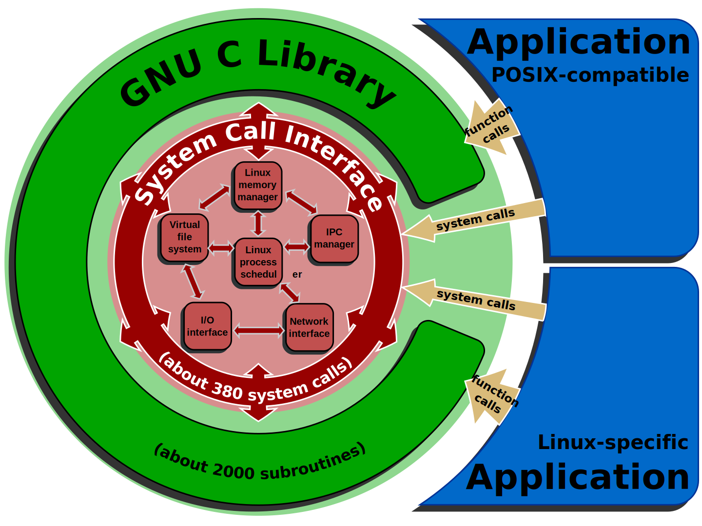

<!--
 * @Author: JohnJeep
 * @Date: 2021-03-18 16:25:50
 * @LastEditors: JohnJeep
 * @LastEditTime: 2026-05-31 19:32:29
 * @Description:  GNU tools chain
 * Copyright (c) 2025 by John Jeep, All Rights Reserved. 
-->

# 1. binutils

GNU Binary Utilities 或 binutils 是一整套的编程语言工具程序，用来处理许多格式的目标文件。它提供了一系列用来创建、管理和维护二进制目标文件的工具程序，如下表。通常，binutils 与 GCC 是紧密相集成 的，没有 binutils 的话，GCC 是不能正常工作的。

| 命令        | 说明                                                         |
| ----------- | ------------------------------------------------------------ |
| `as`        | [汇编器](https://zh.wikipedia.org/wiki/組譯器)               |
| `ld`        | [链接器](https://zh.wikipedia.org/wiki/链接器)               |
| `gprof`     | [性能分析](https://zh.wikipedia.org/wiki/性能分析)工具程序   |
| `addr2line` | 从目标文件的虚拟地址获取文件的行号或符号                     |
| `ar`        | 可以对[静态库](https://zh.wikipedia.org/w/index.php?title=Archive_file&action=edit&redlink=1)做创建、修改和取出的操作。 |
| `c++filt`   | [解码](https://zh.wikipedia.org/wiki/Name_mangling#Name_mangling_in_C++) [C++](https://zh.wikipedia.org/wiki/C%2B%2B) 的符号 |
| `gold`      | 另一种链接器                                                 |
| `nlmconv`   | 可以转换成[NetWare Loadable Module](https://zh.wikipedia.org/w/index.php?title=NetWare_Loadable_Module&action=edit&redlink=1)目标文件格式 |
| `nm`        | 显示目标文件内的符号                                         |
| `objcopy`   | 复制目标文件，过程中可以修改                                 |
| `objdump`   | 显示目标文件的相关信息，亦可反汇编                           |
| `ranlib`    | 产生静态库的索引                                             |
| `readelf`   | 显示[ELF](https://zh.wikipedia.org/wiki/可執行與可鏈接格式)文件的内容 |
| `size`      | 列出总体和 section 的大小                                    |
| `strings`   | 列出任何二进制档内的可显示字符串                             |
| `strip`     | 从目标文件中移除符号                                         |


Windows 环境下。

| 命令      | 说明                                                         |
| --------- | ------------------------------------------------------------ |
| `windmc`  | 产生Windows消息资源                                          |
| `windres` | Windows [资源](https://zh.wikipedia.org/wiki/资源_(Windows))档编译器 |
| `dlltool` | 创建Windows [动态库](https://zh.wikipedia.org/wiki/動態函式庫) |


## 1.1. readelf

读取 ELF(Executable and Linking Format) 文件中信息

```bash
# -l 查看程序头表内容
readelf -l libxxx.so

# -S 查看符号表内容
readelf -S xxx.out/xxx.so/xxx.a

# -r 查看重定位信息
readelf -r xxx.out/xxx.so/xxx.a

# -h 查看 ELF 文件头信息
readelf -h xxx.out/xxx.so/xxx.a
```


## 1.2. objdump

objdump 是 Linux 下的反汇编目标文件或者可执行文件的命令，它以一种可阅读的格式让你更多地了解二进制文件可能带有的附加信息。

参数选项
```bash
-a  --archive-headers       显示档案库的成员信息，类似 ls -l 将 lib*.a 的信息列出。 
-b bfdname --target=bfdname 指定目标码格式。这不是必须的，objdump能自动识别许多格式，比如： 

objdump -b oasys -m vax -h fu.o 
显示fu.o的头部摘要信息，明确指出该文件是Vax系统下用Oasys编译器生成的目标文件。objdump -i将给出这里可以指定的目标码格式列表。 

-C  --demangle              将底层的符号名解码成用户级名字，除了去掉所开头的下划线之外，还使得C++函数名以可理解的方式显示出来。 
-g --debugging              显示调试信息。企图解析保存在文件中的调试信息并以C语言的语法显示出来。仅仅支持某些类型的调试信息。有些其他的格式被readelf -w支持。 

-e  --debugging-tags        类似 -g 选项，但是生成的信息是和ctags工具相兼容的格式。 
-d --disassemble            从 objfile 中反汇编那些特定指令机器码的 section。 
-D  --disassemble-all       与 -d 类似，但反汇编所有section. 
--prefix-addresses          反汇编的时候，显示每一行的完整地址。这是一种比较老的反汇编格式。 

-EB 
-EL 
--endian={big|little}       指定目标文件的小端。这个项将影响反汇编出来的指令。在反汇编的文件没描述小端信息的时候用。例如S-records. 

-f --file-headers           显示 objfile 中每个文件的整体头部摘要信息。 
-h --section-headers --headers 显示目标文件各个section的头部摘要信息。 
-H --help 简短的帮助信息。 
-j name  --section=name      仅仅显示指定名称为name的section的信息 
-l --line-numbers            用文件名和行号标注相应的目标代码，仅仅和 -d、 -D 或者 -r 一起使用使用 -ld 和使用 -d 的区别不是很大，在源码级调试的时候有用，要求编译时使用了 -g 之类的调试编译选项。 

-m machine --architecture=machine 指定反汇编目标文件时使用的架构，当待反汇编文件本身没描述架构信息的时候(比如 S-records)，这个选项很有用。可以用 -i 选项列出这里能够指定的架构. 

-r --reloc                  显示文件的重定位入口。如果和-d或者-D一起使用，重定位部分以反汇编后的格式显示出来。 
-R  --dynamic-reloc         显示文件的动态重定位入口，仅仅对于动态目标文件意义，比如某些共享库。 
-s  --full-contents         显示指定 section 的完整内容。默认所有的非空section都会被显示。 
-S --source                 尽可能反汇编出源代码，尤其当编译的时候指定了 -g 这种调试参数时，效果比较明显。隐含了 -d 参数。
--show-raw-insn             反汇编的时候，显示每条汇编指令对应的机器码，如不指定 --prefix-addresses，这将是缺省选项。 
--no-show-raw-insn          反汇编时，不显示汇编指令的机器码，如不指定 --prefix-addresses，这将是缺省选项。 
--start-address=address     从指定地址开始显示数据，该选项影响 -d、 -r 和 -s 选项的输出。 
--stop-address=address      显示数据直到指定地址为止，该项影响-d、-r和-s选项的输出。 
-t --syms                   显示文件的符号表入口。类似于 nm -s 提供的信息 
-T --dynamic-syms           显示文件的动态符号表入口，仅仅对动态目标文件意义，比如某些共享库。它显示的信息类似于 nm -D|--dynamic 显示的信息。 
-V --version                版本信息 
--all-headers -x            显示所可用的头信息，包括符号表、重定位入口。 -x 等价于 -a -f -h -r -t 同时指定。 
-z --disassemble-zeroes     一般反汇编输出将省略大块的零，该选项使得这些零块也被反汇编。 
@file                       可以将选项集中到一个文件中，然后使用这个 @file 选项载入。
```

objdump 命令中用的比较多的参数项有：
```bash
-d: 反汇编目标文件中的机器码指令。
-s: 显示目标文件中指定 section 的完整内容。
-S: 尽可能反汇编出源代码，尤其当编译的时候指定了 -g 这种调试参数时，效果比较明显。隐含了 -d 参数。
-j: 仅显示指定名称为 name 的 section 的信息。
-h: 显示目标文件中各个 section 的头部摘要信息。
-x: 显示目标文件中所有可用的头信息，包括符号表、重定位入口等。
```


## 1.3. size

查看 object 文件或者链接库文件中的 object 文件的各个段(section)的大小及其总的大小。
```bash
size a.out
text    data     bss     dec     hex filename
3447     680     280    4407    1137 a.out
```

## 1.4. nm

查看静态库或可执行文件里面的内容（list symbols from object files：列出一个函数库文件中的符号表）。
```bash
nm main.out

nm mylib.a
```

## 1.5. ar

ar 是一个创建、修改和提取静态库的工具程序。它可以将多个目标文件打包成一个静态库文件（.a），也可以从静态库中提取单个目标文件。

```bash
# 创建一个静态库
ar rcs libmylib.a file1.o file2.o file3.o

# 将静态库中的目标文件解压到当前目录
ar -x libmylib.a

# 列出静态库中有哪些目标文件
ar -t libmylib.a
```

## 1.6. ld

ld 是一个链接器，用于将多个目标文件和库文件链接成一个可执行文件。它负责解析符号引用、分配内存地址、处理重定位等任务。

```bash
# 链接目标文件和库文件生成可执行文件
ld -o myprogram file1.o file2.o -lmylib
```

## 1.7. as

as 是一个汇编器，用于将汇编语言代码转换为目标文件（object file）。

```bash
# 汇编源文件生成目标文件
as -o file1.o file1.s
```

## 1.8. strings

strings 命令用于列出二进制文件中的可打印字符串。它可以帮助我们从二进制文件中提取有用的信息，如错误消息、版本信息等。

```bash
strings a.out
```


## 1.9. file

file 命令可以查看一个文件的类型，判断一个文件是可执行文件、共享库还是文本文件等。
```bash
file a.out

a.out: ELF 64-bit LSB pie executable, x86-64, version 1 (SYSV), dynamically linked, interpreter /lib64/ld-linux-x86-64.so.2, BuildID[sha1]=93240f289f8f24184300ce70b6edca4f1eb5b74d, for GNU/Linux 3.2.0, not stripped
```

## 1.10. pmap

打印一个进程的内存映射（report memory map of a process）。
```bash
pmap 进程PID
```


## 1.11. patchelf

patchelf 是一个简单的实用程序，用于修改已存在的 ELF 可执行表（executables）和库（libraries）。它会改变 可执行表的动态加载器（loader），同时也会改变可执行表和库的路径（PATH）。

```bash
--print-needed
  查看一个可执行程序或动态库，依赖于其它哪些模块。
  anna$:/usr/lib$ patchelf --print-needed libmpathcmd.so.0
  libc.so.6
```


## 1.12. c++filt

c++filt 是 C++ 源码编译后生成二进制文件中符号表中的符号名还原工具。


# 2. glibc

glibc 是 GNU 发布的 libc 库，也即 C 运行库，又称 GNU C 库。glibc 是 linux 系统中最底层的 API（应用程序开发接口），几乎其它任何的运行库 都会倚赖于 glibc。glibc 除了封装 linux 操作系统所提供的系统服务外，它本身也提供了许多其它一些必要功能服务的实现，主要的如下：

1. string，字符串处理
2. signal，信号处理
3. dlfcn，管理共享库的动态加载
4. direct，文件目录操作
5. elf，共享库的动态加载器，即 interpreter
6. iconv，不同字符集的编码转换
7. inet，socket接口的实现
8. intl，国际化，也即gettext的实现
9. io
10. linuxthreads
11. locale，本地化
12. login，虚拟终端设备的管理，及系统的安全访问
13. malloc，动态内存的分配与管理
14. nis
15. stdlib，其它基本功能

使用一张图表示




## 2.1. compare glibc libc

libc 是 Linux 下的 ANSI C 的函数库；glibc 是 Linux 下的 GUN C 函数库。

- ANSI C 是基本的 C 语言函数库，包含了 C 语言最基本的库函数。这个库可以根据 头文件划分为 15 个部分。其中包括：
  - 字符类型 (<ctype.h>)
  - 错误码 (<errno.h>)
  - 浮点常数 (<float.h>)
  - 数学常数 (<math.h>)
  - 标准定义 (<stddef.h>)
  - 标准 I/O (<stdio.h>)
  - 工具函数 (<stdlib.h>)
  - 字符串操作 (<string.h>)
  - 时间和日期 (<time.h>)
  - 可变参数表 (<stdarg.h>)
  - 信号 (<signal.h>)
  - 非局部跳转 (<setjmp.h>)
  - 本地信息 (<local.h>)
  - 程序断言 (<assert.h>) 
- GNU C 函数库是一种类似于第三方插件的东西，由于 Linux 是用Ｃ语言写的，所以 Linux 的一些操作是用Ｃ语言实现的，所以 GNU 组织开发了一个Ｃ语言的库，让我们更好的利用 C 语言开发基于 Linux 操作系统的程序。


## 2.2. glibc version

```shell
$ ldd --version
ldd (GNU libc) 2.17
Copyright (C) 2012 Free Software Foundation, Inc.
This is free software; see the source for copying conditions.  There is NO
warranty; not even for MERCHANTABILITY or FITNESS FOR A PARTICULAR PURPOSE.
Written by Roland McGrath and Ulrich Drepper.
```

# 3. libstdc++

libstdc++ 是 GCC 的标准 C++ 库。

```shell
64 位操作系统下查看 libstdc++.so 的版本
$ strings /usr/lib64/libstdc++.so.6 | grep GLIBCXX  
```

- https://GCC.gnu.org/onlinedocs/libstdc++/ 
- https://GCC.gnu.org/onlinedocs/GCC-4.8.5/libstdc++/manual/ 


# 4. libc++

libc++ 是针对 clang 编译器重写的 C++ 标准库。


# 5. net-tools

net-tools 包括下面的软件包
- arp
- hostname
- ifconfig
- netstat
- rarp 
- route
- iptunnel
- ipmaddr

注：Debian 包管理系统中查看软件包中有哪些工具
```shell
dpkg -L net-tools | grep -E '/bin/|/sbin/' | xargs -I {} basename {}
```


# 6. apache2-tools

apache2-tools 包括下面的软件包
- ab
- checkgid
- fcgistarter
- htcacheclean
- htdbm
- htdigest
- htpasswd
- logresolve
- rotatelogs
- check_forensic
- httxt2dbm
- split-logfile

注：Debian 包管理系统中查看软件包中有哪些工具
```shell
dpkg -L apache2-utils | grep -E '/bin/|/sbin/' | xargs -I {} basename {}
```


# 7. references

- [官网： glibc 文档](https://www.gnu.org/software/libc/libc.html)
- [glibc 官方 GUN 源码地址](http://ftp.gnu.org/gnu/glibc/)
- [The GNU C Library Release Timeline](https://sourceware.org/glibc/wiki/Glibc%20Timeline)
- [glibc源码分析-1:构建过程](https://magus0219.me/zh-cn/glibc%E6%BA%90%E7%A0%81%E5%88%86%E6%9E%90-1-%E6%9E%84%E5%BB%BA%E8%BF%87%E7%A8%8B/)
- [关于linux系统里glibc库的一些记述](http://fsemouse.com/wordpress/2021/01/19/关于linux系统里glibc库的一些记述/)
- [Binutils - c++filt工具_qazw9600的博客-CSDN博客](https://blog.csdn.net/qazw9600/article/details/109729185)
