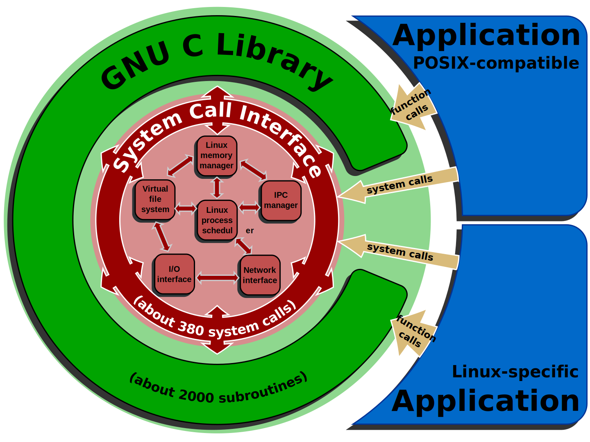

<!--
 * @Author: JohnJeep
 * @Date: 2021-03-18 16:25:50
 * @LastEditors: JohnJeep
 * @LastEditTime: 2025-04-04 19:19:26
 * @Description:  GNU tools chain
 * Copyright (c) 2025 by John Jeep, All Rights Reserved. 
-->

# 1. binutils

GNU Binary Utilities 或 binutils 是一整套的编程语言工具程序，用来处理许多格式的目标文件。它提供了一系列用来创建、管理和维护二进制目标文件的工具程序，如下表。通常，binutils 与 GCC 是紧密相集成 的，没有 binutils 的话，GCC 是不能正常工作的。

| 命令        | 说明                                                         |
| ----------- | ------------------------------------------------------------ |
| `as`        | [汇编器](https://zh.wikipedia.org/wiki/組譯器)               |
| `ld`        | [链接器](https://zh.wikipedia.org/wiki/链接器)               |
| `gprof`     | [性能分析](https://zh.wikipedia.org/wiki/性能分析)工具程序   |
| `addr2line` | 从目标文件的虚拟地址获取文件的行号或符号                     |
| `ar`        | 可以对[静态库](https://zh.wikipedia.org/w/index.php?title=Archive_file&action=edit&redlink=1)做创建、修改和取出的操作。 |
| `c++filt`   | [解码](https://zh.wikipedia.org/wiki/Name_mangling#Name_mangling_in_C++) [C++](https://zh.wikipedia.org/wiki/C%2B%2B) 的符号 |
| `gold`      | 另一种链接器                                                 |
| `nlmconv`   | 可以转换成[NetWare Loadable Module](https://zh.wikipedia.org/w/index.php?title=NetWare_Loadable_Module&action=edit&redlink=1)目标文件格式 |
| `nm`        | 显示目标文件内的符号                                         |
| `objcopy`   | 复制目标文件，过程中可以修改                                 |
| `objdump`   | 显示目标文件的相关信息，亦可反汇编                           |
| `ranlib`    | 产生静态库的索引                                             |
| `readelf`   | 显示[ELF](https://zh.wikipedia.org/wiki/可執行與可鏈接格式)文件的内容 |
| `size`      | 列出总体和 section 的大小                                    |
| `strings`   | 列出任何二进制档内的可显示字符串                             |
| `strip`     | 从目标文件中移除符号                                         |


Windows 环境下。

| 命令      | 说明                                                         |
| --------- | ------------------------------------------------------------ |
| `windmc`  | 产生Windows消息资源                                          |
| `windres` | Windows [资源](https://zh.wikipedia.org/wiki/资源_(Windows))档编译器 |
| `dlltool` | 创建Windows [动态库](https://zh.wikipedia.org/wiki/動態函式庫) |


## 1.1. c++filt

c++filt 是 C++ 源码编译后生成二进制文件中符号表中的符号名还原工具。


# 2. glibc

glibc 是 GNU 发布的 libc 库，也即 C 运行库，又称 GNU C 库。glibc 是 linux 系统中最底层的 API（应用程序开发接口），几乎其它任何的运行库 都会倚赖于 glibc。glibc 除了封装 linux 操作系统所提供的系统服务外，它本身也提供了许多其它一些必要功能服务的实现，主要的如下：

1. string，字符串处理
2. signal，信号处理
3. dlfcn，管理共享库的动态加载
4. direct，文件目录操作
5. elf，共享库的动态加载器，即 interpreter
6. iconv，不同字符集的编码转换
7. inet，socket接口的实现
8. intl，国际化，也即gettext的实现
9. io
10. linuxthreads
11. locale，本地化
12. login，虚拟终端设备的管理，及系统的安全访问
13. malloc，动态内存的分配与管理
14. nis
15. stdlib，其它基本功能

使用一张图表示




## 2.1. glibc 和 libc 的区别

libc 是 Linux 下的 ANSI C 的函数库；glibc 是 Linux 下的 GUN C 函数库。

- ANSI C 是基本的 C 语言函数库，包含了 C 语言最基本的库函数。这个库可以根据 头文件划分为 15 个部分。其中包括：
  - 字符类型 (<ctype.h>)
  - 错误码 (<errno.h>)
  - 浮点常数 (<float.h>)
  - 数学常数 (<math.h>)
  - 标准定义 (<stddef.h>)
  - 标准 I/O (<stdio.h>)
  - 工具函数 (<stdlib.h>)
  - 字符串操作 (<string.h>)
  - 时间和日期 (<time.h>)
  - 可变参数表 (<stdarg.h>)
  - 信号 (<signal.h>)
  - 非局部跳转 (<setjmp.h>)
  - 本地信息 (<local.h>)
  - 程序断言 (<assert.h>) 
- GNU C 函数库是一种类似于第三方插件的东西，由于 Linux 是用Ｃ语言写的，所以 Linux 的一些操作是用Ｃ语言实现的，所以 GNU 组织开发了一个Ｃ语言的库，让我们更好的利用 C 语言开发基于 Linux 操作系统的程序。


## 2.2. glibc version

```shell
$ ldd --version
ldd (GNU libc) 2.17
Copyright (C) 2012 Free Software Foundation, Inc.
This is free software; see the source for copying conditions.  There is NO
warranty; not even for MERCHANTABILITY or FITNESS FOR A PARTICULAR PURPOSE.
Written by Roland McGrath and Ulrich Drepper.
```

# 3. libstdc++

libstdc++ 是 GCC 的标准 C++ 库。

```shell
64 位操作系统下查看 libstdc++.so 的版本
$ strings /usr/lib64/libstdc++.so.6 | grep GLIBCXX  
```

- https://GCC.gnu.org/onlinedocs/libstdc++/ 
- https://GCC.gnu.org/onlinedocs/GCC-4.8.5/libstdc++/manual/ 


# 4. libc++

libc++ 是针对 clang 编译器重写的 C++ 标准库。


# net-tools

net-tools 包括下面的软件包
- arp
- hostname
- ifconfig
- netstat
- rarp 
- route
- iptunnel
- ipmaddr

注：Debian 包管理系统中查看软件包中有哪些工具
```shell
dpkg -L net-tools | grep -E '/bin/|/sbin/' | xargs -I {} basename {}
```


# apache2-tools

apache2-tools 包括下面的软件包
- ab
- checkgid
- fcgistarter
- htcacheclean
- htdbm
- htdigest
- htpasswd
- logresolve
- rotatelogs
- check_forensic
- httxt2dbm
- split-logfile

注：Debian 包管理系统中查看软件包中有哪些工具
```shell
dpkg -L apache2-utils | grep -E '/bin/|/sbin/' | xargs -I {} basename {}
```


# 5. References

- [官网： glibc 文档](https://www.gnu.org/software/libc/libc.html)
- [glibc 官方 GUN 源码地址](http://ftp.gnu.org/gnu/glibc/)
- [The GNU C Library Release Timeline](https://sourceware.org/glibc/wiki/Glibc%20Timeline)
- [glibc源码分析-1:构建过程](https://magus0219.me/zh-cn/glibc%E6%BA%90%E7%A0%81%E5%88%86%E6%9E%90-1-%E6%9E%84%E5%BB%BA%E8%BF%87%E7%A8%8B/)
- [关于linux系统里glibc库的一些记述](http://fsemouse.com/wordpress/2021/01/19/关于linux系统里glibc库的一些记述/)
- [Binutils - c++filt工具_qazw9600的博客-CSDN博客](https://blog.csdn.net/qazw9600/article/details/109729185)
