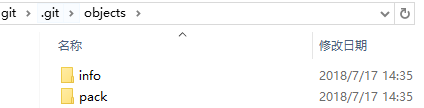

<!--
 * @Author: JohnJeep
 * @Date: 2020-05-01 16:22:04
 * @LastEditTime: 2020-08-13 08:57:52
 * @LastEditors: Please set LastEditors
 * @Description: Git内部原理剖析
 * @FilePath: /Git/02-git-advance.md
--> 

<!-- TOC -->

- [1. Git提高部分](#1-git提高部分)
  - [1.1. Git协议](#11-git协议)
    - [1.1.1. SSH(Secure Shell)协议](#111-sshsecure-shell协议)
  - [1.2. Git内部原理](#12-git内部原理)
  - [1.3. Git数据存储的位置](#13-git数据存储的位置)

<!-- /TOC -->
# 1. Git提高部分

## 1.1. Git协议
- 四种协议传输资料
  - 本地(Local)协议
  - Git协议
  - HTTP协议
  - SSH(Secure Shell)协议

### 1.1.1. SSH(Secure Shell)协议
- 概念
  - SSH 协议支持口令与密钥两种安全验证模式，但无论那种模式，最终都需要使用密钥来加密数据以确保安全，而 SSH 密钥通常使用的算法为 RSA 和 DSA。

- 命令　
  - SSH1：只支持RSAS算法
  - SSH2：支持RSA和DSA算法  
  - `ssh -T git@github.com`查看SSHkey
  - `sssh-keygen -t rsa` 使用RSA算法创建密钥
  - `id_rsa` 密钥 和 `id_rsa.pub` 公钥

- 为什么要用SSH？
  - 是保证本机(当前电脑)与GitHub服务器连接的有效凭证
  - 因为GitHub需要识别出你推送的提交确实是你推送的，而不是别人冒充的，而Git支持SSH协议，所以，GitHub只要知道了你的公钥，就可以确认只有你自己才能推送。
  - GitHub允许你添加多个Key，只要把每台电脑的Key都添加到GitHub，就可以在每台电脑上往GitHub推送了。
  - Git支持多种协议，包括`https`，但通过`ssh`支持的原生git协议速度最快。

## 1.2. Git内部原理
- Git仓库中5个对象
  - 三个数据对象(blob object)：保存着文件快照

  - 一个树对象(tree object)：记录着目录结构和 blob 对象索引

  - 一个提交对象(commit object)：包含着指向树对象的指针和所有提交信息
    > 提交对象(git commit object)：每一个提交在 Git 中都通过 git commit object 存储，对象具有一个全局唯一的名称，叫做 revision hash。它的名字是由 SHA-1 算法生成，形如"998622294a6c520db718867354bf98348ae3c7e2"，我们通常会取其缩写方便使用，如"9986222"。
    - 对象构成：commit 对象包含了 author + commit message 的基本信息。
    - 对象存储：git commit object 保存一次变更提交内的所有变更内容，而不是增量变化的数据 delta (很多人都理解错了这一点)，所以 Git 对于每次改动存储的都是全部状态的数据。
    - 大对象存储：因对于大文件的修改和存储，同样也是存储全部状态的数据，所以可能会影响 Git 使用时的性能(glfs 可以改进这一点）。
    - 提交树：多个 commit 对象会组成一个提交树，它让我们可以轻松的追溯 commit 的历史，也能对比树上 commit 与 commit 之间的变更差异。

- `hooks` 目录包含客户端或服务端的钩子脚本（hook scripts）
- `objects` 目录存储所有数据内容
- `refs` 目录存储指向数据（分支、远程仓库和标签等）的提交对象的指针

- `HEAD`  是一个符号引用（symbolic reference），并不完全是指向目前所在的分支, 而是指向正在操作的 commit提交。
  - **符号引用：**  表示它是一个指向其他引用的指针。 
  - `cat .git/HEAD` 或者`git symbolic-ref HEAD`  查看HEAD文件中的内容
  - `git show HEAD` 查看HEAD信息
  - 当前活跃的分支在哪儿，`HEAD` 就指向哪儿，是git内部用来追踪当前位置的方式。 `HEAD` 并非只能指向分支的最顶端（时间节点距今最近的那个），它也可以指向任何一个节点。

 - 当 HEAD 指针直接指向提交时，就会导致 `detached HEAD` 状态，即游离状态。在此状态下创建了新的提交，新提交的信息不属于任何分支。相对应的，现存的所有分支也不会受 `detached HEAD` 状态提交的影响。

- 两种情况会导致`detached HEAD`，即游离状态。
  - `git checkout --detach ` HEAD 直接脱离分支头指针，指向分支头指针指向的 commit
  - `git checkout <commit id> ` 直接切换到commit id号

- 其它几种HEAD文件
  - `ORIG_HEAD` 当使用一些在 Git 看来比较危险的操作去移动 HEAD 指针的时候，ORIG_HEAD 就会被创建出来，记录危险操作之前的 HEAD，方便恢复HEAD。可以看作一个修改 HEAD 之前的简单备份。
  - `FETCH_HEAD` 记录从远程仓库拉取的记录。
  - `MERGE_HEAD` 当运行 `git merge` 时，`MERGE_HEAD` 记录你正在合并到你的分支中的提交。`MERGE_HEAD`在合并的时候会出现，合并结束时就删除了这个文件。
  - `CHERRY_PICK_HEAD` 记录您在运行 `git cherry-pick` 时要合并的提交。这个文件只在 `cherry-pick` 期间存在。
- `index` 文件保存暂存区信息

## 1.3. Git数据存储的位置
1. `.git`目录中的`objects`子目录就是用来存储数据的，其中两个子目录是系统自动创建的，可以看到当前并没有存储任何数据。

  

2. `git hash -object -w --stdin`  
   - `git hash-object`命令用来存储数据对象
   - `-w`表示不仅计算出内容的`sha-1`值，而且会将数据存储，否则只会给出`sha-1`值。
   - `--stdin`表示内容是通过标准输入设备获取的，比如我通过键盘输入

3. 内容存储位置总结如下：
   - 存储于`.git/objects`目录中。
   - 以`sha-1`值的前**2**作为子目录名称，存储内容的文件名字为`sha-1`值的后**38**位。
   - 查看`sha-1`值 里面的内容 `git cat-file -p`

4. `git gc` 查看数据库占用了多少空间
5. `git count-objects -v` 快速的查看占用空间大小

