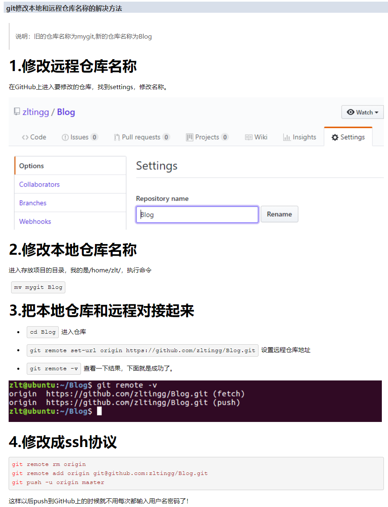
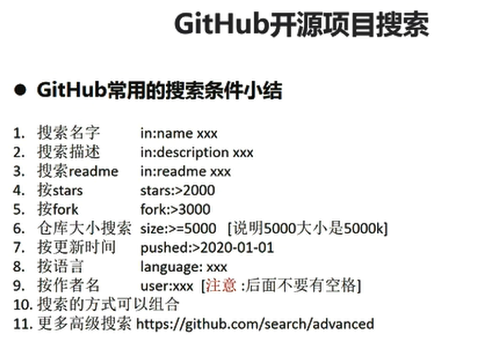

<!--
 * @Author: JohnJeep
 * @Date: 2022-09-30 16:42:27
 * @LastEditors: JohnJeep
 * @LastEditTime: 2025-04-06 13:40:31
 * @Description:
 * Copyright (c) 2023 by John Jeep, All Rights Reserved.
-->

# 1. FAQ

## 1.1. git 远程仓库更换名称，本地如何修改？
- 适用于本地和远程的代码没得任何问题，就是远程仓库改了个名称，直接在本地修改远程仓库地址即可： `git remote set-url origin new_address`
- 另外还可以先删除，然后添加地址：
  ```bash
  git remote rm origin
  git remote add origin new_address
  ```

  

## 1.2. Git 中文乱码
- [解决 Git 在 windows 下中文乱码的问题](https://gist.github.com/nightire/5069597)


## 1.3. LF or CRLF
Git 多平台换行符问题 (LF or CRLF)。文本文件所使用的换行符，在不同的系统平台上是不一样的。UNIX/Linux 使用的是 0x0A（LF），早期的 Mac OS 使用的是 0x0D（CR），后来的 OS X 在更换内核后与 UNIX 保持一致了。但 DOS/Windows 一直使用 0x0D0A（CRLF） 作为换行符。

跨平台协作开发是常有的，不统一的换行符确实对跨平台的文件交换带来了麻烦。最大的问题是，在不同平台上，换行符发生改变时，Git 会认为整个文件被修改，这就造成我们没法 diff，不能正确反映本次的修改。还好 Git 在设计时就考虑了这一点，其提供了一个 autocrlf 的配置项，用于在提交和检出时自动转换换行符，该配置有三个可选项：

```bash
# 提交时转换为 LF，检出时转换为 CRLF
git config --global core.autocrlf true

# 提交时转换为 LF，检出时不转换
git config --global core.autocrlf input

# 提交检出均不转换
git config --global core.autocrlf false
```

如果把 `autocrlf` 设置为 false 时，那另一个配置项 `safecrlf` 最好设置为 ture。该选项用于检查文件是否包含混合换行符，其有三个可选项：

```bash
# 拒绝提交包含混合换行符的文件
git config --global core.safecrlf true

# 允许提交包含混合换行符的文件
git config --global core.safecrlf false

# 提交包含混合换行符的文件时给出警告
git config --global core.safecrlf warn
```

Windows 上 Git bash 客户端自带了 `dos2unix` 转换工具，将换行符统一转换为 Unix 下的 LF。只需执行下面的命令即可：
```bash
find . -type f -exec dos2unix {} +
```

Linux 与 Windows 换行符 转换
```bash
Linux 下使用 cat -A file 来查看文件采用的是哪种换行符。Windows 下编辑的文件放到 Linux 下打开，发现每行结尾是 ^M$，表示 CRLF；而 Linux 下的文件每行结尾是 $，表示 LF。

使用 dos2unix 和 unix2dos 命令进行 Linux 与 windows 不同平台下的换行符格式转换。
dos2unix [-kn] file [newfile]
unix2dos [-kn] file [newfile]
参数项
  -n: 保留原本的旧文件，将转换后的内容输出到新文件
  -k: 保留文件中原本的 mtime 时间格式
```

## 1.4. Github 开源项目搜索技巧
| 搜索名字     | in:name xxx           |
| -------- | --------------------- |
| 搜索描述     | in:description xxx    |
| 搜索 readme | in:readme xxx         |
| 按 stars   | stars:>2000           |
| 按 fork    | fork:>3000            |
| 按仓库大小    | size:>=5000  (5000KB) |
| 按更新时间    | pushed:>2021-02-06    |
| 按语言      | language:xxx          |
| 按作者名     | user:xxx              |




## 1.5. References
- Github 仓库搜索高级技巧：https://github.com/search/advanced
- [Git 多平台换行符问题 (LF or CRLF)](https://sampwood.github.io/2019/01/07/git%E5%A4%9A%E5%B9%B3%E5%8F%B0%E6%8D%A2%E8%A1%8C%E7%AC%A6%E9%97%AE%E9%A2%98-LF-CRLF/)