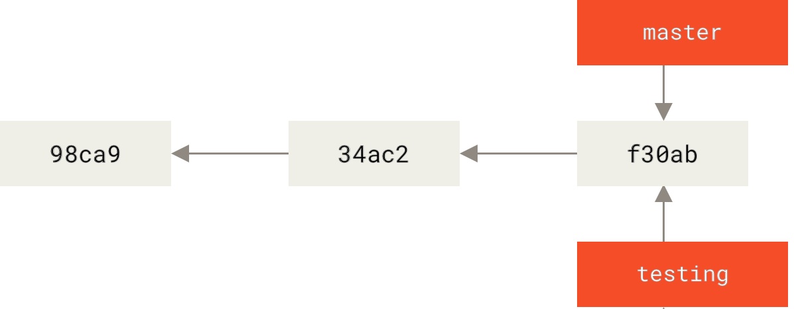
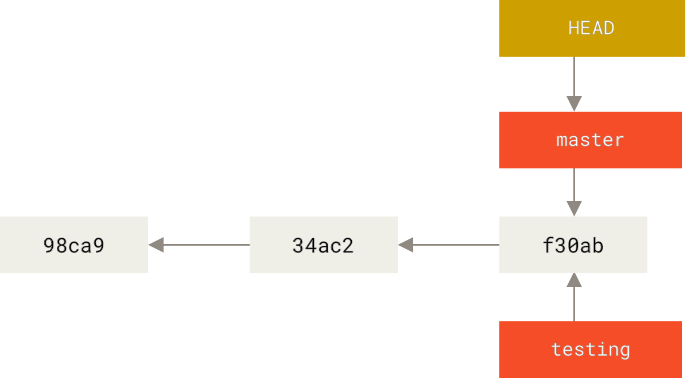
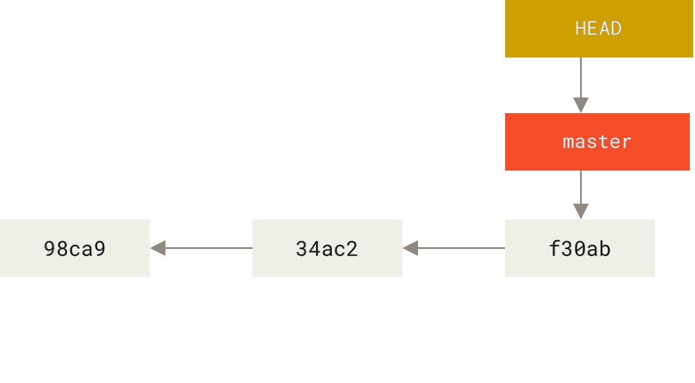
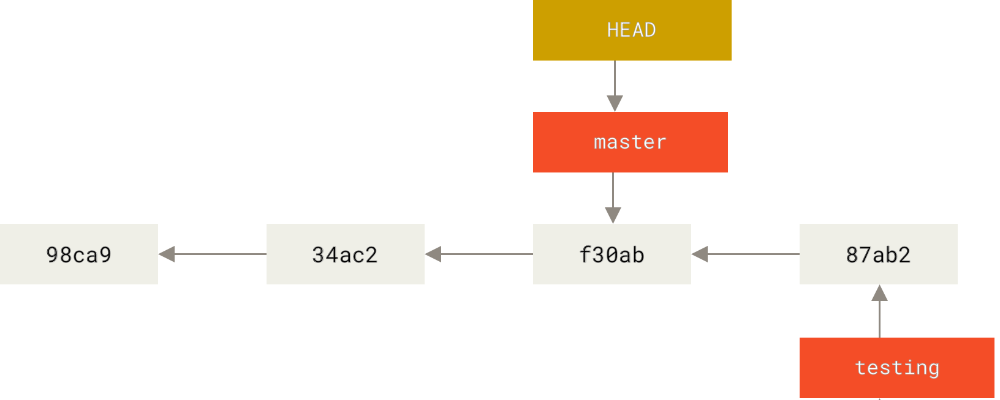
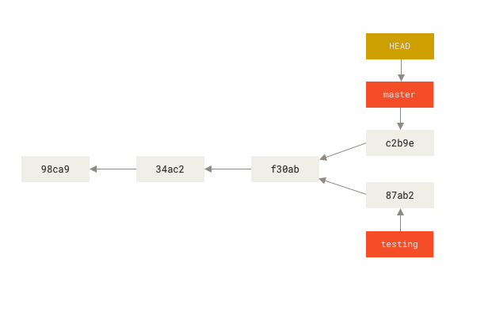
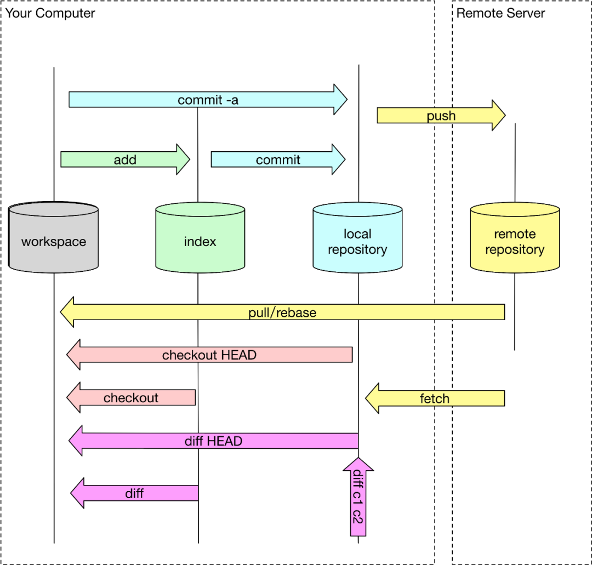
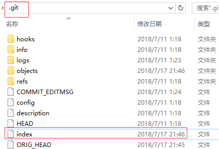
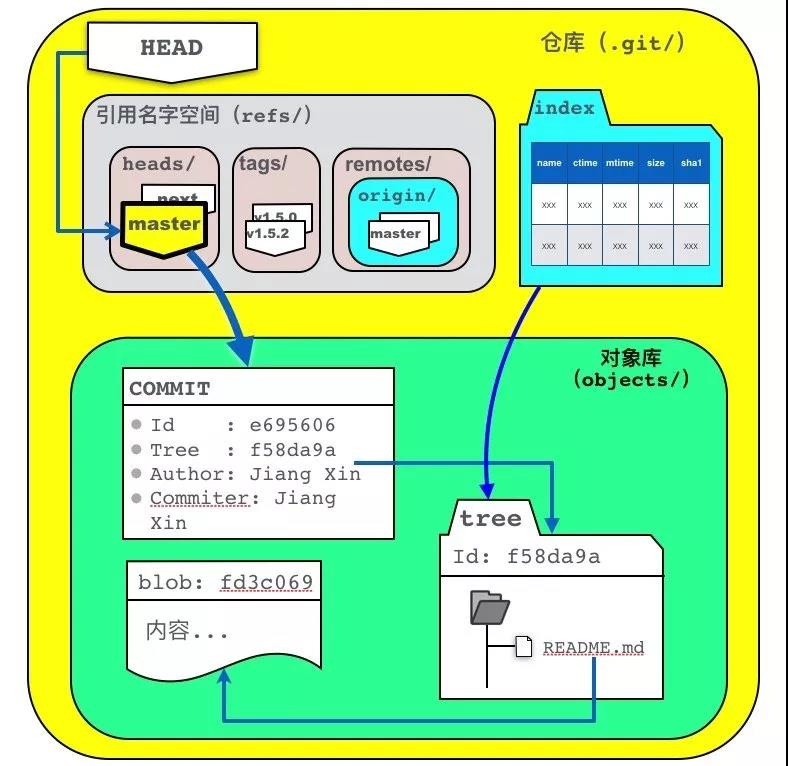

<!--

 * @Author: JohnJeep
 * @Date: 2019-04-04 23:28:59
 * @LastEditTime: 2022-03-20 01:09:24
 * @LastEditors: Please set LastEditors
 * @Description: git基础命令学习
--> 

<!-- TOC -->

- [1. Git 基础板块](#1-git-基础板块)
  - [1.1. Git init](#11-git-init)
  - [1.2. Git add](#12-git-add)
  - [1.3. Git log](#13-git-log)
  - [1.4. Git tag](#14-git-tag)
  - [1.5. Git alias](#15-git-alias)
  - [1.6. Git checkout](#16-git-checkout)
  - [1.7. Git commit](#17-git-commit)
  - [1.8. Git diff](#18-git-diff)
  - [1.9. Git stash](#19-git-stash)
  - [1.10. Git blame](#110-git-blame)
  - [1.11. Git bisect](#111-git-bisect)
  - [1.12. Git branch](#112-git-branch)
    - [1.12.1. Branch Command](#1121-branch-command)
    - [1.12.2. Branches Principle](#1122-branches-principle)
    - [1.12.3. Branches conflict](#1123-branches-conflict)
  - [1.13. Git rebase](#113-git-rebase)
  - [1.14. Git revert](#114-git-revert)
  - [1.15. Git Reset](#115-git-reset)
  - [1.16. Removing or restore files](#116-removing-or-restore-files)
    - [1.16.1. 删除指定文件](#1161-删除指定文件)
    - [1.16.2. 恢复删除的文件](#1162-恢复删除的文件)
  - [1.17. Git 四区](#117-git-四区)
    - [1.17.1. Workspace](#1171-workspace)
    - [1.17.2. Index](#1172-index)
    - [1.17.3. Local repository](#1173-local-repository)
    - [1.17.4. Remote repository](#1174-remote-repository)
      - [1.17.4.1. Git remote](#11741-git-remote)
      - [1.17.4.2. Git pull Git fetch](#11742-git-pull-git-fetch)
      - [1.17.4.3. 远程仓库与本地的关联](#11743-远程仓库与本地的关联)
      - [1.17.4.4. git远程仓库更换名称，本地如何修改？](#11744-git远程仓库更换名称本地如何修改)
  - [1.18. Git中文乱码](#118-git中文乱码)
  - [1.19. LF or CRLF](#119-lf-or-crlf)
  - [1.20. Git代理配置](#120-git代理配置)
  - [1.21. Git update](#121-git-update)
  - [1.22. 提交代码总结](#122-提交代码总结)
  - [1.23. Github 开源项目搜索技巧](#123-github-开源项目搜索技巧)
- [2. Git高级板块](#2-git高级板块)
  - [2.1. Git协议](#21-git协议)
    - [2.1.1. SSH(Secure Shell)协议](#211-sshsecure-shell协议)
  - [2.2. Git Internals](#22-git-internals)
    - [2.2.1. Git文件状态](#221-git文件状态)
    - [2.2.2. Git目录组成](#222-git目录组成)
    - [2.2.3. Git objects](#223-git-objects)
    - [2.2.4. Git Reference](#224-git-reference)
- [3. 学习参考](#3-学习参考)

<!-- /TOC -->

# 1. Git 基础板块

## 1.1. Git init
- `git init` 初始化一个Git仓库 


## 1.2. Git add
- `git add -p(patch)` 依次存储每一个文件的改动，包括文件中做的哪些些改动
- `git add <file>` 添加文件到暂存区


## 1.3. Git log

- `git log` 查看历史记录。按提交时间列出所有的更新，最近的更新排在最上面。显示的有HASH散列码、提交日期、提交的注释等。
  - `HEAD` 表示当前版本，下标从零开始。
  - `HEAD^` 上一个版本就是，`HEAD^^` 上上一个版本就是,当然往上100个版本写100个^比较容易数不过来，所以写成`HEAD~100`
- `git log -g`: 按照标准日志的格式输出引用日志 `reflog`
- `git log -p` 打印提交更新的所有内容，包括文件的内容
- `git log -p -2` 显示最近两次提交的内容
- `git log --stat` 显示每次提交的简略统计信息，包括多少个文件改变、HASH码、日期、提交的注释等信息。
- `git log --pretty=keyword` 指定使用不同于默认格式的方式展示提交历史。keyword 有以下内建的子选项
  - online：将每个提交放在一行显示，查看的提交数很大时非常有用。
  - format：定制自己要显示的记录格式。
- `git log --graph`：显示 ASCII 图形表示的分支合并历史，常与`--pretty=format`结合使用。例如：`git log --pretty=format:"%h %s" --graph`
- `git log --all --graph --decorate` 用 ASCII 图像化显示所有提交的历史记录、各个分支的指向以及项目的分支分岔情况。
- `git log --since=2.weeks` 列出所有最近两周内的提交。since与until按照时间对提交的内容做筛选，后面可以直接跟特定的时间。`--since=2020-01-07`
- `git log -S 筛选内容`  列出那些添加或移除了某些字符串的提交。
- `git fsck --full`: 显示出所有没有被其他对象指向的对象。`git fsck` 检查所有数据库的完整性。
- `gir log --name-status` 显示每次修改的文件列表及修改状态：新增、修改、删除。
- `git log --name-only` 只显示每次修改的文件列表

------------------------------------------------------------------------
- `git whatchanged`  显示每次修改的文件列表
- `git whatchanged --stat` 显示每次修改的文件列表及统计信息
- `git reflog expire --expire=now --all` 清除所有 `reflog` 的引用
- `git show` 显示最后一次文件改变的具体内容


## 1.4. Git tag

Git tag 有两种类型。
- 轻量标签（lightweight）：很像一个不会改变的分支——它只是一个特定提交的引用。
  - 本质上是将提交校验和存储到一个文件中——没有保存任何其他信息。 
  - `git tag 标签名`创建标签
- 附注标签（annotated）：存储在 Git 数据库中的一个完整对象
  - `git tag -a v1.0 -m "first commit"` 创建标签;`-m`选项指定了一条将会存储在标签中的信息。
  - `git show 标签名`看到标签信息与对应的提交信息

------------------------------------------------------
- `git tag -a 标签号 HASH码`后期给指定文件打标签
- `git push origin(仓库别名) 标签名`将标签共享到远程仓库上
- `git push origin --tags`将所有不在远程仓库服务器上的标签全部推送到上面。
- `git tag -d <tagname>`删除掉本地仓库上的标签
- `git push <remote> :refs/tags/<tagname> ` 更新并删除远程仓库标签
- `git tag` 查看历史tag记录
- `git checkout v1.0` 切换到某个tag，查看某个标签所指向的文件版本。
  
  > 注意： 会导致仓库处于分离头指针(detacthed HEAD)状态.在“分离头指针”状态下，如果你做了某些更改然后提交它们，标签不会发生变化，但你的新提交将不属于任何分支，并且将无法访问，除非确切的提交哈希。


## 1.5. Git alias

- `git config --global alias.unstage 'reset HEAD --'`  给取消暂存取一个别名


## 1.6. Git checkout

切换或者创建新分支
- `git checkout  <new_branch_name>`   切换到 new_branch_name 分支下
- `git branch Develop`  新建Develop分支
- `git checkout -b <new_branch_name>`   创建 new_branch_new分支，并切换到当前分支
> Git 2.23 版本之后，使用 `git switch` 替代原先的 `git chechout`。切换到已存在的分支: `git switch testing-branch`; 创建一个新分支并切换到当前分支: `git switch -c new-branch`; 返回到你 checkout 之前的分支: `git switch -`


用暂存区或者指定commit提交内容覆盖工作区内容
-  用暂存区内容覆盖工作区内容 
   - `git checkout readme.txt` 将暂存区中的`readme.txt`文件还原到工作区，如果要还原多个文件，使用**空格**分隔
   - 还原所有文件 `git checkout .`
   - 特别说明：如果checkout后面是文件名称，以下写法更为稳妥：`git checkout -- readme.txt`
     - 文件名称前面有两个**横杠**，并且中间采用**空格**分隔（否则报错）。此种方式可以防止Git出现误判，加入暂存区有一个文件名为`ant`（没有后缀名），恰好当前项目也有有个名为`ant`的分支，这个时候Git会优先将`ant`当做分支处理，于是就有可能导致错误 
- 指定commit提交的内容覆盖工作区 
  - `git checkout Develop -- readme.txt`  将对应分支中的文件(readme.txt)还原到当前分支(Develop)的工作区


## 1.7. Git commit

```sh
// 暂时不清楚是哪个？？？

参数项
  pick 使用这个参数，commit 信息什么都不用做。
  reword 修改 commit 信息。
  --edit  修改 commit 提交的内容。但是使用这个命令的时候，rebase 操作会停在 commit 提交处，等待修改完毕，使用 git add . 和  git commit --amend 修改提交，git rebase --continue 继续 rebase 进程。
  --squash 将当前需要改变的commit信息与之前commit提交的信息进行合并，把融合的信息保存到融合后的提交中。
  --fixup 放弃融合后提交的提交信息。
  exec 在新的一行使用shell来运行commit信息。
  drop 删除commit 提交信息。
```


- 修改最近一次的注释
  - `git commit --amend` 修改最后一次提交的注释 
  - `git rebase --continue` 执行修改的commit
  - push到远程GitHub，若有冲突，需要将远程repository的代码pull到本地，然后再push到远程repository。

- 修改历史提交的注释
  - `git log -n 4` 查看最近4次操作的日志
  - `git rabase -i HEAD~n` 修改倒数第n次的commit
  - 将`pick`修改为`edit`
  - `git commit --amend`修改commit的内容
  - `git rebase --continue` 执行修改的commit
  - push到远程GitHub，若有冲突，需要将远程repository的代码pull到本地，然后再push到远程repository。

- Git commit 提交规范
  - `commit message`格式
    ```
      <type>(<scope>): <subject>
    ```
  - type(必须): 用于说明git commit的类别，只允许使用下面的标识。
    - feat：新功能（feature）。
    - fix/to：修复bug，可以是QA发现的BUG，也可以是研发自己发现的BUG。
    - fix：产生diff并自动修复此问题。适合于一次提交直接修复问题
    - to：只产生diff不自动修复此问题。适合于多次提交。最终修复问题提交时使用fix
    - docs：文档（documentation）。
    - style：格式（不影响代码运行的变动）。
    - refactor：重构（即不是新增功能，也不是修改bug的代码变动）。
    - perf：优化相关，比如提升性能、体验。
    - test：增加测试。
    - chore：构建过程或辅助工具的变动。
    - revert：回滚到上一个版本。
    - merge：代码合并。
    - sync：同步主线或分支的Bug。
  
  - scope(可选)
    - scope用于说明 commit 影响的范围，比如数据层、控制层、视图层等等，视项目不同而不同。

  - subject(必须)
    - subject是commit目的的简短描述，不超过50个字符。
    - 建议使用中文（感觉中国人用中文描述问题能更清楚一些）。
    - 结尾不加句号或其他标点符号。

  - 提交的例子
    ```
    fix(DAO):用户查询缺少username属性 
    feat(Controller):用户查询接口开发
    ```


- 参考
  - [Git 修改已提交的commit注释](https://www.jianshu.com/p/098d85a58bf1)
  - [Commit message 和 Change log 编写指南](http://www.ruanyifeng.com/blog/2016/01/commit_message_change_log.html)
  - [git rebase vs git merge详解](https://www.cnblogs.com/kidsitcn/p/5339382.html)
  - [如何规范你的Git commit？](https://mp.weixin.qq.com/s/vzgST0ko-HZVkFFiSZ2xGg)


## 1.8. Git diff

- `git diff` 比较工作区和暂存区之间的差异
- `git diff HEAD` 比较工作区与最新本地仓库之间的差异
- `git diff --cached`比较暂存区与最新本地仓库的差异 
- `git diff master origin/master `  查看本地仓库中分支为 `master` 的文件与Github远程仓库中别名为`origin`下 `master` 分支文件的差异。


## 1.9. Git stash

- Git还提供了一个 `stash` 功能，可以把当前工作现场“储藏”起来，等以后恢复现场后继续工作：`git stash`,去解决 Bug 问题。
- `git stash list` 命令查看存储的工作现场 
- Git 把 `stash` 内容存在某个地方了，但是需要恢复一下，有两个办法
  - 一是用 `git stash apply` 恢复，但是恢复后，stash内容并不删除，你需要用 `git stash drop` 来删除
  - 另一种方式是用 `git stash pop`，恢复的同时把 `stash` 内容也删了。

## 1.10. Git blame

## 1.11. Git bisect

找到某个 bug 是哪次 commit 的。


## 1.12. Git branch

### 1.12.1. Branch Command

- 本地仓库分支
  - `git branch` 查看本地仓库分支
  - `git branch -v` 查看每个分支最后一次提交的内容
  - `git branch -r` 查看远程仓库的所有分支
  - `git reflog show --date=iso master`  查看指定分支的历次更改记录
  - `git branch --merge` 查看哪些分支已经合并到当前分支
  - `git branch --no-merged` 查看所有包含未合并工作的分支
  - `git branch branch_name` 创建一个分支，且不会自动切换到新分支中去
  - `git merge`合并分支：在分支`a`下写代码，与分支`master`上的代码合并
    - 第一步，切换到分支`master`下`git chechout master`
    - 第二步，与分支`a`合并`git merge a`
  - `git branch -d a` 删除指定分支 a 
  - `git branch -D a` 强制把未合并的分支删除
  - `git log --oneline --decorate --graph --all` 查看提交历史、各个分支的指向以及项目的分支分叉情况
  - `git stash save` 切换分支之前保存要修改的文件，不想提交之前的工作
  - `git stash list` 查看存储在栈上的文件
  - `git stash apply` 将最近存储的文件重新使用
  - `git stash apply stash_name`使用之前某次存储的文件

- 远程仓库分支
  - `git branch --remote` 查看远程仓库分支


- 常用分支命名：
<font color="red"> 
  - develop 
  - topic 
  - proposed 
  - hotfix(紧急分支) 
  - iss534  
  - experiment 
</font>


### 1.12.2. Branches Principle
<font color="red">Git 中的分支只是指向提交对象之一的轻量级可移动指针。</font>

Git 是怎么创建新分支的呢？ 很简单，它只是为你创建了一个可以移动的新的指针。 比如，创建一个 testing 分支， 你需要使用 git branch 命令：
```
git branch testing
```


 > Git 分支的本质是一个文件：包含所指对象的校验和（长度为 40 的 SHA-1 character），所以它的创建和销毁都非常高效。 创建一个新分支就相当于往一个文件中写入 41 个 bytes (40 characters 和 1 newline)。


Git 又是怎么知道当前在哪一个分支上呢？ 也很简单，它有一个名为 HEAD 的特殊指针。 请注意它和许多其它版本控制系统（如 Subversion 或 CVS）里的 HEAD 概念完全不同。 在 Git中，它是一个指针，指向当前所在的本地分支（译注：将 HEAD 想象为当前分支的别名）。 在本例中，你仍然在 master 分支上。 因为 git branch 命令仅仅 创建 一个新分支，并不会自动切换到新分支中去。


  - <font color="red">HEAD指针指向的当前所在分支，HEAD 分支随着提交操作自动向前移动。</font>


每次提交，Git都把它们串成一条时间线，这条时间线就是一个分支。`HEAD` 不是指向提交，而是**指向** `master`，`master` 才是**指向**提交的，所以`HEAD` 指向当前所在分支。

一开始的时候，`master`分支是一条线，Git 用`master`指向最新的提交，再用`HEAD`**指向**`master`，就能确定当前分支，以及当前分支的提交点：


每次提交，`master` 分支都会向前移动一步，这样，随着你不断提交，`master`分支的线也越来越长。当创建一个新的分支时，Git 就新建了一个指针叫 `testing`，指向与`master` 相同的提交，当你 checkout 到 `testing` 分支下时，再把 `HEAD` 指针指向 `testing`，就表示当前分支在 `testing`上:


Git创建一个分支很快，因为除了增加一个 `testing` 指针，改变 `HEAD` 的指向，工作区的文件都没有任何变化！不过，从现在开始，对工作区的修改和提交就是针对`testing`分支了，比如新提交一次后，`testing`指针往前移动一步，而`master`指针不变：



此时 Git 工作区中的 分支历史：



假如我们在`testing`上的工作完成了，就可以把`testing`合并到`master`上。Git怎么合并呢？最简单的方法，就是直接把`master`指向`testing`的当前提交，就完成了合并：


合并完分支后，甚至可以删除`testing`分支。删除`testing`分支就是把`testing`指针给删掉，删掉后，我们就剩下了一条`master`分支：


### 1.12.3. Branches conflict

- 为什么会产冲突？
  - 两个分支中修改了相同的文件。**注意：** 两个分支中分别修改了不同文件中的部分，不会产生冲突，可以直接将这两部分合并。
  - 两个分支中修改了同一个文件的名称 

-  采用`Git rebase(变基)`与`git merge`进行解决
  - 什么时候用`rebase`？
    - 本质是先取消自己的提交，临时保存，然后把当前分支更新到最新的origin分支，最后应用自己的提交。
    - 合并多次提交纪录: 例如：合并前4次提交的记录`git rebase -i HEAD~4`，合并的 commit 不能是已经 push 到远程仓库的记录。
    - 合并分支
    - <font color="red"> 注意: </font> 已经推送到github远程仓库的文件（多人开发的重要分支）不要，使用 `git rebase`，否则远程仓库的分支记录会被修改，别人就不能正常的提交了。

  - 什么时候用`merge`?
    - 默认情况下，Git执行"快进式合并"（fast-farward merge），会直接将Master分支指向Develop分支。使用`--no-ff`  参数，用普通模式合并，在master主分支上生成一个新的节点。可以在分支历史上看哪些曾经做过哪些的合并；而`fast forward`合并，则没有合并操作的记录，会丢掉分支信息。`git merge --no-ff -m "merge with   no-ff" dev` 
    - 将两个分支进行合并提交。将一个分支的变更集成到另一个分支的变更。 

- 分支合并步骤
  - 从远程仓库拉取数据 `git fetch origin master` 
    
    > 将远程仓库分支的数据拉取到本地临时分支 `git fetch origin master:temp`
  - 查看远程仓库的版本 `git remote -v`
  - 比较本地仓库与远程仓库的区别 `git diff master origin/master`
  - 手动解决冲突，提交（commit）信息
  - 合并冲突，将远程仓库与本地仓库合并 `git merge origin master`

> Git合并分支很快！就改改指针，工作区内容不变！

- 参考
  - [彻底搞懂 Git-Rebase](http://jartto.wang/2018/12/11/git-rebase/)
  - [Git冲突与解决方法](https://www.cnblogs.com/gavincoder/p/9071959.html) 
  - [Git分支合并冲突解决](https://www.cnblogs.com/shuimuzhushui/p/9022549.html)


## 1.13. Git rebase

Rebase 官方翻译为 “变基”，我觉得翻译为**重新改变基准**更为合适。`git rebase` 和 `git merge` 都可以用于分支的合并，但使用 `git rebase` 合并的分支，提交（commit）信息是线性的，因为它会清除当前分支提交（commit）的版本历史信息，只选择保留最后一次的提交信息；而 `merge` 是把不同分支的最终结果合并在一起。


总结下，`git rebase` 有两个功能

1. 压缩提交的记录。
2. 分支合并时，让合并的分支更简洁，只选择保留最后一次的提交信息，线性显示提交的记录，观察起来更优美。


## 1.14. Git revert


## 1.15. Git Reset

1. `git reset`命令是Git提供的后悔药之一，它可以帮我们把内容恢复到指定的`commit`提交版本。

2. `reset`翻译成中文有**重置**的意思，恰如起名，`git reset`命令可以重置当前分支所指向提交的位置，很多教程说此命令的作用是删除分支或者提交，其实这是完全错误的，`commit`提交依然存在，只是当前分支所指向的`commit`提交进行了重置，分支所指向的新`commit`提交之后的提交就像消失了一样（`git log`无法查询到）

3. 命令后面紧跟参数
   - `git reset`后面紧跟的参数是指定`commit`提交的标识 `git reset 5609309 --hard`
   - 标识可以是`sha-1`值或者`HEAD`、`HEAD^`或者分支名称等形式
     - `git reset HEAD^ --hard`
     - `HEAD`表示执行当前分支
   - 最后的参数`--hard`
   - `^`当前分支所指向提交的前一个提交，`^^`表示当前分支所指向提交的前一个分支的前一个分支，以此类推；`^^`过多自然不太方便，可以使用`HEAD~2`表示
   - 使用分支名称作为参数`git reset master^ --hard`

4. `mixed`、`soft` 和 `hard` 区别
    - `--mixed`：默认值，当重置分支所指向 `commit` 提交位置时，暂存区中的内容会被新指向的 `commit` 提交内容所替换，工作区内容不变，即它回退到某个版本，只保留源码，回退 commit 和 index 信息。
    - `--soft`：暂存区和工作区的内容都保持原样，不会被替换，只回退了 commit 的信息。
    - `--hard`：暂存区和工作区的内容都会被新指向的`commit`提交内容所替换，彻底回退到某个版本，本地的源码也会变为上一个版本的内容；`git reset --hard`只影响被跟踪的文件，如果工作区有新增的文件，并不会被影响。

5. 最后说明
   - 假如`commit`已经被`push`到远程仓库上，那么其他开发人员可能会基于对应的`commit`提交进行开发产生新的`commit`，如果此时进行`reset`操作，会造成其他开发人员的提交历史丢失，这可能会产生严重后果。


## 1.16. Removing or restore files 

### 1.16.1. 删除指定文件

- `rm` 删除命令，指令前面不加 `git`
  - 删除本地目录文件，但是提交到暂存区的文件不会删除。
  - `rm` 删除文件:`rm filename`  

- `git rm` 命令，git 中封装的 `rm` 指令
  - `git rm filename` 命令会删除已经提交到本地版本库中的内容，同时暂存区中的内容也会被删除。
  - `git rm --cache filename` 仅仅只是删除暂存区中的 filename 文件。
  > **特别说明**：处于未跟踪状态 (untracked) 只是没有存在于暂存区。

- 删除暂存区步骤
  ```
  git rm filename
  git commit -m "comment content"
  git push origin master
  ```

- 删除暂存区并更新远程仓库
  ```
  git rm --cached filename
  git commit -m "comment content"
  git push origin master --force
  ```


### 1.16.2. 恢复删除的文件

- 恢复工作区中被删除的文件   
  - `rm` 指令只是将工作区中的文件删除，已提交到暂存区中的文件依然存在。此时想要恢复被 `rm` 指令删除的文件，只要将暂存区内容恢复到工作区即可。
  - 恢复误删除的单个文件 `git checkout filename`
  - 恢复误删除的多个个文件 
    - 查看误删除的有哪些文件 `git ls-files -d` 
    - 进行文件的恢复 `git ls-files -d | xargs -i git checkout {}`

- 恢复暂存区中误删除的文件
  - `git rm` 命令会删除已经提交到本地版本库中的内容，同时暂存区中的内容也会被删除。若要想恢复删除的内容，那么只能从 `commit` 提交记录中恢复。使用 `git checkout HEAD readme.txt` 命令， 将最后一次 `commit` 提交的 `readme.txt` 文件从本地仓库中恢复。

- <font color="red">任何情况都可以恢复吗? </font>
  
  > 当然不是，如果你把`.gti`目录删除了，那肯定是无法再恢复。实质上，之所以能将删除的文件恢复，因为在`.git`目录中有备份，`Git`会将**暂存区**或者**历史提交**中内容来恢复。


## 1.17. Git 四区



Git 与 GitHub 使用，有四个区，需要理解。
- Workspace: 名为工作区，也可以称为 Working Directory (工作目录)，是你电脑存放代码的地方。
- Index: 名为暂存区，是 `.git` 目录下的一个 `index` 文件，它是 **指向** 文件的一个索引。
- local repository: 名为本地版本库，是 `Git` 用来保存本地项目的元数据和对象数据库的地方。
- Remote repository: 名为远程仓库，是远程服务器托管代码的地方。


### 1.17.1. Workspace

- Workspace (工作区) 也可以称为 Working Directory (工作目录)，是你电脑存放代码的地方。
<div align="center"> 
  
</div>

- 工作区目录下的每一个文件只有两种状态：已跟踪（tracked: 添加到暂存区）或未跟踪（untracked: 没有添加都暂存区）。


### 1.17.2. Index

- 在工作区路径下打开终端执行 `git init` 指令后，工作区内生成一个 `.git` 的文件，默认情况下，该文件的属性是隐藏的，不可见。**暂存区** 就是 `.git` 目录下有一个 `index` 文件，这个`index` 中文翻译为 `暂存区`，它是 **指向** 文件的一个索引。而真正的文件是存储在`.git/objects`目录中。

- 当删除 **暂存区** 内容时，其实就是删除 `index` 文件中的内容，但 `.git/objects` 目录中的内容不会被删除。
<div align="center"> 
  
</div>

1. Git清空暂存区
   - 暂存区实质是 `.git` 目录下的 `index` 文件，只要将此文件删除，那么暂存区就被清空。可用这条命令来将暂存区中的内容清空 `rm .git /index` 。

2. 暂存区存在的必要性
   - 有些朋友感觉暂存区多余，其实并非如此，通过这个过渡性区域可以使提交更加条理，避免无用琐碎提交。
   - 暂存区就如同一个临时性仓库，可以将来自工作区的新文件或者修改文件暂时存放起来，然后统一提交到分支中的版本库中。

3. `git ls-files` 查看暂存区里所有的内容，后面可加下面任意的选项参数。
   - `--cached(-c)` 显示暂存区中的文件； `git ls-files` 命令的默认参数是 `--cached(-c)`，默认情况下默认参数没有显示。
   - `--deleted(-d)` 显示删除的文件
   - `--modified(-m)` 显示修改过的文件
   - `--other(-o)` 显示没有被git跟踪的文件
   - `--stage(-s)` 显示mode以及文件对应的 `Blob` 对象，可以获取暂存区中对应文件里面的内容。


### 1.17.3. Local repository

- Git本地版本库是 `Git` 用来保存项目的元数据和对象数据库的地方。从其它计算机克隆仓库时，拷贝的就是这里的数据。

- 工作目录下有一个默认隐藏的目录`.git`，它并不属于工作目录，而是 Git 的本地版本库（Repository）。而版本库中内容很多，并且都很重要，有两个是我们实际操作中经常要遇到的，那就是暂存区（`index`）和分支(`branch`)。

- 将文件最终提交到版本库基本流程如下：
  - `git add`    将工作区未跟踪和修改文件提交到暂存区。
  - `git commit` 将暂存区内容提交到版本库中，并执行更新 HEAD 指向的指针，这样就完成了引用与提交、提交与改动快照的——对应了。
<div align="center"> 
  
</div>

- Git清空版本库
  - `rm -rf .git` 删除当前目录下的版本库（`.git`目录）
  - `git init`    重新初始化一个全新的版本库


### 1.17.4. Remote repository

#### 1.17.4.1. Git remote

- `git remote -v` 显示远程仓库的别名和对应的 URL。
- `git remote show remote_name` 查看某个远程仓库。
- `git remote rename old_name new_name` 重命名原仓库名字。
- `git remote rm remote_name` 移除一个远程仓库。
- `git remote add <alias_name> <url>` 本地仓库与仓库地址为 URL，别名为 `alias_name` 的远程仓库进行关联。


#### 1.17.4.2. Git pull Git fetch

- `git pull`: 将远程仓库上当前分支的数据抓取到本地仓库，并自动合并远程分支与本地仓库的分支，`git pull` 相当于 `git fetch` 和 `git merge` 两步操作的叠加。

- `git fetch`: 将远程仓库上当前分支的数据抓取到本地仓库，不修改本地仓库中的内容，需要自己手动进行合并。
- `git fetch <远程仓库名> <分支名> : <目标分支>`
  - 远程仓库名可以是仓库的别名，也可以直接是仓库的 URL 地址。 
  - `git fetch origin master : temp` 拉取远程 origin 仓库中 master 分支的数据到本地新建的 temp 分支。

- `git push <远程主机名> <本地分支名> : <远程分支名>`
  - `git push origin main : main` 将本地 main 分支中的数据推送到远程 origin 仓库的 main 分支上。若后面不指定 `: <远程分支名>`，git 会默认将当前本地的分支提交到远程仓库的默认分支中。


#### 1.17.4.3. 远程仓库与本地的关联

- `git remote add origin   git@github.com:michaelliao/learngit.git` 将本地仓库添加到远程Git仓库，默认别名为 `origin`

- `git push origin master` 当前本地仓库内容推送到别名为 `origin`，分支为 `master` 的远程仓库。

- `git clone <URL> <folder_name>` 
  - 本地位置克隆一个远程仓库地址为 `URL` 的仓库，并将其写到 `folder_name` 文件中。这个 `<folder_name>` 是选择项，若不指定文件名，则克隆后的仓库名默认与远程仓库的名字一样。
  - `git clone https://github.com/xxxxx/Guide.git` 远程Guide仓库克隆到一个同名的本地仓库
  - `git clone https://github.com/xxxxx/Guide.git temp` 远程Guide仓库中内容克隆到名称为 `temp` 的本地仓库。

- `git push -u origin master` 将当前分支的内容推送给远程仓库 `origin` 的 `master` 分支
  -  参数 `-u`，推送的同时将 `origin` 仓库的 `master` 分支设置为本地仓库当前分支的 `upstream（上游）`。
  - git不但会把本地的`master`分支内容推送的远程新的`master`分支，还会把本地的`master`分支和远程的`master`分支关联起来，在以后的推送或者拉取时就可以简化命令。


#### 1.17.4.4. git远程仓库更换名称，本地如何修改？

- 适用于本地和远程的代码没得任何问题，就是远程仓库改了个名称，直接在本地修改远程仓库地址即可： `git remote set-url origin new_address`
- 另外还可以先删除，然后添加地址：
  ```
  git remote rm origin
  git remote add origin new_address
  ```

  


## 1.18. Git中文乱码


- [解决 Git 在 windows 下中文乱码的问题](https://gist.github.com/nightire/5069597)


## 1.19. LF or CRLF

Git 多平台换行符问题(LF or CRLF)。文本文件所使用的换行符，在不同的系统平台上是不一样的。UNIX/Linux 使用的是 0x0A（LF），早期的 Mac OS 使用的是 0x0D（CR），后来的 OS X 在更换内核后与 UNIX 保持一致了。但 DOS/Windows 一直使用 0x0D0A（CRLF） 作为换行符。

跨平台协作开发是常有的，不统一的换行符确实对跨平台的文件交换带来了麻烦。最大的问题是，在不同平台上，换行符发生改变时，Git 会认为整个文件被修改，这就造成我们没法 diff，不能正确反映本次的修改。还好 Git 在设计时就考虑了这一点，其提供了一个 autocrlf 的配置项，用于在提交和检出时自动转换换行符，该配置有三个可选项：

```
# 提交时转换为LF，检出时转换为CRLF
git config --global core.autocrlf true

# 提交时转换为LF，检出时不转换
git config --global core.autocrlf input

# 提交检出均不转换
git config --global core.autocrlf false


```

如果把 autocrlf 设置为 false 时，那另一个配置项 safecrlf 最好设置为 ture。该选项用于检查文件是否包含混合换行符，其有三个可选项：
```
# 拒绝提交包含混合换行符的文件
git config --global core.safecrlf true

# 允许提交包含混合换行符的文件
git config --global core.safecrlf false

# 提交包含混合换行符的文件时给出警告
git config --global core.safecrlf warn
```

Windows 上 Git bash 客户端自带了 dos2unix 转换工具，将换行符统一转换为 Unix 下的 LF。只需执行下面的命令即可：
```
find . -type f -exec dos2unix {} +
```

Linux 与 Windows 换行符 转换

```
Linux 下使用 cat -A file 来查看文件采用的是哪种换行符。Windows 下编辑的文件放到 Linux 下打开，发现每行结尾是 ^M$，表示 CRLF；而 Linux 下的文件每行结尾是 $，表示 LF。

使用 dos2unix 和 unix2dos 命令进行 Linux 与 windows 不同平台下的换行符格式转换。
dos2unix [-kn] file [newfile]
unix2dos [-kn] file [newfile]
参数项
  -n: 保留原本的旧文件，将转换后的内容输出到新文件
  -k: 保留文件中原本的 mtime 时间格式
```


参考

- [Git 多平台换行符问题(LF or CRLF)](http://kuanghy.github.io/2017/03/19/git-lf-or-crlf)


## 1.20. Git代理配置 


- 只对github进行代理，不影响国内的仓库
  ```
  git config --global http.https//github.com.proxy http://127.0.0.1:8001
  git config --global https.https//github.com.proxy https://127.0.0.1:8001
  ```

- 设置全局代理，国内的仓库速度也会收到一定的影响。
  ```
  git config --global http.proxy http://127.0.0.1:1080
  git config --global https.proxy https://127.0.0.1:1080
  
  // 取消全局代理
  git config --global --unset http.proxy
  git config --global --unset https.proxy
  ```

- Windows下修改Host文件
  ```
  192.30.253.112 github.com
  192.30.253.113 github.com
  151.101.185.194 github.global.ssl.fastly.net
  ```

- 参考 
  - [Git 代理配置方案](https://wiki.imalan.cn/archives/Git%20%E4%BB%A3%E7%90%86%E9%85%8D%E7%BD%AE%E6%96%B9%E6%A1%88/)


## 1.21. Git update
- git windows 更新 `git update-git-for-windows`


## 1.22. 提交代码总结

第一次提交：
- `git init`  初始化
- `git add README.md`   提交到暂存库
- `git commit -m "first commit"`   为提交的文件添加注释说明
- `git remote add origin git@github.com:michaelliao/learngit.git`  本地Git库与远程的仓库关联
- `git push -u origin master`      本地库的所有内容推送到远程库上


不是第一次提交：
- `git add README.md`              提交到暂存库
- `git commit -m "first commit"`   为提交的文件添加注释说明
- `git push origin master`         本地库的所有内容推送到远程库上


 Git 常用命令
- `git init`初始化一个Git仓库 
- 添加文件到Git仓库，分两步：
  - `git add <file>` 添加文件到暂存区
  - `git commit -m <message>` 给添加到暂存区的文件增加注释，`-m` 代表是提交信息
- `git status` 查看当前工作区的状态
- `git diff` 比较工作区中当前文件和暂存区快照之间的差异
- `git diff --stage` 查看已暂存的将要添加到下次提交里的内容
- `git difftool` 使用图像化工具查看工作区与暂存区之间的差异
- `git reflog` 查看引用日志。每次提交或改变分支都会改变引用日志(reflog) 
- `git reset --hard HEAD^` 回退到 `HEAD^`版本
- `git config --list` 列出所有 Git 当时能找到的配置
- `git help <verb>` 查看帮助，verb为Git的关键字
- `git add -p(patch)` 依次存储每一个文件的改动，包括文件中做的哪些些改动

## 1.23. Github 开源项目搜索技巧

| 搜索名字   | in:name xxx           |
| ---------- | --------------------- |
| 搜索描述   | in:description xxx    |
| 搜索readme | in:readme xxx         |
| 按stars    | stars:>2000           |
| 按fork     | fork:>3000            |
| 按仓库大小 | size:>=5000  (5000KB) |
| 按更新时间 | pushed:>2021-02-06    |
| 按语言     | language:xxx          |
| 按作者名   | user:xxx              |

参考：https://github.com/search/advanced

# 2. Git高级板块

## 2.1. Git协议

- 四种协议传输资料
  - 本地(Local)协议
  - Git协议
  - HTTP协议
  - SSH(Secure Shell)协议


### 2.1.1. SSH(Secure Shell)协议

- SSH 协议支持口令与密钥两种安全验证模式，但无论那种模式，最终都需要使用密钥来加密数据以确保安全，而 SSH 密钥通常使用的算法为 RSA 和 DSA。

- 命令　
  - SSH1：只支持RSAS算法
  - SSH2：支持RSA和DSA算法  
  - `ssh -T git@github.com`查看SSHkey
  - `sssh-keygen -t rsa` 使用RSA算法创建密钥
  - `id_rsa` 密钥 和 `id_rsa.pub` 公钥


- 为什么要用SSH？
  - 是保证本机(当前电脑)与GitHub服务器连接的有效凭证
  - 因为GitHub需要识别出你推送的提交确实是你推送的，而不是别人冒充的，而Git支持SSH协议，所以，GitHub只要知道了你的公钥，就可以确认只有你自己才能推送。
  - GitHub允许你添加多个Key，只要把每台电脑的Key都添加到GitHub，就可以在每台电脑上往GitHub推送了。
  - Git支持多种协议，包括`https`，但通过`ssh`支持的原生git协议速度最快。


## 2.2. Git Internals

- Git 不是存储每个文件与初始版本的差异，而是把数据看作是对小型文件系统的一组快照 (snapshots)。每次你提交更新，或在 Git 中保存项目状态时，它主要对当时的全部文件制作一个快照并保存这个快照的索引。 为了高效，如果文件没有修改，Git 不再重新存储该文件，而是只保留一个链接指向之前存储的文件。  

- Git保证了数据的完整性。所有数据在存储前都计算校验和(SHA-1 散列)，然后以校验和来引用。Git 数据库中保存的信息都是以文件内容的哈希值来索引，而不是文件名。

### 2.2.1. Git文件状态

- 已提交(committed)：表示数据已经安全的保存在本地仓库中。
- 已修改(modified)：表示修改了文件，但还没保存到本地仓库中。 
- 已暂存(staged)：表示对一个已修改文件的当前版本做了标记，存储到暂存区中。


### 2.2.2. Git目录组成

随着 Git 版本的不同，该目录下可能还会包含其他内容。 不过对于一个全新的 git init 版本库，这将是你看到的默认结构。 

- `description` 文件仅供 GitWeb 程序使用，我们无需关心。
- `config` 文件包含项目特有的配置选项。 
- `info` 目录包含一个全局性排除（global exclude）文件 ， 用以放置那些不希望被记录在 .gitignore
文件中的忽略模式（ignored patterns）。 
- `hooks` 目录包含客户端或服务端的钩子脚本（hook scripts）。
- `objects` 目录存储所有数据内容。
- `refs` 目录存储指向数据（分支、远程仓库和标签等）提交对象的指针。
- `index` 文件保存暂存区信息。
- `HEAD` 文件指向目前被检出的分支。

### 2.2.3. Git objects
Git 是一个内容寻址文件系统，听起来很酷。但这是什么意思呢？ 这意味着，Git 的核心部分是一个简单的键值对数据库（key-value data store）。 你可以向 Git 仓库中插入任意类型的内容，它会返回一个唯一的键，通过该键可以在任意时刻再次取回该内容。

可以通过底层命令 `git hash-object` 来演示上述效果: 可将任意数据保存于 `.git/objects` 目录（即 对象数据库），并返回指向该数据对象的唯一的键。即计算对象 ID 并可选择性的从文件创建一个 blob(Compute object ID and optionally creates a blob from a file)。 
- `-w`: 选项表示该命令不要只返回键，还要将该对象写入数据库中。
- `--stdin`: 从标准输入读 object，而不是从文件中读。若不指定此选项，则须在命令尾部给出待存储文件的路径。

```bash
$ echo "hello" | git hash-object   --stdin -w
ce013625030ba8dba906f756967f9e9ca394464a

$ ls -a .git/objects/
./  ../  ce/  info/  pack/

$ git cat-file -p ce013625030ba8dba906f756967f9e9ca394464a
hello

$ git cat-file -t ce013625030ba8dba906f756967f9e9ca394464a
blob
```

此命令输出一个长度为 40 个字符的校验和。 这是一个 SHA-1 哈希值——一个将待存储的数据外加一个头部信息（header）一起做 SHA-1 校验运算而得的校验和。
```bash
$ find .git/objects/ -type f
.git/objects/ce/013625030ba8dba906f756967f9e9ca394464a
.git/objects/info/packs
```

再次查看 `.git/objects` 目录，那么可以在其中找到一个与新内容对应的文件。 这就是开始时 Git存储内容的方式——**一个文件对应一条内容**， 以该内容加上特定头部信息一起的 SHA-1 校验和为文件命名。 校验和的前 2 个字符用于命名子目录，余下的 38 个字符则用作文件名。

查看文件为 sha-1 值中内容: 
```bash
$ git cat-file -p 007105d165b1e388febc15f648156fd0ec3bb53f
tree 49fea036e5503edada62e2cd82bf2d25c3d6d2be
parent 2dda59cea1dc91a74101ef1fd0f30d7fc38919d9
author xxx <xxx@gmail.com> 1612772353 +0800
committer xxx <xxx@gmail.com> 1612772353 +0800
Update C++ STL
```

`git cat-file -t` 命令，可以让 Git 告诉我们其内部存储的任何对象类型，只要给定该对象的 SHA-1 值：
```bash
$ git cat-file -t 007105d165b1e388febc15f648156fd0ec3bb53f
commit
```

Git 仓库中有五个对象：三个 blob 对象（保存着文件快照）、一个 树对象（记录着目录结构和 blob 对象 index）以及一个提交对象（包含着指向上次提交对象 （父对象）的指针和所有提交信息）。


数据对象(blob object)：保存着文件快照。


树对象（tree object），它能解决文件名保存的问题，也允许我们将多个文件组织到一起。 Git 以一种类似于 UNIX 文件系统的方式存储内容，但作了些许简化。 所有内容均以树对象和数据对
象的形式存储，其中树对象对应了 UNIX 中的目录项，数据对象则大致上对应了 inodes 或文件内容。 一个树对象包含了一条或多条树对象记录（tree entry），每条记录含有一个指向数据对象或者子树对象的 SHA-1 指针，
以及相应的模式、类型、文件名信息。
- `git update-index` 为文件创建一个暂存区。
- `git write-tree` 命令将暂存区内容写入一个树对象。
- `git read-tree` 命令，可以把树对象读入暂存区。
  - `--prefix` 选项，将一个已有的树对象作为子树读入暂存区`。


文件模式
- 100644，表明这是一个普通文件。
- 100755，表示一个可执行文件。
- 120000，表示一个符号链接。

提交对象(commit object)：包含着指向树对象 (tree object)的指针和所有提交信息。
> 提交对象(git commit object)：每一个提交在 Git 中都通过 git commit object 存储，对象具有一个全局唯一的名称，叫做 revision hash。它的名字是由 SHA-1 算法生成，形如"998622294a6c520db718867354bf98348ae3c7e2"，我们通常会取其缩写方便使用，如"9986222"。
- 对象构成：commit 对象包含了 author + commit message 的基本信息。
- 对象存储：git commit object 保存一次变更提交内的所有变更内容，而不是增量变化的数据 delta (很多人都理解错了这一点)，所以 Git 对于每次改动存储的都是全部状态的数据。
- 大对象存储：因对于大文件的修改和存储，同样也是存储全部状态的数据，所以可能会影响 Git 使用时的性能(glfs 可以改进这一点）。
- 提交树：多个 commit 对象会组成一个提交树，它让我们可以轻松的追溯 commit 的历史，也能对比树上 commit 与 commit 之间的变更差异。

>  `git add` 和 `git commit` 命令时，Git 所做的工作实质就是将被改写的文件保存为数据对象，更新暂存区，记录树对象，最后创建一个指明了顶层树对象和父提交的提交对象。 


### 2.2.4. Git Reference
- Git 中用 `reference 或简写refs` 这个名字指针来替代原始提交文件的 SHA-1 值。


- HEAD reference: 是一个符号引用（symbolic reference），并不完全是指向目前所在的分支, 而是指向正在操作的 commit提交。
  > 符号引用：表示它是一个指向其他引用的指针。 
  - `cat .git/HEAD` 或者`git symbolic-ref HEAD`  查看HEAD文件中的内容
  - `git show HEAD` 查看HEAD信息
  - 当前活跃的分支在哪儿，`HEAD` 就指向哪儿，是git内部用来追踪当前位置的方式。 `HEAD` 并非只能指向分支的最顶端（时间节点距今最近的那个），它也可以指向任何一个节点。
  - 当 HEAD 指针直接指向提交时，就会导致 `detached HEAD` 状态，即游离状态。在此状态下创建了新的提交，新提交的信息不属于任何分支。相对应的，现存的所有分支也不会受 `detached HEAD` 状态提交的影响。两种情况会导致`detached HEAD`，即游离状态。
  - `git checkout --detach ` HEAD 直接脱离分支头指针，指向分支头指针指向的 commit
  - `git checkout <commit id> ` 直接切换到commit id号
  - 其它几种HEAD文件
    - `ORIG_HEAD` 当使用一些在 Git 看来比较危险的操作去移动 HEAD 指针的时候，ORIG_HEAD 就会被创建出来，记录危险操作之前的 HEAD，方便恢复HEAD。可以看作一个修改 HEAD 之前的简单备份。
    - `FETCH_HEAD` 记录从远程仓库拉取的记录。
    - `MERGE_HEAD` 当运行 `git merge` 时，`MERGE_HEAD` 记录你正在合并到你的分支中的提交。`MERGE_HEAD`在合并的时候会出现，合并结束时就删除了这个文件。
    - `CHERRY_PICK_HEAD` 记录您在运行 `git cherry-pick` 时要合并的提交。这个文件只在 `cherry-pick` 期间存在。
  


- `git gc`: 清理不必要的文件并优化本地存储库(Cleanup unnecessary files and optimize the local repository)。
- `git count-objects -v`: 计算未打包的对象数量及其磁盘消耗 (Count unpacked number of objects and their disk consumption)。


# 3. 学习参考
- [git-scm.com](https://git-scm.com/docs): Git官方参考手册。
- [**git-recipes**](https://github.com/geeeeeeeeek/git-recipes)：github上开源的git中文食谱，收集了许多国外优秀的文章，质量很高。
- [图解Git](http://marklodato.github.io/visual-git-guide/index-zh-cn.html): 采用画图的方式来理解Git.
- [Learn Git Branching](https://learngitbranching.js.org/)：通过玩游戏的方式来学习Git。
- [How to Write a Git Commit Message](https://chris.beams.io/posts/git-commit/): 一份好的git commit 的建议，推荐阅读。
- [Version Control (Git)](https://missing.csail.mit.edu/2020/version-control/): MIT 2020 年开设的一门 missing-semester 课程，这是 Version Control (Git) 章节。
- [Git for Computer Scientists](https://eagain.net/articles/git-for-computer-scientists/): 简短的解释Git的数据模型，有很多的图来阐述。
- [How to explain git in simple words?](https://xosh.org/explain-git-in-simple-words/): 解释了Git底层实现的一些过程。
- [Git from the Bottom Up](https://jwiegley.github.io/git-from-the-bottom-up/): 不仅解释了Git的数据模型，还解释了其实现的细节。
- [Git PAT 使用](https://blog.csdn.net/yjw123456/article/details/119696726): Github 支持 personal access token 的用法。
- [A successful Git branching model](https://nvie.com/posts/a-successful-git-branching-model/)： Vincent Driessen 介绍 git 工作流。

