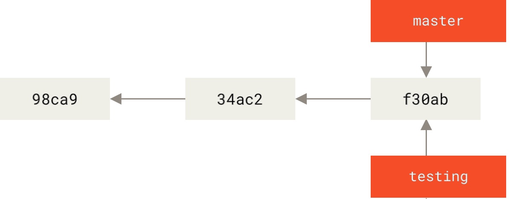
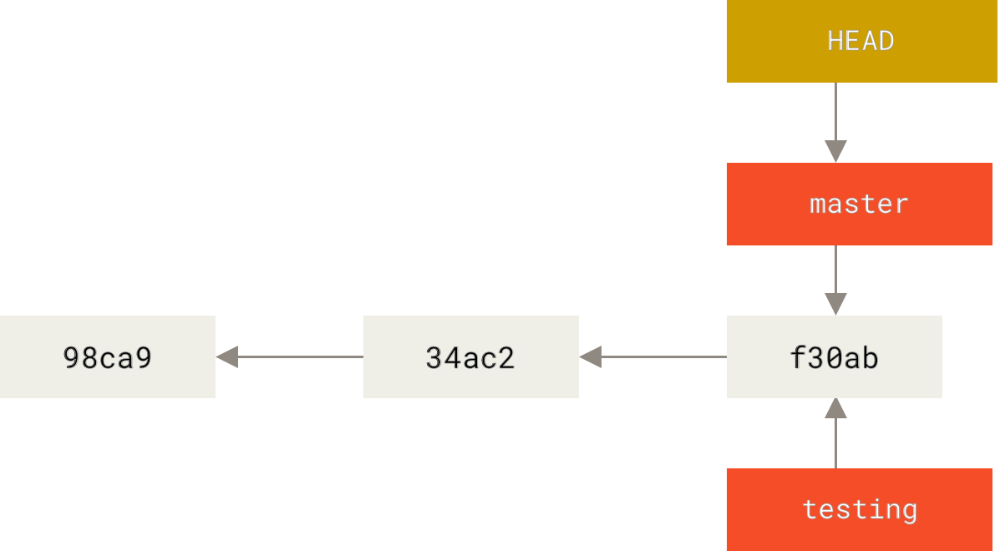
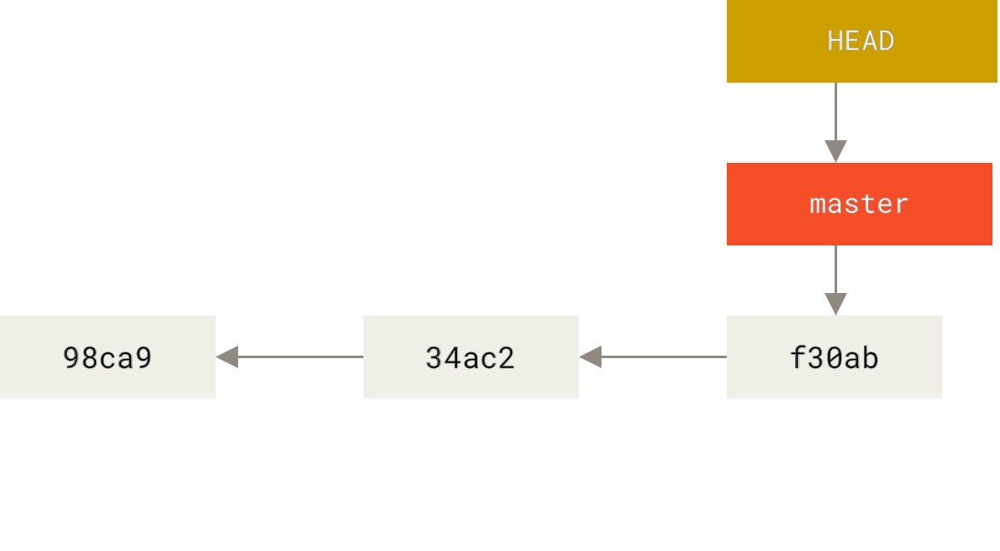
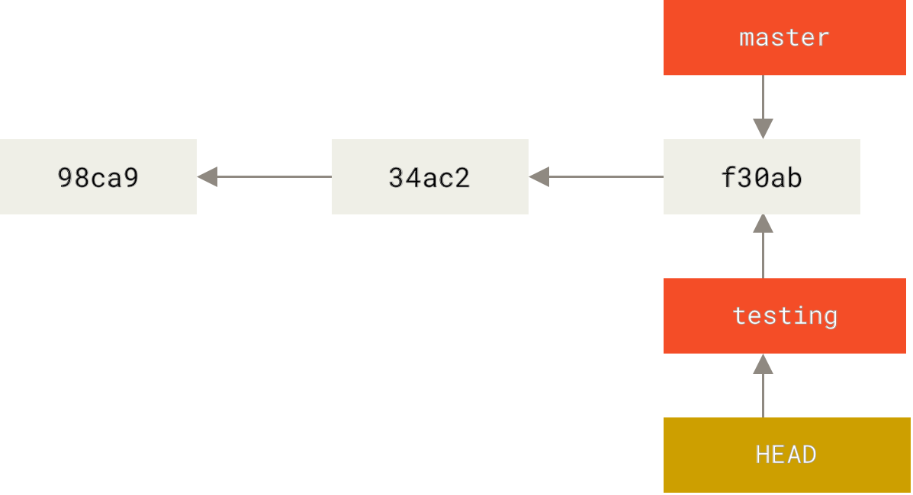
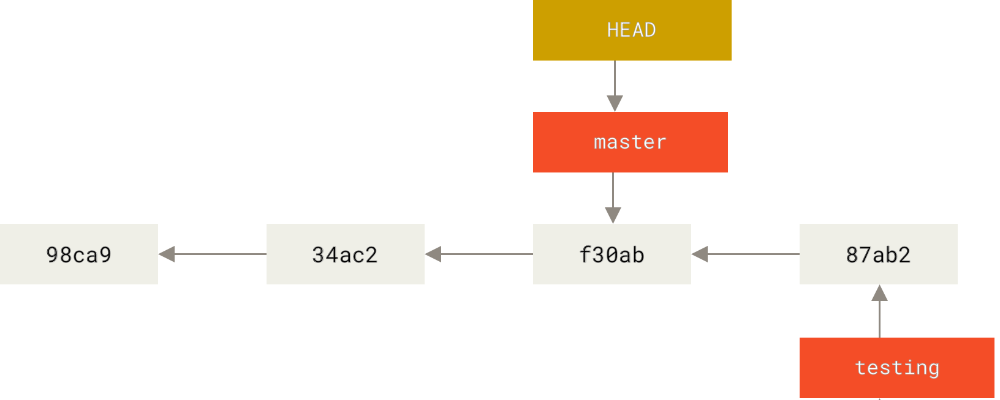
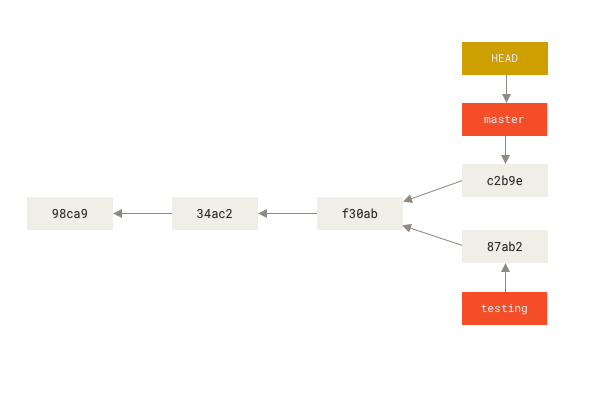
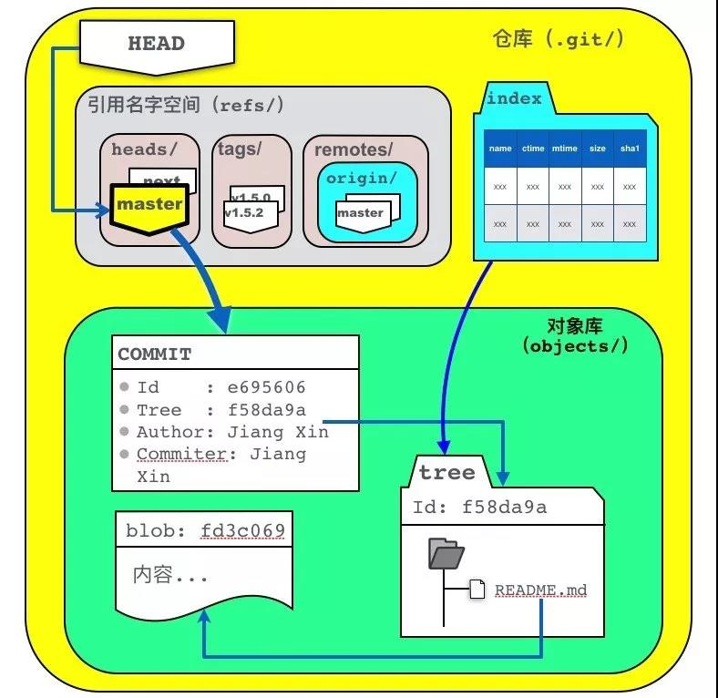

<!--
 * @Author: JohnJeep
 * @Date: 2019-04-04 23:28:59
 * @LastEditors: JohnJeep
 * @LastEditTime: 2025-12-11 16:24:47
 * @Description: Git Usage
 * Copyright (c) 2022 by johnjeep, All Rights Reserved.
-->

- [1. Git Command](#1-git-command)
  - [1.1. Git init](#11-git-init)
  - [1.2. Git add](#12-git-add)
  - [1.3. Git log](#13-git-log)
  - [1.4. Git tag](#14-git-tag)
  - [1.5. Git alias](#15-git-alias)
  - [1.6. Git checkout](#16-git-checkout)
  - [1.7. Git commit](#17-git-commit)
  - [1.8. Git diff](#18-git-diff)
  - [1.9. Git push](#19-git-push)
  - [1.10. Git pull](#110-git-pull)
  - [1.11. Git stash](#111-git-stash)
  - [1.12. Git blame](#112-git-blame)
  - [1.13. Git cherry-pick](#113-git-cherry-pick)
  - [1.14. Git bisect](#114-git-bisect)
  - [1.15. Git revert](#115-git-revert)
  - [1.16. Git Reset](#116-git-reset)
  - [1.17. Remove or Restore](#117-remove-or-restore)
    - [1.17.1. remove](#1171-remove)
    - [1.17.2. restore](#1172-restore)
  - [1.18. other command](#118-other-command)
- [2. Git Branch](#2-git-branch)
  - [2.1. Local repo branch](#21-local-repo-branch)
  - [2.2. Remote repo branch](#22-remote-repo-branch)
  - [2.3. Branches Principle](#23-branches-principle)
  - [2.4. Branches conflict](#24-branches-conflict)
    - [2.4.1. Git rebase](#241-git-rebase)
    - [2.4.2. Git merge](#242-git-merge)
  - [2.5.](#25)
- [3. Git Area](#3-git-area)
  - [3.1. Workspace](#31-workspace)
  - [3.2. Index](#32-index)
  - [3.3. Local repository](#33-local-repository)
  - [3.4. Remote repository](#34-remote-repository)
    - [3.4.1. Git remote](#341-git-remote)
    - [3.4.2. Git pull \&\& Git fetch](#342-git-pull--git-fetch)
    - [3.4.3. Remote and local repository](#343-remote-and-local-repository)
- [4. Git Config](#4-git-config)
  - [4.1. credential](#41-credential)
  - [4.2. .gitignore](#42-gitignore)
- [5. Git Proxy](#5-git-proxy)
- [6. Git LFS](#6-git-lfs)
- [7. References](#7-references)


# 1. Git Command

## 1.1. Git init
- `git init` 初始化一个 Git 仓库

## 1.2. Git add

`git add` 的核心功能就是把工作区里的改动加入到暂存区，为后续的 `git commit` 做准备

| 命令                    | 作用                                     | 适用场景                               |
| ----------------------- | ---------------------------------------- | -------------------------------------- |
| `git add file1 file2`   | 添加指定文件到暂存区                     | 精确挑选要提交的文件                   |
| `git add .`             | 添加当前目录下的修改和新增（不含删除）   | 快速提交当前目录的所有改动             |
| `git add -A`            | 添加所有修改（包括新增、修改、删除）     | 提交整个仓库的快照                     |
| `git add -u`            | 更新已跟踪文件的修改和删除（不含新文件） | 只想更新已有文件，不想加入新文件       |
| `git add dir/`          | 添加某个目录下的所有改动                 | 提交模块/子目录的变更                  |
| `git add -p`            | 交互式选择要添加的 diff 块               | 精细控制提交，避免一次提交太多无关改动 |
| `git add --interactive` | 进入交互模式，可以选择文件/块            | 更全面的交互式操作                     |


## 1.3. Git log
- `git log` 查看历史记录。按提交时间列出所有的更新，最近的更新排在最上面。显示的有 HASH 散列码、提交日期、提交的注释等。
  - `HEAD` 表示当前版本，下标从零开始。
  - `HEAD^` 上一个版本就是，`HEAD^^` 上上一个版本就是, 当然往上 100 个版本写 100 个 ^ 比较容易数不过来，所以写成 `HEAD~100`
- `git log -g`: 按照标准日志的格式输出引用日志 `reflog`
- `git log -p` 打印提交更新的所有内容，包括文件的内容
- `git log -p -2` 显示最近两次提交的内容
- `git log --stat` 显示每次提交的简略统计信息，包括多少个文件改变、HASH 码、日期、提交的注释等信息。
- `git log --pretty=keyword` 指定使用不同于默认格式的方式展示提交历史。keyword 有以下内建的子选项
  - online：将每个提交放在一行显示，查看的提交数很大时非常有用。
  - format：定制自己要显示的记录格式。
- `git log --graph`：显示 ASCII 图形表示的分支合并历史，常与 `--pretty=format` 结合使用。例如：`git log --pretty=format:"%h %s" --graph`
- `git log --all --graph --decorate` 用 ASCII 图像化显示所有提交的历史记录、各个分支的指向以及项目的分支分岔情况。
- `git log --since=2.weeks` 列出所有最近两周内的提交。since 与 until 按照时间对提交的内容做筛选，后面可以直接跟特定的时间。`--since=2020-01-07`
- `git log -S 筛选内容 `  列出那些添加或移除了某些字符串的提交。
- `git fsck --full`: 显示出所有没有被其他对象指向的对象。`git fsck` 检查所有数据库的完整性。
- `gir log --name-status` 显示每次修改的文件列表及修改状态：新增、修改、删除。
- `git log --name-only` 只显示每次修改的文件列表

---
- `git whatchanged`  显示每次修改的文件列表
- `git whatchanged --stat` 显示每次修改的文件列表及统计信息


---
- `git reflog expire --expire=now --all` 清除所有 `reflog` 的引用
- `git show` 显示最后一次文件改变的具体内容


## 1.4. Git tag
Git tag 有两种类型。
- 轻量标签（lightweight）：很像一个不会改变的分支——它只是一个特定提交的引用。
  - 本质上是将提交校验和存储到一个文件中——没有保存任何其他信息。
  - `git tag 标签名 ` 创建标签
- 附注标签（annotated）：存储在 Git 数据库中的一个完整对象
  - `git tag -a v1.0 -m "first commit"` 创建标签;`-m` 选项指定了一条将会存储在标签中的信息。
  - `git show 标签名 ` 看到标签信息与对应的提交信息

---

- `git tag -a 标签号 HASH 码 ` 后期给指定文件打标签
- `git push origin(仓库别名) 标签名 ` 将标签共享到远程仓库上
- `git push origin --tags` 将所有不在远程仓库服务器上的标签全部推送到上面。
- `git tag -d <tagname>` 删除掉本地仓库上的标签
- `git push <remote> :refs/tags/<tagname> ` 更新并删除远程仓库标签
- `git tag` 查看历史 tag 记录
- `git checkout v1.0` 切换到某个 tag，查看某个标签所指向的文件版本。
  
  > 注意： 会导致仓库处于分离头指针 (detacthed HEAD) 状态. 在 “分离头指针” 状态下，如果你做了某些更改然后提交它们，标签不会发生变化，但你的新提交将不属于任何分支，并且将无法访问，除非确切的提交哈希。


## 1.5. Git alias
- `git config --global alias.unstage 'reset HEAD --'`  给取消暂存取一个别名

## 1.6. Git checkout

切换或者创建新分支
- `git checkout  <new_branch_name>`   切换到 new_branch_name 分支下
- `git branch Develop`  新建 Develop 分支
- `git checkout -b <new_branch_name>`   创建 new_branch_new 分支，并切换到当前分支
  
  > Git 2.23 版本之后，使用 `git switch` 替代原先的 `git chechout`。切换到已存在的分支: `git switch testing-branch`; 创建一个新分支并切换到当前分支: `git switch -c new-branch`; 返回到你 checkout 之前的分支: `git switch -`
- `git checkout -b <new_branch_name> origin/feature` 从远程已存在的 `feature` 分支上拉取代码到本地新建的分支 `new_branch_name`，同时切换到新创建的分支上。
  

用暂存区或者指定 commit 提交内容覆盖工作区内容
- 用暂存区内容覆盖工作区内容
  - `git checkout readme.txt` 将暂存区中的 `readme.txt` 文件还原到工作区，如果要还原多个文件，使用 **空格** 分隔
  - 还原所有文件 `git checkout .`
  - 特别说明：如果 checkout 后面是文件名称，以下写法更为稳妥：`git checkout -- readme.txt`
    - 文件名称前面有两个 **横杠**，并且中间采用 **空格** 分隔（否则报错）。此种方式可以防止 Git 出现误判，加入暂存区有一个文件名为 `ant`（没有后缀名），恰好当前项目也有有个名为 `ant` 的分支，这个时候 Git 会优先将 `ant` 当做分支处理，于是就有可能导致错误
- 指定 commit 提交的内容覆盖工作区
  - `git checkout Develop -- readme.txt`  将对应分支中的文件 (readme.txt) 还原到当前分支 (Develop) 的工作区

---

`git checkout` 是 Git 里一个 **多用途** 的命令，常见用法主要有：

| **用法**                     | **示例**                           | **说明**                       |
| ---------------------------- | ---------------------------------- | ------------------------------ |
| 切换到已有分支               | `git checkout feature-x`           | 切到 feature-x 分支            |
| 新建并切换分支               | `git checkout -b hotfix`           | 新建 hotfix 分支并切换         |
| 从远程分支新建本地分支       | `git checkout -b dev origin/dev`   | 从远程 origin/dev 新建本地分支 |
| 切换到某个提交               | `git checkout 1a2b3c4`             | HEAD 游离，进入指定提交        |
| 恢复文件到当前分支的最新提交 | `git checkout -- file.txt`         | 撤销工作区修改                 |
| 从其他分支恢复文件           | `git checkout branchX -- file.txt` | 取 branchX 的文件到当前分支    |

在 `git 2.23+` 版本之后，Git 社区觉得 `checkout` **一命多用太混乱**，拆出两个新的命令

- `git switch` → 专门负责 **分支切换/新建**
- `git restore` → 专门负责 **文件恢复**

| 功能                         | `git checkout` 写法                | 新写法 (`git switch` / `git restore`)   |
| ---------------------------- | ---------------------------------- | --------------------------------------- |
| 切换到已有分支               | `git checkout develop`             | `git switch develop`                    |
| 新建并切换分支               | `git checkout -b feature-x`        | `git switch -c feature-x`               |
| 从远程分支新建本地分支       | `git checkout -b dev origin/dev`   | `git switch -c dev origin/dev`          |
| 切换到某个提交               | `git checkout 1a2b3c4`             | `git switch --detach 1a2b3c4`           |
| 恢复文件到当前分支的最新提交 | `git checkout -- file.txt`         | `git restore file.txt`                  |
| 从其他分支恢复文件           | `git checkout branchX -- file.txt` | `git restore --source=branchX file.txt` |


## 1.7. Git commit

`git commit` 把暂存区里的改动保存到本地仓库，生成一次新的提交记录。

```sh
参数项
  pick 使用这个参数，commit 信息什么都不用做。
  reword 修改 commit 信息。
  --edit  修改 commit 提交的内容。但是使用这个命令的时候，rebase 操作会停在 commit 提交处，等待修改完毕，使用 git add . 和  git commit --amend 修改提交，git rebase --continue 继续 rebase 进程。
  --squash 将当前需要改变的 commit 信息与之前 commit 提交的信息进行合并，把融合的信息保存到融合后的提交中。
  --fixup 放弃融合后提交的提交信息。
  exec 在新的一行使用 shell 来运行 commit 信息。
  drop 删除 commit 提交信息。
```

修改最近一次的注释
- `git commit --amend` 修改最后一次提交的注释
- `git rebase --continue` 执行修改的 commit
- push 到远程 GitHub，若有冲突，需要将远程 repository 的代码 pull 到本地，然后再 push 到远程 repository。

修改历史提交的注释
- `git log -n 4` 查看最近 4 次操作的日志
- `git rabase -i HEAD~n` 修改倒数第 n 次的 commit
- 将 `pick` 修改为 `edit`
- `git commit --amend` 修改 commit 的内容
- `git rebase --continue` 执行修改的 commit
- push 到远程 GitHub，若有冲突，需要将远程 repository 的代码 pull 到本地，然后再 push 到远程 repository。

**总结一下**：

| 命令                                | 作用                                           | 适用场景                             |
| ----------------------------------- | ---------------------------------------------- | ------------------------------------ |
| `git commit`                        | 进入编辑器，写提交信息                         | 最常见的标准提交方式                 |
| `git commit -m "msg"`               | 直接写提交说明                                 | 一次性小提交，信息简单               |
| `git commit -a -m "msg"`            | 跳过 `git add`，自动提交已跟踪文件的修改和删除 | 快速提交所有改动（但不含新文件）     |
| `git commit -amend`                 | 修改最近一次提交（提交信息/文件内容都可改）    | 修正提交（比如忘记加文件或写错信息） |
| `git commit --amend -m "new msg"`   | 直接改写上一次提交信息                         | 小错立即修复                         |
| `git commit --allow-empty -m "msg"` | 生成一个没有改动的空提交                       | 测试流程、触发 CI/CD                 |

Git commit 提交规范：请参考 [Git-commit-convertion.md](./Git-commit-convertion.md) 文档。


## 1.8. Git diff
执行 `Git diff` 命令后，显示的结果分析：
> 执行命令之后，绿色部分代表增加的内容，红色部分代表删除的内容，
>
> ---代表源文件，即修改前的文件；+++代表目标文件，即修改后的文件;
>
> 小技巧：比较两个分支中的文件有哪些差异时，先将原来的文件放在前面，改动后的文件放在后面。这样放的好处是：对显示的结果好分析，更符合常人的逻辑思考结果。比如，改动后的文件相对未改动之前的文件，有添加的行，显示结果就为 ++++，若有删除除的行，显示的结果就显示 ———，非常的直观。

- `git diff` 比较工作区和暂存区之间的差异
- `git diff HEAD` 比较工作区与最新本地仓库之间的差异
- `git diff --cached` 比较暂存区与最新本地仓库的差异
- `git diff --stat <local branch> <remote branch>` 比较本地分支与远程指定分支之间的差异。
  - 统计有哪些文件被改动，有多少文件被改动，使用 `--stat` 参数。
    例如，比较本地分支 `feat_grpc` 与远程分支 `dev` 之间的差异
    ```shell
    git diff --stat feat_grpc  remotes/origin/dev
    ```
  - 查看指定路径下文件的详细差别。
    ```shell
    // 注意：路径名要在仓库的根路径之下
    git diff feat_grpc  remotes/origin/dev /src/comm.cpp
    ```
  - 查看本地仓库中分支为 `master` 的文件与 Github 远程仓库中别名为 `origin` 下 `master` 分支文件的差异。
    ```shell
    git diff master origin/master
    ```

## 1.9. Git push

`git push` 命令的作用是将本地分支的提交推送（上传）到远程仓库，使远程仓库的内容与本地保持同步

| 命令                                | 作用                               | 适用场景                                    |
| ----------------------------------- | ---------------------------------- | ------------------------------------------- |
| `git push`                          | 将当前分支推送到远程同名分支       | 最常用的推送方式                            |
| `git push <remote> <branch>`        | 推送指定分支到远程                 | 只推某个分支，如 `git push origin main`     |
| `git push -u <remote> <branch>`     | 推送并设置默认上游分支             | 新建分支后首次推送，后面可直接用 `git push` |
| `git push <remote> --all`           | 推送所有分支                       | 需要同步所有分支时                          |
| `git push <remote> --tags`          | 推送所有标签                       | 发布版本时                                  |
| `git push <remote> <tag>`           | 推送单个标签                       | 上传某个版本标签                            |
| `git push --force` 或 `git push -f` | 强制推送（覆盖远程历史）           | 必须重写远程历史时（危险操作）              |
| `git push --force-with-lease`       | 更安全的强制推送，避免覆盖别人提交 | 替代 `-f` 的推荐方式                        |
| `git push --dry-run`                | 模拟推送，不做实际操作             | 检查推送内容是否符合预期                    |

## 1.10. Git pull

`git pull` 命令的作用是从远程仓库获取最新的提交，并自动与当前分支进行合并（或 rebase）**。**

可以理解为：

> `git pull = git fetch + git merge` （或者 `git fetch + git rebase`，取决于配置）

| 命令                         | 作用                                         | 适用场景                                   |
| ---------------------------- | -------------------------------------------- | ------------------------------------------ |
| `git pull`                   | 从默认远程仓库的上游分支拉取并合并到当前分支 | 已设置好 upstream，直接更新代码            |
| `git pull <remote>`          | 从指定远程仓库拉取并合并                     | 有多个远程时使用，例如 `git pull upstream` |
| `git pull <remote> <branch>` | 从指定远程分支拉取并合并到当前分支           | 例如 `git pull origin dev`                 |
| `git pull --rebase`          | 拉取远程更新，并把本地提交变基到远程分支之上 | 团队协作时保持提交历史整洁                 |
| `git pull --ff-only`         | 只允许快进合并（fast-forward），否则拒绝合并 | 确保历史线性、不产生合并提交               |

## 1.11. Git stash

`git stash` 命令用于临时保存当前未提交的修改（包括工作区和暂存区），让工作目录恢复到干净状态，以便切换分支或拉取更新后再恢复这些修改。

| 命令                                   | 作用                                         | 适用场景                         |
| -------------------------------------- | -------------------------------------------- | -------------------------------- |
| `git stash`                            | 保存当前工作区和暂存区的修改，并清理工作目录 | 临时切换分支，但不想提交当前修改 |
| `git stash save "msg"`                 | 带描述信息地保存当前修改                     | 方便区分不同的 stash             |
| `git stash -u` / `--include-untracked` | 保存修改时连同 **未跟踪文件** 一起保存       | 新文件也要暂存时                 |
| `git stash list`                       | 查看所有保存的 stash                         | 想知道当前有哪些 stash           |
| `git stash apply [stash@{n}]`          | 应用某个 stash 的修改，但不删除 stash        | 多分支重复使用某份修改           |
| `git stash pop [stash@{n}]`            | 应用某个 stash 的修改，并删除该 stash        | 临时保存的修改已经恢复，不再需要 |
| `git stash drop [stash@{n}]`           | 删除某个 stash                               | 清理不再需要的 stash             |
| `git stash clear`                      | 删除所有 stash                               | 彻底清理 stash 栈                |
| `git stash branch <branch>`            | 从 stash 创建并切换到新分支，应用修改        | 临时修改需要独立成分支时         |


## 1.12. Git blame
在 Git 中，`blame` 是一个命令，用于查看文件的每一行是由哪个提交引入的。它可以帮助你确定代码中每个行的作者和最后修改的时间。

`git blame` 的基本用法如下：

```shell
git blame <file>
```

这会显示文件的每一行，以及每一行最后一次修改的提交信息，包括提交的哈希值、作者的姓名、修改的日期和时间。

你也可以通过指定一个特定的提交范围来限制 `blame` 的输出。以下是几个示例：

1. 指定一个文件的某个版本：
   ```shell
   git blame <commit> -- <file>
   ```
   这会显示指定提交中文件的每一行。
2. 指定某个提交之前的所有提交：
   ```shell
   git blame <commit>^ -- <file>
   ```
   这会显示指定提交之前的所有提交中文件的每一行。
3. 指定一个提交范围：
   ```shell
   git blame <start-commit>..<end-commit> -- <file>
   ```
   这会显示指定提交范围内文件的每一行。

`git blame` 还支持其他一些选项，例如 `-L` 选项用于指定只显示文件中的特定行号范围，以及 `-w` 选项用于忽略空白字符的变化。
这些只是 `git blame` 的基本用法和一些常见选项，还有其他更高级的用法，你可以查看 Git 的官方文档或运行 `git blame --help` 来获取更多详细信息。


## 1.13. Git cherry-pick

`git cherry-pick` 命令的作用是从其他分支中“挑选”一个或多个特定提交，应用到当前分支上。

| 命令                                      | 作用                                                   | 适用场景                                          |
| ----------------------------------------- | ------------------------------------------------------ | ------------------------------------------------- |
| `git cherry-pick <commit>`                | 将指定的单个提交应用到当前分支                         | 想把其他分支的某个 bug 修复或功能提交单独拿过来用 |
| `git cherry-pick <commit1> <commit2> ...` | 一次性拣选多个提交                                     | 多个不连续的提交需要引入当前分支时                |
| `git cherry-pick <commitA>^..<commitB>`   | 拣选一段提交范围（包含 commitA 之后到 commitB 的提交） | 连续的一批提交需要迁移过来时                      |
| `git cherry-pick -x <commit>`             | 在提交信息中附加“(cherry picked from …)”               | 需要保留来源信息以便追踪提交时                    |
| `git cherry-pick --abort`                 | 中止 cherry-pick，恢复操作前的状态                     | 出现复杂冲突，不想继续 cherry-pick 时             |
| `git cherry-pick --continue`              | 解决冲突后继续 cherry-pick 流程                        | cherry-pick 中途遇到冲突并解决后                  |


## 1.14. Git bisect

找到某个 bug 是哪次 commit 的。


## 1.15. Git revert

`git revert` 用于撤销某次提交的修改，但与 `git reset` 不同的是，它不会修改历史，而是创建一个新的“反向提交” 来抵消原提交的影响。

| 命令                                     | 作用                                               | 适用场景                                       |
| ---------------------------------------- | -------------------------------------------------- | ---------------------------------------------- |
| `git revert <commit>`                    | 生成一个新的提交，用来“撤销” `<commit>` 所做的更改 | 想在保留历史的同时撤销某个提交（不会改动历史） |
| `git revert -n <commit>` / `--no-commit` | 将撤销的更改放到工作区，**不自动提交**             | 想合并多个 revert 后再一次性提交               |
| `git revert -m 1 <merge-commit>`         | 撤销一个合并提交，`-m` 指定保留的父分支            | 想撤销错误的 merge 操作                        |
| `git revert HEAD`                        | 撤销最近一次提交                                   | 回滚最新提交但保留历史                         |
| `git revert <commit1> <commit2> ...`     | 一次性撤销多个提交                                 | 批量撤销特定更改                               |
| `git revert --continue`                  | 在解决冲突后继续 revert 流程                       | 遇到冲突时使用                                 |
| `git revert --abort`                     | 取消 revert，恢复操作前的状态                      | 不想继续撤销时使用                             |


## 1.16. Git Reset
`git reset` 命令是 Git 提供的后悔药之一，它可以帮我们把内容恢复到指定的 `commit` 提交版本，通常用于撤销提交或修改历史

`git reset` 后面紧跟一个指定的标识项。标识可以是 `sha-1` 值或者 `HEAD`、`HEAD^` 或者分支名称等形式。

- 标识为 `commit` 提交信息的 hash 值。比如： `git reset 5609309 --hard`，也可以
- 标识为分支名称。比如：`git reset master^ --hard`。
- 标识为 `HEAD`。例如：`git reset HEAD^ --hard`
- 标识为 `^`。`^` 表示当前分支所指向提交的前一个提交，`^^` 表示当前分支所指向提交的前一个分支的前一个分支，以此类推；`^^` 过多自然不太方便，可以使用 `HEAD~2` 表示

`mixed`、`soft` 和 `hard` 参数项的区别
- `--mixed`：默认值，当重置分支所指向 `commit` 提交位置时，暂存区中的内容会被新指向的 `commit` 提交内容所替换，工作区内容不变，即它回退到某个版本，只保留源码，回退 commit 和 index 信息。
- `--soft`：暂存区和工作区的内容都保持原样，不会被替换，只回退了 commit 的信息。
- `--hard`：暂存区和工作区的内容都会被新指向的 `commit` 提交内容所替换，彻底回退到某个版本，本地的源码也会变为上一个版本的内容；`git reset --hard` 只影响被跟踪的文件，如果工作区有新增的文件，并不会被影响。

<font color=red> 注意 </font>
> 假如 `commit` 已经被 `push` 到远程仓库上，那么其他开发人员可能会基于对应的 `commit` 提交进行开发产生新的 `commit`，如果此时进行 `reset` 操作，会造成其他开发人员的提交历史丢失，这可能会产生严重后果。


| 命令                                 | 作用                                                         | 适用场景                                              |
| ------------------------------------ | ------------------------------------------------------------ | ----------------------------------------------------- |
| `git reset --soft <commit>`          | 将 HEAD 移动到 `<commit>`，**保留暂存区和工作区** 的更改     | 回退提交但继续修改代码，例如合并多个提交再重新 commit |
| `git reset --mixed <commit>`（默认） | 将 HEAD 移动到 `<commit>`，**保留工作区更改，但清空暂存区**  | 取消 `git add`，重新选择要提交的文件                  |
| `git reset --hard <commit>`          | 将 HEAD 移动到 `<commit>`，**丢弃暂存区和工作区** 的所有更改 | 彻底回退到某个版本，放弃当前修改（⚠️ 危险操作）        |
| `git reset <file>`                   | 取消某个文件在暂存区的更改（相当于 `git restore --staged`）  | 误 `git add` 文件时，用来撤销                         |
| `git reset HEAD^`                    | 回退到上一个提交                                             | 想撤销最近一次提交                                    |
| `git reset --hard origin/main`       | 强制将本地分支与远程保持一致，丢弃本地所有更改               | 重置开发环境，拉取最新远程代码                        |
| `git reset --keep <commit>`          | 类似 `--hard`，但保留工作区中未提交的更改                    | 回退提交时又不想丢掉工作区代码                        |

## 1.17. Remove or Restore

文件的删除与重新存储文件。


### 1.17.1. remove
- `rm` 删除命令，指令前面不加 `git`
  
  删除本地目录文件，不会删除提交到暂存区的文件。例如：`rm filename`
- `git rm` 是 git 中封装的 `rm` 命令。
  - `git rm filename`：，删除已经提交到本地版本库中的内容，同时删除暂存区中的内容。
  - `git rm --cache filename`：只删除暂存区中的 filename 文件。
  > **特别说明**：处于未跟踪状态 (untracked) 只是没有存在于暂存区。

删除暂存区步骤
```bash
git rm filename
git commit -m "comment content"
git push origin master
```

删除暂存区并更新远程仓库
```bash
git rm --cached filename
git commit -m "comment content"
git push origin master --force
```


### 1.17.2. restore
恢复工作区中被删除的文件
- `rm` 指令只是将工作区中的文件删除，已提交到暂存区中的文件依然存在。此时想要恢复被 `rm` 指令删除的文件，只要将暂存区内容恢复到工作区即可。
- `git checkout filename` ：恢复误删除的单个文件
- 恢复误删除的多个个文件
  - `git ls-files -d`：查看误删除的有哪些文件
  - `git ls-files -d | xargs -i git checkout {}` 恢复多个文件

恢复暂存区中误删除的文件
- `git rm` 命令会删除已经提交到本地版本库中的内容，同时暂存区中的内容也会被删除。若要想恢复删除的内容，那么只能从 `commit` 提交记录中恢复。使用 `git checkout HEAD readme.txt` 命令， 将最后一次 `commit` 提交的 `readme.txt` 文件从本地仓库中恢复。

<font color="red"> 任何情况都可以恢复吗? </font>
> 当然不是，如果你把 `.gti` 目录删除了，那肯定是无法再恢复。实质上，之所以能将删除的文件恢复，因为在 `.git` 目录中有备份，`Git` 会将 **暂存区** 或者 **历史提交** 中内容来恢复。


## 1.18. other command
- `git gc`: 清理不必要的文件并优化本地存储库（Cleanup unnecessary files and optimize the local repository）。
- `git count-objects -v`: 计算未打包的对象数量及其磁盘消耗（Count unpacked number of objects and their disk consumption）。
- `git update`: windows 下更新 git，使用命令 `git update-git-for-windows`


# 2. Git Branch


## 2.1. Local repo branch

本地仓库分支常用命令

- `git branch` 只查看本地仓库分支。
- `git branch -r` 只查看远程仓库的所有分支。
- `git branch -a` 查看远程和本地的已有的所有分支。
- `git branch -v` 查看每个分支最后一次提交的内容。
- `git reflog show --date=iso master`  查看指定分支的历次更改记录。
- `git branch --merge` 查看哪些分支已经合并到当前分支。
- `git branch --no-merged` 查看所有包含未合并工作的分支。
- `git branch branch_name` 创建一个分支，且不会自动切换到新分支中去。
- `git merge` 合并分支：在分支 `a` 下写代码，与分支 `master` 上的代码合并
  - 第一步，切换到分支 `master` 下 `git chechout master`
  - 第二步，与分支 `a` 合并 `git merge a`
- `git branch -d a` 删除指定分支 a 。删除分支时，不要在当前分支删除当前分支，一定要切换的到另一个分支去删除。
- `git branch -D a` 强制把未合并的分支删除
- `git branch | grep "feature-" | xargs git branch -d`  批量删除多个本地的分支
- `git log --oneline --decorate --graph --all` 查看提交历史、各个分支的指向以及项目的分支分叉情况
- `git stash save` 切换分支之前保存要修改的文件，不想提交之前的工作
- `git stash list` 查看存储在栈上的文件
- `git stash apply` 将最近存储的文件重新使用
- `git stash apply stash_name` 使用之前某次存储的文件


## 2.2. Remote repo branch
远程仓库分支常用命令

- `git branch --remote` 查看远程仓库分支
- `git push <remote> --delete <branch>` 命令行终端删除远程仓库分支，remote 可为远程仓库地址或者是仓库的别名，branch 为待删除分支的名字。

  ```bash
  git push origin --delete feature_0426
  ```

常用分支命名：
```shell
develop

topic

proposed

hotfix(紧急分支)

iss534

experiment
```

重命名远程分支
1. 本地分支改名： `git branch -m 旧分支名 新分支名 `
2.  删除远程分支：`git push --delete origin 旧分支名 `
3. 将新分支名推上去： `git push origin 新分支名 `
4. 将新本地分支和远程相连： `git branch --set-upsteam-to origin / 新分支名 `


## 2.3. Branches Principle
<font color="red">Git 中的分支只是指向提交对象之一的轻量级可移动指针。</font>

Git 是怎么创建新分支的呢？ 很简单，它只是为你创建了一个可以移动的新的指针。 比如，创建一个 testing 分支， 你需要使用 git branch 命令：

```bash
git branch testing
```



> Git 分支的本质是一个文件：包含所指对象的校验和（长度为 40 的 SHA-1 character），所以它的创建和销毁都非常高效。 创建一个新分支就相当于往一个文件中写入 41 个 bytes (40 characters 和 1 newline)。

Git 又是怎么知道当前在哪一个分支上呢？ 也很简单，它有一个名为 HEAD 的特殊指针。 请注意它和许多其它版本控制系统（如 Subversion 或 CVS）里的 HEAD 概念完全不同。 在 Git 中，它是一个指针，指向当前所在的本地分支（译注：将 HEAD 想象为当前分支的别名）。 在本例中，你仍然在 master 分支上。 因为 git branch 命令仅仅 创建 一个新分支，并不会自动切换到新分支中去。<p>


<font color="red">HEAD 指针指向的当前所在分支，HEAD 分支随着提交操作自动向前移动。</font>

每次提交，Git 都把它们串成一条时间线，这条时间线就是一个分支。`HEAD` 不是指向提交，而是 **指向** `master`，`master` 才是 **指向** 提交的，所以 `HEAD` 指向当前所在分支。

一开始的时候，`master` 分支是一条线，Git 用 `master` 指向最新的提交，再用 `HEAD`**指向**`master`，就能确定当前分支，以及当前分支的提交点：<p>


每次提交，`master` 分支都会向前移动一步，这样，随着你不断提交，`master` 分支的线也越来越长。当创建一个新的分支时，Git 就新建了一个指针叫 `testing`，指向与 `master` 相同的提交，当你 checkout 到 `testing` 分支下时，再把 `HEAD` 指针指向 `testing`，就表示当前分支在 `testing` 上:<p>


Git 创建一个分支很快，因为除了增加一个 `testing` 指针，改变 `HEAD` 的指向，工作区的文件都没有任何变化！不过，从现在开始，对工作区的修改和提交就是针对 `testing` 分支了，比如新提交一次后，`testing` 指针往前移动一步，而 `master` 指针不变：<p>


此时 Git 工作区中的 分支历史：<p>


假如我们在 `testing` 上的工作完成了，就可以把 `testing` 合并到 `master` 上。Git 怎么合并呢？最简单的方法，就是直接把 `master` 指向 `testing` 的当前提交，就完成了合并：

合并完分支后，甚至可以删除 `testing` 分支。删除 `testing` 分支就是把 `testing` 指针给删掉，删掉后，我们就剩下了一条 `master` 分支：


## 2.4. Branches conflict
为什么会产冲突？
- 两个分支中修改了相同的文件。**注意：** 两个分支中分别修改了不同文件中的部分，不会产生冲突，可以直接将这两部分合并。
- 两个分支中修改了同一个文件的名称

采用 `Git rebase` 与 `git merge` 进行解决

### 2.4.1. Git rebase

`git rebase` 命令的作用是把当前分支的提交“重新定位”到另一个分支的最新提交之后，保持线性、整洁的提交历史。

| 命令                     | 作用                                                         | 适用场景                                        |
| ------------------------ | ------------------------------------------------------------ | ----------------------------------------------- |
| `git rebase <branch>`    | 将当前分支的提交 **重新应用** 到 `<branch>` 最新提交之后     | 保持提交历史直线化，避免出现多余的 merge commit |
| `git rebase -i <commit>` | 进入交互式 rebase，可以 **合并(squash)、修改(reword)、删除(drop)** 提交 | 精简提交历史，整理 commit message               |
| `git rebase --continue`  | 解决冲突后继续 rebase 流程                                   | 遇到冲突时处理完再继续 rebase                   |
| `git rebase --abort`     | 放弃 rebase，恢复到 rebase 前的状态                          | rebase 出现复杂冲突，不想继续时使用             |
| `git rebase --skip`      | 跳过当前有冲突的提交，继续 rebase 后续提交                   | 某个提交不需要保留时使用                        |
| `git rebase origin/main` | 把当前分支的提交基于远程 `main` 最新代码之上                 | 在合并 PR 之前，保持基于最新主干                |

`git rebase` 和 `git merge` 都可以用于分支的合并，但使用 `git rebase` 合并的分支，提交（commit）信息是线性的，因为它会清除当前分支提交（commit）的版本历史信息，只选择保留最后一次的提交信息；而 `merge` 是把不同分支的最终结果合并在一起。

`git rebase` 有两个功能

1. 压缩提交的记录。
2. 分支合并时，让合并的分支更简洁，只选择保留最后一次的提交信息，线性显示提交的记录，观察起来更优美。

<font color="red"> 注意: </font> 
已经推送到 github 远程仓库的文件（多人开发的重要分支）不要使用 `git rebase`，否则远程仓库的分支记录会被修改，别人就不能正常的提交了。

### 2.4.2. Git merge

`git merge` 命令的作用是将另一个分支（或提交）的更改合并到当前分支中。

默认情况下，Git 执行 "快进式合并"（fast-farward merge），会直接将 Master 分支指向 Develop 分支。使用 `--no-ff`  参数，用普通模式合并，在 master 主分支上生成一个新的节点。可以在分支历史上看哪些曾经做过哪些的合并；而 `fast forward` 合并，则没有合并操作的记录，会丢掉分支信息。

```bash
git merge --no-ff -m "merge with no-ff" dev
```

两个分支合并时，将一个分支的变更集成到另一个分支上。其中分支合并的语法如下

```bash
git merge 要合并进来的分支名 --strategy = 合并策略
git merge 要合并进来的分支名 --s = 合并策略
```

合并策略可以省略。Git  merge 有很多的合并策略。其中常见的是 `Fast-forward`、`Recursive` 、`Ours`、`Theirs`、`Octopus`。 Git 默认会帮你自动挑选合适的合并策略，如果你需要强制指定，使用 `git merge -s <策略名字>` 即可。

```shell
fast-forward

recursive：默认的合并策略，如果你不指定策略参数，那么将使用这个合并策略。这将直接使用递归三路合并算法进行合并。

ours

octopus

subtree

resolve
```

分支合并步骤
- 从远程仓库拉取数据 `git fetch origin master` 。有时需要将远程仓库分支的数据拉取到本地临时分支，可执行 `git fetch origin master:temp`
- 查看远程仓库的版本 `git remote -v`
- 比较本地仓库与远程仓库的区别 `git diff master origin/master`
- 手动解决冲突，提交（commit）信息。
- 合并冲突，将远程仓库与本地仓库合并 `git merge origin master`

> Git **合并分支** 很快！就改改指针，工作区内容不变。


总结：

| 命令                             | 作用                                   | 适用场景                         |
| -------------------------------- | -------------------------------------- | -------------------------------- |
| `git merge <branch>`             | 将指定分支合并到当前分支               | 开发完成后合并功能分支到主干     |
| `git merge origin/<branch>`      | 合并远程分支的最新内容                 | 远程有更新，需要合并到本地       |
| `git merge --no-ff <branch>`     | 禁用快进合并，强制生成合并提交         | 希望保留分支历史，明确分支合并点 |
| `git merge --ff-only <branch>`   | 只允许快进合并，不产生合并提交         | 希望保持历史线性，拒绝冲突       |
| `git merge --squash <branch>`    | 将指定分支的所有提交压缩成一次提交合并 | 功能分支很多小提交，希望主干干净 |
| `git merge --abort`              | 取消正在进行的合并操作                 | 合并冲突不想继续时               |
| `git merge --no-commit <branch>` | 合并但不自动生成提交                   | 想先检查/修改合并结果再提交      |
| `git merge --stat <branch>`      | 显示合并统计信息                       | 查看合并影响的文件数量和改动规模 |

## 2.5. 


# 3. Git Area


Git 与 GitHub 使用，有**四个区**，需要理解。
- `Workspace`：名为工作区，也可以称为 Working Directory (工作目录)，是你电脑存放代码的地方。
- `Index`：名为暂存区，是 `.git` 目录下的一个 `index` 文件，它是 **指向** 文件的一个索引。
- `local repository`：名为本地版本库，是 `Git` 用来保存本地项目的元数据和对象数据库的地方。
- `Remote repository`：名为远程仓库，是远程服务器存放代码的地方。


## 3.1. Workspace

Workspace (工作区) 也可以称为 Working Directory (工作目录)，是你电脑存放代码的地方。


工作区目录下的每一个文件只有两种状态：已跟踪（tracked：添加到暂存区）或未跟踪（untracked：没有添加都暂存区）。


## 3.2. Index

在工作区路径下打开终端执行 `git init` 指令后，工作区内生成一个 `.git` 的文件，默认情况下，该文件的属性是隐藏的，不可见。**暂存区** 就是 `.git` 目录下有一个 `index` 文件，这个 `index` 中文翻译为 ` 暂存区 `，它是 **指向** 文件的一个索引。而真正的文件是存储在 `.git/objects` 目录中。

当删除 **暂存区** 内容时，其实就是删除 `index` 文件中的内容，但 `.git/objects` 目录中的内容不会被删除。


1. Git 清空暂存区
- 暂存区实质是 `.git` 目录下的 `index` 文件，只要将此文件删除，那么暂存区就被清空。可用这条命令来将暂存区中的内容清空 `rm .git /index` 。
  
  暂存区存在的必要性
   - 有些朋友感觉暂存区多余，其实并非如此，通过这个过渡性区域可以使提交更加条理，避免无用琐碎提交。
   - 暂存区就如同一个临时性仓库，可以将来自工作区的新文件或者修改文件暂时存放起来，然后统一提交到分支中的版本库中。

2. `git ls-files` 查看暂存区里所有的内容，后面可加下面任意的选项参数。
   ```shell
   git ls-files 命令的默认参数是 --cached(-c)，默认情况下默认参数没有显示。
   
   - --cached(-c) 显示暂存区中的文件
   - --deleted(-d) 显示删除的文件
   - --modified(-m) 显示修改过的文件
   - --other(-o) 显示没有被 git 跟踪的文件
   - --stage(-s) 显示 mode 以及文件对应的 Blob 对象，可以获取暂存区中对应文件里面的内容。
   ```


## 3.3. Local repository

Git 本地版本库是 `Git` 用来保存项目的元数据和对象数据库的地方。从其它计算机克隆仓库时，拷贝的就是这里的数据。

工作目录下有一个默认隐藏的目录 `.git`，它并不属于工作目录，而是 Git 的本地版本库（Repository）。而版本库中内容很多，并且都很重要，有两个是我们实际操作中经常要遇到的，那就是暂存区（`index`）和分支（`branch`）。

将文件最终提交到版本库基本流程如下：
- `git add`    将工作区未跟踪和修改文件提交到暂存区。
- `git commit` 将暂存区内容提交到版本库中，并执行更新 HEAD 指向的指针，这样就完成了引用与提交、提交与改动快照的——对应了。



Git 清空版本库
- `rm -rf .git` 删除当前目录下的版本库（`.git` 目录）
- `git init`    重新初始化一个全新的版本库


## 3.4. Remote repository

### 3.4.1. Git remote

`git remote` 命令用于管理本地仓库与远程仓库的连接关系。 简单来说，它让你查看、添加、修改或删除远程仓库的别名（如常见的 `origin`）。

| 命令                                | 作用                                                         | 适用场景                                                     |
| ----------------------------------- | ------------------------------------------------------------ | ------------------------------------------------------------ |
| `git remote`                        | 列出已配置的远程仓库名                                       | 想知道当前仓库关联了哪些远程                                 |
| `git remote -v`                     | 列出远程仓库及其对应的 URL                                   | 检查远程仓库地址，常用                                       |
| `git remote show remote_name`       | 查看某个远程仓库                                             |                                                              |
| `git remote add <alias_name> <url>` | 添加一个远程仓库                                             | 用于新增一个远程仓库                                         |
| `git remote remove <name>`          | 删除一个远程仓库                                             | 不再使用某个远程时                                           |
| `git remote rename <old> <new>`     | 重命名远程仓库                                               | 想把 `origin` 改成 `upstream` `等`                           |
| `git remote set-url <name> <url>`   | 修改远程仓库 URL                                             | 远程地址变更（如 HTTP 改成 SSH）                             |
| `git remote prune origin`           | 清理特定的远程过时分支 origin                                |                                                              |
| `git remote update --prune`         | 从所有远程仓库拉取最新的分支和标签信息,删除本地所有已过时的远程跟踪分支（prune） | 远程分支早被删除，但本地仓库还在。删除远程服务器上不再存在的远程分支引用。 |

**详细对比**

| 特性             | `git remote update --prune` | `git remote prune origin`  |
| :--------------- | :-------------------------- | :------------------------- |
| **更新远程数据** | ✅ 会从远程获取最新分支信息  | ❌ 不会更新远程数据         |
| **清理范围**     | 所有远程仓库                | 只针对指定远程仓库         |
| **自动获取**     | 自动执行 `git fetch --all`  | 需要先手动执行 `git fetch` |
| **使用场景**     | 想一次性更新并清理所有远程  | 只想清理特定远程的过时分支 |

在团队协作中，`git remote update --prune` 是最常用和推荐的方式


### 3.4.2. Git pull && Git fetch

- `git pull`: 将远程仓库上当前分支的数据抓取到本地仓库，并自动合并远程分支与本地仓库的分支，`git pull` 相当于 `git fetch` 和 `git merge` 两步操作的叠加。
- `git fetch`: 将远程仓库上当前分支的数据抓取到本地仓库，不修改本地仓库中的内容，需要自己手动进行合并。
- `git fetch <远程仓库名> < 分支名 > : < 目标分支 >`
  - 远程仓库名可以是仓库的别名，也可以直接是仓库的 URL 地址。
  - `git fetch origin master : temp` 拉取远程 origin 仓库中 master 分支的数据到本地新建的 temp 分支。
- `git push <远程主机名> < 本地分支名 > : < 远程分支名 >`
  - `git push origin main : main` 将本地 main 分支中的数据推送到远程 origin 仓库的 main 分支上。若后面不指定 `: <远程分支名>`，git 会默认将当前本地的分支提交到远程仓库的默认分支中。


### 3.4.3. Remote and local repository

**远程仓库与本地的关联。**

- `git remote add origin   git@github.com:michaelliao/learngit.git` 将本地仓库添加到远程 Git 仓库，默认别名为 `origin`
- `git push origin master` 当前本地仓库内容推送到别名为 `origin`，分支为 `master` 的远程仓库。
- `git clone <URL> <folder_name>`
  - 本地位置克隆一个远程仓库地址为 `URL` 的仓库，并将其写到 `folder_name` 文件中。这个 `<folder_name>` 是选择项，若不指定文件名，则克隆后的仓库名默认与远程仓库的名字一样。
  - `git clone https://github.com/xxxxx/Guide.git` 远程 Guide 仓库克隆到一个同名的本地仓库
  - `git clone https://github.com/xxxxx/Guide.git temp` 远程 Guide 仓库中内容克隆到名称为 `temp` 的本地仓库。
- `git push -u origin master` 将当前分支的内容推送给远程仓库 `origin` 的 `master` 分支
  - 参数 `-u`，推送的同时将 `origin` 仓库的 `master` 分支设置为本地仓库当前分支的 `upstream（上游）`。
  - git 不但会把本地的 `master` 分支内容推送的远程新的 `master` 分支，还会把本地的 `master` 分支和远程的 `master` 分支关联起来，在以后的推送或者拉取时就可以简化命令。

# 4. Git Config

- 配置项目或某个仓库的用户名和密码，该配置位于 `.git` 路径下的 `config` 文件中。
  ```bash
  git config --local user.name xxxxx
  git config --local user.email xxxx@gmail.com
  ```

- 配置系统用户级别的用户名和密码，该配置位于用户家目录下的 `.gitconfig` 文件中。
  ```bash
  git config --global user.name xxxxx
  git config --global user.email xxxx@gmail.com
  ```

- 配置当前操作系统下，所有用户使用 git 的用户名和密码，一般不建议这么做，不太安全。
  ```bash
  git config --system user.name xxxxx
  git config --system user.email xxxx@gmail.com
  ```

- 关闭 `git branch` 的分页器（pager）

  ```bash
  git config --global pager.branch false
  ```


## 4.1. credential

设置了一个本地的凭证助手（credential helper）来处理凭证信息，以便在使用 Git 进行远程操作时，不需要每次都输入用户名和密码。

```bash
git config --local credential.helper store
```

当你运行这个命令时，Git 会将凭证信息存储在本地存储中，通常是在你的用户目录下的一个隐藏文件中（`～/.git-credentials`）。存储的凭证信息包括远程仓库的 URL、用户名和密码。

设置了 `credential.helper` 为 `store` 后，Git 会将凭证信息**明文存储在本地文件中。**这样做存在安全风险，因为其他人可以访问到这些凭证信息。建议在安全的环境下使用 `store` 凭证助手，或者考虑使用其他更安全的凭证助手，如 `cache` 或 `osxkeychain`，它们可以更加安全地存储凭证信息。


**使用更安全的凭据**

```bash
# Windows - 使用Windows凭据管理器（推荐）
git config --global credential.helper manager

# macOS - 使用钥匙串（推荐）
git config --global credential.helper osxkeychain

# Linux - 使用libsecret
git config --global credential.helper libsecret
```

**检查当前配置**

```bash
git config --global --get credential.helper
```


移除 `store` 凭证助手的配置

```bash
git config --local --unset credential.helper
```

或者直接将 `.git-credentials` 文件直接删除。

```bash
# 直接删除凭据文件
# Windows
del %USERPROFILE%\.git-credentials

# macOS/Linux
rm ~/.git-credentials
```

总结一下：使用 `store` 方式只建议在安全的个人环境中使用，生产环境或共享设备上应使用加密的凭据存储方式。


## 4.2. .gitignore

在工作区根目录下创建“`.gitignore`”文件，文件中配置不需要进行版本管理的文件、文件夹。“`.gitignore`”文件本身是被纳入版本管理的，可以共享。

有如下规则：

- `#`符号开头为注释。
- 可以使用Linux通配符。 
  - 星号（`*`）代表任意多个字符，
  - 问号（`？`）代表一个字符，
  - 方括号（`[abc]`）代表可选字符范围，
  - 大括号（`{string1,string2,...}`）代表可选的字符串等。
- 感叹号（`!`）开头：表示例外规则，将不被忽略。
- 路径分隔符（`/f`）**开头**：，表示要忽略**根目录**下的**文件**`f`。
- 路径分隔符（`f/`）**结尾**：，表示要忽略**文件夹**`f`下面的所有文件。

> 推荐一个可以生成常见 gitignore 配置的网站 https://gitignore.io


# 5. Git Proxy
只对 github 进行代理，不影响国内的仓库

```bash
git config --global http.https//github.com.proxy http://127.0.0.1:8001
git config --global https.https//github.com.proxy https://127.0.0.1:8001
```

设置全局代理，国内的仓库速度也会收到一定的影响。

```bash
git config --global http.proxy http://127.0.0.1:1080
git config --global https.proxy https://127.0.0.1:1080

// 取消全局代理
git config --global --unset http.proxy
git config --global --unset https.proxy
```

Windows 下修改 Host 文件
```bash
192.30.253.112 github.com
192.30.253.113 github.com
151.101.185.194 github.global.ssl.fastly.net
```

# 6. Git LFS

**Git LFS（Large File Storage）** 是 Git 的一个扩展，用来 **高效地管理和版本控制大型二进制文件**（如模型、视频、图片、数据集等）。

它的核心思想是：

> ✅ 不直接把大文件存进 Git 仓库，而是用一个指针文件（几 KB）代替。 ✅ 真正的大文件存储在 LFS 专用的对象存储（如 GitLab LFS Server、GitHub LFS、MinIO、S3 等）。

Ubuntu 下载命令

```bash
# 下载 lfs
sudo apt install git-lfs

# 安装后初始化
git lfs install
```

1. 选择要用 LFS 管理的文件类型

例如：

```Bash
git lfs track "*.zip"
git lfs track "*.mp4"
git lfs track "*.bin"
```

这会生成或更新 `.gitattributes` 文件：

```Bash
*.zip filter=lfs diff=lfs merge=lfs -text
*.mp4 filter=lfs diff=lfs merge=lfs -text
*.bin filter=lfs diff=lfs merge=lfs -text
```

2. 提交 `.gitattributes`

```Bash
git add .gitattributes
git commit -m "Enable Git LFS for large files"
```

3. 添加大文件并提交

```Bash
git add large_video.mp4
git commit -m "Add large video file via LFS"
git push
```

Git LFS 会自动把大文件上传到远程 LFS 存储，而 Git 仓库中只保存一个文本指针


# 7. References

官方手册
- [git-scm.com](https://git-scm.com/docs): Git 官方参考手册。
- [GitHub Training Kit](https://training.github.com/): 来自 Github 官方专业服务团队的开源课程软件，非常好！！！
- [官网 Git 工具 - 凭证存储](https://git-scm.com/book/zh/v2/Git-%E5%B7%A5%E5%85%B7-%E5%87%AD%E8%AF%81%E5%AD%98%E5%82%A8)

---

博客、文章
- [**git-recipes**](https://github.com/geeeeeeeeek/git-recipes)：github 上开源的 git 中文食谱，收集了许多国外优秀的文章，质量很高。
- [图解 Git](http://marklodato.github.io/visual-git-guide/index-zh-cn.html): 采用画图的方式来理解 Git。
- [Learn Git Branching](https://learngitbranching.js.org/)：通过玩游戏的方式来学习 Git。
- [Version Control (Git)](https://missing.csail.mit.edu/2020/version-control/): MIT 2020 年开设的一门 missing-semester 课程，这是 Version Control (Git) 章节。
- Git 头指针分离状态: https://blog.csdn.net/qq_32907195/article/details/109217034
- GitHub 实用小技巧总结: https://github.com/Snailclimb/JavaGuide/blob/main/docs/tools/git/github-tips.md
- Git 多平台换行符问题(LF or CRLF): https://kuanghy.github.io/2017/03/19/git-lf-or-crlf
- [Git 代理配置方案](https://wiki.imalan.cn/archives/Git%20%E4%BB%A3%E7%90%86%E9%85%8D%E7%BD%AE%E6%96%B9%E6%A1%88/)
- 生成常见 gitignore 配置的网站 https://gitignore.io

---

Git branch
- 彻底搞懂 Git-Rebase: http://jartto.wang/2018/12/11/git-rebase/
- [Git 冲突与解决方法](https://www.cnblogs.com/gavincoder/p/9071959.html)
- [Git 分支合并冲突解决](https://www.cnblogs.com/shuimuzhushui/p/9022549.html)