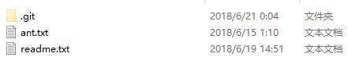

<!--
 * @Author: johnjeep
 * @Date: 2019-04-04 23:28:59
 * @LastEditors: johnjeep
 * @LastEditTime: 2022-12-27 22:37:56
 * @Description: git基础命令学习 
 * Copyright (c) 2022 by johnjeep, All Rights Reserved. 
-->

<!-- TOC -->

- [1. Git Command](#1-git-command)
  - [1.1. Git init](#11-git-init)
  - [1.2. Git add](#12-git-add)
  - [1.3. Git log](#13-git-log)
  - [1.4. Git tag](#14-git-tag)
  - [1.5. Git alias](#15-git-alias)
  - [1.6. Git checkout](#16-git-checkout)
  - [1.7. Git commit](#17-git-commit)
  - [1.8. Git diff](#18-git-diff)
  - [1.9. Git stash](#19-git-stash)
  - [1.10. Git blame](#110-git-blame)
  - [1.11. Git bisect](#111-git-bisect)
  - [1.12. Git rebase](#112-git-rebase)
  - [1.13. Git revert](#113-git-revert)
  - [1.14. Git Reset](#114-git-reset)
  - [1.15. Removing or restore files](#115-removing-or-restore-files)
    - [1.15.1. remove](#1151-remove)
    - [1.15.2. restore](#1152-restore)
  - [1.16. other command](#116-other-command)
- [2. Git branch](#2-git-branch)
  - [2.1. Local repo branch](#21-local-repo-branch)
  - [2.2. Remote repo branch](#22-remote-repo-branch)
  - [2.3. Branches Principle](#23-branches-principle)
  - [2.4. Branches conflict](#24-branches-conflict)
- [3. Git 四区](#3-git-四区)
  - [3.1. Workspace](#31-workspace)
  - [3.2. Index](#32-index)
  - [3.3. Local repository](#33-local-repository)
  - [3.4. Remote repository](#34-remote-repository)
    - [3.4.1. Git remote](#341-git-remote)
    - [3.4.2. Git pull \&\& Git fetch](#342-git-pull--git-fetch)
    - [3.4.3. 远程仓库与本地的关联](#343-远程仓库与本地的关联)
- [4. Git config](#4-git-config)
- [5. Git 代理配置](#5-git-代理配置)
- [6. 提交代码总结](#6-提交代码总结)
  - [6.1. 第一次提交](#61-第一次提交)
  - [6.2. 不是第一次提交](#62-不是第一次提交)
- [7. Git 常用命令](#7-git-常用命令)
- [8. Reference](#8-reference)

<!-- /TOC -->

# 1. Git Command

## 1.1. Git init

- `git init` 初始化一个Git仓库 

## 1.2. Git add

- `git add <file>` 添加文件到暂存区
- `git add -p(patch)` 依次存储每一个文件的改动，包括文件中做的哪些些改动

## 1.3. Git log

- `git log` 查看历史记录。按提交时间列出所有的更新，最近的更新排在最上面。显示的有HASH散列码、提交日期、提交的注释等。
  - `HEAD` 表示当前版本，下标从零开始。
  - `HEAD^` 上一个版本就是，`HEAD^^` 上上一个版本就是,当然往上100个版本写100个^比较容易数不过来，所以写成`HEAD~100`
- `git log -g`: 按照标准日志的格式输出引用日志 `reflog`
- `git log -p` 打印提交更新的所有内容，包括文件的内容
- `git log -p -2` 显示最近两次提交的内容
- `git log --stat` 显示每次提交的简略统计信息，包括多少个文件改变、HASH码、日期、提交的注释等信息。
- `git log --pretty=keyword` 指定使用不同于默认格式的方式展示提交历史。keyword 有以下内建的子选项
  - online：将每个提交放在一行显示，查看的提交数很大时非常有用。
  - format：定制自己要显示的记录格式。
- `git log --graph`：显示 ASCII 图形表示的分支合并历史，常与`--pretty=format`结合使用。例如：`git log --pretty=format:"%h %s" --graph`
- `git log --all --graph --decorate` 用 ASCII 图像化显示所有提交的历史记录、各个分支的指向以及项目的分支分岔情况。
- `git log --since=2.weeks` 列出所有最近两周内的提交。since与until按照时间对提交的内容做筛选，后面可以直接跟特定的时间。`--since=2020-01-07`
- `git log -S 筛选内容`  列出那些添加或移除了某些字符串的提交。
- `git fsck --full`: 显示出所有没有被其他对象指向的对象。`git fsck` 检查所有数据库的完整性。
- `gir log --name-status` 显示每次修改的文件列表及修改状态：新增、修改、删除。
- `git log --name-only` 只显示每次修改的文件列表

------------------------------------------------------------------------

- `git whatchanged`  显示每次修改的文件列表
- `git whatchanged --stat` 显示每次修改的文件列表及统计信息
- `git reflog expire --expire=now --all` 清除所有 `reflog` 的引用
- `git show` 显示最后一次文件改变的具体内容


## 1.4. Git tag

Git tag 有两种类型。

- 轻量标签（lightweight）：很像一个不会改变的分支——它只是一个特定提交的引用。
  - 本质上是将提交校验和存储到一个文件中——没有保存任何其他信息。 
  - `git tag 标签名`创建标签
- 附注标签（annotated）：存储在 Git 数据库中的一个完整对象
  - `git tag -a v1.0 -m "first commit"` 创建标签;`-m`选项指定了一条将会存储在标签中的信息。
  - `git show 标签名`看到标签信息与对应的提交信息

------------------------------------------------------

- `git tag -a 标签号 HASH码`后期给指定文件打标签

- `git push origin(仓库别名) 标签名`将标签共享到远程仓库上

- `git push origin --tags`将所有不在远程仓库服务器上的标签全部推送到上面。

- `git tag -d <tagname>`删除掉本地仓库上的标签

- `git push <remote> :refs/tags/<tagname> ` 更新并删除远程仓库标签

- `git tag` 查看历史tag记录

- `git checkout v1.0` 切换到某个tag，查看某个标签所指向的文件版本。
  
  > 注意： 会导致仓库处于分离头指针(detacthed HEAD)状态.在“分离头指针”状态下，如果你做了某些更改然后提交它们，标签不会发生变化，但你的新提交将不属于任何分支，并且将无法访问，除非确切的提交哈希。


## 1.5. Git alias

- `git config --global alias.unstage 'reset HEAD --'`  给取消暂存取一个别名


## 1.6. Git checkout

切换或者创建新分支

- `git checkout  <new_branch_name>`   切换到 new_branch_name 分支下

- `git branch Develop`  新建Develop分支

- `git checkout -b <new_branch_name>`   创建 new_branch_new分支，并切换到当前分支
  
  > Git 2.23 版本之后，使用 `git switch` 替代原先的 `git chechout`。切换到已存在的分支: `git switch testing-branch`; 创建一个新分支并切换到当前分支: `git switch -c new-branch`; 返回到你 checkout 之前的分支: `git switch -`

- `git checkout -b <new_branch_name> origin/feature` 从远程已存在的 `feature` 分支上拉取代码到本地新建的分支 `new_branch_name`，同时切换到新创建的分支上。

用暂存区或者指定 commit 提交内容覆盖工作区内容

- 用暂存区内容覆盖工作区内容 
  - `git checkout readme.txt` 将暂存区中的`readme.txt`文件还原到工作区，如果要还原多个文件，使用**空格**分隔
  - 还原所有文件 `git checkout .`
  - 特别说明：如果checkout后面是文件名称，以下写法更为稳妥：`git checkout -- readme.txt`
    - 文件名称前面有两个**横杠**，并且中间采用**空格**分隔（否则报错）。此种方式可以防止Git出现误判，加入暂存区有一个文件名为`ant`（没有后缀名），恰好当前项目也有有个名为`ant`的分支，这个时候Git会优先将`ant`当做分支处理，于是就有可能导致错误 
- 指定commit提交的内容覆盖工作区 
  - `git checkout Develop -- readme.txt`  将对应分支中的文件(readme.txt)还原到当前分支(Develop)的工作区


## 1.7. Git commit

```sh
参数项
  pick 使用这个参数，commit 信息什么都不用做。
  reword 修改 commit 信息。
  --edit  修改 commit 提交的内容。但是使用这个命令的时候，rebase 操作会停在 commit 提交处，等待修改完毕，使用 git add . 和  git commit --amend 修改提交，git rebase --continue 继续 rebase 进程。
  --squash 将当前需要改变的commit信息与之前commit提交的信息进行合并，把融合的信息保存到融合后的提交中。
  --fixup 放弃融合后提交的提交信息。
  exec 在新的一行使用shell来运行commit信息。
  drop 删除commit 提交信息。
```

- 修改最近一次的注释
  - `git commit --amend` 修改最后一次提交的注释 
  - `git rebase --continue` 执行修改的commit
  - push到远程GitHub，若有冲突，需要将远程repository的代码pull到本地，然后再push到远程repository。


- 修改历史提交的注释
  - `git log -n 4` 查看最近4次操作的日志
  - `git rabase -i HEAD~n` 修改倒数第n次的commit
  - 将`pick`修改为`edit`
  - `git commit --amend`修改commit的内容
  - `git rebase --continue` 执行修改的commit
  - push到远程GitHub，若有冲突，需要将远程repository的代码pull到本地，然后再push到远程repository。


Git commit 提交规范：请参考 [Git-commit-convertion.md](./Git-commit-convertion.md) 文档。


## 1.8. Git diff

- `git diff` 比较工作区和暂存区之间的差异

- `git diff HEAD` 比较工作区与最新本地仓库之间的差异

- `git diff --cached`比较暂存区与最新本地仓库的差异

- `git diff --stat <local branch> <remote branch>` 比较本地分支与远程指定分支之间的差异。

  - 统计有哪些文件被改动，有多少文件被改动，使用 `--stat` 参数。
  
    例如，比较本地分支 `feat_grpc` 与远程分支 `dev` 之间的差异
  
    ```
    git diff --stat feat_grpc  remotes/origin/dev
    ```
  
  - 查看指定路径下文件的详细差别。
  
    ```shell
    // 注意：路径名要在仓库的根路径之下
    git diff feat_grpc  remotes/origin/dev /src/comm.cpp
    ```
  
  - 查看本地仓库中分支为 `master` 的文件与 Github 远程仓库中别名为 `origin` 下 `master` 分支文件的差异。
  
    ```shell
    git diff master origin/master
    ```


## 1.9. Git stash

- Git 提供了一个 `stash` 功能，把当前工作现场”储藏”起来，等以后恢复现场后继续工作：`git stash`，去解决 Bug 问题。
- `git stash list` ：查看所有已存储的工作现场 。
- Git 把 `stash` 内容存在某个地方了，需要恢复存储的内容，有两个办法
  1. 用 `git stash apply` 恢复，但是恢复后，stash内容并不删除，你需要用 `git stash drop` 来删除
  2. 用 `git stash pop`，恢复的同时把 `stash` 内容也删了。

## 1.10. Git blame


## 1.11. Git bisect

找到某个 bug 是哪次 commit 的。


## 1.12. Git rebase

Rebase 官方翻译为 “变基”，我觉得翻译为**重新改变基准**更为合适。`git rebase` 和 `git merge` 都可以用于分支的合并，但使用 `git rebase` 合并的分支，提交（commit）信息是线性的，因为它会清除当前分支提交（commit）的版本历史信息，只选择保留最后一次的提交信息；而 `merge` 是把不同分支的最终结果合并在一起。

总结下，`git rebase` 有两个功能

1. 压缩提交的记录。
2. 分支合并时，让合并的分支更简洁，只选择保留最后一次的提交信息，线性显示提交的记录，观察起来更优美。


## 1.13. Git revert


## 1.14. Git Reset

`git reset` 命令是 Git 提供的后悔药之一，它可以帮我们把内容恢复到指定的`commit`提交版本。

`reset`翻译成中文有**重置**的意思，恰如起名，`git reset` 命令可以重置当前分支所指向提交的位置。使用 `git reset`命令后`commit `提交信息依然存在，只是当前分支所指向的`commit`提交进行了重置，分支所指向的新 `commit` 提交之后的提交就像消失了一样（`git log`无法查询到）。

`git reset`后面紧跟一个指定的标识项。标识可以是`sha-1`值或者`HEAD`、`HEAD^`或者分支名称等形式。

- 标识为 `commit` 提交信息的 hash 值。比如： `git reset 5609309 --hard`，也可以

- 标识为分支名称。比如：`git reset master^ --hard`。

- 标识为 `HEAD`。例如：`git reset HEAD^ --hard`

- 标识为`^`。`^` 表示当前分支所指向提交的前一个提交，`^^`表示当前分支所指向提交的前一个分支的前一个分支，以此类推；`^^`过多自然不太方便，可以使用`HEAD~2`表示

`mixed`、`soft` 和 `hard` 参数项的区别

- `--mixed`：默认值，当重置分支所指向 `commit` 提交位置时，暂存区中的内容会被新指向的 `commit` 提交内容所替换，工作区内容不变，即它回退到某个版本，只保留源码，回退 commit 和 index 信息。
- `--soft`：暂存区和工作区的内容都保持原样，不会被替换，只回退了 commit 的信息。
- `--hard`：暂存区和工作区的内容都会被新指向的`commit`提交内容所替换，彻底回退到某个版本，本地的源码也会变为上一个版本的内容；`git reset --hard`只影响被跟踪的文件，如果工作区有新增的文件，并不会被影响。

<font color=red>注意</font>

> 假如`commit`已经被`push`到远程仓库上，那么其他开发人员可能会基于对应的`commit`提交进行开发产生新的`commit`，如果此时进行`reset`操作，会造成其他开发人员的提交历史丢失，这可能会产生严重后果。

## 1.15. Removing or restore files

### 1.15.1. remove

- `rm` 删除命令，指令前面不加 `git`
  
  - 删除本地目录文件，不会删除提交到暂存区的文件。例如：`rm filename`  

- `git rm` 是 git 中封装的 `rm` 命令。
  
  - `git rm filename`：，删除已经提交到本地版本库中的内容，同时删除暂存区中的内容。
  
  - `git rm --cache filename`：只删除暂存区中的 filename 文件。
    
    > **特别说明**：处于未跟踪状态 (untracked) 只是没有存在于暂存区。

- 删除暂存区步骤
  
  ```bash
  git rm filename
  git commit -m "comment content"
  git push origin master
  ```

- 删除暂存区并更新远程仓库
  
  ```bash
  git rm --cached filename
  git commit -m "comment content"
  git push origin master --force
  ```

### 1.15.2. restore

- 恢复工作区中被删除的文件   
  
  - `rm` 指令只是将工作区中的文件删除，已提交到暂存区中的文件依然存在。此时想要恢复被 `rm` 指令删除的文件，只要将暂存区内容恢复到工作区即可。
  
  - `git checkout filename` ：恢复误删除的单个文件 
  
  - 恢复误删除的多个个文件 
    
    `git ls-files -d`：查看误删除的有哪些文件
    
    `git ls-files -d | xargs -i git checkout {}` 恢复多个文件

- 恢复暂存区中误删除的文件
  
  - `git rm` 命令会删除已经提交到本地版本库中的内容，同时暂存区中的内容也会被删除。若要想恢复删除的内容，那么只能从 `commit` 提交记录中恢复。使用 `git checkout HEAD readme.txt` 命令， 将最后一次 `commit` 提交的 `readme.txt` 文件从本地仓库中恢复。

- <font color="red">任何情况都可以恢复吗? </font>
  
  > 当然不是，如果你把`.gti`目录删除了，那肯定是无法再恢复。实质上，之所以能将删除的文件恢复，因为在`.git`目录中有备份，`Git`会将**暂存区**或者**历史提交**中内容来恢复。


## 1.16. other command

- `git gc`: 清理不必要的文件并优化本地存储库（Cleanup unnecessary files and optimize the local repository）。

- `git count-objects -v`: 计算未打包的对象数量及其磁盘消耗（Count unpacked number of objects and their disk consumption）。

- `git update`
  
  windows 下更新 git，使用命令 `git update-git-for-windows`


# 2. Git branch

## 2.1. Local repo branch 

本地仓库分支常用命令。

- `git branch` 只查看本地仓库分支。
- `git branch -r` 只查看远程仓库的所有分支。
- `git branch -a` 查看远程和本地的已有的所有分支。
- `git branch -v` 查看每个分支最后一次提交的内容。
- `git reflog show --date=iso master`  查看指定分支的历次更改记录。
- `git branch --merge` 查看哪些分支已经合并到当前分支。
- `git branch --no-merged` 查看所有包含未合并工作的分支。
- `git branch branch_name` 创建一个分支，且不会自动切换到新分支中去。
- `git merge`合并分支：在分支`a`下写代码，与分支`master`上的代码合并
  - 第一步，切换到分支`master`下`git chechout master`
  - 第二步，与分支`a`合并`git merge a`
- `git branch -d a` 删除指定分支 a 。删除分支时，不要在当前分支删除当前分支，一定要切换的到另一个分支去删除。
- `git branch -D a` 强制把未合并的分支删除
- `git log --oneline --decorate --graph --all` 查看提交历史、各个分支的指向以及项目的分支分叉情况
- `git stash save` 切换分支之前保存要修改的文件，不想提交之前的工作
- `git stash list` 查看存储在栈上的文件
- `git stash apply` 将最近存储的文件重新使用
- `git stash apply stash_name`使用之前某次存储的文件

## 2.2. Remote repo branch

远程仓库分支常用命令。

- `git branch --remote` 查看远程仓库分支

- `git push <remote> --delete <branch>` 命令行终端删除远程仓库分支，remote 可为远程仓库地址或者是仓库的别名，branch 为待删除分支的名字。
  
  ```bash
  git push origin --delete feature_0426
  ```

常用分支命名：
<font color="red"> 
develop<br>
topic <br>
proposed<br>
hotfix(紧急分支)<br> 
iss534<br>
experiment<br> 
</font>

重命名远程分支

1. 本地分支改名： `git branch -m 旧分支名 新分支名`
2.  删除远程分支：`git push --delete origin 旧分支名`
3. 将新分支名推上去： `git push origin 新分支名`
4. 将新本地分支和远程相连： `git branch --set-upsteam-to origin/新分支名`


## 2.3. Branches Principle

<font color="red">Git 中的分支只是指向提交对象之一的轻量级可移动指针。</font>

Git 是怎么创建新分支的呢？ 很简单，它只是为你创建了一个可以移动的新的指针。 比如，创建一个 testing 分支， 你需要使用 git branch 命令：

```bash
git branch testing
```


> Git 分支的本质是一个文件：包含所指对象的校验和（长度为 40 的 SHA-1 character），所以它的创建和销毁都非常高效。 创建一个新分支就相当于往一个文件中写入 41 个 bytes (40 characters 和 1 newline)。

Git 又是怎么知道当前在哪一个分支上呢？ 也很简单，它有一个名为 HEAD 的特殊指针。 请注意它和许多其它版本控制系统（如 Subversion 或 CVS）里的 HEAD 概念完全不同。 在 Git中，它是一个指针，指向当前所在的本地分支（译注：将 HEAD 想象为当前分支的别名）。 在本例中，你仍然在 master 分支上。 因为 git branch 命令仅仅 创建 一个新分支，并不会自动切换到新分支中去。


<font color="red">HEAD指针指向的当前所在分支，HEAD 分支随着提交操作自动向前移动。</font>

每次提交，Git都把它们串成一条时间线，这条时间线就是一个分支。`HEAD` 不是指向提交，而是**指向** `master`，`master` 才是**指向**提交的，所以`HEAD` 指向当前所在分支。

一开始的时候，`master`分支是一条线，Git 用`master`指向最新的提交，再用`HEAD`**指向**`master`，就能确定当前分支，以及当前分支的提交点：


每次提交，`master` 分支都会向前移动一步，这样，随着你不断提交，`master`分支的线也越来越长。当创建一个新的分支时，Git 就新建了一个指针叫 `testing`，指向与`master` 相同的提交，当你 checkout 到 `testing` 分支下时，再把 `HEAD` 指针指向 `testing`，就表示当前分支在 `testing`上:


Git创建一个分支很快，因为除了增加一个 `testing` 指针，改变 `HEAD` 的指向，工作区的文件都没有任何变化！不过，从现在开始，对工作区的修改和提交就是针对`testing`分支了，比如新提交一次后，`testing`指针往前移动一步，而`master`指针不变：


此时 Git 工作区中的 分支历史：


假如我们在`testing`上的工作完成了，就可以把`testing`合并到`master`上。Git怎么合并呢？最简单的方法，就是直接把`master`指向`testing`的当前提交，就完成了合并：

合并完分支后，甚至可以删除`testing`分支。删除`testing`分支就是把`testing`指针给删掉，删掉后，我们就剩下了一条`master`分支：

## 2.4. Branches conflict

为什么会产冲突？

- 两个分支中修改了相同的文件。**注意：** 两个分支中分别修改了不同文件中的部分，不会产生冲突，可以直接将这两部分合并。
- 两个分支中修改了同一个文件的名称 

采用 `Git rebase`与 `git merge` 进行解决

- 什么时候用`rebase`？
  
  - 合并多次提交纪录
    
    例如：合并前4次提交的记录`git rebase -i HEAD~4`，合并的 commit 不能是已经 push 到远程仓库的记录。
    
    > 本质是先取消自己的提交，临时保存，然后把当前分支更新到最新的origin分支，最后应用自己的提交。
  
  - 合并分支
    
    <font color="red"> 注意: </font> 已经推送到github远程仓库的文件（多人开发的重要分支）不要使用 `git rebase`，否则远程仓库的分支记录会被修改，别人就不能正常的提交了。

- 什么时候用 `merge`?
  
  - 默认情况下，Git执行"快进式合并"（fast-farward merge），会直接将Master分支指向Develop分支。使用 `--no-ff`  参数，用普通模式合并，在 master 主分支上生成一个新的节点。可以在分支历史上看哪些曾经做过哪些的合并；而 `fast forward` 合并，则没有合并操作的记录，会丢掉分支信息。`git merge --no-ff -m "merge with   no-ff" dev` 
  - 将两个分支进行合并提交。将一个分支的变更集成到另一个分支的变更。 

- 分支合并步骤
  
  - 从远程仓库拉取数据 `git fetch origin master` 。有时需要将远程仓库分支的数据拉取到本地临时分支，可执行 `git fetch origin master:temp`
  
  - 查看远程仓库的版本 `git remote -v`
  
  - 比较本地仓库与远程仓库的区别 `git diff master origin/master`
  
  - 手动解决冲突，提交（commit）信息。
  
  - 合并冲突，将远程仓库与本地仓库合并 `git merge origin master`

> Git **合并分支**很快！就改改指针，工作区内容不变！

参考

- [彻底搞懂 Git-Rebase](http://jartto.wang/2018/12/11/git-rebase/)
- [Git冲突与解决方法](https://www.cnblogs.com/gavincoder/p/9071959.html) 
- [Git分支合并冲突解决](https://www.cnblogs.com/shuimuzhushui/p/9022549.html)


# 3. Git 四区


Git 与 GitHub 使用，有四个区，需要理解。

- `Workspace`：名为工作区，也可以称为 Working Directory (工作目录)，是你电脑存放代码的地方。
- `Index`：名为暂存区，是 `.git` 目录下的一个 `index` 文件，它是 **指向** 文件的一个索引。
- `local repository`：名为本地版本库，是 `Git` 用来保存本地项目的元数据和对象数据库的地方。
- `Remote repository`：名为远程仓库，是远程服务器存放代码的地方。

## 3.1. Workspace

Workspace (工作区) 也可以称为 Working Directory (工作目录)，是你电脑存放代码的地方。

<div align="center"> 

</div>


工作区目录下的每一个文件只有两种状态：已跟踪（tracked：添加到暂存区）或未跟踪（untracked：没有添加都暂存区）。

## 3.2. Index

在工作区路径下打开终端执行 `git init` 指令后，工作区内生成一个 `.git` 的文件，默认情况下，该文件的属性是隐藏的，不可见。**暂存区** 就是 `.git` 目录下有一个 `index` 文件，这个`index` 中文翻译为 `暂存区`，它是 **指向** 文件的一个索引。而真正的文件是存储在`.git/objects`目录中。

当删除 **暂存区** 内容时，其实就是删除 `index` 文件中的内容，但 `.git/objects` 目录中的内容不会被删除。

<div align="center"> 

</div>


1. Git清空暂存区
   
   - 暂存区实质是 `.git` 目录下的 `index` 文件，只要将此文件删除，那么暂存区就被清空。可用这条命令来将暂存区中的内容清空 `rm .git /index` 。

2. 暂存区存在的必要性
   
   - 有些朋友感觉暂存区多余，其实并非如此，通过这个过渡性区域可以使提交更加条理，避免无用琐碎提交。
   - 暂存区就如同一个临时性仓库，可以将来自工作区的新文件或者修改文件暂时存放起来，然后统一提交到分支中的版本库中。

3. `git ls-files` 查看暂存区里所有的内容，后面可加下面任意的选项参数。
   
   - `--cached(-c)` 显示暂存区中的文件； `git ls-files` 命令的默认参数是 `--cached(-c)`，默认情况下默认参数没有显示。
   - `--deleted(-d)` 显示删除的文件
   - `--modified(-m)` 显示修改过的文件
   - `--other(-o)` 显示没有被git跟踪的文件
   - `--stage(-s)` 显示mode以及文件对应的 `Blob` 对象，可以获取暂存区中对应文件里面的内容。

## 3.3. Local repository

Git本地版本库是 `Git` 用来保存项目的元数据和对象数据库的地方。从其它计算机克隆仓库时，拷贝的就是这里的数据。

工作目录下有一个默认隐藏的目录`.git`，它并不属于工作目录，而是 Git 的本地版本库（Repository）。而版本库中内容很多，并且都很重要，有两个是我们实际操作中经常要遇到的，那就是暂存区（`index`）和分支（`branch`）。

将文件最终提交到版本库基本流程如下：

- `git add`    将工作区未跟踪和修改文件提交到暂存区。

- `git commit` 将暂存区内容提交到版本库中，并执行更新 HEAD 指向的指针，这样就完成了引用与提交、提交与改动快照的——对应了。
  
  <div align="center"> 
  
  </div>

Git清空版本库

- `rm -rf .git` 删除当前目录下的版本库（`.git`目录）
- `git init`    重新初始化一个全新的版本库

## 3.4. Remote repository

### 3.4.1. Git remote

- `git remote -v` 显示远程仓库的别名和对应的 URL。

- `git remote show remote_name` 查看某个远程仓库。

- `git remote rename old_name new_name` 重命名原仓库名字。

- `git remote rm remote_name` 移除一个远程仓库。

- `git remote add <alias_name> <url>` 本地仓库与仓库地址为 URL，别名为 `alias_name` 的远程仓库进行关联。

- 有些分支在远程其实早就被删除了，但是在你本地依然可以看见这些被删除的分支，可用下面的命令删除远程服务器上不再存在的远程分支引用。
  
  ```bash
  git remote prune origin
  git remote update --prune
  ```

### 3.4.2. Git pull && Git fetch

- `git pull`: 将远程仓库上当前分支的数据抓取到本地仓库，并自动合并远程分支与本地仓库的分支，`git pull` 相当于 `git fetch` 和 `git merge` 两步操作的叠加。

- `git fetch`: 将远程仓库上当前分支的数据抓取到本地仓库，不修改本地仓库中的内容，需要自己手动进行合并。

- `git fetch <远程仓库名> <分支名> : <目标分支>`
  
  - 远程仓库名可以是仓库的别名，也可以直接是仓库的 URL 地址。 
  - `git fetch origin master : temp` 拉取远程 origin 仓库中 master 分支的数据到本地新建的 temp 分支。

- `git push <远程主机名> <本地分支名> : <远程分支名>`
  
  - `git push origin main : main` 将本地 main 分支中的数据推送到远程 origin 仓库的 main 分支上。若后面不指定 `: <远程分支名>`，git 会默认将当前本地的分支提交到远程仓库的默认分支中。

### 3.4.3. 远程仓库与本地的关联

- `git remote add origin   git@github.com:michaelliao/learngit.git` 将本地仓库添加到远程Git仓库，默认别名为 `origin`

- `git push origin master` 当前本地仓库内容推送到别名为 `origin`，分支为 `master` 的远程仓库。

- `git clone <URL> <folder_name>` 
  
  - 本地位置克隆一个远程仓库地址为 `URL` 的仓库，并将其写到 `folder_name` 文件中。这个 `<folder_name>` 是选择项，若不指定文件名，则克隆后的仓库名默认与远程仓库的名字一样。
  - `git clone https://github.com/xxxxx/Guide.git` 远程Guide仓库克隆到一个同名的本地仓库
  - `git clone https://github.com/xxxxx/Guide.git temp` 远程Guide仓库中内容克隆到名称为 `temp` 的本地仓库。

- `git push -u origin master` 将当前分支的内容推送给远程仓库 `origin` 的 `master` 分支
  
  - 参数 `-u`，推送的同时将 `origin` 仓库的 `master` 分支设置为本地仓库当前分支的 `upstream（上游）`。
  - git不但会把本地的`master`分支内容推送的远程新的`master`分支，还会把本地的`master`分支和远程的`master`分支关联起来，在以后的推送或者拉取时就可以简化命令。
  
  参考： http://kuanghy.github.io/2017/03/19/git-lf-or-crlf)


# 4. Git config

配置项目或仓库级别用户名和密码，该配置位于 `.git` 路径下的 `config` 文件中。

```bash
git config user.name=xxxxx
git config user.email=xxxx@gmail.com
```

配置系统用户级别的用户名和密码，该配置位于用户家目录下的 `.gitconfig` 文件中。

```bash
git config --global user.name=xxxxx
git config --global user.email=xxxx@gmail.com
```

配置当前操作系统下，所有用户使用 git 的用户名和密码，一般不建议这么做，不太安全。

```bash
git config --system user.name=xxxxx
git config --system user.email=xxxx@gmail.com
```

存储用户名

```bash
git config --local credential.helper store
```

# 5. Git 代理配置

只对github进行代理，不影响国内的仓库

```bash
git config --global http.https//github.com.proxy http://127.0.0.1:8001
git config --global https.https//github.com.proxy https://127.0.0.1:8001
```

设置全局代理，国内的仓库速度也会收到一定的影响。

```bash
git config --global http.proxy http://127.0.0.1:1080
git config --global https.proxy https://127.0.0.1:1080

// 取消全局代理
git config --global --unset http.proxy
git config --global --unset https.proxy
```

Windows下修改Host文件

```bash
192.30.253.112 github.com
192.30.253.113 github.com
151.101.185.194 github.global.ssl.fastly.net
```

- 参考 
  - [Git 代理配置方案](https://wiki.imalan.cn/archives/Git%20%E4%BB%A3%E7%90%86%E9%85%8D%E7%BD%AE%E6%96%B9%E6%A1%88/)


# 6. 提交代码总结

## 6.1. 第一次提交

1. `git init`  初始化
2. `git add README.md`   提交到暂存库
3. `git commit -m "first commit"`   为提交的文件添加注释说明
4. `git remote add origin git@github.com:michaelliao/learngit.git`  本地Git库与远程的仓库关联
5. `git push -u origin master`      本地库的所有内容推送到远程库上


## 6.2. 不是第一次提交

1. `git add README.md`              提交到暂存库
2. `git commit -m "first commit"`   为提交的文件添加注释说明
3. `git push origin master`         本地库的所有内容推送到远程库上


# 7. Git 常用命令

- `git init`初始化一个Git仓库 。
- `git add <file>` 添加文件到暂存区。
- `git add -p(patch)` 依次存储每一个文件的改动，包括文件中做的哪些改动。
- `git commit -m <message>` 给添加到暂存区的文件增加注释，`-m` 代表是提交信息。
- `git status` 查看当前工作区的状态。
- `git diff` 比较工作区中当前文件和暂存区快照之间的差异。
- `git diff --stage` 查看已暂存的将要添加到下次提交里的内容。
- `git difftool` 使用图像化工具查看工作区与暂存区之间的差异。
- `git reflog` 查看引用日志。每次提交或改变分支都会改变引用日志 `reflog`。
- `git reset --hard HEAD^` 回退到 `HEAD^` 版本。
- `git config --list` 列出 Git 所有当的配置信息。
- `git help <verb>` 查看帮助，verb为 Git 的关键字。


# 8. Reference
- [git-scm.com](https://git-scm.com/docs): Git官方参考手册。
- [**git-recipes**](https://github.com/geeeeeeeeek/git-recipes)：github上开源的git中文食谱，收集了许多国外优秀的文章，质量很高。
- [图解Git](http://marklodato.github.io/visual-git-guide/index-zh-cn.html): 采用画图的方式来理解Git.
- [Learn Git Branching](https://learngitbranching.js.org/)：通过玩游戏的方式来学习Git。
- [Version Control (Git)](https://missing.csail.mit.edu/2020/version-control/): MIT 2020 年开设的一门 missing-semester 课程，这是 Version Control (Git) 章节。
- [Git头指针分离状态](https://blog.csdn.net/qq_32907195/article/details/109217034)